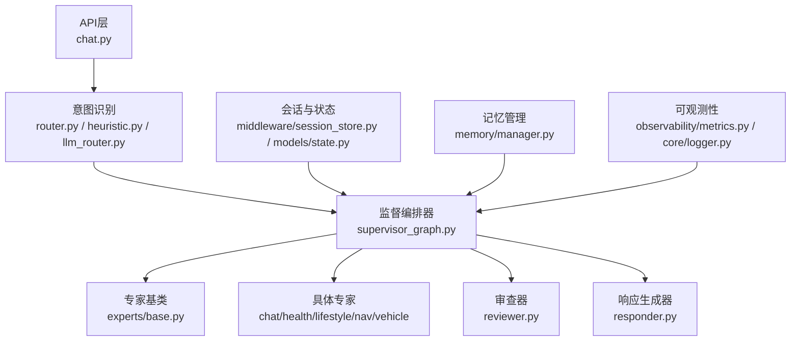
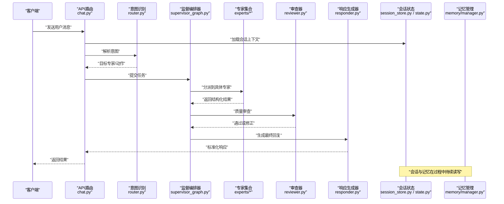
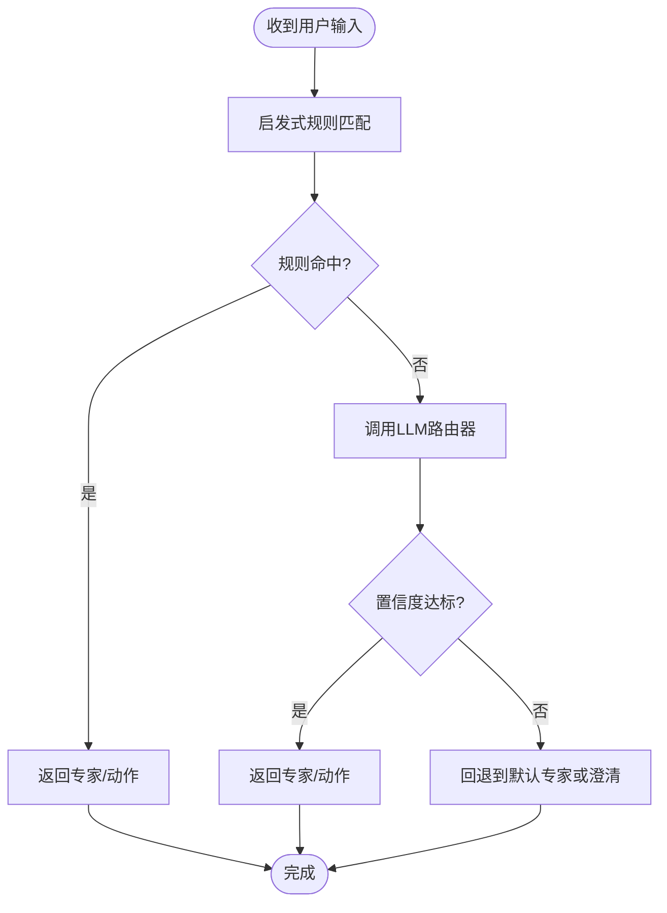
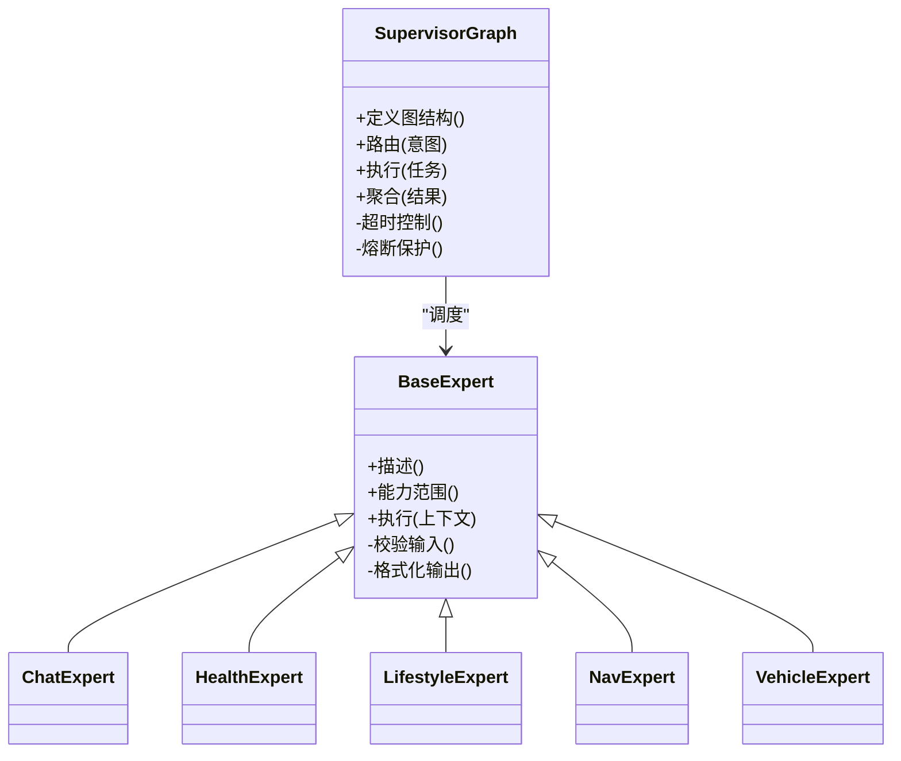
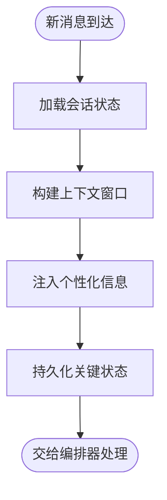
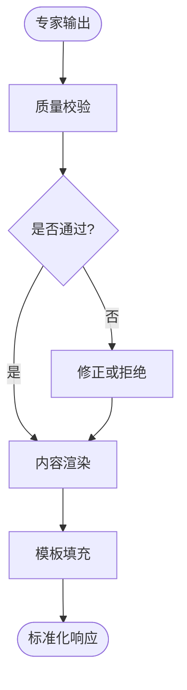
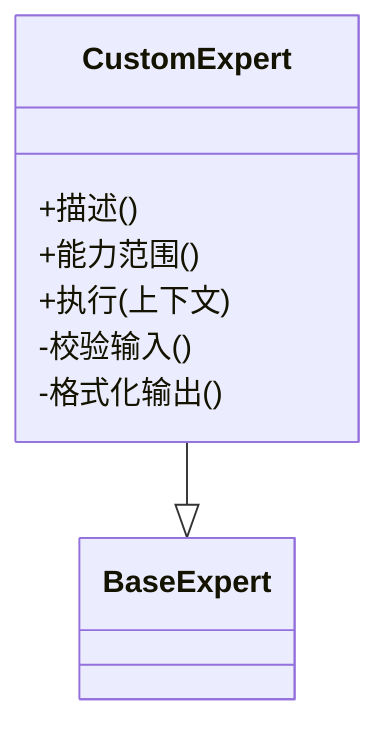
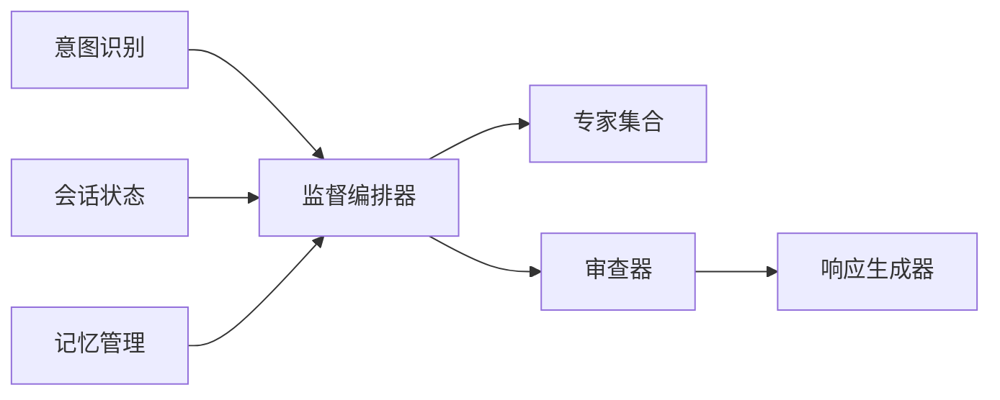

# AI智能助手系统

<cite>
**本文引用的文件**
- [backend_design/nexus/main.py](file://backend_design/nexus/main.py)
- [backend_design/nexus/config.py](file://backend_design/nexus/config.py)
- [backend_design/nexus/agent/supervisor_graph.py](file://backend_design/nexus/agent/supervisor_graph.py)
- [backend_design/nexus/agent/responder.py](file://backend_design/nexus/agent/responder.py)
- [backend_design/nexus/agent/reviewer.py](file://backend_design/nexus/agent/reviewer.py)
- [backend_design/nexus/agent/experts/base.py](file://backend_design/nexus/agent/experts/base.py)
- [backend_design/nexus/agent/experts/chat_expert.py](file://backend_design/nexus/agent/experts/chat_expert.py)
- [backend_design/nexus/agent/experts/health_expert.py](file://backend_design/nexus/agent/experts/health_expert.py)
- [backend_design/nexus/agent/experts/lifestyle_expert.py](file://backend_design/nexus/agent/experts/lifestyle_expert.py)
- [backend_design/nexus/agent/experts/nav_expert.py](file://backend_design/nexus/agent/experts/nav_expert.py)
- [backend_design/nexus/agent/experts/vehicle_expert.py](file://backend_design/nexus/agent/experts/vehicle_expert.py)
- [backend_design/nexus/intent/router.py](file://backend_design/nexus/intent/router.py)
- [backend_design/nexus/intent/heuristic.py](file://backend_design/nexus/intent/heuristic.py)
- [backend_design/nexus/intent/llm_router.py](file://backend_design/nexus/intent/llm_router.py)
- [backend_design/nexus/models/state.py](file://backend_design/nexus/models/state.py)
- [backend_design/nexus/memory/manager.py](file://backend_design/nexus/memory/manager.py)
- [backend_design/nexus/middleware/session_store.py](file://backend_design/nexus/middleware/session_store.py)
- [backend_design/nexus/api/routes/chat.py](file://backend_design/nexus/api/routes/chat.py)
- [backend_design/nexus/core/exceptions.py](file://backend_design/nexus/core/exceptions.py)
- [backend_design/nexus/core/logger.py](file://backend_design/nexus/core/logger.py)
- [backend_design/nexus/observability/metrics.py](file://backend_design/nexus/observability/metrics.py)
</cite>

## 目录
1. [简介](#简介)
2. [项目结构](#项目结构)
3. [核心组件](#核心组件)
4. [架构总览](#架构总览)
5. [详细组件分析](#详细组件分析)
6. [依赖关系分析](#依赖关系分析)
7. [性能考量](#性能考量)
8. [故障排查指南](#故障排查指南)
9. [结论](#结论)
10. [附录](#附录)

## 简介
本技术文档面向AI智能助手系统的后端实现，重点阐述多专家架构的设计与落地、意图识别模块的启发式规则与大模型路由协同机制、对话管理器的状态维护与上下文处理、响应生成器的内容构建策略与质量控制流程。同时提供专家扩展与自定义开发指南，并给出典型对话流程与错误处理示例，帮助读者快速理解并高效扩展系统能力。

## 项目结构
系统采用分层与模块化组织方式：
- 入口与配置：应用启动、服务装配与全局配置
- 意图识别：基于规则与大模型的混合路由
- 多专家编排：监督图（Supervisor）负责任务分发与结果整合
- 专家实现：聊天、健康、生活方式、导航、车辆等垂直领域专家
- 对话管理与记忆：会话状态、长期记忆与冲突消解
- API网关与中间件：HTTP/WebSocket接入、限流、缓存与会话存储
- 可观测性：指标采集、日志与追踪

图表来源
- [backend_design/nexus/api/routes/chat.py](file://backend_design/nexus/api/routes/chat.py)
- [backend_design/nexus/intent/router.py](file://backend_design/nexus/intent/router.py)
- [backend_design/nexus/intent/heuristic.py](file://backend_design/nexus/intent/heuristic.py)
- [backend_design/nexus/intent/llm_router.py](file://backend_design/nexus/intent/llm_router.py)
- [backend_design/nexus/agent/supervisor_graph.py](file://backend_design/nexus/agent/supervisor_graph.py)
- [backend_design/nexus/agent/experts/base.py](file://backend_design/nexus/agent/experts/base.py)
- [backend_design/nexus/agent/reviewer.py](file://backend_design/nexus/agent/reviewer.py)
- [backend_design/nexus/agent/responder.py](file://backend_design/nexus/agent/responder.py)
- [backend_design/nexus/middleware/session_store.py](file://backend_design/nexus/middleware/session_store.py)
- [backend_design/nexus/models/state.py](file://backend_design/nexus/models/state.py)
- [backend_design/nexus/memory/manager.py](file://backend_design/nexus/memory/manager.py)
- [backend_design/nexus/observability/metrics.py](file://backend_design/nexus/observability/metrics.py)
- [backend_design/nexus/core/logger.py](file://backend_design/nexus/core/logger.py)

章节来源
- [backend_design/nexus/main.py](file://backend_design/nexus/main.py)
- [backend_design/nexus/config.py](file://backend_design/nexus/config.py)

## 核心组件
- 意图识别模块：结合启发式规则与LLM路由器进行意图分类与专家选择，支持降级与回退策略
- 监督编排器：以图结构驱动专家调用、并行/串行执行、超时控制与结果聚合
- 专家体系：统一接口抽象，按领域拆分；内置聊天、健康、生活方式、导航、车辆等专家
- 审查器：对专家输出进行质量校验、安全过滤与格式规范化
- 响应生成器：将结构化结果渲染为最终回复，支持多模态与富文本
- 对话管理器：维护会话状态、历史摘要与上下文窗口，持久化关键信息
- 记忆管理：长期记忆抽取、更新与冲突消解，支撑个性化与连续性
- 可观测性与日志：指标埋点、结构化日志与链路追踪

章节来源
- [backend_design/nexus/intent/router.py](file://backend_design/nexus/intent/router.py)
- [backend_design/nexus/intent/heuristic.py](file://backend_design/nexus/intent/heuristic.py)
- [backend_design/nexus/intent/llm_router.py](file://backend_design/nexus/intent/llm_router.py)
- [backend_design/nexus/agent/supervisor_graph.py](file://backend_design/nexus/agent/supervisor_graph.py)
- [backend_design/nexus/agent/experts/base.py](file://backend_design/nexus/agent/experts/base.py)
- [backend_design/nexus/agent/reviewer.py](file://backend_design/nexus/agent/reviewer.py)
- [backend_design/nexus/agent/responder.py](file://backend_design/nexus/agent/responder.py)
- [backend_design/nexus/models/state.py](file://backend_design/nexus/models/state.py)
- [backend_design/nexus/memory/manager.py](file://backend_design/nexus/memory/manager.py)
- [backend_design/nexus/observability/metrics.py](file://backend_design/nexus/observability/metrics.py)

## 架构总览
整体数据流从API进入，经意图识别后由监督编排器调度专家执行，审查器把关输出质量，最后由响应生成器组装回复。会话与记忆贯穿全链路，可观测性覆盖关键路径。

图表来源
- [backend_design/nexus/api/routes/chat.py](file://backend_design/nexus/api/routes/chat.py)
- [backend_design/nexus/intent/router.py](file://backend_design/nexus/intent/router.py)
- [backend_design/nexus/agent/supervisor_graph.py](file://backend_design/nexus/agent/supervisor_graph.py)
- [backend_design/nexus/agent/experts/base.py](file://backend_design/nexus/agent/experts/base.py)
- [backend_design/nexus/agent/reviewer.py](file://backend_design/nexus/agent/reviewer.py)
- [backend_design/nexus/agent/responder.py](file://backend_design/nexus/agent/responder.py)
- [backend_design/nexus/middleware/session_store.py](file://backend_design/nexus/middleware/session_store.py)
- [backend_design/nexus/models/state.py](file://backend_design/nexus/models/state.py)
- [backend_design/nexus/memory/manager.py](file://backend_design/nexus/memory/manager.py)

## 详细组件分析

### 意图识别模块
意图识别采用“启发式规则 + LLM路由器”的双通道设计：
- 启发式规则：基于关键词、正则、槽位匹配与领域词典快速判定简单意图，具备低延迟与高稳定性
- LLM路由器：当规则置信度不足时，调用大模型进行语义级意图分类，提高召回率与泛化能力
- 协同策略：先规则后模型，规则命中则直接路由；否则走LLM；两者均失败时回退至默认专家或澄清模式
- 可观测性：记录规则命中率、LLM调用次数与耗时、路由决策分布

图表来源
- [backend_design/nexus/intent/heuristic.py](file://backend_design/nexus/intent/heuristic.py)
- [backend_design/nexus/intent/llm_router.py](file://backend_design/nexus/intent/llm_router.py)
- [backend_design/nexus/intent/router.py](file://backend_design/nexus/intent/router.py)

章节来源
- [backend_design/nexus/intent/router.py](file://backend_design/nexus/intent/router.py)
- [backend_design/nexus/intent/heuristic.py](file://backend_design/nexus/intent/heuristic.py)
- [backend_design/nexus/intent/llm_router.py](file://backend_design/nexus/intent/llm_router.py)

### 多专家架构与监督编排器
监督编排器以图结构组织专家节点与边，支持：
- 任务分发：根据意图识别结果选择专家子图
- 执行策略：串行、并行、条件分支与重试
- 超时与熔断：防止长尾请求拖垮系统
- 结果整合：合并多个专家输出，去重、排序与冲突消解

图表来源
- [backend_design/nexus/agent/supervisor_graph.py](file://backend_design/nexus/agent/supervisor_graph.py)
- [backend_design/nexus/agent/experts/base.py](file://backend_design/nexus/agent/experts/base.py)
- [backend_design/nexus/agent/experts/chat_expert.py](file://backend_design/nexus/agent/experts/chat_expert.py)
- [backend_design/nexus/agent/experts/health_expert.py](file://backend_design/nexus/agent/experts/health_expert.py)
- [backend_design/nexus/agent/experts/lifestyle_expert.py](file://backend_design/nexus/agent/experts/lifestyle_expert.py)
- [backend_design/nexus/agent/experts/nav_expert.py](file://backend_design/nexus/agent/experts/nav_expert.py)
- [backend_design/nexus/agent/experts/vehicle_expert.py](file://backend_design/nexus/agent/experts/vehicle_expert.py)

章节来源
- [backend_design/nexus/agent/supervisor_graph.py](file://backend_design/nexus/agent/supervisor_graph.py)
- [backend_design/nexus/agent/experts/base.py](file://backend_design/nexus/agent/experts/base.py)
- [backend_design/nexus/agent/experts/chat_expert.py](file://backend_design/nexus/agent/experts/chat_expert.py)
- [backend_design/nexus/agent/experts/health_expert.py](file://backend_design/nexus/agent/experts/health_expert.py)
- [backend_design/nexus/agent/experts/lifestyle_expert.py](file://backend_design/nexus/agent/experts/lifestyle_expert.py)
- [backend_design/nexus/agent/experts/nav_expert.py](file://backend_design/nexus/agent/experts/nav_expert.py)
- [backend_design/nexus/agent/experts/vehicle_expert.py](file://backend_design/nexus/agent/experts/vehicle_expert.py)

### 对话管理器与上下文处理
对话管理器负责：
- 会话生命周期：创建、恢复、清理
- 上下文窗口：滑动窗口与摘要压缩，控制Token消耗
- 状态持久化：关键状态落盘，支持跨进程/实例共享
- 个性化注入：偏好、习惯、角色设定等上下文增强

图表来源
- [backend_design/nexus/middleware/session_store.py](file://backend_design/nexus/middleware/session_store.py)
- [backend_design/nexus/models/state.py](file://backend_design/nexus/models/state.py)
- [backend_design/nexus/memory/manager.py](file://backend_design/nexus/memory/manager.py)

章节来源
- [backend_design/nexus/middleware/session_store.py](file://backend_design/nexus/middleware/session_store.py)
- [backend_design/nexus/models/state.py](file://backend_design/nexus/models/state.py)
- [backend_design/nexus/memory/manager.py](file://backend_design/nexus/memory/manager.py)

### 响应生成器与质量控制
响应生成器承担：
- 内容构建：将结构化结果渲染为自然语言或多模态内容
- 质量控制：语法检查、敏感词过滤、事实一致性校验
- 格式规范：统一JSON/Markdown/富文本模板
- 降级策略：当上游异常时返回友好提示或兜底答案

图表来源
- [backend_design/nexus/agent/responder.py](file://backend_design/nexus/agent/responder.py)
- [backend_design/nexus/agent/reviewer.py](file://backend_design/nexus/agent/reviewer.py)

章节来源
- [backend_design/nexus/agent/responder.py](file://backend_design/nexus/agent/responder.py)
- [backend_design/nexus/agent/reviewer.py](file://backend_design/nexus/agent/reviewer.py)

### 专家扩展与自定义开发指南
扩展步骤：
- 继承专家基类，实现必要接口：描述、能力范围、执行逻辑、输入校验与输出格式化
- 注册专家：在专家注册表或配置中声明，确保监督编排器可发现
- 编写测试：覆盖正常路径、边界条件与异常场景
- 上线灰度：逐步放量，观察指标与日志，必要时调整阈值与策略

图表来源
- [backend_design/nexus/agent/experts/base.py](file://backend_design/nexus/agent/experts/base.py)

章节来源
- [backend_design/nexus/agent/experts/base.py](file://backend_design/nexus/agent/experts/base.py)

## 依赖关系分析
- 低耦合：意图识别、编排器、专家、审查器、响应生成器之间通过明确接口交互
- 内聚性：每个模块职责单一，便于独立演进与替换
- 外部依赖：大模型、向量库、RAG检索器等通过工厂或配置注入，支持热切换
- 潜在风险：LLM调用不稳定需加强熔断与回退；专家间共享状态需谨慎同步

图表来源
- [backend_design/nexus/intent/router.py](file://backend_design/nexus/intent/router.py)
- [backend_design/nexus/agent/supervisor_graph.py](file://backend_design/nexus/agent/supervisor_graph.py)
- [backend_design/nexus/agent/reviewer.py](file://backend_design/nexus/agent/reviewer.py)
- [backend_design/nexus/agent/responder.py](file://backend_design/nexus/agent/responder.py)
- [backend_design/nexus/middleware/session_store.py](file://backend_design/nexus/middleware/session_store.py)
- [backend_design/nexus/models/state.py](file://backend_design/nexus/models/state.py)
- [backend_design/nexus/memory/manager.py](file://backend_design/nexus/memory/manager.py)

章节来源
- [backend_design/nexus/config.py](file://backend_design/nexus/config.py)

## 性能考量
- 意图识别优先使用启发式规则以降低延迟，仅在必要时调用LLM
- 专家执行支持并行与批处理，减少端到端时延
- 上下文窗口采用摘要压缩与滑动窗口，控制Token成本
- 引入熔断与超时，避免级联故障
- 指标埋点覆盖关键路径，便于定位瓶颈

[本节为通用指导，不直接分析具体文件]

## 故障排查指南
常见问题与定位方法：
- 意图识别失败：检查规则命中率与LLM路由置信度，查看相关日志与指标
- 专家执行超时：确认专家内部依赖与外部服务可用性，调整超时与重试策略
- 审查器拦截：核对敏感词与格式规范，必要时放宽策略或增加白名单
- 响应生成异常：检查模板与数据结构映射，确保字段完整与类型正确
- 会话状态不一致：验证持久化与并发写入，关注锁与幂等性

章节来源
- [backend_design/nexus/core/exceptions.py](file://backend_design/nexus/core/exceptions.py)
- [backend_design/nexus/core/logger.py](file://backend_design/nexus/core/logger.py)
- [backend_design/nexus/observability/metrics.py](file://backend_design/nexus/observability/metrics.py)

## 结论
本系统通过“规则+LLM”的意图识别、“图驱动”的多专家编排与严格的质量控制，实现了高可用、可扩展的智能助手后端。建议在生产环境中完善监控告警、灰度发布与回滚策略，持续优化专家能力与上下文管理，提升用户体验与系统稳定性。

[本节为总结性内容，不直接分析具体文件]

## 附录
- 典型对话流程示例：从用户输入到最终回复的端到端时序，参考架构图与序列图
- 错误处理示例：异常捕获、降级与用户提示的统一策略，参考异常与日志模块
- 最佳实践：专家命名规范、输入输出契约、测试用例模板与上线清单

[本节为概念性补充，不直接分析具体文件]