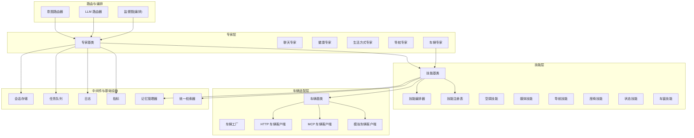
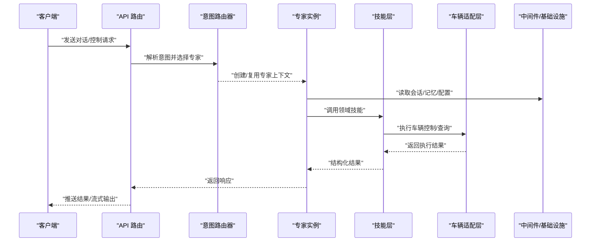
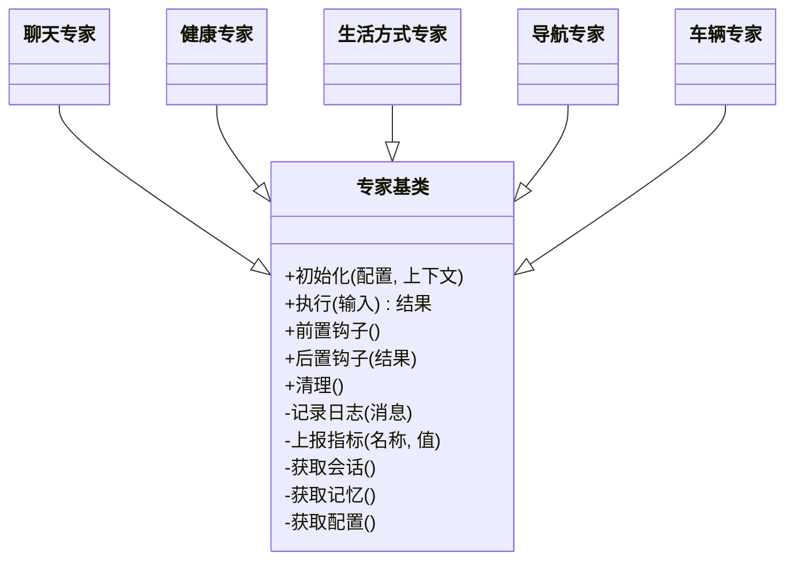
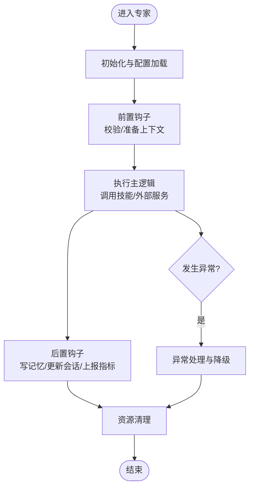
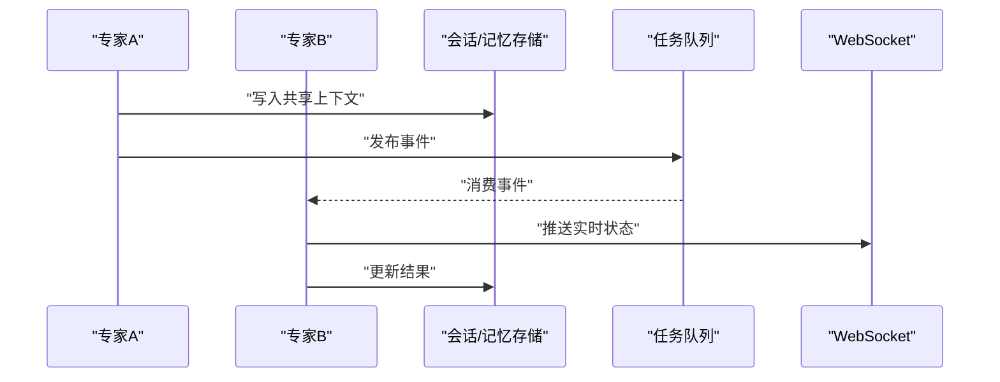
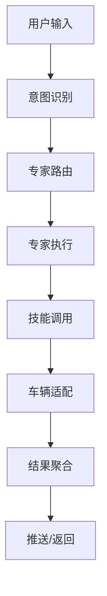
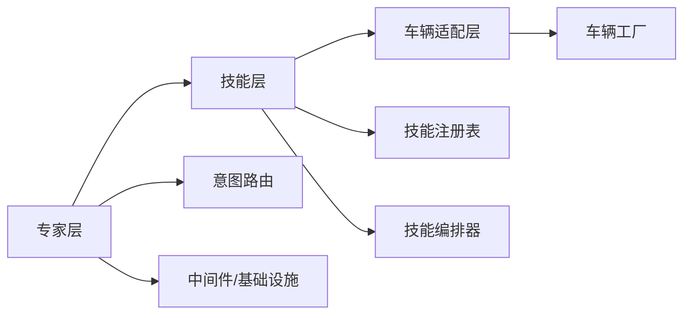

# 专家开发指南

<cite>
**本文引用的文件**   
- [backend_design/nexus/agent/experts/base.py](file://backend_design/nexus/agent/experts/base.py)
- [backend_design/nexus/agent/experts/chat_expert.py](file://backend_design/nexus/agent/experts/chat_expert.py)
- [backend_design/nexus/agent/experts/health_expert.py](file://backend_design/nexus/agent/experts/health_expert.py)
- [backend_design/nexus/agent/experts/lifestyle_expert.py](file://backend_design/nexus/agent/experts/lifestyle_expert.py)
- [backend_design/nexus/agent/experts/nav_expert.py](file://backend_design/nexus/agent/experts/nav_expert.py)
- [backend_design/nexus/agent/experts/vehicle_expert.py](file://backend_design/nexus/agent/experts/vehicle_expert.py)
- [backend_design/nexus/skills/base.py](file://backend_design/nexus/skills/base.py)
- [backend_design/nexus/skills/orchestrator.py](file://backend_design/nexus/skills/orchestrator.py)
- [backend_design/nexus/skills/registry.py](file://backend_design/nexus/skills/registry.py)
- [backend_design/nexus/skills/vehicle/climate.py](file://backend_design/nexus/skills/vehicle/climate.py)
- [backend_design/nexus/skills/vehicle/media.py](file://backend_design/nexus/skills/vehicle/media.py)
- [backend_design/nexus/skills/vehicle/navigation.py](file://backend_design/nexus/skills/vehicle/navigation.py)
- [backend_design/nexus/skills/vehicle/seat.py](file://backend_design/nexus/skills/vehicle/seat.py)
- [backend_design/nexus/skills/vehicle/status.py](file://backend_design/nexus/skills/vehicle/status.py)
- [backend_design/nexus/skills/vehicle/window.py](file://backend_design/nexus/skills/vehicle/window.py)
- [backend_design/nexus/vehicle/base.py](file://backend_design/nexus/vehicle/base.py)
- [backend_design/nexus/vehicle/factory.py](file://backend_design/nexus/vehicle/factory.py)
- [backend_design/nexus/vehicle/http.py](file://backend_design/nexus/vehicle/http.py)
- [backend_design/nexus/vehicle/mcp.py](file://backend_design/nexus/vehicle/mcp.py)
- [backend_design/nexus/vehicle/mock.py](file://backend_design/nexus/vehicle/mock.py)
- [backend_design/nexus/config.py](file://backend_design/nexus/config.py)
- [backend_design/nexus/core/logger.py](file://backend_design/nexus/core/logger.py)
- [backend_design/nexus/core/exceptions.py](file://backend_design/nexus/core/exceptions.py)
- [backend_design/nexus/models/state.py](file://backend_design/nexus/models/state.py)
- [backend_design/nexus/memory/manager.py](file://backend_design/nexus/memory/manager.py)
- [backend_design/nexus/intent/router.py](file://backend_design/nexus/intent/router.py)
- [backend_design/nexus/intent/llm_router.py](file://backend_design/nexus/intent/llm_router.py)
- [backend_design/nexus/api/routes/chat.py](file://backend_design/nexus/api/routes/chat.py)
- [backend_design/nexus/api/websocket.py](file://backend_design/nexus/api/websocket.py)
- [backend_design/nexus/middleware/session_store.py](file://backend_design/nexus/middleware/session_store.py)
- [backend_design/nexus/middleware/task_queue.py](file://backend_design/nexus/middleware/task_queue.py)
- [backend_design/nexus/observability/metrics.py](file://backend_design/nexus/observability/metrics.py)
- [backend_design/nexus/rag/unified_retriever.py](file://backend_design/nexus/rag/unified_retriever.py)
</cite>

## 目录
1. [简介](#简介)
2. [项目结构](#项目结构)
3. [核心组件](#核心组件)
4. [架构总览](#架构总览)
5. [详细组件分析](#详细组件分析)
6. [依赖关系分析](#依赖关系分析)
7. [性能考虑](#性能考虑)
8. [故障排查指南](#故障排查指南)
9. [结论](#结论)
10. [附录](#附录)

## 简介
本指南面向希望基于本项目“专家系统”进行二次开发与扩展的工程师。文档围绕以下目标展开：
- 明确专家基类的接口规范，包括必需方法、参数与返回值约定
- 阐述专家生命周期管理（初始化、执行、清理）
- 解释专家间通信机制（数据共享、事件传递、依赖注入）
- 说明配置管理（配置文件、环境变量、运行时参数）
- 提供从简单到复杂的完整开发示例
- 给出测试、调试与性能优化建议
- 描述打包、部署与版本管理流程

## 项目结构
专家系统位于后端模块中，主要涉及如下层次：
- 专家层：定义专家抽象与具体专家实现
- 技能层：将领域能力封装为可组合的技能单元
- 车辆适配层：统一对外部车辆控制接口的访问
- 路由与编排：意图识别、专家选择与任务编排
- 中间件与基础设施：会话、缓存、队列、日志、指标等

图表来源
- [backend_design/nexus/agent/experts/base.py](file://backend_design/nexus/agent/experts/base.py)
- [backend_design/nexus/skills/base.py](file://backend_design/nexus/skills/base.py)
- [backend_design/nexus/vehicle/base.py](file://backend_design/nexus/vehicle/base.py)
- [backend_design/nexus/intent/router.py](file://backend_design/nexus/intent/router.py)
- [backend_design/nexus/intent/llm_router.py](file://backend_design/nexus/intent/llm_router.py)
- [backend_design/nexus/observability/metrics.py](file://backend_design/nexus/observability/metrics.py)
- [backend_design/nexus/core/logger.py](file://backend_design/nexus/core/logger.py)
- [backend_design/nexus/middleware/session_store.py](file://backend_design/nexus/middleware/session_store.py)
- [backend_design/nexus/middleware/task_queue.py](file://backend_design/nexus/middleware/task_queue.py)
- [backend_design/nexus/memory/manager.py](file://backend_design/nexus/memory/manager.py)
- [backend_design/nexus/rag/unified_retriever.py](file://backend_design/nexus/rag/unified_retriever.py)

章节来源
- [backend_design/nexus/agent/experts/base.py](file://backend_design/nexus/agent/experts/base.py)
- [backend_design/nexus/skills/base.py](file://backend_design/nexus/skills/base.py)
- [backend_design/nexus/vehicle/base.py](file://backend_design/nexus/vehicle/base.py)
- [backend_design/nexus/intent/router.py](file://backend_design/nexus/intent/router.py)
- [backend_design/nexus/intent/llm_router.py](file://backend_design/nexus/intent/llm_router.py)

## 核心组件
本节聚焦专家系统的核心构件及其职责边界：
- 专家基类：定义专家通用接口、生命周期钩子、上下文与工具集
- 具体专家：聊天、健康、生活方式、导航、车辆等
- 技能基类与注册表：将能力模块化并支持动态发现与编排
- 车辆适配层：屏蔽不同车辆协议差异，提供统一控制接口
- 路由与编排：根据用户意图选择专家或编排多专家协作
- 中间件与基础设施：会话、任务队列、日志、指标、记忆、检索

章节来源
- [backend_design/nexus/agent/experts/base.py](file://backend_design/nexus/agent/experts/base.py)
- [backend_design/nexus/agent/experts/chat_expert.py](file://backend_design/nexus/agent/experts/chat_expert.py)
- [backend_design/nexus/agent/experts/health_expert.py](file://backend_design/nexus/agent/experts/health_expert.py)
- [backend_design/nexus/agent/experts/lifestyle_expert.py](file://backend_design/nexus/agent/experts/lifestyle_expert.py)
- [backend_design/nexus/agent/experts/nav_expert.py](file://backend_design/nexus/agent/experts/nav_expert.py)
- [backend_design/nexus/agent/experts/vehicle_expert.py](file://backend_design/nexus/agent/experts/vehicle_expert.py)
- [backend_design/nexus/skills/base.py](file://backend_design/nexus/skills/base.py)
- [backend_design/nexus/skills/registry.py](file://backend_design/nexus/skills/registry.py)
- [backend_design/nexus/vehicle/base.py](file://backend_design/nexus/vehicle/base.py)
- [backend_design/nexus/vehicle/factory.py](file://backend_design/nexus/vehicle/factory.py)

## 架构总览
下图展示一次典型的用户请求如何被路由到专家，并通过技能与车辆适配层完成动作执行与结果返回。

图表来源
- [backend_design/nexus/api/routes/chat.py](file://backend_design/nexus/api/routes/chat.py)
- [backend_design/nexus/intent/router.py](file://backend_design/nexus/intent/router.py)
- [backend_design/nexus/agent/experts/base.py](file://backend_design/nexus/agent/experts/base.py)
- [backend_design/nexus/skills/base.py](file://backend_design/nexus/skills/base.py)
- [backend_design/nexus/vehicle/base.py](file://backend_design/nexus/vehicle/base.py)
- [backend_design/nexus/middleware/session_store.py](file://backend_design/nexus/middleware/session_store.py)
- [backend_design/nexus/memory/manager.py](file://backend_design/nexus/memory/manager.py)

## 详细组件分析

### 专家基类接口规范
专家基类定义了所有专家必须遵循的契约，确保统一的初始化、执行与清理流程。

- 必需方法与约定
  - 初始化：在构造时加载配置、建立连接、预热资源；支持可选的环境变量覆盖
  - 执行入口：接收标准化输入（文本/结构化指令），返回标准化输出（结果/错误/元数据）
  - 生命周期钩子：启动前准备、执行前后钩子、异常处理、资源释放
  - 上下文访问：会话、记忆、配置、日志、指标、任务队列、检索器等
- 参数传递机制
  - 输入：用户消息、历史上下文、当前会话标识、可选参数映射
  - 输出：统一的数据模型（包含内容、类型、状态码、追踪ID等）
- 返回值格式要求
  - 成功：结构化结果对象，包含必要字段与可选扩展字段
  - 失败：标准异常或错误对象，携带错误码与可诊断信息
- 错误处理策略
  - 业务异常与系统异常分离
  - 重试与降级策略（结合熔断与超时）
  - 可观测性埋点（耗时、错误率、关键指标）

图表来源
- [backend_design/nexus/agent/experts/base.py](file://backend_design/nexus/agent/experts/base.py)
- [backend_design/nexus/agent/experts/chat_expert.py](file://backend_design/nexus/agent/experts/chat_expert.py)
- [backend_design/nexus/agent/experts/health_expert.py](file://backend_design/nexus/agent/experts/health_expert.py)
- [backend_design/nexus/agent/experts/lifestyle_expert.py](file://backend_design/nexus/agent/experts/lifestyle_expert.py)
- [backend_design/nexus/agent/experts/nav_expert.py](file://backend_design/nexus/agent/experts/nav_expert.py)
- [backend_design/nexus/agent/experts/vehicle_expert.py](file://backend_design/nexus/agent/experts/vehicle_expert.py)

章节来源
- [backend_design/nexus/agent/experts/base.py](file://backend_design/nexus/agent/experts/base.py)
- [backend_design/nexus/core/exceptions.py](file://backend_design/nexus/core/exceptions.py)
- [backend_design/nexus/core/logger.py](file://backend_design/nexus/core/logger.py)
- [backend_design/nexus/observability/metrics.py](file://backend_design/nexus/observability/metrics.py)

### 专家生命周期管理
专家的生命周期贯穿请求处理的始终，确保资源安全与一致性。

- 初始化过程
  - 加载配置与环境变量
  - 建立外部依赖连接（如车辆服务、RAG 检索器）
  - 预构建索引或缓存热点数据
- 执行流程
  - 前置钩子：校验输入、权限检查、上下文准备
  - 主逻辑：调用技能或外部服务，聚合结果
  - 后置钩子：写入记忆、更新会话、上报指标
- 资源清理
  - 关闭连接、释放锁、清理临时文件
  - 异步任务收尾与补偿

图表来源
- [backend_design/nexus/agent/experts/base.py](file://backend_design/nexus/agent/experts/base.py)
- [backend_design/nexus/core/exceptions.py](file://backend_design/nexus/core/exceptions.py)
- [backend_design/nexus/observability/metrics.py](file://backend_design/nexus/observability/metrics.py)

章节来源
- [backend_design/nexus/agent/experts/base.py](file://backend_design/nexus/agent/experts/base.py)
- [backend_design/nexus/core/exceptions.py](file://backend_design/nexus/core/exceptions.py)

### 专家间通信机制
专家之间通过标准化的上下文与中间件进行协作，避免紧耦合。

- 数据共享
  - 会话存储：跨专家共享用户偏好、历史摘要
  - 记忆管理器：长期记忆与短期上下文
  - 检索器：知识库与向量检索结果共享
- 事件传递
  - 任务队列：异步事件驱动（如车辆状态变更通知）
  - WebSocket：实时推送（如进度、流式结果）
- 依赖注入
  - 通过构造函数或上下文注入共享服务（日志、指标、配置、存储）
  - 技能注册表：动态发现与按需加载

图表来源
- [backend_design/nexus/middleware/session_store.py](file://backend_design/nexus/middleware/session_store.py)
- [backend_design/nexus/memory/manager.py](file://backend_design/nexus/memory/manager.py)
- [backend_design/nexus/middleware/task_queue.py](file://backend_design/nexus/middleware/task_queue.py)
- [backend_design/nexus/api/websocket.py](file://backend_design/nexus/api/websocket.py)

章节来源
- [backend_design/nexus/middleware/session_store.py](file://backend_design/nexus/middleware/session_store.py)
- [backend_design/nexus/memory/manager.py](file://backend_design/nexus/memory/manager.py)
- [backend_design/nexus/middleware/task_queue.py](file://backend_design/nexus/middleware/task_queue.py)
- [backend_design/nexus/api/websocket.py](file://backend_design/nexus/api/websocket.py)

### 专家的配置管理
- 配置文件结构
  - 全局配置：服务端口、数据库、缓存、外部服务地址
  - 专家配置：各专家的开关、阈值、超时、重试次数
  - 技能配置：技能启用列表、参数模板
- 环境变量设置
  - 敏感信息（密钥、令牌）通过环境变量注入
  - 运行模式（开发/测试/生产）切换
- 运行时参数调整
  - 动态开关与热更新（结合配置中心或内存配置）
  - 指标与日志级别调整

章节来源
- [backend_design/nexus/config.py](file://backend_design/nexus/config.py)
- [backend_design/nexus/core/logger.py](file://backend_design/nexus/core/logger.py)

### 完整开发示例

#### 示例一：简单的问候专家
- 目标：实现一个基础聊天专家，用于打招呼与闲聊
- 步骤：
  - 继承专家基类，实现执行入口
  - 使用日志与指标埋点
  - 返回标准化结果
- 参考路径
  - [backend_design/nexus/agent/experts/chat_expert.py](file://backend_design/nexus/agent/experts/chat_expert.py)

章节来源
- [backend_design/nexus/agent/experts/chat_expert.py](file://backend_design/nexus/agent/experts/chat_expert.py)

#### 示例二：车辆控制专家（复杂）
- 目标：实现车辆控制专家，协调多个车辆技能完成复合操作
- 步骤：
  - 继承专家基类，实现执行入口
  - 通过技能基类与注册表调用空调、座椅、车窗、媒体、导航、状态等技能
  - 使用车辆适配层（HTTP/MCP/Mock）执行控制
  - 结合任务队列与 WebSocket 推送执行进度
- 参考路径
  - [backend_design/nexus/agent/experts/vehicle_expert.py](file://backend_design/nexus/agent/experts/vehicle_expert.py)
  - [backend_design/nexus/skills/base.py](file://backend_design/nexus/skills/base.py)
  - [backend_design/nexus/skills/registry.py](file://backend_design/nexus/skills/registry.py)
  - [backend_design/nexus/skills/vehicle/climate.py](file://backend_design/nexus/skills/vehicle/climate.py)
  - [backend_design/nexus/skills/vehicle/seat.py](file://backend_design/nexus/skills/vehicle/seat.py)
  - [backend_design/nexus/skills/vehicle/window.py](file://backend_design/nexus/skills/vehicle/window.py)
  - [backend_design/nexus/skills/vehicle/media.py](file://backend_design/nexus/skills/vehicle/media.py)
  - [backend_design/nexus/skills/vehicle/navigation.py](file://backend_design/nexus/skills/vehicle/navigation.py)
  - [backend_design/nexus/skills/vehicle/status.py](file://backend_design/nexus/skills/vehicle/status.py)
  - [backend_design/nexus/vehicle/base.py](file://backend_design/nexus/vehicle/base.py)
  - [backend_design/nexus/vehicle/factory.py](file://backend_design/nexus/vehicle/factory.py)
  - [backend_design/nexus/vehicle/http.py](file://backend_design/nexus/vehicle/http.py)
  - [backend_design/nexus/vehicle/mcp.py](file://backend_design/nexus/vehicle/mcp.py)
  - [backend_design/nexus/vehicle/mock.py](file://backend_design/nexus/vehicle/mock.py)

章节来源
- [backend_design/nexus/agent/experts/vehicle_expert.py](file://backend_design/nexus/agent/experts/vehicle_expert.py)
- [backend_design/nexus/skills/base.py](file://backend_design/nexus/skills/base.py)
- [backend_design/nexus/skills/registry.py](file://backend_design/nexus/skills/registry.py)
- [backend_design/nexus/vehicle/base.py](file://backend_design/nexus/vehicle/base.py)
- [backend_design/nexus/vehicle/factory.py](file://backend_design/nexus/vehicle/factory.py)
- [backend_design/nexus/vehicle/http.py](file://backend_design/nexus/vehicle/http.py)
- [backend_design/nexus/vehicle/mcp.py](file://backend_design/nexus/vehicle/mcp.py)
- [backend_design/nexus/vehicle/mock.py](file://backend_design/nexus/vehicle/mock.py)

### 概念总览
下图展示了从用户意图到专家执行的端到端流程，便于理解整体交互。

[此图为概念流程图，不直接映射具体源码文件]

## 依赖关系分析
专家系统与技能、车辆适配层之间的依赖关系如下：

图表来源
- [backend_design/nexus/agent/experts/base.py](file://backend_design/nexus/agent/experts/base.py)
- [backend_design/nexus/skills/base.py](file://backend_design/nexus/skills/base.py)
- [backend_design/nexus/skills/registry.py](file://backend_design/nexus/skills/registry.py)
- [backend_design/nexus/skills/orchestrator.py](file://backend_design/nexus/skills/orchestrator.py)
- [backend_design/nexus/vehicle/base.py](file://backend_design/nexus/vehicle/base.py)
- [backend_design/nexus/vehicle/factory.py](file://backend_design/nexus/vehicle/factory.py)
- [backend_design/nexus/intent/router.py](file://backend_design/nexus/intent/router.py)

章节来源
- [backend_design/nexus/agent/experts/base.py](file://backend_design/nexus/agent/experts/base.py)
- [backend_design/nexus/skills/base.py](file://backend_design/nexus/skills/base.py)
- [backend_design/nexus/skills/registry.py](file://backend_design/nexus/skills/registry.py)
- [backend_design/nexus/skills/orchestrator.py](file://backend_design/nexus/skills/orchestrator.py)
- [backend_design/nexus/vehicle/base.py](file://backend_design/nexus/vehicle/base.py)
- [backend_design/nexus/vehicle/factory.py](file://backend_design/nexus/vehicle/factory.py)
- [backend_design/nexus/intent/router.py](file://backend_design/nexus/intent/router.py)

## 性能考虑
- 连接池与超时控制
  - 对车辆服务与外部 API 使用连接池与合理超时
  - 针对高延迟场景启用重试与退避
- 缓存与检索优化
  - 利用会话与记忆减少重复计算
  - 使用统一检索器的缓存与重排序提升召回质量
- 异步与并发
  - 通过任务队列解耦耗时操作
  - 使用 WebSocket 进行流式输出，降低前端等待时间
- 指标与监控
  - 关键路径埋点（耗时、错误率、吞吐）
  - 结合 Grafana/Prometheus 可视化

章节来源
- [backend_design/nexus/observability/metrics.py](file://backend_design/nexus/observability/metrics.py)
- [backend_design/nexus/rag/unified_retriever.py](file://backend_design/nexus/rag/unified_retriever.py)
- [backend_design/nexus/middleware/task_queue.py](file://backend_design/nexus/middleware/task_queue.py)
- [backend_design/nexus/api/websocket.py](file://backend_design/nexus/api/websocket.py)

## 故障排查指南
- 常见问题定位
  - 配置缺失或错误：检查环境变量与配置文件
  - 外部服务不可用：查看日志与指标，确认熔断与重试是否生效
  - 会话/记忆不一致：核对会话存储与记忆管理器读写路径
- 调试技巧
  - 开启详细日志与追踪 ID
  - 使用模拟车辆客户端进行离线验证
  - 通过 WebSocket 观察实时事件
- 恢复策略
  - 降级到默认行为或只读模式
  - 回滚到上一稳定版本

章节来源
- [backend_design/nexus/core/logger.py](file://backend_design/nexus/core/logger.py)
- [backend_design/nexus/core/exceptions.py](file://backend_design/nexus/core/exceptions.py)
- [backend_design/nexus/vehicle/mock.py](file://backend_design/nexus/vehicle/mock.py)
- [backend_design/nexus/middleware/session_store.py](file://backend_design/nexus/middleware/session_store.py)

## 结论
通过统一的专家基类与技能化架构，本项目实现了可扩展、可观测、易维护的智能助手系统。开发者应遵循接口规范与生命周期约定，合理使用中间件与基础设施，确保系统在复杂场景下的稳定性与性能。

## 附录

### 专家测试方法
- 单元测试
  - 针对专家执行入口与技能调用进行断言
  - 使用模拟车辆客户端替代真实设备
- 集成测试
  - 端到端验证意图路由、专家选择与结果返回
  - 验证 WebSocket 事件与任务队列消费
- 回归与混沌测试
  - 模拟外部服务故障与高延迟，验证降级与恢复

章节来源
- [backend_design/nexus/vehicle/mock.py](file://backend_design/nexus/vehicle/mock.py)
- [backend_design/nexus/api/websocket.py](file://backend_design/nexus/api/websocket.py)
- [backend_design/nexus/middleware/task_queue.py](file://backend_design/nexus/middleware/task_queue.py)

### 打包、部署与版本管理
- 打包
  - 使用 Python 包管理工具构建镜像或分发包
  - 将配置文件与模型资源纳入制品
- 部署
  - 容器化部署，按环境注入环境变量
  - 使用编排平台管理副本与滚动升级
- 版本管理
  - 语义化版本号，记录变更日志
  - 灰度发布与回滚策略

章节来源
- [backend_design/nexus/config.py](file://backend_design/nexus/config.py)