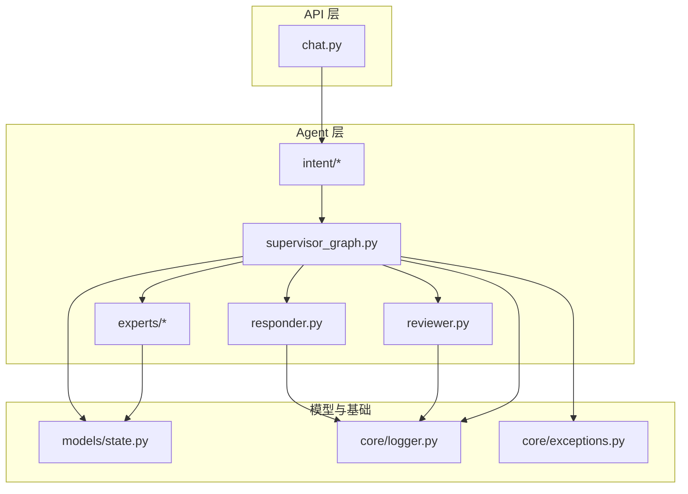
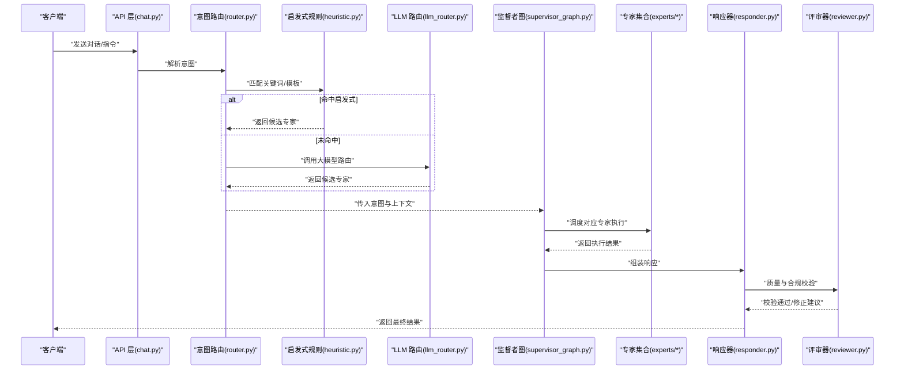
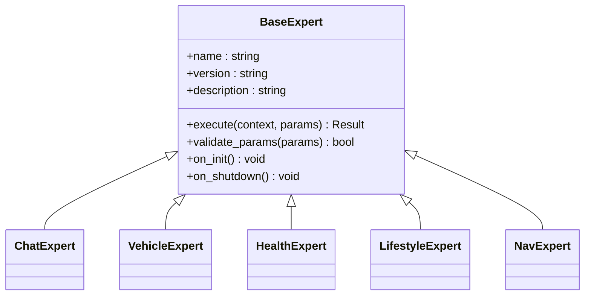
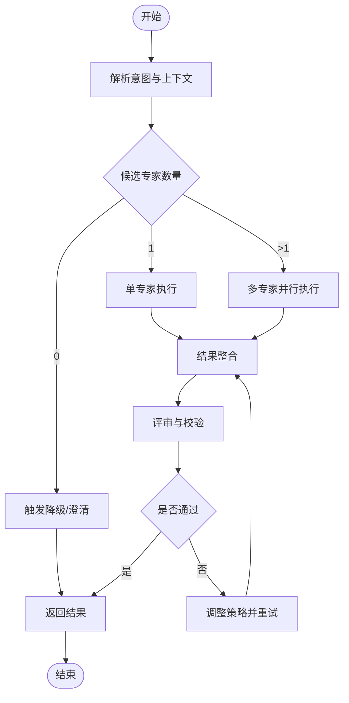
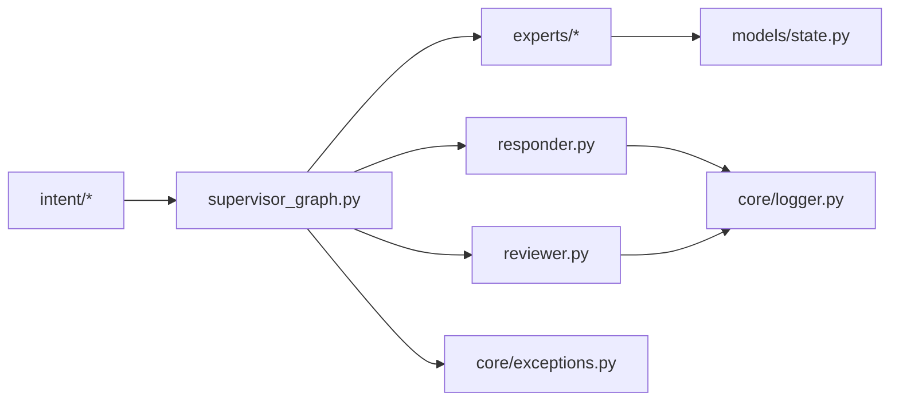

# 多专家架构设计

<cite>
**本文引用的文件**   
- [backend_design/nexus/agent/supervisor_graph.py](file://backend_design/nexus/agent/supervisor_graph.py)
- [backend_design/nexus/agent/responder.py](file://backend_design/nexus/agent/responder.py)
- [backend_design/nexus/agent/reviewer.py](file://backend_design/nexus/agent/reviewer.py)
- [backend_design/nexus/agent/experts/base.py](file://backend_design/nexus/agent/experts/base.py)
- [backend_design/nexus/agent/experts/chat_expert.py](file://backend_design/nexus/agent/experts/chat_expert.py)
- [backend_design/nexus/agent/experts/vehicle_expert.py](file://backend_design/nexus/agent/experts/vehicle_expert.py)
- [backend_design/nexus/agent/experts/health_expert.py](file://backend_design/nexus/agent/experts/health_expert.py)
- [backend_design/nexus/agent/experts/lifestyle_expert.py](file://backend_design/nexus/agent/experts/lifestyle_expert.py)
- [backend_design/nexus/agent/experts/nav_expert.py](file://backend_design/nexus/agent/experts/nav_expert.py)
- [backend_design/nexus/intent/router.py](file://backend_design/nexus/intent/router.py)
- [backend_design/nexus/intent/heuristic.py](file://backend_design/nexus/intent/heuristic.py)
- [backend_design/nexus/intent/llm_router.py](file://backend_design/nexus/intent/llm_router.py)
- [backend_design/nexus/models/state.py](file://backend_design/nexus/models/state.py)
- [backend_design/nexus/core/logger.py](file://backend_design/nexus/core/logger.py)
- [backend_design/nexus/core/exceptions.py](file://backend_design/nexus/core/exceptions.py)
- [backend_design/nexus/api/routes/chat.py](file://backend_design/nexus/api/routes/chat.py)
</cite>

## 目录
1. [简介](#简介)
2. [项目结构](#项目结构)
3. [核心组件](#核心组件)
4. [架构总览](#架构总览)
5. [详细组件分析](#详细组件分析)
6. [依赖关系分析](#依赖关系分析)
7. [性能考虑](#性能考虑)
8. [故障排查指南](#故障排查指南)
9. [结论](#结论)
10. [附录](#附录)

## 简介
本技术文档围绕“多专家架构”展开，聚焦于专家系统的设计模式、注册与动态加载机制、监督者图（Supervisor Graph）的任务分发与结果整合流程，以及各专家的职责边界与协作方式。同时提供扩展开发指南与错误处理策略，帮助开发者快速理解并安全地扩展新的专家能力。

## 项目结构
与多专家架构直接相关的代码主要位于 backend_design/nexus 目录下：
- agent：包含监督者图、响应器、评审器以及专家基类与各具体专家实现
- intent：意图识别与路由模块，负责将用户输入映射到合适的专家或流程
- models：状态模型定义，用于在专家间传递上下文
- core：日志、异常等基础设施
- api：HTTP/WebSocket 接口层，作为外部入口触发专家流程

图表来源
- [backend_design/nexus/api/routes/chat.py](file://backend_design/nexus/api/routes/chat.py)
- [backend_design/nexus/agent/supervisor_graph.py](file://backend_design/nexus/agent/supervisor_graph.py)
- [backend_design/nexus/agent/responder.py](file://backend_design/nexus/agent/responder.py)
- [backend_design/nexus/agent/reviewer.py](file://backend_design/nexus/agent/reviewer.py)
- [backend_design/nexus/intent/router.py](file://backend_design/nexus/intent/router.py)
- [backend_design/nexus/intent/heuristic.py](file://backend_design/nexus/intent/heuristic.py)
- [backend_design/nexus/intent/llm_router.py](file://backend_design/nexus/intent/llm_router.py)
- [backend_design/nexus/agent/experts/base.py](file://backend_design/nexus/agent/experts/base.py)
- [backend_design/nexus/agent/experts/chat_expert.py](file://backend_design/nexus/agent/experts/chat_expert.py)
- [backend_design/nexus/agent/experts/vehicle_expert.py](file://backend_design/nexus/agent/experts/vehicle_expert.py)
- [backend_design/nexus/agent/experts/health_expert.py](file://backend_design/nexus/agent/experts/health_expert.py)
- [backend_design/nexus/agent/experts/lifestyle_expert.py](file://backend_design/nexus/agent/experts/lifestyle_expert.py)
- [backend_design/nexus/agent/experts/nav_expert.py](file://backend_design/nexus/agent/experts/nav_expert.py)
- [backend_design/nexus/models/state.py](file://backend_design/nexus/models/state.py)
- [backend_design/nexus/core/logger.py](file://backend_design/nexus/core/logger.py)
- [backend_design/nexus/core/exceptions.py](file://backend_design/nexus/core/exceptions.py)

章节来源
- [backend_design/nexus/api/routes/chat.py](file://backend_design/nexus/api/routes/chat.py)
- [backend_design/nexus/agent/supervisor_graph.py](file://backend_design/nexus/agent/supervisor_graph.py)
- [backend_design/nexus/intent/router.py](file://backend_design/nexus/intent/router.py)
- [backend_design/nexus/intent/heuristic.py](file://backend_design/nexus/intent/heuristic.py)
- [backend_design/nexus/intent/llm_router.py](file://backend_design/nexus/intent/llm_router.py)
- [backend_design/nexus/agent/experts/base.py](file://backend_design/nexus/agent/experts/base.py)
- [backend_design/nexus/models/state.py](file://backend_design/nexus/models/state.py)
- [backend_design/nexus/core/logger.py](file://backend_design/nexus/core/logger.py)
- [backend_design/nexus/core/exceptions.py](file://backend_design/nexus/core/exceptions.py)

## 核心组件
- 专家基类与注册机制
  - 通过统一的专家基类定义标准接口（如执行、元数据、参数校验），所有具体专家继承该基类以实现一致的行为契约。
  - 注册中心维护专家名称到实现的映射，支持运行时动态发现与加载，便于热插拔扩展。
- 监督者图（Supervisor Graph）
  - 作为编排中枢，接收上游路由决策，按策略调度专家节点，管理中间状态，聚合最终结果。
  - 内置重试、降级、超时控制与可观测性埋点。
- 意图路由
  - 结合启发式规则与大模型路由两种策略，将用户输入解析为意图，并选择目标专家或子流程。
- 响应器与评审器
  - 响应器负责格式化输出、TTS/文本渲染；评审器对结果进行质量检查与合规校验。
- 状态模型
  - 统一的状态对象贯穿整个流程，承载会话上下文、专家间共享数据与审计信息。

章节来源
- [backend_design/nexus/agent/experts/base.py](file://backend_design/nexus/agent/experts/base.py)
- [backend_design/nexus/agent/supervisor_graph.py](file://backend_design/nexus/agent/supervisor_graph.py)
- [backend_design/nexus/intent/router.py](file://backend_design/nexus/intent/router.py)
- [backend_design/nexus/intent/heuristic.py](file://backend_design/nexus/intent/heuristic.py)
- [backend_design/nexus/intent/llm_router.py](file://backend_design/nexus/intent/llm_router.py)
- [backend_design/nexus/agent/responder.py](file://backend_design/nexus/agent/responder.py)
- [backend_design/nexus/agent/reviewer.py](file://backend_design/nexus/agent/reviewer.py)
- [backend_design/nexus/models/state.py](file://backend_design/nexus/models/state.py)

## 架构总览
下图展示了从请求进入至专家执行与结果返回的整体链路，包括意图识别、监督者编排、专家执行、结果整合与响应输出。

图表来源
- [backend_design/nexus/api/routes/chat.py](file://backend_design/nexus/api/routes/chat.py)
- [backend_design/nexus/intent/router.py](file://backend_design/nexus/intent/router.py)
- [backend_design/nexus/intent/heuristic.py](file://backend_design/nexus/intent/heuristic.py)
- [backend_design/nexus/intent/llm_router.py](file://backend_design/nexus/intent/llm_router.py)
- [backend_design/nexus/agent/supervisor_graph.py](file://backend_design/nexus/agent/supervisor_graph.py)
- [backend_design/nexus/agent/responder.py](file://backend_design/nexus/agent/responder.py)
- [backend_design/nexus/agent/reviewer.py](file://backend_design/nexus/agent/reviewer.py)

## 详细组件分析

### 专家基类与注册机制
- 设计要点
  - 统一接口：定义执行方法、元数据（名称、版本、描述）、参数校验与资源生命周期钩子。
  - 注册表：集中维护专家实例，支持按名称查找、批量列出与按需懒加载。
  - 配置注入：专家可通过配置项初始化，支持运行时更新。
- 复杂度与性能
  - 注册表查找通常为 O(1)，专家执行复杂度取决于具体实现；建议在专家内部使用缓存与批处理优化。
- 错误处理
  - 基类捕获并包装异常，记录结构化日志，向上游返回标准化错误码与提示。

图表来源
- [backend_design/nexus/agent/experts/base.py](file://backend_design/nexus/agent/experts/base.py)
- [backend_design/nexus/agent/experts/chat_expert.py](file://backend_design/nexus/agent/experts/chat_expert.py)
- [backend_design/nexus/agent/experts/vehicle_expert.py](file://backend_design/nexus/agent/experts/vehicle_expert.py)
- [backend_design/nexus/agent/experts/health_expert.py](file://backend_design/nexus/agent/experts/health_expert.py)
- [backend_design/nexus/agent/experts/lifestyle_expert.py](file://backend_design/nexus/agent/experts/lifestyle_expert.py)
- [backend_design/nexus/agent/experts/nav_expert.py](file://backend_design/nexus/agent/experts/nav_expert.py)

章节来源
- [backend_design/nexus/agent/experts/base.py](file://backend_design/nexus/agent/experts/base.py)
- [backend_design/nexus/agent/experts/chat_expert.py](file://backend_design/nexus/agent/experts/chat_expert.py)
- [backend_design/nexus/agent/experts/vehicle_expert.py](file://backend_design/nexus/agent/experts/vehicle_expert.py)
- [backend_design/nexus/agent/experts/health_expert.py](file://backend_design/nexus/agent/experts/health_expert.py)
- [backend_design/nexus/agent/experts/lifestyle_expert.py](file://backend_design/nexus/agent/experts/lifestyle_expert.py)
- [backend_design/nexus/agent/experts/nav_expert.py](file://backend_design/nexus/agent/experts/nav_expert.py)

### 监督者图（Supervisor Graph）工作流程
- 任务分发策略
  - 基于意图路由的结果，选择单一专家或并行多个专家；支持条件分支与回退路径。
- 专家选择算法
  - 优先启发式匹配，其次大模型路由；当存在多个候选时，依据权重、历史成功率与负载进行排序。
- 结果整合机制
  - 合并不同专家的输出，去重与冲突消解；必要时触发二次澄清或降级策略。
- 可靠性保障
  - 超时控制、重试上限、熔断与降级；统一异常封装与可观测指标上报。

图表来源
- [backend_design/nexus/agent/supervisor_graph.py](file://backend_design/nexus/agent/supervisor_graph.py)
- [backend_design/nexus/intent/router.py](file://backend_design/nexus/intent/router.py)
- [backend_design/nexus/intent/heuristic.py](file://backend_design/nexus/intent/heuristic.py)
- [backend_design/nexus/intent/llm_router.py](file://backend_design/nexus/intent/llm_router.py)
- [backend_design/nexus/agent/responder.py](file://backend_design/nexus/agent/responder.py)
- [backend_design/nexus/agent/reviewer.py](file://backend_design/nexus/agent/reviewer.py)

章节来源
- [backend_design/nexus/agent/supervisor_graph.py](file://backend_design/nexus/agent/supervisor_graph.py)
- [backend_design/nexus/intent/router.py](file://backend_design/nexus/intent/router.py)
- [backend_design/nexus/intent/heuristic.py](file://backend_design/nexus/intent/heuristic.py)
- [backend_design/nexus/intent/llm_router.py](file://backend_design/nexus/intent/llm_router.py)
- [backend_design/nexus/agent/responder.py](file://backend_design/nexus/agent/responder.py)
- [backend_design/nexus/agent/reviewer.py](file://backend_design/nexus/agent/reviewer.py)

### 专家职责分工
- 聊天专家（ChatExpert）
  - 职责：日常对话、闲聊、通用问答；维护会话记忆与个性化风格。
  - 输入/输出：自然语言消息、上下文片段；结构化对话回复。
- 车辆专家（VehicleExpert）
  - 职责：车载功能控制（空调、媒体、座椅、车窗等）；读取车辆状态。
  - 输入/输出：设备命令与查询；执行结果与状态反馈。
- 健康专家（HealthExpert）
  - 职责：健康咨询、指标解读、建议生成；对接健康数据源。
  - 输入/输出：健康数据与问题；建议与风险提示。
- 生活方式专家（LifestyleExpert）
  - 职责：个人习惯管理、提醒与计划；偏好学习与行为追踪。
  - 输入/输出：习惯数据与事件；计划与建议。
- 导航专家（NavExpert）
  - 职责：路线规划、目的地搜索、实时路况；与地图服务交互。
  - 输入/输出：起点/终点与约束；路线方案与ETA。

章节来源
- [backend_design/nexus/agent/experts/chat_expert.py](file://backend_design/nexus/agent/experts/chat_expert.py)
- [backend_design/nexus/agent/experts/vehicle_expert.py](file://backend_design/nexus/agent/experts/vehicle_expert.py)
- [backend_design/nexus/agent/experts/health_expert.py](file://backend_design/nexus/agent/experts/health_expert.py)
- [backend_design/nexus/agent/experts/lifestyle_expert.py](file://backend_design/nexus/agent/experts/lifestyle_expert.py)
- [backend_design/nexus/agent/experts/nav_expert.py](file://backend_design/nexus/agent/experts/nav_expert.py)

### 扩展开发指南
- 创建自定义专家类
  - 继承专家基类，实现 execute 方法与必要的元数据字段。
  - 在 validate_params 中完成参数校验与默认值填充。
- 实现专家接口
  - 遵循基类约定的输入输出格式，确保与状态模型兼容。
  - 如需外部依赖，在 on_init 中初始化并在 on_shutdown 中释放资源。
- 配置专家参数
  - 通过配置项注入参数，支持运行时更新；敏感信息应走密钥管理服务。
- 注册与动态加载
  - 将新专家加入注册表，确保名称唯一；可在启动时自动扫描或显式注册。
- 测试与验证
  - 编写单元测试覆盖正常路径与异常路径；集成测试验证端到端流程。

章节来源
- [backend_design/nexus/agent/experts/base.py](file://backend_design/nexus/agent/experts/base.py)
- [backend_design/nexus/models/state.py](file://backend_design/nexus/models/state.py)

### 专家协作示例场景
- 场景一：导航+车辆联动
  - 用户：“帮我规划到公司并打开空调。”
  - 流程：导航专家计算路线，车辆专家设置空调；监督者图合并结果并返回一体化响应。
- 场景二：健康+生活方式协同
  - 用户：“今天步数较少，给我安排一个晚间散步计划。”
  - 流程：健康专家评估指标，生活方式专家生成计划；评审器校验合理性后返回。
- 场景三：多轮澄清
  - 用户：“我想去个好吃的地方。”
  - 流程：意图路由无法确定目的地，监督者图触发澄清，引导用户提供更多约束后再执行导航专家。

章节来源
- [backend_design/nexus/agent/supervisor_graph.py](file://backend_design/nexus/agent/supervisor_graph.py)
- [backend_design/nexus/agent/experts/nav_expert.py](file://backend_design/nexus/agent/experts/nav_expert.py)
- [backend_design/nexus/agent/experts/vehicle_expert.py](file://backend_design/nexus/agent/experts/vehicle_expert.py)
- [backend_design/nexus/agent/experts/health_expert.py](file://backend_design/nexus/agent/experts/health_expert.py)
- [backend_design/nexus/agent/experts/lifestyle_expert.py](file://backend_design/nexus/agent/experts/lifestyle_expert.py)

### 错误处理机制
- 异常分类
  - 参数错误、外部服务不可用、超时、权限不足、业务逻辑异常等。
- 处理策略
  - 统一异常包装，附带错误码与可诊断信息；根据错误类型决定重试、降级或澄清。
- 可观测性
  - 关键路径埋点，记录耗时、失败率与错误分布；配合日志与指标系统进行告警。

章节来源
- [backend_design/nexus/core/exceptions.py](file://backend_design/nexus/core/exceptions.py)
- [backend_design/nexus/core/logger.py](file://backend_design/nexus/core/logger.py)
- [backend_design/nexus/agent/supervisor_graph.py](file://backend_design/nexus/agent/supervisor_graph.py)

## 依赖关系分析
- 组件耦合
  - 监督者图强依赖意图路由与专家集合；响应器与评审器弱耦合于专家输出格式。
- 外部依赖
  - 大模型路由依赖 LLM 服务；车辆与健康专家可能依赖外部设备或服务。
- 循环依赖
  - 通过接口抽象与依赖注入避免循环引用；专家之间不直接互相调用，由监督者图协调。

图表来源
- [backend_design/nexus/intent/router.py](file://backend_design/nexus/intent/router.py)
- [backend_design/nexus/intent/heuristic.py](file://backend_design/nexus/intent/heuristic.py)
- [backend_design/nexus/intent/llm_router.py](file://backend_design/nexus/intent/llm_router.py)
- [backend_design/nexus/agent/supervisor_graph.py](file://backend_design/nexus/agent/supervisor_graph.py)
- [backend_design/nexus/agent/responder.py](file://backend_design/nexus/agent/responder.py)
- [backend_design/nexus/agent/reviewer.py](file://backend_design/nexus/agent/reviewer.py)
- [backend_design/nexus/models/state.py](file://backend_design/nexus/models/state.py)
- [backend_design/nexus/core/logger.py](file://backend_design/nexus/core/logger.py)
- [backend_design/nexus/core/exceptions.py](file://backend_design/nexus/core/exceptions.py)

章节来源
- [backend_design/nexus/intent/router.py](file://backend_design/nexus/intent/router.py)
- [backend_design/nexus/intent/heuristic.py](file://backend_design/nexus/intent/heuristic.py)
- [backend_design/nexus/intent/llm_router.py](file://backend_design/nexus/intent/llm_router.py)
- [backend_design/nexus/agent/supervisor_graph.py](file://backend_design/nexus/agent/supervisor_graph.py)
- [backend_design/nexus/agent/responder.py](file://backend_design/nexus/agent/responder.py)
- [backend_design/nexus/agent/reviewer.py](file://backend_design/nexus/agent/reviewer.py)
- [backend_design/nexus/models/state.py](file://backend_design/nexus/models/state.py)
- [backend_design/nexus/core/logger.py](file://backend_design/nexus/core/logger.py)
- [backend_design/nexus/core/exceptions.py](file://backend_design/nexus/core/exceptions.py)

## 性能考虑
- 路由效率
  - 启发式规则优先，减少 LLM 调用；缓存热点意图与常用参数组合。
- 并发与限流
  - 多专家并行执行时注意资源竞争；对高延迟外部服务实施限流与熔断。
- 内存与序列化
  - 状态对象尽量轻量，避免在大对象间频繁拷贝；序列化采用高效格式。
- 可观测性
  - 关键路径埋点，采集 P95/P99 延迟与错误率，辅助容量规划与调优。

[本节为通用指导，无需特定文件来源]

## 故障排查指南
- 常见问题定位
  - 意图识别失败：检查启发式规则与大模型路由的命中率与返回格式。
  - 专家执行异常：查看专家日志与异常堆栈，确认参数校验与外部依赖可用性。
  - 结果整合错误：核对输出格式与评审器规则，必要时增加降级策略。
- 调试技巧
  - 开启详细日志级别，记录输入、中间状态与输出；使用追踪 ID 串联全链路。
  - 构造最小复现用例，隔离外部依赖影响。

章节来源
- [backend_design/nexus/core/logger.py](file://backend_design/nexus/core/logger.py)
- [backend_design/nexus/core/exceptions.py](file://backend_design/nexus/core/exceptions.py)
- [backend_design/nexus/agent/supervisor_graph.py](file://backend_design/nexus/agent/supervisor_graph.py)

## 结论
多专家架构通过统一的专家基类与注册机制实现了可扩展的能力体系；监督者图以意图驱动的方式完成任务编排与结果整合，具备高内聚、低耦合与良好的可观测性。借助清晰的职责划分与完善的错误处理策略，系统能够在复杂场景中稳定运行，并为后续扩展提供坚实基础。

[本节为总结性内容，无需特定文件来源]

## 附录
- 术语表
  - 专家：具备特定领域能力的可执行单元
  - 监督者图：编排与调度专家的执行图
  - 意图路由：将用户输入映射到目标专家或流程
  - 响应器：格式化与渲染输出的组件
  - 评审器：对结果进行质量与合规校验的组件
- 参考入口
  - API 入口：[backend_design/nexus/api/routes/chat.py](file://backend_design/nexus/api/routes/chat.py)
  - 监督者图：[backend_design/nexus/agent/supervisor_graph.py](file://backend_design/nexus/agent/supervisor_graph.py)
  - 意图路由：[backend_design/nexus/intent/router.py](file://backend_design/nexus/intent/router.py)
  - 专家基类：[backend_design/nexus/agent/experts/base.py](file://backend_design/nexus/agent/experts/base.py)