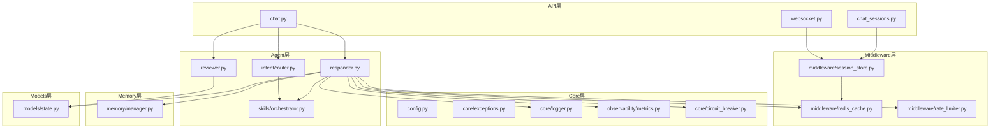
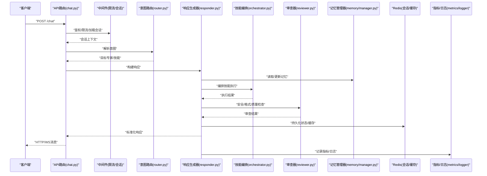
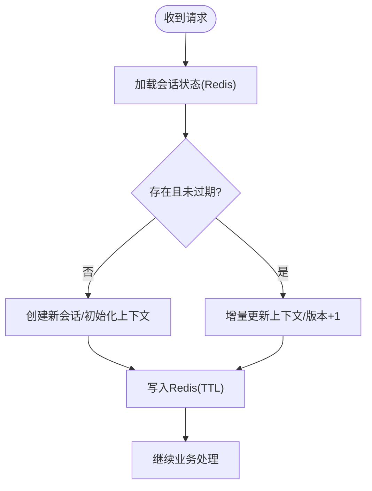
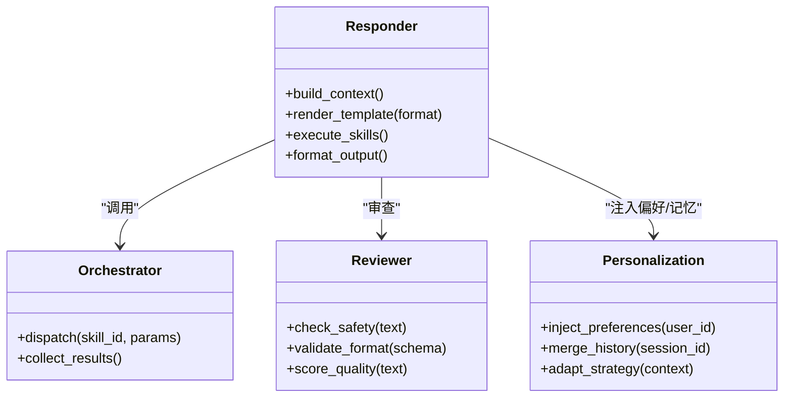
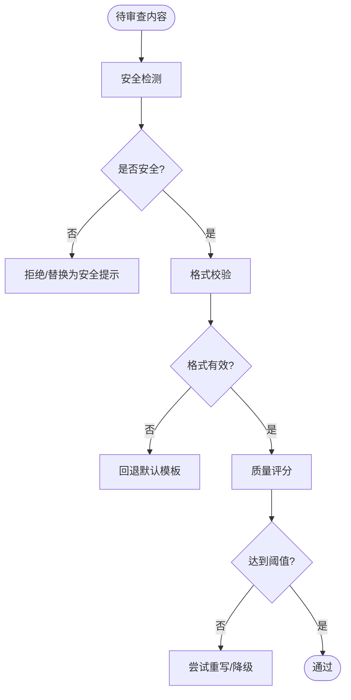
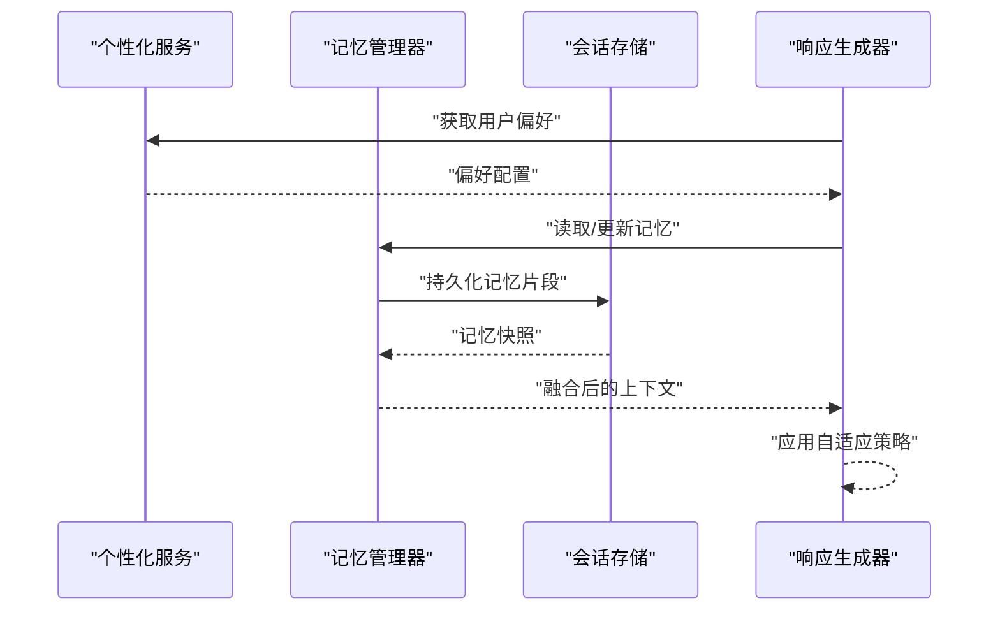
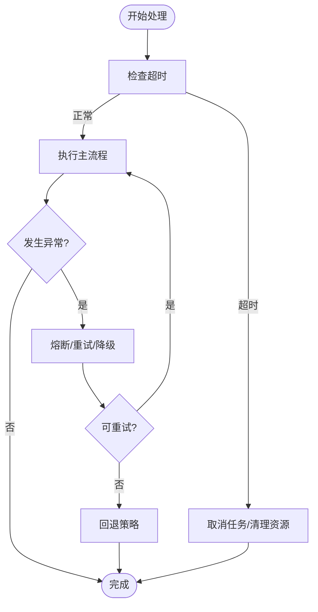
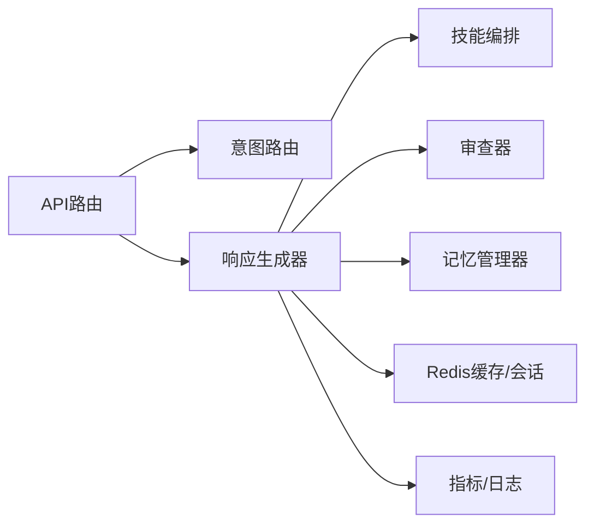

# 对话管理系统

<cite>
**本文引用的文件**   
- [backend_design/nexus/main.py](file://backend_design/nexus/main.py)
- [backend_design/nexus/config.py](file://backend_design/nexus/config.py)
- [backend_design/nexus/api/routes/chat.py](file://backend_design/nexus/api/routes/chat.py)
- [backend_design/nexus/api/routes/chat_sessions.py](file://backend_design/nexus/api/routes/chat_sessions.py)
- [backend_design/nexus/api/websocket.py](file://backend_design/nexus/api/websocket.py)
- [backend_design/nexus/models/state.py](file://backend_design/nexus/models/state.py)
- [backend_design/nexus/memory/manager.py](file://backend_design/nexus/memory/manager.py)
- [backend_design/nexus/core/personalization.py](file://backend_design/nexus/core/personalization.py)
- [backend_design/nexus/middleware/session_store.py](file://backend_design/nexus/middleware/session_store.py)
- [backend_design/nexus/middleware/redis_cache.py](file://backend_design/nexus/middleware/redis_cache.py)
- [backend_design/nexus/middleware/rate_limiter.py](file://backend_design/nexus/middleware/rate_limiter.py)
- [backend_design/nexus/core/circuit_breaker.py](file://backend_design/nexus/core/circuit_breaker.py)
- [backend_design/nexus/core/exceptions.py](file://backend_design/nexus/core/exceptions.py)
- [backend_design/nexus/core/logger.py](file://backend_design/nexus/core/logger.py)
- [backend_design/nexus/observability/metrics.py](file://backend_design/nexus/observability/metrics.py)
- [backend_design/nexus/agent/responder.py](file://backend_design/nexus/agent/responder.py)
- [backend_design/nexus/agent/reviewer.py](file://backend_design/nexus/agent/reviewer.py)
- [backend_design/nexus/intent/router.py](file://backend_design/nexus/intent/router.py)
- [backend_design/nexus/skills/orchestrator.py](file://backend_design/nexus/skills/orchestrator.py)
</cite>

## 目录
1. [简介](#简介)
2. [项目结构](#项目结构)
3. [核心组件](#核心组件)
4. [架构总览](#架构总览)
5. [详细组件分析](#详细组件分析)
6. [依赖关系分析](#依赖关系分析)
7. [性能考量](#性能考量)
8. [故障排查指南](#故障排查指南)
9. [结论](#结论)
10. [附录：API与使用示例](#附录api与使用示例)

## 简介
本技术文档面向对话管理系统的后端实现，围绕以下目标展开：
- 对话状态管理：会话生命周期、上下文维护与状态持久化策略
- 响应生成器：内容构建流程、模板渲染机制与多格式输出支持
- 审查器：内容安全检测、格式验证与质量评估
- 个性化适配：用户偏好集成、历史记忆与自适应回复策略
- 中断处理、异常恢复与超时管理
- 对话流控制API接口与使用示例

## 项目结构
系统采用分层与模块化组织方式，关键目录与职责如下：
- API层：HTTP/WebSocket路由与请求处理
- Agent层：意图路由、专家协作、响应生成与审查
- Memory层：对话记忆与冲突合并
- Core层：配置、认证、熔断、日志、指标等横切能力
- Middleware层：会话存储、缓存、限流、任务队列
- Models层：数据模型与状态定义
- Observability层：可观测性与数据保留策略
- Skills层：技能编排与领域能力扩展

图表来源
- [backend_design/nexus/api/routes/chat.py](file://backend_design/nexus/api/routes/chat.py)
- [backend_design/nexus/api/routes/chat_sessions.py](file://backend_design/nexus/api/routes/chat_sessions.py)
- [backend_design/nexus/api/websocket.py](file://backend_design/nexus/api/websocket.py)
- [backend_design/nexus/agent/responder.py](file://backend_design/nexus/agent/responder.py)
- [backend_design/nexus/agent/reviewer.py](file://backend_design/nexus/agent/reviewer.py)
- [backend_design/nexus/intent/router.py](file://backend_design/nexus/intent/router.py)
- [backend_design/nexus/skills/orchestrator.py](file://backend_design/nexus/skills/orchestrator.py)
- [backend_design/nexus/memory/manager.py](file://backend_design/nexus/memory/manager.py)
- [backend_design/nexus/models/state.py](file://backend_design/nexus/models/state.py)
- [backend_design/nexus/middleware/session_store.py](file://backend_design/nexus/middleware/session_store.py)
- [backend_design/nexus/middleware/redis_cache.py](file://backend_design/nexus/middleware/redis_cache.py)
- [backend_design/nexus/middleware/rate_limiter.py](file://backend_design/nexus/middleware/rate_limiter.py)
- [backend_design/nexus/core/circuit_breaker.py](file://backend_design/nexus/core/circuit_breaker.py)
- [backend_design/nexus/core/exceptions.py](file://backend_design/nexus/core/exceptions.py)
- [backend_design/nexus/core/logger.py](file://backend_design/nexus/core/logger.py)
- [backend_design/nexus/observability/metrics.py](file://backend_design/nexus/observability/metrics.py)

章节来源
- [backend_design/nexus/main.py](file://backend_design/nexus/main.py)
- [backend_design/nexus/config.py](file://backend_design/nexus/config.py)

## 核心组件
- 对话状态模型：统一的状态结构与字段约定，贯穿会话、上下文与持久化
- 会话存储中间件：基于Redis的会话存取、过期与清理
- 记忆管理器：对话记忆抽取、冲突合并与更新
- 响应生成器：意图路由、技能编排、内容构建与多格式输出
- 审查器：安全检测、格式校验与质量评分
- 个性化适配：用户偏好注入、历史记忆融合与自适应策略
- 容错与可观测性：熔断、限流、指标与日志

章节来源
- [backend_design/nexus/models/state.py](file://backend_design/nexus/models/state.py)
- [backend_design/nexus/middleware/session_store.py](file://backend_design/nexus/middleware/session_store.py)
- [backend_design/nexus/memory/manager.py](file://backend_design/nexus/memory/manager.py)
- [backend_design/nexus/agent/responder.py](file://backend_design/nexus/agent/responder.py)
- [backend_design/nexus/agent/reviewer.py](file://backend_design/nexus/agent/reviewer.py)
- [backend_design/nexus/core/personalization.py](file://backend_design/nexus/core/personalization.py)
- [backend_design/nexus/core/circuit_breaker.py](file://backend_design/nexus/core/circuit_breaker.py)
- [backend_design/nexus/middleware/rate_limiter.py](file://backend_design/nexus/middleware/rate_limiter.py)
- [backend_design/nexus/observability/metrics.py](file://backend_design/nexus/observability/metrics.py)
- [backend_design/nexus/core/logger.py](file://backend_design/nexus/core/logger.py)

## 架构总览
对话请求从API进入，经中间件进行鉴权、限流与会话加载；随后由意图路由器选择专家或技能，响应生成器组装上下文并调用技能执行，审查器对结果进行安全与质量把关，最终通过HTTP或WebSocket返回。状态与记忆在Redis中持久化，指标与日志用于可观测性。

图表来源
- [backend_design/nexus/api/routes/chat.py](file://backend_design/nexus/api/routes/chat.py)
- [backend_design/nexus/middleware/rate_limiter.py](file://backend_design/nexus/middleware/rate_limiter.py)
- [backend_design/nexus/middleware/session_store.py](file://backend_design/nexus/middleware/session_store.py)
- [backend_design/nexus/intent/router.py](file://backend_design/nexus/intent/router.py)
- [backend_design/nexus/agent/responder.py](file://backend_design/nexus/agent/responder.py)
- [backend_design/nexus/skills/orchestrator.py](file://backend_design/nexus/skills/orchestrator.py)
- [backend_design/nexus/agent/reviewer.py](file://backend_design/nexus/agent/reviewer.py)
- [backend_design/nexus/memory/manager.py](file://backend_design/nexus/memory/manager.py)
- [backend_design/nexus/observability/metrics.py](file://backend_design/nexus/observability/metrics.py)
- [backend_design/nexus/core/logger.py](file://backend_design/nexus/core/logger.py)

## 详细组件分析

### 对话状态管理与持久化
- 状态模型：定义会话ID、用户标识、上下文片段、当前节点、时间戳、版本等字段，确保跨模块一致
- 会话生命周期：创建（首次交互）、活跃（持续读写）、休眠（长时间无操作）、归档（清理前快照）
- 上下文维护：按轮次追加消息摘要、实体槽位、意图标签与工具调用结果
- 持久化策略：
  - 热路径：Redis缓存会话与高频上下文，设置TTL与惰性失效
  - 冷路径：定期落盘至数据库（如需要），提供回溯与审计
  - 一致性：写时递增版本号，读时校验版本，避免脏读

图表来源
- [backend_design/nexus/models/state.py](file://backend_design/nexus/models/state.py)
- [backend_design/nexus/middleware/session_store.py](file://backend_design/nexus/middleware/session_store.py)
- [backend_design/nexus/middleware/redis_cache.py](file://backend_design/nexus/middleware/redis_cache.py)

章节来源
- [backend_design/nexus/models/state.py](file://backend_design/nexus/models/state.py)
- [backend_design/nexus/middleware/session_store.py](file://backend_design/nexus/middleware/session_store.py)
- [backend_design/nexus/middleware/redis_cache.py](file://backend_design/nexus/middleware/redis_cache.py)

### 响应生成器工作原理
- 输入：用户消息、会话上下文、个性化信息、检索增强结果
- 内容构建：
  - 意图识别与路由：将请求映射到专家或技能
  - 上下文装配：拼接历史摘要、槽位、工具调用结果
  - 模板渲染：根据输出格式选择模板（文本、结构化JSON、富媒体等）
  - 多格式输出：文本、Markdown、JSON、语音提示等
- 执行编排：调用技能编排器执行具体动作（查询、控制设备、生成内容等）
- 质量控制：交由审查器进行安全、格式与质量评估

图表来源
- [backend_design/nexus/agent/responder.py](file://backend_design/nexus/agent/responder.py)
- [backend_design/nexus/skills/orchestrator.py](file://backend_design/nexus/skills/orchestrator.py)
- [backend_design/nexus/agent/reviewer.py](file://backend_design/nexus/agent/reviewer.py)
- [backend_design/nexus/core/personalization.py](file://backend_design/nexus/core/personalization.py)

章节来源
- [backend_design/nexus/agent/responder.py](file://backend_design/nexus/agent/responder.py)
- [backend_design/nexus/skills/orchestrator.py](file://backend_design/nexus/skills/orchestrator.py)
- [backend_design/nexus/agent/reviewer.py](file://backend_design/nexus/agent/reviewer.py)
- [backend_design/nexus/core/personalization.py](file://backend_design/nexus/core/personalization.py)

### 审查器的质量控制
- 内容安全检测：敏感词过滤、恶意输入识别、越权访问拦截
- 格式验证：依据Schema校验结构化输出，保证下游消费稳定
- 质量评估：可读性、完整性、相关性打分，必要时触发重写或降级
- 决策分支：通过则返回；失败则回退到默认模板或拒绝回答

图表来源
- [backend_design/nexus/agent/reviewer.py](file://backend_design/nexus/agent/reviewer.py)

章节来源
- [backend_design/nexus/agent/reviewer.py](file://backend_design/nexus/agent/reviewer.py)

### 个性化适配机制
- 用户偏好集成：从用户画像与偏好配置注入风格、语言、主题等
- 历史对话记忆：抽取关键事实与偏好，融合进当前上下文
- 自适应回复策略：根据用户行为与反馈动态调整语气、长度与复杂度

图表来源
- [backend_design/nexus/core/personalization.py](file://backend_design/nexus/core/personalization.py)
- [backend_design/nexus/memory/manager.py](file://backend_design/nexus/memory/manager.py)
- [backend_design/nexus/middleware/session_store.py](file://backend_design/nexus/middleware/session_store.py)
- [backend_design/nexus/agent/responder.py](file://backend_design/nexus/agent/responder.py)

章节来源
- [backend_design/nexus/core/personalization.py](file://backend_design/nexus/core/personalization.py)
- [backend_design/nexus/memory/manager.py](file://backend_design/nexus/memory/manager.py)
- [backend_design/nexus/middleware/session_store.py](file://backend_design/nexus/middleware/session_store.py)
- [backend_design/nexus/agent/responder.py](file://backend_design/nexus/agent/responder.py)

### 对话中断处理、异常恢复与超时管理
- 中断处理：支持取消长耗时任务，释放资源并回滚部分状态
- 异常恢复：捕获外部依赖异常，启用熔断与重试，必要时降级到本地策略
- 超时管理：为各阶段设置超时阈值，防止阻塞与雪崩

图表来源
- [backend_design/nexus/core/circuit_breaker.py](file://backend_design/nexus/core/circuit_breaker.py)
- [backend_design/nexus/core/exceptions.py](file://backend_design/nexus/core/exceptions.py)

章节来源
- [backend_design/nexus/core/circuit_breaker.py](file://backend_design/nexus/core/circuit_breaker.py)
- [backend_design/nexus/core/exceptions.py](file://backend_design/nexus/core/exceptions.py)

## 依赖关系分析
- 低耦合高内聚：API仅负责协议与参数校验，核心逻辑下沉至Agent与Middleware
- 明确边界：状态模型集中定义，减少散落的字段差异
- 外部依赖：Redis用于会话与缓存，指标与日志用于可观测性
- 潜在风险：过度依赖外部LLM或向量库时需加强熔断与降级

图表来源
- [backend_design/nexus/api/routes/chat.py](file://backend_design/nexus/api/routes/chat.py)
- [backend_design/nexus/intent/router.py](file://backend_design/nexus/intent/router.py)
- [backend_design/nexus/agent/responder.py](file://backend_design/nexus/agent/responder.py)
- [backend_design/nexus/skills/orchestrator.py](file://backend_design/nexus/skills/orchestrator.py)
- [backend_design/nexus/agent/reviewer.py](file://backend_design/nexus/agent/reviewer.py)
- [backend_design/nexus/memory/manager.py](file://backend_design/nexus/memory/manager.py)
- [backend_design/nexus/middleware/redis_cache.py](file://backend_design/nexus/middleware/redis_cache.py)
- [backend_design/nexus/observability/metrics.py](file://backend_design/nexus/observability/metrics.py)

章节来源
- [backend_design/nexus/api/routes/chat.py](file://backend_design/nexus/api/routes/chat.py)
- [backend_design/nexus/intent/router.py](file://backend_design/nexus/intent/router.py)
- [backend_design/nexus/agent/responder.py](file://backend_design/nexus/agent/responder.py)
- [backend_design/nexus/skills/orchestrator.py](file://backend_design/nexus/skills/orchestrator.py)
- [backend_design/nexus/agent/reviewer.py](file://backend_design/nexus/agent/reviewer.py)
- [backend_design/nexus/memory/manager.py](file://backend_design/nexus/memory/manager.py)
- [backend_design/nexus/middleware/redis_cache.py](file://backend_design/nexus/middleware/redis_cache.py)
- [backend_design/nexus/observability/metrics.py](file://backend_design/nexus/observability/metrics.py)

## 性能考量
- 会话与缓存：合理设置TTL与容量上限，避免热点键倾斜
- 批处理与异步：对非关键路径（如记忆落盘、指标上报）采用异步
- 熔断与限流：保护上游与下游，避免级联故障
- 模板渲染：预编译与复用模板，减少CPU开销
- 监控与告警：关注延迟、错误率与资源占用，及时扩容与优化

[本节为通用指导，不直接分析具体文件]

## 故障排查指南
- 常见问题定位：
  - 会话丢失：检查Redis连接、TTL与键空间清理策略
  - 审查失败：查看安全规则与格式Schema变更
  - 超时与熔断：观察熔断器状态与重试次数
  - 指标缺失：确认指标采集链路是否正常
- 诊断手段：
  - 开启详细日志，关联traceId
  - 导出相关会话快照与上下文片段
  - 复现最小用例，隔离外部依赖

章节来源
- [backend_design/nexus/core/logger.py](file://backend_design/nexus/core/logger.py)
- [backend_design/nexus/observability/metrics.py](file://backend_design/nexus/observability/metrics.py)
- [backend_design/nexus/core/circuit_breaker.py](file://backend_design/nexus/core/circuit_breaker.py)
- [backend_design/nexus/core/exceptions.py](file://backend_design/nexus/core/exceptions.py)

## 结论
本系统以清晰的分层与模块化设计实现了稳定的对话管理能力。通过统一的会话状态、灵活的响应生成与严格的审查机制，结合个性化适配与完善的容错体系，能够在复杂场景下保持高质量与高可用。建议在生产环境完善监控告警与压测回归，持续优化性能与稳定性。

[本节为总结，不直接分析具体文件]

## 附录：API与使用示例
- 对话接口
  - POST /api/chat：发送消息，返回文本/结构化结果
  - GET /api/chat/sessions/{session_id}：查询会话状态
  - WebSocket /ws/chat：实时双向通信
- 典型流程
  - 客户端携带会话ID与用户ID发起请求
  - 服务端加载上下文、路由意图、生成并审查响应
  - 返回标准化结果，同时更新会话与记忆
- 注意事项
  - 遵循速率限制与超时策略
  - 处理审查失败的降级路径
  - 使用幂等键避免重复提交

章节来源
- [backend_design/nexus/api/routes/chat.py](file://backend_design/nexus/api/routes/chat.py)
- [backend_design/nexus/api/routes/chat_sessions.py](file://backend_design/nexus/api/routes/chat_sessions.py)
- [backend_design/nexus/api/websocket.py](file://backend_design/nexus/api/websocket.py)
- [backend_design/nexus/middleware/rate_limiter.py](file://backend_design/nexus/middleware/rate_limiter.py)