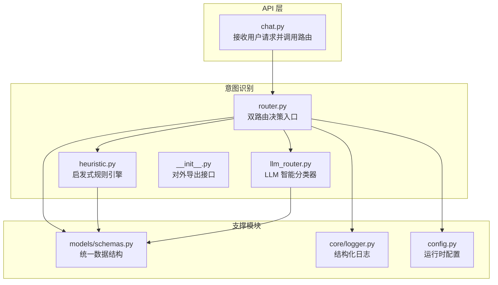
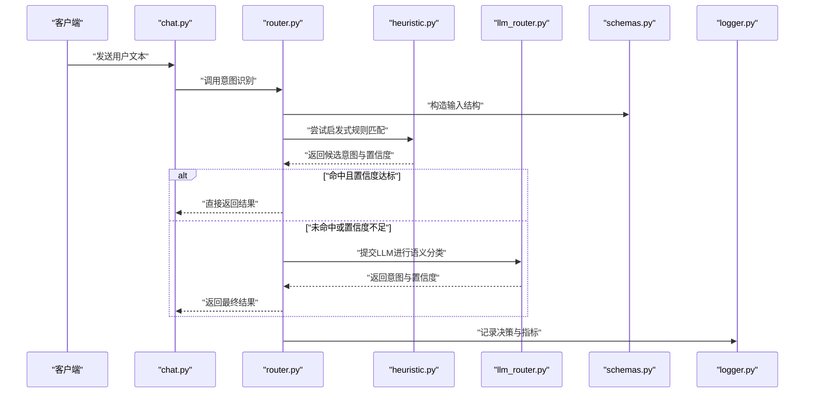
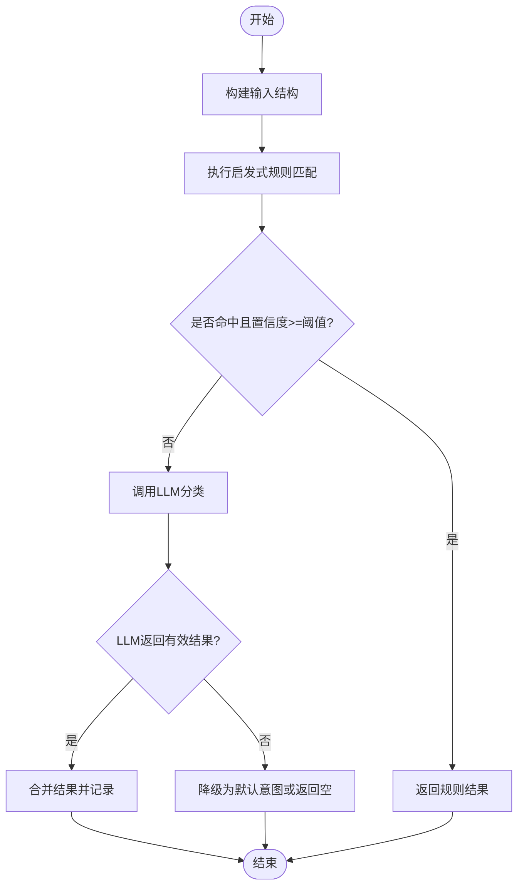
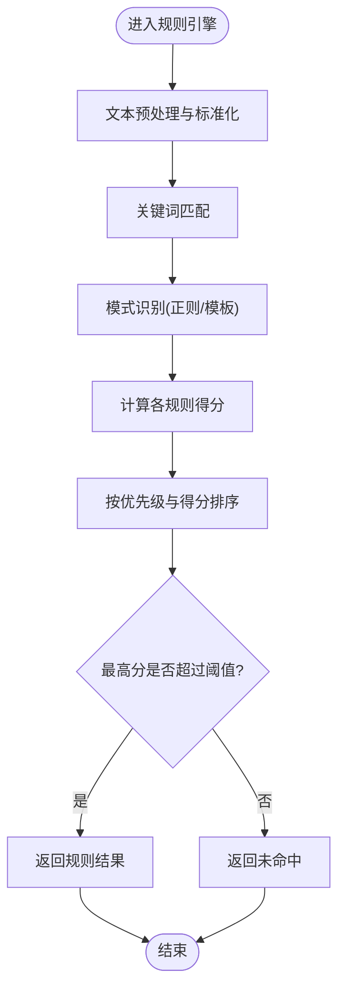
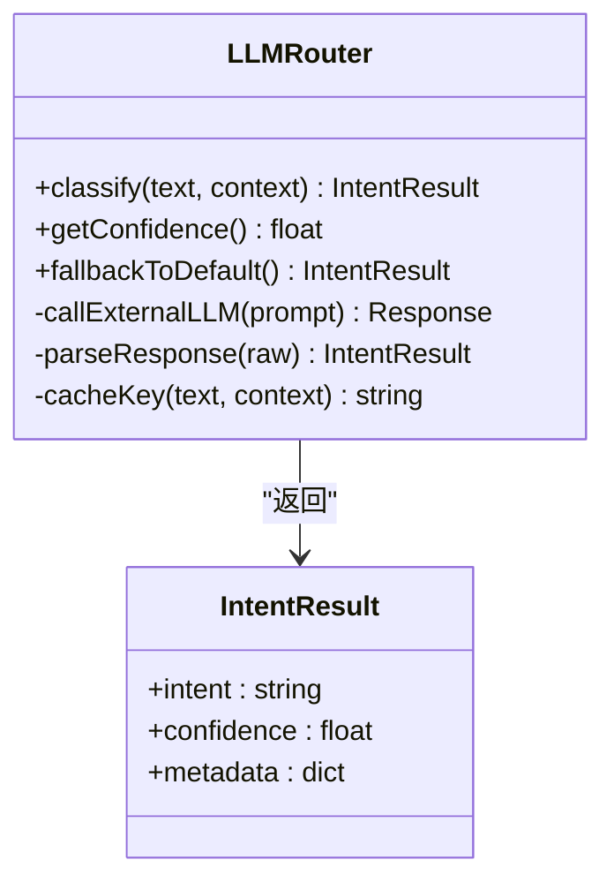
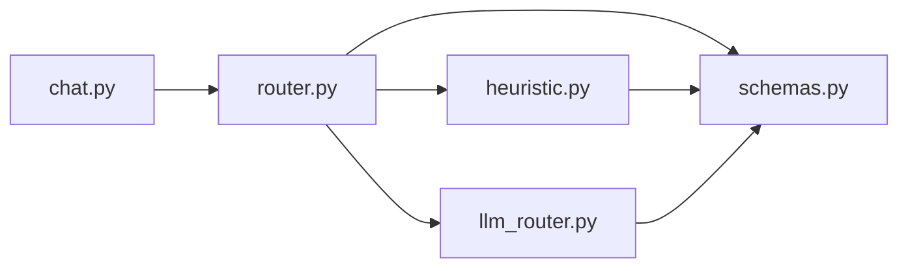

# 意图识别系统

<cite>
**本文引用的文件**   
- [backend_design/nexus/intent/router.py](file://backend_design/nexus/intent/router.py)
- [backend_design/nexus/intent/heuristic.py](file://backend_design/nexus/intent/heuristic.py)
- [backend_design/nexus/intent/llm_router.py](file://backend_design/nexus/intent/llm_router.py)
- [backend_design/nexus/intent/__init__.py](file://backend_design/nexus/intent/__init__.py)
- [backend_design/nexus/models/schemas.py](file://backend_design/nexus/models/schemas.py)
- [backend_design/nexus/api/routes/chat.py](file://backend_design/nexus/api/routes/chat.py)
- [backend_design/nexus/core/logger.py](file://backend_design/nexus/core/logger.py)
- [backend_design/nexus/config.py](file://backend_design/nexus/config.py)
</cite>

## 目录
1. [简介](#简介)
2. [项目结构](#项目结构)
3. [核心组件](#核心组件)
4. [架构总览](#架构总览)
5. [详细组件分析](#详细组件分析)
6. [依赖关系分析](#依赖关系分析)
7. [性能考虑](#性能考虑)
8. [故障排查指南](#故障排查指南)
9. [结论](#结论)
10. [附录](#附录)

## 简介
本技术文档聚焦于“意图识别系统”，该系统采用“启发式规则引擎 + 大语言模型（LLM）路由器”的双路由决策机制，对输入文本进行意图分类与分流。其目标是在保证高准确率与低延迟的前提下，将简单、明确的请求交由快速规则匹配处理，将复杂、模糊或需要上下文理解的请求交由LLM进行语义分析与置信度评估。文档涵盖整体架构、关键组件、数据流、错误处理、性能优化策略、常见意图类型定义示例以及自定义意图扩展指南。

## 项目结构
意图识别相关代码位于后端模块的 intent 子包中，并与 API 层、数据模型、日志与配置等模块协同工作。下图展示了与意图识别相关的核心文件及其职责：

图表来源
- [backend_design/nexus/api/routes/chat.py](file://backend_design/nexus/api/routes/chat.py)
- [backend_design/nexus/intent/router.py](file://backend_design/nexus/intent/router.py)
- [backend_design/nexus/intent/heuristic.py](file://backend_design/nexus/intent/heuristic.py)
- [backend_design/nexus/intent/llm_router.py](file://backend_design/nexus/intent/llm_router.py)
- [backend_design/nexus/intent/__init__.py](file://backend_design/nexus/intent/__init__.py)
- [backend_design/nexus/models/schemas.py](file://backend_design/nexus/models/schemas.py)
- [backend_design/nexus/core/logger.py](file://backend_design/nexus/core/logger.py)
- [backend_design/nexus/config.py](file://backend_design/nexus/config.py)

章节来源
- [backend_design/nexus/intent/router.py](file://backend_design/nexus/intent/router.py)
- [backend_design/nexus/intent/heuristic.py](file://backend_design/nexus/intent/heuristic.py)
- [backend_design/nexus/intent/llm_router.py](file://backend_design/nexus/intent/llm_router.py)
- [backend_design/nexus/intent/__init__.py](file://backend_design/nexus/intent/__init__.py)
- [backend_design/nexus/models/schemas.py](file://backend_design/nexus/models/schemas.py)
- [backend_design/nexus/api/routes/chat.py](file://backend_design/nexus/api/routes/chat.py)
- [backend_design/nexus/core/logger.py](file://backend_design/nexus/core/logger.py)
- [backend_design/nexus/config.py](file://backend_design/nexus/config.py)

## 核心组件
- 双路由决策器（router.py）
  - 负责根据输入文本特征与配置阈值，决定走“启发式规则匹配”还是“LLM 智能分类”。
  - 维护统一的输入输出契约，确保上游 API 与下游分类器之间的数据一致性。
- 启发式规则引擎（heuristic.py）
  - 基于关键词匹配、模式识别与规则优先级排序的快速分类路径。
  - 适用于高频、明确、可枚举的意图场景，具备极低延迟与高稳定性。
- LLM 路由器（llm_router.py）
  - 利用大模型的上下文理解与语义分析能力，对复杂、模糊或跨域意图进行分类。
  - 提供置信度评估与降级策略，保障在外部服务异常时的鲁棒性。
- 数据模型（schemas.py）
  - 定义统一的意图识别输入输出结构，包括原始文本、候选意图、置信度、元数据等字段。
- 日志与配置（logger.py, config.py）
  - 记录关键决策点与指标，支持按环境加载不同阈值与开关。

章节来源
- [backend_design/nexus/intent/router.py](file://backend_design/nexus/intent/router.py)
- [backend_design/nexus/intent/heuristic.py](file://backend_design/nexus/intent/heuristic.py)
- [backend_design/nexus/intent/llm_router.py](file://backend_design/nexus/intent/llm_router.py)
- [backend_design/nexus/models/schemas.py](file://backend_design/nexus/models/schemas.py)
- [backend_design/nexus/core/logger.py](file://backend_design/nexus/core/logger.py)
- [backend_design/nexus/config.py](file://backend_design/nexus/config.py)

## 架构总览
下图展示从 API 到意图识别再到下游处理的端到端流程，突出双路由决策与降级路径：

图表来源
- [backend_design/nexus/api/routes/chat.py](file://backend_design/nexus/api/routes/chat.py)
- [backend_design/nexus/intent/router.py](file://backend_design/nexus/intent/router.py)
- [backend_design/nexus/intent/heuristic.py](file://backend_design/nexus/intent/heuristic.py)
- [backend_design/nexus/intent/llm_router.py](file://backend_design/nexus/intent/llm_router.py)
- [backend_design/nexus/models/schemas.py](file://backend_design/nexus/models/schemas.py)
- [backend_design/nexus/core/logger.py](file://backend_design/nexus/core/logger.py)

## 详细组件分析

### 双路由决策器（router.py）
- 职责
  - 解析输入文本，构建统一的数据结构。
  - 依据配置阈值与文本复杂度判断是否优先使用启发式规则。
  - 当规则未命中或置信度不足时，触发 LLM 分类。
  - 汇总结果并记录日志与指标。
- 关键流程
  - 输入校验与标准化
  - 规则匹配与评分
  - 置信度阈值比较
  - LLM 调用与回退
  - 结果合并与输出
- 设计要点
  - 通过配置控制阈值与开关，便于灰度与A/B测试。
  - 与日志模块集成，记录决策分支与耗时。

图表来源
- [backend_design/nexus/intent/router.py](file://backend_design/nexus/intent/router.py)
- [backend_design/nexus/models/schemas.py](file://backend_design/nexus/models/schemas.py)
- [backend_design/nexus/core/logger.py](file://backend_design/nexus/core/logger.py)

章节来源
- [backend_design/nexus/intent/router.py](file://backend_design/nexus/intent/router.py)
- [backend_design/nexus/models/schemas.py](file://backend_design/nexus/models/schemas.py)
- [backend_design/nexus/core/logger.py](file://backend_design/nexus/core/logger.py)

### 启发式规则引擎（heuristic.py）
- 实现原理
  - 关键词匹配：针对高频意图建立词表，进行前缀、包含、正则等多粒度匹配。
  - 模式识别：基于固定句式、槽位模板与正则表达式识别意图参数。
  - 规则优先级排序：为每条规则赋予权重与优先级，冲突时按优先级与得分综合选择。
- 优势
  - 低延迟、高稳定、易维护；适合边界清晰的意图族。
- 维护建议
  - 定期复盘误判样本，补充负例词表与边界条件。
  - 引入规则版本化与灰度发布，避免一次性变更影响线上稳定性。

图表来源
- [backend_design/nexus/intent/heuristic.py](file://backend_design/nexus/intent/heuristic.py)
- [backend_design/nexus/models/schemas.py](file://backend_design/nexus/models/schemas.py)

章节来源
- [backend_design/nexus/intent/heuristic.py](file://backend_design/nexus/intent/heuristic.py)
- [backend_design/nexus/models/schemas.py](file://backend_design/nexus/models/schemas.py)

### LLM 路由器（llm_router.py）
- 智能分类能力
  - 上下文理解：结合历史对话与当前输入，提升歧义消解能力。
  - 语义分析：基于大模型对自然语言的深层理解进行意图判别。
  - 置信度评估：输出概率或置信度分数，供上层做阈值决策。
- 健壮性与降级
  - 超时与重试控制，失败时回退至默认意图或转交其他策略。
  - 缓存与批处理优化，降低重复请求成本。
- 监控与观测
  - 记录调用耗时、成功率、置信度分布与错误码，便于持续优化。

图表来源
- [backend_design/nexus/intent/llm_router.py](file://backend_design/nexus/intent/llm_router.py)
- [backend_design/nexus/models/schemas.py](file://backend_design/nexus/models/schemas.py)

章节来源
- [backend_design/nexus/intent/llm_router.py](file://backend_design/nexus/intent/llm_router.py)
- [backend_design/nexus/models/schemas.py](file://backend_design/nexus/models/schemas.py)

### 数据模型（schemas.py）
- 作用
  - 统一输入输出结构，确保 API、路由、规则与 LLM 之间的一致性。
  - 包含字段如原始文本、候选意图列表、置信度、元数据、时间戳等。
- 设计原则
  - 可扩展：新增意图或元数据无需改动核心逻辑。
  - 可观测：保留必要上下文以便问题定位与效果评估。

章节来源
- [backend_design/nexus/models/schemas.py](file://backend_design/nexus/models/schemas.py)

### API 集成（chat.py）
- 职责
  - 接收前端请求，调用意图识别路由，返回结构化响应。
  - 与认证、限流、会话管理等中间件协作。
- 关键点
  - 参数校验与错误包装。
  - 与日志模块联动，记录请求ID与关键指标。

章节来源
- [backend_design/nexus/api/routes/chat.py](file://backend_design/nexus/api/routes/chat.py)

## 依赖关系分析
- 内部依赖
  - router 依赖 heuristic 与 llm_router，并通过 schemas 统一数据契约。
  - API 层仅依赖 router 的对外接口，保持松耦合。
- 外部依赖
  - LLM 路由器可能依赖外部大模型服务，需考虑网络与可用性。
- 潜在循环依赖
  - 通过分层与接口抽象避免循环引用，确保单一职责。

图表来源
- [backend_design/nexus/api/routes/chat.py](file://backend_design/nexus/api/routes/chat.py)
- [backend_design/nexus/intent/router.py](file://backend_design/nexus/intent/router.py)
- [backend_design/nexus/intent/heuristic.py](file://backend_design/nexus/intent/heuristic.py)
- [backend_design/nexus/intent/llm_router.py](file://backend_design/nexus/intent/llm_router.py)
- [backend_design/nexus/models/schemas.py](file://backend_design/nexus/models/schemas.py)

章节来源
- [backend_design/nexus/api/routes/chat.py](file://backend_design/nexus/api/routes/chat.py)
- [backend_design/nexus/intent/router.py](file://backend_design/nexus/intent/router.py)
- [backend_design/nexus/intent/heuristic.py](file://backend_design/nexus/intent/heuristic.py)
- [backend_design/nexus/intent/llm_router.py](file://backend_design/nexus/intent/llm_router.py)
- [backend_design/nexus/models/schemas.py](file://backend_design/nexus/models/schemas.py)

## 性能考虑
- 规则引擎优化
  - 预编译正则与索引化词表，减少匹配开销。
  - 规则分组与短路求值，尽早返回高置信度结果。
- LLM 路由优化
  - 设置合理超时与最大重试次数，避免雪崩。
  - 启用请求去重与结果缓存，降低重复调用成本。
  - 批量处理与异步调用，提高吞吐。
- 阈值与开关
  - 通过配置动态调整规则命中率阈值与LLM调用比例，支持灰度与A/B测试。
- 观测与度量
  - 记录各类别命中率、平均耗时、错误率与置信度分布，指导持续调优。

[本节为通用性能建议，不直接分析具体文件]

## 故障排查指南
- 常见问题
  - 规则未命中：检查词表覆盖与正则边界，补充负例与长尾样本。
  - LLM 调用失败：确认外部服务状态、超时与重试策略，必要时降级为默认意图。
  - 置信度偏低：调整阈值或增加上下文信息，优化提示词与分类策略。
- 日志与诊断
  - 查看决策分支、耗时与错误码，定位瓶颈与异常。
  - 收集典型误判样本，用于规则迭代与模型微调。

章节来源
- [backend_design/nexus/core/logger.py](file://backend_design/nexus/core/logger.py)
- [backend_design/nexus/config.py](file://backend_design/nexus/config.py)

## 结论
本意图识别系统通过“启发式规则 + LLM 智能分类”的双路由机制，兼顾了速度与准确性。规则引擎负责快速处理明确意图，LLM 负责复杂与模糊场景的分类与置信度评估。配合完善的日志、配置与降级策略，系统在稳定性与可维护性方面具备良好表现。后续可通过持续的数据反馈与A/B测试进一步优化阈值与策略，提升整体准确率与用户体验。

[本节为总结性内容，不直接分析具体文件]

## 附录

### 常见意图类型定义示例
- 导航类
  - 关键词示例：导航、路线、目的地、附近
  - 模式示例：“带我去{地点}”、“导航到{地址}”
- 车辆控制类
  - 关键词示例：空调、车窗、座椅、温度、风量
  - 模式示例：“打开{设备}”、“把{设备}调到{档位}”
- 媒体播放类
  - 关键词示例：音乐、歌曲、电台、播放、暂停
  - 模式示例：“播放{歌手/歌单}”、“下一首”
- 健康与生活方式类
  - 关键词示例：心率、睡眠、运动、饮食、提醒
  - 模式示例：“记录{指标}”、“提醒我{事项}”
- 聊天与问答类
  - 关键词示例：你好、谢谢、为什么、怎么做
  - 模式示例：“{开放式问题}”

[本节为概念性说明，不直接分析具体文件]

### 自定义意图添加指南
- 步骤
  - 在规则引擎中添加关键词与模式，设定优先级与阈值。
  - 更新数据模型以支持新意图的元数据字段。
  - 在 LLM 路由器的提示词或分类策略中加入新意图描述。
  - 配置阈值与开关，进行灰度验证与回归测试。
  - 上线后持续收集误判样本，迭代优化规则与策略。
- 注意事项
  - 避免规则冲突，必要时引入互斥与覆盖策略。
  - 为新意图准备足够正负样本，确保规则与LLM均能稳定识别。
  - 记录变更与版本，便于回溯与回滚。

[本节为概念性说明，不直接分析具体文件]