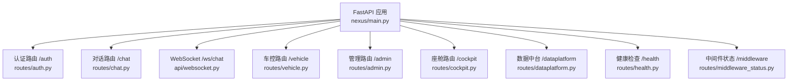
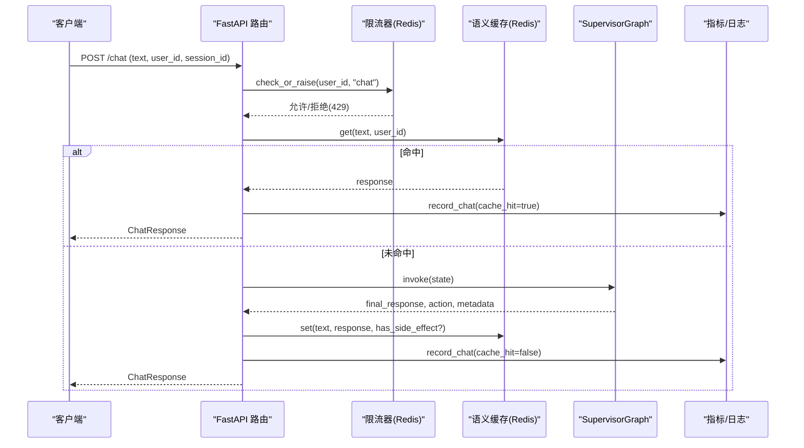
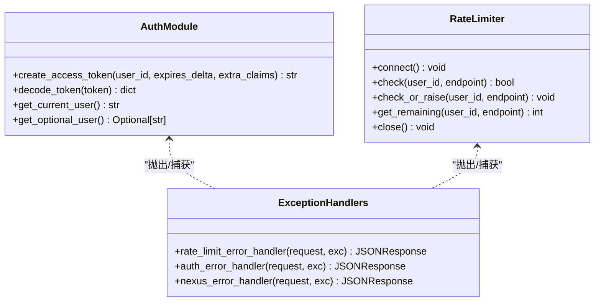
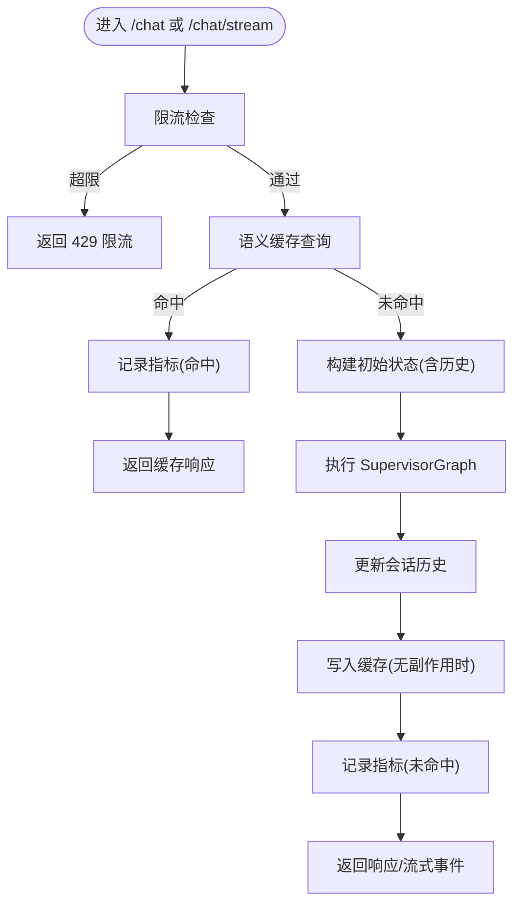
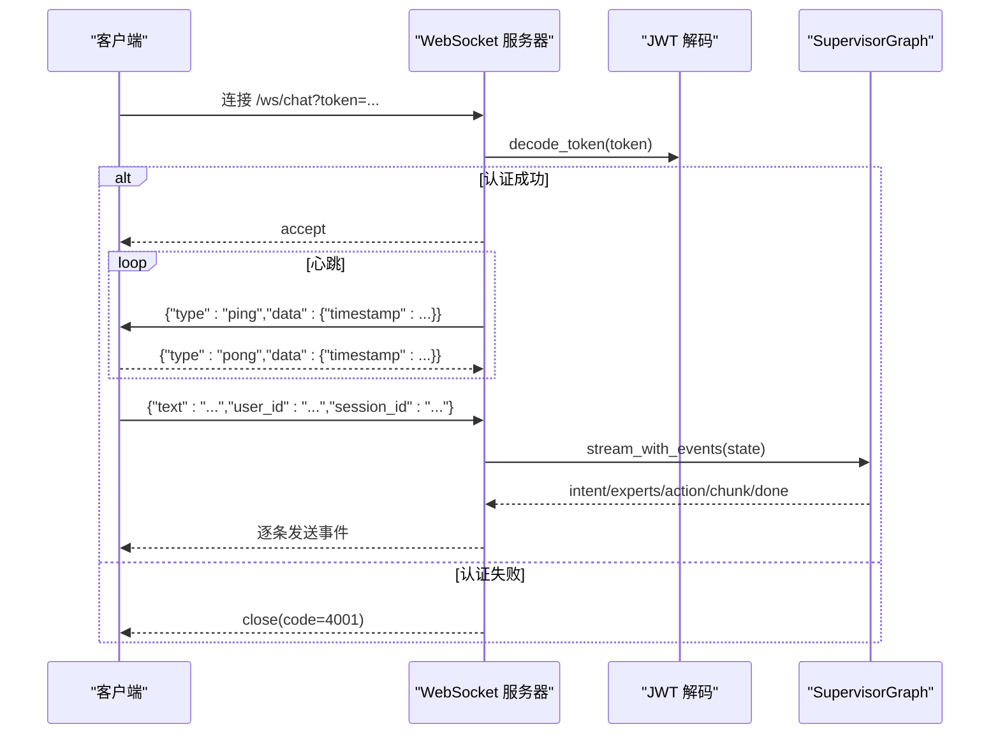
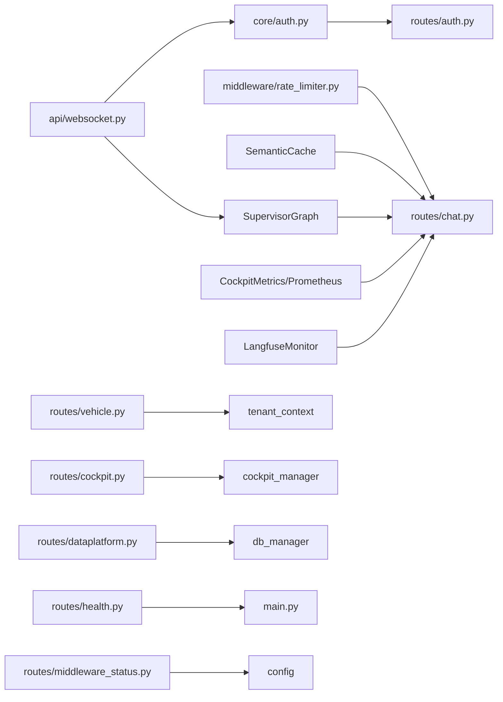

# API参考文档

<cite>
**本文引用的文件**   
- [backend_design/nexus/main.py](file://backend_design/nexus/main.py)
- [backend_design/nexus/api/routes/auth.py](file://backend_design/nexus/api/routes/auth.py)
- [backend_design/nexus/core/auth.py](file://backend_design/nexus/core/auth.py)
- [backend_design/nexus/api/routes/chat.py](file://backend_design/nexus/api/routes/chat.py)
- [backend_design/nexus/api/websocket.py](file://backend_design/nexus/api/websocket.py)
- [backend_design/nexus/middleware/rate_limiter.py](file://backend_design/nexus/middleware/rate_limiter.py)
- [backend_design/nexus/api/routes/vehicle.py](file://backend_design/nexus/api/routes/vehicle.py)
- [backend_design/nexus/api/routes/admin.py](file://backend_design/nexus/api/routes/admin.py)
- [backend_design/nexus/api/routes/cockpit.py](file://backend_design/nexus/api/routes/cockpit.py)
- [backend_design/nexus/api/routes/dataplatform.py](file://backend_design/nexus/api/routes/dataplatform.py)
- [backend_design/nexus/api/routes/health.py](file://backend_design/nexus/api/routes/health.py)
- [backend_design/nexus/api/routes/middleware_status.py](file://backend_design/nexus/api/routes/middleware_status.py)
</cite>

## 目录
1. [简介](#简介)
2. [项目结构](#项目结构)
3. [核心组件](#核心组件)
4. [架构总览](#架构总览)
5. [详细组件分析](#详细组件分析)
6. [依赖关系分析](#依赖关系分析)
7. [性能与限流](#性能与限流)
8. [故障排查指南](#故障排查指南)
9. [结论](#结论)
10. [附录：API清单与示例](#附录api清单与示例)

## 简介
本文件为 NexusCockpit 的完整 API 参考，覆盖 REST、WebSocket 与 SSE 三类接口，包含认证（JWT）、限流、错误码、版本管理与兼容性说明，并提供调用示例路径。系统基于 FastAPI 构建，提供多座舱隔离、Agent 工作流、语义缓存、指标采集与日志持久化等能力。

## 项目结构
后端采用模块化路由组织，按功能域划分：
- 认证与鉴权：auth 路由 + core.auth
- 对话：chat（REST + SSE）
- 实时通信：websocket
- 车控：vehicle
- 管理：admin
- 多座舱：cockpit
- 数据中台：dataplatform
- 健康检查：health
- 中间件状态：middleware_status
- 应用入口与全局异常处理：main

**图表来源**
- [backend_design/nexus/main.py:318-339](file://backend_design/nexus/main.py#L318-L339)

**章节来源**
- [backend_design/nexus/main.py:294-339](file://backend_design/nexus/main.py#L294-L339)

## 核心组件
- 认证模块：提供 JWT 签发与验证，支持可选认证依赖。
- 限流器：基于 Redis Lua 原子滑动窗口，默认 60 次/分钟。
- 会话与会话锁：Redis 持久化会话历史；同 session 并发锁避免交叉污染。
- 指标与追踪：Prometheus 指标、Langfuse 链路追踪、座舱级指标写入 Redis。
- 多座舱上下文：通过中间件注入 X-Cockpit-Id，并在各路由中使用 CockpitContext。

**章节来源**
- [backend_design/nexus/core/auth.py:36-141](file://backend_design/nexus/core/auth.py#L36-L141)
- [backend_design/nexus/middleware/rate_limiter.py:63-174](file://backend_design/nexus/middleware/rate_limiter.py#L63-L174)
- [backend_design/nexus/api/routes/chat.py:54-75](file://backend_design/nexus/api/routes/chat.py#L54-L75)
- [backend_design/nexus/main.py:397-431](file://backend_design/nexus/main.py#L397-L431)

## 架构总览
整体请求流程（以聊天为例）：
- 客户端 → FastAPI 路由 → 限流检查 → 语义缓存查询 → Agent 工作流执行 → 指标记录与日志持久化 → 返回响应或流式事件。

**图表来源**
- [backend_design/nexus/api/routes/chat.py:146-293](file://backend_design/nexus/api/routes/chat.py#L146-L293)
- [backend_design/nexus/middleware/rate_limiter.py:148-154](file://backend_design/nexus/middleware/rate_limiter.py#L148-L154)

## 详细组件分析

### 认证与安全规范
- 认证方式：JWT Bearer Token
  - 获取 Token：POST /auth/token
  - 校验 Token：Authorization: Bearer <token>
  - WebSocket 认证：通过 query 参数 token 传递
- 安全特性：
  - 全局异常处理器将 AuthError 映射为 401，并附带 WWW-Authenticate: Bearer
  - 限流器对高频请求返回 429，并携带 Retry-After 头
- 签名与速率限制：
  - 当前实现未提供请求签名机制
  - 速率限制基于 Redis 原子滑动窗口，默认 60 次/分钟

**图表来源**
- [backend_design/nexus/core/auth.py:36-141](file://backend_design/nexus/core/auth.py#L36-L141)
- [backend_design/nexus/middleware/rate_limiter.py:63-174](file://backend_design/nexus/middleware/rate_limiter.py#L63-L174)
- [backend_design/nexus/main.py:354-395](file://backend_design/nexus/main.py#L354-L395)

**章节来源**
- [backend_design/nexus/api/routes/auth.py:46-81](file://backend_design/nexus/api/routes/auth.py#L46-L81)
- [backend_design/nexus/core/auth.py:36-141](file://backend_design/nexus/core/auth.py#L36-L141)
- [backend_design/nexus/main.py:354-395](file://backend_design/nexus/main.py#L354-L395)
- [backend_design/nexus/middleware/rate_limiter.py:148-154](file://backend_design/nexus/middleware/rate_limiter.py#L148-L154)

### 文本对话 API（REST + SSE）
- 非流式对话
  - 方法：POST
  - URL：/chat
  - 请求体字段：text, user_id, session_id
  - 响应：ChatResponse（含 response, latency_ms, intent, action, trace_id 等）
- 流式对话（SSE）
  - 方法：POST
  - URL：/chat/stream
  - 请求体字段：同上
  - 响应：text/event-stream，事件类型包括 intent、experts、action、chunk、done、error
  - 头部：Cache-Control=no-cache, Connection=keep-alive, X-Accel-Buffering=no

**图表来源**
- [backend_design/nexus/api/routes/chat.py:146-293](file://backend_design/nexus/api/routes/chat.py#L146-L293)
- [backend_design/nexus/api/routes/chat.py:296-391](file://backend_design/nexus/api/routes/chat.py#L296-L391)

**章节来源**
- [backend_design/nexus/api/routes/chat.py:146-293](file://backend_design/nexus/api/routes/chat.py#L146-L293)
- [backend_design/nexus/api/routes/chat.py:296-391](file://backend_design/nexus/api/routes/chat.py#L296-L391)

### WebSocket 实时通信
- 连接建立
  - URL：/ws/chat?token=<jwt_token>
  - 认证：从 query 参数解析并验证 JWT
- 心跳机制
  - 服务端每 30 秒发送 ping，客户端需回复 pong
- 消息格式（统一 JSON）
  - 输入：{"type": "...", "data": {...}} 或 {"text": "...", "user_id": "...", "session_id": "..."}
  - 输出：intent/action/chunk/done/error/ping/pong 等事件
- 生命周期
  - 认证失败关闭连接
  - 接受连接后启动心跳任务
  - 循环接收消息，执行 Agent 管道，逐块返回事件
  - 断开时清理资源并减少活跃连接计数

**图表来源**
- [backend_design/nexus/api/websocket.py:47-91](file://backend_design/nexus/api/websocket.py#L47-L91)
- [backend_design/nexus/api/websocket.py:116-196](file://backend_design/nexus/api/websocket.py#L116-L196)

**章节来源**
- [backend_design/nexus/api/websocket.py:1-196](file://backend_design/nexus/api/websocket.py#L1-L196)

### 车控命令 API
- 直接执行命令
  - 方法：POST
  - URL：/vehicle/command
  - 请求体：command, arguments
  - 需要 JWT 认证
  - 响应：VehicleCommandResponse（success, message, data, error）
- 车辆状态
  - 方法：GET
  - URL：/vehicle/status
  - 需要 JWT 认证
  - 响应：扁平结构的状态字典
- 位置更新
  - 方法：POST
  - URL：/vehicle/location
  - 请求体：latitude, longitude
  - 需要 JWT 认证
  - 响应：成功/失败信息

**章节来源**
- [backend_design/nexus/api/routes/vehicle.py:47-129](file://backend_design/nexus/api/routes/vehicle.py#L47-L129)

### 管理接口
- 技能列表：GET /admin/skills
- 用户记忆：GET /admin/memory/{user_id}
- 缓存统计：GET /admin/cache/stats
- 清空缓存：POST /admin/cache/clear
- 活跃会话：GET /admin/sessions
- 知识库上传：POST /admin/kb/upload
- 重建索引：POST /admin/kb/reindex
- 知识库统计：GET /admin/kb/stats

**章节来源**
- [backend_design/nexus/api/routes/admin.py:22-170](file://backend_design/nexus/api/routes/admin.py#L22-L170)

### 多座舱 API（v2.1）
- 座舱状态：GET /cockpit/{cockpit_id}/status
- 座舱对话：POST /cockpit/{cockpit_id}/chat
- 座舱流式对话：POST /cockpit/{cockpit_id}/chat/stream
- 座舱车控指令：POST /cockpit/{cockpit_id}/vehicle/cmd
- 座舱车辆状态：GET /cockpit/{cockpit_id}/vehicle/status

**章节来源**
- [backend_design/nexus/api/routes/cockpit.py:55-263](file://backend_design/nexus/api/routes/cockpit.py#L55-L263)

### 数据中台 API（v2.1）
- 全局概览：GET /dataplatform/overview
- 单座舱详情：GET /dataplatform/cockpit/{cockpit_id}
- 并发能力：GET /dataplatform/concurrency
- 告警历史：GET /dataplatform/alerts?hours=24&cockpit_id=...
- Agent 活动：GET /dataplatform/agent/activity?hours=24&cockpit_id=...
- 座舱对比：GET /dataplatform/comparison

**章节来源**
- [backend_design/nexus/api/routes/dataplatform.py:28-320](file://backend_design/nexus/api/routes/dataplatform.py#L28-L320)

### 健康检查与中间件状态
- 健康检查：GET /health
- 根路径：GET /
- 中间件状态：GET /middleware/*（redis/milvus/neo4j/mysql/llm/tts/asr/app）

**章节来源**
- [backend_design/nexus/api/routes/health.py:22-111](file://backend_design/nexus/api/routes/health.py#L22-L111)
- [backend_design/nexus/api/routes/middleware_status.py:26-275](file://backend_design/nexus/api/routes/middleware_status.py#L26-L275)

## 依赖关系分析
- 路由层依赖：
  - auth 依赖 core.auth 进行 JWT 校验
  - chat 依赖 rate_limiter、semantic_cache、agent_graph、metrics、langfuse
  - websocket 依赖 core.auth、metrics、agent_graph
  - vehicle 依赖 tenant_context、vehicle_adapter、metrics
  - cockpit 依赖 cockpit_manager、tenant_context、agent_graph、metrics
  - dataplatform 依赖 cockpit_manager、db_manager、metrics
  - middleware_status 依赖配置与各中间件驱动
- 全局异常处理：
  - RateLimitError → 429
  - AuthError → 401
  - NexusError → 500

**图表来源**
- [backend_design/nexus/main.py:318-339](file://backend_design/nexus/main.py#L318-L339)
- [backend_design/nexus/api/routes/chat.py:36-49](file://backend_design/nexus/api/routes/chat.py#L36-L49)
- [backend_design/nexus/api/websocket.py:33-41](file://backend_design/nexus/api/websocket.py#L33-L41)
- [backend_design/nexus/api/routes/vehicle.py:23-28](file://backend_design/nexus/api/routes/vehicle.py#L23-L28)
- [backend_design/nexus/api/routes/cockpit.py:19-26](file://backend_design/nexus/api/routes/cockpit.py#L19-L26)
- [backend_design/nexus/api/routes/dataplatform.py:18-21](file://backend_design/nexus/api/routes/dataplatform.py#L18-L21)

**章节来源**
- [backend_design/nexus/main.py:318-339](file://backend_design/nexus/main.py#L318-L339)

## 性能与限流
- 限流策略
  - 基于 Redis Lua 脚本的原子滑动窗口，保证并发安全
  - 默认 60 次/分钟，超限返回 429 并带 Retry-After 头
  - 出错时降级放行，确保可用性
- 会话并发控制
  - 同一 session 使用 asyncio.Lock 串行处理，防止历史交叉污染
  - 空闲锁定期清理，防止内存泄漏
- 指标与追踪
  - Prometheus 指标：请求计数、延迟、Agent 调用次数、缓存命中/未命中
  - Langfuse 链路追踪：在 API 层创建 trace，贯穿整个请求生命周期
  - 座舱级指标：chat_count、vehicle_cmd_count、last_latency_ms、cache_hit_rate

**章节来源**
- [backend_design/nexus/middleware/rate_limiter.py:63-174](file://backend_design/nexus/middleware/rate_limiter.py#L63-L174)
- [backend_design/nexus/api/routes/chat.py:54-75](file://backend_design/nexus/api/routes/chat.py#L54-L75)
- [backend_design/nexus/api/routes/chat.py:77-144](file://backend_design/nexus/api/routes/chat.py#L77-L144)

## 故障排查指南
- 常见问题定位
  - 401 未认证：检查 Authorization 头是否携带 Bearer Token，或 WebSocket query 参数 token 是否正确
  - 429 限流：降低请求频率或调整限流阈值
  - 500 内部错误：查看 NexusError 日志，确认 Agent 工作流与外部依赖（Milvus/Neo4j/Redis/MySQL）状态
- 健康检查
  - GET /health 返回各组件连接状态（milvus/neo4j/redis/rabbitmq/mysql/agent）
- 中间件状态
  - GET /middleware/ 及各子端点可快速诊断 Redis/Milvus/Neo4j/MySQL/LLM/TTS/ASR 配置与连通性

**章节来源**
- [backend_design/nexus/main.py:354-395](file://backend_design/nexus/main.py#L354-L395)
- [backend_design/nexus/api/routes/health.py:22-98](file://backend_design/nexus/api/routes/health.py#L22-L98)
- [backend_design/nexus/api/routes/middleware_status.py:26-275](file://backend_design/nexus/api/routes/middleware_status.py#L26-L275)

## 结论
NexusCockpit 提供了完善的 REST、WebSocket 与 SSE 接口体系，结合 JWT 认证、分布式限流、语义缓存、指标与链路追踪，以及多座舱隔离能力，满足企业级车载语音智能体的生产需求。建议在生产环境完善密码校验、接入外部身份源，并根据业务场景调优限流阈值与缓存 TTL。

## 附录：API清单与示例

### REST 接口清单
- 认证
  - POST /auth/token
  - GET /auth/me
  - POST /auth/change-password
- 对话
  - POST /chat
  - POST /chat/stream
- WebSocket
  - GET /ws/chat?token=...
- 车控
  - POST /vehicle/command
  - GET /vehicle/status
  - POST /vehicle/location
- 管理
  - GET /admin/skills
  - GET /admin/memory/{user_id}
  - GET /admin/cache/stats
  - POST /admin/cache/clear
  - GET /admin/sessions
  - POST /admin/kb/upload
  - POST /admin/kb/reindex
  - GET /admin/kb/stats
- 多座舱
  - GET /cockpit/{cockpit_id}/status
  - POST /cockpit/{cockpit_id}/chat
  - POST /cockpit/{cockpit_id}/chat/stream
  - POST /cockpit/{cockpit_id}/vehicle/cmd
  - GET /cockpit/{cockpit_id}/vehicle/status
- 数据中台
  - GET /dataplatform/overview
  - GET /dataplatform/cockpit/{cockpit_id}
  - GET /dataplatform/concurrency
  - GET /dataplatform/alerts
  - GET /dataplatform/agent/activity
  - GET /dataplatform/comparison
- 健康与中间件
  - GET /health
  - GET /
  - GET /middleware/*

**章节来源**
- [backend_design/nexus/api/routes/auth.py:46-109](file://backend_design/nexus/api/routes/auth.py#L46-L109)
- [backend_design/nexus/api/routes/chat.py:146-391](file://backend_design/nexus/api/routes/chat.py#L146-L391)
- [backend_design/nexus/api/websocket.py:70-91](file://backend_design/nexus/api/websocket.py#L70-L91)
- [backend_design/nexus/api/routes/vehicle.py:47-129](file://backend_design/nexus/api/routes/vehicle.py#L47-L129)
- [backend_design/nexus/api/routes/admin.py:22-170](file://backend_design/nexus/api/routes/admin.py#L22-L170)
- [backend_design/nexus/api/routes/cockpit.py:55-263](file://backend_design/nexus/api/routes/cockpit.py#L55-L263)
- [backend_design/nexus/api/routes/dataplatform.py:28-320](file://backend_design/nexus/api/routes/dataplatform.py#L28-L320)
- [backend_design/nexus/api/routes/health.py:22-111](file://backend_design/nexus/api/routes/health.py#L22-L111)
- [backend_design/nexus/api/routes/middleware_status.py:26-275](file://backend_design/nexus/api/routes/middleware_status.py#L26-L275)

### 错误码定义
- 401 Unauthorized：认证失败（AuthError），响应体包含 error、message、details，并附带 WWW-Authenticate: Bearer
- 429 Too Many Requests：限流触发（RateLimitError），响应体包含 error、message、details，并附带 Retry-After: 60
- 500 Internal Server Error：其他自定义异常（NexusError），响应体包含 error、message、details

**章节来源**
- [backend_design/nexus/main.py:354-395](file://backend_design/nexus/main.py#L354-L395)

### SSE 流式响应规范
- 媒体类型：text/event-stream
- 事件格式：data: {JSON}\n\n
- 事件类型：intent、experts、action、chunk、done、error
- 断线重连：客户端应监听 error 事件并重试连接
- 头部：Cache-Control=no-cache, Connection=keep-alive, X-Accel-Buffering=no

**章节来源**
- [backend_design/nexus/api/routes/chat.py:296-391](file://backend_design/nexus/api/routes/chat.py#L296-L391)

### 认证机制（JWT）
- 获取 Token：POST /auth/token，返回 access_token、token_type、expires_in
- 携带 Token：Authorization: Bearer <token>
- WebSocket 认证：/ws/chat?token=<jwt_token>
- 可选认证：get_optional_user 用于不强制认证的接口

**章节来源**
- [backend_design/nexus/api/routes/auth.py:46-81](file://backend_design/nexus/api/routes/auth.py#L46-L81)
- [backend_design/nexus/core/auth.py:36-141](file://backend_design/nexus/core/auth.py#L36-L141)
- [backend_design/nexus/api/websocket.py:47-91](file://backend_design/nexus/api/websocket.py#L47-L91)

### 速率限制
- 默认限制：60 次/分钟
- 键空间：nexus:ratelimit:{user_id}:{endpoint}
- 超限行为：返回 429，并带 Retry-After 头
- 降级策略：Redis 不可用时放行

**章节来源**
- [backend_design/nexus/middleware/rate_limiter.py:63-174](file://backend_design/nexus/middleware/rate_limiter.py#L63-L174)
- [backend_design/nexus/main.py:354-368](file://backend_design/nexus/main.py#L354-L368)

### API 版本管理与兼容性
- 应用版本：2.0.0（FastAPI 初始化）
- 根路径版本：2.1.0（健康检查返回）
- 向后兼容：
  - 新增 v2.1/v2.2 路由前缀与能力，不影响既有 /chat、/vehicle 等接口
  - 移除 RabbitMQ/Celery 相关能力（v2.2 简化），对应状态查询返回 removed
- 废弃接口迁移：
  - 若未来弃用某接口，建议在响应体增加 deprecation 字段，并通过 /middleware/app 暴露版本与弃用提示

**章节来源**
- [backend_design/nexus/main.py:302-307](file://backend_design/nexus/main.py#L302-L307)
- [backend_design/nexus/api/routes/health.py:101-111](file://backend_design/nexus/api/routes/health.py#L101-L111)
- [backend_design/nexus/api/routes/middleware_status.py:61-65](file://backend_design/nexus/api/routes/middleware_status.py#L61-L65)

### 调用示例（路径引用）
- curl 示例：参见测试脚本与快速开发模板中的 HTTP 调用片段
  - [backend_design/scripts/test_api.py](file://backend_design/scripts/test_api.py)
  - [.catpaw/skills/rapid-dev/SKILL.md:39-81](file://.catpaw/skills/rapid-dev/SKILL.md#L39-L81)
- JavaScript 客户端：参见前端 lib/api.ts 与 hooks/use-async.ts 中的异步封装
  - [frontend_design/src/lib/api.ts](file://frontend_design/src/lib/api.ts)
  - [frontend_design/src/hooks/use-async.ts:21-63](file://frontend_design/src/hooks/use-async.ts#L21-L63)
- Python SDK：参见 .catpaw/meituan-skills 中的 httpx 调用示例（可作为 SDK 风格参考）
  - [.catpaw/meituan-skills/meituan-fenxiao-promotion-coupon/scripts/auth.py:255-392](file://.catpaw/meituan-skills/meituan-fenxiao-promotion-coupon/scripts/auth.py#L255-L392)
  - [.catpaw/meituan-skills/meituan-fenxiao-promotion-coupon/scripts/issue.py:160-193](file://.catpaw/meituan-skills/meituan-fenxiao-promotion-coupon/scripts/issue.py#L160-L193)