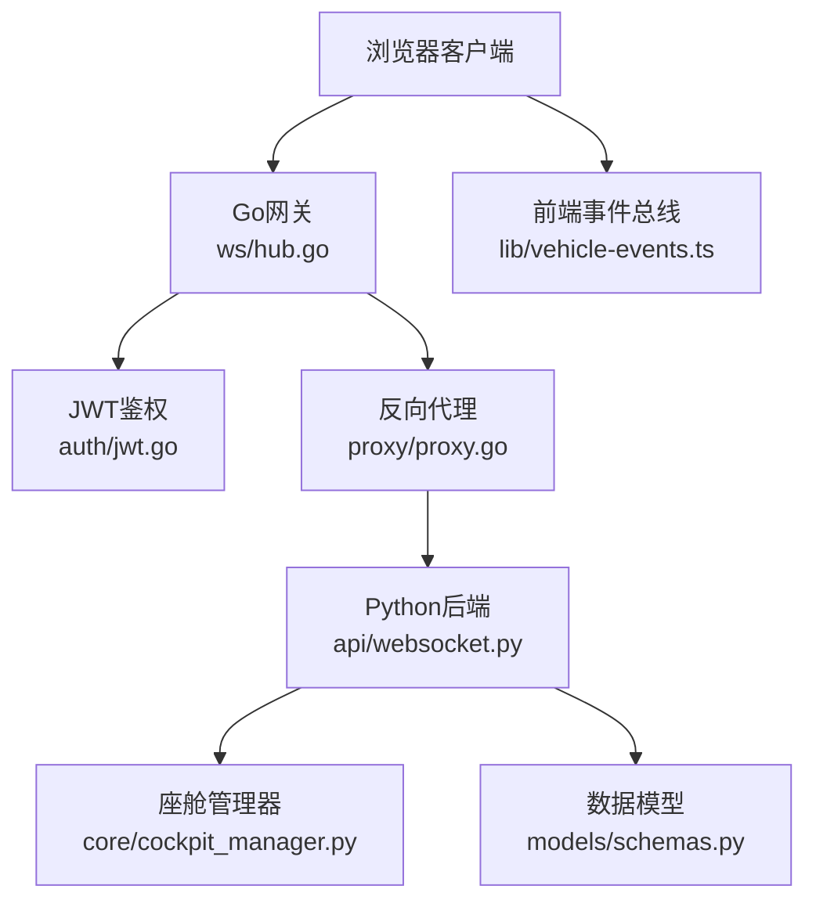
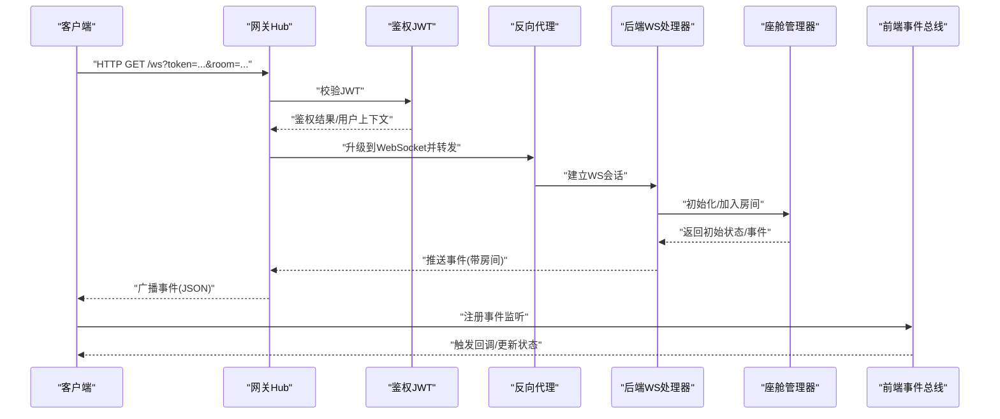
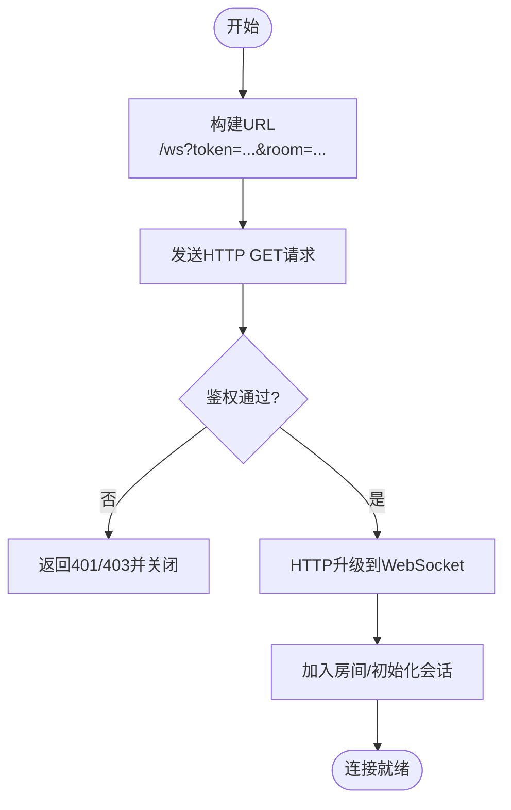
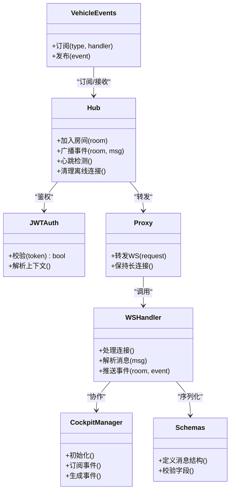

# WebSocket通信协议

<cite>
**本文引用的文件**   
- [backend_design/nexus/api/websocket.py](file://backend_design/nexus/api/websocket.py)
- [backend_design/nexus_gate/internal/ws/hub.go](file://backend_design/nexus_gate/internal/ws/hub.go)
- [backend_design/nexus_gate/internal/auth/jwt.go](file://backend_design/nexus_gate/internal/auth/jwt.go)
- [backend_design/nexus_gate/internal/proxy/proxy.go](file://backend_design/nexus_gate/internal/proxy/proxy.go)
- [backend_design/nexus/core/cockpit_manager.py](file://backend_design/nexus/core/cockpit_manager.py)
- [backend_design/nexus/models/schemas.py](file://backend_design/nexus/models/schemas.py)
- [frontend_design/src/lib/vehicle-events.ts](file://frontend_design/src/lib/vehicle-events.ts)
</cite>

## 目录
1. [简介](#简介)
2. [项目结构](#项目结构)
3. [核心组件](#核心组件)
4. [架构总览](#架构总览)
5. [详细组件分析](#详细组件分析)
6. [依赖关系分析](#依赖关系分析)
7. [性能考虑](#性能考虑)
8. [故障排查指南](#故障排查指南)
9. [结论](#结论)
10. [附录](#附录)

## 简介
本文件面向NexusCockpit项目的WebSocket通信协议，覆盖连接建立（握手、鉴权、房间加入）、消息格式规范（JSON结构、事件类型、序列化）、实时事件类型（语音识别进度、TTS合成状态、车控执行结果、系统通知等）、连接管理（心跳、断线重连、消息队列、广播机制），并提供客户端实现示例与最佳实践。文档同时给出架构图、时序图与流程图，帮助读者快速理解并正确集成。

## 项目结构
本项目采用前后端分离与网关分层：
- Go网关层负责WebSocket接入、鉴权、路由转发与广播。
- Python后端提供业务逻辑、会话与设备控制能力。
- 前端通过浏览器WebSocket API与网关交互，订阅实时事件。

图表来源
- [backend_design/nexus_gate/internal/ws/hub.go](file://backend_design/nexus_gate/internal/ws/hub.go)
- [backend_design/nexus_gate/internal/auth/jwt.go](file://backend_design/nexus_gate/internal/auth/jwt.go)
- [backend_design/nexus_gate/internal/proxy/proxy.go](file://backend_design/nexus_gate/internal/proxy/proxy.go)
- [backend_design/nexus/api/websocket.py](file://backend_design/nexus/api/websocket.py)
- [backend_design/nexus/core/cockpit_manager.py](file://backend_design/nexus/core/cockpit_manager.py)
- [backend_design/nexus/models/schemas.py](file://backend_design/nexus/models/schemas.py)
- [frontend_design/src/lib/vehicle-events.ts](file://frontend_design/src/lib/vehicle-events.ts)

章节来源
- [backend_design/nexus_gate/internal/ws/hub.go](file://backend_design/nexus_gate/internal/ws/hub.go)
- [backend_design/nexus_gate/internal/auth/jwt.go](file://backend_design/nexus_gate/internal/auth/jwt.go)
- [backend_design/nexus_gate/internal/proxy/proxy.go](file://backend_design/nexus_gate/internal/proxy/proxy.go)
- [backend_design/nexus/api/websocket.py](file://backend_design/nexus/api/websocket.py)
- [backend_design/nexus/core/cockpit_manager.py](file://backend_design/nexus/core/cockpit_manager.py)
- [backend_design/nexus/models/schemas.py](file://backend_design/nexus/models/schemas.py)
- [frontend_design/src/lib/vehicle-events.ts](file://frontend_design/src/lib/vehicle-events.ts)

## 核心组件
- 网关Hub：维护连接集合、房间广播、消息分发与心跳检测。
- 鉴权模块：校验JWT令牌，提取用户上下文与会话标识。
- 反向代理：将WebSocket请求转发至Python后端服务。
- 后端WebSocket处理器：解析消息、执行业务逻辑、推送实时事件。
- 座舱管理器：协调ASR/TTS/车控等子系统，生成统一事件流。
- 数据模型：定义消息结构与字段约束。
- 前端事件总线：封装事件订阅与状态管理。

章节来源
- [backend_design/nexus_gate/internal/ws/hub.go](file://backend_design/nexus_gate/internal/ws/hub.go)
- [backend_design/nexus_gate/internal/auth/jwt.go](file://backend_design/nexus_gate/internal/auth/jwt.go)
- [backend_design/nexus_gate/internal/proxy/proxy.go](file://backend_design/nexus_gate/internal/proxy/proxy.go)
- [backend_design/nexus/api/websocket.py](file://backend_design/nexus/api/websocket.py)
- [backend_design/nexus/core/cockpit_manager.py](file://backend_design/nexus/core/cockpit_manager.py)
- [backend_design/nexus/models/schemas.py](file://backend_design/nexus/models/schemas.py)
- [frontend_design/src/lib/vehicle-events.ts](file://frontend_design/src/lib/vehicle-events.ts)

## 架构总览
整体流程：客户端通过HTTP升级建立WebSocket连接；网关进行鉴权与路由；后端处理业务并产生实时事件；网关按房间广播给订阅者；前端基于事件总线更新UI与状态。

图表来源
- [backend_design/nexus_gate/internal/ws/hub.go](file://backend_design/nexus_gate/internal/ws/hub.go)
- [backend_design/nexus_gate/internal/auth/jwt.go](file://backend_design/nexus_gate/internal/auth/jwt.go)
- [backend_design/nexus_gate/internal/proxy/proxy.go](file://backend_design/nexus_gate/internal/proxy/proxy.go)
- [backend_design/nexus/api/websocket.py](file://backend_design/nexus/api/websocket.py)
- [backend_design/nexus/core/cockpit_manager.py](file://backend_design/nexus/core/cockpit_manager.py)
- [frontend_design/src/lib/vehicle-events.ts](file://frontend_design/src/lib/vehicle-events.ts)

## 详细组件分析

### 连接建立与握手
- 客户端发起HTTP GET到网关的WebSocket路径，携带查询参数：
  - token：JWT访问令牌
  - room：目标房间标识（可选）
- 网关在握手前完成JWT校验，失败则拒绝升级。
- 鉴权通过后，网关将连接升级为WebSocket并转发至后端。
- 后端接收连接后，根据room创建或复用会话，并返回初始状态。

图表来源
- [backend_design/nexus_gate/internal/ws/hub.go](file://backend_design/nexus_gate/internal/ws/hub.go)
- [backend_design/nexus_gate/internal/auth/jwt.go](file://backend_design/nexus_gate/internal/auth/jwt.go)
- [backend_design/nexus_gate/internal/proxy/proxy.go](file://backend_design/nexus_gate/internal/proxy/proxy.go)
- [backend_design/nexus/api/websocket.py](file://backend_design/nexus/api/websocket.py)

章节来源
- [backend_design/nexus_gate/internal/ws/hub.go](file://backend_design/nexus_gate/internal/ws/hub.go)
- [backend_design/nexus_gate/internal/auth/jwt.go](file://backend_design/nexus_gate/internal/auth/jwt.go)
- [backend_design/nexus_gate/internal/proxy/proxy.go](file://backend_design/nexus_gate/internal/proxy/proxy.go)
- [backend_design/nexus/api/websocket.py](file://backend_design/nexus/api/websocket.py)

### 身份验证
- JWT令牌由认证服务签发，包含用户ID、角色、过期时间等。
- 网关在握手阶段解析并校验签名、有效期与权限范围。
- 鉴权成功后，网关将用户上下文注入后续处理链。

章节来源
- [backend_design/nexus_gate/internal/auth/jwt.go](file://backend_design/nexus_gate/internal/auth/jwt.go)

### 房间加入机制
- 客户端在连接时指定room参数以加入特定房间。
- 网关为每个房间维护连接集合，支持广播与定向推送。
- 后端根据room绑定会话资源，确保事件隔离与多租户安全。

章节来源
- [backend_design/nexus_gate/internal/ws/hub.go](file://backend_design/nexus_gate/internal/ws/hub.go)
- [backend_design/nexus/api/websocket.py](file://backend_design/nexus/api/websocket.py)

### 消息格式规范
- 所有消息均为JSON文本帧。
- 通用结构包含以下字段：
  - type：事件类型字符串
  - payload：事件载荷对象
  - meta：元信息（如会话ID、时间戳、房间号、追踪ID）
- 序列化要求：
  - 使用UTF-8编码
  - 数值类型避免过大精度损失
  - 时间戳使用ISO 8601或Unix毫秒
  - 二进制数据采用Base64嵌入payload

章节来源
- [backend_design/nexus/models/schemas.py](file://backend_design/nexus/models/schemas.py)

### 事件类型定义
- 语音识别进度：用于上报ASR阶段性结果与最终文本
- TTS合成状态：用于上报TTS合成进度与音频片段
- 车控执行结果：用于上报车辆控制指令的执行状态与反馈
- 系统通知：用于上报系统级提示、告警与配置变更

章节来源
- [backend_design/nexus/core/cockpit_manager.py](file://backend_design/nexus/core/cockpit_manager.py)
- [backend_design/nexus/models/schemas.py](file://backend_design/nexus/models/schemas.py)

### 连接管理
- 心跳检测：
  - 服务端周期性发送ping帧，客户端需回复pong帧
  - 超时未响应则判定连接失效并清理资源
- 断线重连：
  - 客户端指数退避重试，最大重试次数与间隔可配置
  - 重连时携带原token与room，恢复会话上下文
- 消息队列：
  - 服务端对瞬时高并发消息进行缓冲与限流
  - 客户端本地队列保证顺序与可靠性
- 广播机制：
  - 网关按房间广播事件，支持选择性订阅
  - 后端聚合多源事件后统一推送

章节来源
- [backend_design/nexus_gate/internal/ws/hub.go](file://backend_design/nexus_gate/internal/ws/hub.go)
- [backend_design/nexus/api/websocket.py](file://backend_design/nexus/api/websocket.py)

### 客户端实现示例（JavaScript）
- 连接建立：
  - 使用WebSocket API连接到网关地址，附带token与room查询参数
  - 监听open、message、error、close事件
- 错误处理：
  - 捕获网络异常与鉴权失败，记录日志并重试
  - 对无效消息进行容错解析
- 状态管理：
  - 维护连接状态、房间列表与事件缓存
  - 使用事件总线解耦UI与通信层

章节来源
- [frontend_design/src/lib/vehicle-events.ts](file://frontend_design/src/lib/vehicle-events.ts)

## 依赖关系分析
- 网关Hub依赖鉴权与代理模块，负责连接生命周期与消息分发。
- 后端WS处理器依赖座舱管理器与数据模型，负责业务编排与事件生成。
- 前端事件总线依赖WebSocket实例，负责事件订阅与状态同步。

图表来源
- [backend_design/nexus_gate/internal/ws/hub.go](file://backend_design/nexus_gate/internal/ws/hub.go)
- [backend_design/nexus_gate/internal/auth/jwt.go](file://backend_design/nexus_gate/internal/auth/jwt.go)
- [backend_design/nexus_gate/internal/proxy/proxy.go](file://backend_design/nexus_gate/internal/proxy/proxy.go)
- [backend_design/nexus/api/websocket.py](file://backend_design/nexus/api/websocket.py)
- [backend_design/nexus/core/cockpit_manager.py](file://backend_design/nexus/core/cockpit_manager.py)
- [backend_design/nexus/models/schemas.py](file://backend_design/nexus/models/schemas.py)
- [frontend_design/src/lib/vehicle-events.ts](file://frontend_design/src/lib/vehicle-events.ts)

章节来源
- [backend_design/nexus_gate/internal/ws/hub.go](file://backend_design/nexus_gate/internal/ws/hub.go)
- [backend_design/nexus_gate/internal/auth/jwt.go](file://backend_design/nexus_gate/internal/auth/jwt.go)
- [backend_design/nexus_gate/internal/proxy/proxy.go](file://backend_design/nexus_gate/internal/proxy/proxy.go)
- [backend_design/nexus/api/websocket.py](file://backend_design/nexus/api/websocket.py)
- [backend_design/nexus/core/cockpit_manager.py](file://backend_design/nexus/core/cockpit_manager.py)
- [backend_design/nexus/models/schemas.py](file://backend_design/nexus/models/schemas.py)
- [frontend_design/src/lib/vehicle-events.ts](file://frontend_design/src/lib/vehicle-events.ts)

## 性能考虑
- 批量合并：将高频小事件合并为批次，降低网络开销。
- 背压控制：当客户端消费慢时，服务端限流或丢弃低优先级事件。
- 连接池：复用底层连接，减少握手成本。
- 压缩传输：对大负载启用gzip或二进制编码。
- 监控指标：统计连接数、消息吞吐、延迟分布与错误率。

[本节为通用指导，不直接分析具体文件]

## 故障排查指南
- 鉴权失败：
  - 检查token是否过期、签名是否正确、权限是否足够
  - 查看网关鉴权日志与后端会话上下文
- 房间无法加入：
  - 确认room参数合法且未被占用
  - 检查后端房间管理与资源分配
- 心跳超时：
  - 调整心跳间隔与超时阈值
  - 检查网络质量与中间件拦截
- 消息丢失或乱序：
  - 启用客户端本地队列与去重
  - 服务端增加序列号与ACK机制

章节来源
- [backend_design/nexus_gate/internal/auth/jwt.go](file://backend_design/nexus_gate/internal/auth/jwt.go)
- [backend_design/nexus_gate/internal/ws/hub.go](file://backend_design/nexus_gate/internal/ws/hub.go)
- [backend_design/nexus/api/websocket.py](file://backend_design/nexus/api/websocket.py)

## 结论
本WebSocket协议通过网关鉴权与房间广播，结合后端业务编排，实现了稳定高效的实时通信。遵循统一的JSON消息规范与事件类型定义，有助于前后端协同开发与长期演进。建议在生产环境完善监控、限流与容错策略，以提升整体可靠性与用户体验。

[本节为总结性内容，不直接分析具体文件]

## 附录
- 客户端最佳实践：
  - 连接建立后立即订阅所需事件，避免遗漏初始状态
  - 实现指数退避重连与最大重试限制
  - 对关键事件增加幂等处理与去重
- 服务端优化建议：
  - 使用无锁数据结构维护房间与连接映射
  - 引入异步任务队列削峰填谷
  - 定期清理僵尸连接与释放资源

[本节为补充说明，不直接分析具体文件]