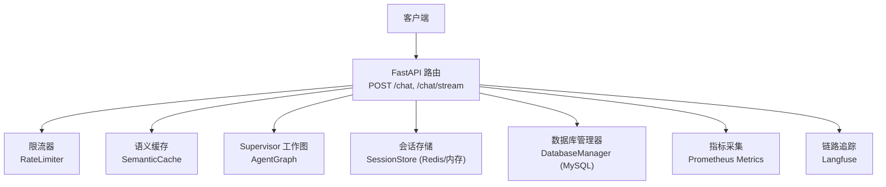
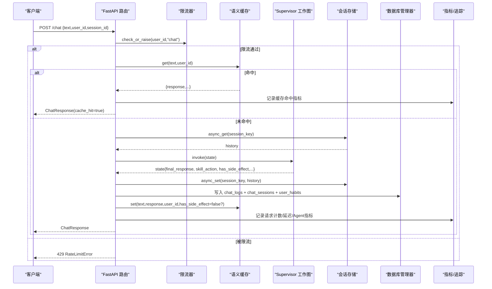
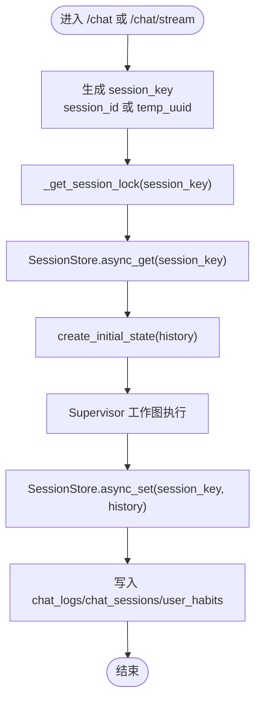
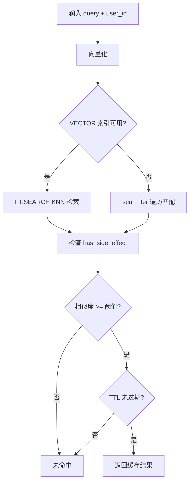
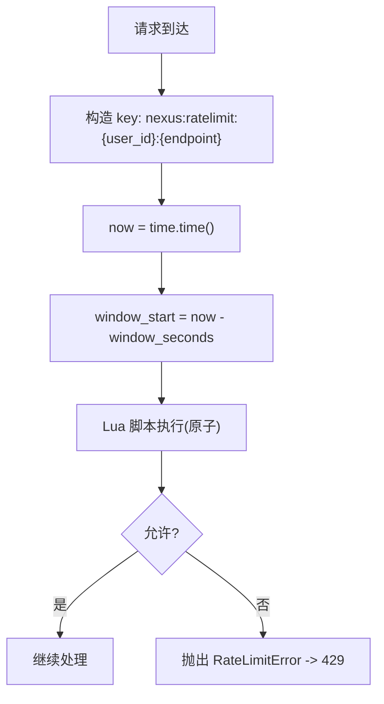
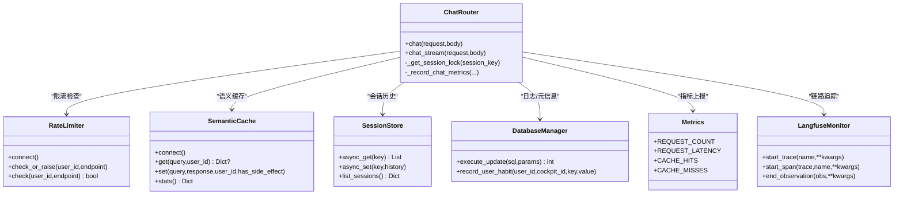

# 对话API接口

<cite>
**本文引用的文件列表**
- [chat.py](file://backend_design/nexus/api/routes/chat.py)
- [schemas.py](file://backend_design/nexus/models/schemas.py)
- [session_store.py](file://backend_design/nexus/middleware/session_store.py)
- [db_manager.py](file://backend_design/nexus/core/db_manager.py)
- [redis_cache.py](file://backend_design/nexus/middleware/redis_cache.py)
- [rate_limiter.py](file://backend_design/nexus/middleware/rate_limiter.py)
- [state.py](file://backend_design/nexus/models/state.py)
- [metrics.py](file://backend_design/nexus/observability/metrics.py)
- [langfuse.py](file://backend_design/nexus/observability/langfuse.py)
- [exceptions.py](file://backend_design/nexus/core/exceptions.py)
</cite>

## 目录
1. [简介](#简介)
2. [项目结构](#项目结构)
3. [核心组件](#核心组件)
4. [架构总览](#架构总览)
5. [详细组件分析](#详细组件分析)
6. [依赖关系分析](#依赖关系分析)
7. [性能与高级特性](#性能与高级特性)
8. [故障排查指南](#故障排查指南)
9. [结论](#结论)
10. [附录：调用示例](#附录调用示例)

## 简介
本文件面向开发者，系统化说明“对话API”的接口规范、数据模型、会话管理、流式事件协议、错误处理以及语义缓存、限流、指标记录等高级特性。重点覆盖：
- POST /chat 文本对话（非流式）
- POST /chat/stream SSE 流式对话
- 会话管理机制（session_id、并发锁、历史持久化）
- 语义缓存机制、限流策略、指标记录
- curl、JavaScript、Python SDK 使用示例

## 项目结构
对话API位于后端 FastAPI 路由层，结合中间件（限流、Redis 语义缓存、会话存储）、数据库管理器（MySQL）、可观测性（Prometheus、Langfuse）共同实现。

图表来源
- [chat.py:146-392](file://backend_design/nexus/api/routes/chat.py#L146-L392)
- [rate_limiter.py:63-174](file://backend_design/nexus/middleware/rate_limiter.py#L63-L174)
- [redis_cache.py:55-449](file://backend_design/nexus/middleware/redis_cache.py#L55-L449)
- [session_store.py:35-154](file://backend_design/nexus/middleware/session_store.py#L35-L154)
- [db_manager.py:33-750](file://backend_design/nexus/core/db_manager.py#L33-L750)
- [metrics.py:1-113](file://backend_design/nexus/observability/metrics.py#L1-L113)
- [langfuse.py:51-128](file://backend_design/nexus/observability/langfuse.py#L51-L128)

章节来源
- [chat.py:1-392](file://backend_design/nexus/api/routes/chat.py#L1-L392)

## 核心组件
- 请求/响应模型
  - ChatRequest：包含 text、user_id、session_id、stream 字段
  - ChatResponse：包含 response、user_id、session_id、latency_ms、metadata、cache_hit、intent、action、trace_id
- 会话状态
  - SupervisorState：多智能体共享状态，含 history、final_response、skill_action、has_side_effect 等关键字段
- 中间件
  - RateLimiter：基于 Redis Lua 的原子滑动窗口限流
  - SemanticCache：基于 Redis Stack VECTOR 的语义缓存（支持 KNN 检索与 scan 降级）
  - SessionStore：基于 Redis 的会话历史持久化（带内存降级）
- 数据库
  - DatabaseManager：MySQL 连接池与聊天日志、会话元信息、用户习惯等写入
- 可观测性
  - Prometheus Metrics：请求计数、延迟、缓存命中/未命中、Agent 调用等
  - Langfuse：可选链路追踪（未配置时自动降级为空操作）

章节来源
- [schemas.py:19-38](file://backend_design/nexus/models/schemas.py#L19-L38)
- [state.py:38-161](file://backend_design/nexus/models/state.py#L38-L161)
- [rate_limiter.py:63-174](file://backend_design/nexus/middleware/rate_limiter.py#L63-L174)
- [redis_cache.py:55-449](file://backend_design/nexus/middleware/redis_cache.py#L55-L449)
- [session_store.py:35-154](file://backend_design/nexus/middleware/session_store.py#L35-L154)
- [db_manager.py:33-750](file://backend_design/nexus/core/db_manager.py#L33-L750)
- [metrics.py:1-113](file://backend_design/nexus/observability/metrics.py#L1-L113)
- [langfuse.py:51-128](file://backend_design/nexus/observability/langfuse.py#L51-L128)

## 架构总览
对话请求进入 FastAPI 路由后，依次经过限流检查、语义缓存查询、Supervisor 工作图执行、指标记录与日志持久化、缓存写入（无副作用时），最终返回结果或SSE事件。

图表来源
- [chat.py:146-293](file://backend_design/nexus/api/routes/chat.py#L146-L293)
- [rate_limiter.py:148-154](file://backend_design/nexus/middleware/rate_limiter.py#L148-L154)
- [redis_cache.py:160-380](file://backend_design/nexus/middleware/redis_cache.py#L160-L380)
- [session_store.py:72-116](file://backend_design/nexus/middleware/session_store.py#L72-L116)
- [db_manager.py:676-720](file://backend_design/nexus/core/db_manager.py#L676-L720)
- [metrics.py:21-64](file://backend_design/nexus/observability/metrics.py#L21-L64)

## 详细组件分析

### 接口定义与数据模型
- POST /chat
  - 请求体：ChatRequest
    - text：必填，长度限制
    - user_id：默认 default
    - session_id：默认空字符串
    - stream：默认 false（用于统一请求模型）
  - 响应体：ChatResponse
    - response：回复文本
    - latency_ms：总耗时毫秒
    - metadata：扩展信息
    - cache_hit：是否命中缓存
    - intent/action/trace_id：意图、动作、追踪ID
- POST /chat/stream
  - 请求体：ChatRequest（同上）
  - 响应：SSE 事件流，媒体类型 text/event-stream
  - 事件类型（结构化事件）：
    - intent：意图路由结果
    - experts：分派的专家列表
    - action：执行的技能动作
    - chunk：流式文本块
    - done：完成事件（携带最终 response 与 action）
  - 错误事件：type=error，data.message 为错误消息

章节来源
- [schemas.py:19-38](file://backend_design/nexus/models/schemas.py#L19-L38)
- [chat.py:146-293](file://backend_design/nexus/api/routes/chat.py#L146-L293)
- [chat.py:296-392](file://backend_design/nexus/api/routes/chat.py#L296-L392)

### 会话管理与并发控制
- session_id 作用
  - 会话隔离键：决定历史加载与写入范围；若为空则生成临时唯一 ID，避免回退到 user_id 导致跨会话污染
- 并发锁实现
  - 进程内 _session_locks 字典维护 asyncio.Lock，按 session_key 粒度加锁
  - 超过上限时清理空闲锁，防止内存泄漏
- 历史持久化
  - 优先从 SessionStore（Redis）读取/写入历史；不可用时降级为内存 dict
  - 同时保留最近 N 条在内存中供快速访问
- 数据库侧会话元信息
  - 每次对话完成后更新 chat_sessions（标题、消息数、最后消息时间）
  - 写入 chat_logs（按 cockpit_id 隔离，管理员不可见具体内容）
  - 记录用户习惯（user_habits）

图表来源
- [chat.py:54-75](file://backend_design/nexus/api/routes/chat.py#L54-L75)
- [chat.py:201-253](file://backend_design/nexus/api/routes/chat.py#L201-L253)
- [chat.py:319-382](file://backend_design/nexus/api/routes/chat.py#L319-L382)
- [session_store.py:72-116](file://backend_design/nexus/middleware/session_store.py#L72-L116)
- [db_manager.py:79-143](file://backend_design/nexus/core/db_manager.py#L79-L143)

章节来源
- [chat.py:54-75](file://backend_design/nexus/api/routes/chat.py#L54-L75)
- [chat.py:201-253](file://backend_design/nexus/api/routes/chat.py#L201-L253)
- [chat.py:319-382](file://backend_design/nexus/api/routes/chat.py#L319-L382)
- [session_store.py:35-154](file://backend_design/nexus/middleware/session_store.py#L35-L154)
- [db_manager.py:79-143](file://backend_design/nexus/core/db_manager.py#L79-L143)

### 语义缓存机制
- 工作原理
  - 将输入文本向量化，使用 RediSearch VECTOR 索引进行 KNN 检索；若无向量索引则退化到 scan 遍历模式
  - 相似度阈值与 TTL 控制命中率与过期
  - 安全隔离：has_side_effect=True 的响应永不写入缓存，且查询时跳过此类条目
- 关键流程
  - 写入：embedding → HASH 存储 → 可选 FT.ADD 索引 → expire(TTL)
  - 查询：KNN 搜索 → 安全检查 → 相似度阈值 → TTL 校验 → 返回结果
- 统计
  - hit_count/miss_count/hit_rate/size/index_ready 等属性便于监控

图表来源
- [redis_cache.py:112-159](file://backend_design/nexus/middleware/redis_cache.py#L112-L159)
- [redis_cache.py:160-313](file://backend_design/nexus/middleware/redis_cache.py#L160-L313)
- [redis_cache.py:315-380](file://backend_design/nexus/middleware/redis_cache.py#L315-L380)

章节来源
- [redis_cache.py:55-449](file://backend_design/nexus/middleware/redis_cache.py#L55-L449)

### 限流策略
- 算法
  - Redis Lua 脚本实现原子滑动窗口：ZREMRANGEBYSCORE + ZCARD + ZADD + EXPIRE
  - 超限请求不写入计数器，避免污染后续合法请求判断
- 行为
  - 超出限制抛出 RateLimitError（全局异常处理器映射为 429）
  - Redis 不可用时放行（降级策略）

图表来源
- [rate_limiter.py:41-60](file://backend_design/nexus/middleware/rate_limiter.py#L41-L60)
- [rate_limiter.py:100-154](file://backend_design/nexus/middleware/rate_limiter.py#L100-L154)

章节来源
- [rate_limiter.py:63-174](file://backend_design/nexus/middleware/rate_limiter.py#L63-L174)
- [exceptions.py:112-116](file://backend_design/nexus/core/exceptions.py#L112-L116)

### 指标记录与链路追踪
- Prometheus 指标
  - REQUEST_COUNT、REQUEST_LATENCY、AGENT_INVOCATIONS、CACHE_HITS/CACHE_MISSES 等
- Langfuse 追踪
  - 在 API 层创建 trace/span，贯穿整个请求生命周期；未安装或未配置时自动降级为空操作

章节来源
- [metrics.py:21-64](file://backend_design/nexus/observability/metrics.py#L21-L64)
- [langfuse.py:51-128](file://backend_design/nexus/observability/langfuse.py#L51-L128)
- [chat.py:163-172](file://backend_design/nexus/api/routes/chat.py#L163-L172)
- [chat.py:229-246](file://backend_design/nexus/api/routes/chat.py#L229-L246)
- [chat.py:276-282](file://backend_design/nexus/api/routes/chat.py#L276-L282)

## 依赖关系分析
- 路由层依赖
  - 限流器、语义缓存、会话存储、数据库管理器、指标与追踪
- 中间件间耦合
  - 语义缓存与数据库解耦（仅写日志与会话元信息）
  - 会话存储与数据库解耦（会话历史在 Redis/内存，元信息落库）
- 外部依赖
  - Redis（限流、缓存、会话存储）
  - MySQL（聊天日志、会话元信息、用户习惯）
  - LLM/RAG（由 Supervisor 工作图内部调用，不在本文件直接体现）

图表来源
- [chat.py:146-392](file://backend_design/nexus/api/routes/chat.py#L146-L392)
- [rate_limiter.py:63-174](file://backend_design/nexus/middleware/rate_limiter.py#L63-L174)
- [redis_cache.py:55-449](file://backend_design/nexus/middleware/redis_cache.py#L55-L449)
- [session_store.py:35-154](file://backend_design/nexus/middleware/session_store.py#L35-L154)
- [db_manager.py:33-750](file://backend_design/nexus/core/db_manager.py#L33-L750)
- [metrics.py:1-113](file://backend_design/nexus/observability/metrics.py#L1-L113)
- [langfuse.py:51-128](file://backend_design/nexus/observability/langfuse.py#L51-L128)

章节来源
- [chat.py:146-392](file://backend_design/nexus/api/routes/chat.py#L146-L392)

## 性能与高级特性
- 语义缓存
  - 使用 KNN 向量检索 O(log n)，显著降低重复请求成本
  - 有副作用的响应禁止缓存，保障车控指令安全性
- 限流
  - 原子滑动窗口保证分布式一致性，超限不污染计数器
- 会话历史
  - Redis 持久化，服务重启不丢失；内存降级确保可用性
- 指标与追踪
  - Prometheus 暴露实时指标；Langfuse 提供端到端链路追踪

[本节为通用指导，无需特定文件引用]

## 故障排查指南
- 限流触发
  - 现象：返回 429
  - 排查：确认 RateLimiter 配置与 Redis 连通性
- 语义缓存未命中
  - 现象：未命中或相似度低
  - 排查：检查向量维度配置、阈值、TTL、是否有 has_side_effect 标记
- 会话历史不一致
  - 现象：并发请求导致历史交叉
  - 排查：确认 session_key 唯一性与 _session_locks 是否生效
- 数据库写入失败
  - 现象：chat_logs/chat_sessions 未更新
  - 排查：检查 DatabaseManager 连接池、表结构迁移、权限

章节来源
- [rate_limiter.py:148-154](file://backend_design/nexus/middleware/rate_limiter.py#L148-L154)
- [redis_cache.py:160-313](file://backend_design/nexus/middleware/redis_cache.py#L160-L313)
- [chat.py:54-75](file://backend_design/nexus/api/routes/chat.py#L54-L75)
- [db_manager.py:79-143](file://backend_design/nexus/core/db_manager.py#L79-L143)

## 结论
对话API通过限流、语义缓存、会话持久化与指标追踪形成高可用、可观测的对话能力。SSE 流式接口提供细粒度事件输出，便于前端增量渲染与调试。安全上对副作用响应进行严格隔离，避免缓存导致的业务风险。

[本节为总结，无需特定文件引用]

## 附录：调用示例

### curl 示例
- 非流式对话
  - 请求
    - URL: http://host:port/chat
    - Method: POST
    - Body(JSON): {"text":"你好","user_id":"u1","session_id":"s1"}
  - 响应(JSON): 参考 ChatResponse 字段
- 流式对话
  - 请求
    - URL: http://host:port/chat/stream
    - Method: POST
    - Body(JSON): {"text":"你好","user_id":"u1","session_id":"s1"}
  - 响应(SSE): 事件类型为 intent/experts/action/chunk/done/error

章节来源
- [chat.py:146-293](file://backend_design/nexus/api/routes/chat.py#L146-L293)
- [chat.py:296-392](file://backend_design/nexus/api/routes/chat.py#L296-L392)
- [schemas.py:19-38](file://backend_design/nexus/models/schemas.py#L19-L38)

### JavaScript 客户端示例
- 使用 fetch 发送非流式请求
  - 参考路径：[chat.py:146-293](file://backend_design/nexus/api/routes/chat.py#L146-L293)
- 使用 EventSource 或 fetch + ReadableStream 处理 SSE
  - 事件类型：intent/experts/action/chunk/done/error
  - 参考路径：[chat.py:296-392](file://backend_design/nexus/api/routes/chat.py#L296-L392)

[本节为概念性示例，具体代码请根据上述路径实现]

### Python SDK 使用示例
- 非流式
  - 使用 requests.post 调用 /chat，解析 ChatResponse
- 流式
  - 使用 requests.post + StreamingResponse 或 aiohttp 异步消费 SSE 事件
  - 事件类型：intent/experts/action/chunk/done/error
  - 参考路径：[chat.py:296-392](file://backend_design/nexus/api/routes/chat.py#L296-L392)

[本节为概念性示例，具体代码请根据上述路径实现]