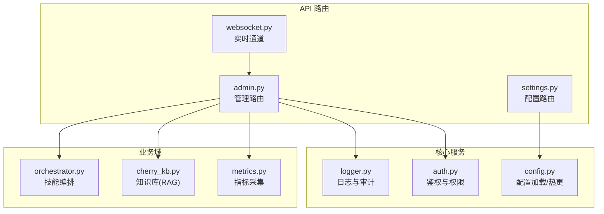
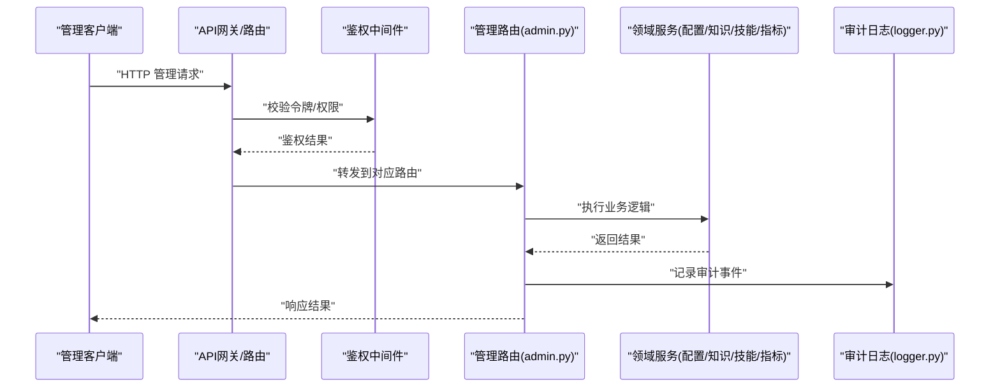
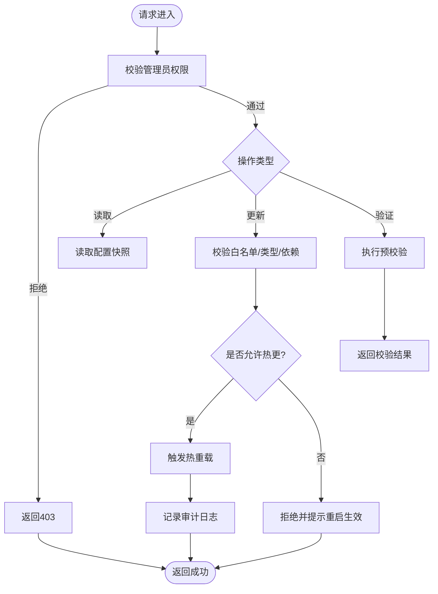
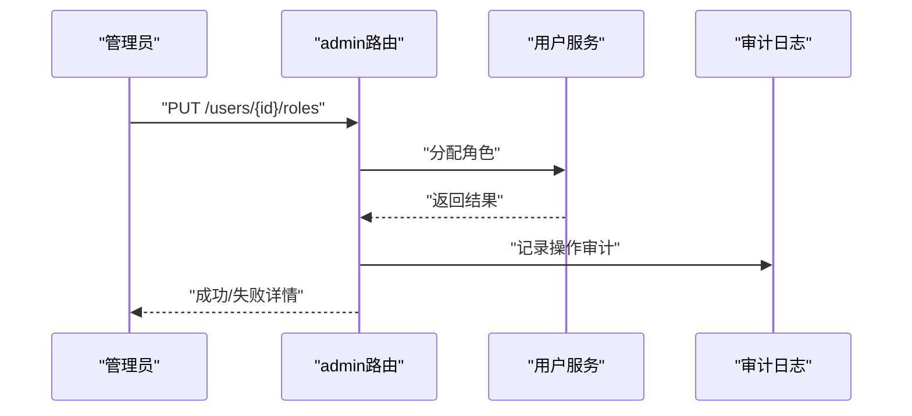
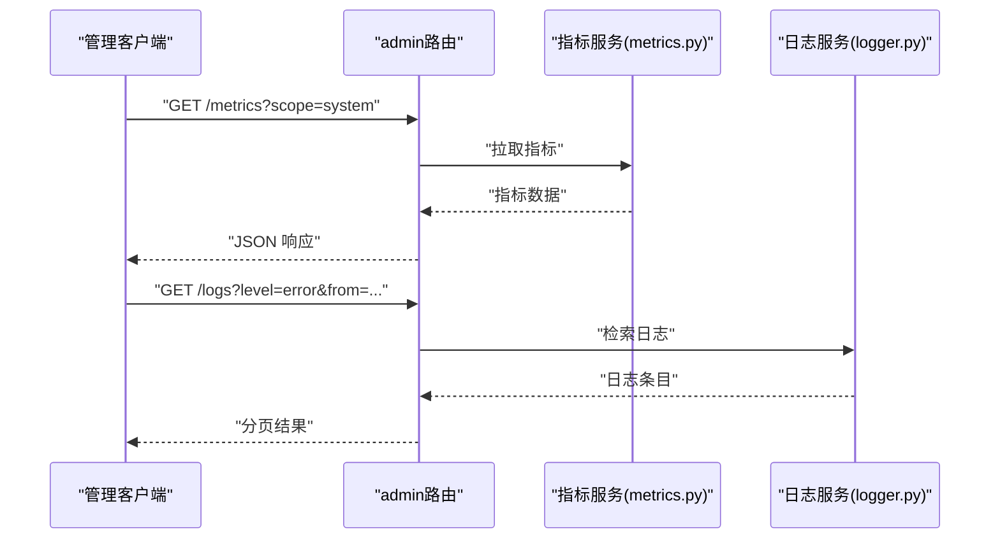
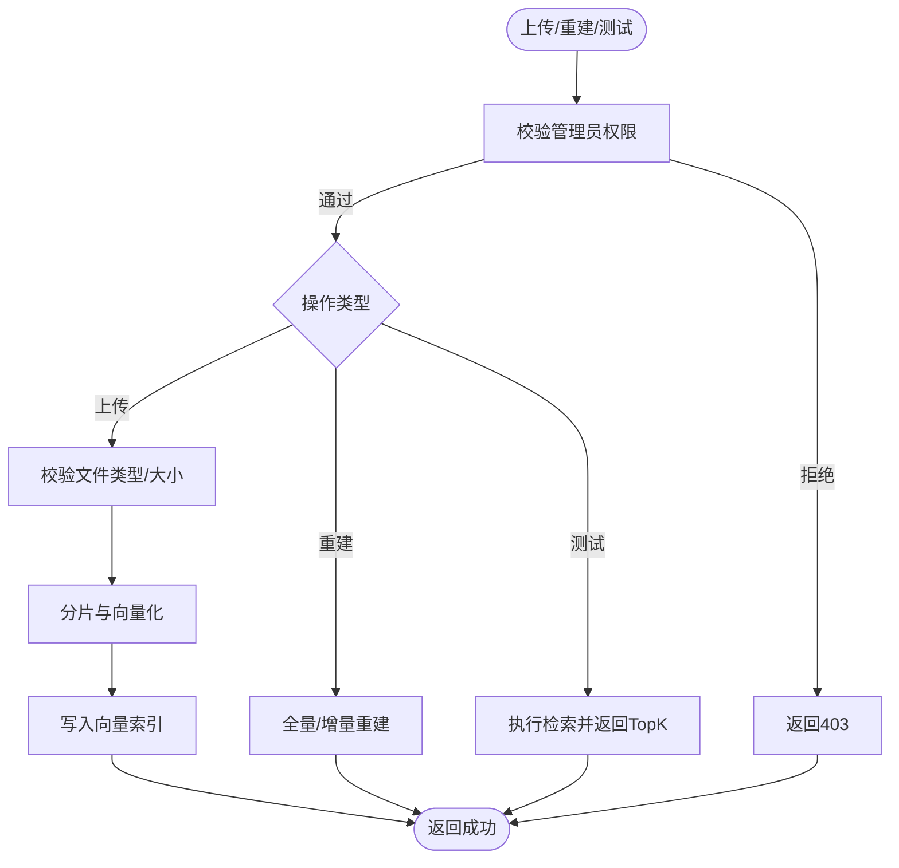
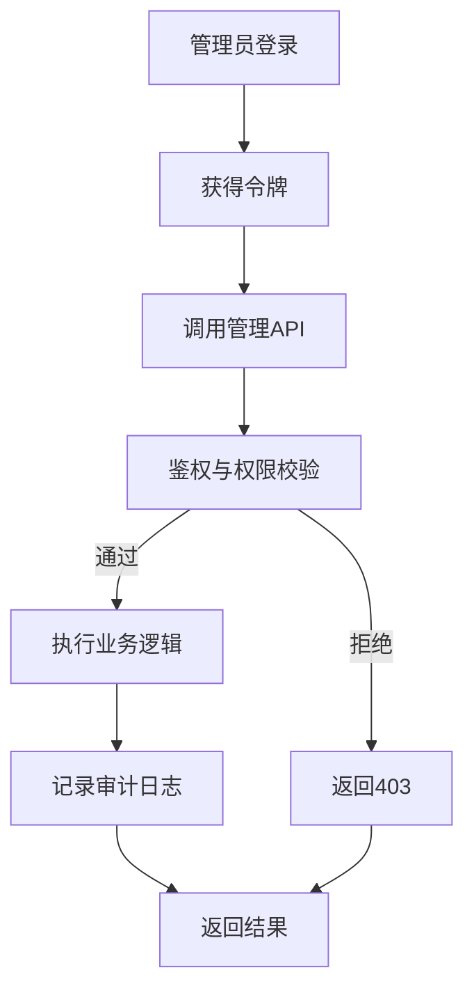
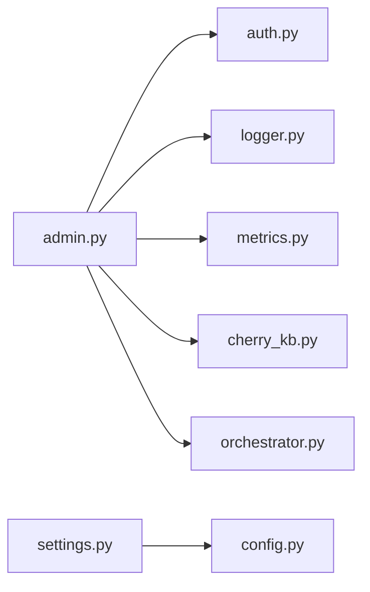

# 管理API接口

<cite>
**本文引用的文件**   
- [backend_design/nexus/api/routes/admin.py](file://backend_design/nexus/api/routes/admin.py)
- [backend_design/nexus/api/routes/settings.py](file://backend_design/nexus/api/routes/settings.py)
- [backend_design/nexus/core/auth.py](file://backend_design/nexus/core/auth.py)
- [backend_design/nexus/observability/metrics.py](file://backend_design/nexus/observability/metrics.py)
- [backend_design/nexus/rag/cherry_kb.py](file://backend_design/nexus/rag/cherry_kb.py)
- [backend_design/nexus/skills/orchestrator.py](file://backend_design/nexus/skills/orchestrator.py)
- [backend_design/nexus/config.py](file://backend_design/nexus/config.py)
- [backend_design/nexus/core/logger.py](file://backend_design/nexus/core/logger.py)
- [backend_design/nexus/api/websocket.py](file://backend_design/nexus/api/websocket.py)
</cite>

## 目录
1. [简介](#简介)
2. [项目结构](#项目结构)
3. [核心组件](#核心组件)
4. [架构总览](#架构总览)
5. [详细组件分析](#详细组件分析)
6. [依赖分析](#依赖分析)
7. [性能考虑](#性能考虑)
8. [故障排查指南](#故障排查指南)
9. [结论](#结论)
10. [附录](#附录)

## 简介
本文件面向系统管理员与集成开发者，系统化梳理并记录 NexusCockpit 的管理类 API 接口。内容覆盖：
- 系统配置接口：应用配置读取、动态配置更新、配置验证机制
- 用户管理接口：用户列表查询、权限管理、角色分配
- 监控数据接口：系统指标查询、日志检索、性能分析
- 知识库管理接口：文档上传、索引重建、检索测试
- 技能管理接口：技能注册、状态监控、版本管理

每个接口均说明管理员权限验证、操作审计与安全限制，并提供完整管理操作示例与批量操作方案。

## 项目结构
本项目后端采用模块化组织，管理相关能力主要分布在以下模块：
- API 路由层：admin、settings 等路由定义管理端点
- 认证与鉴权：统一鉴权中间件与权限校验
- 可观测性：指标采集与导出
- 知识库：RAG 检索与向量存储封装
- 技能编排：技能注册、生命周期与状态管理
- 配置中心：应用配置加载与热更新
- 日志：结构化日志输出与审计



图表来源
- [backend_design/nexus/api/routes/admin.py](file://backend_design/nexus/api/routes/admin.py)
- [backend_design/nexus/api/routes/settings.py](file://backend_design/nexus/api/routes/settings.py)
- [backend_design/nexus/api/websocket.py](file://backend_design/nexus/api/websocket.py)
- [backend_design/nexus/core/auth.py](file://backend_design/nexus/core/auth.py)
- [backend_design/nexus/config.py](file://backend_design/nexus/config.py)
- [backend_design/nexus/core/logger.py](file://backend_design/nexus/core/logger.py)
- [backend_design/nexus/observability/metrics.py](file://backend_design/nexus/observability/metrics.py)
- [backend_design/nexus/rag/cherry_kb.py](file://backend_design/nexus/rag/cherry_kb.py)
- [backend_design/nexus/skills/orchestrator.py](file://backend_design/nexus/skills/orchestrator.py)

章节来源
- [backend_design/nexus/api/routes/admin.py](file://backend_design/nexus/api/routes/admin.py)
- [backend_design/nexus/api/routes/settings.py](file://backend_design/nexus/api/routes/settings.py)
- [backend_design/nexus/core/auth.py](file://backend_design/nexus/core/auth.py)
- [backend_design/nexus/config.py](file://backend_design/nexus/config.py)
- [backend_design/nexus/core/logger.py](file://backend_design/nexus/core/logger.py)
- [backend_design/nexus/observability/metrics.py](file://backend_design/nexus/observability/metrics.py)
- [backend_design/nexus/rag/cherry_kb.py](file://backend_design/nexus/rag/cherry_kb.py)
- [backend_design/nexus/skills/orchestrator.py](file://backend_design/nexus/skills/orchestrator.py)
- [backend_design/nexus/api/websocket.py](file://backend_design/nexus/api/websocket.py)

## 核心组件
- 鉴权与权限控制
  - 统一鉴权入口负责解析令牌、校验签名、提取上下文（租户、角色、权限）
  - 管理端点强制要求管理员角色或特定权限标识
- 配置中心
  - 提供静态配置加载与运行时动态更新能力
  - 支持配置项白名单、类型校验与回滚策略
- 可观测性
  - 指标采集器暴露系统运行指标（CPU、内存、请求时延、错误率等）
  - 支持按维度过滤与聚合
- 知识库（RAG）
  - 文档入库、分片、向量化、索引构建与检索
  - 提供索引重建与检索测试接口
- 技能编排
  - 技能注册表、状态机、版本管理与健康检查
- 日志与审计
  - 结构化日志输出，关键管理操作写入审计日志

章节来源
- [backend_design/nexus/core/auth.py](file://backend_design/nexus/core/auth.py)
- [backend_design/nexus/config.py](file://backend_design/nexus/config.py)
- [backend_design/nexus/observability/metrics.py](file://backend_design/nexus/observability/metrics.py)
- [backend_design/nexus/rag/cherry_kb.py](file://backend_design/nexus/rag/cherry_kb.py)
- [backend_design/nexus/skills/orchestrator.py](file://backend_design/nexus/skills/orchestrator.py)
- [backend_design/nexus/core/logger.py](file://backend_design/nexus/core/logger.py)

## 架构总览
管理 API 的整体调用链路如下：客户端通过 HTTP/WebSocket 发起管理请求，经鉴权中间件校验后进入具体路由处理器，再调用领域服务完成业务逻辑，最终返回结果并记录审计日志。



图表来源
- [backend_design/nexus/api/routes/admin.py](file://backend_design/nexus/api/routes/admin.py)
- [backend_design/nexus/core/auth.py](file://backend_design/nexus/core/auth.py)
- [backend_design/nexus/core/logger.py](file://backend_design/nexus/core/logger.py)

## 详细组件分析

### 系统配置接口
- 功能范围
  - 读取应用配置（只读）
  - 动态更新配置（受控变更）
  - 配置验证（白名单、类型校验、依赖约束）
- 权限与安全
  - 仅管理员可访问
  - 敏感字段脱敏输出
  - 变更需二次确认与审计记录
- 典型端点
  - GET /api/admin/configs：获取当前配置快照
  - PUT /api/admin/configs/{key}：更新单个配置项
  - POST /api/admin/configs/validate：预校验配置变更
- 处理流程
  - 鉴权通过后，路由调用配置服务进行读取/更新/校验
  - 更新成功后触发热重载（如允许），并记录审计日志
  - 校验失败返回详细错误信息，不持久化



图表来源
- [backend_design/nexus/api/routes/settings.py](file://backend_design/nexus/api/routes/settings.py)
- [backend_design/nexus/config.py](file://backend_design/nexus/config.py)
- [backend_design/nexus/core/logger.py](file://backend_design/nexus/core/logger.py)

章节来源
- [backend_design/nexus/api/routes/settings.py](file://backend_design/nexus/api/routes/settings.py)
- [backend_design/nexus/config.py](file://backend_design/nexus/config.py)
- [backend_design/nexus/core/logger.py](file://backend_design/nexus/core/logger.py)

### 用户管理接口
- 功能范围
  - 用户列表查询（分页、筛选、排序）
  - 权限管理（授予/撤销权限）
  - 角色分配（赋予/移除角色）
- 权限与安全
  - 仅管理员可访问
  - 批量操作限流与幂等键
  - 所有变更写入审计日志
- 典型端点
  - GET /api/admin/users：查询用户列表
  - PUT /api/admin/users/{id}/roles：分配角色
  - PUT /api/admin/users/{id}/permissions：管理权限
  - POST /api/admin/users/batch：批量创建/更新
- 处理流程
  - 鉴权通过后，路由调用用户服务进行查询/更新
  - 批量操作采用事务或补偿机制保证一致性
  - 返回结果包含受影响行数与失败明细



图表来源
- [backend_design/nexus/api/routes/admin.py](file://backend_design/nexus/api/routes/admin.py)
- [backend_design/nexus/core/logger.py](file://backend_design/nexus/core/logger.py)

章节来源
- [backend_design/nexus/api/routes/admin.py](file://backend_design/nexus/api/routes/admin.py)
- [backend_design/nexus/core/logger.py](file://backend_design/nexus/core/logger.py)

### 监控数据接口
- 功能范围
  - 系统指标查询（CPU、内存、GC、请求时延、错误率等）
  - 日志检索（按时间、级别、关键字、TraceID）
  - 性能分析（热点接口、慢请求、资源瓶颈）
- 权限与安全
  - 管理员或具备“监控”角色的用户可访问
  - 大查询限流与超时保护
- 典型端点
  - GET /api/admin/metrics：查询指标
  - GET /api/admin/logs：检索日志
  - GET /api/admin/performance：性能概览
- 处理流程
  - 鉴权通过后，路由调用指标/日志服务
  - 支持按维度过滤、聚合与分页
  - 返回结构化数据供前端可视化



图表来源
- [backend_design/nexus/api/routes/admin.py](file://backend_design/nexus/api/routes/admin.py)
- [backend_design/nexus/observability/metrics.py](file://backend_design/nexus/observability/metrics.py)
- [backend_design/nexus/core/logger.py](file://backend_design/nexus/core/logger.py)

章节来源
- [backend_design/nexus/api/routes/admin.py](file://backend_design/nexus/api/routes/admin.py)
- [backend_design/nexus/observability/metrics.py](file://backend_design/nexus/observability/metrics.py)
- [backend_design/nexus/core/logger.py](file://backend_design/nexus/core/logger.py)

### 知识库管理接口
- 功能范围
  - 文档上传（文本、PDF、Markdown 等）
  - 索引重建（全量/增量）
  - 检索测试（相似度阈值、TopK、重排开关）
- 权限与安全
  - 仅管理员可访问
  - 文件大小与类型白名单校验
  - 索引重建期间限制并发写
- 典型端点
  - POST /api/admin/knowledge/upload：上传文档
  - POST /api/admin/knowledge/rebuild：重建索引
  - POST /api/admin/knowledge/query/test：检索测试
- 处理流程
  - 鉴权通过后，路由调用知识库服务
  - 上传后进行分片与向量化，落库并更新索引
  - 重建索引支持断点续建与进度上报（WebSocket）



图表来源
- [backend_design/nexus/api/routes/admin.py](file://backend_design/nexus/api/routes/admin.py)
- [backend_design/nexus/rag/cherry_kb.py](file://backend_design/nexus/rag/cherry_kb.py)
- [backend_design/nexus/api/websocket.py](file://backend_design/nexus/api/websocket.py)

章节来源
- [backend_design/nexus/api/routes/admin.py](file://backend_design/nexus/api/routes/admin.py)
- [backend_design/nexus/rag/cherry_kb.py](file://backend_design/nexus/rag/cherry_kb.py)
- [backend_design/nexus/api/websocket.py](file://backend_design/nexus/api/websocket.py)

### 技能管理接口
- 功能范围
  - 技能注册（声明式/代码式）
  - 状态监控（健康检查、依赖可用性）
  - 版本管理（切换、回滚、灰度）
- 权限与安全
  - 仅管理员可访问
  - 版本切换需审批与审计
- 典型端点
  - POST /api/admin/skills/register：注册技能
  - GET /api/admin/skills/{id}/status：查询状态
  - PUT /api/admin/skills/{id}/version：切换版本
- 处理流程
  - 鉴权通过后，路由调用技能编排服务
  - 注册时进行依赖校验与元数据登记
  - 版本切换采用原子替换与健康探测

```mermaid
classDiagram
class SkillOrchestrator {
+register(skill_meta) bool
+get_status(id) Status
+switch_version(id, version) bool
+health_check(id) Health
}
class AdminRoute {
+POST "/skills/register"
+GET "/skills/{id}/status"
+PUT "/skills/{id}/version"
}
AdminRoute --> SkillOrchestrator : "调用"
```

图表来源
- [backend_design/nexus/skills/orchestrator.py](file://backend_design/nexus/skills/orchestrator.py)
- [backend_design/nexus/api/routes/admin.py](file://backend_design/nexus/api/routes/admin.py)

章节来源
- [backend_design/nexus/skills/orchestrator.py](file://backend_design/nexus/skills/orchestrator.py)
- [backend_design/nexus/api/routes/admin.py](file://backend_design/nexus/api/routes/admin.py)

### 概念总览
以下为管理操作的通用工作流，适用于上述各模块：
- 管理员登录并获得令牌
- 携带令牌访问管理端点
- 系统校验权限并记录审计
- 执行业务逻辑并返回结果
- 异常时返回标准化错误码与消息



[此图为概念流程图，无需图表来源]

## 依赖分析
管理 API 的依赖关系如下：
- admin 路由依赖 auth 鉴权、logger 审计以及各业务服务
- settings 路由依赖 config 配置服务
- metrics 与 logger 为横向支撑服务
- cherry_kb 与 orchestrator 分别承载知识库与技能管理能力



图表来源
- [backend_design/nexus/api/routes/admin.py](file://backend_design/nexus/api/routes/admin.py)
- [backend_design/nexus/api/routes/settings.py](file://backend_design/nexus/api/routes/settings.py)
- [backend_design/nexus/core/auth.py](file://backend_design/nexus/core/auth.py)
- [backend_design/nexus/core/logger.py](file://backend_design/nexus/core/logger.py)
- [backend_design/nexus/observability/metrics.py](file://backend_design/nexus/observability/metrics.py)
- [backend_design/nexus/rag/cherry_kb.py](file://backend_design/nexus/rag/cherry_kb.py)
- [backend_design/nexus/skills/orchestrator.py](file://backend_design/nexus/skills/orchestrator.py)
- [backend_design/nexus/config.py](file://backend_design/nexus/config.py)

章节来源
- [backend_design/nexus/api/routes/admin.py](file://backend_design/nexus/api/routes/admin.py)
- [backend_design/nexus/api/routes/settings.py](file://backend_design/nexus/api/routes/settings.py)
- [backend_design/nexus/core/auth.py](file://backend_design/nexus/core/auth.py)
- [backend_design/nexus/core/logger.py](file://backend_design/nexus/core/logger.py)
- [backend_design/nexus/observability/metrics.py](file://backend_design/nexus/observability/metrics.py)
- [backend_design/nexus/rag/cherry_kb.py](file://backend_design/nexus/rag/cherry_kb.py)
- [backend_design/nexus/skills/orchestrator.py](file://backend_design/nexus/skills/orchestrator.py)
- [backend_design/nexus/config.py](file://backend_design/nexus/config.py)

## 性能考虑
- 指标与日志查询
  - 建议设置合理的时间窗口与分页大小，避免全量扫描
  - 对高频查询启用缓存（短TTL）
- 知识库索引重建
  - 使用增量重建优先；全量重建在低峰期执行
  - 向量化阶段可并行化，注意GPU/CPU资源上限
- 批量操作
  - 采用分批提交与幂等键，防止重复提交
  - 对长耗时任务采用异步队列与进度上报（WebSocket）
- 限流与熔断
  - 对管理端点实施独立限流策略
  - 下游依赖不可用时快速失败并降级

[本节为通用指导，无需章节来源]

## 故障排查指南
- 鉴权失败
  - 检查令牌有效期、签名与权限标识
  - 查看鉴权中间件的错误日志
- 配置更新失败
  - 核对白名单与类型约束
  - 查看预校验返回的错误详情
- 索引重建卡住
  - 检查向量存储连接与磁盘空间
  - 观察进度上报与重试次数
- 指标/日志无数据
  - 确认采集器是否启动
  - 检查时间范围与过滤条件

章节来源
- [backend_design/nexus/core/auth.py](file://backend_design/nexus/core/auth.py)
- [backend_design/nexus/config.py](file://backend_design/nexus/config.py)
- [backend_design/nexus/rag/cherry_kb.py](file://backend_design/nexus/rag/cherry_kb.py)
- [backend_design/nexus/observability/metrics.py](file://backend_design/nexus/observability/metrics.py)
- [backend_design/nexus/core/logger.py](file://backend_design/nexus/core/logger.py)

## 结论
管理 API 围绕“安全可控、可观测、可扩展”的目标设计，通过统一的鉴权与审计机制保障安全性，借助配置热更、索引重建与技能编排提升运维效率。建议在大规模部署中结合限流、熔断与异步任务，确保稳定性与性能。

[本节为总结，无需章节来源]

## 附录

### 管理员权限验证
- 所有管理端点均需管理员角色或特定权限标识
- 令牌应包含用户身份、角色与权限集合
- 鉴权失败返回标准错误码与消息

章节来源
- [backend_design/nexus/core/auth.py](file://backend_design/nexus/core/auth.py)

### 操作审计
- 关键管理操作（配置变更、用户角色/权限调整、索引重建、技能版本切换）必须记录审计日志
- 审计日志包含操作人、时间、资源、动作与结果

章节来源
- [backend_design/nexus/core/logger.py](file://backend_design/nexus/core/logger.py)

### 安全限制
- 输入校验：类型、长度、白名单
- 速率限制：管理端点独立配额
- 敏感信息：脱敏输出与最小可见原则

章节来源
- [backend_design/nexus/api/routes/admin.py](file://backend_design/nexus/api/routes/admin.py)
- [backend_design/nexus/api/routes/settings.py](file://backend_design/nexus/api/routes/settings.py)

### 管理操作示例（步骤）
- 读取配置
  - 使用管理员令牌调用配置读取接口，获取当前快照
- 更新配置
  - 先调用预校验接口，通过后提交更新
  - 若允许热更，系统将自动重载；否则提示重启生效
- 用户角色分配
  - 指定用户ID与目标角色，提交分配请求
  - 查看审计日志确认操作已记录
- 知识库索引重建
  - 选择增量或全量模式，提交重建任务
  - 通过 WebSocket 订阅进度，完成后验证检索效果
- 技能版本切换
  - 提交版本切换请求，等待健康检查通过
  - 如需回滚，提交回滚请求并记录审计

[本节为操作步骤说明，无需章节来源]

### 批量操作方案
- 用户批量分配角色
  - 提交用户ID列表与目标角色，服务端分批处理
  - 返回成功/失败明细，失败项附带原因
- 配置批量更新
  - 提交键值对映射，服务端逐项校验与更新
  - 支持事务或补偿，确保一致性
- 知识库批量上传
  - 提交文件清单，服务端逐个校验、分片与向量化
  - 支持断点续传与进度上报

[本节为方案说明，无需章节来源]