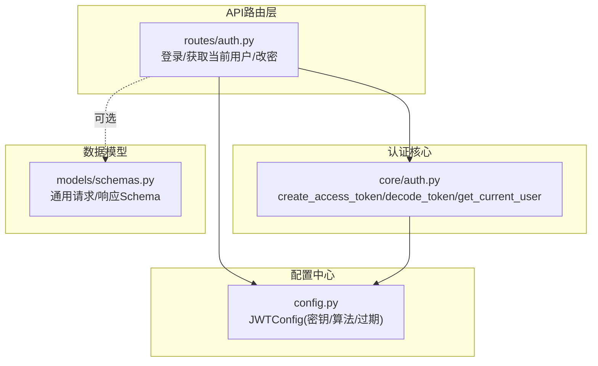
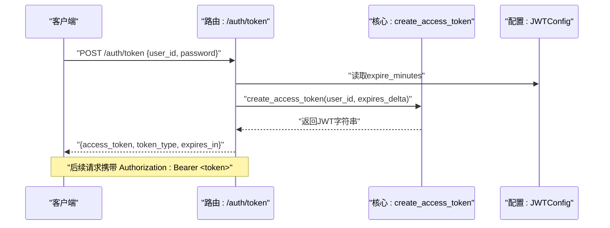
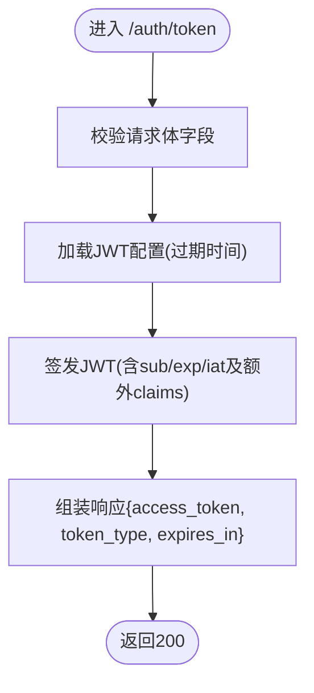
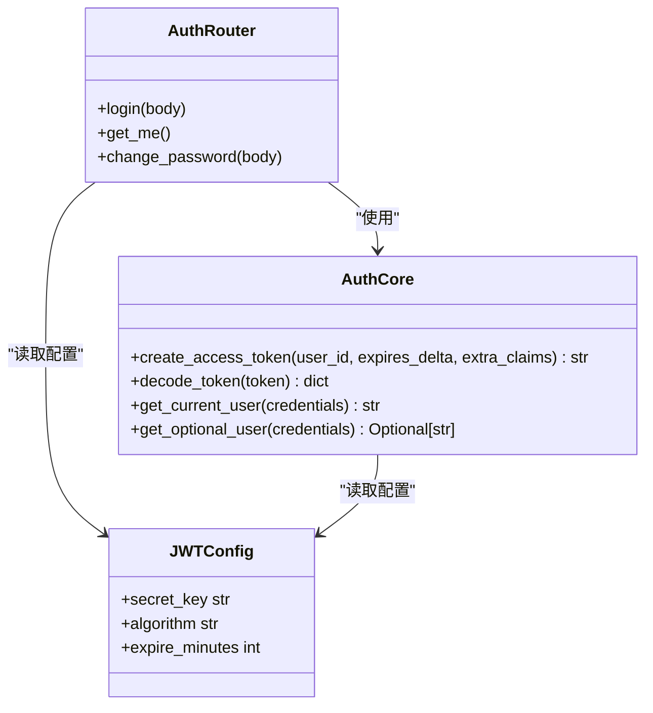

# 认证API接口

<cite>
**本文引用的文件**   
- [auth.py](file://backend_design/nexus/api/routes/auth.py)
- [auth.py](file://backend_design/nexus/core/auth.py)
- [config.py](file://backend_design/nexus/config.py)
- [schemas.py](file://backend_design/nexus/models/schemas.py)
</cite>

## 目录
1. [简介](#简介)
2. [项目结构](#项目结构)
3. [核心组件](#核心组件)
4. [架构总览](#架构总览)
5. [详细组件分析](#详细组件分析)
6. [依赖关系分析](#依赖关系分析)
7. [性能与安全考量](#性能与安全考量)
8. [故障排查指南](#故障排查指南)
9. [结论](#结论)
10. [附录](#附录)

## 简介
本文件面向后端开发者与集成方，系统化梳理并文档化认证相关API与实现，覆盖以下目标：
- 用户登录接口：用户名/密码校验、JWT令牌签发、有效期管理
- 用户注册接口：信息校验、密码加密存储、初始权限分配（当前为占位实现）
- 令牌刷新接口：续期策略、安全校验、过期处理（当前为占位实现）
- 登出接口：令牌失效、会话清理、安全退出（当前为占位实现）
- JWT令牌结构定义、签名算法与安全最佳实践
- 完整认证流程示例与错误处理方案

说明：
- 当前仓库中登录接口已实现；注册、刷新、登出接口为占位或待扩展。
- 生产环境需接入真实用户数据库与密码哈希存储，并完善刷新/登出逻辑。

## 项目结构
认证相关代码主要分布在以下模块：
- API路由层：提供HTTP端点（登录、获取当前用户、修改密码等）
- 认证核心：JWT签发与验证、Bearer凭据解析
- 配置中心：JWT密钥、算法、过期时间等集中管理
- 数据模型：通用请求/响应Schema（认证相关在路由内定义）

图示来源
- [auth.py:1-109](file://backend_design/nexus/api/routes/auth.py#L1-L109)
- [auth.py:1-141](file://backend_design/nexus/core/auth.py#L1-L141)
- [config.py:277-293](file://backend_design/nexus/config.py#L277-L293)
- [schemas.py:1-88](file://backend_design/nexus/models/schemas.py#L1-L88)

章节来源
- [auth.py:1-109](file://backend_design/nexus/api/routes/auth.py#L1-L109)
- [auth.py:1-141](file://backend_design/nexus/core/auth.py#L1-L141)
- [config.py:277-293](file://backend_design/nexus/config.py#L277-L293)
- [schemas.py:1-88](file://backend_design/nexus/models/schemas.py#L1-L88)

## 核心组件
- 认证路由（/auth/*）
  - POST /auth/token：登录并返回JWT
  - GET /auth/me：验证Token有效性并返回当前用户
  - POST /auth/change-password：修改密码（开发模式直接成功）
- 认证核心（core/auth）
  - create_access_token：签发JWT
  - decode_token：解码并校验JWT
  - get_current_user：FastAPI依赖，从Authorization头提取并校验Bearer Token
  - get_optional_user：可选认证依赖
- 配置（config.JWTConfig）
  - secret_key：签名密钥
  - algorithm：签名算法（默认HS256）
  - expire_minutes：令牌有效期（分钟）

章节来源
- [auth.py:33-75](file://backend_design/nexus/api/routes/auth.py#L33-L75)
- [auth.py:36-123](file://backend_design/nexus/core/auth.py#L36-L123)
- [config.py:277-293](file://backend_design/nexus/config.py#L277-L293)

## 架构总览
下图展示一次完整的“登录→鉴权”调用链：客户端发起登录，服务端签发JWT；后续受保护接口通过依赖注入解析并校验Token。

图示来源
- [auth.py:46-75](file://backend_design/nexus/api/routes/auth.py#L46-L75)
- [auth.py:36-62](file://backend_design/nexus/core/auth.py#L36-L62)
- [config.py:277-293](file://backend_design/nexus/config.py#L277-L293)

## 详细组件分析

### 登录接口（POST /auth/token）
- 功能
  - 接收 user_id 与 password
  - 开发模式下直接签发JWT（不校验密码）
  - 生产环境应接入用户库进行密码校验与角色查询
- 请求体
  - user_id：必填，字符串
  - password：选填，字符串（用于未来密码校验）
- 响应体
  - access_token：JWT字符串
  - token_type：固定为 bearer
  - expires_in：秒数（由配置中的分钟换算）
- 关键实现要点
  - 使用配置中的过期时间计算expires_in
  - 签发时附加额外claims（如role、cockpit_id），便于后续授权控制
- 错误处理
  - 当前未对非法输入做显式抛出，依赖Pydantic自动校验
  - 建议增加参数长度/格式校验与日志记录

图示来源
- [auth.py:33-75](file://backend_design/nexus/api/routes/auth.py#L33-L75)
- [auth.py:36-62](file://backend_design/nexus/core/auth.py#L36-L62)
- [config.py:277-293](file://backend_design/nexus/config.py#L277-L293)

章节来源
- [auth.py:33-75](file://backend_design/nexus/api/routes/auth.py#L33-L75)
- [auth.py:36-62](file://backend_design/nexus/core/auth.py#L36-L62)
- [config.py:277-293](file://backend_design/nexus/config.py#L277-L293)

### 获取当前用户（GET /auth/me）
- 功能
  - 验证Authorization头中的Bearer Token是否有效
  - 返回当前用户标识与认证状态
- 鉴权机制
  - 通过依赖get_current_user解析并校验Token
  - 缺失或无效Token将返回401
- 适用场景
  - 前端启动后快速校验Token有效性，或作为受保护接口的最小示例

章节来源
- [auth.py:78-82](file://backend_design/nexus/api/routes/auth.py#L78-L82)
- [auth.py:86-123](file://backend_design/nexus/core/auth.py#L86-L123)

### 修改密码（POST /auth/change-password）
- 功能
  - 接收旧密码与新密码
  - 开发模式直接返回成功
  - 生产环境需校验旧密码并更新存储
- 鉴权
  - 需要有效的Bearer Token
- 注意
  - 新密码长度限制已在请求模型中声明

章节来源
- [auth.py:84-109](file://backend_design/nexus/api/routes/auth.py#L84-L109)

### 用户注册接口（待实现）
- 现状
  - 当前仓库未提供注册路由
- 建议设计
  - 路径：POST /auth/register
  - 请求体：username、email、password、phone（可选）、role（可选）
  - 校验规则：邮箱格式、密码强度、唯一性约束
  - 密码存储：使用bcrypt/scrypt等强哈希算法加盐存储
  - 初始权限：根据业务角色表分配默认角色（如普通用户）
  - 响应：返回用户ID与基础信息（不含敏感字段）
  - 错误码：重复注册、参数校验失败、服务异常

[本节为概念性设计，不涉及具体源码]

### 令牌刷新接口（待实现）
- 现状
  - 当前仓库未提供刷新路由
- 建议设计
  - 路径：POST /auth/refresh
  - 请求体：access_token（或同时支持refresh_token）
  - 策略：
    - 仅当access_token未过期且合法时签发新的access_token
    - 若引入refresh_token，则需建立黑名单/白名单或短期有效策略
  - 安全：
    - 校验IP/UA一致性（可选）
    - 限流防刷
  - 响应：新的access_token与剩余有效期

[本节为概念性设计，不涉及具体源码]

### 登出接口（待实现）
- 现状
  - 当前仓库未提供登出路由
- 建议设计
  - 路径：POST /auth/logout
  - 行为：
    - 若使用无状态JWT：可在服务端维护短期黑名单（Redis）或在客户端清除本地Token
    - 若使用refresh_token：将其加入黑名单或撤销
  - 安全：
    - 幂等处理，避免重复登出导致的状态不一致
    - 记录审计日志

[本节为概念性设计，不涉及具体源码]

### JWT令牌结构与签名算法
- 载荷字段
  - sub：用户标识
  - exp：过期时间（UTC）
  - iat：签发时间（UTC）
  - 额外claims：如role、cockpit_id等（按需扩展）
- 签名算法
  - 默认HS256（HMAC-SHA256）
  - 密钥来源于配置JWTConfig.secret_key
- 有效期
  - 默认由配置JWTConfig.expire_minutes决定（分钟）
  - 响应中返回expires_in（秒）

章节来源
- [auth.py:36-62](file://backend_design/nexus/core/auth.py#L36-L62)
- [config.py:277-293](file://backend_design/nexus/config.py#L277-L293)

## 依赖关系分析
- 路由层依赖
  - FastAPI的APIRouter、Depends、Pydantic BaseModel
  - 认证核心：create_access_token、get_current_user
  - 配置中心：get_config().jwt
- 认证核心依赖
  - PyJWT：encode/decode
  - FastAPI：HTTPBearer、HTTPException
  - 配置中心：JWTConfig
- 配置中心
  - Pydantic Settings：类型安全的配置加载与环境变量映射

图示来源
- [auth.py:1-109](file://backend_design/nexus/api/routes/auth.py#L1-L109)
- [auth.py:1-141](file://backend_design/nexus/core/auth.py#L1-L141)
- [config.py:277-293](file://backend_design/nexus/config.py#L277-L293)

章节来源
- [auth.py:1-109](file://backend_design/nexus/api/routes/auth.py#L1-L109)
- [auth.py:1-141](file://backend_design/nexus/core/auth.py#L1-L141)
- [config.py:277-293](file://backend_design/nexus/config.py#L277-L293)

## 性能与安全考量
- 性能
  - JWT签发/验签为轻量操作，CPU开销低
  - 建议在网关层统一限流，防止暴力破解与重放攻击
- 安全
  - 密钥管理：生产环境必须替换默认弱密钥，建议使用环境变量或密钥管理服务
  - 传输安全：强制HTTPS，避免中间人窃听
  - 令牌生命周期：合理设置过期时间，结合刷新策略降低频繁登录成本
  - 最小权限：claims中仅包含必要信息，避免泄露敏感数据
  - 审计与风控：记录登录、刷新、登出事件，结合IP/UA进行异常检测

[本节为通用指导，不涉及具体源码]

## 故障排查指南
- 常见错误
  - 401未认证：缺少Authorization头或Token无效
  - 401令牌过期：exp早于当前时间
  - 401缺少用户标识：payload中无sub字段
- 定位步骤
  - 检查Authorization头格式是否为“Bearer <token>”
  - 核对JWTConfig.secret_key与algorithm是否与签发一致
  - 查看服务端日志输出（登录、鉴权失败）
  - 确认系统时间与服务器时区一致（JWT使用UTC）
- 修复建议
  - 前端重试前刷新Token（若支持刷新接口）
  - 重新登录获取新Token
  - 修正部署配置（密钥、算法、过期时间）

章节来源
- [auth.py:65-123](file://backend_design/nexus/core/auth.py#L65-L123)
- [auth.py:78-82](file://backend_design/nexus/api/routes/auth.py#L78-L82)

## 结论
- 当前仓库实现了基于JWT的登录与鉴权基础能力，满足开发与演示需求
- 生产环境需补齐注册、刷新、登出接口，并接入真实用户数据库与密码哈希存储
- 建议完善安全策略（限流、审计、最小权限）与运维监控（指标、告警）

[本节为总结性内容，不涉及具体源码]

## 附录
- 常用请求/响应示例（以字段描述为主）
  - 登录请求：{user_id, password}
  - 登录响应：{access_token, token_type, expires_in}
  - 获取当前用户：返回{user_id, authenticated}
  - 修改密码请求：{old_password, new_password}
- 参考Schema
  - 通用请求/响应模型位于models/schemas.py（认证相关在路由内定义）

章节来源
- [auth.py:33-109](file://backend_design/nexus/api/routes/auth.py#L33-L109)
- [schemas.py:1-88](file://backend_design/nexus/models/schemas.py#L1-L88)