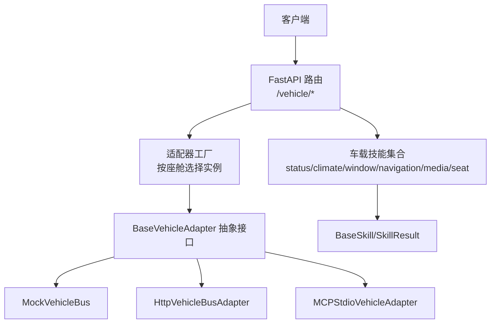
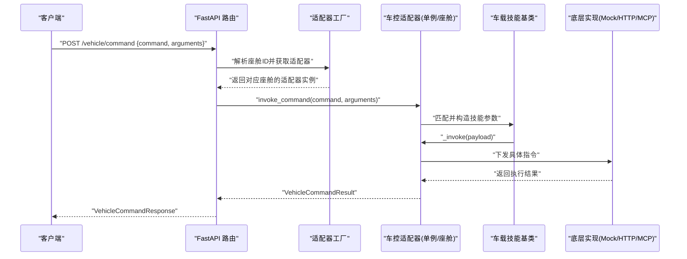
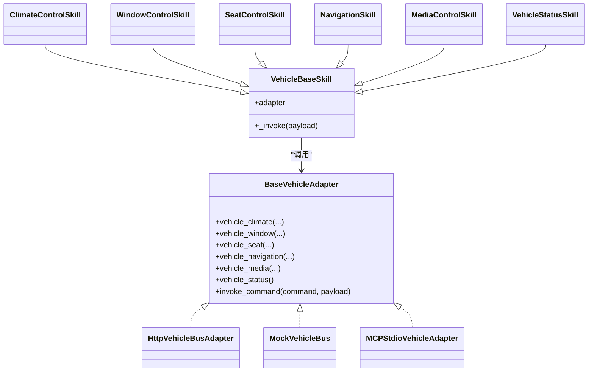

# 车控API接口

<cite>
**本文引用的文件列表**   
- [backend_design/nexus/api/routes/vehicle.py](file://backend_design/nexus/api/routes/vehicle.py)
- [backend_design/nexus/models/schemas.py](file://backend_design/nexus/models/schemas.py)
- [backend_design/nexus/vehicle/base.py](file://backend_design/nexus/vehicle/base.py)
- [backend_design/nexus/vehicle/factory.py](file://backend_design/nexus/vehicle/factory.py)
- [backend_design/nexus/skills/base.py](file://backend_design/nexus/skills/base.py)
- [backend_design/nexus/skills/vehicle/__init__.py](file://backend_design/nexus/skills/vehicle/__init__.py)
- [backend_design/nexus/skills/vehicle/status.py](file://backend_design/nexus/skills/vehicle/status.py)
- [backend_design/nexus/skills/vehicle/climate.py](file://backend_design/nexus/skills/vehicle/climate.py)
- [backend_design/nexus/skills/vehicle/window.py](file://backend_design/nexus/skills/vehicle/window.py)
- [backend_design/nexus/skills/vehicle/navigation.py](file://backend_design/nexus/skills/vehicle/navigation.py)
- [backend_design/nexus/skills/vehicle/media.py](file://backend_design/nexus/skills/vehicle/media.py)
- [backend_design/nexus/skills/vehicle/seat.py](file://backend_design/nexus/skills/vehicle/seat.py)
- [backend_design/nexus/core/exceptions.py](file://backend_design/nexus/core/exceptions.py)
</cite>

## 目录
1. [简介](#简介)
2. [项目结构](#项目结构)
3. [核心组件](#核心组件)
4. [架构总览](#架构总览)
5. [详细组件分析](#详细组件分析)
6. [依赖关系分析](#依赖关系分析)
7. [性能与可用性](#性能与可用性)
8. [故障排查指南](#故障排查指南)
9. [结论](#结论)
10. [附录：错误码与示例](#附录错误码与示例)

## 简介
本文件面向开发者，系统化梳理并文档化“车控API接口”，覆盖以下能力：
- 车辆状态查询：GET /vehicle/status，返回空调、车窗、座椅、媒体、导航、车况等综合信息。
- 设备控制：通过统一命令接口 POST /vehicle/command 下发指令，支持空调（温度、风量、模式）、车窗（开闭、百分比）、座椅（加热/通风/按摩/位置）等。
- 导航控制：目的地设置、路线规划、当前位置更新与查询。
- 媒体控制：播放/暂停/切歌、音量调节、音源切换。
- 请求参数、响应格式、错误码定义、调用示例与错误处理方案均在本文件中给出。

## 项目结构
车控相关代码主要分布在如下模块：
- API 路由层：暴露 REST 端点，负责鉴权、座舱隔离、指标上报与结果封装。
- 技能层：按领域划分（空调、车窗、座椅、导航、媒体、状态），描述工具参数与示例，供上层编排或直调。
- 适配层：抽象车控总线接口，提供 Mock/HTTP/MCP 多种后端实现，并通过工厂按座舱隔离创建实例。
- 数据模型：统一的 Pydantic 请求/响应模型，用于 FastAPI 自动校验与文档生成。

图表来源
- [backend_design/nexus/api/routes/vehicle.py:1-129](file://backend_design/nexus/api/routes/vehicle.py#L1-L129)
- [backend_design/nexus/vehicle/factory.py:1-148](file://backend_design/nexus/vehicle/factory.py#L1-L148)
- [backend_design/nexus/vehicle/base.py:1-92](file://backend_design/nexus/vehicle/base.py#L1-L92)
- [backend_design/nexus/skills/base.py:1-186](file://backend_design/nexus/skills/base.py#L1-L186)
- [backend_design/nexus/skills/vehicle/__init__.py:1-55](file://backend_design/nexus/skills/vehicle/__init__.py#L1-L55)

章节来源
- [backend_design/nexus/api/routes/vehicle.py:1-129](file://backend_design/nexus/api/routes/vehicle.py#L1-L129)
- [backend_design/nexus/vehicle/factory.py:1-148](file://backend_design/nexus/vehicle/factory.py#L1-L148)
- [backend_design/nexus/vehicle/base.py:1-92](file://backend_design/nexus/vehicle/base.py#L1-L92)
- [backend_design/nexus/skills/base.py:1-186](file://backend_design/nexus/skills/base.py#L1-L186)
- [backend_design/nexus/skills/vehicle/__init__.py:1-55](file://backend_design/nexus/skills/vehicle/__init__.py#L1-L55)

## 核心组件
- 路由层
  - GET /vehicle/status：获取当前座舱的车辆综合状态。
  - POST /vehicle/command：直接执行车控命令（绕过 Agent 工作流）。
  - POST /vehicle/location：更新浏览器 GPS 坐标，便于后续逆地理编码按需使用。
- 数据模型
  - VehicleCommandRequest/VehicleCommandResponse：统一命令请求/响应结构。
- 适配层
  - BaseVehicleAdapter：定义空调、车窗、座椅、导航、媒体、状态查询、通用命令调用等抽象方法。
  - Factory：根据配置与环境变量选择具体实现，并支持多座舱隔离。
- 技能层
  - 各领域 Skill 类声明了 tool_name、参数说明与示例，最终通过 VehicleBaseSkill._invoke 调用适配器。

章节来源
- [backend_design/nexus/api/routes/vehicle.py:47-91](file://backend_design/nexus/api/routes/vehicle.py#L47-L91)
- [backend_design/nexus/models/schemas.py:55-68](file://backend_design/nexus/models/schemas.py#L55-L68)
- [backend_design/nexus/vehicle/base.py:35-92](file://backend_design/nexus/vehicle/base.py#L35-L92)
- [backend_design/nexus/vehicle/factory.py:39-84](file://backend_design/nexus/vehicle/factory.py#L39-L84)
- [backend_design/nexus/skills/vehicle/__init__.py:21-55](file://backend_design/nexus/skills/vehicle/__init__.py#L21-L55)

## 架构总览
下图展示从 HTTP 请求到车控执行的端到端流程，包括认证、座舱隔离、适配器选择与技能执行。

图表来源
- [backend_design/nexus/api/routes/vehicle.py:47-75](file://backend_design/nexus/api/routes/vehicle.py#L47-L75)
- [backend_design/nexus/vehicle/factory.py:56-84](file://backend_design/nexus/vehicle/factory.py#L56-L84)
- [backend_design/nexus/vehicle/base.py:89-92](file://backend_design/nexus/vehicle/base.py#L89-L92)
- [backend_design/nexus/skills/vehicle/__init__.py:44-55](file://backend_design/nexus/skills/vehicle/__init__.py#L44-L55)

## 详细组件分析

### 接口一：车辆状态查询
- 端点
  - GET /vehicle/status
- 鉴权
  - 需要 JWT 认证（由路由依赖注入）。
- 行为
  - 根据请求头 X-Cockpit-Id 或上下文解析座舱 ID，获取该座舱独立的状态视图。
  - 返回扁平结构，包含空调、车窗、座椅、媒体、导航、车况等信息。
- 请求参数
  - 无路径/查询参数；需携带认证信息与可选的座舱标识头。
- 响应格式
  - 成功：返回字典，字段为各子系统状态键值对（如空调、车窗、座椅、媒体、导航、车况等）。
  - 失败：抛出异常时，由全局异常处理器返回标准错误 JSON。
- 错误码
  - 认证失败：AUTH_ERROR
  - 服务不可用/下游异常：VEHICLE_ERROR
  - 其他系统异常：NEXUS_ERROR
- 调用示例
  - 请求
    - 方法：GET
    - 路径：/vehicle/status
    - 头部：Authorization: Bearer <token>，X-Cockpit-Id: cockpit-01（可选）
  - 响应
    - 成功：{ "climate": {...}, "windows": {...}, "seats": {...}, "media": {...}, "navigation": {...}, "vehicle": {...} }
    - 失败：{ "error": "...", "message": "...", "details": {} }
- 参考实现
  - 路由定义与座舱隔离逻辑
  - 适配器 vehicle_status 抽象方法
  - 状态技能定义（含 location 操作）

章节来源
- [backend_design/nexus/api/routes/vehicle.py:78-91](file://backend_design/nexus/api/routes/vehicle.py#L78-L91)
- [backend_design/nexus/vehicle/base.py:85-87](file://backend_design/nexus/vehicle/base.py#L85-L87)
- [backend_design/nexus/skills/vehicle/status.py:13-31](file://backend_design/nexus/skills/vehicle/status.py#L13-L31)
- [backend_design/nexus/core/exceptions.py:105-109](file://backend_design/nexus/core/exceptions.py#L105-L109)
- [backend_design/nexus/core/exceptions.py:91-96](file://backend_design/nexus/core/exceptions.py#L91-L96)

### 接口二：设备控制（统一命令）
- 端点
  - POST /vehicle/command
- 鉴权
  - 需要 JWT 认证。
- 行为
  - 接收 command 名称与 arguments 参数，直接调用对应车控技能，绕过 Agent 工作流。
  - 每个座舱拥有独立状态，避免跨座舱干扰。
- 请求体
  - command：字符串，技能名（如 vehicle_climate、vehicle_window、vehicle_seat、vehicle_navigation、vehicle_media、vehicle_status）。
  - arguments：对象，包含该技能的可选参数（见各技能参数表）。
  - user_id：可选，默认 default。
- 响应体
  - success：布尔
  - message：人类可读消息
  - data：结构化结果（不同技能返回不同字段）
  - error：错误信息（失败时）
- 错误码
  - 认证失败：AUTH_ERROR
  - 技能执行失败：SKILL_ERROR
  - 车控下发失败：VEHICLE_ERROR
  - 其他：NEXUS_ERROR
- 调用示例
  - 请求
    - 方法：POST
    - 路径：/vehicle/command
    - 头部：Authorization: Bearer <token>，X-Cockpit-Id: cockpit-01（可选）
    - 体：{ "command": "vehicle_climate", "arguments": { "op": "set_temp", "target_temp": 24 } }
  - 响应
    - 成功：{ "success": true, "message": "已设置温度", "data": { "temp": 24 }, "error": "" }
    - 失败：{ "success": false, "message": "...", "data": {}, "error": "..." }
- 参考实现
  - 路由与指标上报
  - 适配器 invoke_command 抽象方法
  - 各技能参数定义与示例

章节来源
- [backend_design/nexus/api/routes/vehicle.py:47-75](file://backend_design/nexus/api/routes/vehicle.py#L47-L75)
- [backend_design/nexus/models/schemas.py:55-68](file://backend_design/nexus/models/schemas.py#L55-L68)
- [backend_design/nexus/vehicle/base.py:89-92](file://backend_design/nexus/vehicle/base.py#L89-L92)
- [backend_design/nexus/skills/vehicle/climate.py:13-35](file://backend_design/nexus/skills/vehicle/climate.py#L13-L35)
- [backend_design/nexus/skills/vehicle/window.py:13-32](file://backend_design/nexus/skills/vehicle/window.py#L13-L32)
- [backend_design/nexus/skills/vehicle/seat.py:13-33](file://backend_design/nexus/skills/vehicle/seat.py#L13-L33)
- [backend_design/nexus/skills/vehicle/navigation.py:13-34](file://backend_design/nexus/skills/vehicle/navigation.py#L13-L34)
- [backend_design/nexus/skills/vehicle/media.py:13-34](file://backend_design/nexus/skills/vehicle/media.py#L13-L34)
- [backend_design/nexus/core/exceptions.py:77-82](file://backend_design/nexus/core/exceptions.py#L77-L82)

#### 子能力：空调控制
- 技能名：vehicle_climate
- 可选参数
  - op：操作类型，如 set_temp、temp_up、temp_down、set_fan、set_mode、status
  - target_temp：目标温度（整数）
  - delta：相对调节幅度（整数）
  - fan_speed：风量档位（整数）
  - mode：模式，如 auto、cool、heat
- 典型场景
  - 设置温度：op=set_temp, target_temp=24
  - 升高温度：op=temp_up, delta=1
  - 设置风量：op=set_fan, fan_speed=3
  - 设置模式：op=set_mode, mode=auto
- 参考实现
  - 技能参数与示例定义

章节来源
- [backend_design/nexus/skills/vehicle/climate.py:13-35](file://backend_design/nexus/skills/vehicle/climate.py#L13-L35)

#### 子能力：车窗控制
- 技能名：vehicle_window
- 可选参数
  - op：open、close、up、down、set_position、status
  - position：all、front_left、sunroof 等
  - percent：开合百分比（0-100）
- 典型场景
  - 打开所有车窗：op=open, position=all, percent=100
  - 关闭天窗：op=close, position=sunroof, percent=0
  - 设定左前窗半开：op=set_position, position=front_left, percent=50
- 参考实现
  - 技能参数与示例定义

章节来源
- [backend_design/nexus/skills/vehicle/window.py:13-32](file://backend_design/nexus/skills/vehicle/window.py#L13-L32)

#### 子能力：座椅控制
- 技能名：vehicle_seat
- 可选参数
  - op：heat_on、cool_on、massage_on、forward、backward、status 等
  - position：driver、passenger
  - level：档位（整数）
  - direction：forward、backward
- 典型场景
  - 主驾加热一档：op=heat_on, position=driver, level=1
  - 副驾通风两档：op=cool_on, position=passenger, level=2
  - 主驾按摩一档：op=massage_on, position=driver, level=1
- 参考实现
  - 技能参数与示例定义

章节来源
- [backend_design/nexus/skills/vehicle/seat.py:13-33](file://backend_design/nexus/skills/vehicle/seat.py#L13-L33)

#### 子能力：导航控制
- 技能名：vehicle_navigation
- 可选参数
  - destination：目的地（字符串）
  - waypoint：途经点（字符串）
  - mode：drive、walk 等
  - op：location（查询当前位置）
- 典型场景
  - 导航到公司：destination=公司, mode=drive
  - 导航至机场并途经充电站：destination=机场, waypoint=充电站, mode=drive
  - 查询当前位置：op=location
- 参考实现
  - 技能参数与示例定义

章节来源
- [backend_design/nexus/skills/vehicle/navigation.py:13-34](file://backend_design/nexus/skills/vehicle/navigation.py#L13-L34)

#### 子能力：媒体控制
- 技能名：vehicle_media
- 可选参数
  - op：play、pause、next、prev、set_volume、set_source、status
  - source：local、bluetooth、radio
  - track：曲目或内容
  - volume：音量大小（整数）
- 典型场景
  - 播放本地音乐：op=play, source=local
  - 下一首：op=next
  - 设置音量：op=set_volume, volume=16
  - 切换蓝牙：op=set_source, source=bluetooth
- 参考实现
  - 技能参数与示例定义

章节来源
- [backend_design/nexus/skills/vehicle/media.py:13-34](file://backend_design/nexus/skills/vehicle/media.py#L13-L34)

### 接口三：位置更新
- 端点
  - POST /vehicle/location
- 鉴权
  - 需要 JWT 认证。
- 行为
  - 将浏览器 GPS 坐标写入当前座舱的导航上下文，清除旧地址缓存，以便后续查询时按需进行逆地理编码。
- 请求体
  - latitude：浮点数
  - longitude：浮点数
- 响应体
  - success：布尔
  - location：空字符串（下次查询时再填充）
  - latitude、longitude：回显输入
  - message：提示信息
- 错误码
  - 认证失败：AUTH_ERROR
  - 不支持位置更新：业务错误（返回 success=false）
- 调用示例
  - 请求
    - 方法：POST
    - 路径：/vehicle/location
    - 体：{ "latitude": 31.2304, "longitude": 121.4737 }
  - 响应
    - 成功：{ "success": true, "location": "", "latitude": 31.2304, "longitude": 121.4737, "message": "坐标已更新，地址将在查询时获取" }
- 参考实现
  - 路由处理与导航上下文更新

章节来源
- [backend_design/nexus/api/routes/vehicle.py:100-128](file://backend_design/nexus/api/routes/vehicle.py#L100-L128)

## 依赖关系分析
- 路由层依赖
  - 认证中间件：get_current_user
  - 座舱上下文：get_cockpit_id
  - 适配器工厂：get_cockpit_vehicle_adapter
  - 数据模型：VehicleCommandRequest/Response
- 适配器层依赖
  - 工厂根据配置选择 Mock/HTTP/MCP 实现
  - 多座舱隔离：Mock 模式每座舱独立实例，HTTP/MCP 复用单例
- 技能层依赖
  - 通过 VehicleBaseSkill 访问当前座舱适配器
  - 各技能仅声明参数与示例，实际执行委托给适配器

图表来源
- [backend_design/nexus/vehicle/base.py:35-92](file://backend_design/nexus/vehicle/base.py#L35-L92)
- [backend_design/nexus/vehicle/factory.py:87-123](file://backend_design/nexus/vehicle/factory.py#L87-L123)
- [backend_design/nexus/skills/vehicle/__init__.py:21-55](file://backend_design/nexus/skills/vehicle/__init__.py#L21-L55)
- [backend_design/nexus/skills/vehicle/climate.py:13-35](file://backend_design/nexus/skills/vehicle/climate.py#L13-L35)
- [backend_design/nexus/skills/vehicle/window.py:13-32](file://backend_design/nexus/skills/vehicle/window.py#L13-L32)
- [backend_design/nexus/skills/vehicle/seat.py:13-33](file://backend_design/nexus/skills/vehicle/seat.py#L13-L33)
- [backend_design/nexus/skills/vehicle/navigation.py:13-34](file://backend_design/nexus/skills/vehicle/navigation.py#L13-L34)
- [backend_design/nexus/skills/vehicle/media.py:13-34](file://backend_design/nexus/skills/vehicle/media.py#L13-L34)
- [backend_design/nexus/skills/vehicle/status.py:13-31](file://backend_design/nexus/skills/vehicle/status.py#L13-L31)

章节来源
- [backend_design/nexus/vehicle/factory.py:39-84](file://backend_design/nexus/vehicle/factory.py#L39-L84)
- [backend_design/nexus/skills/vehicle/__init__.py:21-55](file://backend_design/nexus/skills/vehicle/__init__.py#L21-L55)

## 性能与可用性
- 多座舱隔离
  - Mock 模式下每座舱独立实例，避免状态污染；HTTP/MCP 模式无状态，复用单例，降低资源占用。
- 指标上报
  - 每次命令执行后记录技能执行次数与成功/失败状态，便于监控与告警。
- 超时与重试
  - 适配器可配置超时时间；建议在上层增加熔断与重试策略以增强鲁棒性。
- 缓存策略
  - 读取型操作（如 status）可结合缓存减少频繁调用；写型操作（如 climate/window/seat）不应缓存。

[本节为通用指导，不直接分析具体文件]

## 故障排查指南
- 认证失败
  - 现象：返回 AUTH_ERROR
  - 排查：检查 Authorization 头是否携带有效 JWT；确认网关/鉴权服务正常。
- 车控下发失败
  - 现象：返回 VEHICLE_ERROR
  - 排查：检查适配器配置（base_url、协议、端点、Token）；查看底层通信日志；确认远端服务可用。
- 技能执行异常
  - 现象：返回 SKILL_ERROR
  - 排查：核对 command 名称与 arguments 是否符合技能参数定义；检查必填项与取值范围。
- 座舱隔离问题
  - 现象：跨座舱状态互相影响
  - 排查：确认请求头 X-Cockpit-Id 是否正确传递；确认后端是否启用 v2.1 多座舱隔离逻辑。
- 位置未更新
  - 现象：导航仍显示旧地址
  - 排查：确认已调用 /vehicle/location 更新坐标；确认导航上下文存在且旧地址缓存已清除。

章节来源
- [backend_design/nexus/core/exceptions.py:105-109](file://backend_design/nexus/core/exceptions.py#L105-L109)
- [backend_design/nexus/core/exceptions.py:91-96](file://backend_design/nexus/core/exceptions.py#L91-L96)
- [backend_design/nexus/core/exceptions.py:77-82](file://backend_design/nexus/core/exceptions.py#L77-L82)
- [backend_design/nexus/api/routes/vehicle.py:100-128](file://backend_design/nexus/api/routes/vehicle.py#L100-L128)

## 结论
本车控 API 采用“路由—技能—适配器”的分层设计，既保证了扩展性与可测试性，又通过多座舱隔离提升了生产环境的稳定性。通过统一的命令接口，前端可以便捷地控制空调、车窗、座椅、导航与媒体等子系统，同时提供标准化的状态查询与错误处理机制。

[本节为总结，不直接分析具体文件]

## 附录：错误码与示例

### 错误码定义
- AUTH_ERROR：认证失败
- VEHICLE_ERROR：车控下发失败
- SKILL_ERROR：技能执行失败
- CONFIG_ERROR：配置错误
- LLM_ERROR：大模型推理错误
- RAG_ERROR：检索错误
- VECTOR_STORE_ERROR：向量存储错误
- GRAPH_STORE_ERROR：图谱存储错误
- MEMORY_ERROR：记忆操作错误
- CACHE_ERROR：缓存错误
- RATE_LIMIT_ERROR：限流错误
- CIRCUIT_BREAKER_OPEN：熔断器开启
- NEXUS_ERROR：通用错误

章节来源
- [backend_design/nexus/core/exceptions.py:19-124](file://backend_design/nexus/core/exceptions.py#L19-L124)

### 统一响应结构
- VehicleCommandResponse
  - success：布尔
  - message：字符串
  - data：对象
  - error：字符串

章节来源
- [backend_design/nexus/models/schemas.py:62-68](file://backend_design/nexus/models/schemas.py#L62-L68)

### 调用示例汇总
- 获取车辆状态
  - GET /vehicle/status
  - 头部：Authorization: Bearer <token>，X-Cockpit-Id: cockpit-01（可选）
  - 响应：包含各子系统状态的字典
- 设置空调温度
  - POST /vehicle/command
  - 体：{ "command": "vehicle_climate", "arguments": { "op": "set_temp", "target_temp": 24 } }
- 打开车窗
  - POST /vehicle/command
  - 体：{ "command": "vehicle_window", "arguments": { "op": "open", "position": "all", "percent": 100 } }
- 设置座椅加热
  - POST /vehicle/command
  - 体：{ "command": "vehicle_seat", "arguments": { "op": "heat_on", "position": "driver", "level": 1 } }
- 导航到目的地
  - POST /vehicle/command
  - 体：{ "command": "vehicle_navigation", "arguments": { "destination": "公司", "mode": "drive" } }
- 播放音乐
  - POST /vehicle/command
  - 体：{ "command": "vehicle_media", "arguments": { "op": "play", "source": "local" } }
- 更新位置
  - POST /vehicle/location
  - 体：{ "latitude": 31.2304, "longitude": 121.4737 }

章节来源
- [backend_design/nexus/api/routes/vehicle.py:47-128](file://backend_design/nexus/api/routes/vehicle.py#L47-L128)
- [backend_design/nexus/skills/vehicle/climate.py:13-35](file://backend_design/nexus/skills/vehicle/climate.py#L13-L35)
- [backend_design/nexus/skills/vehicle/window.py:13-32](file://backend_design/nexus/skills/vehicle/window.py#L13-L32)
- [backend_design/nexus/skills/vehicle/seat.py:13-33](file://backend_design/nexus/skills/vehicle/seat.py#L13-L33)
- [backend_design/nexus/skills/vehicle/navigation.py:13-34](file://backend_design/nexus/skills/vehicle/navigation.py#L13-L34)
- [backend_design/nexus/skills/vehicle/media.py:13-34](file://backend_design/nexus/skills/vehicle/media.py#L13-L34)