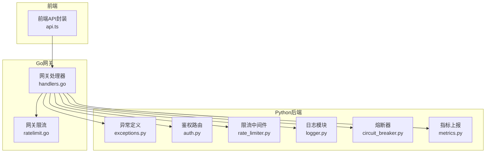
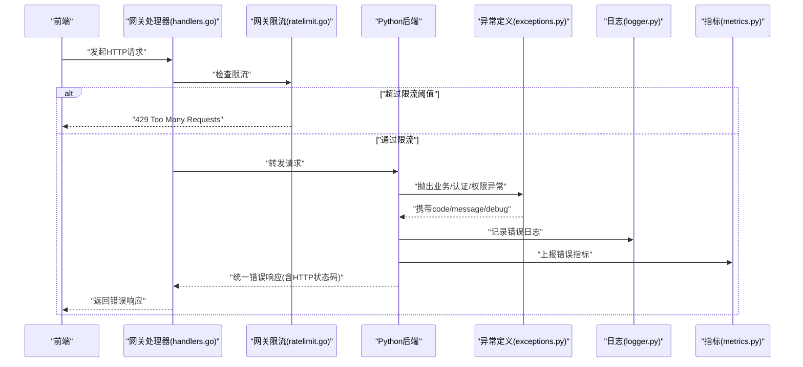
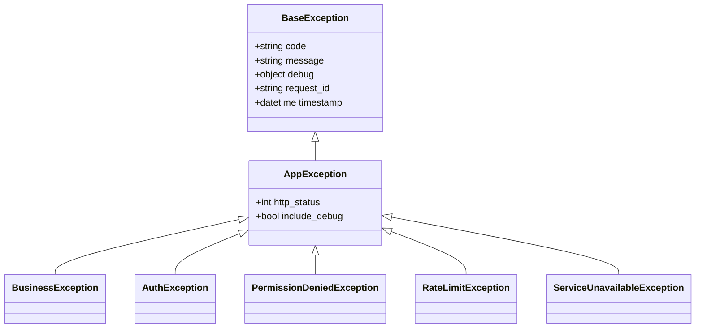
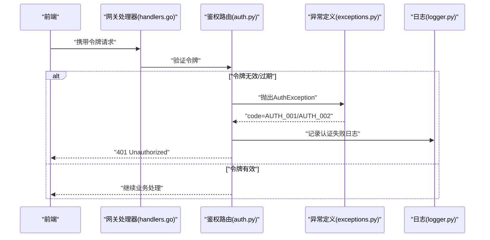
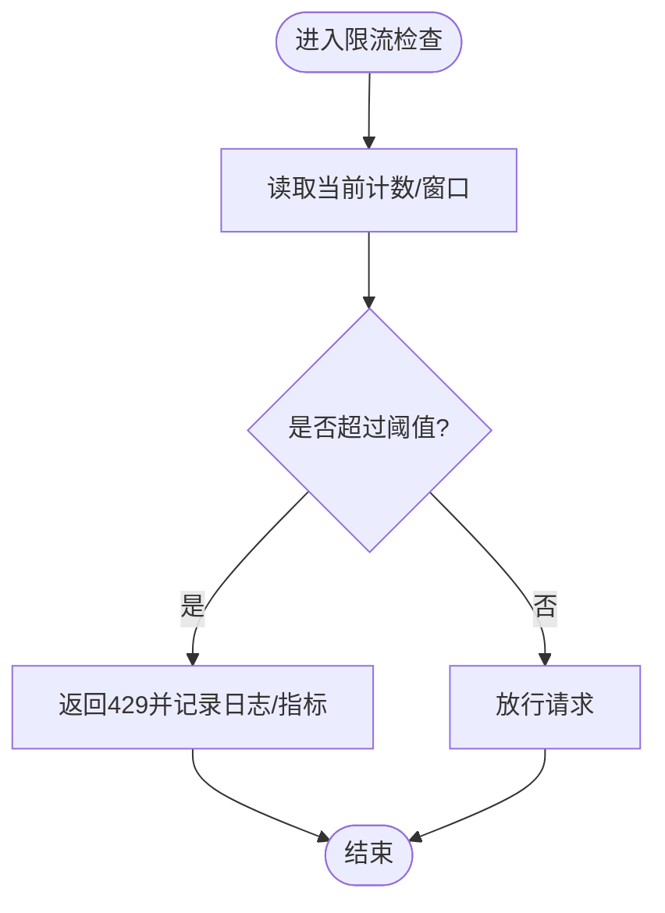
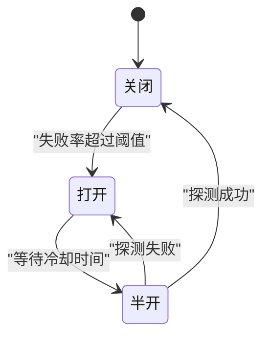
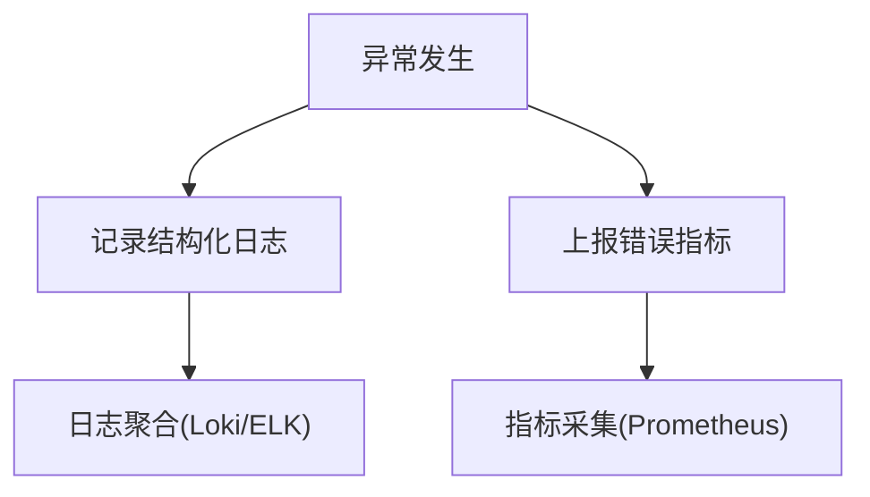
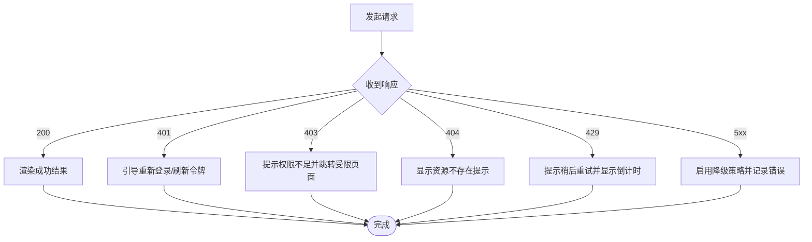
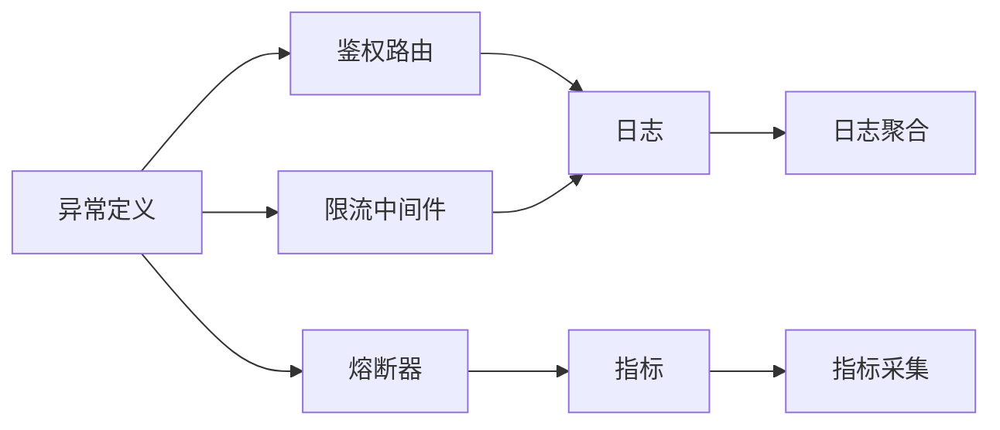

# 错误码与异常处理

<cite>
**本文引用的文件**   
- [backend_design/nexus/core/exceptions.py](file://backend_design/nexus/core/exceptions.py)
- [backend_design/nexus/api/routes/auth.py](file://backend_design/nexus/api/routes/auth.py)
- [backend_design/nexus/middleware/rate_limiter.py](file://backend_design/nexus/middleware/rate_limiter.py)
- [backend_design/nexus/core/logger.py](file://backend_design/nexus/core/logger.py)
- [backend_design/nexus/core/circuit_breaker.py](file://backend_design/nexus/core/circuit_breaker.py)
- [backend_design/nexus/observability/metrics.py](file://backend_design/nexus/observability/metrics.py)
- [backend_design/nexus_gate/internal/handlers/handlers.go](file://backend_design/nexus_gate/internal/handlers/handlers.go)
- [backend_design/nexus_gate/internal/ratelimit/ratelimit.go](file://backend_design/nexus_gate/internal/ratelimit/ratelimit.go)
- [frontend_design/src/lib/api.ts](file://frontend_design/src/lib/api.ts)
</cite>

## 目录
1. [简介](#简介)
2. [项目结构](#项目结构)
3. [核心组件](#核心组件)
4. [架构总览](#架构总览)
5. [详细组件分析](#详细组件分析)
6. [依赖关系分析](#依赖关系分析)
7. [性能考虑](#性能考虑)
8. [故障排查指南](#故障排查指南)
9. [结论](#结论)
10. [附录](#附录)

## 简介
本文件系统化梳理后端与网关的错误码、异常类型、HTTP状态码使用规范，以及前端错误处理最佳实践。目标包括：
- 明确HTTP状态码的使用场景（200、400、401、403、404、429、500等）
- 定义业务错误码体系（认证失败、权限不足、资源冲突、服务不可用等）
- 统一异常层次结构与响应格式（错误码、错误消息、堆栈信息、调试信息）
- 提供前端错误处理策略（友好提示、重试机制、降级策略）
- 完善错误日志记录与监控告警方案

## 项目结构
本项目在后端Python服务与Go网关两侧均实现了错误与异常处理相关能力：
- Python后端
  - 异常类型定义与中间件集成
  - 限流与熔断等可观测性支撑
  - 日志与指标上报
- Go网关
  - 鉴权与限流拦截
  - 统一错误响应封装
- 前端
  - 统一API调用封装与错误处理

图表来源
- [backend_design/nexus/core/exceptions.py](file://backend_design/nexus/core/exceptions.py)
- [backend_design/nexus/api/routes/auth.py](file://backend_design/nexus/api/routes/auth.py)
- [backend_design/nexus/middleware/rate_limiter.py](file://backend_design/nexus/middleware/rate_limiter.py)
- [backend_design/nexus/core/logger.py](file://backend_design/nexus/core/logger.py)
- [backend_design/nexus/core/circuit_breaker.py](file://backend_design/nexus/core/circuit_breaker.py)
- [backend_design/nexus/observability/metrics.py](file://backend_design/nexus/observability/metrics.py)
- [backend_design/nexus_gate/internal/handlers/handlers.go](file://backend_design/nexus_gate/internal/handlers/handlers.go)
- [backend_design/nexus_gate/internal/ratelimit/ratelimit.go](file://backend_design/nexus_gate/internal/ratelimit/ratelimit.go)
- [frontend_design/src/lib/api.ts](file://frontend_design/src/lib/api.ts)

章节来源
- [backend_design/nexus/core/exceptions.py](file://backend_design/nexus/core/exceptions.py)
- [backend_design/nexus/api/routes/auth.py](file://backend_design/nexus/api/routes/auth.py)
- [backend_design/nexus/middleware/rate_limiter.py](file://backend_design/nexus/middleware/rate_limiter.py)
- [backend_design/nexus/core/logger.py](file://backend_design/nexus/core/logger.py)
- [backend_design/nexus/core/circuit_breaker.py](file://backend_design/nexus/core/circuit_breaker.py)
- [backend_design/nexus/observability/metrics.py](file://backend_design/nexus/observability/metrics.py)
- [backend_design/nexus_gate/internal/handlers/handlers.go](file://backend_design/nexus_gate/internal/handlers/handlers.go)
- [backend_design/nexus_gate/internal/ratelimit/ratelimit.go](file://backend_design/nexus_gate/internal/ratelimit/ratelimit.go)
- [frontend_design/src/lib/api.ts](file://frontend_design/src/lib/api.ts)

## 核心组件
本节聚焦异常类型层次、HTTP状态码映射、业务错误码定义与响应格式规范。

- 异常类型层次
  - BaseException：所有异常的根类型，用于捕获未知异常并统一返回500
  - AppException：应用级异常基类，承载通用字段（如错误码、消息、调试信息）
  - BusinessException：业务异常，用于表达领域规则违反（如参数校验失败、资源冲突）
  - AuthException：认证相关异常（如令牌无效、过期）
  - PermissionDeniedException：权限不足异常
  - RateLimitException：限流异常（触发429）
  - ServiceUnavailableException：下游服务不可用或熔断打开时的异常

- HTTP状态码使用场景
  - 200 OK：成功响应
  - 400 Bad Request：请求参数错误或校验失败
  - 401 Unauthorized：未认证或认证失败
  - 403 Forbidden：已认证但无权限访问
  - 404 Not Found：资源不存在
  - 429 Too Many Requests：触发限流
  - 500 Internal Server Error：服务器内部错误（含未捕获异常）

- 业务错误码定义（示例）
  - AUTH_001：认证失败（令牌无效/过期）
  - AUTH_002：会话失效
  - PERM_001：权限不足
  - RES_001：资源不存在
  - RES_002：资源冲突（并发写入冲突）
  - SYS_001：服务不可用（下游超时/熔断）
  - SYS_002：系统内部错误

- 错误响应格式规范
  - code：业务错误码（字符串）
  - message：面向用户的错误消息（简洁友好）
  - debug：调试信息（可选，包含堆栈、请求ID等，仅开发环境暴露）
  - request_id：追踪ID（便于日志关联）
  - timestamp：时间戳（ISO 8601）

章节来源
- [backend_design/nexus/core/exceptions.py](file://backend_design/nexus/core/exceptions.py)
- [backend_design/nexus/api/routes/auth.py](file://backend_design/nexus/api/routes/auth.py)
- [backend_design/nexus/middleware/rate_limiter.py](file://backend_design/nexus/middleware/rate_limiter.py)
- [backend_design/nexus/observability/metrics.py](file://backend_design/nexus/observability/metrics.py)

## 架构总览
下图展示从前端到网关再到后端的错误处理链路，包括限流、鉴权、业务异常与统一响应。

图表来源
- [backend_design/nexus_gate/internal/handlers/handlers.go](file://backend_design/nexus_gate/internal/handlers/handlers.go)
- [backend_design/nexus_gate/internal/ratelimit/ratelimit.go](file://backend_design/nexus_gate/internal/ratelimit/ratelimit.go)
- [backend_design/nexus/core/exceptions.py](file://backend_design/nexus/core/exceptions.py)
- [backend_design/nexus/core/logger.py](file://backend_design/nexus/core/logger.py)
- [backend_design/nexus/observability/metrics.py](file://backend_design/nexus/observability/metrics.py)

## 详细组件分析

### 异常类型层次与映射
- 设计要点
  - 以BaseException为根，派生AppException作为通用字段载体
  - 按领域划分BusinessException、AuthException、PermissionDeniedException等
  - 将异常映射到HTTP状态码与业务错误码，确保前后端一致
- 关键行为
  - 全局异常处理器捕获未处理异常，返回500与默认错误码
  - 业务异常在控制器/服务层抛出，携带结构化错误信息
  - 限流与熔断触发特定异常，分别返回429与503/500

图表来源
- [backend_design/nexus/core/exceptions.py](file://backend_design/nexus/core/exceptions.py)

章节来源
- [backend_design/nexus/core/exceptions.py](file://backend_design/nexus/core/exceptions.py)

### 鉴权流程与错误处理
- 典型流程
  - 前端携带令牌发起请求
  - 网关/后端校验令牌有效性
  - 失败时抛出认证异常，返回401与AUTH_001/AUTH_002
  - 成功则继续业务处理
- 错误点
  - 令牌缺失/无效/过期
  - 会话丢失或刷新失败

图表来源
- [backend_design/nexus/api/routes/auth.py](file://backend_design/nexus/api/routes/auth.py)
- [backend_design/nexus/core/exceptions.py](file://backend_design/nexus/core/exceptions.py)
- [backend_design/nexus/core/logger.py](file://backend_design/nexus/core/logger.py)
- [backend_design/nexus_gate/internal/handlers/handlers.go](file://backend_design/nexus_gate/internal/handlers/handlers.go)

章节来源
- [backend_design/nexus/api/routes/auth.py](file://backend_design/nexus/api/routes/auth.py)
- [backend_design/nexus/core/exceptions.py](file://backend_design/nexus/core/exceptions.py)
- [backend_design/nexus/core/logger.py](file://backend_design/nexus/core/logger.py)
- [backend_design/nexus_gate/internal/handlers/handlers.go](file://backend_design/nexus_gate/internal/handlers/handlers.go)

### 限流与429处理
- 触发条件
  - 单IP/用户请求频率超过阈值
  - 网关层或后端中间件检测超限
- 行为
  - 返回429 Too Many Requests
  - 附带重试建议（Retry-After）
  - 记录限流事件与指标

图表来源
- [backend_design/nexus/middleware/rate_limiter.py](file://backend_design/nexus/middleware/rate_limiter.py)
- [backend_design/nexus_gate/internal/ratelimit/ratelimit.go](file://backend_design/nexus_gate/internal/ratelimit/ratelimit.go)

章节来源
- [backend_design/nexus/middleware/rate_limiter.py](file://backend_design/nexus/middleware/rate_limiter.py)
- [backend_design/nexus_gate/internal/ratelimit/ratelimit.go](file://backend_design/nexus_gate/internal/ratelimit/ratelimit.go)

### 熔断与服务不可用
- 触发条件
  - 下游服务频繁失败或超时
  - 熔断器打开，快速失败以避免雪崩
- 行为
  - 返回503/500与SYS_001
  - 记录熔断事件与指标
  - 支持半开探测恢复

图表来源
- [backend_design/nexus/core/circuit_breaker.py](file://backend_design/nexus/core/circuit_breaker.py)
- [backend_design/nexus/observability/metrics.py](file://backend_design/nexus/observability/metrics.py)

章节来源
- [backend_design/nexus/core/circuit_breaker.py](file://backend_design/nexus/core/circuit_breaker.py)
- [backend_design/nexus/observability/metrics.py](file://backend_design/nexus/observability/metrics.py)

### 错误日志与指标上报
- 日志记录
  - 统一记录错误上下文（请求ID、用户标识、错误码、消息、堆栈）
  - 区分级别（ERROR/WARN/INFO），避免泄露敏感信息
- 指标上报
  - 错误数量、分类统计、P95/P99延迟
  - 限流次数、熔断状态、鉴权失败次数

图表来源
- [backend_design/nexus/core/logger.py](file://backend_design/nexus/core/logger.py)
- [backend_design/nexus/observability/metrics.py](file://backend_design/nexus/observability/metrics.py)

章节来源
- [backend_design/nexus/core/logger.py](file://backend_design/nexus/core/logger.py)
- [backend_design/nexus/observability/metrics.py](file://backend_design/nexus/observability/metrics.py)

### 前端错误处理最佳实践
- 用户友好的错误提示
  - 根据错误码映射到自然语言提示
  - 对网络错误与超时给出重试按钮
- 重试机制
  - 幂等请求支持指数退避重试
  - 非幂等请求谨慎重试，避免重复操作
- 降级策略
  - 缓存兜底数据
  - 功能开关切换至静态页面或简化流程
- 统一封装
  - 在API层集中处理错误，向上抛出自定义错误对象
  - 提供全局错误边界与Toast通知

图表来源
- [frontend_design/src/lib/api.ts](file://frontend_design/src/lib/api.ts)

章节来源
- [frontend_design/src/lib/api.ts](file://frontend_design/src/lib/api.ts)

## 依赖关系分析
- 耦合与内聚
  - 异常定义模块被各路由与中间件引用，保持高内聚
  - 日志与指标模块作为横切关注点，降低业务代码侵入
- 外部依赖
  - 网关限流与鉴权依赖配置与存储（如Redis）
  - 熔断器依赖健康检查与指标反馈
- 潜在循环依赖
  - 避免在异常模块中引入业务逻辑，防止循环导入

图表来源
- [backend_design/nexus/core/exceptions.py](file://backend_design/nexus/core/exceptions.py)
- [backend_design/nexus/api/routes/auth.py](file://backend_design/nexus/api/routes/auth.py)
- [backend_design/nexus/middleware/rate_limiter.py](file://backend_design/nexus/middleware/rate_limiter.py)
- [backend_design/nexus/core/circuit_breaker.py](file://backend_design/nexus/core/circuit_breaker.py)
- [backend_design/nexus/core/logger.py](file://backend_design/nexus/core/logger.py)
- [backend_design/nexus/observability/metrics.py](file://backend_design/nexus/observability/metrics.py)

章节来源
- [backend_design/nexus/core/exceptions.py](file://backend_design/nexus/core/exceptions.py)
- [backend_design/nexus/api/routes/auth.py](file://backend_design/nexus/api/routes/auth.py)
- [backend_design/nexus/middleware/rate_limiter.py](file://backend_design/nexus/middleware/rate_limiter.py)
- [backend_design/nexus/core/circuit_breaker.py](file://backend_design/nexus/core/circuit_breaker.py)
- [backend_design/nexus/core/logger.py](file://backend_design/nexus/core/logger.py)
- [backend_design/nexus/observability/metrics.py](file://backend_design/nexus/observability/metrics.py)

## 性能考虑
- 限流算法选择
  - 滑动窗口或令牌桶，权衡精度与内存占用
- 熔断器阈值调优
  - 基于历史错误率与延迟分位数动态调整
- 日志采样
  - 高频错误采用采样策略，避免I/O瓶颈
- 指标粒度
  - 控制维度数量，避免标签爆炸影响查询性能

[本节为通用指导，不直接分析具体文件]

## 故障排查指南
- 常见问题定位
  - 401：检查令牌有效期、刷新流程、网关鉴权配置
  - 403：核对角色权限模型与资源访问控制
  - 429：查看限流阈值与客户端重试策略
  - 500：检索错误日志中的堆栈与请求ID，定位异常源头
- 日志与指标联动
  - 通过request_id串联请求链路
  - 结合Prometheus面板观察错误趋势与热点接口
- 熔断与降级
  - 确认熔断器状态与健康检查探针
  - 启用降级页面或缓存数据保障可用性

章节来源
- [backend_design/nexus/core/logger.py](file://backend_design/nexus/core/logger.py)
- [backend_design/nexus/observability/metrics.py](file://backend_design/nexus/observability/metrics.py)
- [backend_design/nexus/core/circuit_breaker.py](file://backend_design/nexus/core/circuit_breaker.py)

## 结论
通过统一的异常层次、明确的HTTP状态码映射、规范化的错误响应格式以及完善的日志与指标体系，系统在错误处理方面具备良好的一致性与可观测性。前端侧配合友好的提示、重试与降级策略，可显著提升用户体验与系统韧性。

[本节为总结性内容，不直接分析具体文件]

## 附录
- 错误码清单（示例）
  - AUTH_001：认证失败
  - AUTH_002：会话失效
  - PERM_001：权限不足
  - RES_001：资源不存在
  - RES_002：资源冲突
  - SYS_001：服务不可用
  - SYS_002：系统内部错误
- 响应字段说明
  - code：业务错误码
  - message：用户可见消息
  - debug：调试信息（开发环境）
  - request_id：请求追踪ID
  - timestamp：时间戳

[本节为补充说明，不直接分析具体文件]