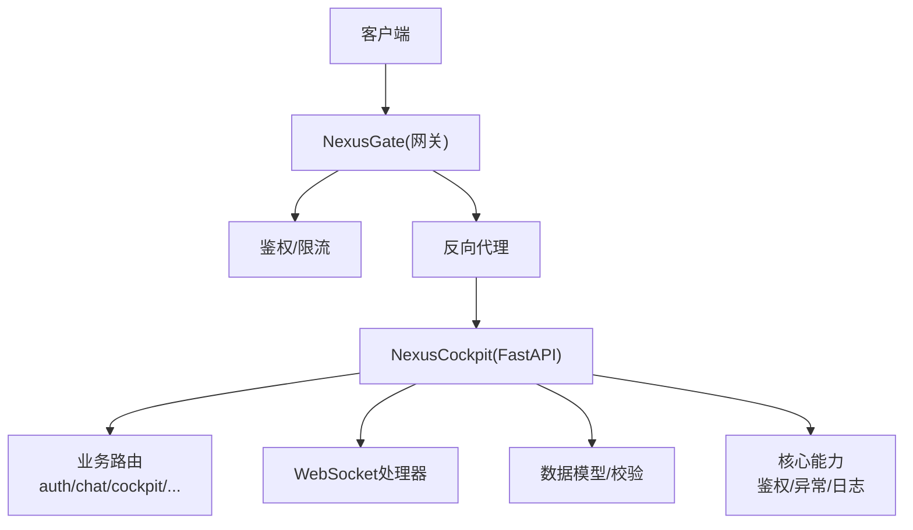
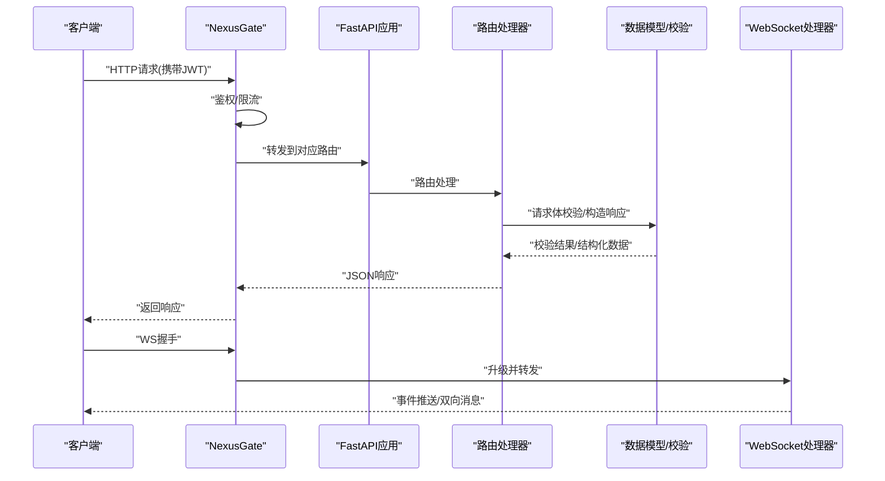
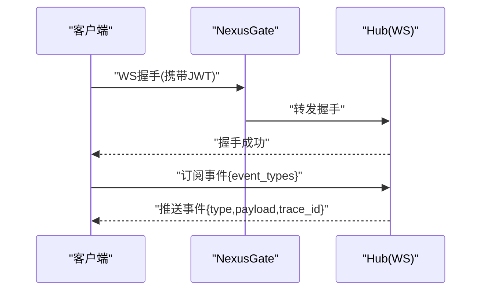
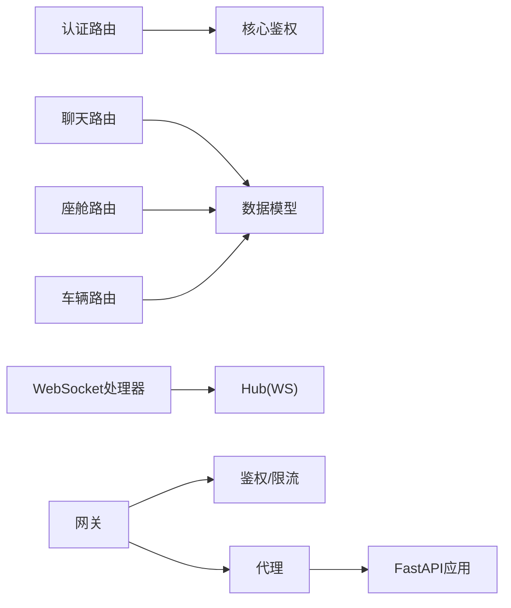

# API接口文档

<cite>
**本文引用的文件**   
- [backend_design/nexus/main.py](file://backend_design/nexus/main.py)
- [backend_design/nexus/api/routes/auth.py](file://backend_design/nexus/api/routes/auth.py)
- [backend_design/nexus/api/routes/chat.py](file://backend_design/nexus/api/routes/chat.py)
- [backend_design/nexus/api/routes/chat_sessions.py](file://backend_design/nexus/api/routes/chat_sessions.py)
- [backend_design/nexus/api/routes/cockpit.py](file://backend_design/nexus/api/routes/cockpit.py)
- [backend_design/nexus/api/routes/dataplatform.py](file://backend_design/nexus/api/routes/dataplatform.py)
- [backend_design/nexus/api/routes/health.py](file://backend_design/nexus/api/routes/health.py)
- [backend_design/nexus/api/routes/middleware_status.py](file://backend_design/nexus/api/routes/middleware_status.py)
- [backend_design/nexus/api/routes/settings.py](file://backend_design/nexus/api/routes/settings.py)
- [backend_design/nexus/api/routes/vehicle.py](file://backend_design/nexus/api/routes/vehicle.py)
- [backend_design/nexus/api/websocket.py](file://backend_design/nexus/api/websocket.py)
- [backend_design/nexus/core/auth.py](file://backend_design/nexus/core/auth.py)
- [backend_design/nexus/core/exceptions.py](file://backend_design/nexus/core/exceptions.py)
- [backend_design/nexus/models/schemas.py](file://backend_design/nexus/models/schemas.py)
- [backend_design/nexus_gate/internal/handlers/handlers.go](file://backend_design/nexus_gate/internal/handlers/handlers.go)
- [backend_design/nexus_gate/internal/ws/hub.go](file://backend_design/nexus_gate/internal/ws/hub.go)
- [backend_design/nexus_gate/proto/nexus.proto](file://backend_design/nexus_gate/proto/nexus.proto)
</cite>

## 目录
1. [简介](#简介)
2. [项目结构](#项目结构)
3. [核心组件](#核心组件)
4. [架构总览](#架构总览)
5. [详细组件分析](#详细组件分析)
6. [依赖关系分析](#依赖关系分析)
7. [性能考虑](#性能考虑)
8. [故障排查指南](#故障排查指南)
9. [结论](#结论)
10. [附录](#附录)

## 简介
本文件为 NexusCockpit 系统的完整API接口文档，覆盖以下范围：
- RESTful API端点：HTTP方法、URL路径、请求参数、响应格式与错误码
- WebSocket实时通信：连接建立、消息格式、事件类型与状态管理
- gRPC内部服务契约：protobuf消息与服务定义
- 认证与授权：JWT令牌使用、权限控制与访问限制
- API版本管理与向后兼容策略
- SDK集成指南与客户端最佳实践

## 项目结构
后端采用Python FastAPI应用，按功能模块划分路由；网关采用Go实现，提供鉴权、限流、代理与WebSocket转发能力。

图表来源
- [backend_design/nexus/main.py](file://backend_design/nexus/main.py)
- [backend_design/nexus/api/websocket.py](file://backend_design/nexus/api/websocket.py)
- [backend_design/nexus_gate/internal/handlers/handlers.go](file://backend_design/nexus_gate/internal/handlers/handlers.go)
- [backend_design/nexus_gate/internal/ws/hub.go](file://backend_design/nexus_gate/internal/ws/hub.go)

章节来源
- [backend_design/nexus/main.py](file://backend_design/nexus/main.py)
- [backend_design/nexus/api/websocket.py](file://backend_design/nexus/api/websocket.py)
- [backend_design/nexus_gate/internal/handlers/handlers.go](file://backend_design/nexus_gate/internal/handlers/handlers.go)
- [backend_design/nexus_gate/internal/ws/hub.go](file://backend_design/nexus_gate/internal/ws/hub.go)

## 核心组件
- 路由层：按领域组织REST端点（认证、聊天、座舱、数据平台、健康检查、中间件状态、设置、车辆等）
- 认证与授权：基于JWT的无状态鉴权，结合网关层限流与访问控制
- 数据模型：Pydantic模型用于请求/响应结构与字段校验
- 异常处理：统一异常类型与错误响应格式
- WebSocket：服务端推送与双向通信

章节来源
- [backend_design/nexus/api/routes/auth.py](file://backend_design/nexus/api/routes/auth.py)
- [backend_design/nexus/api/routes/chat.py](file://backend_design/nexus/api/routes/chat.py)
- [backend_design/nexus/api/routes/chat_sessions.py](file://backend_design/nexus/api/routes/chat_sessions.py)
- [backend_design/nexus/api/routes/cockpit.py](file://backend_design/nexus/api/routes/cockpit.py)
- [backend_design/nexus/api/routes/dataplatform.py](file://backend_design/nexus/api/routes/dataplatform.py)
- [backend_design/nexus/api/routes/health.py](file://backend_design/nexus/api/routes/health.py)
- [backend_design/nexus/api/routes/middleware_status.py](file://backend_design/nexus/api/routes/middleware_status.py)
- [backend_design/nexus/api/routes/settings.py](file://backend_design/nexus/api/routes/settings.py)
- [backend_design/nexus/api/routes/vehicle.py](file://backend_design/nexus/api/routes/vehicle.py)
- [backend_design/nexus/core/auth.py](file://backend_design/nexus/core/auth.py)
- [backend_design/nexus/core/exceptions.py](file://backend_design/nexus/core/exceptions.py)
- [backend_design/nexus/models/schemas.py](file://backend_design/nexus/models/schemas.py)

## 架构总览
系统由前端、网关与后端组成。网关负责鉴权、限流、协议转换与WebSocket转发；后端提供REST与WebSocket服务，并通过数据模型进行输入输出校验。

图表来源
- [backend_design/nexus/main.py](file://backend_design/nexus/main.py)
- [backend_design/nexus/api/websocket.py](file://backend_design/nexus/api/websocket.py)
- [backend_design/nexus_gate/internal/handlers/handlers.go](file://backend_design/nexus_gate/internal/handlers/handlers.go)
- [backend_design/nexus_gate/internal/ws/hub.go](file://backend_design/nexus_gate/internal/ws/hub.go)

## 详细组件分析

### 认证与授权（REST）
- 登录与令牌签发：通过认证路由获取JWT令牌，后续请求在Header中携带令牌
- 令牌校验：核心鉴权模块解析并验证令牌有效性及权限信息
- 访问限制：网关层对敏感接口实施限流与白名单策略

建议的请求头
- Authorization: Bearer <JWT>

典型流程
- 客户端调用登录接口获取令牌
- 客户端在后续请求中附加Authorization头
- 网关校验令牌与权限后转发至后端路由
- 路由处理器根据用户上下文执行操作

章节来源
- [backend_design/nexus/api/routes/auth.py](file://backend_design/nexus/api/routes/auth.py)
- [backend_design/nexus/core/auth.py](file://backend_design/nexus/core/auth.py)

### 聊天会话（REST）
- 会话创建与管理：支持创建新会话、列出历史会话、删除会话
- 消息发送与接收：提交文本或语音转写内容，返回结构化对话片段
- 分页与过滤：支持按时间、关键词检索与分页查询

请求示例要点
- 会话列表：GET /api/v1/chat/sessions?page=1&size=20
- 创建会话：POST /api/v1/chat/sessions {title}
- 发送消息：POST /api/v1/chat/messages {session_id, content, type}

响应示例要点
- 会话对象包含id、标题、创建时间、最后更新时间
- 消息对象包含id、会话id、角色、内容、时间戳

章节来源
- [backend_design/nexus/api/routes/chat_sessions.py](file://backend_design/nexus/api/routes/chat_sessions.py)
- [backend_design/nexus/api/routes/chat.py](file://backend_design/nexus/api/routes/chat.py)
- [backend_design/nexus/models/schemas.py](file://backend_design/nexus/models/schemas.py)

### 座舱控制（REST）
- 设备状态查询：获取座舱各子系统状态
- 指令下发：控制空调、座椅、车窗、媒体等
- 批量操作：支持一次性下发多条指令

请求示例要点
- 状态查询：GET /api/v1/cockpit/status
- 控制指令：POST /api/v1/cockpit/control {device, action, params}

响应示例要点
- 状态对象包含各子系统键值对
- 控制响应包含任务id与执行结果

章节来源
- [backend_design/nexus/api/routes/cockpit.py](file://backend_design/nexus/api/routes/cockpit.py)
- [backend_design/nexus/models/schemas.py](file://backend_design/nexus/models/schemas.py)

### 数据平台（REST）
- 数据集管理：上传、下载、元数据更新
- 任务调度：触发数据处理任务，查询任务状态
- 指标与报表：导出统计结果

请求示例要点
- 上传数据：POST /api/v1/dataplatform/datasets/upload {file, metadata}
- 启动任务：POST /api/v1/dataplatform/tasks/run {type, params}

响应示例要点
- 上传响应包含文件id与存储位置
- 任务响应包含任务id与预计完成时间

章节来源
- [backend_design/nexus/api/routes/dataplatform.py](file://backend_design/nexus/api/routes/dataplatform.py)
- [backend_design/nexus/models/schemas.py](file://backend_design/nexus/models/schemas.py)

### 健康检查与中间件状态（REST）
- 健康检查：GET /api/v1/health 返回服务可用性
- 中间件状态：GET /api/v1/middleware/status 返回缓存、队列等中间件运行状况

响应示例要点
- 健康检查返回status与timestamp
- 中间件状态返回各组件状态与延迟指标

章节来源
- [backend_design/nexus/api/routes/health.py](file://backend_design/nexus/api/routes/health.py)
- [backend_design/nexus/api/routes/middleware_status.py](file://backend_design/nexus/api/routes/middleware_status.py)

### 设置管理（REST）
- 用户偏好：读取与更新个性化配置
- 系统设置：管理员可修改全局参数

请求示例要点
- 获取设置：GET /api/v1/settings/{scope}/{key}
- 更新设置：PUT /api/v1/settings/{scope}/{key} {value}

响应示例要点
- 设置对象包含scope、key、value与更新时间

章节来源
- [backend_design/nexus/api/routes/settings.py](file://backend_design/nexus/api/routes/settings.py)
- [backend_design/nexus/models/schemas.py](file://backend_design/nexus/models/schemas.py)

### 车辆接口（REST）
- 车辆状态：查询电量、里程、胎压等
- 远程控制：解锁、锁车、开启空调等
- 事件订阅：通过WebSocket获取车辆实时事件

请求示例要点
- 车辆状态：GET /api/v1/vehicle/status
- 远程控制：POST /api/v1/vehicle/control {action, params}

响应示例要点
- 状态对象包含各项传感器与执行器读数
- 控制响应包含任务id与执行结果

章节来源
- [backend_design/nexus/api/routes/vehicle.py](file://backend_design/nexus/api/routes/vehicle.py)
- [backend_design/nexus/models/schemas.py](file://backend_design/nexus/models/schemas.py)

### WebSocket实时通信
- 连接建立：客户端通过ws/wss协议连接到网关，网关转发至后端WebSocket处理器
- 消息格式：采用JSON封装，包含type、payload、trace_id等字段
- 事件类型：如message、status_update、task_progress、error等
- 状态管理：连接生命周期包括connected、subscribed、disconnected，支持重连与心跳

连接序列

图表来源
- [backend_design/nexus/api/websocket.py](file://backend_design/nexus/api/websocket.py)
- [backend_design/nexus_gate/internal/ws/hub.go](file://backend_design/nexus_gate/internal/ws/hub.go)

章节来源
- [backend_design/nexus/api/websocket.py](file://backend_design/nexus/api/websocket.py)
- [backend_design/nexus_gate/internal/ws/hub.go](file://backend_design/nexus_gate/internal/ws/hub.go)

### gRPC内部服务契约
- 服务定义：nexus.proto描述内部服务方法与消息类型
- 消息格式：统一的请求/响应结构，包含id、timestamp、payload等字段
- 服务契约：明确方法签名、错误码与重试策略

章节来源
- [backend_design/nexus_gate/proto/nexus.proto](file://backend_design/nexus_gate/proto/nexus.proto)

## 依赖关系分析
- 路由层依赖核心鉴权与数据模型
- 网关层依赖鉴权、限流与WebSocket Hub
- 数据模型集中定义于schemas，确保前后端一致性

图表来源
- [backend_design/nexus/api/routes/auth.py](file://backend_design/nexus/api/routes/auth.py)
- [backend_design/nexus/api/routes/chat.py](file://backend_design/nexus/api/routes/chat.py)
- [backend_design/nexus/api/routes/cockpit.py](file://backend_design/nexus/api/routes/cockpit.py)
- [backend_design/nexus/api/routes/vehicle.py](file://backend_design/nexus/api/routes/vehicle.py)
- [backend_design/nexus/api/websocket.py](file://backend_design/nexus/api/websocket.py)
- [backend_design/nexus/core/auth.py](file://backend_design/nexus/core/auth.py)
- [backend_design/nexus/models/schemas.py](file://backend_design/nexus/models/schemas.py)
- [backend_design/nexus_gate/internal/handlers/handlers.go](file://backend_design/nexus_gate/internal/handlers/handlers.go)
- [backend_design/nexus_gate/internal/ws/hub.go](file://backend_design/nexus_gate/internal/ws/hub.go)

章节来源
- [backend_design/nexus/api/routes/auth.py](file://backend_design/nexus/api/routes/auth.py)
- [backend_design/nexus/api/routes/chat.py](file://backend_design/nexus/api/routes/chat.py)
- [backend_design/nexus/api/routes/cockpit.py](file://backend_design/nexus/api/routes/cockpit.py)
- [backend_design/nexus/api/routes/vehicle.py](file://backend_design/nexus/api/routes/vehicle.py)
- [backend_design/nexus/api/websocket.py](file://backend_design/nexus/api/websocket.py)
- [backend_design/nexus/core/auth.py](file://backend_design/nexus/core/auth.py)
- [backend_design/nexus/models/schemas.py](file://backend_design/nexus/models/schemas.py)
- [backend_design/nexus_gate/internal/handlers/handlers.go](file://backend_design/nexus_gate/internal/handlers/handlers.go)
- [backend_design/nexus_gate/internal/ws/hub.go](file://backend_design/nexus_gate/internal/ws/hub.go)

## 性能考虑
- 网关层限流：对高频接口实施令牌桶或滑动窗口限流，避免雪崩
- 连接复用：WebSocket长连接减少握手开销，合理设置心跳间隔
- 数据模型校验：集中校验提升错误定位效率，减少无效请求进入业务层
- 异步处理：对耗时任务采用任务队列与回调机制，提高吞吐

[本节为通用指导，不直接分析具体文件]

## 故障排查指南
- 统一异常类型：核心异常模块定义标准错误码与消息，便于前端展示与日志追踪
- 常见错误码
  - 401：未认证或令牌过期
  - 403：权限不足
  - 400：请求参数校验失败
  - 429：请求频率超限
  - 500：服务器内部错误
- 排查步骤
  - 检查Authorization头是否携带有效JWT
  - 查看网关限流日志与后端异常日志
  - 确认WebSocket事件订阅是否正确，trace_id是否一致

章节来源
- [backend_design/nexus/core/exceptions.py](file://backend_design/nexus/core/exceptions.py)

## 结论
NexusCockpit通过网关与后端解耦的架构，提供了完善的REST与WebSocket接口，配合JWT鉴权与统一异常处理，具备良好的可扩展性与可观测性。建议在客户端实现中遵循版本化策略、幂等设计与错误重试机制，以提升稳定性与用户体验。

[本节为总结，不直接分析具体文件]

## 附录

### API版本管理与向后兼容
- 版本前缀：所有REST端点使用/api/v1前缀，便于未来演进
- 兼容性策略
  - 新增字段：保持向后兼容，旧客户端忽略未知字段
  - 废弃字段：保留至少两个大版本，提供迁移提示
  - 破坏性变更：通过新版本前缀发布，并提供迁移指南

[本节为通用策略说明，不直接分析具体文件]

### SDK集成指南与最佳实践
- 初始化SDK：配置网关地址、超时与重试策略
- 认证流程：登录后缓存JWT，自动刷新过期令牌
- 错误处理：捕获统一错误码，展示友好提示
- WebSocket集成：实现重连与心跳检测，订阅必要事件
- 幂等设计：对写操作生成唯一请求id，避免重复提交

[本节为通用实践指导，不直接分析具体文件]