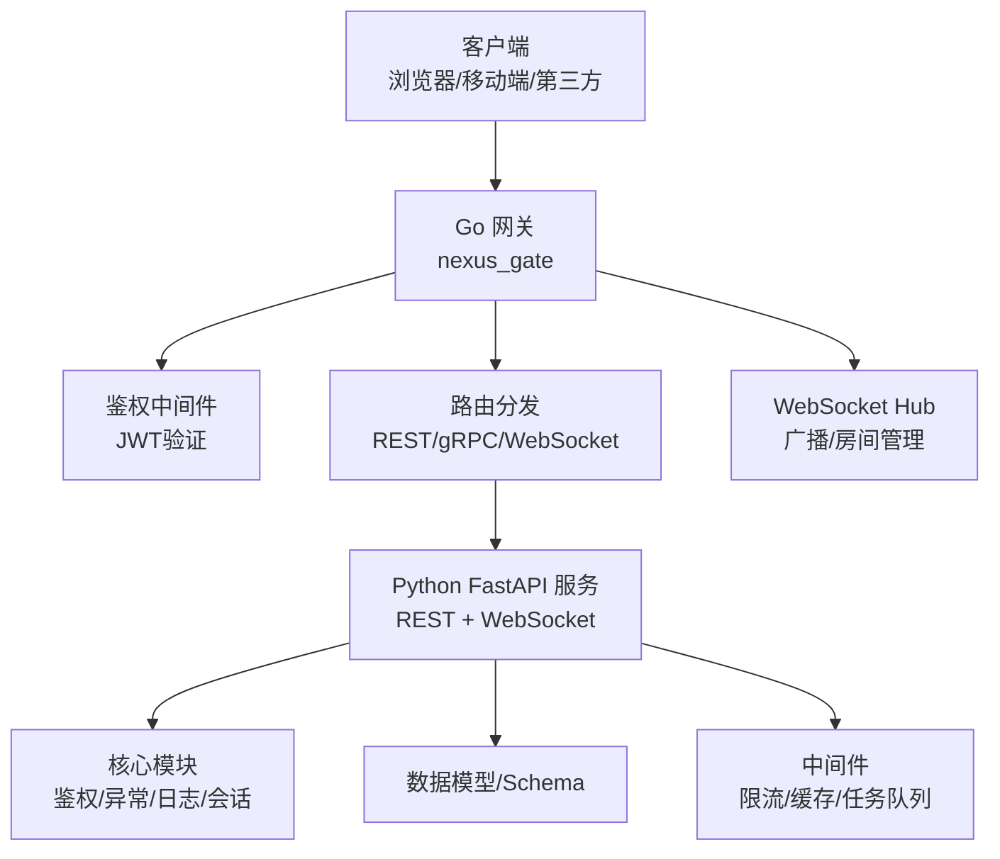
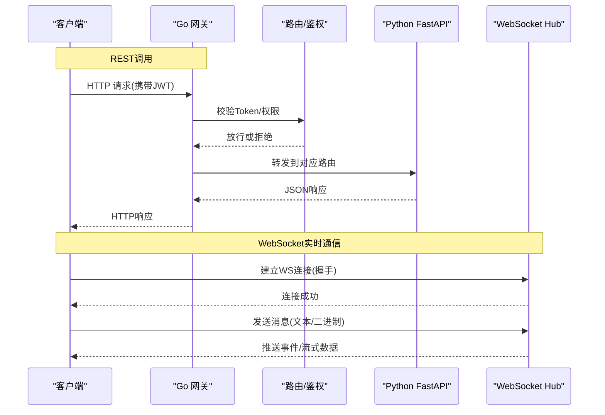
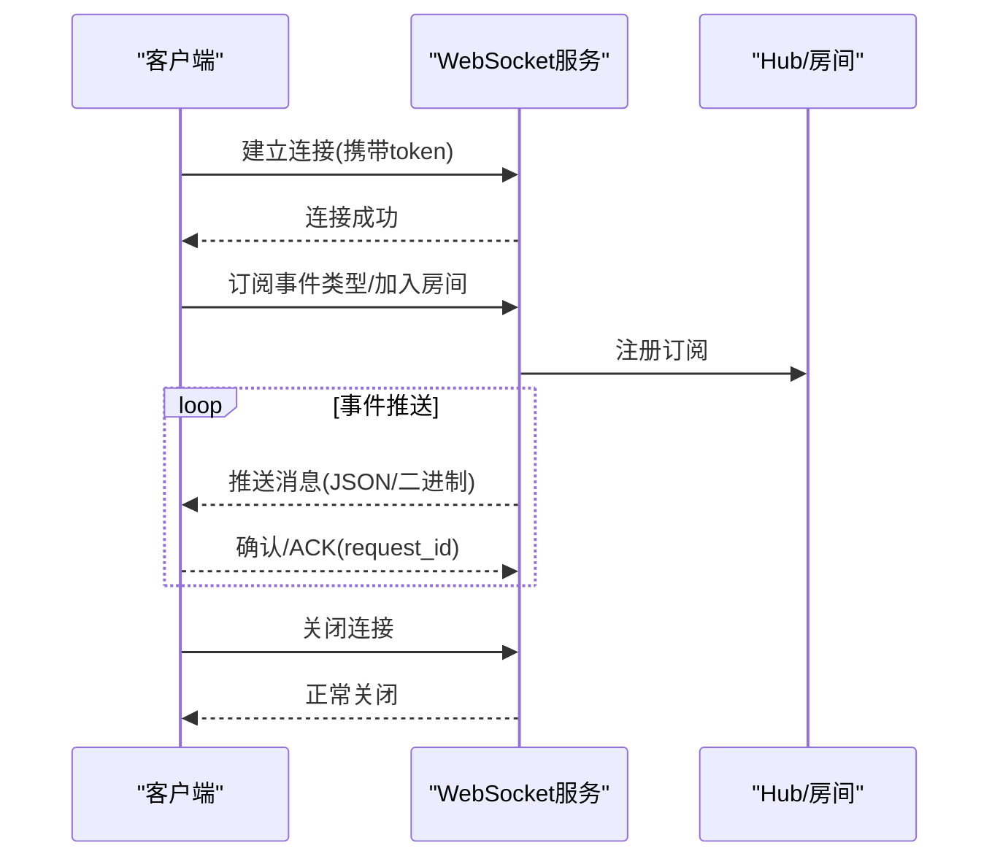
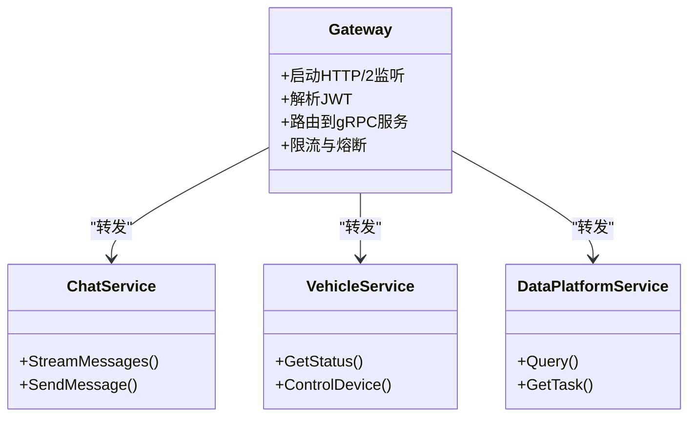
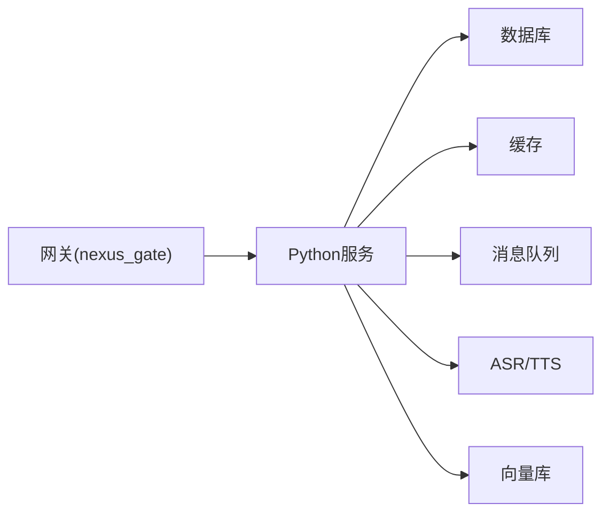

# API接口文档

<cite>
**本文引用的文件**   
- [backend_design/nexus/main.py](file://backend_design/nexus/main.py)
- [backend_design/nexus/api/__init__.py](file://backend_design/nexus/api/__init__.py)
- [backend_design/nexus/api/routes/auth.py](file://backend_design/nexus/api/routes/auth.py)
- [backend_design/nexus/api/routes/chat.py](file://backend_design/nexus/api/routes/chat.py)
- [backend_design/nexus/api/routes/chat_sessions.py](file://backend_design/nexus/api/routes/chat_sessions.py)
- [backend_design/nexus/api/routes/cockpit.py](file://backend_design/nexus/api/routes/cockpit.py)
- [backend_design/nexus/api/routes/dataplatform.py](file://backend_design/nexus/api/routes/dataplatform.py)
- [backend_design/nexus/api/routes/health.py](file://backend_design/nexus/api/routes/health.py)
- [backend_design/nexus/api/routes/middleware_status.py](file://backend_design/nexus/api/routes/middleware_status.py)
- [backend_design/nexus/api/routes/settings.py](file://backend_design/nexus/api/routes/settings.py)
- [backend_design/nexus/api/routes/vehicle.py](file://backend_design/nexus/api/routes/vehicle.py)
- [backend_design/nexus/api/websocket.py](file://backend_design/nexus/api/websocket.py)
- [backend_design/nexus/core/auth.py](file://backend_design/nexus/core/auth.py)
- [backend_design/nexus/core/exceptions.py](file://backend_design/nexus/core/exceptions.py)
- [backend_design/nexus/core/logger.py](file://backend_design/nexus/core/logger.py)
- [backend_design/nexus/middleware/rate_limiter.py](file://backend_design/nexus/middleware/rate_limiter.py)
- [backend_design/nexus/middleware/session_store.py](file://backend_design/nexus/middleware/session_store.py)
- [backend_design/nexus/models/schemas.py](file://backend_design/nexus/models/schemas.py)
- [backend_design/nexus_gate/cmd/main.go](file://backend_design/nexus_gate/cmd/main.go)
- [backend_design/nexus_gate/internal/router/router.go](file://backend_design/nexus_gate/internal/router/router.go)
- [backend_design/nexus_gate/internal/handlers/handlers.go](file://backend_design/nexus_gate/internal/handlers/handlers.go)
- [backend_design/nexus_gate/internal/ws/hub.go](file://backend_design/nexus_gate/internal/ws/hub.go)
- [backend_design/nexus_gate/proto/nexus.proto](file://backend_design/nexus_gate/proto/nexus.proto)
</cite>

## 目录
1. [简介](#简介)
2. [项目结构](#项目结构)
3. [核心组件](#核心组件)
4. [架构总览](#架构总览)
5. [详细组件分析](#详细组件分析)
6. [依赖关系分析](#依赖关系分析)
7. [性能考虑](#性能考虑)
8. [故障排查指南](#故障排查指南)
9. [结论](#结论)
10. [附录](#附录)

## 简介
本文件为 NexusCockpit 系统的完整API接口文档，覆盖以下协议与能力：
- RESTful API：HTTP方法、URL模式、请求/响应模型、认证方式、错误码与限流策略。
- WebSocket API：连接建立、消息格式、事件类型与实时交互模式。
- gRPC 网关接口：协议规范、数据帧与二进制格式、状态管理与鉴权透传。
- 通用主题：版本信息、安全建议、速率限制、调试与监控、常见用例与客户端实现指南、弃用迁移与兼容性说明。

## 项目结构
NexusCockpit 采用前后端分离与多语言服务组合：
- Python 后端（FastAPI）提供REST与WebSocket接口，位于 backend_design/nexus。
- Go 网关（nexus_gate）提供gRPC网关、鉴权、路由转发与WebSocket Hub，位于 backend_design/nexus_gate。
- 前端位于 frontend_design/src，通过REST/WebSocket与后端交互。

**图示来源**
- [backend_design/nexus/main.py](file://backend_design/nexus/main.py)
- [backend_design/nexus_gate/cmd/main.go](file://backend_design/nexus_gate/cmd/main.go)
- [backend_design/nexus_gate/internal/router/router.go](file://backend_design/nexus_gate/internal/router/router.go)
- [backend_design/nexus/api/websocket.py](file://backend_design/nexus/api/websocket.py)
- [backend_design/nexus_gate/internal/ws/hub.go](file://backend_design/nexus_gate/internal/ws/hub.go)

**章节来源**
- [backend_design/nexus/main.py](file://backend_design/nexus/main.py)
- [backend_design/nexus_gate/cmd/main.go](file://backend_design/nexus_gate/cmd/main.go)

## 核心组件
- 应用入口与路由注册：FastAPI主程序负责挂载路由、中间件与生命周期钩子。
- 鉴权与安全：基于JWT的认证流程，支持Bearer Token与可选的会话绑定。
- 限流与稳定性：令牌桶/滑动窗口限流、熔断器、重试与超时控制。
- 会话与状态：服务端会话存储、用户上下文注入。
- 可观测性：结构化日志、指标采集与链路追踪。

**章节来源**
- [backend_design/nexus/core/auth.py](file://backend_design/nexus/core/auth.py)
- [backend_design/nexus/middleware/rate_limiter.py](file://backend_design/nexus/middleware/rate_limiter.py)
- [backend_design/nexus/middleware/session_store.py](file://backend_design/nexus/middleware/session_store.py)
- [backend_design/nexus/core/logger.py](file://backend_design/nexus/core/logger.py)

## 架构总览
系统对外暴露三类接口：
- REST API：用于资源操作、查询与管理。
- WebSocket API：用于实时对话、车辆遥测与仪表盘推送。
- gRPC 网关：面向内部或高性能客户端的二进制接口，由Go网关统一接入并转发至Python服务。

**图示来源**
- [backend_design/nexus_gate/internal/router/router.go](file://backend_design/nexus_gate/internal/router/router.go)
- [backend_design/nexus/api/websocket.py](file://backend_design/nexus/api/websocket.py)
- [backend_design/nexus_gate/internal/ws/hub.go](file://backend_design/nexus_gate/internal/ws/hub.go)

## 详细组件分析

### RESTful API
- 基础约定
  - 内容类型：application/json
  - 认证：Authorization: Bearer <JWT>
  - 版本前缀：/api/v1（示例，具体以路由定义为准）
  - 分页：GET列表接口支持 page、page_size 等参数
  - 排序：order_by、sort_dir
  - 过滤：按字段名传递查询参数
- 通用响应体
  - code：业务状态码
  - message：人类可读描述
  - data：业务数据
  - trace_id：请求追踪ID
- 通用错误码
  - 200：成功
  - 400：请求参数错误
  - 401：未认证或Token无效
  - 403：无权限
  - 404：资源不存在
  - 429：触发限流
  - 500：服务器内部错误

- 认证相关
  - POST /api/v1/auth/login：登录获取JWT
  - POST /api/v1/auth/logout：登出失效会话
  - GET /api/v1/auth/me：获取当前用户信息
  - 请求头：Authorization: Bearer <token>
  - 响应：包含 token、过期时间、用户基本信息

- 聊天与会话
  - POST /api/v1/chat/sessions：创建会话
  - GET /api/v1/chat/sessions/{id}：获取会话详情
  - DELETE /api/v1/chat/sessions/{id}：删除会话
  - POST /api/v1/chat/messages：发送消息（文本/多媒体引用）
  - GET /api/v1/chat/messages?session_id=...&page=...：分页拉取历史消息
  - 支持流式返回（SSE或分块），客户端需处理增量渲染

- 座舱与车辆
  - GET /api/v1/cockpit/status：获取座舱状态概览
  - GET /api/v1/vehicle/status：获取车辆状态
  - POST /api/v1/vehicle/control：下发控制指令（空调、车窗、座椅等）
  - 注意：控制类接口需要更高权限，且可能受设备在线性与互斥锁保护

- 数据平台
  - GET /api/v1/dataplatform/datasets：列出数据集
  - POST /api/v1/dataplatform/query：执行查询（异步任务）
  - GET /api/v1/dataplatform/tasks/{id}：查询任务状态与结果下载链接

- 健康与中间件
  - GET /api/v1/health：服务健康检查
  - GET /api/v1/middleware/status：查看限流、缓存、任务队列状态

- 设置
  - GET /api/v1/settings：读取系统设置
  - PUT /api/v1/settings：更新系统设置（管理员）

- 错误处理
  - 统一异常捕获，返回标准JSON错误体
  - 记录trace_id便于定位问题
  - 敏感信息不泄露（如堆栈、密钥）

- 速率限制
  - 默认全局限流与按用户/IP维度限流
  - 超限返回429，并附带Retry-After秒数
  - 可通过配置调整阈值与窗口大小

- 安全建议
  - 强制HTTPS
  - JWT短期有效+刷新机制
  - 最小权限原则与RBAC
  - 输入校验与输出脱敏

- 版本与兼容
  - URL版本化策略，向后兼容至少一个次版本
  - 废弃字段在响应中保留但标记deprecated
  - 变更通知通过公告与升级指南发布

**章节来源**
- [backend_design/nexus/api/routes/auth.py](file://backend_design/nexus/api/routes/auth.py)
- [backend_design/nexus/api/routes/chat.py](file://backend_design/nexus/api/routes/chat.py)
- [backend_design/nexus/api/routes/chat_sessions.py](file://backend_design/nexus/api/routes/chat_sessions.py)
- [backend_design/nexus/api/routes/cockpit.py](file://backend_design/nexus/api/routes/cockpit.py)
- [backend_design/nexus/api/routes/dataplatform.py](file://backend_design/nexus/api/routes/dataplatform.py)
- [backend_design/nexus/api/routes/health.py](file://backend_design/nexus/api/routes/health.py)
- [backend_design/nexus/api/routes/middleware_status.py](file://backend_design/nexus/api/routes/middleware_status.py)
- [backend_design/nexus/api/routes/settings.py](file://backend_design/nexus/api/routes/settings.py)
- [backend_design/nexus/api/routes/vehicle.py](file://backend_design/nexus/api/routes/vehicle.py)
- [backend_design/nexus/core/exceptions.py](file://backend_design/nexus/core/exceptions.py)
- [backend_design/nexus/middleware/rate_limiter.py](file://backend_design/nexus/middleware/rate_limiter.py)

### WebSocket API
- 连接建立
  - URL：/ws（或带路径参数的子通道）
  - 握手：支持查询参数携带token或先登录后再建立连接
  - 心跳：客户端与服务端双向ping/pong保活
- 消息格式
  - 文本消息：JSON对象，包含type、payload、timestamp、request_id
  - 二进制消息：用于音频流、图片、文件片段传输，头部包含元数据
- 事件类型
  - chat.message：新消息到达
  - chat.stream：流式增量片段
  - vehicle.status：车辆状态变更
  - cockpit.update：座舱面板更新
  - task.progress：后台任务进度
- 交互模式
  - 订阅/发布：客户端声明感兴趣的事件类型
  - 房间/频道：按会话或车辆ID隔离
  - 幂等与去重：通过request_id或序列号保证顺序与去重
- 错误与重连
  - 断开原因码：1000正常关闭、1001离开、1008鉴权失败、1011服务端错误
  - 指数退避重连，最大重试次数与抖动
- 安全与限流
  - 连接级鉴权与频率限制
  - 单连接消息上限与带宽控制
  - 敏感字段脱敏与审计日志

**图示来源**
- [backend_design/nexus/api/websocket.py](file://backend_design/nexus/api/websocket.py)
- [backend_design/nexus_gate/internal/ws/hub.go](file://backend_design/nexus_gate/internal/ws/hub.go)

**章节来源**
- [backend_design/nexus/api/websocket.py](file://backend_design/nexus/api/websocket.py)
- [backend_design/nexus_gate/internal/ws/hub.go](file://backend_design/nexus_gate/internal/ws/hub.go)

### gRPC 网关接口
- 协议与端口
  - 使用HTTP/2与gRPC-over-HTTP2
  - 网关监听端口与TLS证书由配置决定
- 服务与方法
  - 服务命名空间：nexus.api.v1
  - 典型方法：ChatService.StreamMessages、VehicleService.GetStatus、DataPlatformService.Query
- 数据帧与二进制
  - 请求/响应使用Protobuf序列化
  - 流式方法支持双向流与Server Streaming
- 鉴权与上下文
  - 网关层解析JWT并注入到gRPC Metadata
  - 下游服务从Metadata提取用户信息与租户标识
- 状态与错误
  - 使用gRPC状态码与自定义错误详情
  - 超时、重试与熔断策略在网关层配置
- 版本与兼容
  - 通过proto包版本与字段编号管理演进
  - 新增字段保持向后兼容，移除字段需灰度下线

**图示来源**
- [backend_design/nexus_gate/cmd/main.go](file://backend_design/nexus_gate/cmd/main.go)
- [backend_design/nexus_gate/proto/nexus.proto](file://backend_design/nexus_gate/proto/nexus.proto)
- [backend_design/nexus_gate/internal/handlers/handlers.go](file://backend_design/nexus_gate/internal/handlers/handlers.go)

**章节来源**
- [backend_design/nexus_gate/cmd/main.go](file://backend_design/nexus_gate/cmd/main.go)
- [backend_design/nexus_gate/proto/nexus.proto](file://backend_design/nexus_gate/proto/nexus.proto)
- [backend_design/nexus_gate/internal/handlers/handlers.go](file://backend_design/nexus_gate/internal/handlers/handlers.go)

## 依赖关系分析
- 外部依赖
  - 数据库与向量库：用于持久化与检索增强
  - 缓存与消息队列：提升吞吐与解耦
  - 语音与TTS/ASR引擎：语音交互能力
- 内部耦合
  - 网关与Python服务通过gRPC/HTTP解耦
  - 中间件（限流、缓存、会话）横向切面，降低业务侵入
- 潜在循环依赖
  - 通过分层与接口抽象避免循环导入
  - 事件总线与命令模式降低紧耦合

[此图为概念性依赖图，无需图示来源]

**章节来源**
- [backend_design/nexus/main.py](file://backend_design/nexus/main.py)
- [backend_design/nexus/middleware/rate_limiter.py](file://backend_design/nexus/middleware/rate_limiter.py)

## 性能考虑
- 连接复用与长连接：优先使用HTTP/2与WebSocket减少握手开销
- 批处理与合并：批量写入与聚合查询降低IO压力
- 缓存策略：热点数据多级缓存（本地+分布式）
- 流式传输：大文件或音视频采用分片与断点续传
- 背压与限流：网关与后端协同限流，防止雪崩
- 索引与分页：合理索引与游标分页避免深分页
- 监控与告警：关键指标埋点与阈值告警

[本节为通用指导，无需章节来源]

## 故障排查指南
- 日志与追踪
  - 启用结构化日志与trace_id贯穿全链路
  - 网关与后端分别输出访问日志与业务日志
- 常见问题
  - 401/403：检查JWT签名、有效期与权限
  - 429：查看限流配置与峰值流量
  - 500：根据trace_id定位堆栈与依赖错误
- 诊断工具
  - curl/Postman测试REST
  - wscat/浏览器控制台测试WebSocket
  - grpcurl/insomnia测试gRPC
- 指标与看板
  - QPS、延迟分布、错误率、连接数、内存/CPU占用
  - 业务指标：会话活跃度、消息吞吐、任务完成时长

**章节来源**
- [backend_design/nexus/core/logger.py](file://backend_design/nexus/core/logger.py)
- [backend_design/nexus/api/routes/health.py](file://backend_design/nexus/api/routes/health.py)
- [backend_design/nexus/api/routes/middleware_status.py](file://backend_design/nexus/api/routes/middleware_status.py)

## 结论
NexusCockpit通过网关与Python服务的分层设计，提供了统一的REST、WebSocket与gRPC接口，具备完善的鉴权、限流、可观测性与扩展能力。遵循本文档的接口规范与安全建议，可实现稳定高效的集成与运维。

[本节为总结，无需章节来源]

## 附录

### 常见用例与客户端实现指南
- 快速开始
  - 获取JWT后，在后续请求中携带Authorization头
  - 使用分页与过滤参数优化列表查询
- 实时对话
  - 建立WebSocket连接，订阅chat.message与chat.stream
  - 处理增量片段并合并渲染
- 车辆控制
  - 先查询状态，再下发控制指令，等待确认回调
- 数据平台
  - 提交异步查询任务，轮询任务状态并下载结果

[本节为概念性指导，无需章节来源]

### 弃用功能迁移与兼容性说明
- 字段弃用：旧字段保留但标记deprecated，建议在下一个主版本移除
- 接口版本：v1与v2并行期，逐步引导迁移
- 行为变更：在升级指南中明确差异与回滚方案

[本节为概念性指导，无需章节来源]