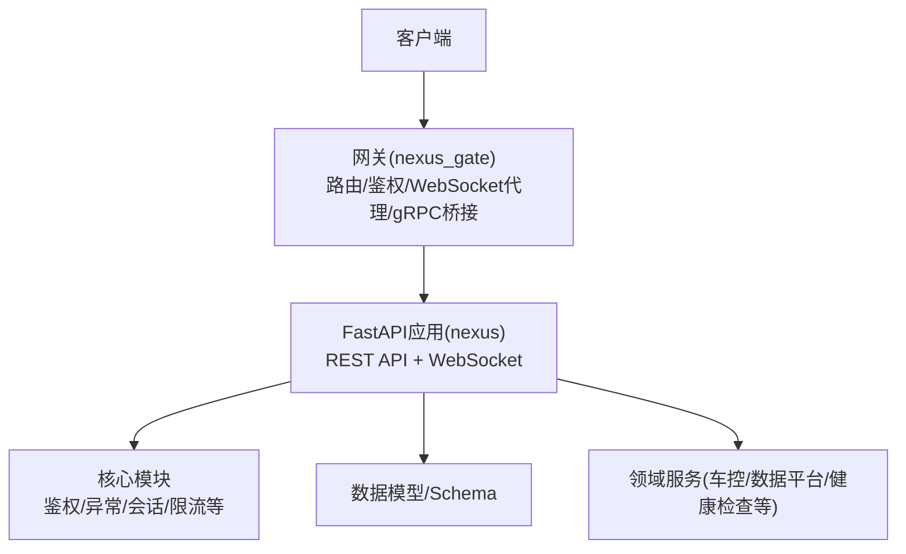
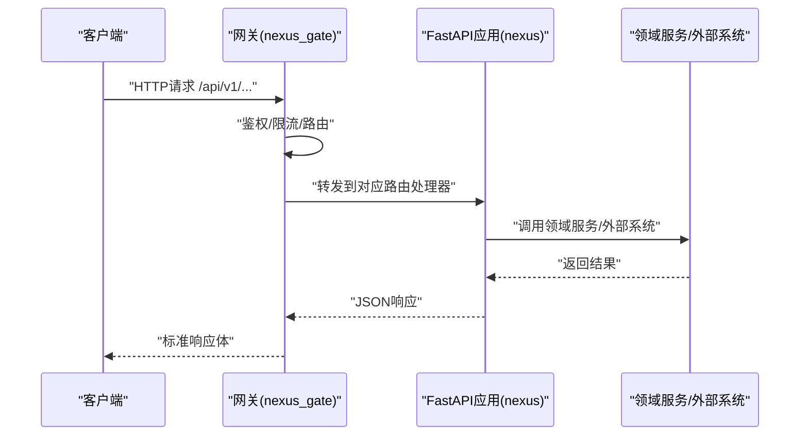
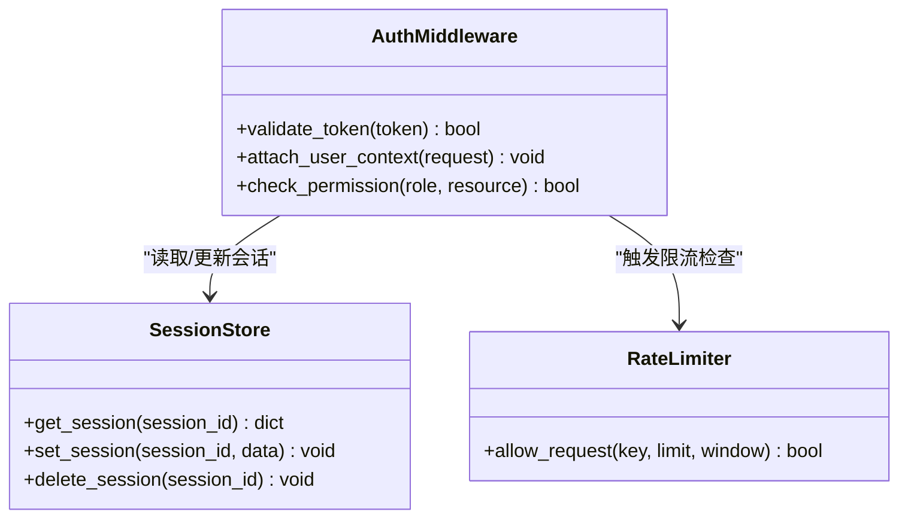
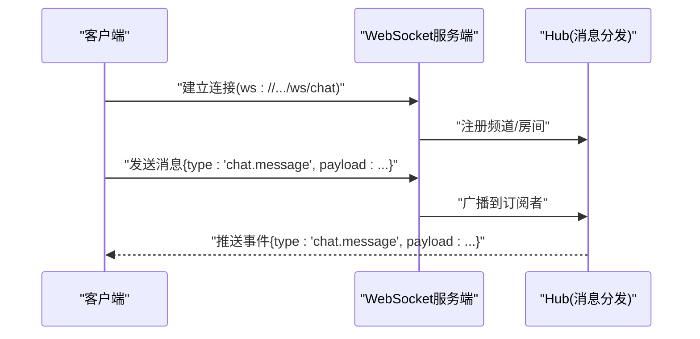
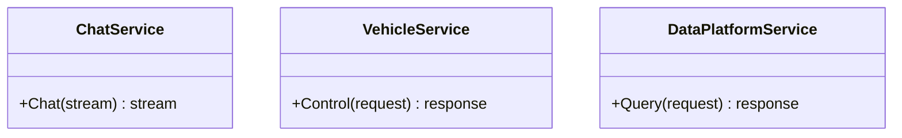
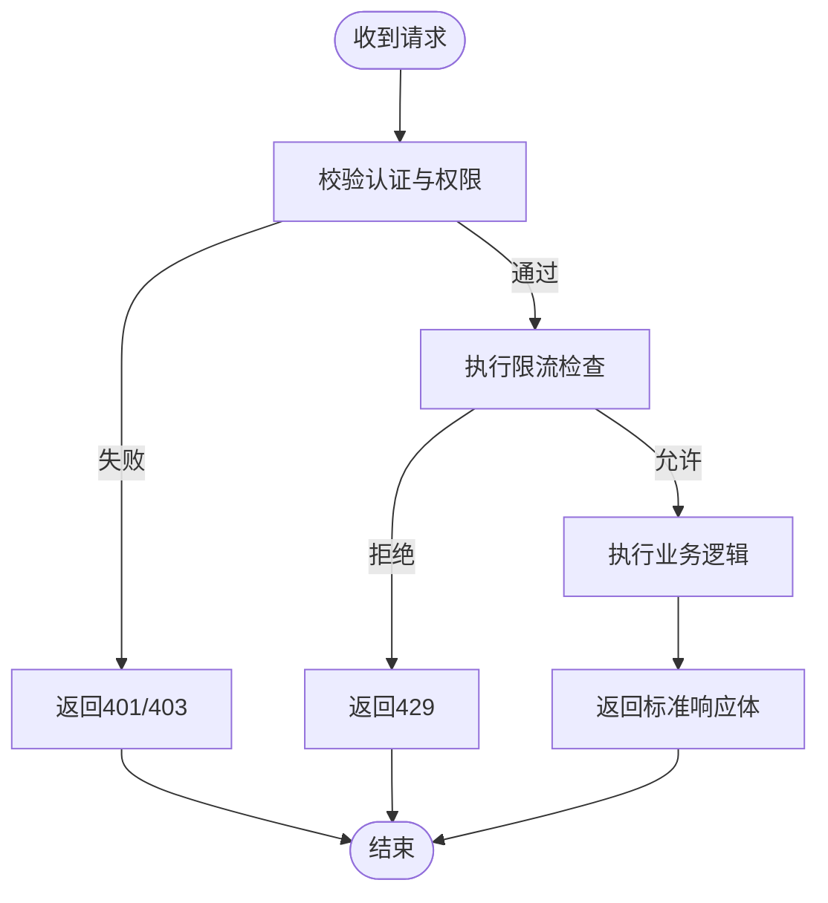
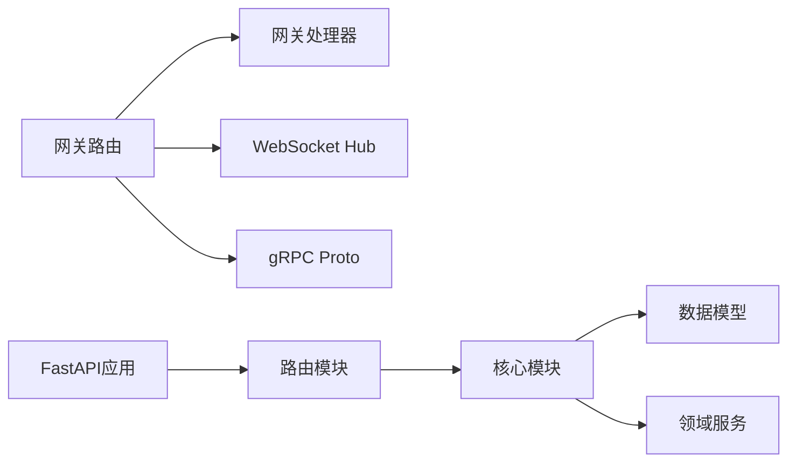

# API接口文档

<cite>
**本文引用的文件**   
- [backend_design/nexus/main.py](file://backend_design/nexus/main.py)
- [backend_design/nexus/api/__init__.py](file://backend_design/nexus/api/__init__.py)
- [backend_design/nexus/api/routes/auth.py](file://backend_design/nexus/api/routes/auth.py)
- [backend_design/nexus/api/routes/chat.py](file://backend_design/nexus/api/routes/chat.py)
- [backend_design/nexus/api/routes/chat_sessions.py](file://backend_design/nexus/api/routes/chat_sessions.py)
- [backend_design/nexus/api/routes/cockpit.py](file://backend_design/nexus/api/routes/cockpit.py)
- [backend_design/nexus/api/routes/dataplatform.py](file://backend_design/nexus/api/routes/dataplatform.py)
- [backend_design/nexus/api/routes/health.py](file://backend_design/nexus/api/routes/health.py)
- [backend_design/nexus/api/routes/middleware_status.py](file://backend_design/nexus/api/routes/middleware_status.py)
- [backend_design/nexus/api/routes/settings.py](file://backend_design/nexus/api/routes/settings.py)
- [backend_design/nexus/api/routes/vehicle.py](file://backend_design/nexus/api/routes/vehicle.py)
- [backend_design/nexus/api/websocket.py](file://backend_design/nexus/api/websocket.py)
- [backend_design/nexus/core/auth.py](file://backend_design/nexus/core/auth.py)
- [backend_design/nexus/core/exceptions.py](file://backend_design/nexus/core/exceptions.py)
- [backend_design/nexus/middleware/rate_limiter.py](file://backend_design/nexus/middleware/rate_limiter.py)
- [backend_design/nexus/middleware/session_store.py](file://backend_design/nexus/middleware/session_store.py)
- [backend_design/nexus/models/schemas.py](file://backend_design/nexus/models/schemas.py)
- [backend_design/nexus_gate/internal/router/router.go](file://backend_design/nexus_gate/internal/router/router.go)
- [backend_design/nexus_gate/internal/handlers/handlers.go](file://backend_design/nexus_gate/internal/handlers/handlers.go)
- [backend_design/nexus_gate/internal/ws/hub.go](file://backend_design/nexus_gate/internal/ws/hub.go)
- [backend_design/nexus_gate/proto/nexus.proto](file://backend_design/nexus_gate/proto/nexus.proto)
</cite>

## 目录
1. [简介](#简介)
2. [项目结构](#项目结构)
3. [核心组件](#核心组件)
4. [架构总览](#架构总览)
5. [详细组件分析](#详细组件分析)
6. [依赖关系分析](#依赖关系分析)
7. [性能与限流](#性能与限流)
8. [故障排查指南](#故障排查指南)
9. [结论](#结论)
10. [附录](#附录)

## 简介
本文件为 NexusCockpit 的完整API接口参考，覆盖以下方面：
- RESTful API端点：HTTP方法、URL模式、请求参数与响应格式
- 认证授权机制与权限控制策略
- WebSocket接口：连接建立、消息格式与事件类型
- gRPC服务定义与调用方式
- 完整的请求/响应示例与错误码说明
- API版本管理与向后兼容性策略
- 限流防护与安全防护措施

## 项目结构
后端采用Python FastAPI应用（nexus）作为业务API服务，Go语言网关（nexus_gate）负责鉴权、路由转发、WebSocket代理与gRPC桥接。前端通过网关访问后端API与服务。

**图示来源**
- [backend_design/nexus/main.py](file://backend_design/nexus/main.py)
- [backend_design/nexus_gate/internal/router/router.go](file://backend_design/nexus_gate/internal/router/router.go)
- [backend_design/nexus_gate/internal/handlers/handlers.go](file://backend_design/nexus_gate/internal/handlers/handlers.go)

**章节来源**
- [backend_design/nexus/main.py](file://backend_design/nexus/main.py)
- [backend_design/nexus/api/__init__.py](file://backend_design/nexus/api/__init__.py)
- [backend_design/nexus_gate/internal/router/router.go](file://backend_design/nexus_gate/internal/router/router.go)
- [backend_design/nexus_gate/internal/handlers/handlers.go](file://backend_design/nexus_gate/internal/handlers/handlers.go)

## 核心组件
- 路由注册与挂载：在应用入口中集中注册各功能路由，统一前缀与中间件。
- 认证与授权：基于JWT的无状态鉴权，结合角色/权限校验。
- 会话管理：基于Redis或内存的会话存储，支持跨节点共享。
- 限流：按IP/用户维度进行请求速率限制。
- 异常处理：统一的错误响应结构与错误码体系。
- WebSocket：实时消息通道，用于聊天、车辆状态推送等。
- gRPC：网关层提供gRPC服务，内部以protobuf定义契约。

**章节来源**
- [backend_design/nexus/api/__init__.py](file://backend_design/nexus/api/__init__.py)
- [backend_design/nexus/core/auth.py](file://backend_design/nexus/core/auth.py)
- [backend_design/nexus/middleware/rate_limiter.py](file://backend_design/nexus/middleware/rate_limiter.py)
- [backend_design/nexus/middleware/session_store.py](file://backend_design/nexus/middleware/session_store.py)
- [backend_design/nexus/core/exceptions.py](file://backend_design/nexus/core/exceptions.py)
- [backend_design/nexus/api/websocket.py](file://backend_design/nexus/api/websocket.py)
- [backend_design/nexus_gate/proto/nexus.proto](file://backend_design/nexus_gate/proto/nexus.proto)

## 架构总览
整体交互流程如下：客户端通过网关发起HTTP/WebSocket/gRPC请求；网关完成鉴权、限流与路由转发；后端FastAPI应用执行业务逻辑并返回结果；WebSocket用于双向实时通信；gRPC用于高性能服务间调用。

**图示来源**
- [backend_design/nexus_gate/internal/router/router.go](file://backend_design/nexus_gate/internal/router/router.go)
- [backend_design/nexus_gate/internal/handlers/handlers.go](file://backend_design/nexus_gate/internal/handlers/handlers.go)
- [backend_design/nexus/main.py](file://backend_design/nexus/main.py)

## 详细组件分析

### 认证与授权
- 认证方式：JWT令牌，包含用户标识、角色与过期时间。
- 授权策略：基于角色的访问控制（RBAC），对敏感接口进行权限校验。
- 会话管理：可选使用Redis持久化会话，支持多实例部署。

**图示来源**
- [backend_design/nexus/core/auth.py](file://backend_design/nexus/core/auth.py)
- [backend_design/nexus/middleware/session_store.py](file://backend_design/nexus/middleware/session_store.py)
- [backend_design/nexus/middleware/rate_limiter.py](file://backend_design/nexus/middleware/rate_limiter.py)

**章节来源**
- [backend_design/nexus/core/auth.py](file://backend_design/nexus/core/auth.py)
- [backend_design/nexus/middleware/session_store.py](file://backend_design/nexus/middleware/session_store.py)
- [backend_design/nexus/middleware/rate_limiter.py](file://backend_design/nexus/middleware/rate_limiter.py)

### REST API端点总览
所有REST接口统一通过网关暴露，建议遵循以下约定：
- 基础路径：/api/v1
- 内容类型：application/json
- 通用响应体：包含code、message、data字段
- 分页：支持page、size参数，返回total、items列表

以下为关键路由分组与典型端点（示例性描述，具体实现以源码为准）：

- 认证与账户
  - POST /api/v1/auth/login
    - 请求体：用户名、密码
    - 响应：access_token、refresh_token、expires_in
  - POST /api/v1/auth/logout
    - 请求头：Authorization: Bearer <token>
    - 响应：成功标志
  - GET /api/v1/auth/me
    - 请求头：Authorization: Bearer <token>
    - 响应：当前用户信息

- 聊天与会话
  - POST /api/v1/chat/sessions
    - 请求体：标题、初始消息
    - 响应：会话ID、创建时间
  - GET /api/v1/chat/sessions/{session_id}
    - 响应：会话详情、历史消息
  - POST /api/v1/chat/sessions/{session_id}/messages
    - 请求体：用户消息文本
    - 响应：AI回复片段或流式事件

- 座舱与车辆
  - GET /api/v1/cockpit/status
    - 响应：座舱运行状态、指标摘要
  - GET /api/v1/vehicle/status
    - 响应：车辆状态（电量、位置、门窗等）
  - POST /api/v1/vehicle/control
    - 请求体：控制指令（空调、媒体、导航等）
    - 响应：执行结果、任务ID

- 数据平台
  - GET /api/v1/dataplatform/datasets
    - 响应：数据集列表、元数据
  - POST /api/v1/dataplatform/query
    - 请求体：查询条件、过滤规则
    - 响应：查询结果集

- 健康检查与中间件状态
  - GET /api/v1/health
    - 响应：服务健康状态、依赖项状态
  - GET /api/v1/middleware/status
    - 响应：缓存、队列、数据库等中间件状态

- 设置
  - GET /api/v1/settings
    - 响应：系统配置项
  - PUT /api/v1/settings
    - 请求体：配置更新
    - 响应：更新结果

注意：以上为接口规范与示例，实际字段与行为请参考各路由实现文件。

**章节来源**
- [backend_design/nexus/api/routes/auth.py](file://backend_design/nexus/api/routes/auth.py)
- [backend_design/nexus/api/routes/chat.py](file://backend_design/nexus/api/routes/chat.py)
- [backend_design/nexus/api/routes/chat_sessions.py](file://backend_design/nexus/api/routes/chat_sessions.py)
- [backend_design/nexus/api/routes/cockpit.py](file://backend_design/nexus/api/routes/cockpit.py)
- [backend_design/nexus/api/routes/vehicle.py](file://backend_design/nexus/api/routes/vehicle.py)
- [backend_design/nexus/api/routes/dataplatform.py](file://backend_design/nexus/api/routes/dataplatform.py)
- [backend_design/nexus/api/routes/health.py](file://backend_design/nexus/api/routes/health.py)
- [backend_design/nexus/api/routes/middleware_status.py](file://backend_design/nexus/api/routes/middleware_status.py)
- [backend_design/nexus/api/routes/settings.py](file://backend_design/nexus/api/routes/settings.py)

### WebSocket接口
- 连接建立：ws://host/ws/chat 或 ws://host/ws/vehicle
- 认证：连接时携带token或在首个消息中附带鉴权信息
- 消息格式：
  - 上行：type、payload、metadata
  - 下行：type、payload、metadata
- 事件类型：
  - chat.message：聊天消息
  - chat.status：会话状态变更
  - vehicle.update：车辆状态推送
  - system.alert：系统告警

**图示来源**
- [backend_design/nexus/api/websocket.py](file://backend_design/nexus/api/websocket.py)
- [backend_design/nexus_gate/internal/ws/hub.go](file://backend_design/nexus_gate/internal/ws/hub.go)

**章节来源**
- [backend_design/nexus/api/websocket.py](file://backend_design/nexus/api/websocket.py)
- [backend_design/nexus_gate/internal/ws/hub.go](file://backend_design/nexus_gate/internal/ws/hub.go)

### gRPC服务
- 服务定义：位于proto文件中，定义服务名、方法与消息类型
- 调用方式：客户端通过gRPC协议直接调用，或由网关转换为HTTP/gRPC桥接
- 典型方法：
  - ChatService.Chat：流式对话
  - VehicleService.Control：车辆控制指令
  - DataPlatformService.Query：数据查询

**图示来源**
- [backend_design/nexus_gate/proto/nexus.proto](file://backend_design/nexus_gate/proto/nexus.proto)

**章节来源**
- [backend_design/nexus_gate/proto/nexus.proto](file://backend_design/nexus_gate/proto/nexus.proto)

### 请求/响应示例与错误码
- 通用响应体结构：
  - code：数字错误码
  - message：人类可读的错误信息
  - data：业务数据（可为对象或列表）
- 常见错误码：
  - 200：成功
  - 400：请求参数错误
  - 401：未认证或令牌无效
  - 403：权限不足
  - 404：资源不存在
  - 429：请求过于频繁（限流）
  - 500：服务器内部错误
- 示例（文字描述）：
  - 登录成功：返回access_token、refresh_token与过期时间
  - 查询失败：返回错误码与提示信息，便于前端展示

**章节来源**
- [backend_design/nexus/core/exceptions.py](file://backend_design/nexus/core/exceptions.py)
- [backend_design/nexus/models/schemas.py](file://backend_design/nexus/models/schemas.py)

### API版本管理与向后兼容
- 版本策略：通过URL前缀区分版本（如/api/v1、/api/v2）
- 兼容性原则：
  - 新增字段保持可选，避免破坏旧客户端
  - 废弃字段保留一段时间并提供迁移提示
  - 重大变更通过新版本发布，旧版本继续维护一定周期

**章节来源**
- [backend_design/nexus/api/__init__.py](file://backend_design/nexus/api/__init__.py)

### 限流防护与安全措施
- 限流策略：
  - 按IP或用户维度限制单位时间请求数
  - 不同接口可配置不同阈值
- 安全措施：
  - 强制HTTPS（生产环境）
  - 输入校验与输出序列化
  - 敏感操作二次确认与审计日志
  - 防重放攻击（时间戳+签名）

**图示来源**
- [backend_design/nexus/middleware/rate_limiter.py](file://backend_design/nexus/middleware/rate_limiter.py)
- [backend_design/nexus/core/auth.py](file://backend_design/nexus/core/auth.py)

**章节来源**
- [backend_design/nexus/middleware/rate_limiter.py](file://backend_design/nexus/middleware/rate_limiter.py)
- [backend_design/nexus/core/auth.py](file://backend_design/nexus/core/auth.py)

## 依赖关系分析
- 网关依赖：路由、鉴权、限流、WebSocket Hub、gRPC proto
- 应用依赖：路由模块、核心模块（鉴权/异常/会话）、数据模型、领域服务
- 外部依赖：Redis（会话/缓存）、向量/图数据库（RAG）、LLM/TTS/ASR引擎

**图示来源**
- [backend_design/nexus_gate/internal/router/router.go](file://backend_design/nexus_gate/internal/router/router.go)
- [backend_design/nexus_gate/internal/handlers/handlers.go](file://backend_design/nexus_gate/internal/handlers/handlers.go)
- [backend_design/nexus_gate/internal/ws/hub.go](file://backend_design/nexus_gate/internal/ws/hub.go)
- [backend_design/nexus/main.py](file://backend_design/nexus/main.py)
- [backend_design/nexus/api/__init__.py](file://backend_design/nexus/api/__init__.py)

**章节来源**
- [backend_design/nexus_gate/internal/router/router.go](file://backend_design/nexus_gate/internal/router/router.go)
- [backend_design/nexus_gate/internal/handlers/handlers.go](file://backend_design/nexus_gate/internal/handlers/handlers.go)
- [backend_design/nexus_gate/internal/ws/hub.go](file://backend_design/nexus_gate/internal/ws/hub.go)
- [backend_design/nexus/main.py](file://backend_design/nexus/main.py)
- [backend_design/nexus/api/__init__.py](file://backend_design/nexus/api/__init__.py)

## 性能与限流
- 连接复用：HTTP/2与长连接优化
- 异步处理：I/O密集型操作采用异步框架
- 缓存策略：热点数据缓存与失效策略
- 限流算法：滑动窗口或令牌桶，支持动态调整阈值
- 监控指标：QPS、延迟、错误率、资源占用

[本节为通用指导，不直接分析具体文件]

## 故障排查指南
- 常见问题：
  - 认证失败：检查JWT签名、过期时间与权限
  - 限流触发：查看限流计数与阈值配置
  - WebSocket断开：检查网络稳定性与心跳机制
  - gRPC调用超时：检查服务可用性与重试策略
- 诊断工具：
  - 健康检查接口
  - 中间件状态接口
  - 日志与指标采集

**章节来源**
- [backend_design/nexus/api/routes/health.py](file://backend_design/nexus/api/routes/health.py)
- [backend_design/nexus/api/routes/middleware_status.py](file://backend_design/nexus/api/routes/middleware_status.py)
- [backend_design/nexus/core/exceptions.py](file://backend_design/nexus/core/exceptions.py)

## 结论
本文档提供了NexusCockpit的API接口参考，涵盖REST、WebSocket与gRPC三类接口，以及认证授权、限流安全、版本兼容与故障排查等关键主题。建议在开发过程中严格遵循本文约定的接口规范与错误码体系，确保前后端一致性与可维护性。

[本节为总结性内容，不直接分析具体文件]

## 附录
- 术语表：JWT、RBAC、RAG、gRPC、WebSocket
- 参考链接：各路由与核心模块源码路径见“本文引用的文件”

[本节为补充信息，不直接分析具体文件]