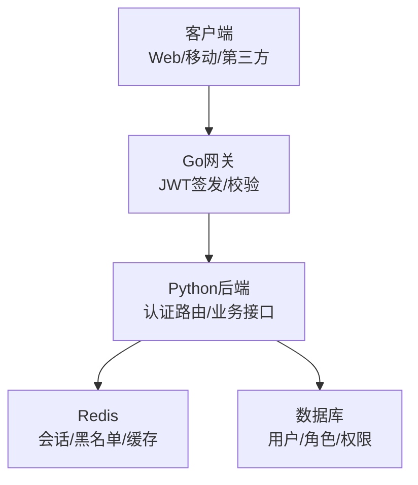
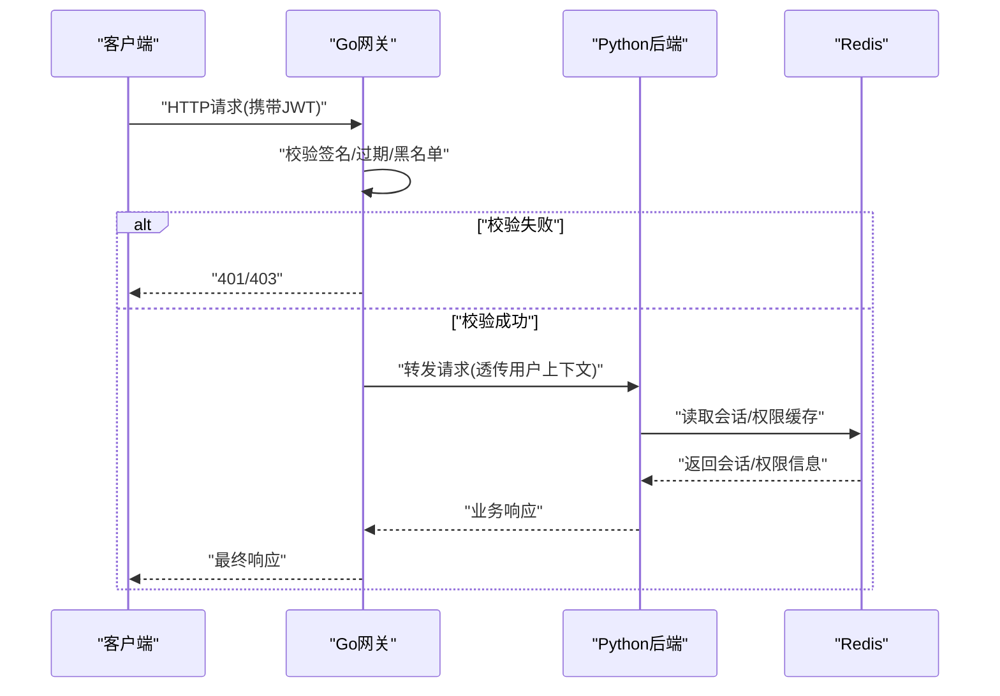
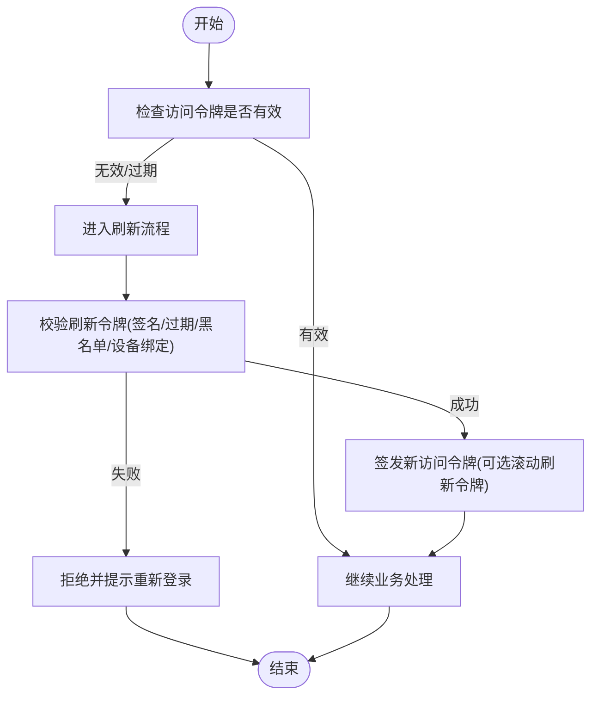
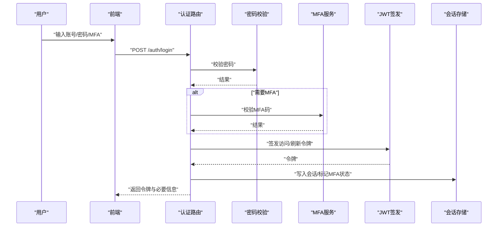
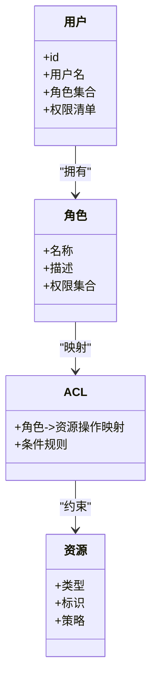
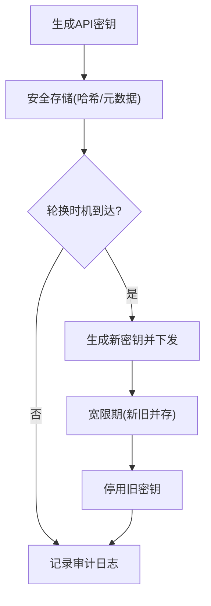
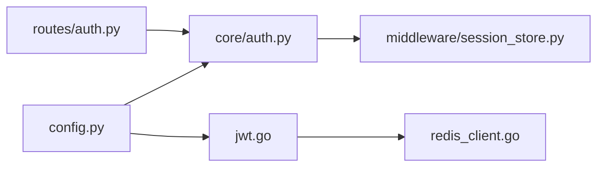

# API认证与授权

<cite>
**本文引用的文件**   
- [backend_design/nexus/api/routes/auth.py](file://backend_design/nexus/api/routes/auth.py)
- [backend_design/nexus/core/auth.py](file://backend_design/nexus/core/auth.py)
- [backend_design/nexus/middleware/session_store.py](file://backend_design/nexus/middleware/session_store.py)
- [backend_design/nexus_gate/internal/auth/jwt.go](file://backend_design/nexus_gate/internal/auth/jwt.go)
- [backend_design/nexus_gate/internal/handlers/redis_client.go](file://backend_design/nexus_gate/internal/handlers/redis_client.go)
- [backend_design/nexus/config.py](file://backend_design/nexus/config.py)
- [backend_design/nexus/models/schemas.py](file://backend_design/nexus/models/schemas.py)
</cite>

## 目录
1. [简介](#简介)
2. [项目结构](#项目结构)
3. [核心组件](#核心组件)
4. [架构总览](#架构总览)
5. [详细组件分析](#详细组件分析)
6. [依赖关系分析](#依赖关系分析)
7. [性能考虑](#性能考虑)
8. [故障排查指南](#故障排查指南)
9. [结论](#结论)
10. [附录](#附录)

## 简介
本文件面向API认证与授权机制，覆盖JWT令牌生成、验证与刷新流程，用户登录与密码校验、多因素认证支持、权限控制（角色与ACL）、API密钥管理（生成、轮换、审计），以及Web、移动端与第三方服务的集成示例。同时给出安全最佳实践与常见威胁防护建议（CSRF、XSS、暴力破解等）。

## 项目结构
本项目采用前后端分离与网关分层：
- Python后端服务提供认证路由与核心鉴权逻辑，使用Redis作为会话/黑名单存储。
- Go网关负责JWT签名与校验、请求转发与限流等。
- 前端通过状态管理维护登录态并携带令牌访问受保护资源。

[本节为概念性说明，不直接分析具体文件]

## 核心组件
- 认证路由层：暴露登录、登出、刷新、MFA等接口，协调会话与令牌生命周期。
- 核心鉴权模块：封装JWT创建、解析、校验、刷新策略及权限上下文注入。
- 网关JWT处理：在网关层完成无状态校验与快速拒绝非法请求。
- 会话存储：基于Redis的会话/黑名单/速率限制等共享状态。
- 配置与数据模型：集中化配置项与输入输出Schema定义。

章节来源
- [backend_design/nexus/api/routes/auth.py](file://backend_design/nexus/api/routes/auth.py)
- [backend_design/nexus/core/auth.py](file://backend_design/nexus/core/auth.py)
- [backend_design/nexus/middleware/session_store.py](file://backend_design/nexus/middleware/session_store.py)
- [backend_design/nexus_gate/internal/auth/jwt.go](file://backend_design/nexus_gate/internal/auth/jwt.go)
- [backend_design/nexus_gate/internal/handlers/redis_client.go](file://backend_design/nexus_gate/internal/handlers/redis_client.go)
- [backend_design/nexus/config.py](file://backend_design/nexus/config.py)
- [backend_design/nexus/models/schemas.py](file://backend_design/nexus/models/schemas.py)

## 架构总览
下图展示一次受保护API调用的端到端流程：客户端携带JWT访问网关，网关校验签名与过期后放行至后端；后端根据会话或权限上下文进行二次校验与业务处理。

图示来源
- [backend_design/nexus_gate/internal/auth/jwt.go](file://backend_design/nexus_gate/internal/auth/jwt.go)
- [backend_design/nexus/api/routes/auth.py](file://backend_design/nexus/api/routes/auth.py)
- [backend_design/nexus/middleware/session_store.py](file://backend_design/nexus/middleware/session_store.py)

章节来源
- [backend_design/nexus_gate/internal/auth/jwt.go](file://backend_design/nexus_gate/internal/auth/jwt.go)
- [backend_design/nexus/api/routes/auth.py](file://backend_design/nexus/api/routes/auth.py)
- [backend_design/nexus/middleware/session_store.py](file://backend_design/nexus/middleware/session_store.py)

## 详细组件分析

### JWT令牌体系（生成、验证、刷新）
- 令牌结构
  - 标准声明：子标识、签发者、受众、签发时间、过期时间等。
  - 自定义声明：租户ID、角色集合、权限清单、设备指纹等。
- 有效期管理
  - 短效访问令牌：用于频繁访问，降低泄露影响面。
  - 长效刷新令牌：用于续期，需配合黑名单与设备绑定。
- 安全存储
  - 访问令牌：浏览器建议使用HttpOnly+Secure Cookie或内存存储；移动端使用安全存储区。
  - 刷新令牌：服务端黑名单+短期有效，必要时绑定IP/UA。
- 刷新流程
  - 客户端提交刷新令牌，网关/后端校验有效性、是否被吊销、是否匹配原设备。
  - 成功后颁发新访问令牌，并可选择滚动刷新令牌。

图示来源
- [backend_design/nexus_gate/internal/auth/jwt.go](file://backend_design/nexus_gate/internal/auth/jwt.go)
- [backend_design/nexus/core/auth.py](file://backend_design/nexus/core/auth.py)
- [backend_design/nexus/middleware/session_store.py](file://backend_design/nexus/middleware/session_store.py)

章节来源
- [backend_design/nexus_gate/internal/auth/jwt.go](file://backend_design/nexus_gate/internal/auth/jwt.go)
- [backend_design/nexus/core/auth.py](file://backend_design/nexus/core/auth.py)
- [backend_design/nexus/middleware/session_store.py](file://backend_design/nexus/middleware/session_store.py)

### 用户认证流程（登录、密码校验、MFA）
- 登录接口
  - 输入：用户名/邮箱、密码、可选MFA验证码。
  - 输出：访问令牌、刷新令牌、必要用户信息。
- 密码校验
  - 服务端侧哈希比对，禁止明文存储与传输。
  - 支持加盐与强哈希算法，记录失败次数以触发锁定。
- 多因素认证（MFA）
  - 支持TOTP/短信/邮件验证码等。
  - MFA通过后发放令牌，并在会话中标记已启用MFA。

图示来源
- [backend_design/nexus/api/routes/auth.py](file://backend_design/nexus/api/routes/auth.py)
- [backend_design/nexus/core/auth.py](file://backend_design/nexus/core/auth.py)
- [backend_design/nexus/middleware/session_store.py](file://backend_design/nexus/middleware/session_store.py)

章节来源
- [backend_design/nexus/api/routes/auth.py](file://backend_design/nexus/api/routes/auth.py)
- [backend_design/nexus/core/auth.py](file://backend_design/nexus/core/auth.py)
- [backend_design/nexus/middleware/session_store.py](file://backend_design/nexus/middleware/session_store.py)

### 权限控制系统（角色、粒度、ACL）
- 角色定义
  - 内置角色：管理员、运营、普通用户等。
  - 动态角色：按租户/组织维度隔离。
- 权限粒度
  - 资源级：如车辆、健康、聊天会话等。
  - 操作级：读、写、删除、导出等。
- 访问控制列表（ACL）
  - 将角色映射到资源-操作集合，结合JWT中的角色/权限声明进行快速判定。
  - 支持细粒度条件（如仅允许本人资源）。

图示来源
- [backend_design/nexus/core/auth.py](file://backend_design/nexus/core/auth.py)
- [backend_design/nexus/models/schemas.py](file://backend_design/nexus/models/schemas.py)

章节来源
- [backend_design/nexus/core/auth.py](file://backend_design/nexus/core/auth.py)
- [backend_design/nexus/models/schemas.py](file://backend_design/nexus/models/schemas.py)

### API密钥管理（生成、轮换、审计）
- 密钥生成
  - 高熵随机字符串，前缀区分用途与环境。
  - 绑定租户/应用范围与最小权限集。
- 轮换策略
  - 支持并行新旧密钥共存窗口期。
  - 自动过期与强制下线通知。
- 审计日志
  - 记录密钥创建、更新、禁用、使用事件（脱敏）。
  - 关联调用方IP、User-Agent、资源访问路径。

[本节为通用设计说明，未直接引用具体实现文件]

### 客户端集成示例
- Web应用
  - 使用HttpOnly+Secure Cookie存储访问令牌，避免JS访问。
  - 跨域时开启SameSite与CORS白名单。
  - 刷新令牌走专用端点，失败则跳转登录页。
- 移动应用
  - 访问令牌存于内存或系统安全存储，避免持久化明文。
  - 后台保活时静默刷新，失败引导重新登录。
- 第三方服务
  - 使用API密钥或双向TLS进行服务间认证。
  - 严格限定密钥作用域与IP白名单。

[本节为通用集成指导，未直接引用具体实现文件]

## 依赖关系分析
- 网关JWT模块依赖Redis客户端用于黑名单与速率限制。
- 后端认证路由依赖核心鉴权模块与会话存储。
- 配置模块集中管理密钥、超时、限流等参数。

图示来源
- [backend_design/nexus_gate/internal/auth/jwt.go](file://backend_design/nexus_gate/internal/auth/jwt.go)
- [backend_design/nexus_gate/internal/handlers/redis_client.go](file://backend_design/nexus_gate/internal/handlers/redis_client.go)
- [backend_design/nexus/api/routes/auth.py](file://backend_design/nexus/api/routes/auth.py)
- [backend_design/nexus/core/auth.py](file://backend_design/nexus/core/auth.py)
- [backend_design/nexus/middleware/session_store.py](file://backend_design/nexus/middleware/session_store.py)
- [backend_design/nexus/config.py](file://backend_design/nexus/config.py)

章节来源
- [backend_design/nexus_gate/internal/auth/jwt.go](file://backend_design/nexus_gate/internal/auth/jwt.go)
- [backend_design/nexus_gate/internal/handlers/redis_client.go](file://backend_design/nexus_gate/internal/handlers/redis_client.go)
- [backend_design/nexus/api/routes/auth.py](file://backend_design/nexus/api/routes/auth.py)
- [backend_design/nexus/core/auth.py](file://backend_design/nexus/core/auth.py)
- [backend_design/nexus/middleware/session_store.py](file://backend_design/nexus/middleware/session_store.py)
- [backend_design/nexus/config.py](file://backend_design/nexus/config.py)

## 性能考虑
- 网关层无状态校验优先，减少后端压力。
- 使用Redis缓存会话与权限，设置合理TTL与淘汰策略。
- 批量刷新与令牌滚动可降低并发刷新风暴风险。
- 对敏感接口增加短时重试退避与熔断保护。

[本节为通用性能建议，未直接引用具体实现文件]

## 故障排查指南
- 常见问题
  - 401未认证：检查JWT签名、过期时间与黑名单命中。
  - 403无权限：核对角色与ACL映射、资源条件。
  - 刷新失败：确认刷新令牌未被吊销、设备/IP变更。
- 定位步骤
  - 查看网关日志中的JWT校验结果与错误码。
  - 检查Redis中会话/黑名单键是否存在且未过期。
  - 核对后端鉴权上下文是否正确注入。

章节来源
- [backend_design/nexus_gate/internal/auth/jwt.go](file://backend_design/nexus_gate/internal/auth/jwt.go)
- [backend_design/nexus/middleware/session_store.py](file://backend_design/nexus/middleware/session_store.py)

## 结论
本方案通过网关无状态JWT校验与后端精细化权限控制相结合，实现了可扩展、可审计的认证与授权体系。配合合理的令牌生命周期、会话管理与安全存储，可有效抵御常见攻击面。建议在上线前完成渗透测试与合规审查，持续监控异常行为并完善告警策略。

[本节为总结性内容，未直接引用具体实现文件]

## 附录

### 安全最佳实践
- 令牌泄露防护
  - 访问令牌短时效、刷新令牌黑名单与设备绑定。
  - 浏览器端使用HttpOnly+Secure Cookie，移动端使用安全存储。
- 会话管理
  - 统一会话中心（Redis），支持主动失效与滚动刷新。
- 防重放攻击
  - 请求签名、时间戳与Nonce校验，服务端去重窗口。
- 常见威胁与防护
  - CSRF：同源策略、SameSite Cookie、双重提交Cookie。
  - XSS：输入输出编码、CSP策略、避免内联脚本。
  - 暴力破解：账户锁定、验证码、速率限制与IP封禁。

[本节为通用安全建议，未直接引用具体实现文件]