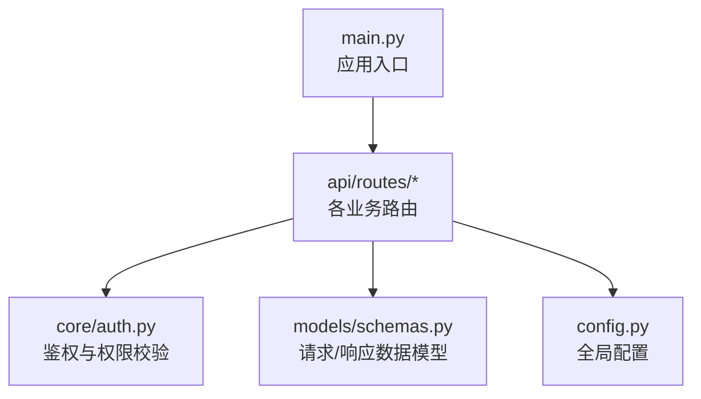
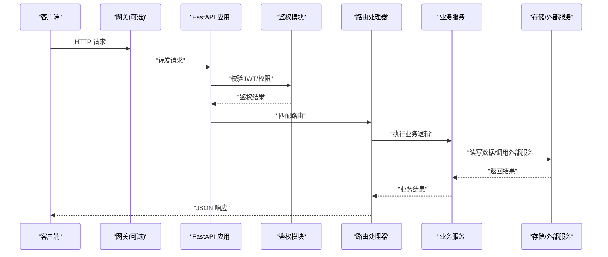
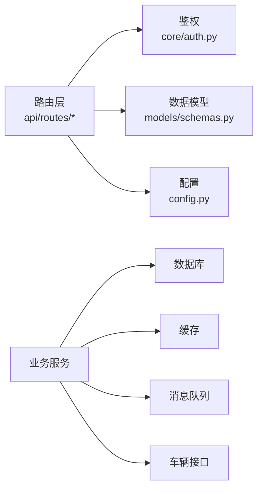

# RESTful API接口

<cite>
**本文引用的文件**   
- [backend_design/nexus/main.py](file://backend_design/nexus/main.py)
- [backend_design/nexus/api/routes/auth.py](file://backend_design/nexus/api/routes/auth.py)
- [backend_design/nexus/api/routes/chat.py](file://backend_design/nexus/api/routes/chat.py)
- [backend_design/nexus/api/routes/chat_sessions.py](file://backend_design/nexus/api/routes/chat_sessions.py)
- [backend_design/nexus/api/routes/cockpit.py](file://backend_design/nexus/api/routes/cockpit.py)
- [backend_design/nexus/api/routes/dataplatform.py](file://backend_design/nexus/api/routes/dataplatform.py)
- [backend_design/nexus/api/routes/health.py](file://backend_design/nexus/api/routes/health.py)
- [backend_design/nexus/api/routes/middleware_status.py](file://backend_design/nexus/api/routes/middleware_status.py)
- [backend_design/nexus/api/routes/settings.py](file://backend_design/nexus/api/routes/settings.py)
- [backend_design/nexus/api/routes/vehicle.py](file://backend_design/nexus/api/routes/vehicle.py)
- [backend_design/nexus/api/routes/admin.py](file://backend_design/nexus/api/routes/admin.py)
- [backend_design/nexus/api/routes/asr.py](file://backend_design/nexus/api/routes/asr.py)
- [backend_design/nexus/core/auth.py](file://backend_design/nexus/core/auth.py)
- [backend_design/nexus/models/schemas.py](file://backend_design/nexus/models/schemas.py)
- [backend_design/nexus/config.py](file://backend_design/nexus/config.py)
</cite>

## 目录
1. [简介](#简介)
2. [项目结构](#项目结构)
3. [核心组件](#核心组件)
4. [架构总览](#架构总览)
5. [详细组件分析](#详细组件分析)
6. [依赖分析](#依赖分析)
7. [性能考虑](#性能考虑)
8. [故障排查指南](#故障排查指南)
9. [结论](#结论)
10. [附录](#附录)

## 简介
本文件为 NexusCockpit 后端服务的 RESTful API 接口文档。内容覆盖所有 HTTP 端点（GET、POST、PUT、DELETE）的 URL 模式、请求参数、响应格式与状态码；说明每个接口的功能描述、参数验证规则和数据模型定义；提供成功与错误场景的请求/响应示例；解释数据序列化格式（JSON Schema）与字段含义；并包含 API 版本控制策略、向后兼容性说明，以及批量操作、分页查询和过滤参数的使用方法。

## 项目结构
后端采用 FastAPI 框架，路由按领域划分在 api/routes 下，核心认证、配置与数据模型分别位于 core、config 与 models 目录。入口 main.py 负责挂载路由与中间件。

图表来源
- [backend_design/nexus/main.py](file://backend_design/nexus/main.py)
- [backend_design/nexus/core/auth.py](file://backend_design/nexus/core/auth.py)
- [backend_design/nexus/models/schemas.py](file://backend_design/nexus/models/schemas.py)
- [backend_design/nexus/config.py](file://backend_design/nexus/config.py)

章节来源
- [backend_design/nexus/main.py](file://backend_design/nexus/main.py)
- [backend_design/nexus/api/routes/auth.py](file://backend_design/nexus/api/routes/auth.py)
- [backend_design/nexus/api/routes/chat.py](file://backend_design/nexus/api/routes/chat.py)
- [backend_design/nexus/api/routes/chat_sessions.py](file://backend_design/nexus/api/routes/chat_sessions.py)
- [backend_design/nexus/api/routes/cockpit.py](file://backend_design/nexus/api/routes/cockpit.py)
- [backend_design/nexus/api/routes/dataplatform.py](file://backend_design/nexus/api/routes/dataplatform.py)
- [backend_design/nexus/api/routes/health.py](file://backend_design/nexus/api/routes/health.py)
- [backend_design/nexus/api/routes/middleware_status.py](file://backend_design/nexus/api/routes/middleware_status.py)
- [backend_design/nexus/api/routes/settings.py](file://backend_design/nexus/api/routes/settings.py)
- [backend_design/nexus/api/routes/vehicle.py](file://backend_design/nexus/api/routes/vehicle.py)
- [backend_design/nexus/api/routes/admin.py](file://backend_design/nexus/api/routes/admin.py)
- [backend_design/nexus/api/routes/asr.py](file://backend_design/nexus/api/routes/asr.py)
- [backend_design/nexus/core/auth.py](file://backend_design/nexus/core/auth.py)
- [backend_design/nexus/models/schemas.py](file://backend_design/nexus/models/schemas.py)
- [backend_design/nexus/config.py](file://backend_design/nexus/config.py)

## 核心组件
- 认证与授权：基于 JWT 的无状态鉴权，支持登录获取令牌、刷新令牌、注销与会话管理。
- 聊天与会话：会话创建、消息发送、历史查询、流式响应等。
- 座舱与车辆：车辆状态、设备控制、技能执行。
- 数据平台：数据集、任务、指标等数据服务。
- 健康与中间件：健康检查、限流、缓存、队列等中间件状态。
- 设置与管理：系统设置、管理员操作。
- ASR：语音识别相关接口。

章节来源
- [backend_design/nexus/core/auth.py](file://backend_design/nexus/core/auth.py)
- [backend_design/nexus/models/schemas.py](file://backend_design/nexus/models/schemas.py)
- [backend_design/nexus/config.py](file://backend_design/nexus/config.py)

## 架构总览
下图展示了客户端到后端的典型调用路径，包括鉴权、路由分发、业务处理与响应返回。

图表来源
- [backend_design/nexus/main.py](file://backend_design/nexus/main.py)
- [backend_design/nexus/core/auth.py](file://backend_design/nexus/core/auth.py)
- [backend_design/nexus/api/routes/auth.py](file://backend_design/nexus/api/routes/auth.py)
- [backend_design/nexus/api/routes/chat.py](file://backend_design/nexus/api/routes/chat.py)
- [backend_design/nexus/api/routes/cockpit.py](file://backend_design/nexus/api/routes/cockpit.py)
- [backend_design/nexus/api/routes/vehicle.py](file://backend_design/nexus/api/routes/vehicle.py)
- [backend_design/nexus/api/routes/dataplatform.py](file://backend_design/nexus/api/routes/dataplatform.py)
- [backend_design/nexus/api/routes/health.py](file://backend_design/nexus/api/routes/health.py)
- [backend_design/nexus/api/routes/middleware_status.py](file://backend_design/nexus/api/routes/middleware_status.py)
- [backend_design/nexus/api/routes/settings.py](file://backend_design/nexus/api/routes/settings.py)
- [backend_design/nexus/api/routes/admin.py](file://backend_design/nexus/api/routes/admin.py)
- [backend_design/nexus/api/routes/asr.py](file://backend_design/nexus/api/routes/asr.py)

## 详细组件分析

### 通用约定
- 基础路径：/api/v1
- 认证方式：Bearer Token（Authorization: Bearer <token>）
- 内容类型：application/json（除非特别说明）
- 统一响应体：{ "code": 数字, "message": "字符串", "data": 任意 }
- 错误码：
  - 200：成功
  - 400：请求参数错误
  - 401：未认证或令牌无效
  - 403：权限不足
  - 404：资源不存在
  - 422：请求体验证失败
  - 429：频率限制
  - 500：服务器内部错误

章节来源
- [backend_design/nexus/main.py](file://backend_design/nexus/main.py)
- [backend_design/nexus/core/auth.py](file://backend_design/nexus/core/auth.py)
- [backend_design/nexus/models/schemas.py](file://backend_design/nexus/models/schemas.py)

### 认证与用户（auth）
- POST /api/v1/auth/login
  - 功能：用户登录，返回访问令牌与过期时间
  - 请求体：用户名、密码
  - 响应：访问令牌、刷新令牌、过期时间
  - 状态码：200、401、422
- POST /api/v1/auth/refresh
  - 功能：使用刷新令牌换取新的访问令牌
  - 请求体：刷新令牌
  - 响应：新访问令牌与过期时间
  - 状态码：200、401、422
- POST /api/v1/auth/logout
  - 功能：注销当前会话（服务端记录失效）
  - 请求头：Authorization
  - 响应：成功信息
  - 状态码：200、401
- GET /api/v1/auth/me
  - 功能：获取当前用户信息
  - 请求头：Authorization
  - 响应：用户基本信息
  - 状态码：200、401

请求示例（登录）
- 请求
  - 方法：POST
  - 路径：/api/v1/auth/login
  - 头部：Content-Type: application/json
  - 主体：{"username":"string","password":"string"}
- 响应
  - 状态码：200
  - 主体：{"code":200,"message":"ok","data":{"access_token":"string","refresh_token":"string","expires_in":number}}

错误示例（401）
- 响应
  - 状态码：401
  - 主体：{"code":401,"message":"认证失败","data":null}

章节来源
- [backend_design/nexus/api/routes/auth.py](file://backend_design/nexus/api/routes/auth.py)
- [backend_design/nexus/core/auth.py](file://backend_design/nexus/core/auth.py)

### 聊天与会话（chat、chat_sessions）
- POST /api/v1/chat/sessions
  - 功能：创建聊天会话
  - 请求体：标题、上下文参数
  - 响应：会话ID、创建时间
  - 状态码：201、422
- GET /api/v1/chat/sessions/{session_id}
  - 功能：获取会话详情
  - 路径参数：session_id
  - 响应：会话信息与元数据
  - 状态码：200、404
- PUT /api/v1/chat/sessions/{session_id}
  - 功能：更新会话元数据
  - 路径参数：session_id
  - 请求体：要更新的字段
  - 响应：更新后的会话信息
  - 状态码：200、404、422
- DELETE /api/v1/chat/sessions/{session_id}
  - 功能：删除会话
  - 路径参数：session_id
  - 响应：删除确认
  - 状态码：204、404
- GET /api/v1/chat/sessions
  - 功能：分页查询会话列表
  - 查询参数：page、page_size、keyword、created_at_from、created_at_to
  - 响应：会话列表与分页信息
  - 状态码：200
- POST /api/v1/chat/messages
  - 功能：向指定会话发送消息
  - 请求体：session_id、content、metadata
  - 响应：消息ID、发送时间
  - 状态码：201、400、422
- GET /api/v1/chat/messages?session_id={id}&page={p}&page_size={s}
  - 功能：分页查询会话消息
  - 查询参数：session_id、page、page_size、sort_by、order
  - 响应：消息列表与分页信息
  - 状态码：200
- POST /api/v1/chat/stream
  - 功能：流式对话（SSE/WS 由上层封装）
  - 请求体：session_id、content
  - 响应：事件流
  - 状态码：200

分页与过滤
- page：页码，默认1
- page_size：每页数量，默认20，最大100
- keyword：模糊搜索关键字
- created_at_from/to：时间范围过滤
- sort_by/order：排序字段与方向（asc/desc）

章节来源
- [backend_design/nexus/api/routes/chat_sessions.py](file://backend_design/nexus/api/routes/chat_sessions.py)
- [backend_design/nexus/api/routes/chat.py](file://backend_design/nexus/api/routes/chat.py)

### 座舱与车辆（cockpit、vehicle）
- GET /api/v1/cockpit/status
  - 功能：获取座舱运行状态
  - 响应：状态摘要
  - 状态码：200
- GET /api/v1/cockpit/history
  - 功能：分页查询座舱历史事件
  - 查询参数：page、page_size、type、from、to
  - 响应：事件列表与分页信息
  - 状态码：200
- GET /api/v1/vehicle/status
  - 功能：获取车辆状态
  - 响应：车辆状态对象
  - 状态码：200、500
- PUT /api/v1/vehicle/control
  - 功能：执行车辆控制指令（如空调、车窗、座椅）
  - 请求体：device、action、params
  - 响应：执行结果
  - 状态码：200、400、403、500
- GET /api/v1/vehicle/history
  - 功能：分页查询车辆历史事件
  - 查询参数：page、page_size、event_type、from、to
  - 响应：事件列表与分页信息
  - 状态码：200

章节来源
- [backend_design/nexus/api/routes/cockpit.py](file://backend_design/nexus/api/routes/cockpit.py)
- [backend_design/nexus/api/routes/vehicle.py](file://backend_design/nexus/api/routes/vehicle.py)

### 数据平台（dataplatform）
- GET /api/v1/dataplatform/datasets
  - 功能：分页查询数据集列表
  - 查询参数：page、page_size、keyword、status
  - 响应：数据集列表与分页信息
  - 状态码：200
- POST /api/v1/dataplatform/datasets
  - 功能：创建数据集
  - 请求体：名称、描述、标签、存储位置
  - 响应：数据集ID与元数据
  - 状态码：201、422
- GET /api/v1/dataplatform/datasets/{dataset_id}
  - 功能：获取数据集详情
  - 路径参数：dataset_id
  - 响应：数据集详情
  - 状态码：200、404
- PUT /api/v1/dataplatform/datasets/{dataset_id}
  - 功能：更新数据集元数据
  - 路径参数：dataset_id
  - 请求体：可更新字段
  - 响应：更新后的数据集
  - 状态码：200、404、422
- DELETE /api/v1/dataplatform/datasets/{dataset_id}
  - 功能：删除数据集
  - 路径参数：dataset_id
  - 响应：删除确认
  - 状态码：204、404
- POST /api/v1/dataplatform/tasks
  - 功能：提交数据处理任务
  - 请求体：任务类型、输入、参数
  - 响应：任务ID与状态
  - 状态码：201、422
- GET /api/v1/dataplatform/tasks/{task_id}
  - 功能：查询任务状态
  - 路径参数：task_id
  - 响应：任务状态与进度
  - 状态码：200、404
- GET /api/v1/dataplatform/metrics
  - 功能：获取平台指标
  - 查询参数：from、to、aggregation
  - 响应：指标数据
  - 状态码：200

章节来源
- [backend_design/nexus/api/routes/dataplatform.py](file://backend_design/nexus/api/routes/dataplatform.py)

### 健康与中间件（health、middleware_status）
- GET /api/v1/health
  - 功能：健康检查
  - 响应：服务状态与依赖项
  - 状态码：200
- GET /api/v1/middleware/status
  - 功能：查询中间件状态（限流、缓存、队列）
  - 响应：各中间件状态与统计
  - 状态码：200

章节来源
- [backend_design/nexus/api/routes/health.py](file://backend_design/nexus/api/routes/health.py)
- [backend_design/nexus/api/routes/middleware_status.py](file://backend_design/nexus/api/routes/middleware_status.py)

### 设置与管理（settings、admin）
- GET /api/v1/settings
  - 功能：获取系统设置
  - 响应：设置键值对
  - 状态码：200
- PUT /api/v1/settings
  - 功能：更新系统设置
  - 请求体：待更新设置
  - 响应：更新后的设置
  - 状态码：200、422
- GET /api/v1/admin/users
  - 功能：分页查询用户列表（管理员）
  - 查询参数：page、page_size、role、status
  - 响应：用户列表与分页信息
  - 状态码：200、403
- PUT /api/v1/admin/users/{user_id}/role
  - 功能：修改用户角色（管理员）
  - 路径参数：user_id
  - 请求体：新角色
  - 响应：更新后的用户
  - 状态码：200、403、404、422
- DELETE /api/v1/admin/users/{user_id}
  - 功能：删除用户（管理员）
  - 路径参数：user_id
  - 响应：删除确认
  - 状态码：204、403、404

章节来源
- [backend_design/nexus/api/routes/settings.py](file://backend_design/nexus/api/routes/settings.py)
- [backend_design/nexus/api/routes/admin.py](file://backend_design/nexus/api/routes/admin.py)

### 语音识别（asr）
- POST /api/v1/asr/transcribe
  - 功能：上传音频进行转写
  - 请求体：音频数据（base64或multipart）、语言、采样率
  - 响应：转写文本与时间戳
  - 状态码：200、400、422
- GET /api/v1/asr/jobs/{job_id}
  - 功能：查询异步转写任务状态
  - 路径参数：job_id
  - 响应：任务状态与结果
  - 状态码：200、404

章节来源
- [backend_design/nexus/api/routes/asr.py](file://backend_design/nexus/api/routes/asr.py)

## 依赖分析
- 路由层依赖认证中间件与数据模型校验器。
- 业务服务可能依赖数据库、缓存、消息队列与外部设备接口。
- 配置通过 config.py 注入，便于多环境部署。

图表来源
- [backend_design/nexus/main.py](file://backend_design/nexus/main.py)
- [backend_design/nexus/core/auth.py](file://backend_design/nexus/core/auth.py)
- [backend_design/nexus/models/schemas.py](file://backend_design/nexus/models/schemas.py)
- [backend_design/nexus/config.py](file://backend_design/nexus/config.py)

章节来源
- [backend_design/nexus/main.py](file://backend_design/nexus/main.py)
- [backend_design/nexus/core/auth.py](file://backend_design/nexus/core/auth.py)
- [backend_design/nexus/models/schemas.py](file://backend_design/nexus/models/schemas.py)
- [backend_design/nexus/config.py](file://backend_design/nexus/config.py)

## 性能考虑
- 分页与过滤：对所有列表接口强制分页，避免一次性返回大量数据。
- 缓存：热点数据（如系统设置、车辆状态）可使用缓存层降低数据库压力。
- 限流：对高频接口（如聊天消息、ASR转写）实施速率限制。
- 异步：耗时任务（如数据处理、转写）采用异步任务队列，返回任务ID供轮询。
- 连接池：数据库与外部服务连接复用，减少握手开销。

[本节为通用指导，不直接分析具体文件]

## 故障排查指南
- 401 未认证：检查 Authorization 头是否携带有效 Bearer Token；确认令牌未过期且未被吊销。
- 403 权限不足：确认当前用户具备所需角色或权限；管理员接口需管理员角色。
- 422 请求体验证失败：检查必填字段、类型与约束；参考数据模型定义。
- 429 频率限制：降低请求频率或申请更高配额；查看中间件状态接口了解限流阈值。
- 500 服务器错误：查看日志与监控；关注依赖服务健康状态。

章节来源
- [backend_design/nexus/api/routes/health.py](file://backend_design/nexus/api/routes/health.py)
- [backend_design/nexus/api/routes/middleware_status.py](file://backend_design/nexus/api/routes/middleware_status.py)
- [backend_design/nexus/core/auth.py](file://backend_design/nexus/core/auth.py)

## 结论
本文档提供了 NexusCockpit 后端 RESTful API 的完整规范，涵盖认证、聊天与会话、座舱与车辆、数据平台、健康与中间件、设置与管理、语音识别等模块。建议客户端遵循统一的响应结构与错误码，合理使用分页与过滤，结合鉴权与限流保障稳定性与安全性。

[本节为总结性内容，不直接分析具体文件]

## 附录

### 数据模型（JSON Schema 要点）
- 用户
  - username：字符串，必填
  - password：字符串，必填（仅登录时）
  - role：枚举，admin/user
  - status：枚举，active/inactive
- 会话
  - session_id：字符串，唯一标识
  - title：字符串
  - metadata：对象，扩展字段
  - created_at：时间戳
- 消息
  - message_id：字符串，唯一标识
  - session_id：字符串，外键
  - content：字符串
  - metadata：对象
  - created_at：时间戳
- 数据集
  - dataset_id：字符串，唯一标识
  - name：字符串
  - description：字符串
  - tags：字符串数组
  - storage：字符串
  - status：枚举，pending/ready/error
- 任务
  - task_id：字符串，唯一标识
  - type：枚举，transform/export/import
  - input：对象
  - params：对象
  - status：枚举，queued/running/completed/failed
  - progress：浮点数 0~1
- 车辆控制
  - device：枚举，climate/window/seat/media
  - action：字符串，如 on/off/set
  - params：对象，设备特定参数

章节来源
- [backend_design/nexus/models/schemas.py](file://backend_design/nexus/models/schemas.py)

### 版本控制与向后兼容
- 版本前缀：/api/v1
- 变更策略：
  - 新增字段：保持向后兼容，客户端忽略未知字段
  - 废弃字段：保留一段时间并提供迁移提示
  - 破坏性变更：升级版本号（如 /api/v2），旧版本继续维护一定周期
- 兼容性建议：
  - 客户端实现健壮解析，容忍额外字段
  - 服务端提供弃用警告头或响应字段

章节来源
- [backend_design/nexus/main.py](file://backend_design/nexus/main.py)
- [backend_design/nexus/config.py](file://backend_design/nexus/config.py)

### 批量操作与分页
- 批量创建：部分接口支持批量提交（如 datasets、tasks），请求体为数组
- 分页参数：
  - page：页码，默认1
  - page_size：每页数量，默认20，最大100
- 过滤参数：
  - keyword：模糊匹配
  - status/type/event_type：精确匹配
  - from/to：时间范围
- 排序参数：
  - sort_by：字段名
  - order：asc/desc

章节来源
- [backend_design/nexus/api/routes/chat_sessions.py](file://backend_design/nexus/api/routes/chat_sessions.py)
- [backend_design/nexus/api/routes/chat.py](file://backend_design/nexus/api/routes/chat.py)
- [backend_design/nexus/api/routes/cockpit.py](file://backend_design/nexus/api/routes/cockpit.py)
- [backend_design/nexus/api/routes/vehicle.py](file://backend_design/nexus/api/routes/vehicle.py)
- [backend_design/nexus/api/routes/dataplatform.py](file://backend_design/nexus/api/routes/dataplatform.py)
- [backend_design/nexus/api/routes/admin.py](file://backend_design/nexus/api/routes/admin.py)