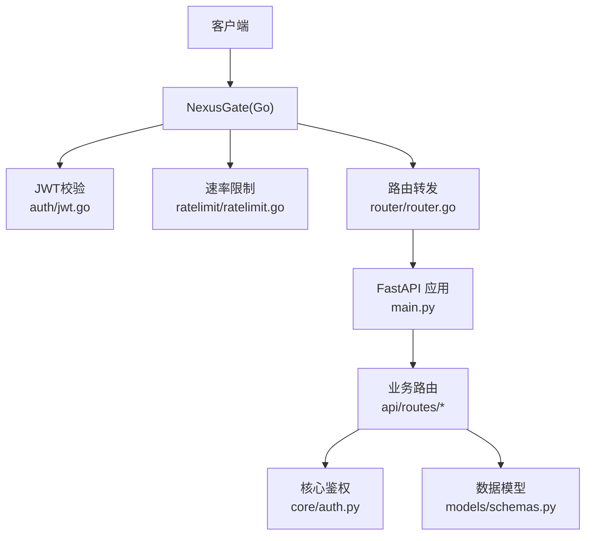
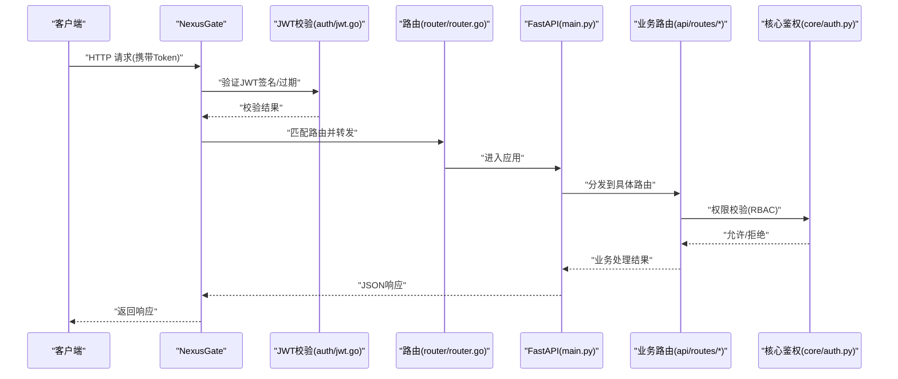
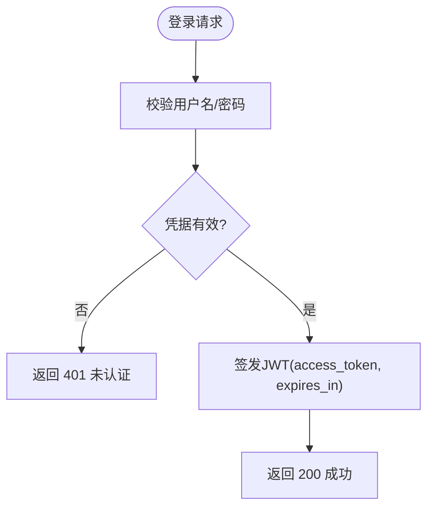
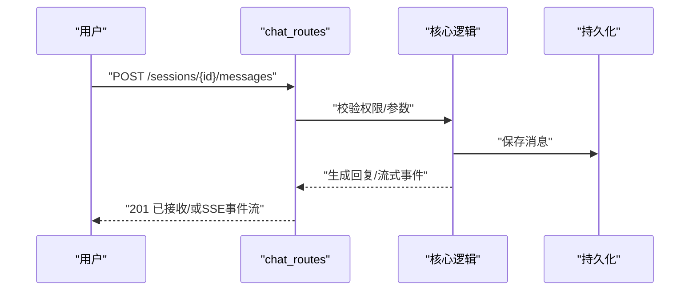
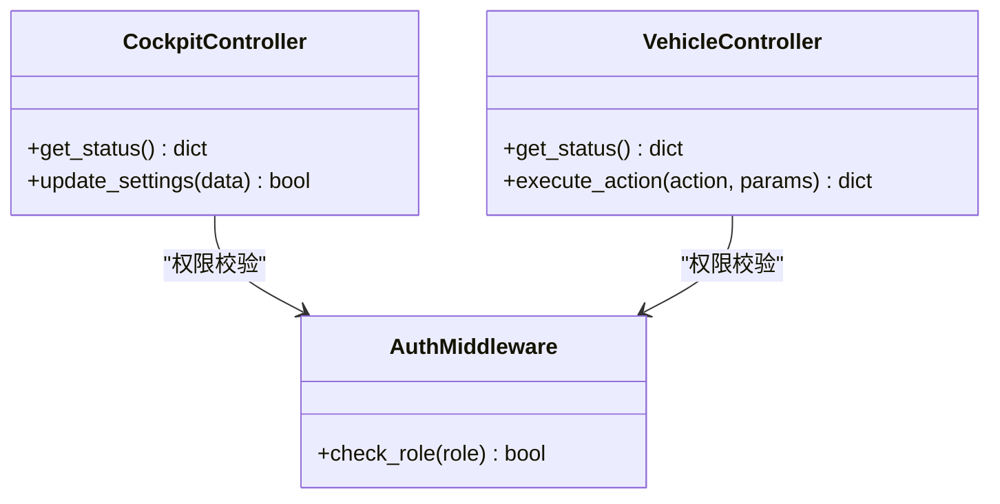
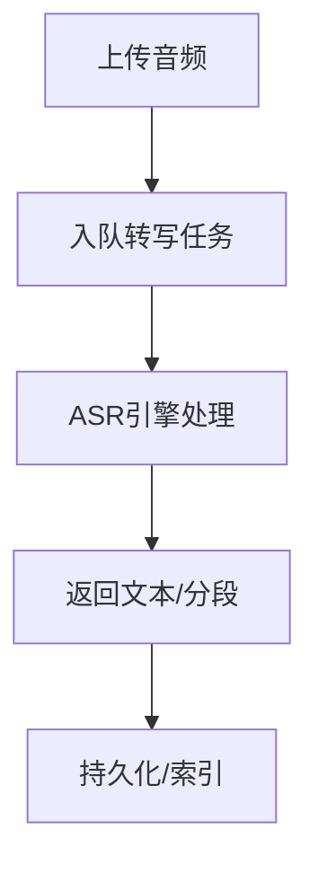
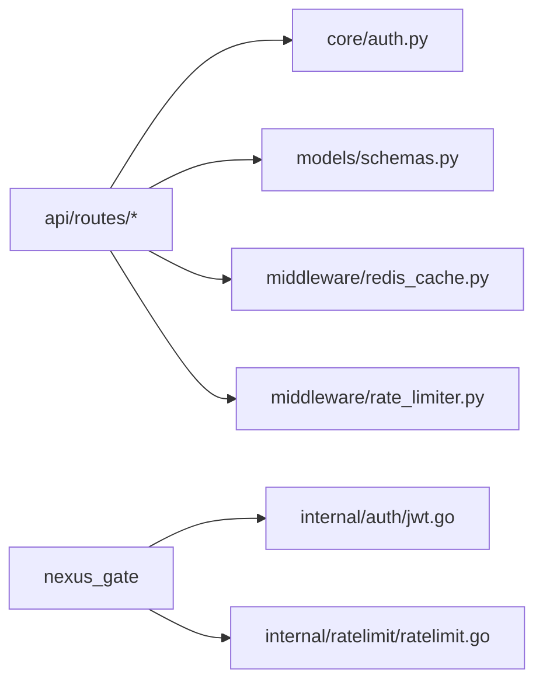

# RESTful API接口

<cite>
**本文引用的文件**   
- [backend_design/nexus/main.py](file://backend_design/nexus/main.py)
- [backend_design/nexus/api/routes/auth.py](file://backend_design/nexus/api/routes/auth.py)
- [backend_design/nexus/api/routes/chat.py](file://backend_design/nexus/api/routes/chat.py)
- [backend_design/nexus/api/routes/chat_sessions.py](file://backend_design/nexus/api/routes/chat_sessions.py)
- [backend_design/nexus/api/routes/cockpit.py](file://backend_design/nexus/api/routes/cockpit.py)
- [backend_design/nexus/api/routes/admin.py](file://backend_design/nexus/api/routes/admin.py)
- [backend_design/nexus/api/routes/settings.py](file://backend_design/nexus/api/routes/settings.py)
- [backend_design/nexus/api/routes/health.py](file://backend_design/nexus/api/routes/health.py)
- [backend_design/nexus/api/routes/middleware_status.py](file://backend_design/nexus/api/routes/middleware_status.py)
- [backend_design/nexus/api/routes/dataplatform.py](file://backend_design/nexus/api/routes/dataplatform.py)
- [backend_design/nexus/api/routes/asr.py](file://backend_design/nexus/api/routes/asr.py)
- [backend_design/nexus/api/routes/vehicle.py](file://backend_design/nexus/api/routes/vehicle.py)
- [backend_design/nexus/core/auth.py](file://backend_design/nexus/core/auth.py)
- [backend_design/nexus/core/exceptions.py](file://backend_design/nexus/core/exceptions.py)
- [backend_design/nexus/core/logger.py](file://backend_design/nexus/core/logger.py)
- [backend_design/nexus/config.py](file://backend_design/nexus/config.py)
- [backend_design/nexus/middleware/rate_limiter.py](file://backend_design/nexus/middleware/rate_limiter.py)
- [backend_design/nexus/middleware/redis_cache.py](file://backend_design/nexus/middleware/redis_cache.py)
- [backend_design/nexus/models/schemas.py](file://backend_design/nexus/models/schemas.py)
- [backend_design/nexus_gate/internal/handlers/handlers.go](file://backend_design/nexus_gate/internal/handlers/handlers.go)
- [backend_design/nexus_gate/internal/router/router.go](file://backend_design/nexus_gate/internal/router/router.go)
- [backend_design/nexus_gate/internal/auth/jwt.go](file://backend_design/nexus_gate/internal/auth/jwt.go)
- [backend_design/nexus_gate/internal/ratelimit/ratelimit.go](file://backend_design/nexus_gate/internal/ratelimit/ratelimit.go)
</cite>

## 目录
1. [简介](#简介)
2. [项目结构](#项目结构)
3. [核心组件](#核心组件)
4. [架构总览](#架构总览)
5. [详细组件分析](#详细组件分析)
6. [依赖关系分析](#依赖关系分析)
7. [性能与扩展性](#性能与扩展性)
8. [故障排查指南](#故障排查指南)
9. [结论](#结论)
10. [附录](#附录)

## 简介
本文件为 NexusCockpit 系统的 RESTful API 接口文档，覆盖认证、聊天会话、座舱控制、车辆能力、数据平台、ASR/TTS、健康检查、中间件状态、设置与管理员等模块。文档包含：
- HTTP 端点清单（GET/POST/PUT/DELETE）
- 请求参数、响应格式与状态码
- JWT 认证机制与权限控制
- 错误处理与调试信息
- 版本管理与兼容性策略
- 速率限制、缓存与安全最佳实践
- Postman/Swagger 集成建议

## 项目结构
后端采用 FastAPI 路由模块化组织，网关使用 Go 实现鉴权与限流。关键入口与路由如下：
- 应用入口与全局配置：[backend_design/nexus/main.py](file://backend_design/nexus/main.py)、[backend_design/nexus/config.py](file://backend_design/nexus/config.py)
- 认证与鉴权：[backend_design/nexus/core/auth.py](file://backend_design/nexus/core/auth.py)
- 业务路由：
  - 认证：[backend_design/nexus/api/routes/auth.py](file://backend_design/nexus/api/routes/auth.py)
  - 聊天与会话：[backend_design/nexus/api/routes/chat.py](file://backend_design/nexus/api/routes/chat.py)、[backend_design/nexus/api/routes/chat_sessions.py](file://backend_design/nexus/api/routes/chat_sessions.py)
  - 座舱与车辆：[backend_design/nexus/api/routes/cockpit.py](file://backend_design/nexus/api/routes/cockpit.py)、[backend_design/nexus/api/routes/vehicle.py](file://backend_design/nexus/api/routes/vehicle.py)
  - 数据平台与 ASR：[backend_design/nexus/api/routes/dataplatform.py](file://backend_design/nexus/api/routes/dataplatform.py)、[backend_design/nexus/api/routes/asr.py](file://backend_design/nexus/api/routes/asr.py)
  - 健康与中间件状态：[backend_design/nexus/api/routes/health.py](file://backend_design/nexus/api/routes/health.py)、[backend_design/nexus/api/routes/middleware_status.py](file://backend_design/nexus/api/routes/middleware_status.py)
  - 设置与管理员：[backend_design/nexus/api/routes/settings.py](file://backend_design/nexus/api/routes/settings.py)、[backend_design/nexus/api/routes/admin.py](file://backend_design/nexus/api/routes/admin.py)
- 网关鉴权与限流：
  - 路由与处理器：[backend_design/nexus_gate/internal/router/router.go](file://backend_design/nexus_gate/internal/router/router.go)、[backend_design/nexus_gate/internal/handlers/handlers.go](file://backend_design/nexus_gate/internal/handlers/handlers.go)
  - JWT 校验：[backend_design/nexus_gate/internal/auth/jwt.go](file://backend_design/nexus_gate/internal/auth/jwt.go)
  - 限流：[backend_design/nexus_gate/internal/ratelimit/ratelimit.go](file://backend_design/nexus_gate/internal/ratelimit/ratelimit.go)

图示来源
- [backend_design/nexus/main.py](file://backend_design/nexus/main.py)
- [backend_design/nexus_gate/internal/router/router.go](file://backend_design/nexus_gate/internal/router/router.go)
- [backend_design/nexus_gate/internal/auth/jwt.go](file://backend_design/nexus_gate/internal/auth/jwt.go)
- [backend_design/nexus_gate/internal/ratelimit/ratelimit.go](file://backend_design/nexus_gate/internal/ratelimit/ratelimit.go)
- [backend_design/nexus/core/auth.py](file://backend_design/nexus/core/auth.py)
- [backend_design/nexus/models/schemas.py](file://backend_design/nexus/models/schemas.py)

章节来源
- [backend_design/nexus/main.py](file://backend_design/nexus/main.py)
- [backend_design/nexus/config.py](file://backend_design/nexus/config.py)

## 核心组件
- 认证与授权
  - 登录获取令牌、刷新令牌、注销
  - 基于角色的访问控制（RBAC），在路由层或中间件进行权限校验
- 聊天与会话
  - 创建/查询/删除会话
  - 发送消息、接收流式响应（SSE/WebSocket）
- 座舱与车辆
  - 读取/设置座舱状态
  - 调用车辆能力（导航、媒体、空调、车窗、座椅等）
- 数据平台与 ASR
  - 上传音频、转写文本、检索知识库
- 健康与中间件状态
  - 服务健康检查、Redis/队列/缓存状态
- 设置与管理员
  - 系统设置、用户管理、审计日志

章节来源
- [backend_design/nexus/api/routes/auth.py](file://backend_design/nexus/api/routes/auth.py)
- [backend_design/nexus/api/routes/chat.py](file://backend_design/nexus/api/routes/chat.py)
- [backend_design/nexus/api/routes/chat_sessions.py](file://backend_design/nexus/api/routes/chat_sessions.py)
- [backend_design/nexus/api/routes/cockpit.py](file://backend_design/nexus/api/routes/cockpit.py)
- [backend_design/nexus/api/routes/vehicle.py](file://backend_design/nexus/api/routes/vehicle.py)
- [backend_design/nexus/api/routes/dataplatform.py](file://backend_design/nexus/api/routes/dataplatform.py)
- [backend_design/nexus/api/routes/asr.py](file://backend_design/nexus/api/routes/asr.py)
- [backend_design/nexus/api/routes/health.py](file://backend_design/nexus/api/routes/health.py)
- [backend_design/nexus/api/routes/middleware_status.py](file://backend_design/nexus/api/routes/middleware_status.py)
- [backend_design/nexus/api/routes/settings.py](file://backend_design/nexus/api/routes/settings.py)
- [backend_design/nexus/api/routes/admin.py](file://backend_design/nexus/api/routes/admin.py)
- [backend_design/nexus/core/auth.py](file://backend_design/nexus/core/auth.py)
- [backend_design/nexus/models/schemas.py](file://backend_design/nexus/models/schemas.py)

## 架构总览
整体流程：客户端通过 NexusGate 进入，网关完成 JWT 校验与速率限制后，将请求转发至 FastAPI 应用；应用根据路径分发到具体路由，路由调用核心鉴权与业务逻辑，返回结构化 JSON 响应。

图示来源
- [backend_design/nexus_gate/internal/auth/jwt.go](file://backend_design/nexus_gate/internal/auth/jwt.go)
- [backend_design/nexus_gate/internal/router/router.go](file://backend_design/nexus_gate/internal/router/router.go)
- [backend_design/nexus/main.py](file://backend_design/nexus/main.py)
- [backend_design/nexus/core/auth.py](file://backend_design/nexus/core/auth.py)

## 详细组件分析

### 认证与授权
- 端点概览
  - POST /api/v1/auth/login：登录获取令牌
  - POST /api/v1/auth/refresh：刷新令牌
  - POST /api/v1/auth/logout：注销
  - GET /api/v1/auth/me：当前用户信息
- 请求参数
  - login：用户名、密码（必填）
  - refresh：旧令牌（必填）
  - logout：无请求体（需携带有效令牌）
- 响应格式
  - 成功：包含 access_token、token_type、expires_in、user_info
  - 失败：标准错误对象（见“错误处理”）
- 状态码
  - 200 成功
  - 400 参数缺失或格式错误
  - 401 认证失败或令牌无效
  - 403 权限不足
  - 429 触发限流
  - 500 服务器内部错误
- 安全与权限
  - JWT 签发与校验由网关与核心鉴权共同保障
  - 敏感操作需具备 admin 角色

图示来源
- [backend_design/nexus/api/routes/auth.py](file://backend_design/nexus/api/routes/auth.py)
- [backend_design/nexus/core/auth.py](file://backend_design/nexus/core/auth.py)
- [backend_design/nexus_gate/internal/auth/jwt.go](file://backend_design/nexus_gate/internal/auth/jwt.go)

章节来源
- [backend_design/nexus/api/routes/auth.py](file://backend_design/nexus/api/routes/auth.py)
- [backend_design/nexus/core/auth.py](file://backend_design/nexus/core/auth.py)
- [backend_design/nexus_gate/internal/auth/jwt.go](file://backend_design/nexus_gate/internal/auth/jwt.go)

### 聊天与会话
- 会话管理
  - POST /api/v1/chat/sessions：创建会话
  - GET /api/v1/chat/sessions：列出会话（支持分页）
  - GET /api/v1/chat/sessions/{id}：获取会话详情
  - PUT /api/v1/chat/sessions/{id}：更新会话元信息
  - DELETE /api/v1/chat/sessions/{id}：删除会话
- 消息交互
  - POST /api/v1/chat/sessions/{id}/messages：发送消息
  - GET /api/v1/chat/sessions/{id}/messages：拉取历史消息
  - SSE/WebSocket：实时流式响应（可选）
- 请求参数
  - 创建会话：标题、描述、标签（部分可选）
  - 发送消息：content、附件列表（可选）、意图提示（可选）
- 响应格式
  - 会话：id、title、created_at、updated_at、message_count
  - 消息：id、role、content、attachments、timestamp、status
- 状态码
  - 200/201 成功
  - 400 参数校验失败
  - 404 资源不存在
  - 403 无权限访问该会话
  - 429 触发限流
  - 500 服务器内部错误

图示来源
- [backend_design/nexus/api/routes/chat.py](file://backend_design/nexus/api/routes/chat.py)
- [backend_design/nexus/api/routes/chat_sessions.py](file://backend_design/nexus/api/routes/chat_sessions.py)

章节来源
- [backend_design/nexus/api/routes/chat.py](file://backend_design/nexus/api/routes/chat.py)
- [backend_design/nexus/api/routes/chat_sessions.py](file://backend_design/nexus/api/routes/chat_sessions.py)

### 座舱与车辆
- 座舱控制
  - GET /api/v1/cockpit/status：获取座舱状态
  - PUT /api/v1/cockpit/settings：更新座舱设置
- 车辆能力
  - GET /api/v1/vehicle/status：车辆状态
  - POST /api/v1/vehicle/actions：执行动作（如导航、媒体、空调、车窗、座椅）
- 请求参数
  - 座舱设置：主题、音量、语言等键值对
  - 车辆动作：action、params（按能力定义）
- 响应格式
  - 状态：各子系统指标与开关
  - 动作执行：任务ID、状态、进度、结果摘要
- 状态码
  - 200/202 成功或异步接受
  - 400 参数错误
  - 403 无权限
  - 404 资源不存在
  - 429 触发限流
  - 500 服务器内部错误

图示来源
- [backend_design/nexus/api/routes/cockpit.py](file://backend_design/nexus/api/routes/cockpit.py)
- [backend_design/nexus/api/routes/vehicle.py](file://backend_design/nexus/api/routes/vehicle.py)
- [backend_design/nexus/core/auth.py](file://backend_design/nexus/core/auth.py)

章节来源
- [backend_design/nexus/api/routes/cockpit.py](file://backend_design/nexus/api/routes/cockpit.py)
- [backend_design/nexus/api/routes/vehicle.py](file://backend_design/nexus/api/routes/vehicle.py)

### 数据平台与 ASR
- 数据平台
  - GET /api/v1/dataplatform/knowledge/search：知识检索
  - POST /api/v1/dataplatform/upload：上传文件/向量入库
- ASR
  - POST /api/v1/asr/transcribe：音频转文本
  - GET /api/v1/asr/tasks/{id}：查询转写任务状态
- 请求参数
  - 检索：query、top_k、filters
  - 上传：file、metadata
  - 转写：audio_file、language、format
- 响应格式
  - 检索：documents、scores、meta
  - 上传：task_id、status
  - 转写：text、segments、duration
- 状态码
  - 200/201 成功
  - 400 参数错误
  - 403 无权限
  - 404 资源不存在
  - 429 触发限流
  - 500 服务器内部错误

图示来源
- [backend_design/nexus/api/routes/dataplatform.py](file://backend_design/nexus/api/routes/dataplatform.py)
- [backend_design/nexus/api/routes/asr.py](file://backend_design/nexus/api/routes/asr.py)

章节来源
- [backend_design/nexus/api/routes/dataplatform.py](file://backend_design/nexus/api/routes/dataplatform.py)
- [backend_design/nexus/api/routes/asr.py](file://backend_design/nexus/api/routes/asr.py)

### 健康检查与中间件状态
- 健康检查
  - GET /api/v1/health：服务健康状态
- 中间件状态
  - GET /api/v1/middleware/status：Redis/队列/缓存状态
- 响应格式
  - health：status、version、uptime、dependencies
  - middleware_status：redis、queue、cache 子项状态
- 状态码
  - 200 正常
  - 503 依赖不可用

章节来源
- [backend_design/nexus/api/routes/health.py](file://backend_design/nexus/api/routes/health.py)
- [backend_design/nexus/api/routes/middleware_status.py](file://backend_design/nexus/api/routes/middleware_status.py)

### 设置与管理员
- 设置
  - GET /api/v1/settings：获取系统设置
  - PUT /api/v1/settings：更新系统设置
- 管理员
  - GET /api/v1/admin/users：用户列表
  - POST /api/v1/admin/users：创建用户
  - PUT /api/v1/admin/users/{id}：更新用户
  - DELETE /api/v1/admin/users/{id}：删除用户
- 权限要求
  - 管理员操作需 admin 角色
- 状态码
  - 200/201 成功
  - 400 参数错误
  - 403 无权限
  - 404 资源不存在
  - 429 触发限流
  - 500 服务器内部错误

章节来源
- [backend_design/nexus/api/routes/settings.py](file://backend_design/nexus/api/routes/settings.py)
- [backend_design/nexus/api/routes/admin.py](file://backend_design/nexus/api/routes/admin.py)

## 依赖关系分析
- 组件耦合
  - 路由层依赖核心鉴权与数据模型
  - 网关层负责统一鉴权与限流，降低后端压力
- 外部依赖
  - Redis：缓存与会话存储
  - 向量数据库/图数据库：RAG 检索
  - 消息队列：异步任务（ASR、数据处理）
- 潜在循环依赖
  - 路由与核心模块解耦良好，避免直接循环导入

图示来源
- [backend_design/nexus/api/routes/auth.py](file://backend_design/nexus/api/routes/auth.py)
- [backend_design/nexus/core/auth.py](file://backend_design/nexus/core/auth.py)
- [backend_design/nexus/models/schemas.py](file://backend_design/nexus/models/schemas.py)
- [backend_design/nexus/middleware/redis_cache.py](file://backend_design/nexus/middleware/redis_cache.py)
- [backend_design/nexus/middleware/rate_limiter.py](file://backend_design/nexus/middleware/rate_limiter.py)
- [backend_design/nexus_gate/internal/auth/jwt.go](file://backend_design/nexus_gate/internal/auth/jwt.go)
- [backend_design/nexus_gate/internal/ratelimit/ratelimit.go](file://backend_design/nexus_gate/internal/ratelimit/ratelimit.go)

章节来源
- [backend_design/nexus/middleware/rate_limiter.py](file://backend_design/nexus/middleware/rate_limiter.py)
- [backend_design/nexus/middleware/redis_cache.py](file://backend_design/nexus/middleware/redis_cache.py)
- [backend_design/nexus_gate/internal/handlers/handlers.go](file://backend_design/nexus_gate/internal/handlers/handlers.go)
- [backend_design/nexus_gate/internal/router/router.go](file://backend_design/nexus_gate/internal/router/router.go)

## 性能与扩展性
- 速率限制
  - 网关层基于 IP/用户维度限流，防止滥用
  - 可配置窗口大小与阈值
- 缓存策略
  - Redis 缓存热点数据与会话
  - 短 TTL 的读多写少接口启用缓存
- 并发与异步
  - 长耗时任务（ASR、数据处理）走队列异步执行
  - SSE/WebSocket 用于实时推送
- 向后兼容
  - URL 前缀带版本号（/api/v1/）
  - 新增字段默认可选，废弃字段保留一段时间并告警

章节来源
- [backend_design/nexus_gate/internal/ratelimit/ratelimit.go](file://backend_design/nexus_gate/internal/ratelimit/ratelimit.go)
- [backend_design/nexus/middleware/redis_cache.py](file://backend_design/nexus/middleware/redis_cache.py)
- [backend_design/nexus/config.py](file://backend_design/nexus/config.py)

## 故障排查指南
- 标准错误格式
  - code：错误码（字符串）
  - message：人类可读的错误信息
  - details：附加信息（可选）
  - trace_id：追踪标识（便于定位）
- 常见错误码
  - AUTH_001：认证失败
  - AUTH_002：令牌过期
  - PERM_001：权限不足
  - RATE_001：触发限流
  - DATA_001：参数校验失败
  - SYS_001：服务器内部错误
- 调试信息
  - 开启详细日志输出
  - 记录请求 ID 与链路追踪
  - 关注依赖健康状态（Redis/队列/数据库）

章节来源
- [backend_design/nexus/core/exceptions.py](file://backend_design/nexus/core/exceptions.py)
- [backend_design/nexus/core/logger.py](file://backend_design/nexus/core/logger.py)

## 结论
NexusCockpit 的 RESTful API 以模块化路由为核心，结合网关层的鉴权与限流，提供稳定、可扩展的服务能力。通过统一的错误格式与版本化管理，确保良好的开发者体验与向后兼容。建议在生产环境启用完整的监控与日志采集，并结合 Postman/Swagger 进行持续集成测试。

## 附录
- 请求/响应示例（字段说明）
  - 登录请求：username、password（必填）
  - 登录响应：access_token、token_type、expires_in、user_info
  - 发送消息：content（必填）、attachments（可选）、intent_hint（可选）
  - 消息响应：id、role、content、timestamp、status
  - 车辆动作：action（必填）、params（按能力定义）
- 安全最佳实践
  - 强制 HTTPS
  - 最小权限原则与 RBAC
  - 输入校验与输出过滤
  - 敏感信息不落盘
- 测试与集成
  - 建议使用 OpenAPI/Swagger 自动生成文档与 SDK
  - 提供 Postman 集合以便快速联调