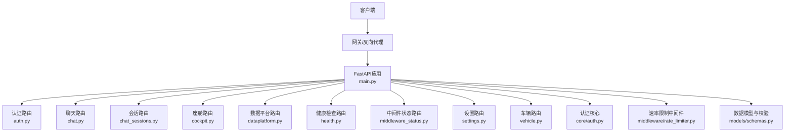
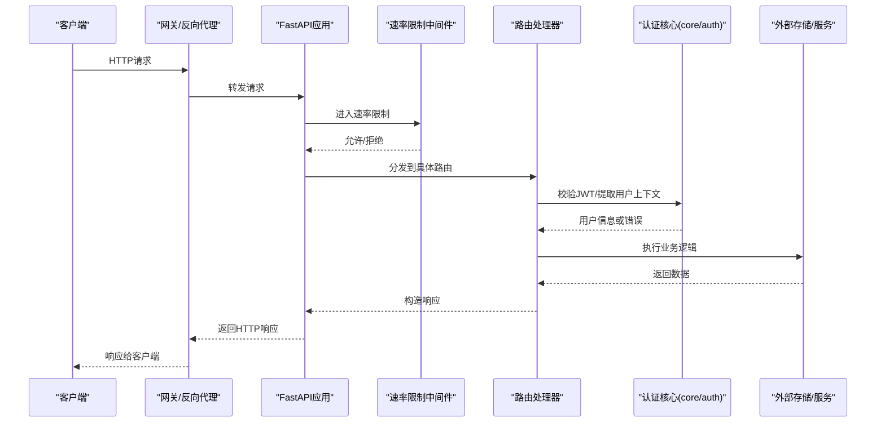
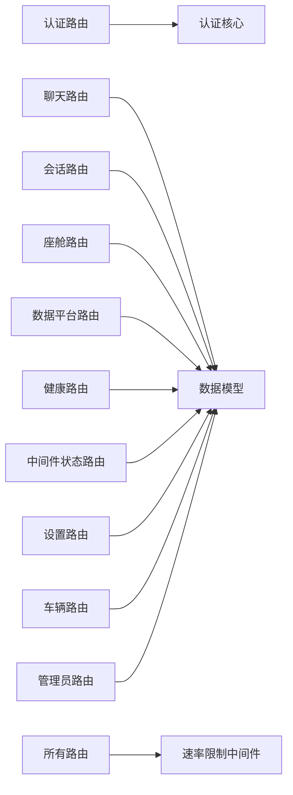

# RESTful API接口

<cite>
**本文引用的文件**   
- [backend_design/nexus/api/routes/auth.py](file://backend_design/nexus/api/routes/auth.py)
- [backend_design/nexus/api/routes/chat.py](file://backend_design/nexus/api/routes/chat.py)
- [backend_design/nexus/api/routes/chat_sessions.py](file://backend_design/nexus/api/routes/chat_sessions.py)
- [backend_design/nexus/api/routes/cockpit.py](file://backend_design/nexus/api/routes/cockpit.py)
- [backend_design/nexus/api/routes/dataplatform.py](file://backend_design/nexus/api/routes/dataplatform.py)
- [backend_design/nexus/api/routes/health.py](file://backend_design/nexus/api/routes/health.py)
- [backend_design/nexus/api/routes/middleware_status.py](file://backend_design/nexus/api/routes/middleware_status.py)
- [backend_design/nexus/api/routes/settings.py](file://backend_design/nexus/api/routes/settings.py)
- [backend_design/nexus/api/routes/vehicle.py](file://backend_design/nexus/api/routes/vehicle.py)
- [backend_design/nexus/api/routes/admin.py](file://backend_design/nexus/api/routes/admin.py)
- [backend_design/nexus/api/__init__.py](file://backend_design/nexus/api/__init__.py)
- [backend_design/nexus/core/auth.py](file://backend_design/nexus/core/auth.py)
- [backend_design/nexus/middleware/rate_limiter.py](file://backend_design/nexus/middleware/rate_limiter.py)
- [backend_design/nexus/models/schemas.py](file://backend_design/nexus/models/schemas.py)
- [backend_design/nexus/config.py](file://backend_design/nexus/config.py)
- [backend_design/nexus/main.py](file://backend_design/nexus/main.py)
</cite>

## 目录
1. [简介](#简介)
2. [项目结构](#项目结构)
3. [核心组件](#核心组件)
4. [架构总览](#架构总览)
5. [详细组件分析](#详细组件分析)
6. [依赖分析](#依赖分析)
7. [性能考虑](#性能考虑)
8. [故障排查指南](#故障排查指南)
9. [结论](#结论)
10. [附录](#附录)

## 简介
本文件为 NexusCockpit 系统的 RESTful API 接口文档，覆盖认证授权、会话与聊天、座舱控制、数据平台、健康检查、中间件状态、设置与车辆等模块的HTTP端点。文档包含：
- URL模式、请求方法、参数、响应格式与状态码
- 认证与授权机制（JWT）
- 数据验证规则与错误处理策略
- 速率限制配置
- API版本管理与向后兼容性说明
- 常见用例与最佳实践

## 项目结构
后端API基于Python实现，路由按功能模块拆分在 routes 目录下，统一挂载到应用入口。核心能力包括：
- 认证鉴权：JWT令牌签发与校验
- 会话管理：创建、查询、删除会话
- 聊天交互：发送消息、流式响应
- 座舱控制：获取与控制座舱相关资源
- 数据平台：数据接入与查询
- 健康检查：服务可用性探测
- 中间件状态：查看限流、缓存、任务队列等状态
- 设置：系统配置读取与更新
- 车辆：车辆状态与指令下发

图表来源
- [backend_design/nexus/main.py](file://backend_design/nexus/main.py)
- [backend_design/nexus/api/__init__.py](file://backend_design/nexus/api/__init__.py)
- [backend_design/nexus/api/routes/auth.py](file://backend_design/nexus/api/routes/auth.py)
- [backend_design/nexus/api/routes/chat.py](file://backend_design/nexus/api/routes/chat.py)
- [backend_design/nexus/api/routes/chat_sessions.py](file://backend_design/nexus/api/routes/chat_sessions.py)
- [backend_design/nexus/api/routes/cockpit.py](file://backend_design/nexus/api/routes/cockpit.py)
- [backend_design/nexus/api/routes/dataplatform.py](file://backend_design/nexus/api/routes/dataplatform.py)
- [backend_design/nexus/api/routes/health.py](file://backend_design/nexus/api/routes/health.py)
- [backend_design/nexus/api/routes/middleware_status.py](file://backend_design/nexus/api/routes/middleware_status.py)
- [backend_design/nexus/api/routes/settings.py](file://backend_design/nexus/api/routes/settings.py)
- [backend_design/nexus/api/routes/vehicle.py](file://backend_design/nexus/api/routes/vehicle.py)
- [backend_design/nexus/core/auth.py](file://backend_design/nexus/core/auth.py)
- [backend_design/nexus/middleware/rate_limiter.py](file://backend_design/nexus/middleware/rate_limiter.py)
- [backend_design/nexus/models/schemas.py](file://backend_design/nexus/models/schemas.py)

章节来源
- [backend_design/nexus/main.py](file://backend_design/nexus/main.py)
- [backend_design/nexus/api/__init__.py](file://backend_design/nexus/api/__init__.py)

## 核心组件
- 认证与授权
  - JWT令牌签发与校验，支持Bearer Token访问受保护接口
  - 通过依赖注入将当前用户上下文注入到路由处理器
- 速率限制
  - 基于中间件对全局或按路径进行请求频率限制
  - 可配置窗口大小与最大请求数
- 数据模型与校验
  - 使用Pydantic模型定义请求/响应结构与字段约束
  - 统一的错误响应格式
- 会话与聊天
  - 会话生命周期管理（创建、列表、删除）
  - 聊天消息发送与可选的流式响应
- 座舱与车辆
  - 座舱状态查询与控制指令下发
  - 车辆状态与操作接口
- 数据平台
  - 数据源注册、查询与结果返回
- 健康检查与中间件状态
  - 健康探针与中间件运行状态查看
- 设置
  - 系统配置项的读取与更新

章节来源
- [backend_design/nexus/core/auth.py](file://backend_design/nexus/core/auth.py)
- [backend_design/nexus/middleware/rate_limiter.py](file://backend_design/nexus/middleware/rate_limiter.py)
- [backend_design/nexus/models/schemas.py](file://backend_design/nexus/models/schemas.py)

## 架构总览
整体采用分层架构：网关/反向代理 -> FastAPI应用 -> 路由层 -> 业务逻辑 -> 外部服务（数据库、向量库、RAG、TTS/ASR等）。认证与速率限制作为横切关注点以中间件/依赖形式贯穿所有路由。

图表来源
- [backend_design/nexus/main.py](file://backend_design/nexus/main.py)
- [backend_design/nexus/middleware/rate_limiter.py](file://backend_design/nexus/middleware/rate_limiter.py)
- [backend_design/nexus/core/auth.py](file://backend_design/nexus/core/auth.py)

## 详细组件分析

### 认证与授权（/api/v1/auth）
- 目的：提供登录、令牌刷新、登出等认证能力；受保护接口需携带有效JWT。
- 通用头部
  - Authorization: Bearer <token>
- 端点
  - POST /api/v1/auth/login
    - 请求体：用户名、密码（依据schemas定义）
    - 响应：令牌、过期时间、用户基本信息
    - 状态码：200成功；401凭据无效；422校验失败
  - POST /api/v1/auth/refresh
    - 请求体：刷新令牌
    - 响应：新访问令牌
    - 状态码：200成功；401令牌无效；422校验失败
  - POST /api/v1/auth/logout
    - 请求头：Authorization
    - 响应：登出成功
    - 状态码：200成功；401未认证
- 错误处理
  - 401 Unauthorized：令牌缺失或无效
  - 422 Unprocessable Entity：请求体字段不符合校验规则
- 安全建议
  - 使用HTTPS传输
  - 合理设置令牌过期时间与刷新策略
  - 服务端记录审计日志

章节来源
- [backend_design/nexus/api/routes/auth.py](file://backend_design/nexus/api/routes/auth.py)
- [backend_design/nexus/core/auth.py](file://backend_design/nexus/core/auth.py)
- [backend_design/nexus/models/schemas.py](file://backend_design/nexus/models/schemas.py)

### 会话管理（/api/v1/sessions）
- 目的：管理聊天会话的生命周期。
- 端点
  - POST /api/v1/sessions
    - 请求体：会话元数据（如标题、描述、标签等）
    - 响应：会话ID与元数据
    - 状态码：201创建成功；422校验失败
  - GET /api/v1/sessions
    - 查询参数：分页（page, page_size）、过滤（tag、owner_id）
    - 响应：会话列表与分页信息
    - 状态码：200成功；401未认证
  - GET /api/v1/sessions/{session_id}
    - 路径参数：会话ID
    - 响应：会话详情
    - 状态码：200成功；404不存在；401未认证
  - DELETE /api/v1/sessions/{session_id}
    - 路径参数：会话ID
    - 响应：删除确认
    - 状态码：200成功；404不存在；401未认证
- 数据验证
  - 必填字段、长度限制、枚举值由schemas定义
- 错误处理
  - 404 Not Found：会话不存在
  - 422 Unprocessable Entity：参数不合法

章节来源
- [backend_design/nexus/api/routes/chat_sessions.py](file://backend_design/nexus/api/routes/chat_sessions.py)
- [backend_design/nexus/models/schemas.py](file://backend_design/nexus/models/schemas.py)

### 聊天交互（/api/v1/chat）
- 目的：发送消息并获取回复，支持流式响应。
- 端点
  - POST /api/v1/chat/messages
    - 请求头：Authorization
    - 请求体：会话ID、消息内容、附加参数（如温度、top_p）
    - 响应：非流式返回完整消息；或SSE/WS流式片段
    - 状态码：200成功；401未认证；422校验失败
  - GET /api/v1/chat/history?session_id=...
    - 查询参数：会话ID、分页
    - 响应：历史消息列表
    - 状态码：200成功；401未认证；404会话不存在
- 流式响应
  - 使用SSE或WebSocket推送增量片段
  - 客户端需处理断线重连与乱序合并
- 错误处理
  - 401未认证、404会话不存在、422参数不合法、500内部错误

章节来源
- [backend_design/nexus/api/routes/chat.py](file://backend_design/nexus/api/routes/chat.py)
- [backend_design/nexus/models/schemas.py](file://backend_design/nexus/models/schemas.py)

### 座舱控制（/api/v1/cockpit）
- 目的：查询与控制座舱相关资源（如显示、音频、导航等）。
- 端点
  - GET /api/v1/cockpit/status
    - 响应：座舱状态概览
    - 状态码：200成功；500内部错误
  - PUT /api/v1/cockpit/settings
    - 请求体：设置项键值对
    - 响应：更新后的设置
    - 状态码：200成功；422校验失败
  - POST /api/v1/cockpit/actions/{action}
    - 路径参数：动作名称
    - 请求体：动作参数
    - 响应：执行结果
    - 状态码：200成功；404未知动作；422参数不合法
- 错误处理
  - 404 Not Found：动作不存在
  - 422 Unprocessable Entity：参数不合法
  - 500 Internal Server Error：执行异常

章节来源
- [backend_design/nexus/api/routes/cockpit.py](file://backend_design/nexus/api/routes/cockpit.py)
- [backend_design/nexus/models/schemas.py](file://backend_design/nexus/models/schemas.py)

### 数据平台（/api/v1/data）
- 目的：数据源注册、查询与结果返回。
- 端点
  - POST /api/v1/data/sources
    - 请求体：数据源配置（类型、连接信息、认证）
    - 响应：数据源ID与状态
    - 状态码：201创建成功；422校验失败
  - GET /api/v1/data/query
    - 查询参数：数据源ID、查询语句/DSL、分页
    - 响应：查询结果集与元数据
    - 状态码：200成功；400参数错误；404数据源不存在
  - DELETE /api/v1/data/sources/{source_id}
    - 路径参数：数据源ID
    - 响应：删除确认
    - 状态码：200成功；404不存在
- 错误处理
  - 400 Bad Request：查询参数非法
  - 404 Not Found：数据源不存在
  - 422 Unprocessable Entity：请求体校验失败

章节来源
- [backend_design/nexus/api/routes/dataplatform.py](file://backend_design/nexus/api/routes/dataplatform.py)
- [backend_design/nexus/models/schemas.py](file://backend_design/nexus/models/schemas.py)

### 健康检查（/api/v1/health）
- 目的：服务可用性与依赖健康探测。
- 端点
  - GET /api/v1/health
    - 响应：服务状态、依赖项状态（数据库、缓存、向量库等）
    - 状态码：200健康；503部分依赖不可用
- 用途
  - 负载均衡与健康探针
  - 监控告警集成

章节来源
- [backend_design/nexus/api/routes/health.py](file://backend_design/nexus/api/routes/health.py)

### 中间件状态（/api/v1/middleware）
- 目的：查看限流、缓存、任务队列等中间件运行状态。
- 端点
  - GET /api/v1/middleware/status
    - 响应：各中间件状态指标（限流计数、缓存命中率、队列长度）
    - 状态码：200成功；500内部错误
- 用途
  - 运维监控与容量规划

章节来源
- [backend_design/nexus/api/routes/middleware_status.py](file://backend_design/nexus/api/routes/middleware_status.py)

### 设置（/api/v1/settings）
- 目的：系统配置项的读取与更新。
- 端点
  - GET /api/v1/settings
    - 查询参数：分组（可选）
    - 响应：配置项列表
    - 状态码：200成功
  - PUT /api/v1/settings
    - 请求体：配置项键值对
    - 响应：更新后的配置
    - 状态码：200成功；422校验失败
- 安全建议
  - 敏感配置项加密存储
  - 变更审计日志

章节来源
- [backend_design/nexus/api/routes/settings.py](file://backend_design/nexus/api/routes/settings.py)
- [backend_design/nexus/models/schemas.py](file://backend_design/nexus/models/schemas.py)

### 车辆（/api/v1/vehicle）
- 目的：获取车辆状态与下发控制指令。
- 端点
  - GET /api/v1/vehicle/status
    - 响应：车辆状态（电量、位置、车门、空调等）
    - 状态码：200成功；500内部错误
  - POST /api/v1/vehicle/control
    - 请求体：控制指令（目标设备、参数）
    - 响应：执行结果
    - 状态码：200成功；422参数不合法；500执行失败
- 错误处理
  - 422 Unprocessable Entity：参数不合法
  - 500 Internal Server Error：执行异常

章节来源
- [backend_design/nexus/api/routes/vehicle.py](file://backend_design/nexus/api/routes/vehicle.py)
- [backend_design/nexus/models/schemas.py](file://backend_design/nexus/models/schemas.py)

### 管理员（/api/v1/admin）
- 目的：系统管理功能（用户、租户、审计等）。
- 端点
  - GET /api/v1/admin/users
    - 查询参数：分页、过滤
    - 响应：用户列表
    - 状态码：200成功；401未认证
  - POST /api/v1/admin/users
    - 请求体：用户信息
    - 响应：创建结果
    - 状态码：201创建成功；422校验失败
  - PUT /api/v1/admin/users/{user_id}
    - 路径参数：用户ID
    - 请求体：更新信息
    - 响应：更新结果
    - 状态码：200成功；404不存在；422校验失败
  - DELETE /api/v1/admin/users/{user_id}
    - 路径参数：用户ID
    - 响应：删除确认
    - 状态码：200成功；404不存在
- 安全要求
  - 仅管理员角色可访问
  - 全量审计日志

章节来源
- [backend_design/nexus/api/routes/admin.py](file://backend_design/nexus/api/routes/admin.py)
- [backend_design/nexus/models/schemas.py](file://backend_design/nexus/models/schemas.py)

## 依赖分析
- 路由层依赖
  - 认证核心：用于JWT校验与用户上下文注入
  - 数据模型：Pydantic schemas用于请求/响应校验
  - 中间件：速率限制、缓存、任务队列
- 外部依赖
  - 数据库、缓存、向量库、RAG、TTS/ASR、车辆服务等

图表来源
- [backend_design/nexus/api/routes/auth.py](file://backend_design/nexus/api/routes/auth.py)
- [backend_design/nexus/api/routes/chat.py](file://backend_design/nexus/api/routes/chat.py)
- [backend_design/nexus/api/routes/chat_sessions.py](file://backend_design/nexus/api/routes/chat_sessions.py)
- [backend_design/nexus/api/routes/cockpit.py](file://backend_design/nexus/api/routes/cockpit.py)
- [backend_design/nexus/api/routes/dataplatform.py](file://backend_design/nexus/api/routes/dataplatform.py)
- [backend_design/nexus/api/routes/health.py](file://backend_design/nexus/api/routes/health.py)
- [backend_design/nexus/api/routes/middleware_status.py](file://backend_design/nexus/api/routes/middleware_status.py)
- [backend_design/nexus/api/routes/settings.py](file://backend_design/nexus/api/routes/settings.py)
- [backend_design/nexus/api/routes/vehicle.py](file://backend_design/nexus/api/routes/vehicle.py)
- [backend_design/nexus/api/routes/admin.py](file://backend_design/nexus/api/routes/admin.py)
- [backend_design/nexus/core/auth.py](file://backend_design/nexus/core/auth.py)
- [backend_design/nexus/middleware/rate_limiter.py](file://backend_design/nexus/middleware/rate_limiter.py)
- [backend_design/nexus/models/schemas.py](file://backend_design/nexus/models/schemas.py)

章节来源
- [backend_design/nexus/core/auth.py](file://backend_design/nexus/core/auth.py)
- [backend_design/nexus/middleware/rate_limiter.py](file://backend_design/nexus/middleware/rate_limiter.py)
- [backend_design/nexus/models/schemas.py](file://backend_design/nexus/models/schemas.py)

## 性能考虑
- 速率限制
  - 建议按IP或用户维度限制，避免单点滥用
  - 针对流式接口单独配置更宽松的限制
- 缓存
  - 热点数据（如健康检查、中间件状态）启用短期缓存
- 异步与并发
  - 长耗时操作（如数据查询、AI推理）采用异步或任务队列
- 分页与过滤
  - 列表接口默认分页，避免一次性返回大量数据
- 连接池
  - 数据库与外部服务连接复用，减少握手开销

[本节为通用指导，无需特定文件引用]

## 故障排查指南
- 常见问题
  - 401未认证：检查Authorization头是否携带有效Bearer令牌
  - 422参数不合法：核对请求体字段是否符合schemas定义
  - 404资源不存在：确认路径参数是否正确
  - 500内部错误：查看服务端日志与依赖服务状态
- 诊断步骤
  - 使用健康检查接口确认服务状态
  - 查看中间件状态接口了解限流与缓存情况
  - 开启调试日志定位错误堆栈
- 重试与退避
  - 对瞬时错误实施指数退避重试
  - 对限流错误等待后重试

章节来源
- [backend_design/nexus/api/routes/health.py](file://backend_design/nexus/api/routes/health.py)
- [backend_design/nexus/api/routes/middleware_status.py](file://backend_design/nexus/api/routes/middleware_status.py)

## 结论
NexusCockpit的RESTful API采用清晰的分层与模块化设计，结合JWT认证、速率限制与统一的数据校验，提供了稳定可扩展的服务能力。建议在生产环境严格遵循安全与性能最佳实践，并结合监控与日志完善可观测性。

[本节为总结，无需特定文件引用]

## 附录

### 认证与授权机制
- 令牌类型：JWT（Bearer）
- 颁发流程：登录成功后返回访问令牌与刷新令牌
- 校验流程：请求头携带Authorization，服务端解析并验证签名与过期时间
- 权限控制：基于角色与资源的细粒度授权（管理员与普通用户）

章节来源
- [backend_design/nexus/core/auth.py](file://backend_design/nexus/core/auth.py)

### 数据验证规则
- 使用Pydantic模型定义字段类型、必填、长度、枚举等约束
- 校验失败返回422，并在响应中包含字段级错误信息

章节来源
- [backend_design/nexus/models/schemas.py](file://backend_design/nexus/models/schemas.py)

### 错误处理策略
- 统一错误响应格式：包含错误码、消息、详情
- 常见状态码
  - 200/201：成功
  - 400：请求参数错误
  - 401：未认证
  - 403：无权限
  - 404：资源不存在
  - 422：参数校验失败
  - 429：超过速率限制
  - 500：内部服务器错误
  - 503：服务不可用或部分依赖异常

章节来源
- [backend_design/nexus/models/schemas.py](file://backend_design/nexus/models/schemas.py)

### 速率限制配置
- 全局限制：单位时间窗口内最大请求数
- 路径限制：针对敏感接口（如登录、控制）更严格的限制
- 响应头：包含剩余配额与重置时间

章节来源
- [backend_design/nexus/middleware/rate_limiter.py](file://backend_design/nexus/middleware/rate_limiter.py)

### API版本管理与兼容性
- 版本前缀：/api/v1
- 向后兼容
  - 新增字段不影响旧客户端
  - 废弃字段保留一段时间并提供迁移提示
- 迁移指南
  - 发布变更公告与示例
  - 提供并行版本过渡期

章节来源
- [backend_design/nexus/config.py](file://backend_design/nexus/config.py)

### 常见用例与最佳实践
- 登录与调用受保护接口
  - 先调用登录获取令牌
  - 后续请求携带Authorization头
- 会话与聊天
  - 先创建会话，再发送消息
  - 流式响应时处理增量片段与断线重连
- 控制类接口
  - 幂等性设计，避免重复提交
  - 超时与重试策略
- 监控与可观测性
  - 定期调用健康检查与中间件状态接口
  - 结合日志与指标进行问题定位

[本节为通用指导，无需特定文件引用]