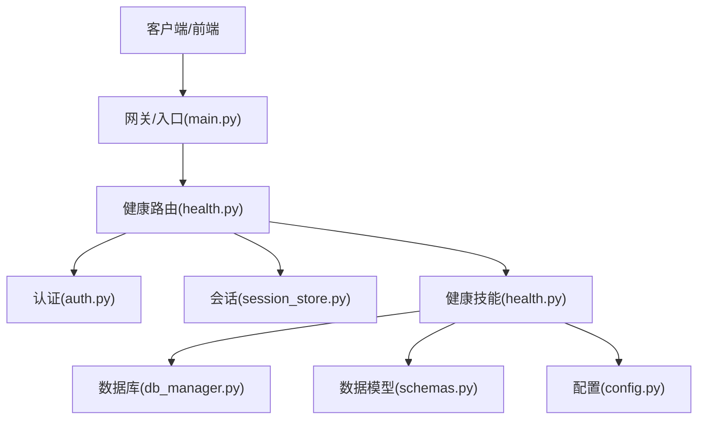
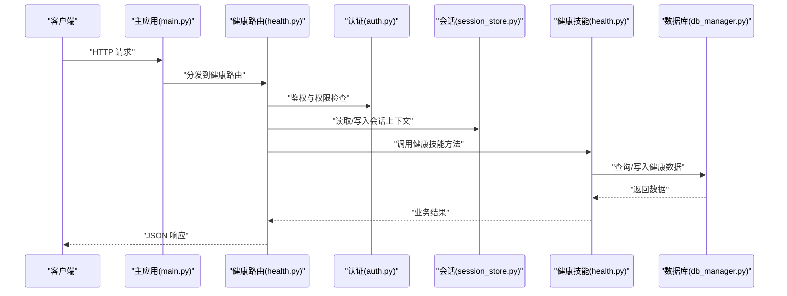
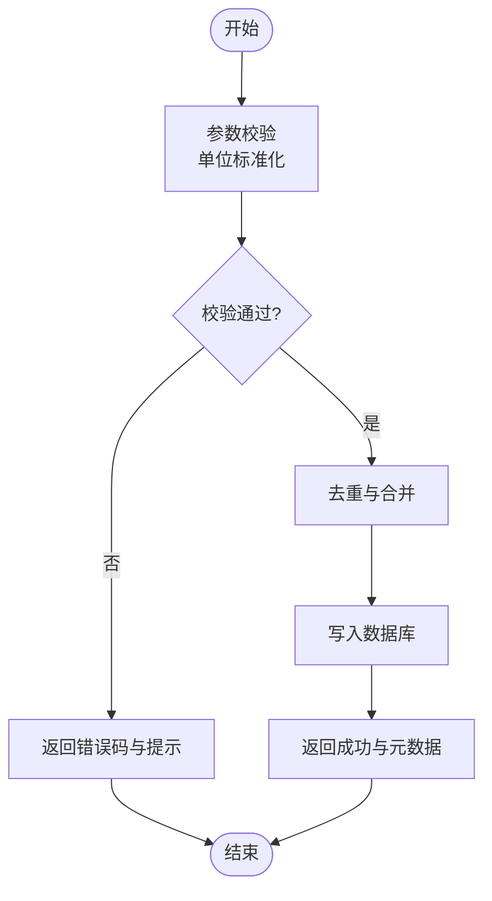
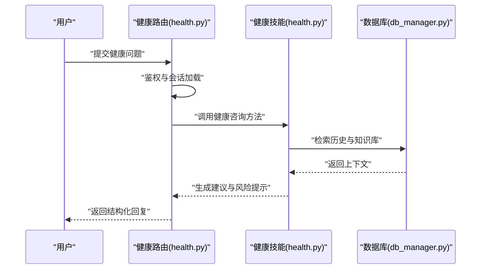
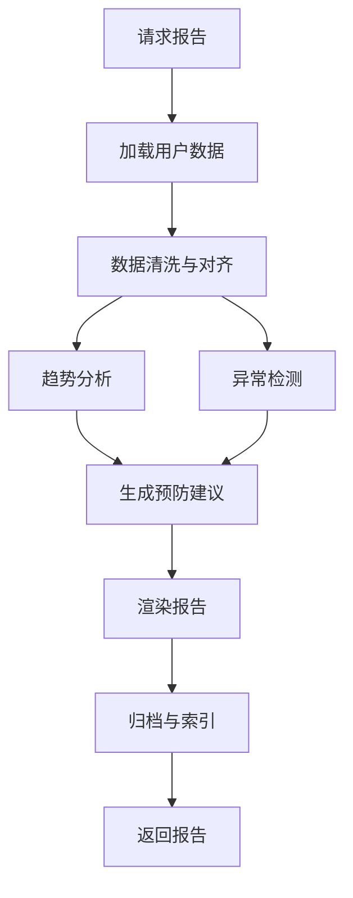
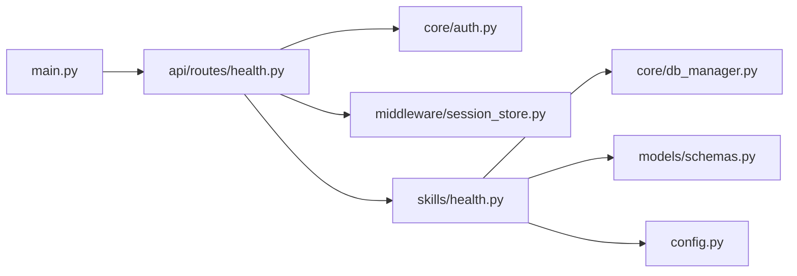

# 健康服务接口

<cite>
**本文引用的文件**   
- [backend_design/nexus/api/routes/health.py](file://backend_design/nexus/api/routes/health.py)
- [backend_design/nexus/skills/health.py](file://backend_design/nexus/skills/health.py)
- [backend_design/nexus/core/db_manager.py](file://backend_design/nexus/core/db_manager.py)
- [backend_design/nexus/models/schemas.py](file://backend_design/nexus/models/schemas.py)
- [backend_design/nexus/core/auth.py](file://backend_design/nexus/core/auth.py)
- [backend_design/nexus/middleware/session_store.py](file://backend_design/nexus/middleware/session_store.py)
- [backend_design/nexus/config.py](file://backend_design/nexus/config.py)
- [backend_design/nexus/main.py](file://backend_design/nexus/main.py)
</cite>

## 目录
1. [简介](#简介)
2. [项目结构](#项目结构)
3. [核心组件](#核心组件)
4. [架构总览](#架构总览)
5. [详细组件分析](#详细组件分析)
6. [依赖分析](#依赖分析)
7. [性能考虑](#性能考虑)
8. [故障排查指南](#故障排查指南)
9. [结论](#结论)
10. [附录](#附录)

## 简介
本文件面向健康服务API接口的开发者与集成方，系统化记录健康数据录入、健康咨询、个性化建议与健康报告生成等能力。文档覆盖以下要点：
- 健康指标数据结构：心率、血压、睡眠质量、运动数据
- 健康咨询对话接口：支持自然语言问题与专业医学建议回复
- 健康报告生成接口：趋势分析、异常检测、预防建议
- 隐私保护、加密存储与访问控制策略
- 可穿戴设备集成与数据同步机制

## 项目结构
健康服务相关代码主要位于后端Python模块中，采用“路由层 + 技能层 + 模型/Schema + 基础设施”的分层组织方式：
- API路由层：暴露HTTP端点，负责请求校验、鉴权、会话上下文与响应封装
- 技能层：实现健康领域业务逻辑（如健康问答、建议生成、报告聚合）
- 模型与Schema：定义健康指标、对话消息、报告等数据结构
- 基础设施：数据库管理、认证鉴权、会话存储、配置管理等

图表来源
- [backend_design/nexus/main.py](file://backend_design/nexus/main.py)
- [backend_design/nexus/api/routes/health.py](file://backend_design/nexus/api/routes/health.py)
- [backend_design/nexus/core/auth.py](file://backend_design/nexus/core/auth.py)
- [backend_design/nexus/middleware/session_store.py](file://backend_design/nexus/middleware/session_store.py)
- [backend_design/nexus/skills/health.py](file://backend_design/nexus/skills/health.py)
- [backend_design/nexus/core/db_manager.py](file://backend_design/nexus/core/db_manager.py)
- [backend_design/nexus/models/schemas.py](file://backend_design/nexus/models/schemas.py)
- [backend_design/nexus/config.py](file://backend_design/nexus/config.py)

章节来源
- [backend_design/nexus/main.py](file://backend_design/nexus/main.py)
- [backend_design/nexus/api/routes/health.py](file://backend_design/nexus/api/routes/health.py)
- [backend_design/nexus/skills/health.py](file://backend_design/nexus/skills/health.py)
- [backend_design/nexus/core/db_manager.py](file://backend_design/nexus/core/db_manager.py)
- [backend_design/nexus/models/schemas.py](file://backend_design/nexus/models/schemas.py)
- [backend_design/nexus/core/auth.py](file://backend_design/nexus/core/auth.py)
- [backend_design/nexus/middleware/session_store.py](file://backend_design/nexus/middleware/session_store.py)
- [backend_design/nexus/config.py](file://backend_design/nexus/config.py)

## 核心组件
- 健康路由层：提供健康数据录入、健康咨询、报告生成等HTTP端点；统一处理鉴权与会话上下文
- 健康技能层：封装健康领域的业务逻辑，包括指标解析、对话意图识别、建议生成、报告聚合
- 数据模型层：定义健康指标、对话消息、报告的结构化Schema
- 基础设施层：数据库读写、认证鉴权、会话存储、配置加载

章节来源
- [backend_design/nexus/api/routes/health.py](file://backend_design/nexus/api/routes/health.py)
- [backend_design/nexus/skills/health.py](file://backend_design/nexus/skills/health.py)
- [backend_design/nexus/models/schemas.py](file://backend_design/nexus/models/schemas.py)
- [backend_design/nexus/core/db_manager.py](file://backend_design/nexus/core/db_manager.py)
- [backend_design/nexus/core/auth.py](file://backend_design/nexus/core/auth.py)
- [backend_design/nexus/middleware/session_store.py](file://backend_design/nexus/middleware/session_store.py)
- [backend_design/nexus/config.py](file://backend_design/nexus/config.py)

## 架构总览
健康服务整体遵循分层架构：
- 接入层：由主应用注册路由，承载HTTP请求
- 路由层：健康路由对请求进行鉴权、参数校验、会话注入
- 技能层：健康技能执行具体业务逻辑，调用数据库与外部服务
- 数据层：持久化健康指标、对话历史、报告结果
- 安全与配置：认证鉴权、会话存储、配置项集中管理

图表来源
- [backend_design/nexus/main.py](file://backend_design/nexus/main.py)
- [backend_design/nexus/api/routes/health.py](file://backend_design/nexus/api/routes/health.py)
- [backend_design/nexus/core/auth.py](file://backend_design/nexus/core/auth.py)
- [backend_design/nexus/middleware/session_store.py](file://backend_design/nexus/middleware/session_store.py)
- [backend_design/nexus/skills/health.py](file://backend_design/nexus/skills/health.py)
- [backend_design/nexus/core/db_manager.py](file://backend_design/nexus/core/db_manager.py)

## 详细组件分析

### 健康指标数据结构
健康指标包含心率、血压、睡眠质量、运动数据四类。为便于系统化处理与可视化，建议在Schema中明确字段类型、单位与取值范围。以下为推荐的数据结构说明（以字段名与语义为主，不展示具体代码内容）：
- 心率
  - 字段：时间戳、心率值、单位、测量状态
  - 说明：用于计算静息心率、运动区间分布与异常波动检测
- 血压
  - 字段：时间戳、收缩压、舒张压、单位、体位信息
  - 说明：用于高血压风险评估与趋势分析
- 睡眠质量
  - 字段：时间戳、睡眠时长、深睡比例、浅睡比例、REM比例、入睡时间、醒来次数
  - 说明：用于睡眠健康评分与作息建议
- 运动数据
  - 字段：时间戳、运动类型、持续时间、步数、距离、消耗卡路里、平均心率
  - 说明：用于运动量评估与目标达成度统计

章节来源
- [backend_design/nexus/models/schemas.py](file://backend_design/nexus/models/schemas.py)

### 健康数据录入接口
- 功能：接收来自用户或可穿戴设备的健康指标数据，进行校验、落库与反馈
- 输入：健康指标对象（心率、血压、睡眠、运动），附带用户标识与时间戳
- 输出：入库结果、数据质量反馈、异常提示
- 流程要点：
  - 鉴权与会话校验
  - 参数校验与单位标准化
  - 去重与合并策略（同时间段重复数据）
  - 写入数据库并返回确认

图表来源
- [backend_design/nexus/api/routes/health.py](file://backend_design/nexus/api/routes/health.py)
- [backend_design/nexus/skills/health.py](file://backend_design/nexus/skills/health.py)
- [backend_design/nexus/core/db_manager.py](file://backend_design/nexus/core/db_manager.py)

章节来源
- [backend_design/nexus/api/routes/health.py](file://backend_design/nexus/api/routes/health.py)
- [backend_design/nexus/skills/health.py](file://backend_design/nexus/skills/health.py)
- [backend_design/nexus/core/db_manager.py](file://backend_design/nexus/core/db_manager.py)

### 健康咨询对话接口
- 功能：支持自然语言健康问题的输入，返回专业医学建议与参考信息
- 输入：用户ID、对话历史、当前问题文本
- 输出：结构化回复（建议、风险提示、参考资料）、对话状态
- 流程要点：
  - 鉴权与会话上下文加载
  - 意图识别与知识检索（可选）
  - 生成专业建议与风险提示
  - 保存对话历史与审计日志

图表来源
- [backend_design/nexus/api/routes/health.py](file://backend_design/nexus/api/routes/health.py)
- [backend_design/nexus/skills/health.py](file://backend_design/nexus/skills/health.py)
- [backend_design/nexus/core/db_manager.py](file://backend_design/nexus/core/db_manager.py)

章节来源
- [backend_design/nexus/api/routes/health.py](file://backend_design/nexus/api/routes/health.py)
- [backend_design/nexus/skills/health.py](file://backend_design/nexus/skills/health.py)
- [backend_design/nexus/core/db_manager.py](file://backend_design/nexus/core/db_manager.py)

### 个性化建议接口
- 功能：基于用户健康指标与偏好，生成个性化健康建议（饮食、运动、作息）
- 输入：用户ID、最近健康指标、偏好设置
- 输出：建议列表、优先级、生效周期
- 流程要点：
  - 指标聚合与特征提取
  - 规则与模型结合生成建议
  - 建议去重与排序
  - 持久化建议与版本管理

章节来源
- [backend_design/nexus/skills/health.py](file://backend_design/nexus/skills/health.py)
- [backend_design/nexus/models/schemas.py](file://backend_design/nexus/models/schemas.py)

### 健康报告生成接口
- 功能：生成周期性健康报告，包含趋势分析、异常检测与预防建议
- 输入：用户ID、时间窗口、报告类型
- 输出：报告摘要、关键指标趋势、异常事件、预防建议
- 流程要点：
  - 数据拉取与清洗
  - 趋势计算与阈值判定
  - 异常检测与归因分析
  - 报告模板渲染与归档

图表来源
- [backend_design/nexus/api/routes/health.py](file://backend_design/nexus/api/routes/health.py)
- [backend_design/nexus/skills/health.py](file://backend_design/nexus/skills/health.py)
- [backend_design/nexus/core/db_manager.py](file://backend_design/nexus/core/db_manager.py)

章节来源
- [backend_design/nexus/api/routes/health.py](file://backend_design/nexus/api/routes/health.py)
- [backend_design/nexus/skills/health.py](file://backend_design/nexus/skills/health.py)
- [backend_design/nexus/core/db_manager.py](file://backend_design/nexus/core/db_manager.py)

### 隐私保护、加密存储与访问控制
- 隐私保护
  - 最小化采集原则：仅收集必要健康指标
  - 数据脱敏：对外部共享时去除可识别信息
  - 保留策略：按合规要求设定数据生命周期
- 加密存储
  - 传输加密：强制HTTPS/TLS
  - 静态加密：敏感字段在数据库中加密存储
  - 密钥管理：使用可信密钥管理服务
- 访问控制
  - 身份认证：JWT或会话令牌
  - 授权策略：基于角色的访问控制（RBAC）
  - 审计日志：记录关键操作与访问行为

章节来源
- [backend_design/nexus/core/auth.py](file://backend_design/nexus/core/auth.py)
- [backend_design/nexus/middleware/session_store.py](file://backend_design/nexus/middleware/session_store.py)
- [backend_design/nexus/config.py](file://backend_design/nexus/config.py)

### 可穿戴设备集成与数据同步机制
- 设备接入
  - 设备注册与绑定：设备ID与用户ID关联
  - 协议适配：统一数据格式与时间同步
- 数据同步
  - 增量同步：基于时间戳的断点续传
  - 冲突解决：以服务端权威时间为准
  - 重试与幂等：失败重试与去重保证
- 监控与告警
  - 同步延迟监控
  - 数据质量告警

章节来源
- [backend_design/nexus/api/routes/health.py](file://backend_design/nexus/api/routes/health.py)
- [backend_design/nexus/skills/health.py](file://backend_design/nexus/skills/health.py)
- [backend_design/nexus/core/db_manager.py](file://backend_design/nexus/core/db_manager.py)

## 依赖分析
健康服务各组件之间的依赖关系如下：
- 健康路由依赖认证与会话中间件
- 健康技能依赖数据库管理与数据模型
- 主应用负责路由注册与全局配置

图表来源
- [backend_design/nexus/main.py](file://backend_design/nexus/main.py)
- [backend_design/nexus/api/routes/health.py](file://backend_design/nexus/api/routes/health.py)
- [backend_design/nexus/core/auth.py](file://backend_design/nexus/core/auth.py)
- [backend_design/nexus/middleware/session_store.py](file://backend_design/nexus/middleware/session_store.py)
- [backend_design/nexus/skills/health.py](file://backend_design/nexus/skills/health.py)
- [backend_design/nexus/core/db_manager.py](file://backend_design/nexus/core/db_manager.py)
- [backend_design/nexus/models/schemas.py](file://backend_design/nexus/models/schemas.py)
- [backend_design/nexus/config.py](file://backend_design/nexus/config.py)

章节来源
- [backend_design/nexus/main.py](file://backend_design/nexus/main.py)
- [backend_design/nexus/api/routes/health.py](file://backend_design/nexus/api/routes/health.py)
- [backend_design/nexus/core/auth.py](file://backend_design/nexus/core/auth.py)
- [backend_design/nexus/middleware/session_store.py](file://backend_design/nexus/middleware/session_store.py)
- [backend_design/nexus/skills/health.py](file://backend_design/nexus/skills/health.py)
- [backend_design/nexus/core/db_manager.py](file://backend_design/nexus/core/db_manager.py)
- [backend_design/nexus/models/schemas.py](file://backend_design/nexus/models/schemas.py)
- [backend_design/nexus/config.py](file://backend_design/nexus/config.py)

## 性能考虑
- 批量写入：健康指标建议批量入库以降低I/O开销
- 缓存热点：常用指标与报告结果可短期缓存
- 异步处理：报告生成与长耗时任务采用队列异步执行
- 连接池：数据库连接复用与限流
- 超时与熔断：对外部依赖设置超时与降级策略

[本节为通用性能指导，无需特定文件引用]

## 故障排查指南
- 鉴权失败
  - 检查令牌有效性与会话状态
  - 核对角色权限与资源访问策略
- 数据入库异常
  - 校验字段类型与取值范围
  - 查看数据库连接与事务状态
- 健康咨询无响应
  - 检查会话上下文是否完整
  - 验证知识库检索与模型调用链路
- 报告生成缓慢
  - 评估数据量与索引效率
  - 检查异步队列积压情况

章节来源
- [backend_design/nexus/core/auth.py](file://backend_design/nexus/core/auth.py)
- [backend_design/nexus/middleware/session_store.py](file://backend_design/nexus/middleware/session_store.py)
- [backend_design/nexus/core/db_manager.py](file://backend_design/nexus/core/db_manager.py)
- [backend_design/nexus/skills/health.py](file://backend_design/nexus/skills/health.py)

## 结论
健康服务API以清晰的分层架构与模块化设计，实现了健康数据录入、健康咨询、个性化建议与健康报告生成等核心能力。通过严格的隐私保护、加密存储与访问控制策略，以及完善的设备集成与同步机制，系统具备较高的安全性与可扩展性。后续可在性能优化、异常检测与知识图谱增强方面持续演进。

[本节为总结性内容，无需特定文件引用]

## 附录
- 术语表
  - 健康指标：心率、血压、睡眠质量、运动数据等生理与活动数据
  - 健康咨询：基于自然语言的健康问题与专业建议交互
  - 健康报告：周期性健康分析与建议汇总
- 参考路径
  - 健康路由实现：[backend_design/nexus/api/routes/health.py](file://backend_design/nexus/api/routes/health.py)
  - 健康技能实现：[backend_design/nexus/skills/health.py](file://backend_design/nexus/skills/health.py)
  - 数据模型定义：[backend_design/nexus/models/schemas.py](file://backend_design/nexus/models/schemas.py)
  - 数据库管理：[backend_design/nexus/core/db_manager.py](file://backend_design/nexus/core/db_manager.py)
  - 认证鉴权：[backend_design/nexus/core/auth.py](file://backend_design/nexus/core/auth.py)
  - 会话存储：[backend_design/nexus/middleware/session_store.py](file://backend_design/nexus/middleware/session_store.py)
  - 配置管理：[backend_design/nexus/config.py](file://backend_design/nexus/config.py)
  - 主应用入口：[backend_design/nexus/main.py](file://backend_design/nexus/main.py)