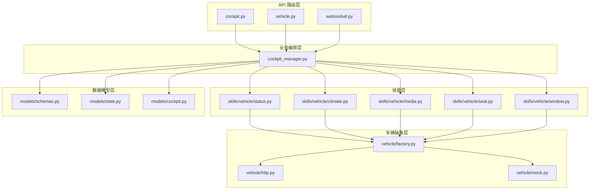
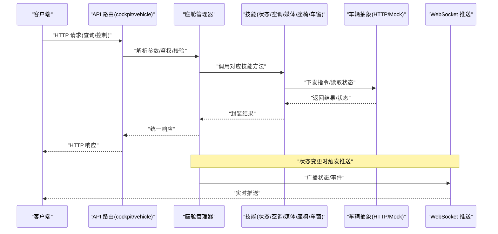
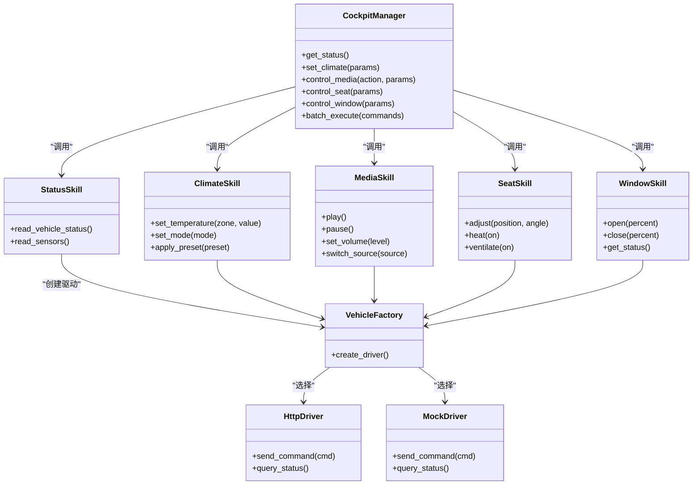
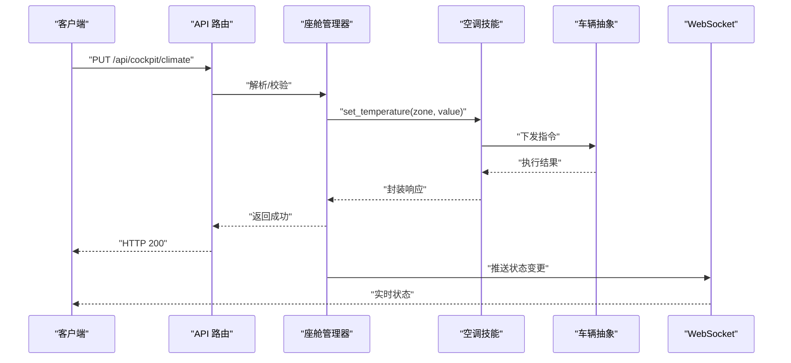

# 座舱控制接口

<cite>
**本文引用的文件**   
- [backend_design/nexus/api/routes/cockpit.py](file://backend_design/nexus/api/routes/cockpit.py)
- [backend_design/nexus/api/routes/vehicle.py](file://backend_design/nexus/api/routes/vehicle.py)
- [backend_design/nexus/core/cockpit_manager.py](file://backend_design/nexus/core/cockpit_manager.py)
- [backend_design/nexus/models/schemas.py](file://backend_design/nexus/models/schemas.py)
- [backend_design/nexus/models/state.py](file://backend_design/nexus/models/state.py)
- [backend_design/nexus/models/cockpit.py](file://backend_design/nexus/models/cockpit.py)
- [backend_design/nexus/api/websocket.py](file://backend_design/nexus/api/websocket.py)
- [backend_design/nexus/skills/vehicle/status.py](file://backend_design/nexus/skills/vehicle/status.py)
- [backend_design/nexus/skills/vehicle/climate.py](file://backend_design/nexus/skills/vehicle/climate.py)
- [backend_design/nexus/skills/vehicle/media.py](file://backend_design/nexus/skills/vehicle/media.py)
- [backend_design/nexus/skills/vehicle/seat.py](file://backend_design/nexus/skills/vehicle/seat.py)
- [backend_design/nexus/skills/vehicle/window.py](file://backend_design/nexus/skills/vehicle/window.py)
- [backend_design/nexus/vehicle/factory.py](file://backend_design/nexus/vehicle/factory.py)
- [backend_design/nexus/vehicle/http.py](file://backend_design/nexus/vehicle/http.py)
- [backend_design/nexus/vehicle/mock.py](file://backend_design/nexus/vehicle/mock.py)
- [backend_design/nexus/config.py](file://backend_design/nexus/config.py)
</cite>

## 目录
1. [简介](#简介)
2. [项目结构](#项目结构)
3. [核心组件](#核心组件)
4. [架构总览](#架构总览)
5. [详细组件分析](#详细组件分析)
6. [依赖关系分析](#依赖关系分析)
7. [性能考虑](#性能考虑)
8. [故障排查指南](#故障排查指南)
9. [结论](#结论)
10. [附录](#附录)

## 简介
本文件为 NexusCockpit 系统的“座舱控制模块”提供完整的 API 文档，覆盖车辆状态监控、座舱环境控制、设备管理等 HTTP 端点，并说明数据模型、控制指令格式、实时状态同步机制。同时给出传感器数据获取、环境参数调节、设备开关控制等接口的调用示例与异常处理建议，以及批量操作与状态查询的最佳实践。

## 项目结构
座舱控制相关代码主要位于后端 Python 服务中，采用分层设计：
- API 路由层：暴露 HTTP/WebSocket 接口
- 业务编排层：协调技能（Skills）与车辆抽象层
- 技能层：按功能域拆分（状态、空调、媒体、座椅、车窗等）
- 车辆抽象层：统一对接不同车厂或模拟实现
- 数据模型层：定义请求/响应 Schema 与内部状态模型

图表来源
- [backend_design/nexus/api/routes/cockpit.py](file://backend_design/nexus/api/routes/cockpit.py)
- [backend_design/nexus/api/routes/vehicle.py](file://backend_design/nexus/api/routes/vehicle.py)
- [backend_design/nexus/api/websocket.py](file://backend_design/nexus/api/websocket.py)
- [backend_design/nexus/core/cockpit_manager.py](file://backend_design/nexus/core/cockpit_manager.py)
- [backend_design/nexus/skills/vehicle/status.py](file://backend_design/nexus/skills/vehicle/status.py)
- [backend_design/nexus/skills/vehicle/climate.py](file://backend_design/nexus/skills/vehicle/climate.py)
- [backend_design/nexus/skills/vehicle/media.py](file://backend_design/nexus/skills/vehicle/media.py)
- [backend_design/nexus/skills/vehicle/seat.py](file://backend_design/nexus/skills/vehicle/seat.py)
- [backend_design/nexus/skills/vehicle/window.py](file://backend_design/nexus/skills/vehicle/window.py)
- [backend_design/nexus/vehicle/factory.py](file://backend_design/nexus/vehicle/factory.py)
- [backend_design/nexus/vehicle/http.py](file://backend_design/nexus/vehicle/http.py)
- [backend_design/nexus/vehicle/mock.py](file://backend_design/nexus/vehicle/mock.py)
- [backend_design/nexus/models/schemas.py](file://backend_design/nexus/models/schemas.py)
- [backend_design/nexus/models/state.py](file://backend_design/nexus/models/state.py)
- [backend_design/nexus/models/cockpit.py](file://backend_design/nexus/models/cockpit.py)

章节来源
- [backend_design/nexus/api/routes/cockpit.py](file://backend_design/nexus/api/routes/cockpit.py)
- [backend_design/nexus/api/routes/vehicle.py](file://backend_design/nexus/api/routes/vehicle.py)
- [backend_design/nexus/api/websocket.py](file://backend_design/nexus/api/websocket.py)
- [backend_design/nexus/core/cockpit_manager.py](file://backend_design/nexus/core/cockpit_manager.py)
- [backend_design/nexus/models/schemas.py](file://backend_design/nexus/models/schemas.py)
- [backend_design/nexus/models/state.py](file://backend_design/nexus/models/state.py)
- [backend_design/nexus/models/cockpit.py](file://backend_design/nexus/models/cockpit.py)

## 核心组件
- 座舱管理器（CockpitManager）：统一编排座舱能力，聚合各技能并提供事务性/批量化控制入口。
- 车辆抽象工厂（VehicleFactory）：根据配置选择真实 HTTP 驱动或 Mock 驱动。
- 技能集合（Skills）：按领域划分的能力实现，如状态、空调、媒体、座椅、车窗。
- 数据模型（Schemas/State/Cockpit）：定义请求/响应结构与内部状态对象。
- WebSocket 推送：用于实时状态同步与事件通知。

章节来源
- [backend_design/nexus/core/cockpit_manager.py](file://backend_design/nexus/core/cockpit_manager.py)
- [backend_design/nexus/vehicle/factory.py](file://backend_design/nexus/vehicle/factory.py)
- [backend_design/nexus/skills/vehicle/status.py](file://backend_design/nexus/skills/vehicle/status.py)
- [backend_design/nexus/skills/vehicle/climate.py](file://backend_design/nexus/skills/vehicle/climate.py)
- [backend_design/nexus/skills/vehicle/media.py](file://backend_design/nexus/skills/vehicle/media.py)
- [backend_design/nexus/skills/vehicle/seat.py](file://backend_design/nexus/skills/vehicle/seat.py)
- [backend_design/nexus/skills/vehicle/window.py](file://backend_design/nexus/skills/vehicle/window.py)
- [backend_design/nexus/models/schemas.py](file://backend_design/nexus/models/schemas.py)
- [backend_design/nexus/models/state.py](file://backend_design/nexus/models/state.py)
- [backend_design/nexus/models/cockpit.py](file://backend_design/nexus/models/cockpit.py)

## 架构总览
HTTP 客户端通过 API 路由进入座舱控制流程，由座舱管理器协调具体技能执行，最终通过车辆抽象层与真实车辆或模拟环境交互。WebSocket 通道用于将车辆状态变更与系统事件实时推送至前端。

图表来源
- [backend_design/nexus/api/routes/cockpit.py](file://backend_design/nexus/api/routes/cockpit.py)
- [backend_design/nexus/api/routes/vehicle.py](file://backend_design/nexus/api/routes/vehicle.py)
- [backend_design/nexus/core/cockpit_manager.py](file://backend_design/nexus/core/cockpit_manager.py)
- [backend_design/nexus/api/websocket.py](file://backend_design/nexus/api/websocket.py)
- [backend_design/nexus/vehicle/factory.py](file://backend_design/nexus/vehicle/factory.py)
- [backend_design/nexus/vehicle/http.py](file://backend_design/nexus/vehicle/http.py)
- [backend_design/nexus/vehicle/mock.py](file://backend_design/nexus/vehicle/mock.py)

## 详细组件分析

### 车辆状态监控接口
- 功能范围
  - 获取整车基础状态（电量、里程、车门/车窗/锁状态等）
  - 获取传感器数据（温度、湿度、空气质量、光照等）
  - 订阅/拉取实时状态流（WebSocket）
- 典型端点
  - GET /api/cockpit/status
  - GET /api/cockpit/sensors
  - GET /api/cockpit/status/stream (WebSocket)
- 数据模型要点
  - 使用统一的状态 Schema 与内部 State 模型进行序列化/反序列化
  - 支持分页/过滤的传感器列表查询
- 错误处理
  - 车辆离线/超时：返回明确错误码与重试建议
  - 权限不足：拒绝访问并记录审计日志

章节来源
- [backend_design/nexus/api/routes/cockpit.py](file://backend_design/nexus/api/routes/cockpit.py)
- [backend_design/nexus/skills/vehicle/status.py](file://backend_design/nexus/skills/vehicle/status.py)
- [backend_design/nexus/models/schemas.py](file://backend_design/nexus/models/schemas.py)
- [backend_design/nexus/models/state.py](file://backend_design/nexus/models/state.py)
- [backend_design/nexus/api/websocket.py](file://backend_design/nexus/api/websocket.py)

### 座舱环境控制接口（空调/温度/风量/模式）
- 功能范围
  - 设置目标温度、风量、出风模式、自动/手动模式切换
  - 分区控制（前排/后排/主驾/副驾）
  - 一键场景（制冷/制热/除雾/节能）
- 典型端点
  - PUT /api/cockpit/climate
  - POST /api/cockpit/climate/preset
  - GET /api/cockpit/climate/status
- 控制指令格式
  - 包含区域、目标值、模式、是否同步反馈等字段
- 一致性保障
  - 支持批量下发与幂等键，避免重复执行
  - 失败回滚策略与部分成功提示

章节来源
- [backend_design/nexus/api/routes/cockpit.py](file://backend_design/nexus/api/routes/cockpit.py)
- [backend_design/nexus/skills/vehicle/climate.py](file://backend_design/nexus/skills/vehicle/climate.py)
- [backend_design/nexus/models/schemas.py](file://backend_design/nexus/models/schemas.py)

### 媒体设备管理接口
- 功能范围
  - 播放/暂停/切歌/音量/音源切换
  - 蓝牙/USB/在线电台等多源管理
  - 播放列表与收藏管理
- 典型端点
  - POST /api/cockpit/media/play
  - POST /api/cockpit/media/pause
  - PUT /api/cockpit/media/volume
  - GET /api/cockpit/media/status
- 控制流程
  - 先校验当前会话与权限，再下发指令，最后返回执行结果与状态快照

章节来源
- [backend_design/nexus/api/routes/cockpit.py](file://backend_design/nexus/api/routes/cockpit.py)
- [backend_design/nexus/skills/vehicle/media.py](file://backend_design/nexus/skills/vehicle/media.py)
- [backend_design/nexus/models/schemas.py](file://backend_design/nexus/models/schemas.py)

### 座椅与车窗设备控制接口
- 功能范围
  - 座椅位置/角度/加热/通风控制
  - 车窗开合比例、防夹保护状态
- 典型端点
  - PUT /api/cockpit/seat
  - PUT /api/cockpit/window
  - GET /api/cockpit/seat/status
  - GET /api/cockpit/window/status
- 安全约束
  - 行驶中限制某些动作（如车窗全开）
  - 防夹/限位保护状态上报

章节来源
- [backend_design/nexus/api/routes/cockpit.py](file://backend_design/nexus/api/routes/cockpit.py)
- [backend_design/nexus/skills/vehicle/seat.py](file://backend_design/nexus/skills/vehicle/seat.py)
- [backend_design/nexus/skills/vehicle/window.py](file://backend_design/nexus/skills/vehicle/window.py)
- [backend_design/nexus/models/schemas.py](file://backend_design/nexus/models/schemas.py)

### 批量控制与事务化操作
- 能力概述
  - 支持一次请求下发多条控制指令，保证原子性或可观测的部分成功
  - 支持幂等键去重，防止网络重试导致重复执行
- 典型端点
  - POST /api/cockpit/batch
- 返回结构
  - 整体状态、逐项结果、失败原因汇总、建议重试策略

章节来源
- [backend_design/nexus/core/cockpit_manager.py](file://backend_design/nexus/core/cockpit_manager.py)
- [backend_design/nexus/models/schemas.py](file://backend_design/nexus/models/schemas.py)

### 实时监控与状态同步（WebSocket）
- 能力概述
  - 建立长连接后，服务端主动推送车辆状态、设备状态与系统事件
  - 支持按主题订阅（如只订阅空调或媒体）
- 典型端点
  - WS /api/cockpit/ws
- 消息类型
  - 状态快照、增量更新、告警事件、控制回执
- 断线重连
  - 客户端需实现指数退避重连与状态补拉

章节来源
- [backend_design/nexus/api/websocket.py](file://backend_design/nexus/api/websocket.py)
- [backend_design/nexus/core/cockpit_manager.py](file://backend_design/nexus/core/cockpit_manager.py)

### 数据模型与状态定义
- 请求/响应 Schema
  - 统一的错误码、时间戳、追踪 ID、版本信息
  - 控制指令的结构化字段与校验规则
- 内部状态模型
  - 车辆状态、设备状态、会话上下文、权限上下文
- 扩展点
  - 新增技能或字段时，优先在 Schema 与 State 中声明，再在路由与技能中消费

章节来源
- [backend_design/nexus/models/schemas.py](file://backend_design/nexus/models/schemas.py)
- [backend_design/nexus/models/state.py](file://backend_design/nexus/models/state.py)
- [backend_design/nexus/models/cockpit.py](file://backend_design/nexus/models/cockpit.py)

## 依赖关系分析
- 路由层依赖座舱管理器；管理器依赖各技能；技能依赖车辆抽象；车辆抽象根据配置选择 HTTP 或 Mock 实现。
- 数据模型贯穿全链路，确保前后端一致性与可扩展性。
- WebSocket 与管理器耦合，负责状态广播。

图表来源
- [backend_design/nexus/core/cockpit_manager.py](file://backend_design/nexus/core/cockpit_manager.py)
- [backend_design/nexus/skills/vehicle/status.py](file://backend_design/nexus/skills/vehicle/status.py)
- [backend_design/nexus/skills/vehicle/climate.py](file://backend_design/nexus/skills/vehicle/climate.py)
- [backend_design/nexus/skills/vehicle/media.py](file://backend_design/nexus/skills/vehicle/media.py)
- [backend_design/nexus/skills/vehicle/seat.py](file://backend_design/nexus/skills/vehicle/seat.py)
- [backend_design/nexus/skills/vehicle/window.py](file://backend_design/nexus/skills/vehicle/window.py)
- [backend_design/nexus/vehicle/factory.py](file://backend_design/nexus/vehicle/factory.py)
- [backend_design/nexus/vehicle/http.py](file://backend_design/nexus/vehicle/http.py)
- [backend_design/nexus/vehicle/mock.py](file://backend_design/nexus/vehicle/mock.py)

章节来源
- [backend_design/nexus/core/cockpit_manager.py](file://backend_design/nexus/core/cockpit_manager.py)
- [backend_design/nexus/vehicle/factory.py](file://backend_design/nexus/vehicle/factory.py)
- [backend_design/nexus/vehicle/http.py](file://backend_design/nexus/vehicle/http.py)
- [backend_design/nexus/vehicle/mock.py](file://backend_design/nexus/vehicle/mock.py)

## 性能考虑
- 批量接口合并多次小请求，降低网络开销与锁竞争。
- 对高频状态查询启用缓存与差量推送，减少重复计算与带宽占用。
- 对车辆通信增加超时与熔断策略，避免雪崩。
- WebSocket 推送采用主题订阅与节流，避免风暴式消息。

[本节为通用指导，不直接分析具体文件]

## 故障排查指南
- 常见错误码
  - 车辆不可达/超时：检查网络连通性与车辆在线状态
  - 权限不足：确认用户角色与会话有效性
  - 参数校验失败：核对必填字段与取值范围
- 定位步骤
  - 查看请求追踪 ID，关联日志与指标
  - 使用 WebSocket 订阅错误事件，快速复现问题
  - 使用 Mock 驱动隔离外部依赖，验证逻辑正确性
- 恢复建议
  - 对幂等命令进行重试；对非幂等命令引入去重键
  - 对批量操作实施分片重试与部分成功报告

章节来源
- [backend_design/nexus/api/routes/cockpit.py](file://backend_design/nexus/api/routes/cockpit.py)
- [backend_design/nexus/api/websocket.py](file://backend_design/nexus/api/websocket.py)
- [backend_design/nexus/vehicle/mock.py](file://backend_design/nexus/vehicle/mock.py)

## 结论
座舱控制模块通过清晰的分层与技能化设计，实现了车辆状态监控与环境/设备控制的统一接入。配合 WebSocket 实时推送与批量/幂等控制能力，可满足高可用、低延迟的座舱体验需求。建议在后续迭代中持续完善错误语义、指标埋点与灰度发布策略。

[本节为总结性内容，不直接分析具体文件]

## 附录

### 常用端点清单（示例）
- 状态与传感器
  - GET /api/cockpit/status
  - GET /api/cockpit/sensors
  - WS /api/cockpit/ws
- 环境控制
  - PUT /api/cockpit/climate
  - POST /api/cockpit/climate/preset
  - GET /api/cockpit/climate/status
- 媒体控制
  - POST /api/cockpit/media/play
  - POST /api/cockpit/media/pause
  - PUT /api/cockpit/media/volume
  - GET /api/cockpit/media/status
- 座椅与车窗
  - PUT /api/cockpit/seat
  - PUT /api/cockpit/window
  - GET /api/cockpit/seat/status
  - GET /api/cockpit/window/status
- 批量控制
  - POST /api/cockpit/batch

章节来源
- [backend_design/nexus/api/routes/cockpit.py](file://backend_design/nexus/api/routes/cockpit.py)
- [backend_design/nexus/api/routes/vehicle.py](file://backend_design/nexus/api/routes/vehicle.py)

### 控制流程示例（端到端）
- 场景：设置空调温度并订阅实时状态
  - 客户端发起 PUT /api/cockpit/climate，携带区域与目标温度
  - 路由层校验参数并转发至座舱管理器
  - 管理器调用空调技能，经车辆抽象层下发到真实车辆或 Mock
  - 成功后返回执行结果，并通过 WebSocket 推送最新状态
  - 客户端建立 WS /api/cockpit/ws，订阅空调主题，接收增量更新

图表来源
- [backend_design/nexus/api/routes/cockpit.py](file://backend_design/nexus/api/routes/cockpit.py)
- [backend_design/nexus/core/cockpit_manager.py](file://backend_design/nexus/core/cockpit_manager.py)
- [backend_design/nexus/skills/vehicle/climate.py](file://backend_design/nexus/skills/vehicle/climate.py)
- [backend_design/nexus/vehicle/factory.py](file://backend_design/nexus/vehicle/factory.py)
- [backend_design/nexus/api/websocket.py](file://backend_design/nexus/api/websocket.py)

### 数据模型参考
- 请求/响应 Schema：统一字段约定、校验规则与错误结构
- 内部状态模型：车辆/设备状态、会话与权限上下文
- 扩展建议：新增字段优先在 Schema 与 State 中声明，再在路由与技能中消费

章节来源
- [backend_design/nexus/models/schemas.py](file://backend_design/nexus/models/schemas.py)
- [backend_design/nexus/models/state.py](file://backend_design/nexus/models/state.py)
- [backend_design/nexus/models/cockpit.py](file://backend_design/nexus/models/cockpit.py)

### 配置与运行
- 运行模式：生产使用 HTTP 驱动，开发/测试使用 Mock 驱动
- 关键配置项：车辆网关地址、鉴权方式、WebSocket 心跳与重连策略

章节来源
- [backend_design/nexus/config.py](file://backend_design/nexus/config.py)
- [backend_design/nexus/vehicle/factory.py](file://backend_design/nexus/vehicle/factory.py)
- [backend_design/nexus/vehicle/http.py](file://backend_design/nexus/vehicle/http.py)
- [backend_design/nexus/vehicle/mock.py](file://backend_design/nexus/vehicle/mock.py)