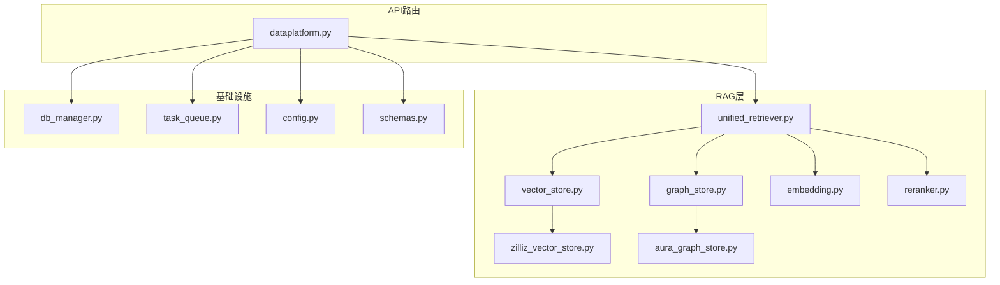
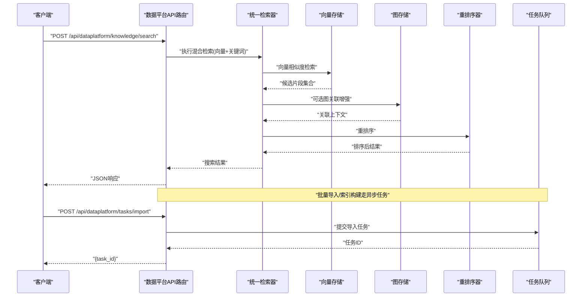
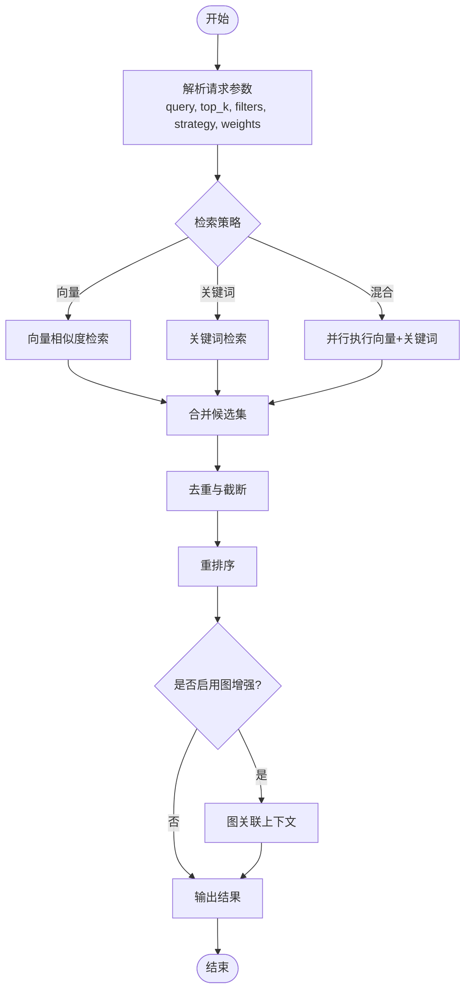
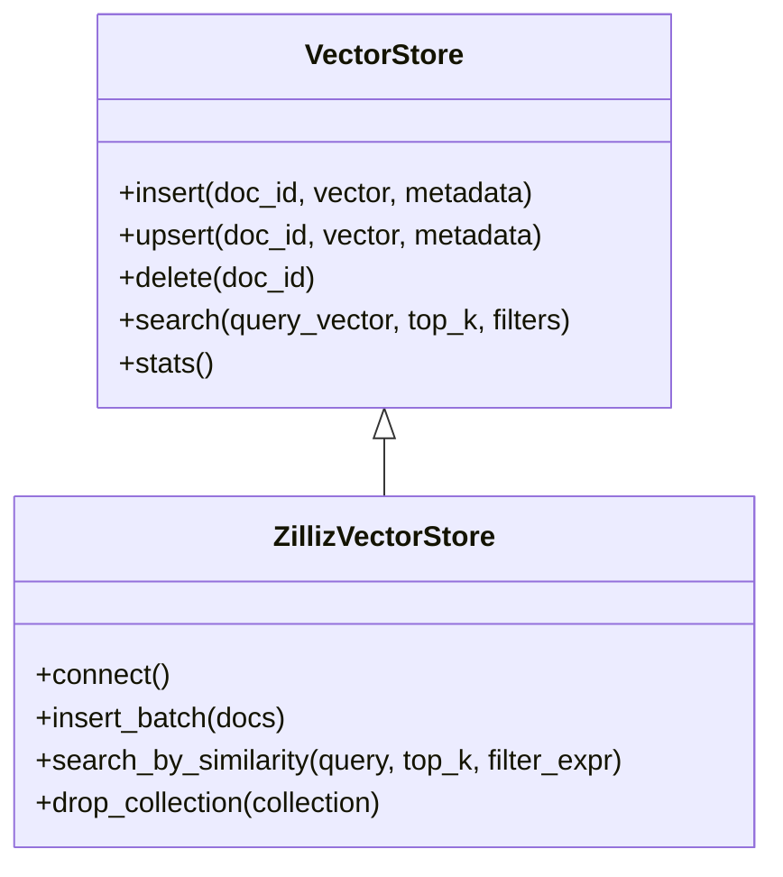
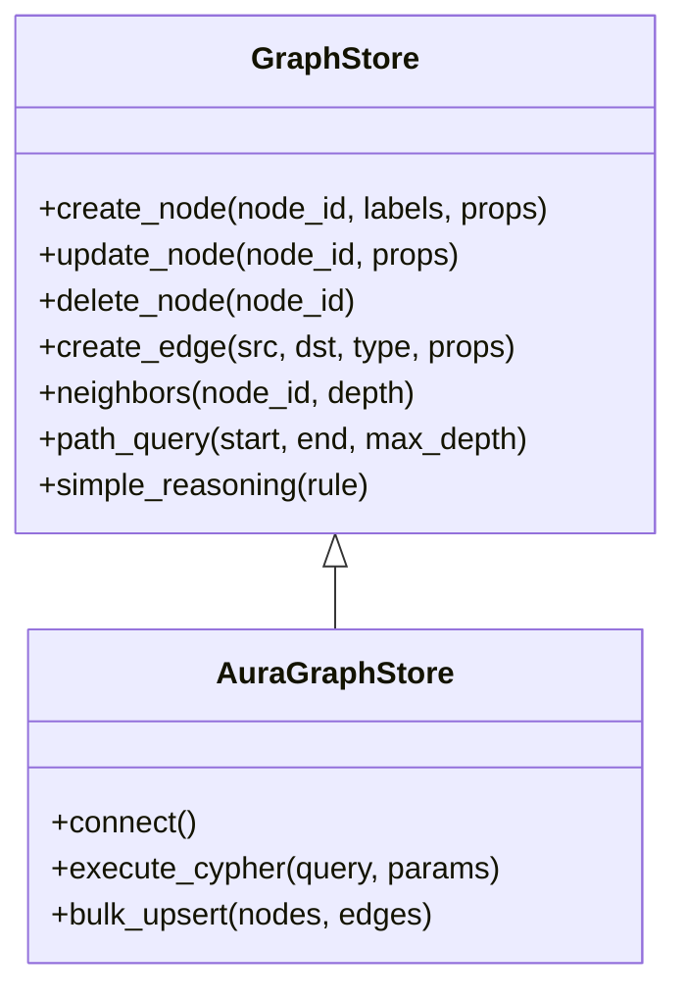
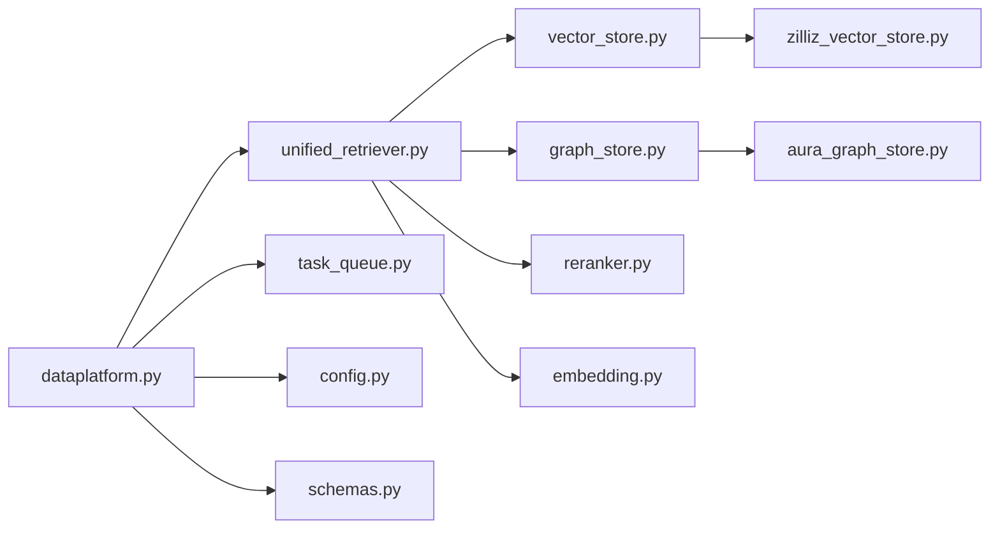

# 数据平台接口

<cite>
**本文引用的文件**   
- [backend_design/nexus/api/routes/dataplatform.py](file://backend_design/nexus/api/routes/dataplatform.py)
- [backend_design/nexus/rag/unified_retriever.py](file://backend_design/nexus/rag/unified_retriever.py)
- [backend_design/nexus/rag/vector_store.py](file://backend_design/nexus/rag/vector_store.py)
- [backend_design/nexus/rag/graph_store.py](file://backend_design/nexus/rag/graph_store.py)
- [backend_design/nexus/rag/aura_graph_store.py](file://backend_design/nexus/rag/aura_graph_store.py)
- [backend_design/nexus/rag/zilliz_vector_store.py](file://backend_design/nexus/rag/zilliz_vector_store.py)
- [backend_design/nexus/rag/embedding.py](file://backend_design/nexus/rag/embedding.py)
- [backend_design/nexus/rag/reranker.py](file://backend_design/nexus/rag/reranker.py)
- [backend_design/nexus/core/db_manager.py](file://backend_design/nexus/core/db_manager.py)
- [backend_design/nexus/middleware/task_queue.py](file://backend_design/nexus/middleware/task_queue.py)
- [backend_design/nexus/models/schemas.py](file://backend_design/nexus/models/schemas.py)
- [backend_design/nexus/config.py](file://backend_design/nexus/config.py)
</cite>

## 目录
1. [简介](#简介)
2. [项目结构](#项目结构)
3. [核心组件](#核心组件)
4. [架构总览](#架构总览)
5. [详细组件分析](#详细组件分析)
6. [依赖分析](#依赖分析)
7. [性能考虑](#性能考虑)
8. [故障排查指南](#故障排查指南)
9. [结论](#结论)
10. [附录](#附录)

## 简介
本文件面向数据平台API接口的开发者与使用者，系统化记录知识库管理、向量检索、知识图谱查询等数据处理相关HTTP端点。文档覆盖文档上传、索引构建、内容管理、语义搜索（向量相似度、关键词匹配、混合检索）、知识图谱查询（节点关系、路径分析、推理计算）、数据导入导出格式、批量操作与异步任务处理，以及数据版本管理、变更追踪和质量评估机制。

## 项目结构
数据平台能力主要位于后端Nexus服务的RAG与API路由层：
- API路由层：提供HTTP端点，负责请求校验、参数解析、调用服务层并返回响应。
- RAG层：封装向量存储、图存储、嵌入模型、重排序器与统一检索编排。
- 基础设施：数据库连接、配置、中间件（任务队列）等支撑能力。

图表来源
- [backend_design/nexus/api/routes/dataplatform.py](file://backend_design/nexus/api/routes/dataplatform.py)
- [backend_design/nexus/rag/unified_retriever.py](file://backend_design/nexus/rag/unified_retriever.py)
- [backend_design/nexus/rag/vector_store.py](file://backend_design/nexus/rag/vector_store.py)
- [backend_design/nexus/rag/zilliz_vector_store.py](file://backend_design/nexus/rag/zilliz_vector_store.py)
- [backend_design/nexus/rag/graph_store.py](file://backend_design/nexus/rag/graph_store.py)
- [backend_design/nexus/rag/aura_graph_store.py](file://backend_design/nexus/rag/aura_graph_store.py)
- [backend_design/nexus/rag/embedding.py](file://backend_design/nexus/rag/embedding.py)
- [backend_design/nexus/rag/reranker.py](file://backend_design/nexus/rag/reranker.py)
- [backend_design/nexus/core/db_manager.py](file://backend_design/nexus/core/db_manager.py)
- [backend_design/nexus/middleware/task_queue.py](file://backend_design/nexus/middleware/task_queue.py)
- [backend_design/nexus/config.py](file://backend_design/nexus/config.py)
- [backend_design/nexus/models/schemas.py](file://backend_design/nexus/models/schemas.py)

章节来源
- [backend_design/nexus/api/routes/dataplatform.py](file://backend_design/nexus/api/routes/dataplatform.py)
- [backend_design/nexus/rag/unified_retriever.py](file://backend_design/nexus/rag/unified_retriever.py)
- [backend_design/nexus/rag/vector_store.py](file://backend_design/nexus/rag/vector_store.py)
- [backend_design/nexus/rag/graph_store.py](file://backend_design/nexus/rag/graph_store.py)
- [backend_design/nexus/rag/aura_graph_store.py](file://backend_design/nexus/rag/aura_graph_store.py)
- [backend_design/nexus/rag/zilliz_vector_store.py](file://backend_design/nexus/rag/zilliz_vector_store.py)
- [backend_design/nexus/rag/embedding.py](file://backend_design/nexus/rag/embedding.py)
- [backend_design/nexus/rag/reranker.py](file://backend_design/nexus/rag/reranker.py)
- [backend_design/nexus/core/db_manager.py](file://backend_design/nexus/core/db_manager.py)
- [backend_design/nexus/middleware/task_queue.py](file://backend_design/nexus/middleware/task_queue.py)
- [backend_design/nexus/config.py](file://backend_design/nexus/config.py)
- [backend_design/nexus/models/schemas.py](file://backend_design/nexus/models/schemas.py)

## 核心组件
- 数据平台API路由：暴露知识库管理、文档上传、索引构建、内容管理、语义搜索、知识图谱查询等HTTP端点；负责鉴权、限流、参数校验、错误码与分页。
- 统一检索器：协调向量检索、关键词检索与重排序，支持混合策略与权重配置。
- 向量存储抽象与实现：定义统一的增删改查与相似度检索接口，具体实现对接Zilliz等向量数据库。
- 图存储抽象与实现：定义图节点的CRUD、边关系、路径查询与简单推理接口，具体实现对接Aura等图数据库。
- 嵌入与重排序：文本向量化与结果重排，提升检索质量。
- 任务队列：用于异步的批量导入、索引构建、大规模更新等耗时任务。
- 配置与模式：集中式配置项与请求/响应数据模型。

章节来源
- [backend_design/nexus/api/routes/dataplatform.py](file://backend_design/nexus/api/routes/dataplatform.py)
- [backend_design/nexus/rag/unified_retriever.py](file://backend_design/nexus/rag/unified_retriever.py)
- [backend_design/nexus/rag/vector_store.py](file://backend_design/nexus/rag/vector_store.py)
- [backend_design/nexus/rag/graph_store.py](file://backend_design/nexus/rag/graph_store.py)
- [backend_design/nexus/rag/aura_graph_store.py](file://backend_design/nexus/rag/aura_graph_store.py)
- [backend_design/nexus/rag/zilliz_vector_store.py](file://backend_design/nexus/rag/zilliz_vector_store.py)
- [backend_design/nexus/rag/embedding.py](file://backend_design/nexus/rag/embedding.py)
- [backend_design/nexus/rag/reranker.py](file://backend_design/nexus/rag/reranker.py)
- [backend_design/nexus/middleware/task_queue.py](file://backend_design/nexus/middleware/task_queue.py)
- [backend_design/nexus/config.py](file://backend_design/nexus/config.py)
- [backend_design/nexus/models/schemas.py](file://backend_design/nexus/models/schemas.py)

## 架构总览
数据平台API采用“路由-服务-存储”分层架构：
- 路由层接收HTTP请求，进行参数校验与权限控制，调用服务层。
- 服务层（统一检索器、任务调度）编排多源检索与批处理流程。
- 存储层通过抽象接口屏蔽底层差异（向量库、图数据库）。

图表来源
- [backend_design/nexus/api/routes/dataplatform.py](file://backend_design/nexus/api/routes/dataplatform.py)
- [backend_design/nexus/rag/unified_retriever.py](file://backend_design/nexus/rag/unified_retriever.py)
- [backend_design/nexus/rag/vector_store.py](file://backend_design/nexus/rag/vector_store.py)
- [backend_design/nexus/rag/graph_store.py](file://backend_design/nexus/rag/graph_store.py)
- [backend_design/nexus/rag/reranker.py](file://backend_design/nexus/rag/reranker.py)
- [backend_design/nexus/middleware/task_queue.py](file://backend_design/nexus/middleware/task_queue.py)

## 详细组件分析

### 数据平台API路由（HTTP端点）
- 功能范围
  - 知识库管理：创建/更新/删除知识库、列出知识库、获取详情。
  - 文档管理：上传文档、更新元数据、删除文档、按条件查询文档列表。
  - 索引管理：触发增量/全量索引构建、查看构建状态与进度。
  - 语义搜索：向量相似度检索、关键词检索、混合检索（可配置权重）。
  - 知识图谱查询：节点查询、关系遍历、路径分析、简单推理。
  - 数据导入导出：批量导入（CSV/JSON/Parquet等）、导出为CSV/JSON。
  - 任务管理：异步任务提交、状态查询、取消任务。
  - 版本与质量：数据版本切换、变更日志查询、质量指标上报与查询。
- 通用约定
  - 认证与授权：基于JWT或会话令牌，支持租户隔离。
  - 分页与过滤：统一分页参数、字段过滤、排序。
  - 错误码：业务错误与系统错误分离，包含错误码、消息与追踪ID。
  - 速率限制：按用户/租户维度限流。
- 典型请求/响应
  - 语义搜索：请求包含query、top_k、filters、strategy（vector/keyword/hybrid）、weights等；响应包含results、score、metadata、trace_id。
  - 文档上传：multipart/form-data或base64，返回doc_id与status；若开启自动索引，返回task_id。
  - 任务状态：GET /tasks/{task_id}，返回status、progress、error等。

章节来源
- [backend_design/nexus/api/routes/dataplatform.py](file://backend_design/nexus/api/routes/dataplatform.py)

### 统一检索器（混合检索与重排序）
- 职责
  - 组合向量检索与关键词检索，支持动态权重与策略选择。
  - 对候选结果进行去重、截断与重排序。
  - 可选接入图存储以增强上下文。
- 关键流程
  - 输入规范化与分词/切块。
  - 并行发起向量与关键词检索。
  - 合并候选集，应用重排序器。
  - 输出带分数与元数据的结构化结果。
- 扩展点
  - 自定义检索策略与权重策略。
  - 插件化重排序器。
  - 图增强开关与深度控制。

图表来源
- [backend_design/nexus/rag/unified_retriever.py](file://backend_design/nexus/rag/unified_retriever.py)
- [backend_design/nexus/rag/vector_store.py](file://backend_design/nexus/rag/vector_store.py)
- [backend_design/nexus/rag/graph_store.py](file://backend_design/nexus/rag/graph_store.py)
- [backend_design/nexus/rag/reranker.py](file://backend_design/nexus/rag/reranker.py)

章节来源
- [backend_design/nexus/rag/unified_retriever.py](file://backend_design/nexus/rag/unified_retriever.py)
- [backend_design/nexus/rag/reranker.py](file://backend_design/nexus/rag/reranker.py)

### 向量存储抽象与实现
- 抽象接口
  - 插入/批量插入向量与元数据。
  - 按向量相似度检索（top_k、阈值过滤）。
  - 按ID删除、更新元数据。
  - 统计信息（集合大小、维度等）。
- 实现要点（Zilliz）
  - 连接池与重试。
  - 分区/标签过滤。
  - 批量写入优化与幂等键。
- 使用建议
  - 合理设置chunk_size与batch_size。
  - 为高频过滤字段建立索引或标签。

图表来源
- [backend_design/nexus/rag/vector_store.py](file://backend_design/nexus/rag/vector_store.py)
- [backend_design/nexus/rag/zilliz_vector_store.py](file://backend_design/nexus/rag/zilliz_vector_store.py)

章节来源
- [backend_design/nexus/rag/vector_store.py](file://backend_design/nexus/rag/vector_store.py)
- [backend_design/nexus/rag/zilliz_vector_store.py](file://backend_design/nexus/rag/zilliz_vector_store.py)

### 图存储抽象与实现
- 抽象接口
  - 节点CRUD、边关系维护。
  - 邻居查询、路径查询、子图提取。
  - 简单推理（规则/模式匹配）。
- 实现要点（Aura）
  - 事务性写入与回滚。
  - 路径查询优化（深度限制、跳数限制）。
  - 标签与属性索引。
- 使用建议
  - 控制查询深度与分支因子，避免爆炸。
  - 对热点节点建立索引。

图表来源
- [backend_design/nexus/rag/graph_store.py](file://backend_design/nexus/rag/graph_store.py)
- [backend_design/nexus/rag/aura_graph_store.py](file://backend_design/nexus/rag/aura_graph_store.py)

章节来源
- [backend_design/nexus/rag/graph_store.py](file://backend_design/nexus/rag/graph_store.py)
- [backend_design/nexus/rag/aura_graph_store.py](file://backend_design/nexus/rag/aura_graph_store.py)

### 嵌入与重排序
- 嵌入模型
  - 文本预处理（清洗、分句、分块）。
  - 生成固定维度向量，支持缓存与批处理。
- 重排序器
  - 基于相关性打分对候选结果重新排序。
  - 支持多种策略（交叉编码器、轻量模型、规则融合）。
- 集成方式
  - 在统一检索器中作为可选阶段。
  - 可通过配置开关与超时保护。

章节来源
- [backend_design/nexus/rag/embedding.py](file://backend_design/nexus/rag/embedding.py)
- [backend_design/nexus/rag/reranker.py](file://backend_design/nexus/rag/reranker.py)

### 任务队列（异步任务）
- 能力
  - 提交批量导入、索引构建、大规模更新等任务。
  - 任务状态查询、进度回调、失败重试与告警。
- 使用场景
  - 大文件上传后的后台切片与入库。
  - 定时全量重建索引。
  - 跨库迁移与一致性校验。

章节来源
- [backend_design/nexus/middleware/task_queue.py](file://backend_design/nexus/middleware/task_queue.py)

### 配置与数据模型
- 配置项
  - 向量库连接、图数据库连接、嵌入模型路径、重排序器开关与阈值。
  - 任务队列并发度、超时与重试策略。
- 数据模型
  - 统一的请求/响应Schema，包括分页、过滤、排序、错误体。
  - 任务对象、索引构建任务、导入导出任务的结构定义。

章节来源
- [backend_design/nexus/config.py](file://backend_design/nexus/config.py)
- [backend_design/nexus/models/schemas.py](file://backend_design/nexus/models/schemas.py)

## 依赖分析
- 耦合关系
  - API路由依赖统一检索器、任务队列、配置与数据模型。
  - 统一检索器依赖向量存储、图存储、嵌入与重排序。
  - 向量/图存储实现分别依赖各自底层数据库驱动。
- 外部依赖
  - 向量数据库（如Zilliz）。
  - 图数据库（如Aura）。
  - 嵌入与重排序模型服务或本地模型。
  - 任务队列中间件（Redis/RabbitMQ等）。

图表来源
- [backend_design/nexus/api/routes/dataplatform.py](file://backend_design/nexus/api/routes/dataplatform.py)
- [backend_design/nexus/rag/unified_retriever.py](file://backend_design/nexus/rag/unified_retriever.py)
- [backend_design/nexus/rag/vector_store.py](file://backend_design/nexus/rag/vector_store.py)
- [backend_design/nexus/rag/graph_store.py](file://backend_design/nexus/rag/graph_store.py)
- [backend_design/nexus/rag/zilliz_vector_store.py](file://backend_design/nexus/rag/zilliz_vector_store.py)
- [backend_design/nexus/rag/aura_graph_store.py](file://backend_design/nexus/rag/aura_graph_store.py)
- [backend_design/nexus/rag/reranker.py](file://backend_design/nexus/rag/reranker.py)
- [backend_design/nexus/rag/embedding.py](file://backend_design/nexus/rag/embedding.py)
- [backend_design/nexus/middleware/task_queue.py](file://backend_design/nexus/middleware/task_queue.py)
- [backend_design/nexus/config.py](file://backend_design/nexus/config.py)
- [backend_design/nexus/models/schemas.py](file://backend_design/nexus/models/schemas.py)

章节来源
- [backend_design/nexus/api/routes/dataplatform.py](file://backend_design/nexus/api/routes/dataplatform.py)
- [backend_design/nexus/rag/unified_retriever.py](file://backend_design/nexus/rag/unified_retriever.py)
- [backend_design/nexus/rag/vector_store.py](file://backend_design/nexus/rag/vector_store.py)
- [backend_design/nexus/rag/graph_store.py](file://backend_design/nexus/rag/graph_store.py)
- [backend_design/nexus/rag/zilliz_vector_store.py](file://backend_design/nexus/rag/zilliz_vector_store.py)
- [backend_design/nexus/rag/aura_graph_store.py](file://backend_design/nexus/rag/aura_graph_store.py)
- [backend_design/nexus/rag/reranker.py](file://backend_design/nexus/rag/reranker.py)
- [backend_design/nexus/rag/embedding.py](file://backend_design/nexus/rag/embedding.py)
- [backend_design/nexus/middleware/task_queue.py](file://backend_design/nexus/middleware/task_queue.py)
- [backend_design/nexus/config.py](file://backend_design/nexus/config.py)
- [backend_design/nexus/models/schemas.py](file://backend_design/nexus/models/schemas.py)

## 性能考虑
- 向量检索
  - 调整top_k与相似度阈值，减少下游开销。
  - 使用批量写入与预取，降低网络往返。
  - 为常用过滤字段建立索引或标签。
- 图查询
  - 限制查询深度与分支因子，避免结果爆炸。
  - 对热点节点与边类型建立索引。
- 重排序
  - 仅在top_n内重排序，平衡精度与延迟。
  - 缓存热门查询的重排序结果。
- 任务队列
  - 合理设置并发度与批大小，避免资源争用。
  - 监控任务堆积与失败率，及时扩容或降级。

[本节为通用指导，不直接分析具体文件]

## 故障排查指南
- 常见问题
  - 向量库连接失败：检查连接参数、网络连通性与凭据。
  - 图查询超时：缩短查询深度、增加索引、拆分复杂查询。
  - 重排序慢：降低top_n、启用缓存或切换到轻量模型。
  - 任务堆积：提高并发度、优化批大小、排查消费者异常。
- 诊断手段
  - 查看任务状态与错误日志。
  - 采集关键指标（P95/P99延迟、错误率、吞吐）。
  - 使用追踪ID定位一次请求的全链路。

章节来源
- [backend_design/nexus/core/db_manager.py](file://backend_design/nexus/core/db_manager.py)
- [backend_design/nexus/middleware/task_queue.py](file://backend_design/nexus/middleware/task_queue.py)

## 结论
数据平台API围绕“检索增强”的核心目标，提供了从文档入库、索引构建到语义搜索与知识图谱查询的一体化能力。通过统一检索器与可扩展的存储抽象，系统在准确性、灵活性与性能之间取得良好平衡。结合任务队列与配置化管理，可满足大规模生产环境的稳定运行需求。

[本节为总结性内容，不直接分析具体文件]

## 附录

### HTTP端点清单（示例）
- 知识库管理
  - POST /api/dataplatform/knowledgebases
  - GET /api/dataplatform/knowledgebases/{id}
  - PUT /api/dataplatform/knowledgebases/{id}
  - DELETE /api/dataplatform/knowledgebases/{id}
  - GET /api/dataplatform/knowledgebases
- 文档管理
  - POST /api/dataplatform/documents/upload
  - GET /api/dataplatform/documents/{id}
  - PUT /api/dataplatform/documents/{id}/metadata
  - DELETE /api/dataplatform/documents/{id}
  - GET /api/dataplatform/documents?kb_id=&page=&size=
- 索引管理
  - POST /api/dataplatform/indexes/build?type=incremental|full
  - GET /api/dataplatform/indexes/status
- 语义搜索
  - POST /api/dataplatform/knowledge/search
- 知识图谱查询
  - POST /api/dataplatform/graph/query
  - POST /api/dataplatform/graph/path
  - POST /api/dataplatform/graph/reason
- 数据导入导出
  - POST /api/dataplatform/tasks/import
  - GET /api/dataplatform/tasks/{task_id}
  - POST /api/dataplatform/export?format=csv|json
- 版本与质量
  - POST /api/dataplatform/versions/switch
  - GET /api/dataplatform/versions/list
  - GET /api/dataplatform/quality/metrics

[本节为概念性清单，不直接分析具体文件]