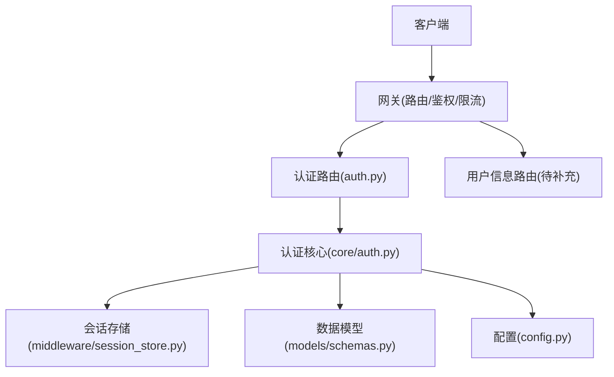
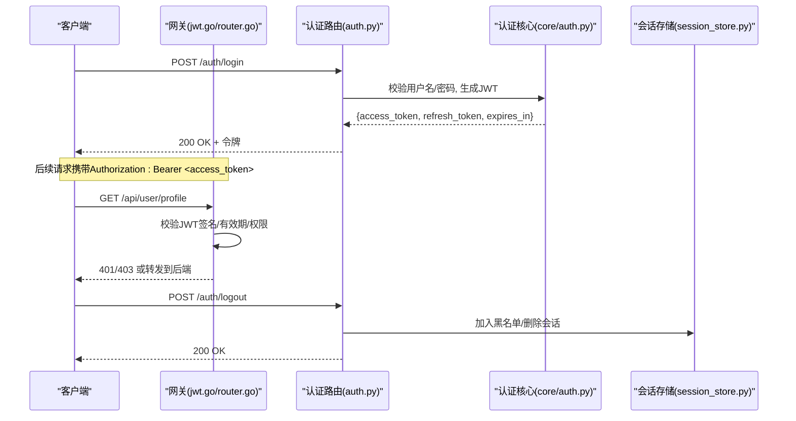
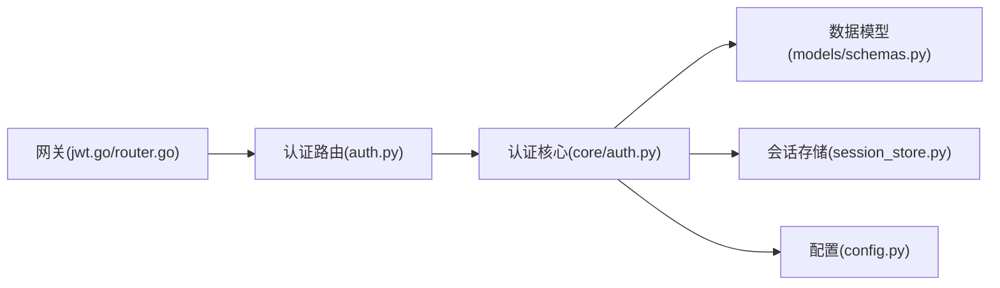

# 用户认证接口

<cite>
**本文引用的文件**   
- [backend_design/nexus/api/routes/auth.py](file://backend_design/nexus/api/routes/auth.py)
- [backend_design/nexus/core/auth.py](file://backend_design/nexus/core/auth.py)
- [backend_design/nexus/middleware/session_store.py](file://backend_design/nexus/middleware/session_store.py)
- [backend_design/nexus/models/schemas.py](file://backend_design/nexus/models/schemas.py)
- [backend_design/nexus/config.py](file://backend_design/nexus/config.py)
- [backend_design/nexus_gate/internal/auth/jwt.go](file://backend_design/nexus_gate/internal/auth/jwt.go)
- [backend_design/nexus_gate/internal/handlers/handlers.go](file://backend_design/nexus_gate/internal/handlers/handlers.go)
- [backend_design/nexus_gate/internal/router/router.go](file://backend_design/nexus_gate/internal/router/router.go)
</cite>

## 目录
1. [简介](#简介)
2. [项目结构](#项目结构)
3. [核心组件](#核心组件)
4. [架构总览](#架构总览)
5. [详细组件分析](#详细组件分析)
6. [依赖分析](#依赖分析)
7. [性能考虑](#性能考虑)
8. [故障排查指南](#故障排查指南)
9. [结论](#结论)
10. [附录](#附录) 

## 简介
本文件面向后端与前端工程师，系统化文档化用户认证相关的所有HTTP端点与机制，覆盖：
- 用户注册、登录、登出、密码重置等认证流程
- JWT令牌的获取、验证与刷新机制（令牌结构、有效期、权限声明）
- 用户信息管理接口（个人资料查询/更新、头像上传）
- 请求/响应示例与错误处理约定
- 安全最佳实践（密码加密、会话管理、防暴力破解）
- OAuth2集成与第三方认证支持方案

## 项目结构
本项目采用前后端分离与网关分层架构：
- 网关层（Go）：负责路由转发、鉴权校验、限流与WebSocket代理
- 业务层（Python/FastAPI）：实现认证、用户信息、聊天、车辆控制等业务API
- 中间件：提供会话存储、缓存、任务队列等能力
- 模型与配置：定义数据模型、配置项与异常体系

图表来源
- [backend_design/nexus_gate/internal/router/router.go](file://backend_design/nexus_gate/internal/router/router.go)
- [backend_design/nexus/api/routes/auth.py](file://backend_design/nexus/api/routes/auth.py)
- [backend_design/nexus/core/auth.py](file://backend_design/nexus/core/auth.py)
- [backend_design/nexus/middleware/session_store.py](file://backend_design/nexus/middleware/session_store.py)
- [backend_design/nexus/models/schemas.py](file://backend_design/nexus/models/schemas.py)
- [backend_design/nexus/config.py](file://backend_design/nexus/config.py)

章节来源
- [backend_design/nexus/api/routes/auth.py](file://backend_design/nexus/api/routes/auth.py)
- [backend_design/nexus/core/auth.py](file://backend_design/nexus/core/auth.py)
- [backend_design/nexus/middleware/session_store.py](file://backend_design/nexus/middleware/session_store.py)
- [backend_design/nexus/models/schemas.py](file://backend_design/nexus/models/schemas.py)
- [backend_design/nexus/config.py](file://backend_design/nexus/config.py)
- [backend_design/nexus_gate/internal/router/router.go](file://backend_design/nexus_gate/internal/router/router.go)

## 核心组件
- 认证路由层：暴露REST API，解析请求参数，调用认证核心逻辑并返回统一响应。
- 认证核心：封装JWT签发/校验、密码哈希校验、会话创建/销毁、权限注入等。
- 会话存储：持久化或内存存储会话状态，支撑登出与黑名单。
- 数据模型：定义用户对象、认证请求/响应结构、权限字段等。
- 配置：集中管理密钥、过期时间、速率限制等安全参数。
- 网关鉴权：在网关侧对JWT进行快速校验与转发，减轻后端压力。

章节来源
- [backend_design/nexus/api/routes/auth.py](file://backend_design/nexus/api/routes/auth.py)
- [backend_design/nexus/core/auth.py](file://backend_design/nexus/core/auth.py)
- [backend_design/nexus/middleware/session_store.py](file://backend_design/nexus/middleware/session_store.py)
- [backend_design/nexus/models/schemas.py](file://backend_design/nexus/models/schemas.py)
- [backend_design/nexus/config.py](file://backend_design/nexus/config.py)
- [backend_design/nexus_gate/internal/auth/jwt.go](file://backend_design/nexus_gate/internal/auth/jwt.go)
- [backend_design/nexus_gate/internal/handlers/handlers.go](file://backend_design/nexus_gate/internal/handlers/handlers.go)
- [backend_design/nexus_gate/internal/router/router.go](file://backend_design/nexus_gate/internal/router/router.go)

## 架构总览
认证链路在网关与后端之间协作完成：
- 登录成功后，后端签发JWT并返回给客户端；同时可选写入会话存储用于登出/黑名单。
- 后续请求携带Authorization: Bearer <token>，由网关使用公钥或共享密钥校验签名与有效期。
- 鉴权通过后，网关将请求转发至后端具体路由；后端可二次校验权限声明。

图表来源
- [backend_design/nexus_gate/internal/auth/jwt.go](file://backend_design/nexus_gate/internal/auth/jwt.go)
- [backend_design/nexus_gate/internal/router/router.go](file://backend_design/nexus_gate/internal/router/router.go)
- [backend_design/nexus/api/routes/auth.py](file://backend_design/nexus/api/routes/auth.py)
- [backend_design/nexus/core/auth.py](file://backend_design/nexus/core/auth.py)
- [backend_design/nexus/middleware/session_store.py](file://backend_design/nexus/middleware/session_store.py)

## 详细组件分析

### 认证路由层（auth.py）
职责：
- 定义认证相关HTTP端点：注册、登录、登出、刷新令牌、密码重置、邮箱验证等
- 解析请求体、校验输入、调用认证核心并返回统一JSON响应
- 处理常见错误码与消息格式

建议的端点清单（以实际代码为准）：
- POST /auth/register：用户注册
- POST /auth/login：用户登录
- POST /auth/logout：用户登出
- POST /auth/token/refresh：刷新访问令牌
- POST /auth/password/reset：密码重置
- POST /auth/password/change：修改密码
- GET /auth/me：当前用户信息（受保护）

章节来源
- [backend_design/nexus/api/routes/auth.py](file://backend_design/nexus/api/routes/auth.py)

### 认证核心（core/auth.py）
职责：
- 密码哈希与校验（建议使用bcrypt/argon2）
- JWT签发与校验（含子声明、角色/权限、过期时间）
- 会话创建/销毁、令牌黑名单管理
- 权限注入与最小权限原则

关键流程要点：
- 登录成功：生成access_token与refresh_token，设置合理过期时间，写入会话存储
- 登出：将access_token加入黑名单或删除会话记录
- 刷新：校验refresh_token有效性，签发新的access_token
- 权限：在JWT中嵌入角色与资源级权限，供网关与后端共同校验

章节来源
- [backend_design/nexus/core/auth.py](file://backend_design/nexus/core/auth.py)

### 会话存储（middleware/session_store.py）
职责：
- 提供会话的增删改查能力
- 支持令牌黑名单与在线会话列表
- 可扩展为Redis/数据库等持久化存储

章节来源
- [backend_design/nexus/middleware/session_store.py](file://backend_design/nexus/middleware/session_store.py)

### 数据模型（models/schemas.py）
职责：
- 定义用户对象、认证请求/响应结构、权限字段
- 规范字段类型、必填项与默认值

典型结构（概念性说明）：
- 用户对象：id、用户名、邮箱、角色、权限集合、头像URL、创建/更新时间
- 登录请求：用户名/邮箱、密码
- 登录响应：access_token、refresh_token、expires_in、用户基本信息
- 错误响应：code、message、details

章节来源
- [backend_design/nexus/models/schemas.py](file://backend_design/nexus/models/schemas.py)

### 配置（config.py）
职责：
- 集中管理JWT密钥、算法、过期时间
- 会话存储连接参数
- 速率限制与安全策略开关

章节来源
- [backend_design/nexus/config.py](file://backend_design/nexus/config.py)

### 网关鉴权（Go）
职责：
- 在网关层对JWT进行签名校验、有效期检查与权限过滤
- 减少后端重复校验开销，提升吞吐

章节来源
- [backend_design/nexus_gate/internal/auth/jwt.go](file://backend_design/nexus_gate/internal/auth/jwt.go)
- [backend_design/nexus_gate/internal/handlers/handlers.go](file://backend_design/nexus_gate/internal/handlers/handlers.go)
- [backend_design/nexus_gate/internal/router/router.go](file://backend_design/nexus_gate/internal/router/router.go)

## 依赖分析
- 路由层依赖认证核心与数据模型
- 认证核心依赖会话存储与配置
- 网关依赖JWT库与路由表
- 整体耦合度适中，通过接口与配置解耦

图表来源
- [backend_design/nexus/api/routes/auth.py](file://backend_design/nexus/api/routes/auth.py)
- [backend_design/nexus/core/auth.py](file://backend_design/nexus/core/auth.py)
- [backend_design/nexus/middleware/session_store.py](file://backend_design/nexus/middleware/session_store.py)
- [backend_design/nexus/models/schemas.py](file://backend_design/nexus/models/schemas.py)
- [backend_design/nexus/config.py](file://backend_design/nexus/config.py)
- [backend_design/nexus_gate/internal/auth/jwt.go](file://backend_design/nexus_gate/internal/auth/jwt.go)
- [backend_design/nexus_gate/internal/router/router.go](file://backend_design/nexus_gate/internal/router/router.go)

章节来源
- [backend_design/nexus/api/routes/auth.py](file://backend_design/nexus/api/routes/auth.py)
- [backend_design/nexus/core/auth.py](file://backend_design/nexus/core/auth.py)
- [backend_design/nexus/middleware/session_store.py](file://backend_design/nexus/middleware/session_store.py)
- [backend_design/nexus/models/schemas.py](file://backend_design/nexus/models/schemas.py)
- [backend_design/nexus/config.py](file://backend_design/nexus/config.py)
- [backend_design/nexus_gate/internal/auth/jwt.go](file://backend_design/nexus_gate/internal/auth/jwt.go)
- [backend_design/nexus_gate/internal/router/router.go](file://backend_design/nexus_gate/internal/router/router.go)

## 性能考虑
- 网关层校验JWT，避免后端重复计算
- 使用短生命周期access_token与长生命周期refresh_token组合
- 会话存储选择高性能KV（如Redis），并启用过期策略
- 对敏感接口实施速率限制与IP/账号维度限流
- 批量操作与懒加载用户信息，减少响应体积

[本节为通用指导，不直接分析具体文件]

## 故障排查指南
常见问题与定位方法：
- 401未授权：检查Authorization头是否正确、JWT是否过期、网关是否放行
- 403禁止访问：检查JWT中的权限声明与目标资源的权限要求
- 登录失败：核对用户名/邮箱与密码、确认密码哈希算法一致
- 刷新失败：确认refresh_token未被吊销、未过期且未被列入黑名单
- 登出不生效：检查会话存储连通性与黑名单写入逻辑

章节来源
- [backend_design/nexus/api/routes/auth.py](file://backend_design/nexus/api/routes/auth.py)
- [backend_design/nexus/core/auth.py](file://backend_design/nexus/core/auth.py)
- [backend_design/nexus/middleware/session_store.py](file://backend_design/nexus/middleware/session_store.py)
- [backend_design/nexus_gate/internal/auth/jwt.go](file://backend_design/nexus_gate/internal/auth/jwt.go)

## 结论
本认证体系通过“网关+后端”的双层鉴权、JWT与会话存储结合、统一的错误与权限模型，提供了高可用、可扩展的用户认证与授权能力。建议在部署时严格管理密钥、开启速率限制与审计日志，并持续优化令牌生命周期与会话清理策略。

[本节为总结性内容，不直接分析具体文件]

## 附录

### HTTP端点与请求/响应约定
- 通用头部
  - Content-Type: application/json
  - Authorization: Bearer <access_token>（受保护接口）
- 通用响应结构
  - code: 数字错误码
  - message: 人类可读消息
  - data: 业务数据（可为空）
- 认证端点（以实际代码为准）
  - POST /auth/register：注册
  - POST /auth/login：登录
  - POST /auth/logout：登出
  - POST /auth/token/refresh：刷新令牌
  - POST /auth/password/reset：密码重置
  - POST /auth/password/change：修改密码
  - GET /auth/me：当前用户信息

章节来源
- [backend_design/nexus/api/routes/auth.py](file://backend_design/nexus/api/routes/auth.py)
- [backend_design/nexus/models/schemas.py](file://backend_design/nexus/models/schemas.py)

### JWT令牌结构与权限声明
- 标准声明
  - sub：主体标识（用户ID）
  - exp：过期时间
  - iat：签发时间
  - iss：签发者
- 自定义声明
  - roles：角色集合
  - permissions：资源级权限
  - tenant_id：租户标识（多租户场景）
- 有效期建议
  - access_token：较短（如5-15分钟）
  - refresh_token：较长（如7-30天），支持吊销

章节来源
- [backend_design/nexus/core/auth.py](file://backend_design/nexus/core/auth.py)
- [backend_design/nexus_gate/internal/auth/jwt.go](file://backend_design/nexus_gate/internal/auth/jwt.go)

### 用户信息管理接口
- GET /api/user/profile：查询个人资料
- PUT /api/user/profile：更新个人资料
- POST /api/user/avatar：上传头像（multipart/form-data）
- DELETE /api/user/avatar：删除头像

章节来源
- [backend_design/nexus/api/routes/auth.py](file://backend_design/nexus/api/routes/auth.py)
- [backend_design/nexus/models/schemas.py](file://backend_design/nexus/models/schemas.py)

### 安全最佳实践
- 密码加密：使用强哈希算法（bcrypt/argon2），禁止明文存储
- 会话管理：登出即失效、支持黑名单、定期清理过期会话
- 防暴力破解：账号维度与IP维度限流、验证码、锁定策略
- 传输安全：全站HTTPS、HSTS、严格CORS策略
- 密钥管理：使用KMS或环境变量管理JWT密钥，定期轮换
- 审计与监控：记录登录、登出、密码变更等关键事件

章节来源
- [backend_design/nexus/core/auth.py](file://backend_design/nexus/core/auth.py)
- [backend_design/nexus/middleware/session_store.py](file://backend_design/nexus/middleware/session_store.py)
- [backend_design/nexus/config.py](file://backend_design/nexus/config.py)

### OAuth2与第三方认证
- 支持OAuth2授权码模式与PKCE
- 第三方提供商：微信、钉钉、企业微信、Google、GitHub等
- 流程要点
  - 前端重定向至第三方授权页
  - 回调后交换授权码换取用户信息与令牌
  - 在本系统内建立本地账户映射或首次引导绑定
  - 签发系统JWT并返回客户端

章节来源
- [backend_design/nexus/core/auth.py](file://backend_design/nexus/core/auth.py)
- [backend_design/nexus/api/routes/auth.py](file://backend_design/nexus/api/routes/auth.py)