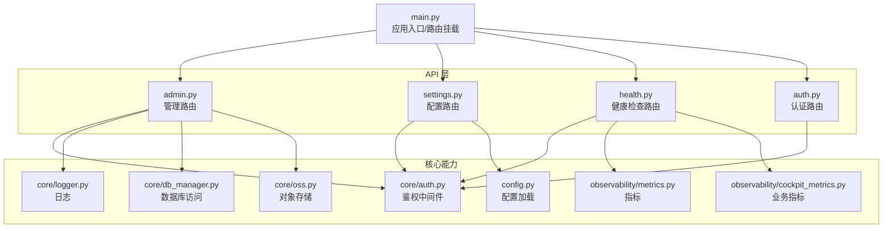
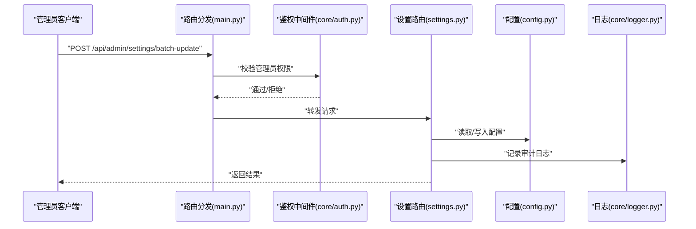
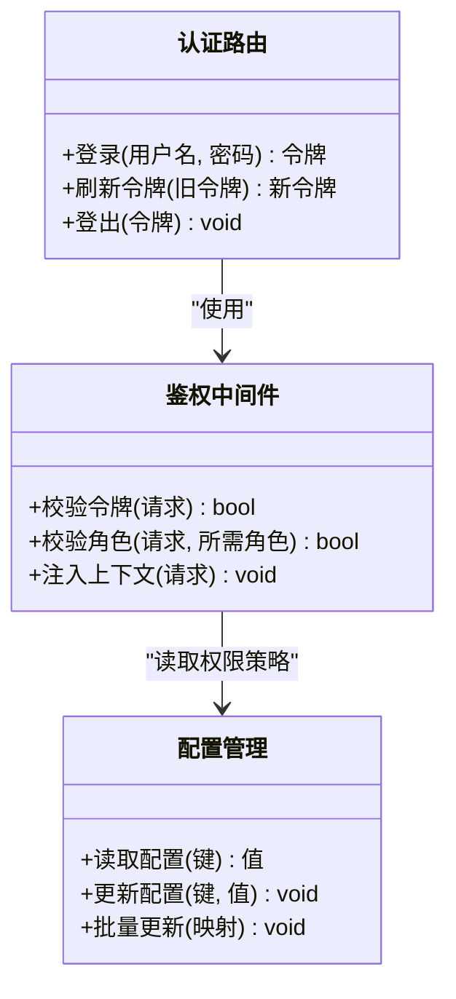
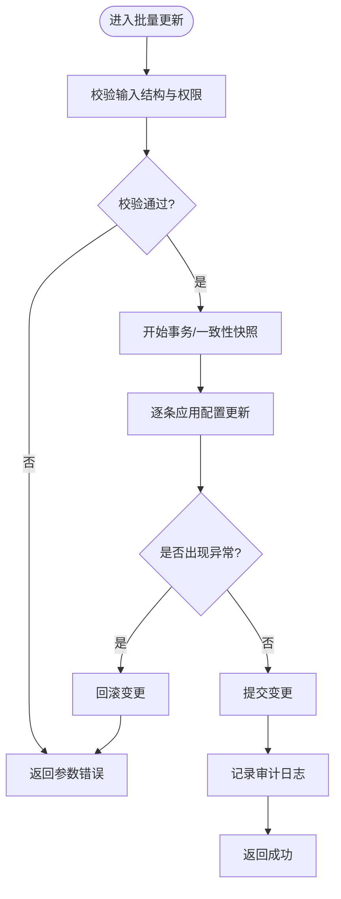
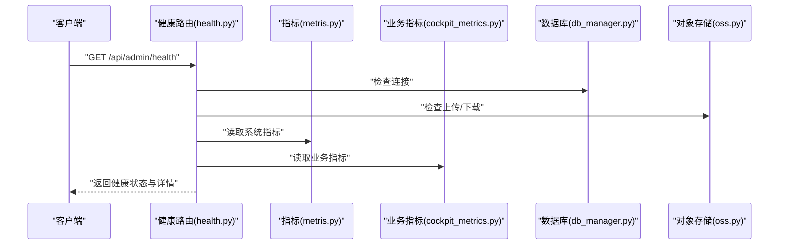
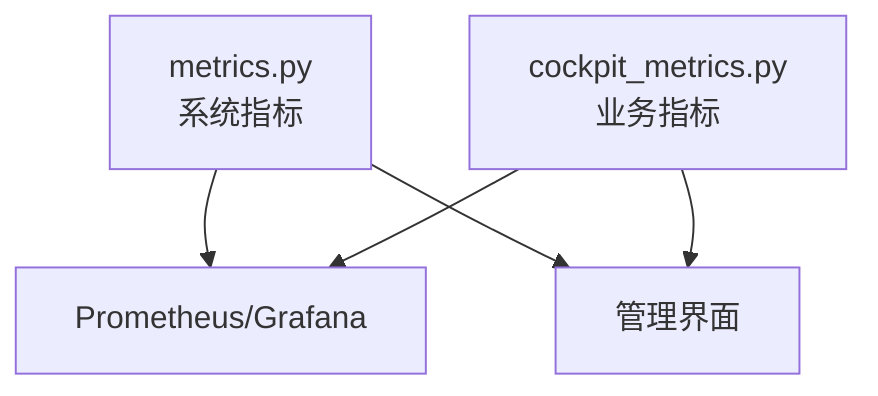
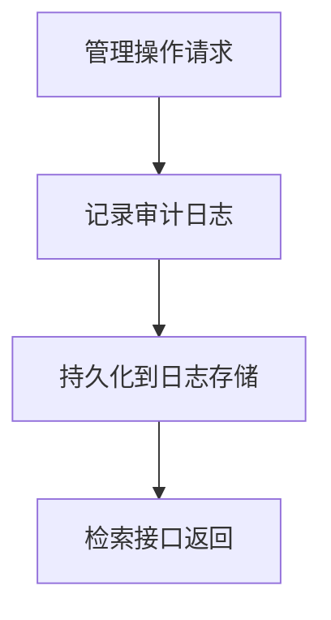
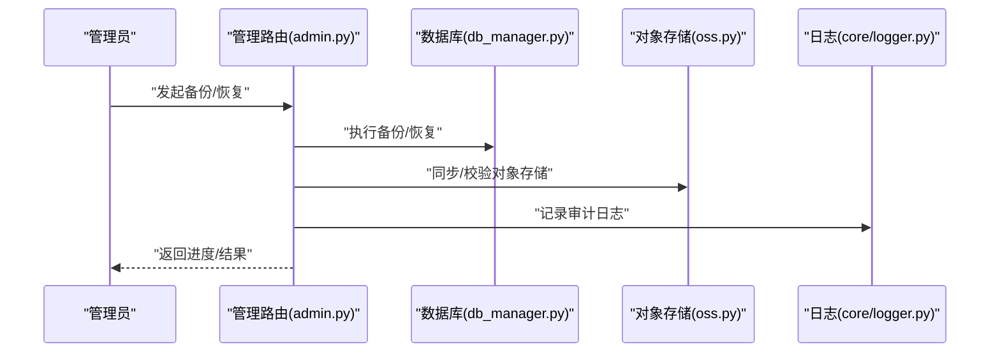
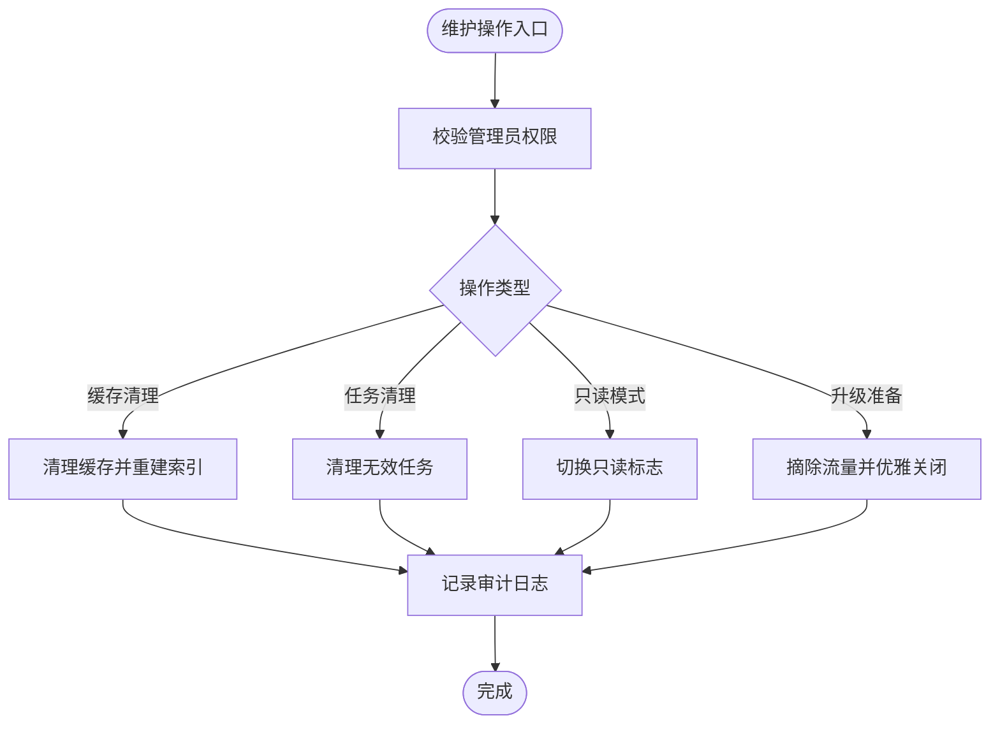
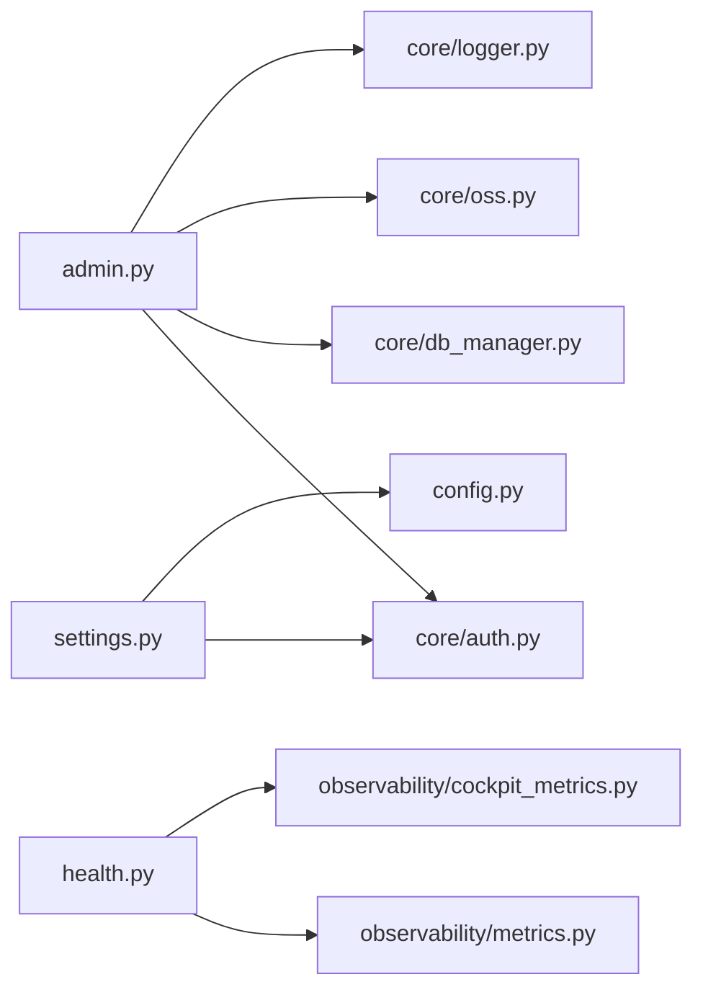

# 管理后台接口

<cite>
**本文引用的文件**   
- [backend_design/nexus/api/routes/admin.py](file://backend_design/nexus/api/routes/admin.py)
- [backend_design/nexus/api/routes/settings.py](file://backend_design/nexus/api/routes/settings.py)
- [backend_design/nexus/api/routes/health.py](file://backend_design/nexus/api/routes/health.py)
- [backend_design/nexus/api/routes/auth.py](file://backend_design/nexus/api/routes/auth.py)
- [backend_design/nexus/core/auth.py](file://backend_design/nexus/core/auth.py)
- [backend_design/nexus/config.py](file://backend_design/nexus/config.py)
- [backend_design/nexus/core/logger.py](file://backend_design/nexus/core/logger.py)
- [backend_design/nexus/observability/metrics.py](file://backend_design/nexus/observability/metrics.py)
- [backend_design/nexus/observability/cockpit_metrics.py](file://backend_design/nexus/observability/cockpit_metrics.py)
- [backend_design/nexus/core/db_manager.py](file://backend_design/nexus/core/db_manager.py)
- [backend_design/nexus/core/oss.py](file://backend_design/nexus/core/oss.py)
- [backend_design/nexus/main.py](file://backend_design/nexus/main.py)
</cite>

## 目录
1. [简介](#简介)
2. [项目结构](#项目结构)
3. [核心组件](#核心组件)
4. [架构总览](#架构总览)
5. [详细组件分析](#详细组件分析)
6. [依赖分析](#依赖分析)
7. [性能考虑](#性能考虑)
8. [故障排查指南](#故障排查指南)
9. [结论](#结论)
10. [附录](#附录)

## 简介
本文件为 NexusCockpit 系统“管理后台”模块的 API 文档，覆盖以下能力：
- 系统配置管理（读取、更新、批量更新）
- 用户与权限管理（管理员鉴权、角色与权限校验）
- 日志查看（应用日志检索、分级过滤）
- 监控指标（系统健康、运行指标、业务指标）
- 数据备份与恢复（数据库与对象存储）
- 系统维护操作（重启、清理缓存、滚动升级准备等）
- 安全要求与审计日志机制

说明：
- 所有管理端点均受管理员权限保护。
- 部分功能依赖外部组件（如数据库、对象存储、日志与监控系统），在不可用时将返回相应错误码。

## 项目结构
管理后台相关路由位于后端 Python 服务中，主要文件如下：
- 管理路由：admin.py、settings.py、health.py
- 认证与鉴权：auth.py（路由）、core/auth.py（中间件）
- 配置与日志：config.py、core/logger.py
- 指标与可观测性：observability/metrics.py、observability/cockpit_metrics.py
- 基础设施：main.py（应用入口与路由挂载）、core/db_manager.py、core/oss.py

图表来源
- [backend_design/nexus/main.py](file://backend_design/nexus/main.py)
- [backend_design/nexus/api/routes/admin.py](file://backend_design/nexus/api/routes/admin.py)
- [backend_design/nexus/api/routes/settings.py](file://backend_design/nexus/api/routes/settings.py)
- [backend_design/nexus/api/routes/health.py](file://backend_design/nexus/api/routes/health.py)
- [backend_design/nexus/api/routes/auth.py](file://backend_design/nexus/api/routes/auth.py)
- [backend_design/nexus/core/auth.py](file://backend_design/nexus/core/auth.py)
- [backend_design/nexus/config.py](file://backend_design/nexus/config.py)
- [backend_design/nexus/core/logger.py](file://backend_design/nexus/core/logger.py)
- [backend_design/nexus/observability/metrics.py](file://backend_design/nexus/observability/metrics.py)
- [backend_design/nexus/observability/cockpit_metrics.py](file://backend_design/nexus/observability/cockpit_metrics.py)
- [backend_design/nexus/core/db_manager.py](file://backend_design/nexus/core/db_manager.py)
- [backend_design/nexus/core/oss.py](file://backend_design/nexus/core/oss.py)

章节来源
- [backend_design/nexus/main.py](file://backend_design/nexus/main.py)
- [backend_design/nexus/api/routes/admin.py](file://backend_design/nexus/api/routes/admin.py)
- [backend_design/nexus/api/routes/settings.py](file://backend_design/nexus/api/routes/settings.py)
- [backend_design/nexus/api/routes/health.py](file://backend_design/nexus/api/routes/health.py)
- [backend_design/nexus/api/routes/auth.py](file://backend_design/nexus/api/routes/auth.py)
- [backend_design/nexus/core/auth.py](file://backend_design/nexus/core/auth.py)
- [backend_design/nexus/config.py](file://backend_design/nexus/config.py)
- [backend_design/nexus/core/logger.py](file://backend_design/nexus/core/logger.py)
- [backend_design/nexus/observability/metrics.py](file://backend_design/nexus/observability/metrics.py)
- [backend_design/nexus/observability/cockpit_metrics.py](file://backend_design/nexus/observability/cockpit_metrics.py)
- [backend_design/nexus/core/db_manager.py](file://backend_design/nexus/core/db_manager.py)
- [backend_design/nexus/core/oss.py](file://backend_design/nexus/core/oss.py)

## 核心组件
- 鉴权与授权中间件：统一拦截 /api/admin/* 请求，校验管理员身份与权限。
- 配置管理：提供配置项的查询、更新与批量更新能力，支持热更新与持久化。
- 健康检查：暴露系统健康状态、依赖组件状态与关键指标摘要。
- 指标采集：暴露运行时指标与业务指标，供 Prometheus/Grafana 拉取或前端展示。
- 日志与审计：记录管理操作的审计日志，支持按级别、时间范围检索。
- 数据备份与恢复：基于数据库与对象存储实现快照与回滚。
- 系统维护：提供缓存清理、任务队列清理、只读模式切换等运维操作。

章节来源
- [backend_design/nexus/core/auth.py](file://backend_design/nexus/core/auth.py)
- [backend_design/nexus/api/routes/settings.py](file://backend_design/nexus/api/routes/settings.py)
- [backend_design/nexus/api/routes/health.py](file://backend_design/nexus/api/routes/health.py)
- [backend_design/nexus/observability/metrics.py](file://backend_design/nexus/observability/metrics.py)
- [backend_design/nexus/observability/cockpit_metrics.py](file://backend_design/nexus/observability/cockpit_metrics.py)
- [backend_design/nexus/core/logger.py](file://backend_design/nexus/core/logger.py)
- [backend_design/nexus/core/db_manager.py](file://backend_design/nexus/core/db_manager.py)
- [backend_design/nexus/core/oss.py](file://backend_design/nexus/core/oss.py)

## 架构总览
管理后台通过统一的鉴权中间件保护所有敏感路由；配置、健康、指标、备份与维护等操作分别由对应路由处理，并调用底层基础设施（数据库、对象存储、日志、指标）。

图表来源
- [backend_design/nexus/main.py](file://backend_design/nexus/main.py)
- [backend_design/nexus/core/auth.py](file://backend_design/nexus/core/auth.py)
- [backend_design/nexus/api/routes/settings.py](file://backend_design/nexus/api/routes/settings.py)
- [backend_design/nexus/config.py](file://backend_design/nexus/config.py)
- [backend_design/nexus/core/logger.py](file://backend_design/nexus/core/logger.py)

## 详细组件分析

### 认证与鉴权
- 管理员登录与令牌签发：用于获取后续管理接口的访问令牌。
- 鉴权中间件：对 /api/admin/* 路径进行统一鉴权，校验令牌有效性及管理员角色。
- 权限模型：支持细粒度权限控制（如配置读写、备份恢复、维护操作等）。

图表来源
- [backend_design/nexus/api/routes/auth.py](file://backend_design/nexus/api/routes/auth.py)
- [backend_design/nexus/core/auth.py](file://backend_design/nexus/core/auth.py)
- [backend_design/nexus/config.py](file://backend_design/nexus/config.py)

章节来源
- [backend_design/nexus/api/routes/auth.py](file://backend_design/nexus/api/routes/auth.py)
- [backend_design/nexus/core/auth.py](file://backend_design/nexus/core/auth.py)

### 系统配置管理
- 读取配置：支持按命名空间或键名精确查询。
- 更新配置：单键更新，支持类型校验与默认值回退。
- 批量更新：原子性提交，失败回滚。
- 配置变更审计：记录操作人、时间、变更前后值。

图表来源
- [backend_design/nexus/api/routes/settings.py](file://backend_design/nexus/api/routes/settings.py)
- [backend_design/nexus/config.py](file://backend_design/nexus/config.py)
- [backend_design/nexus/core/logger.py](file://backend_design/nexus/core/logger.py)

章节来源
- [backend_design/nexus/api/routes/settings.py](file://backend_design/nexus/api/routes/settings.py)
- [backend_design/nexus/config.py](file://backend_design/nexus/config.py)
- [backend_design/nexus/core/logger.py](file://backend_design/nexus/core/logger.py)

### 健康检查与系统状态
- 基础健康：进程存活、端口监听、依赖组件连通性。
- 资源健康：CPU、内存、磁盘、网络等阈值告警。
- 业务健康：消息队列、向量库、图数据库、ASR/TTS 引擎状态。
- 指标摘要：关键指标聚合视图，便于快速定位问题。

图表来源
- [backend_design/nexus/api/routes/health.py](file://backend_design/nexus/api/routes/health.py)
- [backend_design/nexus/observability/metrics.py](file://backend_design/nexus/observability/metrics.py)
- [backend_design/nexus/observability/cockpit_metrics.py](file://backend_design/nexus/observability/cockpit_metrics.py)
- [backend_design/nexus/core/db_manager.py](file://backend_design/nexus/core/db_manager.py)
- [backend_design/nexus/core/oss.py](file://backend_design/nexus/core/oss.py)

章节来源
- [backend_design/nexus/api/routes/health.py](file://backend_design/nexus/api/routes/health.py)
- [backend_design/nexus/observability/metrics.py](file://backend_design/nexus/observability/metrics.py)
- [backend_design/nexus/observability/cockpit_metrics.py](file://backend_design/nexus/observability/cockpit_metrics.py)
- [backend_design/nexus/core/db_manager.py](file://backend_design/nexus/core/db_manager.py)
- [backend_design/nexus/core/oss.py](file://backend_design/nexus/core/oss.py)

### 监控指标
- 系统指标：进程、线程、GC、内存、CPU、I/O、网络。
- 业务指标：对话量、意图识别成功率、TTS/ASR 耗时、RAG 召回率等。
- 导出格式：Prometheus 文本格式或 JSON，供采集器抓取。

图表来源
- [backend_design/nexus/observability/metrics.py](file://backend_design/nexus/observability/metrics.py)
- [backend_design/nexus/observability/cockpit_metrics.py](file://backend_design/nexus/observability/cockpit_metrics.py)

章节来源
- [backend_design/nexus/observability/metrics.py](file://backend_design/nexus/observability/metrics.py)
- [backend_design/nexus/observability/cockpit_metrics.py](file://backend_design/nexus/observability/cockpit_metrics.py)

### 日志查看与审计
- 应用日志：按级别、时间范围、模块检索。
- 审计日志：记录管理操作（谁、何时、做了什么、影响范围）。
- 日志轮转与保留：支持大小与时间维度轮转，过期清理。

图表来源
- [backend_design/nexus/core/logger.py](file://backend_design/nexus/core/logger.py)

章节来源
- [backend_design/nexus/core/logger.py](file://backend_design/nexus/core/logger.py)

### 数据备份与恢复
- 备份：全量/增量快照，包含数据库与对象存储索引。
- 恢复：指定版本恢复，支持预检与回滚。
- 校验：备份完整性校验与一致性检查。

图表来源
- [backend_design/nexus/api/routes/admin.py](file://backend_design/nexus/api/routes/admin.py)
- [backend_design/nexus/core/db_manager.py](file://backend_design/nexus/core/db_manager.py)
- [backend_design/nexus/core/oss.py](file://backend_design/nexus/core/oss.py)
- [backend_design/nexus/core/logger.py](file://backend_design/nexus/core/logger.py)

章节来源
- [backend_design/nexus/api/routes/admin.py](file://backend_design/nexus/api/routes/admin.py)
- [backend_design/nexus/core/db_manager.py](file://backend_design/nexus/core/db_manager.py)
- [backend_design/nexus/core/oss.py](file://backend_design/nexus/core/oss.py)
- [backend_design/nexus/core/logger.py](file://backend_design/nexus/core/logger.py)

### 系统维护操作
- 缓存清理：Redis/本地缓存失效与重建。
- 任务队列清理：清理僵尸任务与重试队列。
- 只读模式：切换系统为只读，防止写入。
- 滚动升级准备：优雅关闭、流量摘除。

图表来源
- [backend_design/nexus/api/routes/admin.py](file://backend_design/nexus/api/routes/admin.py)
- [backend_design/nexus/core/logger.py](file://backend_design/nexus/core/logger.py)

章节来源
- [backend_design/nexus/api/routes/admin.py](file://backend_design/nexus/api/routes/admin.py)
- [backend_design/nexus/core/logger.py](file://backend_design/nexus/core/logger.py)

## 依赖分析
- 路由层依赖鉴权中间件，确保所有管理操作具备强鉴权。
- 配置路由依赖配置模块，保证配置的原子性与一致性。
- 健康检查依赖指标与基础设施组件，综合评估系统可用性。
- 备份与恢复依赖数据库与对象存储，需保证跨组件一致性。
- 审计日志贯穿所有管理操作，便于事后追溯。

图表来源
- [backend_design/nexus/api/routes/admin.py](file://backend_design/nexus/api/routes/admin.py)
- [backend_design/nexus/api/routes/settings.py](file://backend_design/nexus/api/routes/settings.py)
- [backend_design/nexus/api/routes/health.py](file://backend_design/nexus/api/routes/health.py)
- [backend_design/nexus/core/auth.py](file://backend_design/nexus/core/auth.py)
- [backend_design/nexus/config.py](file://backend_design/nexus/config.py)
- [backend_design/nexus/core/logger.py](file://backend_design/nexus/core/logger.py)
- [backend_design/nexus/observability/metrics.py](file://backend_design/nexus/observability/metrics.py)
- [backend_design/nexus/observability/cockpit_metrics.py](file://backend_design/nexus/observability/cockpit_metrics.py)
- [backend_design/nexus/core/db_manager.py](file://backend_design/nexus/core/db_manager.py)
- [backend_design/nexus/core/oss.py](file://backend_design/nexus/core/oss.py)

章节来源
- [backend_design/nexus/api/routes/admin.py](file://backend_design/nexus/api/routes/admin.py)
- [backend_design/nexus/api/routes/settings.py](file://backend_design/nexus/api/routes/settings.py)
- [backend_design/nexus/api/routes/health.py](file://backend_design/nexus/api/routes/health.py)
- [backend_design/nexus/core/auth.py](file://backend_design/nexus/core/auth.py)
- [backend_design/nexus/config.py](file://backend_design/nexus/config.py)
- [backend_design/nexus/core/logger.py](file://backend_design/nexus/core/logger.py)
- [backend_design/nexus/observability/metrics.py](file://backend_design/nexus/observability/metrics.py)
- [backend_design/nexus/observability/cockpit_metrics.py](file://backend_design/nexus/observability/cockpit_metrics.py)
- [backend_design/nexus/core/db_manager.py](file://backend_design/nexus/core/db_manager.py)
- [backend_design/nexus/core/oss.py](file://backend_design/nexus/core/oss.py)

## 性能考虑
- 批量配置更新采用事务/快照机制，避免部分更新导致不一致。
- 健康检查应异步并行探测各依赖，降低整体延迟。
- 指标采集建议采样与聚合，避免高频上报造成开销。
- 备份与恢复应在低峰期执行，并支持断点续传与校验。
- 日志写入采用异步落盘与轮转，避免阻塞主流程。

## 故障排查指南
- 鉴权失败：检查令牌有效期、签名算法、管理员角色配置。
- 配置更新失败：核对键名与类型、权限策略、并发冲突。
- 健康检查异常：逐项检查数据库、对象存储、指标与业务组件。
- 备份/恢复失败：确认存储空间、权限、一致性校验结果。
- 审计日志缺失：检查日志服务可用性与写入权限。

章节来源
- [backend_design/nexus/core/auth.py](file://backend_design/nexus/core/auth.py)
- [backend_design/nexus/api/routes/settings.py](file://backend_design/nexus/api/routes/settings.py)
- [backend_design/nexus/api/routes/health.py](file://backend_design/nexus/api/routes/health.py)
- [backend_design/nexus/core/logger.py](file://backend_design/nexus/core/logger.py)

## 结论
管理后台以鉴权中间件为核心，围绕配置、健康、指标、备份与维护等能力构建统一的管理入口。通过完善的审计日志与健壮的错误处理，保障管理操作的安全性与可追溯性。建议在部署时结合 Prometheus/Grafana 与集中式日志平台，形成完整的可观测体系。

## 附录

### 管理接口清单（示例）
- 认证与鉴权
  - POST /api/admin/auth/login
  - POST /api/admin/auth/refresh
  - POST /api/admin/auth/logout
- 系统配置
  - GET /api/admin/settings/{namespace}/{key}
  - PUT /api/admin/settings/{namespace}/{key}
  - POST /api/admin/settings/batch-update
- 健康检查
  - GET /api/admin/health
- 监控指标
  - GET /api/admin/metrics/system
  - GET /api/admin/metrics/business
- 日志与审计
  - GET /api/admin/logs?level=&start=&end=&module=
  - GET /api/admin/audit?operator=&action=&start=&end=
- 数据备份与恢复
  - POST /api/admin/backup/full
  - POST /api/admin/backup/incremental
  - POST /api/admin/restore/{version}
- 系统维护
  - POST /api/admin/maintenance/clear-cache
  - POST /api/admin/maintenance/clean-queue
  - PUT /api/admin/maintenance/read-only
  - POST /api/admin/maintenance/drain-for-upgrade

注意：
- 以上路径为约定式命名，具体以实际路由注册为准。
- 所有管理接口均需携带有效管理员令牌。

章节来源
- [backend_design/nexus/api/routes/admin.py](file://backend_design/nexus/api/routes/admin.py)
- [backend_design/nexus/api/routes/settings.py](file://backend_design/nexus/api/routes/settings.py)
- [backend_design/nexus/api/routes/health.py](file://backend_design/nexus/api/routes/health.py)
- [backend_design/nexus/api/routes/auth.py](file://backend_design/nexus/api/routes/auth.py)
- [backend_design/nexus/main.py](file://backend_design/nexus/main.py)