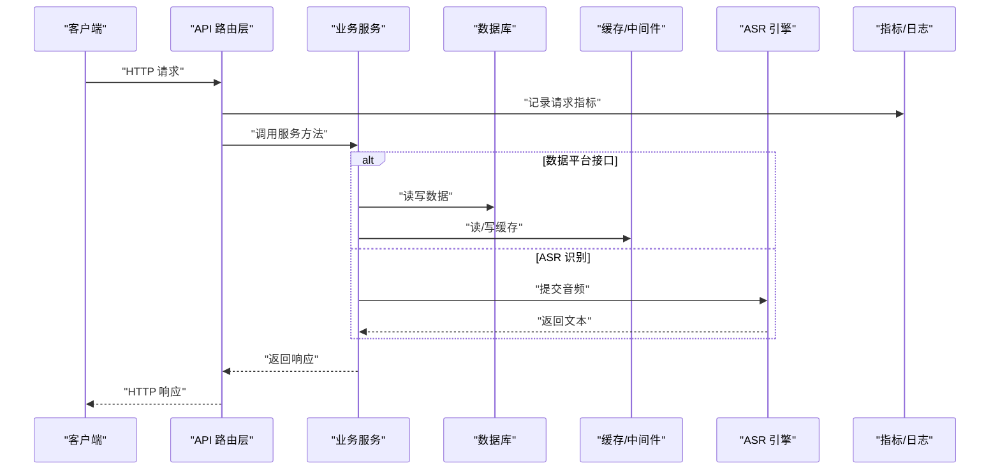
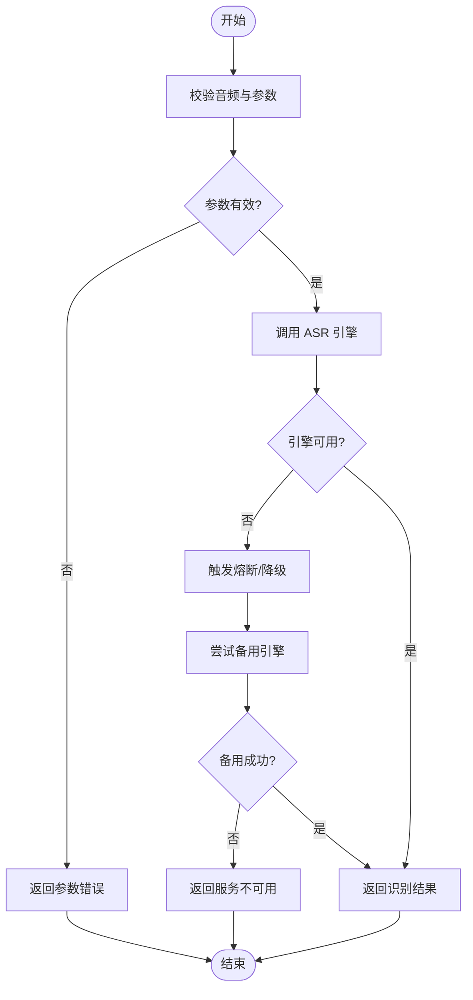
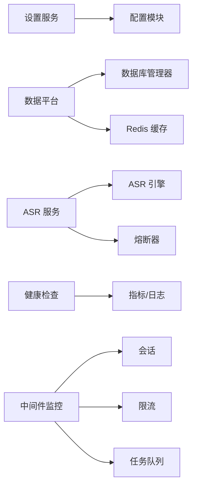

# 系统服务接口

<cite>
**本文引用的文件**   
- [backend_design/nexus/api/routes/settings.py](file://backend_design/nexus/api/routes/settings.py)
- [backend_design/nexus/api/routes/dataplatform.py](file://backend_design/nexus/api/routes/dataplatform.py)
- [backend_design/nexus/api/routes/asr.py](file://backend_design/nexus/api/routes/asr.py)
- [backend_design/nexus/api/routes/health.py](file://backend_design/nexus/api/routes/health.py)
- [backend_design/nexus/api/routes/middleware_status.py](file://backend_design/nexus/api/routes/middleware_status.py)
- [backend_design/nexus/core/db_manager.py](file://backend_design/nexus/core/db_manager.py)
- [backend_design/nexus/asr/engine.py](file://backend_design/nexus/asr/engine.py)
- [backend_design/nexus/config.py](file://backend_design/nexus/config.py)
- [backend_design/nexus/main.py](file://backend_design/nexus/main.py)
- [backend_design/nexus/middleware/session_store.py](file://backend_design/nexus/middleware/session_store.py)
- [backend_design/nexus/middleware/redis_cache.py](file://backend_design/nexus/middleware/redis_cache.py)
- [backend_design/nexus/middleware/rate_limiter.py](file://backend_design/nexus/middleware/rate_limiter.py)
- [backend_design/nexus/middleware/task_queue.py](file://backend_design/nexus/middleware/task_queue.py)
- [backend_design/nexus/core/circuit_breaker.py](file://backend_design/nexus/core/circuit_breaker.py)
- [backend_design/nexus/core/logger.py](file://backend_design/nexus/core/logger.py)
- [backend_design/nexus/core/exceptions.py](file://backend_design/nexus/core/exceptions.py)
- [backend_design/nexus/observability/metrics.py](file://backend_design/nexus/observability/metrics.py)
- [backend_design/nexus/models/schemas.py](file://backend_design/nexus/models/schemas.py)
</cite>

## 目录
1. [简介](#简介)
2. [项目结构](#项目结构)
3. [核心组件](#核心组件)
4. [架构总览](#架构总览)
5. [详细组件分析](#详细组件分析)
6. [依赖关系分析](#依赖关系分析)
7. [性能与负载均衡](#性能与负载均衡)
8. [故障排查指南](#故障排查指南)
9. [结论](#结论)
10. [附录：配置项清单](#附录配置项清单)

## 简介
本文件为 NexusCockpit 通用服务模块的 API 文档，覆盖以下基础服务：
- 系统设置管理：提供配置的读取、更新与校验能力。
- 数据平台接口：面向上层业务的数据存储与查询操作封装。
- 语音识别服务（ASR）：对外暴露音频转文本的统一入口，屏蔽底层引擎差异。
- 健康检查：提供进程级与服务级健康探针。
- 中间件状态监控：集中展示会话、缓存、限流、任务队列等中间件运行态。

文档同时说明各服务的独立接口定义、依赖关系、负载均衡策略、调用示例、通信协议与故障转移机制，帮助使用者快速集成与排障。

## 项目结构
通用服务相关代码主要位于 backend_design/nexus 下，API 路由集中在 api/routes，核心能力由 core、asr、middleware、observability 等模块支撑。

```mermaid
graph TB
subgraph "API 层"
R_Settings["settings.py"]
R_DataPlatform["dataplatform.py"]
R_ASR["asr.py"]
R_Health["health.py"]
R_MWStatus["middleware_status.py"]
end
subgraph "核心能力"
C_DB["core/db_manager.py"]
C_Config["config.py"]
C_CircuitBreaker["core/circuit_breaker.py"]
C_Logger["core/logger.py"]
C_Exceptions["core/exceptions.py"]
end
subgraph "ASR 引擎"
A_Engine["asr/engine.py"]
end
subgraph "中间件"
M_Session["middleware/session_store.py"]
M_Redis["middleware/redis_cache.py"]
M_RateLimit["middleware/rate_limiter.py"]
M_TaskQueue["middleware/task_queue.py"]
end
subgraph "可观测性"
O_Metrics["observability/metrics.py"]
end
R_Settings --> C_Config
R_DataPlatform --> C_DB
R_ASR --> A_Engine
R_ASR --> C_CircuitBreaker
R_MWStatus --> M_Session
R_MWStatus --> M_Redis
R_MWStatus --> M_RateLimit
R_MWStatus --> M_TaskQueue
R_Health --> C_Logger
R_Health --> O_Metrics
R_Settings --> C_Logger
R_DataPlatform --> C_Logger
R_ASR --> C_Logger
R_MWStatus --> C_Logger
```

图表来源
- [backend_design/nexus/api/routes/settings.py](file://backend_design/nexus/api/routes/settings.py)
- [backend_design/nexus/api/routes/dataplatform.py](file://backend_design/nexus/api/routes/dataplatform.py)
- [backend_design/nexus/api/routes/asr.py](file://backend_design/nexus/api/routes/asr.py)
- [backend_design/nexus/api/routes/health.py](file://backend_design/nexus/api/routes/health.py)
- [backend_design/nexus/api/routes/middleware_status.py](file://backend_design/nexus/api/routes/middleware_status.py)
- [backend_design/nexus/core/db_manager.py](file://backend_design/nexus/core/db_manager.py)
- [backend_design/nexus/asr/engine.py](file://backend_design/nexus/asr/engine.py)
- [backend_design/nexus/config.py](file://backend_design/nexus/config.py)
- [backend_design/nexus/core/circuit_breaker.py](file://backend_design/nexus/core/circuit_breaker.py)
- [backend_design/nexus/core/logger.py](file://backend_design/nexus/core/logger.py)
- [backend_design/nexus/core/exceptions.py](file://backend_design/nexus/core/exceptions.py)
- [backend_design/nexus/middleware/session_store.py](file://backend_design/nexus/middleware/session_store.py)
- [backend_design/nexus/middleware/redis_cache.py](file://backend_design/nexus/middleware/redis_cache.py)
- [backend_design/nexus/middleware/rate_limiter.py](file://backend_design/nexus/middleware/rate_limiter.py)
- [backend_design/nexus/middleware/task_queue.py](file://backend_design/nexus/middleware/task_queue.py)
- [backend_design/nexus/observability/metrics.py](file://backend_design/nexus/observability/metrics.py)

章节来源
- [backend_design/nexus/main.py](file://backend_design/nexus/main.py)

## 核心组件
- 系统设置管理
  - 职责：统一加载、校验、持久化系统配置；提供热更新与回滚能力。
  - 关键依赖：配置中心/配置文件、日志、异常处理。
- 数据平台接口
  - 职责：对数据库访问进行封装，提供增删改查、事务、分页、过滤等通用能力。
  - 关键依赖：数据库连接管理器、ORM/驱动、日志、异常。
- 语音识别服务（ASR）
  - 职责：接收音频流或文件，调用 ASR 引擎进行识别，返回文本结果；支持熔断降级。
  - 关键依赖：ASR 引擎、熔断器、日志、指标上报。
- 健康检查
  - 职责：输出进程、依赖（DB、Redis、ASR）健康状态，供网关或编排系统探测。
  - 关键依赖：日志、指标、各依赖探针。
- 中间件状态监控
  - 职责：聚合会话、缓存、限流、任务队列的运行态信息，便于运维诊断。
  - 关键依赖：各中间件内部状态接口、日志。

章节来源
- [backend_design/nexus/api/routes/settings.py](file://backend_design/nexus/api/routes/settings.py)
- [backend_design/nexus/api/routes/dataplatform.py](file://backend_design/nexus/api/routes/dataplatform.py)
- [backend_design/nexus/api/routes/asr.py](file://backend_design/nexus/api/routes/asr.py)
- [backend_design/nexus/api/routes/health.py](file://backend_design/nexus/api/routes/health.py)
- [backend_design/nexus/api/routes/middleware_status.py](file://backend_design/nexus/api/routes/middleware_status.py)
- [backend_design/nexus/core/db_manager.py](file://backend_design/nexus/core/db_manager.py)
- [backend_design/nexus/asr/engine.py](file://backend_design/nexus/asr/engine.py)
- [backend_design/nexus/core/circuit_breaker.py](file://backend_design/nexus/core/circuit_breaker.py)
- [backend_design/nexus/core/logger.py](file://backend_design/nexus/core/logger.py)
- [backend_design/nexus/core/exceptions.py](file://backend_design/nexus/core/exceptions.py)
- [backend_design/nexus/observability/metrics.py](file://backend_design/nexus/observability/metrics.py)

## 架构总览
通用服务以 REST 为主，部分长时任务通过异步队列执行。外部客户端通过 API 路由进入，路由层负责参数校验、鉴权（可选）、日志记录与指标采集，随后委派至具体服务实现。

图表来源
- [backend_design/nexus/api/routes/dataplatform.py](file://backend_design/nexus/api/routes/dataplatform.py)
- [backend_design/nexus/api/routes/asr.py](file://backend_design/nexus/api/routes/asr.py)
- [backend_design/nexus/core/db_manager.py](file://backend_design/nexus/core/db_manager.py)
- [backend_design/nexus/middleware/redis_cache.py](file://backend_design/nexus/middleware/redis_cache.py)
- [backend_design/nexus/asr/engine.py](file://backend_design/nexus/asr/engine.py)
- [backend_design/nexus/observability/metrics.py](file://backend_design/nexus/observability/metrics.py)

## 详细组件分析

### 系统设置管理（Settings）
- 目标
  - 提供统一的配置读取、更新、校验与生效流程。
- 典型接口
  - 获取配置：GET /api/v1/settings
  - 更新配置：PUT /api/v1/settings
  - 批量更新：POST /api/v1/settings/batch
  - 重置默认：POST /api/v1/settings/reset
- 输入/输出要点
  - 输入：键值对或结构化配置对象，包含字段名、类型、范围等约束。
  - 输出：当前配置快照、变更摘要、生效时间戳。
- 错误码与异常
  - 参数校验失败、权限不足、写入冲突、回滚失败等。
- 依赖关系
  - 配置中心/本地配置、日志、异常处理。
- 调用示例
  - 场景：更新 ASR 超时阈值并立即生效。
  - 步骤：调用更新接口 -> 校验通过 -> 写入配置 -> 触发热更新回调 -> 返回成功。

章节来源
- [backend_design/nexus/api/routes/settings.py](file://backend_design/nexus/api/routes/settings.py)
- [backend_design/nexus/config.py](file://backend_design/nexus/config.py)
- [backend_design/nexus/core/logger.py](file://backend_design/nexus/core/logger.py)
- [backend_design/nexus/core/exceptions.py](file://backend_design/nexus/core/exceptions.py)

### 数据平台接口（Data Platform）
- 目标
  - 为上层应用提供稳定、一致的数据存取能力，屏蔽底层存储细节。
- 典型接口
  - 创建资源：POST /api/v1/data/{entity}
  - 查询列表：GET /api/v1/data/{entity}?page=&size=&filter=...
  - 获取详情：GET /api/v1/data/{entity}/{id}
  - 更新资源：PUT /api/v1/data/{entity}/{id}
  - 删除资源：DELETE /api/v1/data/{entity}/{id}
  - 批量导入：POST /api/v1/data/{entity}/import
- 输入/输出要点
  - 输入：实体模型、分页与过滤条件、批量导入文件。
  - 输出：实体对象、分页元信息、导入任务 ID。
- 错误码与异常
  - 不存在、重复键、并发冲突、导入失败等。
- 依赖关系
  - 数据库连接管理器、缓存、日志、指标。
- 调用示例
  - 场景：分页查询用户画像并按标签过滤。
  - 步骤：构造查询参数 -> 路由转发 -> 数据平台服务组装查询 -> 命中缓存则直接返回，否则查库并回填缓存。

章节来源
- [backend_design/nexus/api/routes/dataplatform.py](file://backend_design/nexus/api/routes/dataplatform.py)
- [backend_design/nexus/core/db_manager.py](file://backend_design/nexus/core/db_manager.py)
- [backend_design/nexus/middleware/redis_cache.py](file://backend_design/nexus/middleware/redis_cache.py)
- [backend_design/nexus/observability/metrics.py](file://backend_design/nexus/observability/metrics.py)

### 语音识别服务（ASR）
- 目标
  - 提供统一的音频转文本入口，屏蔽不同 ASR 引擎差异，具备熔断与重试能力。
- 典型接口
  - 同步识别：POST /api/v1/asr/transcribe
  - 异步识别：POST /api/v1/asr/transcribe/async
  - 查询结果：GET /api/v1/asr/transcribe/{task_id}
- 输入/输出要点
  - 输入：音频二进制或 URL、采样率、语言、VAD 开关等。
  - 输出：识别文本、置信度、耗时、任务状态。
- 错误码与异常
  - 音频格式不支持、引擎不可用、超时、熔断开启等。
- 依赖关系
  - ASR 引擎、熔断器、日志、指标。
- 调用示例
  - 场景：实时语音转写失败自动降级到备用引擎。
  - 步骤：主引擎调用 -> 失败 -> 熔断器计数 -> 切换备用引擎 -> 返回结果。

图表来源
- [backend_design/nexus/api/routes/asr.py](file://backend_design/nexus/api/routes/asr.py)
- [backend_design/nexus/asr/engine.py](file://backend_design/nexus/asr/engine.py)
- [backend_design/nexus/core/circuit_breaker.py](file://backend_design/nexus/core/circuit_breaker.py)

章节来源
- [backend_design/nexus/api/routes/asr.py](file://backend_design/nexus/api/routes/asr.py)
- [backend_design/nexus/asr/engine.py](file://backend_design/nexus/asr/engine.py)
- [backend_design/nexus/core/circuit_breaker.py](file://backend_design/nexus/core/circuit_breaker.py)
- [backend_design/nexus/core/logger.py](file://backend_design/nexus/core/logger.py)
- [backend_design/nexus/core/exceptions.py](file://backend_design/nexus/core/exceptions.py)

### 健康检查（Health）
- 目标
  - 提供进程与依赖健康状态，用于网关、容器编排与健康探针。
- 典型接口
  - 进程健康：GET /api/v1/health
  - 依赖健康：GET /api/v1/health/deps
- 输出要点
  - 进程状态、启动时间、内存/CPU 使用概览。
  - 依赖项（DB、Redis、ASR）连通性与延迟。
- 错误码与异常
  - 依赖不可达、指标收集失败等。
- 依赖关系
  - 日志、指标、各依赖探针。

章节来源
- [backend_design/nexus/api/routes/health.py](file://backend_design/nexus/api/routes/health.py)
- [backend_design/nexus/core/logger.py](file://backend_design/nexus/core/logger.py)
- [backend_design/nexus/observability/metrics.py](file://backend_design/nexus/observability/metrics.py)

### 中间件状态监控（Middleware Status）
- 目标
  - 汇总会话、缓存、限流、任务队列等中间件的运行态，辅助定位瓶颈与异常。
- 典型接口
  - 会话统计：GET /api/v1/middleware/session/stats
  - 缓存统计：GET /api/v1/middleware/cache/stats
  - 限流统计：GET /api/v1/middleware/ratelimit/stats
  - 任务队列：GET /api/v1/middleware/taskqueue/stats
- 输出要点
  - 活跃会话数、缓存命中率、QPS/令牌剩余、队列长度与消费速率。
- 依赖关系
  - 对应中间件的状态接口、日志。

章节来源
- [backend_design/nexus/api/routes/middleware_status.py](file://backend_design/nexus/api/routes/middleware_status.py)
- [backend_design/nexus/middleware/session_store.py](file://backend_design/nexus/middleware/session_store.py)
- [backend_design/nexus/middleware/redis_cache.py](file://backend_design/nexus/middleware/redis_cache.py)
- [backend_design/nexus/middleware/rate_limiter.py](file://backend_design/nexus/middleware/rate_limiter.py)
- [backend_design/nexus/middleware/task_queue.py](file://backend_design/nexus/middleware/task_queue.py)

## 依赖关系分析
- 组件耦合
  - API 路由层仅依赖服务抽象与基础设施（日志、指标），避免直接耦合具体实现。
  - 数据平台与 ASR 分别依赖数据库与 ASR 引擎，并通过熔断器提升鲁棒性。
- 外部依赖
  - 数据库、Redis、ASR 引擎、消息队列（可选）。
- 循环依赖
  - 通过分层与接口隔离避免循环依赖。
- 接口契约
  - 统一错误体与状态码约定，便于前端与网关解析。

图表来源
- [backend_design/nexus/api/routes/settings.py](file://backend_design/nexus/api/routes/settings.py)
- [backend_design/nexus/api/routes/dataplatform.py](file://backend_design/nexus/api/routes/dataplatform.py)
- [backend_design/nexus/api/routes/asr.py](file://backend_design/nexus/api/routes/asr.py)
- [backend_design/nexus/api/routes/health.py](file://backend_design/nexus/api/routes/health.py)
- [backend_design/nexus/api/routes/middleware_status.py](file://backend_design/nexus/api/routes/middleware_status.py)
- [backend_design/nexus/core/db_manager.py](file://backend_design/nexus/core/db_manager.py)
- [backend_design/nexus/middleware/redis_cache.py](file://backend_design/nexus/middleware/redis_cache.py)
- [backend_design/nexus/asr/engine.py](file://backend_design/nexus/asr/engine.py)
- [backend_design/nexus/core/circuit_breaker.py](file://backend_design/nexus/core/circuit_breaker.py)
- [backend_design/nexus/observability/metrics.py](file://backend_design/nexus/observability/metrics.py)

章节来源
- [backend_design/nexus/core/db_manager.py](file://backend_design/nexus/core/db_manager.py)
- [backend_design/nexus/asr/engine.py](file://backend_design/nexus/asr/engine.py)
- [backend_design/nexus/core/circuit_breaker.py](file://backend_design/nexus/core/circuit_breaker.py)
- [backend_design/nexus/middleware/redis_cache.py](file://backend_design/nexus/middleware/redis_cache.py)

## 性能与负载均衡
- 负载均衡策略
  - 多实例部署：基于网关或反向代理的轮询/最少连接策略。
  - ASR 引擎：按地域就近接入，结合熔断与权重动态调整。
  - 数据平台：读写分离与分片扩展，热点数据走缓存。
- 缓存策略
  - 短 TTL + 主动失效，保证一致性与时延平衡。
- 限流与背压
  - 全局与租户维度限流，突发流量削峰填谷。
- 异步与批处理
  - 大文件导入、离线识别采用异步任务队列，提升吞吐。
- 指标与告警
  - 关键路径埋点（P95/P99、错误率、饱和度），配合告警规则。

[本节为通用指导，不直接分析具体文件]

## 故障排查指南
- 常见问题
  - 配置未生效：检查配置写入与热更新回调是否触发。
  - 数据不一致：核对缓存失效与事务边界。
  - ASR 超时：查看熔断器状态与备用引擎可用性。
  - 健康检查失败：逐项检查依赖连通性与延迟。
  - 中间件异常：关注会话泄漏、缓存命中率下降、限流触发、队列堆积。
- 诊断手段
  - 健康检查与依赖健康端点。
  - 中间件状态监控端点。
  - 日志与指标聚合检索。
- 恢复建议
  - 回滚配置、重启异常实例、扩容队列消费者、清理过期会话与缓存。

章节来源
- [backend_design/nexus/api/routes/health.py](file://backend_design/nexus/api/routes/health.py)
- [backend_design/nexus/api/routes/middleware_status.py](file://backend_design/nexus/api/routes/middleware_status.py)
- [backend_design/nexus/core/logger.py](file://backend_design/nexus/core/logger.py)
- [backend_design/nexus/core/exceptions.py](file://backend_design/nexus/core/exceptions.py)
- [backend_design/nexus/observability/metrics.py](file://backend_design/nexus/observability/metrics.py)

## 结论
通用服务模块通过清晰的分层与解耦，提供了稳定的配置管理、数据存储、ASR 识别、健康检查与中间件监控能力。借助熔断、限流、缓存与异步队列等机制，系统在可扩展性与鲁棒性方面具备良好基础。建议在生产环境完善指标与告警体系，持续优化关键路径性能。

[本节为总结性内容，不直接分析具体文件]

## 附录：配置项清单
- 配置来源
  - 环境变量、配置文件、配置中心（按需）。
- 常用配置项
  - 服务端口、日志级别、指标导出地址。
  - 数据库连接串、连接池大小、超时。
  - Redis 地址、密码、命名空间。
  - ASR 引擎地址、超时、重试次数、备用引擎。
  - 限流阈值、缓存 TTL、任务队列并发度。
- 生效方式
  - 启动加载、运行时热更新、变更后自动刷新。

章节来源
- [backend_design/nexus/config.py](file://backend_design/nexus/config.py)
- [backend_design/nexus/core/logger.py](file://backend_design/nexus/core/logger.py)
- [backend_design/nexus/core/db_manager.py](file://backend_design/nexus/core/db_manager.py)
- [backend_design/nexus/middleware/redis_cache.py](file://backend_design/nexus/middleware/redis_cache.py)
- [backend_design/nexus/asr/engine.py](file://backend_design/nexus/asr/engine.py)
- [backend_design/nexus/middleware/rate_limiter.py](file://backend_design/nexus/middleware/rate_limiter.py)
- [backend_design/nexus/middleware/task_queue.py](file://backend_design/nexus/middleware/task_queue.py)