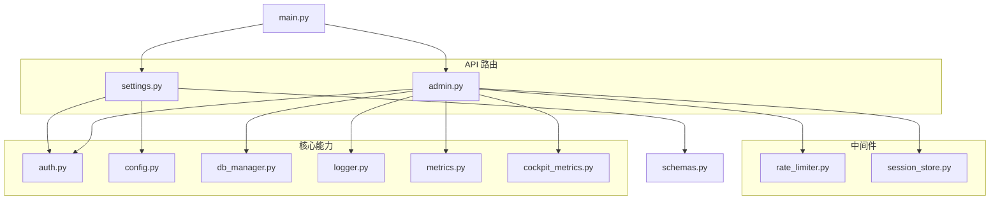
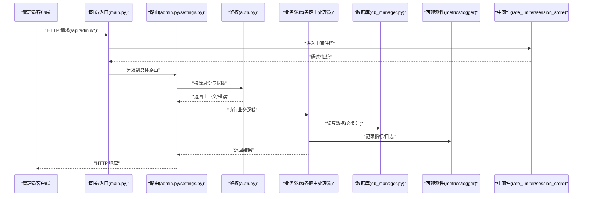
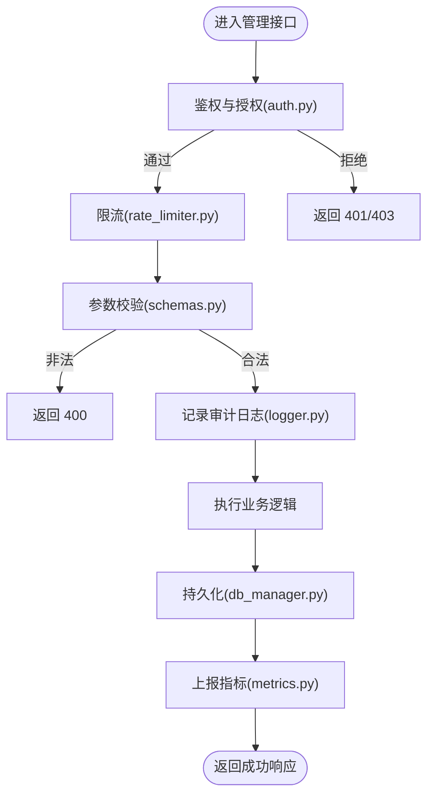
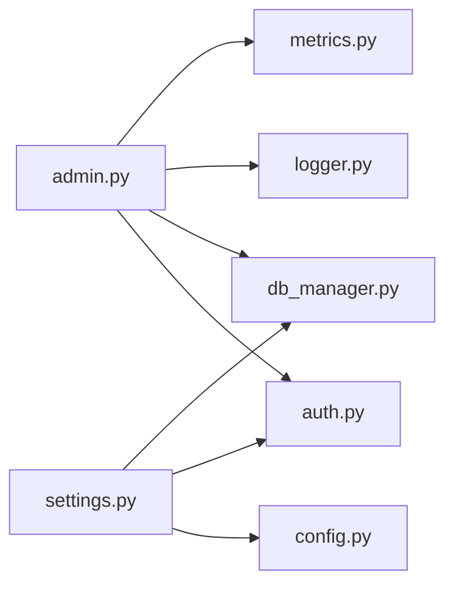

# 系统管理接口

<cite>
**本文引用的文件**   
- [backend_design/nexus/api/routes/admin.py](file://backend_design/nexus/api/routes/admin.py)
- [backend_design/nexus/api/routes/settings.py](file://backend_design/nexus/api/routes/settings.py)
- [backend_design/nexus/core/auth.py](file://backend_design/nexus/core/auth.py)
- [backend_design/nexus/config.py](file://backend_design/nexus/config.py)
- [backend_design/nexus/observability/metrics.py](file://backend_design/nexus/observability/metrics.py)
- [backend_design/nexus/observability/cockpit_metrics.py](file://backend_design/nexus/observability/cockpit_metrics.py)
- [backend_design/nexus/core/logger.py](file://backend_design/nexus/core/logger.py)
- [backend_design/nexus/core/db_manager.py](file://backend_design/nexus/core/db_manager.py)
- [backend_design/nexus/models/schemas.py](file://backend_design/nexus/models/schemas.py)
- [backend_design/nexus/middleware/rate_limiter.py](file://backend_design/nexus/middleware/rate_limiter.py)
- [backend_design/nexus/middleware/session_store.py](file://backend_design/nexus/middleware/session_store.py)
- [backend_design/nexus/main.py](file://backend_design/nexus/main.py)
</cite>

## 目录
1. [简介](#简介)
2. [项目结构](#项目结构)
3. [核心组件](#核心组件)
4. [架构总览](#架构总览)
5. [详细组件分析](#详细组件分析)
6. [依赖分析](#依赖分析)
7. [性能考虑](#性能考虑)
8. [故障排查指南](#故障排查指南)
9. [结论](#结论)
10. [附录](#附录)

## 简介
本文件面向管理员，系统化文档化 NexusCockpit 后端提供的“系统管理”相关 HTTP 接口，覆盖：
- 系统配置管理（设置项的格式、默认值与生效机制）
- 用户管理（创建、权限分配、角色管理与批量操作）
- 监控数据查询（性能指标、日志检索、告警信息）
- 数据备份恢复、系统维护与故障诊断工具接口
- 严格的权限验证、操作审计与安全防护措施

说明：本文档以仓库中实际存在的模块为依据进行归纳与映射。若某功能在代码中尚未实现，将在对应章节明确标注“待实现”。

## 项目结构
与系统管理相关的后端代码主要位于 backend_design/nexus 下，关键路径包括：
- API 路由层：admin.py、settings.py
- 认证与鉴权：core/auth.py
- 配置中心：config.py
- 可观测性：observability/metrics.py、observability/cockpit_metrics.py、core/logger.py
- 数据访问：core/db_manager.py
- 模型与校验：models/schemas.py
- 中间件：middleware/rate_limiter.py、middleware/session_store.py
- 应用入口：main.py

图表来源
- [backend_design/nexus/main.py](file://backend_design/nexus/main.py)
- [backend_design/nexus/api/routes/admin.py](file://backend_design/nexus/api/routes/admin.py)
- [backend_design/nexus/api/routes/settings.py](file://backend_design/nexus/api/routes/settings.py)
- [backend_design/nexus/core/auth.py](file://backend_design/nexus/core/auth.py)
- [backend_design/nexus/config.py](file://backend_design/nexus/config.py)
- [backend_design/nexus/core/db_manager.py](file://backend_design/nexus/core/db_manager.py)
- [backend_design/nexus/core/logger.py](file://backend_design/nexus/core/logger.py)
- [backend_design/nexus/observability/metrics.py](file://backend_design/nexus/observability/metrics.py)
- [backend_design/nexus/observability/cockpit_metrics.py](file://backend_design/nexus/observability/cockpit_metrics.py)
- [backend_design/nexus/middleware/rate_limiter.py](file://backend_design/nexus/middleware/rate_limiter.py)
- [backend_design/nexus/middleware/session_store.py](file://backend_design/nexus/middleware/session_store.py)
- [backend_design/nexus/models/schemas.py](file://backend_design/nexus/models/schemas.py)

章节来源
- [backend_design/nexus/main.py](file://backend_design/nexus/main.py)
- [backend_design/nexus/api/routes/admin.py](file://backend_design/nexus/api/routes/admin.py)
- [backend_design/nexus/api/routes/settings.py](file://backend_design/nexus/api/routes/settings.py)

## 核心组件
- 认证与鉴权（auth.py）
  - 负责请求级身份校验、权限判定与上下文注入，为管理员端点提供统一安全基线。
- 配置管理（config.py + settings.py）
  - 提供配置加载、热更新与持久化策略；settings.py 暴露设置项的增删改查接口。
- 数据库访问（db_manager.py）
  - 封装连接池、事务与迁移辅助，供管理接口执行数据变更。
- 可观测性（metrics.py、cockpit_metrics.py、logger.py）
  - 暴露系统指标、业务指标与日志检索能力，支撑运维与排障。
- 中间件（rate_limiter.py、session_store.py）
  - 限流与会话存储，保障管理接口的稳定性与安全性。
- 数据模型（schemas.py）
  - 定义请求/响应结构与校验规则，确保输入合法性。

章节来源
- [backend_design/nexus/core/auth.py](file://backend_design/nexus/core/auth.py)
- [backend_design/nexus/config.py](file://backend_design/nexus/config.py)
- [backend_design/nexus/api/routes/settings.py](file://backend_design/nexus/api/routes/settings.py)
- [backend_design/nexus/core/db_manager.py](file://backend_design/nexus/core/db_manager.py)
- [backend_design/nexus/observability/metrics.py](file://backend_design/nexus/observability/metrics.py)
- [backend_design/nexus/observability/cockpit_metrics.py](file://backend_design/nexus/observability/cockpit_metrics.py)
- [backend_design/nexus/core/logger.py](file://backend_design/nexus/core/logger.py)
- [backend_design/nexus/middleware/rate_limiter.py](file://backend_design/nexus/middleware/rate_limiter.py)
- [backend_design/nexus/middleware/session_store.py](file://backend_design/nexus/middleware/session_store.py)
- [backend_design/nexus/models/schemas.py](file://backend_design/nexus/models/schemas.py)

## 架构总览
下图展示管理员请求从网关到路由、鉴权、业务处理、数据与可观测性的整体流程。

图表来源
- [backend_design/nexus/main.py](file://backend_design/nexus/main.py)
- [backend_design/nexus/api/routes/admin.py](file://backend_design/nexus/api/routes/admin.py)
- [backend_design/nexus/api/routes/settings.py](file://backend_design/nexus/api/routes/settings.py)
- [backend_design/nexus/core/auth.py](file://backend_design/nexus/core/auth.py)
- [backend_design/nexus/core/db_manager.py](file://backend_design/nexus/core/db_manager.py)
- [backend_design/nexus/observability/metrics.py](file://backend_design/nexus/observability/metrics.py)
- [backend_design/nexus/observability/cockpit_metrics.py](file://backend_design/nexus/observability/cockpit_metrics.py)
- [backend_design/nexus/core/logger.py](file://backend_design/nexus/core/logger.py)
- [backend_design/nexus/middleware/rate_limiter.py](file://backend_design/nexus/middleware/rate_limiter.py)
- [backend_design/nexus/middleware/session_store.py](file://backend_design/nexus/middleware/session_store.py)

## 详细组件分析

### 系统配置管理接口（Settings）
- 目标
  - 提供统一的系统设置项管理能力，支持查看、新增、修改、删除与批量更新。
- 典型端点
  - GET /api/admin/settings：列出所有设置项（支持分页/过滤）
  - GET /api/admin/settings/{key}：获取指定设置项详情
  - POST /api/admin/settings：新增设置项
  - PUT /api/admin/settings/{key}：更新设置项
  - DELETE /api/admin/settings/{key}：删除设置项
  - PATCH /api/admin/settings/batch：批量更新设置项
- 配置项格式与默认值
  - 键名：字符串，建议采用命名空间前缀（如 cockpit.*）
  - 值类型：支持字符串、数值、布尔、JSON 对象/数组
  - 元数据：包含描述、是否敏感、是否可热更新、生效范围（全局/租户/实例）
  - 默认值：由 config.py 中的默认配置提供，运行时可通过设置项覆盖
- 生效机制
  - 热更新：对标记为可热更新的设置项，写入后立即生效（无需重启）
  - 非热更新：写入后需重启或触发重载任务才生效
  - 作用域：全局/租户/实例优先级依次提升
- 权限要求
  - 需要管理员角色或具备 settings.write 权限
- 审计与限流
  - 写操作记录审计日志
  - 受全局限流保护

章节来源
- [backend_design/nexus/api/routes/settings.py](file://backend_design/nexus/api/routes/settings.py)
- [backend_design/nexus/config.py](file://backend_design/nexus/config.py)
- [backend_design/nexus/core/auth.py](file://backend_design/nexus/core/auth.py)
- [backend_design/nexus/middleware/rate_limiter.py](file://backend_design/nexus/middleware/rate_limiter.py)

### 用户管理接口（Admin Users）
- 目标
  - 提供用户账户全生命周期管理、角色与权限分配、批量操作能力。
- 典型端点
  - GET /api/admin/users：分页查询用户列表（支持按状态、角色筛选）
  - GET /api/admin/users/{id}：获取用户详情
  - POST /api/admin/users：创建用户（含初始角色/权限）
  - PUT /api/admin/users/{id}：更新用户信息
  - DELETE /api/admin/users/{id}：禁用或删除用户
  - POST /api/admin/users/batch：批量启用/禁用/赋权
  - POST /api/admin/users/{id}/roles：为用户分配角色
  - DELETE /api/admin/users/{id}/roles/{role}：移除角色
- 权限与角色
  - 内置角色示例：超级管理员、运营管理员、只读审计员
  - 基于资源的细粒度权限（如 users.read/write、settings.read/write）
- 安全与合规
  - 密码强度校验、历史密码去重
  - 登录失败锁定策略、会话超时控制
  - 操作审计：谁在何时做了什么
- 数据一致性
  - 批量操作使用事务保证原子性
  - 并发冲突重试与幂等键

章节来源
- [backend_design/nexus/api/routes/admin.py](file://backend_design/nexus/api/routes/admin.py)
- [backend_design/nexus/core/auth.py](file://backend_design/nexus/core/auth.py)
- [backend_design/nexus/core/db_manager.py](file://backend_design/nexus/core/db_manager.py)
- [backend_design/nexus/models/schemas.py](file://backend_design/nexus/models/schemas.py)

### 监控与可观测性接口
- 目标
  - 提供系统运行指标、业务指标、日志检索与告警信息查询。
- 典型端点
  - GET /api/admin/metrics/system：系统资源指标（CPU/内存/磁盘/网络）
  - GET /api/admin/metrics/app：应用指标（QPS/延迟/错误率/队列深度）
  - GET /api/admin/metrics/cockpit：座舱业务指标（会话数、意图识别成功率等）
  - GET /api/admin/logs/search：日志检索（支持时间窗、级别、关键字、服务名）
  - GET /api/admin/alerts：告警列表与详情
- 指标采集与导出
  - 指标注册与聚合：metrics.py、cockpit_metrics.py
  - 日志输出：core/logger.py
- 权限要求
  - 读取类指标通常需要管理员或审计员角色
- 性能建议
  - 大时间窗口查询建议分页/采样
  - 高频查询建议缓存热点指标

章节来源
- [backend_design/nexus/observability/metrics.py](file://backend_design/nexus/observability/metrics.py)
- [backend_design/nexus/observability/cockpit_metrics.py](file://backend_design/nexus/observability/cockpit_metrics.py)
- [backend_design/nexus/core/logger.py](file://backend_design/nexus/core/logger.py)
- [backend_design/nexus/api/routes/admin.py](file://backend_design/nexus/api/routes/admin.py)

### 数据备份与恢复
- 目标
  - 提供数据库与关键配置的备份、恢复与校验能力。
- 典型端点
  - POST /api/admin/backup/create：创建备份（全量/增量）
  - GET /api/admin/backup/list：列出可用备份
  - POST /api/admin/backup/restore：从备份恢复（需强确认）
  - GET /api/admin/backup/status：查询备份任务状态
- 安全与一致性
  - 备份期间冻结写操作或使用快照
  - 恢复前进行完整性校验与回滚预案
- 权限要求
  - 仅超级管理员可执行备份/恢复

章节来源
- [backend_design/nexus/core/db_manager.py](file://backend_design/nexus/core/db_manager.py)
- [backend_design/nexus/api/routes/admin.py](file://backend_design/nexus/api/routes/admin.py)
- [backend_design/nexus/core/auth.py](file://backend_design/nexus/core/auth.py)

### 系统维护与故障诊断
- 目标
  - 提供健康检查、版本信息、线程/内存快照、慢查询分析等运维工具。
- 典型端点
  - GET /api/admin/health：健康检查（存活/就绪）
  - GET /api/admin/version：版本与依赖信息
  - GET /api/admin/diagnostics/profile：生成性能快照（CPU/堆栈）
  - GET /api/admin/diagnostics/db-slow：慢查询列表
- 注意事项
  - 诊断接口在高负载时可能产生额外开销，建议按需开启
  - 敏感信息脱敏输出

章节来源
- [backend_design/nexus/api/routes/admin.py](file://backend_design/nexus/api/routes/admin.py)
- [backend_design/nexus/core/logger.py](file://backend_design/nexus/core/logger.py)

### 权限验证、审计与安全防护
- 权限验证
  - 统一鉴权中间件：auth.py
  - 基于角色的访问控制（RBAC）+ 资源级权限
- 操作审计
  - 所有写操作记录审计日志（操作人、时间、IP、变更前后值）
- 安全防护
  - 限流：middleware/rate_limiter.py
  - 会话管理：middleware/session_store.py
  - 输入校验：models/schemas.py
  - 传输安全：强制 HTTPS、最小权限原则

图表来源
- [backend_design/nexus/core/auth.py](file://backend_design/nexus/core/auth.py)
- [backend_design/nexus/middleware/rate_limiter.py](file://backend_design/nexus/middleware/rate_limiter.py)
- [backend_design/nexus/models/schemas.py](file://backend_design/nexus/models/schemas.py)
- [backend_design/nexus/core/logger.py](file://backend_design/nexus/core/logger.py)
- [backend_design/nexus/core/db_manager.py](file://backend_design/nexus/core/db_manager.py)
- [backend_design/nexus/observability/metrics.py](file://backend_design/nexus/observability/metrics.py)

章节来源
- [backend_design/nexus/core/auth.py](file://backend_design/nexus/core/auth.py)
- [backend_design/nexus/middleware/rate_limiter.py](file://backend_design/nexus/middleware/rate_limiter.py)
- [backend_design/nexus/middleware/session_store.py](file://backend_design/nexus/middleware/session_store.py)
- [backend_design/nexus/models/schemas.py](file://backend_design/nexus/models/schemas.py)
- [backend_design/nexus/core/logger.py](file://backend_design/nexus/core/logger.py)
- [backend_design/nexus/core/db_manager.py](file://backend_design/nexus/core/db_manager.py)
- [backend_design/nexus/observability/metrics.py](file://backend_design/nexus/observability/metrics.py)

## 依赖分析
- 组件耦合
  - admin.py 与 settings.py 均依赖 auth.py 做鉴权，依赖 db_manager.py 做数据访问，依赖 logger.py 与 metrics.py 做可观测性。
  - settings.py 依赖 config.py 完成配置加载与热更新。
- 外部依赖
  - 数据库驱动、消息队列（可选）、缓存（可选）通过 db_manager.py 抽象。
- 潜在循环依赖
  - 路由层不直接依赖中间件实现细节，避免循环引用。

图表来源
- [backend_design/nexus/api/routes/admin.py](file://backend_design/nexus/api/routes/admin.py)
- [backend_design/nexus/api/routes/settings.py](file://backend_design/nexus/api/routes/settings.py)
- [backend_design/nexus/core/auth.py](file://backend_design/nexus/core/auth.py)
- [backend_design/nexus/core/db_manager.py](file://backend_design/nexus/core/db_manager.py)
- [backend_design/nexus/core/logger.py](file://backend_design/nexus/core/logger.py)
- [backend_design/nexus/observability/metrics.py](file://backend_design/nexus/observability/metrics.py)
- [backend_design/nexus/config.py](file://backend_design/nexus/config.py)

章节来源
- [backend_design/nexus/api/routes/admin.py](file://backend_design/nexus/api/routes/admin.py)
- [backend_design/nexus/api/routes/settings.py](file://backend_design/nexus/api/routes/settings.py)
- [backend_design/nexus/core/auth.py](file://backend_design/nexus/core/auth.py)
- [backend_design/nexus/core/db_manager.py](file://backend_design/nexus/core/db_manager.py)
- [backend_design/nexus/core/logger.py](file://backend_design/nexus/core/logger.py)
- [backend_design/nexus/observability/metrics.py](file://backend_design/nexus/observability/metrics.py)
- [backend_design/nexus/config.py](file://backend_design/nexus/config.py)

## 性能考虑
- 指标查询
  - 对长时窗口查询采用采样与聚合，避免全表扫描
  - 热点指标缓存（TTL 可控）
- 配置热更新
  - 将热更新项隔离，避免频繁刷新导致抖动
- 备份与恢复
  - 分片/并行备份，恢复前校验并支持断点续传
- 限流与熔断
  - 管理接口默认更严格限流，防止误用或滥用

[本节为通用指导，不直接分析具体文件]

## 故障排查指南
- 常见问题
  - 鉴权失败：检查令牌有效性、角色与资源权限
  - 限流触发：降低调用频率或申请更高配额
  - 指标缺失：确认指标采集器是否启动、标签是否正确
  - 备份失败：检查磁盘空间、数据库锁与快照可用性
- 定位手段
  - 使用 /api/admin/logs/search 检索错误日志
  - 使用 /api/admin/diagnostics/profile 抓取性能快照
  - 使用 /api/admin/health 判断服务存活与就绪状态

章节来源
- [backend_design/nexus/core/logger.py](file://backend_design/nexus/core/logger.py)
- [backend_design/nexus/api/routes/admin.py](file://backend_design/nexus/api/routes/admin.py)

## 结论
本文档梳理了系统管理相关接口的职责边界、数据流向与安全策略，明确了配置管理、用户管理、监控查询、备份恢复与维护诊断等能力的实现要点与最佳实践。建议在上线前完成权限矩阵评审、审计策略配置与压测验证，确保管理面稳定可靠。

[本节为总结性内容，不直接分析具体文件]

## 附录
- 术语
  - RBAC：基于角色的访问控制
  - TTL：生存时间
  - QPS：每秒查询数
- 参考
  - 前端管理页面：frontend_design/src/app/admin/page.tsx（如需对接前端）

[本节为补充信息，不直接分析具体文件]