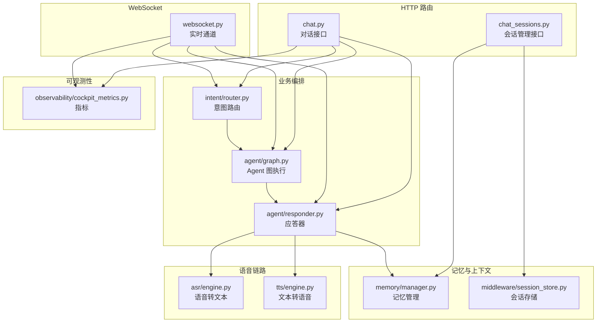
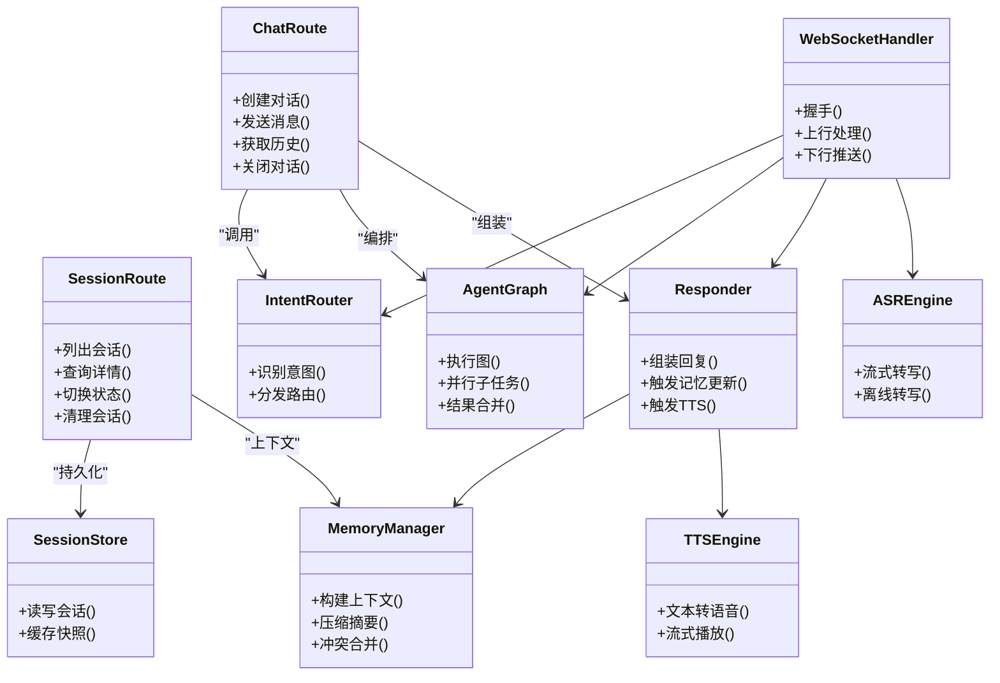
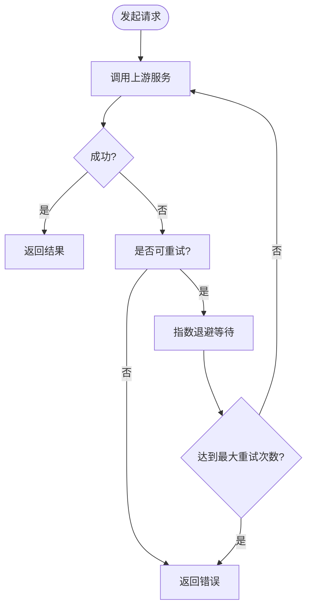

# 聊天对话接口

<cite>
**本文引用的文件**   
- [backend_design/nexus/api/routes/chat.py](file://backend_design/nexus/api/routes/chat.py)
- [backend_design/nexus/api/routes/chat_sessions.py](file://backend_design/nexus/api/routes/chat_sessions.py)
- [backend_design/nexus/api/websocket.py](file://backend_design/nexus/api/websocket.py)
- [backend_design/nexus/core/cockpit_manager.py](file://backend_design/nexus/core/cockpit_manager.py)
- [backend_design/nexus/middleware/session_store.py](file://backend_design/nexus/middleware/session_store.py)
- [backend_design/nexus/memory/manager.py](file://backend_design/nexus/memory/manager.py)
- [backend_design/nexus/models/schemas.py](file://backend_design/nexus/models/schemas.py)
- [backend_design/nexus/asr/engine.py](file://backend_design/nexus/asr/engine.py)
- [backend_design/nexus/tts/engine.py](file://backend_design/nexus/tts/engine.py)
- [backend_design/nexus/intent/router.py](file://backend_design/nexus/intent/router.py)
- [backend_design/nexus/agent/graph.py](file://backend_design/nexus/agent/graph.py)
- [backend_design/nexus/agent/responder.py](file://backend_design/nexus/agent/responder.py)
- [backend_design/nexus/observability/cockpit_metrics.py](file://backend_design/nexus/observability/cockpit_metrics.py)
</cite>

## 目录
1. [简介](#简介)
2. [项目结构](#项目结构)
3. [核心组件](#核心组件)
4. [架构总览](#架构总览)
5. [详细组件分析](#详细组件分析)
6. [依赖分析](#依赖分析)
7. [性能考虑](#性能考虑)
8. [故障排查指南](#故障排查指南)
9. [结论](#结论)
10. [附录](#附录)

## 简介
本文件为 NexusCockpit 系统的“聊天对话模块”提供完整的 API 文档，覆盖多轮对话管理、消息发送与接收、会话状态控制、上下文管理、历史消息查询、持久化策略、消息格式定义、流式响应处理、错误重试机制，以及文本、语音与混合交互场景的端到端流程示例。同时给出性能优化建议与并发处理策略，帮助开发者快速集成与稳定运行。

## 项目结构
聊天相关能力主要分布在以下位置：
- HTTP 路由层：对话与会话管理入口
- WebSocket 通道：实时双向通信与流式推送
- 业务编排：意图识别、Agent 图执行、应答生成
- 记忆与上下文：压缩、冲突合并、会话记忆管理
- 语音链路：ASR/TTS 引擎接入
- 可观测性：指标采集与监控



图表来源
- [backend_design/nexus/api/routes/chat.py](file://backend_design/nexus/api/routes/chat.py)
- [backend_design/nexus/api/routes/chat_sessions.py](file://backend_design/nexus/api/routes/chat_sessions.py)
- [backend_design/nexus/api/websocket.py](file://backend_design/nexus/api/websocket.py)
- [backend_design/nexus/intent/router.py](file://backend_design/nexus/intent/router.py)
- [backend_design/nexus/agent/graph.py](file://backend_design/nexus/agent/graph.py)
- [backend_design/nexus/agent/responder.py](file://backend_design/nexus/agent/responder.py)
- [backend_design/nexus/memory/manager.py](file://backend_design/nexus/memory/manager.py)
- [backend_design/nexus/middleware/session_store.py](file://backend_design/nexus/middleware/session_store.py)
- [backend_design/nexus/asr/engine.py](file://backend_design/nexus/asr/engine.py)
- [backend_design/nexus/tts/engine.py](file://backend_design/nexus/tts/engine.py)
- [backend_design/nexus/observability/cockpit_metrics.py](file://backend_design/nexus/observability/cockpit_metrics.py)

章节来源
- [backend_design/nexus/api/routes/chat.py](file://backend_design/nexus/api/routes/chat.py)
- [backend_design/nexus/api/routes/chat_sessions.py](file://backend_design/nexus/api/routes/chat_sessions.py)
- [backend_design/nexus/api/websocket.py](file://backend_design/nexus/api/websocket.py)

## 核心组件
- 对话路由（chat.py）：提供创建对话、发送消息、获取历史、关闭对话等 REST 接口；支持文本与音频输入；返回普通或流式响应。
- 会话路由（chat_sessions.py）：提供会话列表、详情、状态切换、清理等管理接口；对接会话存储与记忆管理器。
- WebSocket（websocket.py）：建立长连接，承载实时消息收发、流式增量输出、心跳保活与断线重连。
- 意图路由（intent/router.py）：根据用户输入进行意图分类与路由，决定调用领域专家或通用问答。
- Agent 图（agent/graph.py）：编排多步推理、工具调用、外部服务访问与结果聚合。
- 应答器（agent/responder.py）：统一组装最终回复，触发记忆更新、TTS 合成、指标上报。
- 记忆管理（memory/manager.py）：维护对话上下文、摘要压缩、冲突合并与检索增强。
- 会话存储（middleware/session_store.py）：会话元数据与状态的持久化与缓存。
- ASR/TTS（asr/engine.py, tts/engine.py）：语音转文本与文本转语音的引擎封装。
- 指标（observability/cockpit_metrics.py）：记录对话耗时、吞吐、错误率等关键指标。

章节来源
- [backend_design/nexus/api/routes/chat.py](file://backend_design/nexus/api/routes/chat.py)
- [backend_design/nexus/api/routes/chat_sessions.py](file://backend_design/nexus/api/routes/chat_sessions.py)
- [backend_design/nexus/api/websocket.py](file://backend_design/nexus/api/websocket.py)
- [backend_design/nexus/intent/router.py](file://backend_design/nexus/intent/router.py)
- [backend_design/nexus/agent/graph.py](file://backend_design/nexus/agent/graph.py)
- [backend_design/nexus/agent/responder.py](file://backend_design/nexus/agent/responder.py)
- [backend_design/nexus/memory/manager.py](file://backend_design/nexus/memory/manager.py)
- [backend_design/nexus/middleware/session_store.py](file://backend_design/nexus/middleware/session_store.py)
- [backend_design/nexus/asr/engine.py](file://backend_design/nexus/asr/engine.py)
- [backend_design/nexus/tts/engine.py](file://backend_design/nexus/tts/engine.py)
- [backend_design/nexus/observability/cockpit_metrics.py](file://backend_design/nexus/observability/cockpit_metrics.py)

## 架构总览
下图展示一次典型的多轮对话从客户端到后端各层的调用链路与数据流转。

```mermaid
sequenceDiagram
participant C as "客户端"
participant H as "HTTP 路由(chat.py)"
participant W as "WebSocket(websocket.py)"
participant I as "意图路由(intent/router.py)"
participant G as "Agent 图(agent/graph.py)"
participant R as "应答器(agent/responder.py)"
participant M as "记忆管理(memory/manager.py)"
participant S as "会话存储(middleware/session_store.py)"
participant A as "ASR(asr/engine.py)"
participant T as "TTS(tts/engine.py)"
Note over C,H : 文本对话(REST)
C->>H : POST /api/chat/messages
H->>I : 解析并路由意图
I->>G : 执行 Agent 图
G->>R : 产出中间/最终结果
R->>M : 更新上下文/摘要
R->>S : 持久化会话状态
R-->>H : 返回文本或流式片段
H-->>C : 普通响应或 SSE/WebSocket 片段
Note over C,W : 语音对话(WS)
C->>W : 建立连接并发送音频块
W->>A : 流式 ASR 转文本
A-->>W : 返回中间/最终文本
W->>I : 进入对话流程
I->>G->>R->>M->>S
R-->>W : 返回文本片段/音频片段
W-->>C : 实时推送
```

图表来源
- [backend_design/nexus/api/routes/chat.py](file://backend_design/nexus/api/routes/chat.py)
- [backend_design/nexus/api/websocket.py](file://backend_design/nexus/api/websocket.py)
- [backend_design/nexus/intent/router.py](file://backend_design/nexus/intent/router.py)
- [backend_design/nexus/agent/graph.py](file://backend_design/nexus/agent/graph.py)
- [backend_design/nexus/agent/responder.py](file://backend_design/nexus/agent/responder.py)
- [backend_design/nexus/memory/manager.py](file://backend_design/nexus/memory/manager.py)
- [backend_design/nexus/middleware/session_store.py](file://backend_design/nexus/middleware/session_store.py)
- [backend_design/nexus/asr/engine.py](file://backend_design/nexus/asr/engine.py)
- [backend_design/nexus/tts/engine.py](file://backend_design/nexus/tts/engine.py)

## 详细组件分析

### 对话管理接口（REST）
- 功能范围
  - 创建/恢复对话
  - 发送文本或音频消息
  - 获取历史消息
  - 关闭/重置对话
  - 流式响应（SSE/WebSocket 片段）
- 请求/响应要点
  - 文本消息：包含会话标识、消息内容、可选模式（如是否启用语音合成）
  - 音频消息：包含会话标识、音频数据（分片或完整）、采样率/编码格式
  - 流式响应：按片段推送增量文本或音频帧，附带进度与状态码
- 错误与重试
  - 网络/上游超时：指数退避重试
  - 参数校验失败：立即返回错误码与提示
  - 服务不可用：熔断降级与回退策略

章节来源
- [backend_design/nexus/api/routes/chat.py](file://backend_design/nexus/api/routes/chat.py)

### 会话管理接口（REST）
- 功能范围
  - 列出当前用户的会话
  - 查询会话详情与状态
  - 切换会话状态（活跃/挂起/归档）
  - 清理过期会话与历史
- 持久化策略
  - 会话元数据与状态写入持久化存储
  - 高频访问的会话快照缓存于内存/Redis
  - 历史消息按时间窗口滚动归档

章节来源
- [backend_design/nexus/api/routes/chat_sessions.py](file://backend_design/nexus/api/routes/chat_sessions.py)
- [backend_design/nexus/middleware/session_store.py](file://backend_design/nexus/middleware/session_store.py)

### WebSocket 实时通道
- 连接建立
  - 鉴权通过后建立长连接
  - 支持心跳保活与自动重连
- 消息协议
  - 上行：音频块、文本指令、控制命令（开始/停止/重连）
  - 下行：文本增量、音频帧、状态事件（开始/进行中/完成/错误）
- 流式处理
  - 边收边转（ASR 流式）
  - 边算边发（Agent 流式输出）
  - 背压控制与缓冲上限

章节来源
- [backend_design/nexus/api/websocket.py](file://backend_design/nexus/api/websocket.py)

### 意图路由与 Agent 编排
- 意图路由
  - 基于规则与模型双轨识别
  - 将请求分发至领域专家或通用问答
- Agent 图
  - 节点化编排：检索、规划、工具调用、校验
  - 支持并行子任务与结果合并
- 应答器
  - 统一格式化输出
  - 触发记忆更新与 TTS 合成
  - 上报指标与埋点

章节来源
- [backend_design/nexus/intent/router.py](file://backend_design/nexus/intent/router.py)
- [backend_design/nexus/agent/graph.py](file://backend_design/nexus/agent/graph.py)
- [backend_design/nexus/agent/responder.py](file://backend_design/nexus/agent/responder.py)

### 记忆与上下文管理
- 上下文构建
  - 近邻消息窗口 + 摘要压缩
  - 冲突检测与合并策略
- 检索增强
  - 结合知识库与图谱进行召回
- 持久化
  - 会话级上下文快照定期落盘
  - 增量更新避免全量重写

章节来源
- [backend_design/nexus/memory/manager.py](file://backend_design/nexus/memory/manager.py)

### 语音链路（ASR/TTS）
- ASR
  - 支持流式与离线两种模式
  - 返回中间文本与最终结果
- TTS
  - 文本到语音的合成与流式播放
  - 可选音色与语速配置

章节来源
- [backend_design/nexus/asr/engine.py](file://backend_design/nexus/asr/engine.py)
- [backend_design/nexus/tts/engine.py](file://backend_design/nexus/tts/engine.py)

### 可观测性与指标
- 关键指标
  - 对话时延、吞吐、错误率
  - ASR/TTS 成功率与时长
  - 会话创建/销毁速率
- 告警与追踪
  - 异常堆栈与链路追踪 ID
  - 慢请求与资源瓶颈定位

章节来源
- [backend_design/nexus/observability/cockpit_metrics.py](file://backend_design/nexus/observability/cockpit_metrics.py)

## 依赖分析
聊天模块内部依赖关系如下：



图表来源
- [backend_design/nexus/api/routes/chat.py](file://backend_design/nexus/api/routes/chat.py)
- [backend_design/nexus/api/routes/chat_sessions.py](file://backend_design/nexus/api/routes/chat_sessions.py)
- [backend_design/nexus/api/websocket.py](file://backend_design/nexus/api/websocket.py)
- [backend_design/nexus/intent/router.py](file://backend_design/nexus/intent/router.py)
- [backend_design/nexus/agent/graph.py](file://backend_design/nexus/agent/graph.py)
- [backend_design/nexus/agent/responder.py](file://backend_design/nexus/agent/responder.py)
- [backend_design/nexus/memory/manager.py](file://backend_design/nexus/memory/manager.py)
- [backend_design/nexus/middleware/session_store.py](file://backend_design/nexus/middleware/session_store.py)
- [backend_design/nexus/asr/engine.py](file://backend_design/nexus/asr/engine.py)
- [backend_design/nexus/tts/engine.py](file://backend_design/nexus/tts/engine.py)

章节来源
- [backend_design/nexus/api/routes/chat.py](file://backend_design/nexus/api/routes/chat.py)
- [backend_design/nexus/api/routes/chat_sessions.py](file://backend_design/nexus/api/routes/chat_sessions.py)
- [backend_design/nexus/api/websocket.py](file://backend_design/nexus/api/websocket.py)
- [backend_design/nexus/intent/router.py](file://backend_design/nexus/intent/router.py)
- [backend_design/nexus/agent/graph.py](file://backend_design/nexus/agent/graph.py)
- [backend_design/nexus/agent/responder.py](file://backend_design/nexus/agent/responder.py)
- [backend_design/nexus/memory/manager.py](file://backend_design/nexus/memory/manager.py)
- [backend_design/nexus/middleware/session_store.py](file://backend_design/nexus/middleware/session_store.py)
- [backend_design/nexus/asr/engine.py](file://backend_design/nexus/asr/engine.py)
- [backend_design/nexus/tts/engine.py](file://backend_design/nexus/tts/engine.py)

## 性能考虑
- 流式优先
  - 使用 SSE/WebSocket 实现边算边发，降低首字延迟
  - 对 ASR/TTS 采用流式处理，减少端到端时延
- 并发与背压
  - 限制单会话并发度，防止资源争用
  - 设置缓冲区上限与丢弃策略，避免 OOM
- 缓存与索引
  - 热点会话快照缓存，缩短读取路径
  - 历史消息分页与游标查询，避免全表扫描
- 异步与批处理
  - 记忆压缩与摘要更新异步化
  - 指标上报批量写入
- 弹性与容错
  - 上游服务熔断与降级
  - 指数退避重试与幂等键

[本节为通用指导，不直接分析具体文件]

## 故障排查指南
- 常见问题
  - 连接中断：检查心跳间隔与超时阈值，确认客户端重连逻辑
  - 语音不同步：核对采样率、编码格式与帧大小
  - 上下文丢失：检查会话状态切换与快照落盘时机
  - 指标缺失：确认埋点开关与上报通道
- 诊断步骤
  - 通过会话 ID 拉取链路追踪日志
  - 查看 ASR/TTS 成功率与时延分布
  - 检查 Agent 图节点耗时与错误堆栈
  - 验证会话存储读写一致性与缓存命中

章节来源
- [backend_design/nexus/observability/cockpit_metrics.py](file://backend_design/nexus/observability/cockpit_metrics.py)
- [backend_design/nexus/api/websocket.py](file://backend_design/nexus/api/websocket.py)
- [backend_design/nexus/middleware/session_store.py](file://backend_design/nexus/middleware/session_store.py)

## 结论
NexusCockpit 的聊天对话模块以“路由层 + 编排层 + 记忆层 + 语音链路”的分层架构实现高可用、低延迟的对话体验。通过流式传输、上下文压缩、会话持久化与完善的可观测性，满足文本、语音与混合交互场景的生产需求。建议在生产环境开启流式响应、合理配置并发与缓存策略，并结合指标与日志持续优化。

[本节为总结性内容，不直接分析具体文件]

## 附录

### 消息格式定义（概要）
- 文本消息
  - 字段：会话标识、消息内容、模式标志（文本/语音）、扩展参数
  - 响应：文本片段、音频片段、状态事件
- 音频消息
  - 字段：会话标识、音频数据块、编码格式、采样率、分片序号
  - 响应：ASR 中间/最终文本、后续对话片段
- 控制消息
  - 字段：类型（开始/停止/重连/心跳）、会话标识、时间戳
  - 响应：确认回执、状态变更

章节来源
- [backend_design/nexus/api/routes/chat.py](file://backend_design/nexus/api/routes/chat.py)
- [backend_design/nexus/api/websocket.py](file://backend_design/nexus/api/websocket.py)

### 对话流程示例
- 文本对话
  - 客户端发送文本消息 -> 路由层解析 -> 意图路由 -> Agent 图执行 -> 应答器组装 -> 返回文本或流式片段
- 语音对话
  - 客户端建立 WebSocket -> 发送音频块 -> ASR 流式转写 -> 进入对话流程 -> 返回文本/音频片段
- 混合交互
  - 同一会话内交替发送文本与音频，保持上下文连贯，按需触发 TTS 合成

章节来源
- [backend_design/nexus/api/routes/chat.py](file://backend_design/nexus/api/routes/chat.py)
- [backend_design/nexus/api/websocket.py](file://backend_design/nexus/api/websocket.py)
- [backend_design/nexus/intent/router.py](file://backend_design/nexus/intent/router.py)
- [backend_design/nexus/agent/graph.py](file://backend_design/nexus/agent/graph.py)
- [backend_design/nexus/agent/responder.py](file://backend_design/nexus/agent/responder.py)
- [backend_design/nexus/asr/engine.py](file://backend_design/nexus/asr/engine.py)
- [backend_design/nexus/tts/engine.py](file://backend_design/nexus/tts/engine.py)

### 错误重试机制（流程）


图表来源
- [backend_design/nexus/api/routes/chat.py](file://backend_design/nexus/api/routes/chat.py)
- [backend_design/nexus/api/websocket.py](file://backend_design/nexus/api/websocket.py)