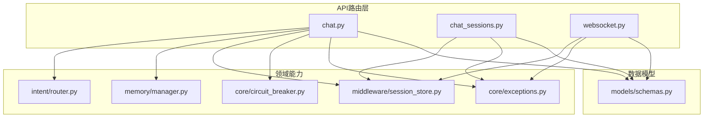
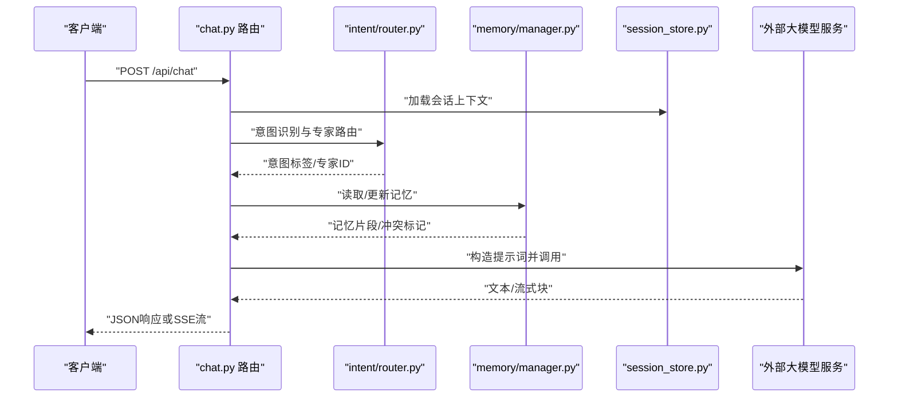
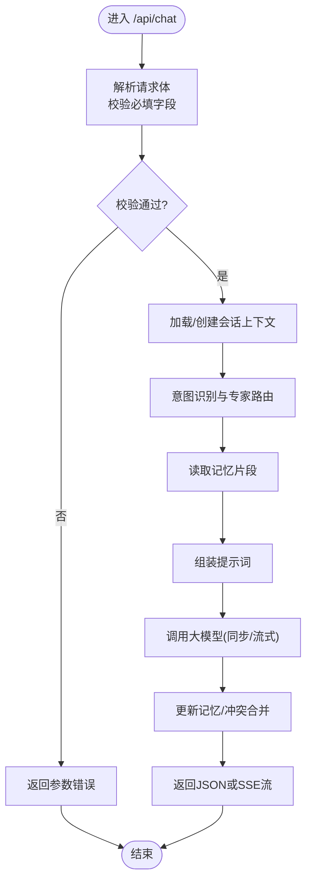
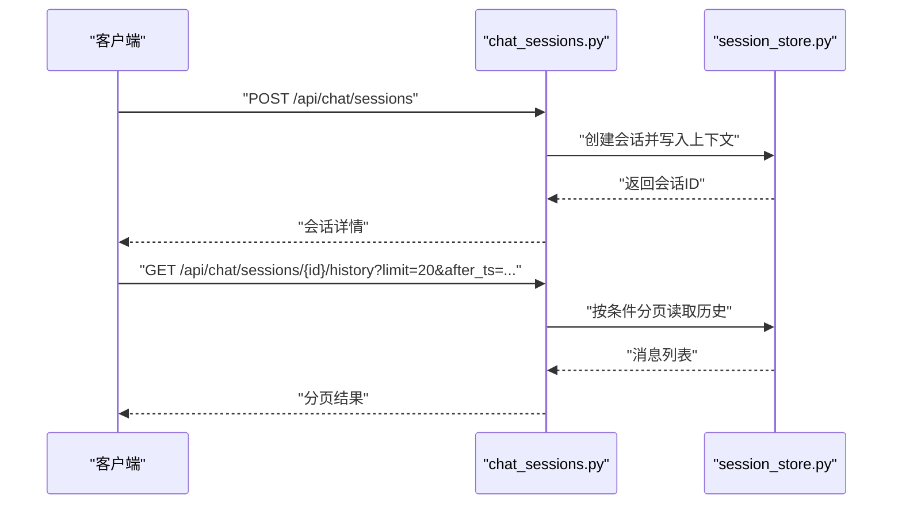
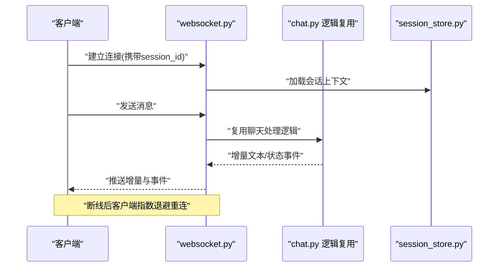
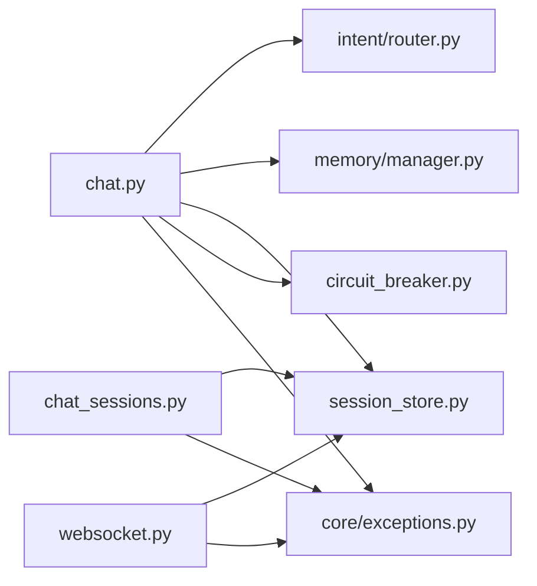

# 聊天对话接口

<cite>
**本文引用的文件**   
- [backend_design/nexus/api/routes/chat.py](file://backend_design/nexus/api/routes/chat.py)
- [backend_design/nexus/api/routes/chat_sessions.py](file://backend_design/nexus/api/routes/chat_sessions.py)
- [backend_design/nexus/api/websocket.py](file://backend_design/nexus/api/websocket.py)
- [backend_design/nexus/models/schemas.py](file://backend_design/nexus/models/schemas.py)
- [backend_design/nexus/middleware/session_store.py](file://backend_design/nexus/middleware/session_store.py)
- [backend_design/nexus/core/exceptions.py](file://backend_design/nexus/core/exceptions.py)
- [backend_design/nexus/intent/router.py](file://backend_design/nexus/intent/router.py)
- [backend_design/nexus/memory/manager.py](file://backend_design/nexus/memory/manager.py)
- [backend_design/nexus/core/circuit_breaker.py](file://backend_design/nexus/core/circuit_breaker.py)
</cite>

## 目录
1. [简介](#简介)
2. [项目结构](#项目结构)
3. [核心组件](#核心组件)
4. [架构总览](#架构总览)
5. [详细组件分析](#详细组件分析)
6. [依赖分析](#依赖分析)
7. [性能考虑](#性能考虑)
8. [故障排查指南](#故障排查指南)
9. [结论](#结论)
10. [附录](#附录) 

## 简介
本文件面向开发者与集成方，系统化文档化聊天对话相关HTTP与WebSocket接口，覆盖：
- 文本对话、多轮对话管理、会话历史查询
- 消息发送格式、接收结构与流式响应处理
- 会话创建、上下文保持与历史记录检索
- AI对话完整请求/响应示例（用户输入、系统回复、元数据与状态）
- 意图识别结果、专家路由信息、记忆提取数据
- 错误处理、超时重试与连接恢复策略

## 项目结构
与聊天对话API直接相关的后端模块位于 backend_design/nexus 下，关键文件包括：
- API路由层：chat.py、chat_sessions.py、websocket.py
- 数据模型与Schema：models/schemas.py
- 会话存储中间件：middleware/session_store.py
- 异常定义：core/exceptions.py
- 意图路由：intent/router.py
- 记忆管理：memory/manager.py
- 熔断器：core/circuit_breaker.py

图表来源
- [backend_design/nexus/api/routes/chat.py](file://backend_design/nexus/api/routes/chat.py)
- [backend_design/nexus/api/routes/chat_sessions.py](file://backend_design/nexus/api/routes/chat_sessions.py)
- [backend_design/nexus/api/websocket.py](file://backend_design/nexus/api/websocket.py)
- [backend_design/nexus/intent/router.py](file://backend_design/nexus/intent/router.py)
- [backend_design/nexus/memory/manager.py](file://backend_design/nexus/memory/manager.py)
- [backend_design/nexus/middleware/session_store.py](file://backend_design/nexus/middleware/session_store.py)
- [backend_design/nexus/core/circuit_breaker.py](file://backend_design/nexus/core/circuit_breaker.py)
- [backend_design/nexus/core/exceptions.py](file://backend_design/nexus/core/exceptions.py)
- [backend_design/nexus/models/schemas.py](file://backend_design/nexus/models/schemas.py)

章节来源
- [backend_design/nexus/api/routes/chat.py](file://backend_design/nexus/api/routes/chat.py)
- [backend_design/nexus/api/routes/chat_sessions.py](file://backend_design/nexus/api/routes/chat_sessions.py)
- [backend_design/nexus/api/websocket.py](file://backend_design/nexus/api/websocket.py)
- [backend_design/nexus/models/schemas.py](file://backend_design/nexus/models/schemas.py)
- [backend_design/nexus/middleware/session_store.py](file://backend_design/nexus/middleware/session_store.py)
- [backend_design/nexus/core/exceptions.py](file://backend_design/nexus/core/exceptions.py)
- [backend_design/nexus/intent/router.py](file://backend_design/nexus/intent/router.py)
- [backend_design/nexus/memory/manager.py](file://backend_design/nexus/memory/manager.py)
- [backend_design/nexus/core/circuit_breaker.py](file://backend_design/nexus/core/circuit_breaker.py)

## 核心组件
- 聊天路由（chat.py）
  - 提供单条消息对话、流式对话等HTTP端点
  - 负责解析请求体、校验参数、调用意图路由与记忆管理器、维护会话上下文
- 会话管理路由（chat_sessions.py）
  - 提供会话创建、切换、删除、列表与历史查询等端点
  - 通过会话存储中间件持久化与检索上下文
- WebSocket（websocket.py）
  - 提供长连接实时交互通道，用于流式增量输出或双向事件推送
- 数据模型（schemas.py）
  - 定义请求/响应数据结构、枚举与校验规则
- 会话存储（session_store.py）
  - 封装会话上下文的存取、过期与清理策略
- 意图路由（router.py）
  - 基于规则或LLM进行意图识别与专家路由
- 记忆管理（manager.py）
  - 负责记忆抽取、冲突合并与持久化
- 熔断器（circuit_breaker.py）
  - 对下游服务调用进行熔断保护与降级
- 异常体系（exceptions.py）
  - 统一错误码与错误响应结构

章节来源
- [backend_design/nexus/api/routes/chat.py](file://backend_design/nexus/api/routes/chat.py)
- [backend_design/nexus/api/routes/chat_sessions.py](file://backend_design/nexus/api/routes/chat_sessions.py)
- [backend_design/nexus/api/websocket.py](file://backend_design/nexus/api/websocket.py)
- [backend_design/nexus/models/schemas.py](file://backend_design/nexus/models/schemas.py)
- [backend_design/nexus/middleware/session_store.py](file://backend_design/nexus/middleware/session_store.py)
- [backend_design/nexus/intent/router.py](file://backend_design/nexus/intent/router.py)
- [backend_design/nexus/memory/manager.py](file://backend_design/nexus/memory/manager.py)
- [backend_design/nexus/core/circuit_breaker.py](file://backend_design/nexus/core/circuit_breaker.py)
- [backend_design/nexus/core/exceptions.py](file://backend_design/nexus/core/exceptions.py)

## 架构总览
聊天对话整体流程：客户端通过HTTP或WebSocket发起请求；路由层解析并校验；根据意图选择专家路径；必要时读取/更新记忆；返回普通响应或流式增量。

图表来源
- [backend_design/nexus/api/routes/chat.py](file://backend_design/nexus/api/routes/chat.py)
- [backend_design/nexus/intent/router.py](file://backend_design/nexus/intent/router.py)
- [backend_design/nexus/memory/manager.py](file://backend_design/nexus/memory/manager.py)
- [backend_design/nexus/middleware/session_store.py](file://backend_design/nexus/middleware/session_store.py)

## 详细组件分析

### HTTP 聊天接口（chat.py）
- 典型端点
  - POST /api/chat：发送单条消息，支持同步与流式两种模式
  - 可选：GET /api/chat/stream：以SSE方式持续返回增量内容
- 请求体字段（参考 schemas.py）
  - session_id：会话标识（可选，未提供则自动创建）
  - user_id：用户标识（可选，由鉴权中间件注入）
  - message：用户输入文本
  - stream：是否启用流式响应（布尔）
  - options：扩展选项（如温度、最大token数、是否强制使用记忆等）
- 响应结构（参考 schemas.py）
  - id：消息唯一ID
  - session_id：会话ID
  - role：角色（user/assistant/system）
  - content：文本内容
  - intent：意图识别结果（标签、置信度、候选项）
  - routing：专家路由信息（专家ID、权重、原因）
  - memory：记忆提取数据（新增/更新/冲突的键值片段）
  - metadata：元数据（耗时、模型名、版本、trace_id等）
  - status：状态码与状态信息
- 流式响应
  - 当stream=true时，服务端按块推送增量文本，客户端需逐块拼接
  - 每个数据块包含content片段与metadata（如累计token、延迟）
- 错误处理
  - 非法参数、会话不存在、下游服务不可用等场景返回统一错误结构
  - 结合熔断器在下游异常时快速失败并返回降级响应

图表来源
- [backend_design/nexus/api/routes/chat.py](file://backend_design/nexus/api/routes/chat.py)
- [backend_design/nexus/intent/router.py](file://backend_design/nexus/intent/router.py)
- [backend_design/nexus/memory/manager.py](file://backend_design/nexus/memory/manager.py)
- [backend_design/nexus/middleware/session_store.py](file://backend_design/nexus/middleware/session_store.py)
- [backend_design/nexus/core/circuit_breaker.py](file://backend_design/nexus/core/circuit_breaker.py)
- [backend_design/nexus/core/exceptions.py](file://backend_design/nexus/core/exceptions.py)

章节来源
- [backend_design/nexus/api/routes/chat.py](file://backend_design/nexus/api/routes/chat.py)
- [backend_design/nexus/models/schemas.py](file://backend_design/nexus/models/schemas.py)
- [backend_design/nexus/intent/router.py](file://backend_design/nexus/intent/router.py)
- [backend_design/nexus/memory/manager.py](file://backend_design/nexus/memory/manager.py)
- [backend_design/nexus/middleware/session_store.py](file://backend_design/nexus/middleware/session_store.py)
- [backend_design/nexus/core/circuit_breaker.py](file://backend_design/nexus/core/circuit_breaker.py)
- [backend_design/nexus/core/exceptions.py](file://backend_design/nexus/core/exceptions.py)

### 会话管理接口（chat_sessions.py）
- 典型端点
  - POST /api/chat/sessions：创建新会话
  - GET /api/chat/sessions/{id}：获取会话详情
  - PUT /api/chat/sessions/{id}：更新会话配置（如名称、偏好）
  - DELETE /api/chat/sessions/{id}：删除会话
  - GET /api/chat/sessions：列出当前用户的会话
  - GET /api/chat/sessions/{id}/history：分页查询会话历史
- 请求/响应要点
  - 创建/更新：携带会话元数据与可选初始上下文
  - 历史查询：支持时间范围、消息类型过滤、分页参数
  - 返回结构包含会话基本信息、最近消息摘要、统计指标
- 上下文保持
  - 会话上下文由session_store持久化，支持TTL与自动清理
  - 切换会话时将加载对应上下文到内存缓存

图表来源
- [backend_design/nexus/api/routes/chat_sessions.py](file://backend_design/nexus/api/routes/chat_sessions.py)
- [backend_design/nexus/middleware/session_store.py](file://backend_design/nexus/middleware/session_store.py)

章节来源
- [backend_design/nexus/api/routes/chat_sessions.py](file://backend_design/nexus/api/routes/chat_sessions.py)
- [backend_design/nexus/middleware/session_store.py](file://backend_design/nexus/middleware/session_store.py)

### WebSocket 实时交互（websocket.py）
- 连接建立
  - 客户端通过ws/wss协议连接指定端点，携带认证与会话标识
- 消息协议
  - 上行：发送用户消息、控制指令（如停止生成、切换会话）
  - 下行：推送增量文本、状态事件（开始、完成、错误）、心跳
- 断线重连
  - 客户端实现指数退避重连，服务端维持会话上下文一段时间
- 适用场景
  - 需要低延迟、渐进式展示的大模型对话界面

图表来源
- [backend_design/nexus/api/websocket.py](file://backend_design/nexus/api/websocket.py)
- [backend_design/nexus/api/routes/chat.py](file://backend_design/nexus/api/routes/chat.py)
- [backend_design/nexus/middleware/session_store.py](file://backend_design/nexus/middleware/session_store.py)

章节来源
- [backend_design/nexus/api/websocket.py](file://backend_design/nexus/api/websocket.py)
- [backend_design/nexus/api/routes/chat.py](file://backend_design/nexus/api/routes/chat.py)
- [backend_design/nexus/middleware/session_store.py](file://backend_design/nexus/middleware/session_store.py)

### 数据模型与Schema（schemas.py）
- 请求对象
  - ChatRequest：包含session_id、message、stream、options等字段
  - CreateSessionRequest：包含会话元数据与初始上下文
  - HistoryQuery：包含分页与过滤参数
- 响应对象
  - ChatResponse：包含id、role、content、intent、routing、memory、metadata、status
  - SessionInfo：会话基本信息与统计
  - HistoryItem：单条历史消息的结构
- 校验与默认值
  - 必填字段校验、枚举约束、默认值设置
  - 流式标志与扩展选项的类型约束

章节来源
- [backend_design/nexus/models/schemas.py](file://backend_design/nexus/models/schemas.py)

### 意图识别与专家路由（router.py）
- 功能
  - 基于启发式规则与/或LLM进行意图分类
  - 输出专家ID与路由权重，供后续处理分支
- 输出
  - intent标签、置信度、候选意图列表
  - routing专家ID、优先级、决策依据摘要

章节来源
- [backend_design/nexus/intent/router.py](file://backend_design/nexus/intent/router.py)

### 记忆管理（manager.py）
- 功能
  - 从对话中抽取关键事实/偏好，形成结构化记忆片段
  - 冲突检测与合并策略，避免重复与矛盾
- 输出
  - 新增/更新/删除的记忆条目
  - 冲突标记与解决建议

章节来源
- [backend_design/nexus/memory/manager.py](file://backend_design/nexus/memory/manager.py)

### 会话存储（session_store.py）
- 功能
  - 会话上下文的读写、过期与清理
  - 支持按用户维度隔离与索引
- 特性
  - TTL配置、批量清理、缓存加速

章节来源
- [backend_design/nexus/middleware/session_store.py](file://backend_design/nexus/middleware/session_store.py)

### 熔断与降级（circuit_breaker.py）
- 功能
  - 对下游服务（如大模型）调用进行熔断保护
  - 失败阈值触发快速失败，降低雪崩风险
- 行为
  - 半开探测、回退策略、指标上报

章节来源
- [backend_design/nexus/core/circuit_breaker.py](file://backend_design/nexus/core/circuit_breaker.py)

### 异常体系（exceptions.py）
- 统一错误码与错误响应结构
- 常见错误：参数错误、会话不存在、下游服务不可用、权限不足等

章节来源
- [backend_design/nexus/core/exceptions.py](file://backend_design/nexus/core/exceptions.py)

## 依赖分析
- 路由层依赖领域能力（意图、记忆、会话存储）
- 会话存储为所有聊天相关接口的公共依赖
- 熔断器作为通用横切能力被路由层使用
- 异常体系贯穿各层，保证错误一致性

图表来源
- [backend_design/nexus/api/routes/chat.py](file://backend_design/nexus/api/routes/chat.py)
- [backend_design/nexus/api/routes/chat_sessions.py](file://backend_design/nexus/api/routes/chat_sessions.py)
- [backend_design/nexus/api/websocket.py](file://backend_design/nexus/api/websocket.py)
- [backend_design/nexus/intent/router.py](file://backend_design/nexus/intent/router.py)
- [backend_design/nexus/memory/manager.py](file://backend_design/nexus/memory/manager.py)
- [backend_design/nexus/middleware/session_store.py](file://backend_design/nexus/middleware/session_store.py)
- [backend_design/nexus/core/circuit_breaker.py](file://backend_design/nexus/core/circuit_breaker.py)
- [backend_design/nexus/core/exceptions.py](file://backend_design/nexus/core/exceptions.py)

章节来源
- [backend_design/nexus/api/routes/chat.py](file://backend_design/nexus/api/routes/chat.py)
- [backend_design/nexus/api/routes/chat_sessions.py](file://backend_design/nexus/api/routes/chat_sessions.py)
- [backend_design/nexus/api/websocket.py](file://backend_design/nexus/api/websocket.py)
- [backend_design/nexus/intent/router.py](file://backend_design/nexus/intent/router.py)
- [backend_design/nexus/memory/manager.py](file://backend_design/nexus/memory/manager.py)
- [backend_design/nexus/middleware/session_store.py](file://backend_design/nexus/middleware/session_store.py)
- [backend_design/nexus/core/circuit_breaker.py](file://backend_design/nexus/core/circuit_breaker.py)
- [backend_design/nexus/core/exceptions.py](file://backend_design/nexus/core/exceptions.py)

## 性能考虑
- 流式响应优先：对长文本生成采用增量推送，降低首字节延迟
- 会话上下文缓存：热点会话上下文常驻内存，减少IO开销
- 记忆抽取异步化：非关键路径可异步执行，缩短主链路耗时
- 熔断与限流：对不稳定下游进行熔断，结合全局限流保护系统
- 分页与裁剪：历史查询默认限制返回数量，前端按需加载更多

[本节为通用指导，不直接分析具体文件]

## 故障排查指南
- 常见问题
  - 参数缺失或类型错误：检查请求体字段与校验规则
  - 会话不存在或已过期：确认session_id有效性与TTL设置
  - 下游服务不可用：查看熔断器状态与降级响应
  - 流式中断：检查网络稳定性与客户端重连策略
- 定位方法
  - 关注响应中的trace_id与metadata，便于日志追踪
  - 观察intent/routing/memory字段，判断意图与记忆是否正确
  - 使用会话历史接口核对消息顺序与完整性

章节来源
- [backend_design/nexus/core/exceptions.py](file://backend_design/nexus/core/exceptions.py)
- [backend_design/nexus/core/circuit_breaker.py](file://backend_design/nexus/core/circuit_breaker.py)
- [backend_design/nexus/models/schemas.py](file://backend_design/nexus/models/schemas.py)

## 结论
本接口体系围绕“会话+意图+记忆”的核心闭环构建，提供统一的HTTP与WebSocket访问入口，支持流式响应与完善的错误处理。通过熔断与缓存机制保障高可用与高性能，满足车机与Web端的多样化交互需求。

[本节为总结性内容，不直接分析具体文件]

## 附录

### 请求/响应示例（说明性）
- 文本对话（同步）
  - 请求：包含session_id、message、stream=false
  - 响应：包含content、intent、routing、memory、metadata、status
- 文本对话（流式）
  - 请求：stream=true
  - 响应：多次增量块，每块含content片段与部分metadata
- 会话管理
  - 创建会话：返回新会话ID与初始上下文
  - 历史查询：返回分页消息列表与总数
- 状态与元数据
  - status：业务状态码与描述
  - metadata：耗时、模型信息、trace_id等

[本节为概念性示例，不直接分析具体文件]