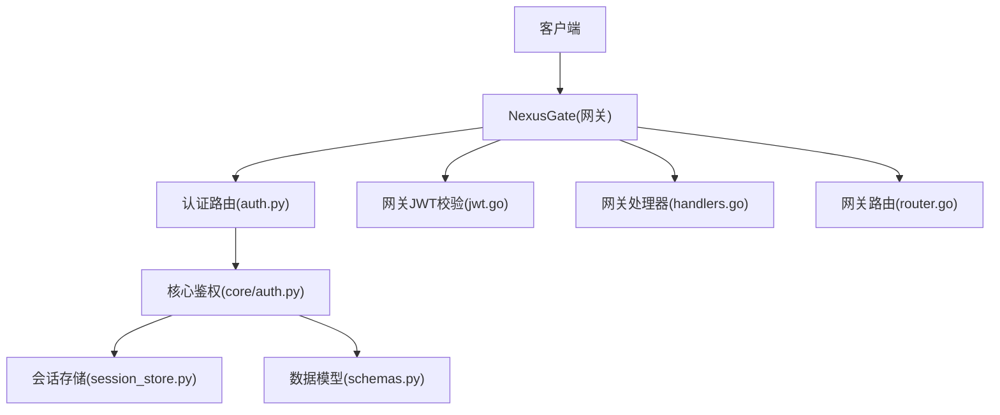
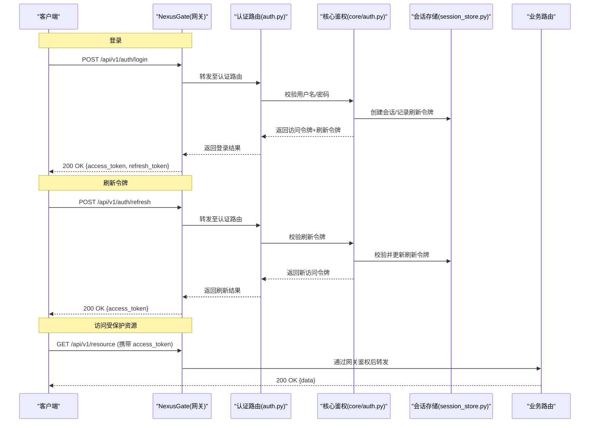
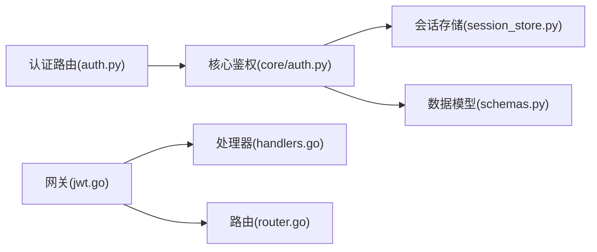

# 认证授权接口

<cite>
**本文引用的文件**   
- [backend_design/nexus/api/routes/auth.py](file://backend_design/nexus/api/routes/auth.py)
- [backend_design/nexus/core/auth.py](file://backend_design/nexus/core/auth.py)
- [backend_design/nexus/middleware/session_store.py](file://backend_design/nexus/middleware/session_store.py)
- [backend_design/nexus/models/schemas.py](file://backend_design/nexus/models/schemas.py)
- [backend_design/nexus_gate/internal/auth/jwt.go](file://backend_design/nexus_gate/internal/auth/jwt.go)
- [backend_design/nexus_gate/internal/handlers/handlers.go](file://backend_design/nexus_gate/internal/handlers/handlers.go)
- [backend_design/nexus_gate/internal/router/router.go](file://backend_design/nexus_gate/internal/router/router.go)
</cite>

## 目录
1. [简介](#简介)
2. [项目结构](#项目结构)
3. [核心组件](#核心组件)
4. [架构总览](#架构总览)
5. [详细组件分析](#详细组件分析)
6. [依赖分析](#依赖分析)
7. [性能考虑](#性能考虑)
8. [故障排查指南](#故障排查指南)
9. [结论](#结论)
10. [附录](#附录)

## 简介
本文件为 NexusCockpit 系统的认证与授权模块 API 文档，覆盖用户登录、注册、令牌刷新、权限验证等认证相关 HTTP 端点。文档同时说明 JWT 令牌机制、用户角色权限体系、会话管理策略，并提供请求参数校验规则、响应数据结构定义、错误码说明、完整请求/响应示例（成功与失败）、以及安全最佳实践与常见安全问题防护措施。

## 项目结构
认证与授权能力由后端 Python 服务与前置网关 Go 服务共同实现：
- 路由层：Python 侧暴露认证相关 REST 端点
- 鉴权中间件：Python 侧解析并校验 JWT，注入当前用户上下文
- 会话存储：Redis 或内存实现的会话持久化与过期管理
- 数据模型：Pydantic 定义的请求/响应 Schema
- 网关侧：Go 侧提供统一的鉴权入口与 JWT 校验逻辑

图表来源
- [backend_design/nexus/api/routes/auth.py](file://backend_design/nexus/api/routes/auth.py)
- [backend_design/nexus/core/auth.py](file://backend_design/nexus/core/auth.py)
- [backend_design/nexus/middleware/session_store.py](file://backend_design/nexus/middleware/session_store.py)
- [backend_design/nexus/models/schemas.py](file://backend_design/nexus/models/schemas.py)
- [backend_design/nexus_gate/internal/auth/jwt.go](file://backend_design/nexus_gate/internal/auth/jwt.go)
- [backend_design/nexus_gate/internal/handlers/handlers.go](file://backend_design/nexus_gate/internal/handlers/handlers.go)
- [backend_design/nexus_gate/internal/router/router.go](file://backend_design/nexus_gate/internal/router/router.go)

章节来源
- [backend_design/nexus/api/routes/auth.py](file://backend_design/nexus/api/routes/auth.py)
- [backend_design/nexus/core/auth.py](file://backend_design/nexus/core/auth.py)
- [backend_design/nexus/middleware/session_store.py](file://backend_design/nexus/middleware/session_store.py)
- [backend_design/nexus/models/schemas.py](file://backend_design/nexus/models/schemas.py)
- [backend_design/nexus_gate/internal/auth/jwt.go](file://backend_design/nexus_gate/internal/auth/jwt.go)
- [backend_design/nexus_gate/internal/handlers/handlers.go](file://backend_design/nexus_gate/internal/handlers/handlers.go)
- [backend_design/nexus_gate/internal/router/router.go](file://backend_design/nexus_gate/internal/router/router.go)

## 核心组件
- 认证路由：提供登录、注册、令牌刷新、登出等 HTTP 接口
- 核心鉴权：负责密码校验、JWT 签发与校验、权限判定、上下文注入
- 会话存储：维护会话状态、刷新令牌映射、黑名单与过期清理
- 数据模型：统一请求/响应结构定义与字段校验
- 网关鉴权：在网关层对受保护资源进行 JWT 校验与转发

章节来源
- [backend_design/nexus/api/routes/auth.py](file://backend_design/nexus/api/routes/auth.py)
- [backend_design/nexus/core/auth.py](file://backend_design/nexus/core/auth.py)
- [backend_design/nexus/middleware/session_store.py](file://backend_design/nexus/middleware/session_store.py)
- [backend_design/nexus/models/schemas.py](file://backend_design/nexus/models/schemas.py)
- [backend_design/nexus_gate/internal/auth/jwt.go](file://backend_design/nexus_gate/internal/auth/jwt.go)

## 架构总览
下图展示从客户端到网关再到后端的认证流程，包括登录、令牌刷新与资源访问的鉴权路径。

图表来源
- [backend_design/nexus/api/routes/auth.py](file://backend_design/nexus/api/routes/auth.py)
- [backend_design/nexus/core/auth.py](file://backend_design/nexus/core/auth.py)
- [backend_design/nexus/middleware/session_store.py](file://backend_design/nexus/middleware/session_store.py)
- [backend_design/nexus_gate/internal/auth/jwt.go](file://backend_design/nexus_gate/internal/auth/jwt.go)
- [backend_design/nexus_gate/internal/handlers/handlers.go](file://backend_design/nexus_gate/internal/handlers/handlers.go)
- [backend_design/nexus_gate/internal/router/router.go](file://backend_design/nexus_gate/internal/router/router.go)

## 详细组件分析

### 认证路由（auth.py）
- 功能职责
  - 暴露登录、注册、令牌刷新、登出等 HTTP 端点
  - 接收并校验请求体参数，调用核心鉴权完成认证流程
  - 返回标准化的 JSON 响应
- 关键端点
  - POST /api/v1/auth/login
  - POST /api/v1/auth/register
  - POST /api/v1/auth/refresh
  - POST /api/v1/auth/logout
- 请求参数校验
  - 登录：用户名、密码必填；格式与长度限制遵循数据模型定义
  - 注册：用户名唯一性校验；密码强度要求；邮箱可选但需符合邮箱格式
  - 刷新：需提供有效的刷新令牌
  - 登出：可携带访问令牌或刷新令牌用于撤销
- 响应结构
  - 成功：包含访问令牌、刷新令牌（登录/注册）、仅访问令牌（刷新）
  - 失败：包含错误码与人类可读的错误信息

章节来源
- [backend_design/nexus/api/routes/auth.py](file://backend_design/nexus/api/routes/auth.py)
- [backend_design/nexus/models/schemas.py](file://backend_design/nexus/models/schemas.py)

### 核心鉴权（core/auth.py）
- 功能职责
  - 用户凭据校验（密码哈希比对）
  - JWT 签发与校验（签名算法、有效期、载荷字段）
  - 基于角色的访问控制（RBAC）：检查用户角色与资源权限
  - 将当前用户上下文注入到请求中供后续处理使用
- JWT 机制
  - 访问令牌：短生命周期，用于访问受保护资源
  - 刷新令牌：较长生命周期，用于换取新的访问令牌
  - 令牌载荷包含用户标识、角色集合、租户信息等
- 权限验证
  - 支持资源级与操作级权限判断
  - 结合中间件在请求进入业务逻辑前完成鉴权

章节来源
- [backend_design/nexus/core/auth.py](file://backend_design/nexus/core/auth.py)

### 会话存储（session_store.py）
- 功能职责
  - 维护会话状态与刷新令牌映射
  - 支持令牌黑名单与过期清理
  - 提供原子性更新与查询接口
- 存储后端
  - 默认 Redis，支持内存模式用于开发环境
- 一致性保障
  - 刷新令牌轮换时旧令牌失效
  - 并发刷新场景下的幂等与锁机制

章节来源
- [backend_design/nexus/middleware/session_store.py](file://backend_design/nexus/middleware/session_store.py)

### 数据模型（schemas.py）
- 作用
  - 定义登录、注册、刷新、登出等请求/响应的 Pydantic 模型
  - 内置字段类型、必填项、长度与格式校验
- 关键字段
  - 用户名、密码、邮箱、访问令牌、刷新令牌、角色列表、错误码、消息

章节来源
- [backend_design/nexus/models/schemas.py](file://backend_design/nexus/models/schemas.py)

### 网关鉴权（jwt.go、handlers.go、router.go）
- 功能职责
  - 在网关层对受保护资源进行 JWT 校验
  - 根据路由配置决定哪些路径需要鉴权
  - 将已认证的请求转发至后端服务
- 校验流程
  - 提取请求头中的访问令牌
  - 校验签名、有效期与必要载荷
  - 失败则直接返回未授权错误

章节来源
- [backend_design/nexus_gate/internal/auth/jwt.go](file://backend_design/nexus_gate/internal/auth/jwt.go)
- [backend_design/nexus_gate/internal/handlers/handlers.go](file://backend_design/nexus_gate/internal/handlers/handlers.go)
- [backend_design/nexus_gate/internal/router/router.go](file://backend_design/nexus_gate/internal/router/router.go)

## 依赖分析
- 组件耦合
  - 认证路由依赖核心鉴权与数据模型
  - 核心鉴权依赖会话存储与配置
  - 网关依赖 JWT 校验与处理器
- 外部依赖
  - Redis（会话存储）
  - 加密库（JWT 签名）
- 潜在循环依赖
  - 路由层不应反向依赖核心鉴权的内部实现细节，应通过接口调用

图表来源
- [backend_design/nexus/api/routes/auth.py](file://backend_design/nexus/api/routes/auth.py)
- [backend_design/nexus/core/auth.py](file://backend_design/nexus/core/auth.py)
- [backend_design/nexus/middleware/session_store.py](file://backend_design/nexus/middleware/session_store.py)
- [backend_design/nexus/models/schemas.py](file://backend_design/nexus/models/schemas.py)
- [backend_design/nexus_gate/internal/auth/jwt.go](file://backend_design/nexus_gate/internal/auth/jwt.go)
- [backend_design/nexus_gate/internal/handlers/handlers.go](file://backend_design/nexus_gate/internal/handlers/handlers.go)
- [backend_design/nexus_gate/internal/router/router.go](file://backend_design/nexus_gate/internal/router/router.go)

章节来源
- [backend_design/nexus/api/routes/auth.py](file://backend_design/nexus/api/routes/auth.py)
- [backend_design/nexus/core/auth.py](file://backend_design/nexus/core/auth.py)
- [backend_design/nexus/middleware/session_store.py](file://backend_design/nexus/middleware/session_store.py)
- [backend_design/nexus/models/schemas.py](file://backend_design/nexus/models/schemas.py)
- [backend_design/nexus_gate/internal/auth/jwt.go](file://backend_design/nexus_gate/internal/auth/jwt.go)
- [backend_design/nexus_gate/internal/handlers/handlers.go](file://backend_design/nexus_gate/internal/handlers/handlers.go)
- [backend_design/nexus_gate/internal/router/router.go](file://backend_design/nexus_gate/internal/router/router.go)

## 性能考虑
- 令牌签发与校验
  - 使用高效签名算法与合理的密钥缓存
  - 避免在每次请求中进行昂贵的数据库查询，优先使用本地缓存或只读副本
- 会话存储
  - 使用 Redis 集群提升吞吐与可用性
  - 合理设置 TTL 与批量清理策略，降低键空间膨胀
- 网关鉴权
  - 启用令牌白名单与本地缓存以减少跨进程开销
  - 对高频路径进行鉴权短路优化

[本节为通用指导，不直接分析具体文件]

## 故障排查指南
- 常见问题
  - 登录失败：检查用户名/密码是否正确、账户是否被锁定
  - 刷新失败：确认刷新令牌有效且未被吊销
  - 访问受限：核对用户角色与资源权限配置
- 日志与追踪
  - 关注认证路由与核心鉴权的错误日志
  - 检查会话存储的连接与键值状态
- 快速定位
  - 使用错误码与消息定位问题根因
  - 复现步骤：最小化请求体、关闭第三方依赖干扰

章节来源
- [backend_design/nexus/api/routes/auth.py](file://backend_design/nexus/api/routes/auth.py)
- [backend_design/nexus/core/auth.py](file://backend_design/nexus/core/auth.py)
- [backend_design/nexus/middleware/session_store.py](file://backend_design/nexus/middleware/session_store.py)

## 结论
NexusCockpit 的认证授权模块采用前后端协同的鉴权方案：网关层进行统一的 JWT 校验，后端提供完整的登录、注册、刷新与权限控制能力。通过清晰的组件边界、严格的参数校验与健壮的会话管理，系统在保证安全性的同时具备良好的可扩展性与性能表现。建议在生产环境中严格配置密钥、开启速率限制与审计日志，并定期评估权限策略与令牌生命周期。

[本节为总结性内容，不直接分析具体文件]

## 附录

### 认证相关 HTTP 端点清单
- 登录
  - 方法：POST
  - 路径：/api/v1/auth/login
  - 请求体字段：用户名、密码
  - 响应：访问令牌、刷新令牌
- 注册
  - 方法：POST
  - 路径：/api/v1/auth/register
  - 请求体字段：用户名、密码、邮箱（可选）
  - 响应：访问令牌、刷新令牌
- 刷新令牌
  - 方法：POST
  - 路径：/api/v1/auth/refresh
  - 请求体字段：刷新令牌
  - 响应：新的访问令牌
- 登出
  - 方法：POST
  - 路径：/api/v1/auth/logout
  - 请求体字段：访问令牌或刷新令牌（用于撤销）
  - 响应：成功消息

章节来源
- [backend_design/nexus/api/routes/auth.py](file://backend_design/nexus/api/routes/auth.py)
- [backend_design/nexus/models/schemas.py](file://backend_design/nexus/models/schemas.py)

### 请求参数校验规则
- 用户名
  - 必填；长度范围；字符集限制
- 密码
  - 必填；最小长度；复杂度要求（大小写、数字、特殊字符）
- 邮箱
  - 可选；若提供需符合标准邮箱格式
- 刷新令牌
  - 必填；格式与有效性由会话存储校验

章节来源
- [backend_design/nexus/models/schemas.py](file://backend_design/nexus/models/schemas.py)

### 响应数据结构定义
- 成功响应
  - 访问令牌：字符串
  - 刷新令牌：字符串（登录/注册返回）
  - 消息：字符串
- 失败响应
  - 错误码：整数或枚举
  - 消息：字符串
  - 附加信息：对象（可选）

章节来源
- [backend_design/nexus/models/schemas.py](file://backend_design/nexus/models/schemas.py)

### 错误码说明
- 400：请求参数无效
- 401：未认证或令牌无效
- 403：无权限访问
- 404：资源不存在
- 409：冲突（如用户名重复）
- 429：频率限制
- 500：服务器内部错误

章节来源
- [backend_design/nexus/api/routes/auth.py](file://backend_design/nexus/api/routes/auth.py)
- [backend_design/nexus/core/auth.py](file://backend_design/nexus/core/auth.py)

### 请求/响应示例（成功与失败）
- 登录成功
  - 请求：POST /api/v1/auth/login
  - 响应：{访问令牌, 刷新令牌}
- 登录失败
  - 请求：POST /api/v1/auth/login
  - 响应：{错误码, 消息}
- 刷新成功
  - 请求：POST /api/v1/auth/refresh
  - 响应：{访问令牌}
- 刷新失败
  - 请求：POST /api/v1/auth/refresh
  - 响应：{错误码, 消息}
- 注册成功
  - 请求：POST /api/v1/auth/register
  - 响应：{访问令牌, 刷新令牌}
- 注册失败（用户名重复）
  - 请求：POST /api/v1/auth/register
  - 响应：{错误码: 409, 消息}

章节来源
- [backend_design/nexus/api/routes/auth.py](file://backend_design/nexus/api/routes/auth.py)
- [backend_design/nexus/models/schemas.py](file://backend_design/nexus/models/schemas.py)

### 安全最佳实践与防护
- 传输安全
  - 强制 HTTPS；启用 HSTS
- 令牌安全
  - 使用强签名算法与安全密钥轮换
  - 访问令牌短生命周期；刷新令牌定期轮换
  - 敏感信息不入令牌载荷
- 会话管理
  - 刷新令牌黑名单与过期清理
  - 防重放与并发刷新保护
- 输入校验
  - 严格参数校验与长度限制
  - 防止注入与越权访问
- 速率限制
  - 登录与注册接口限流
  - 异常行为检测与封禁
- 审计与监控
  - 记录认证事件与异常告警
  - 指标采集与可视化

[本节为通用指导，不直接分析具体文件]