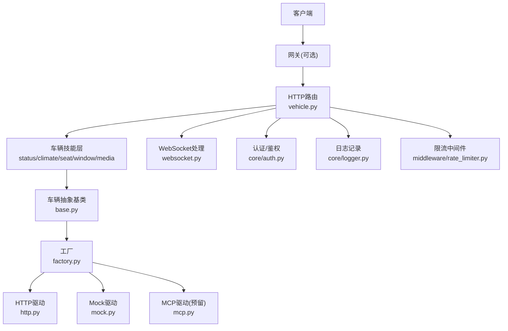
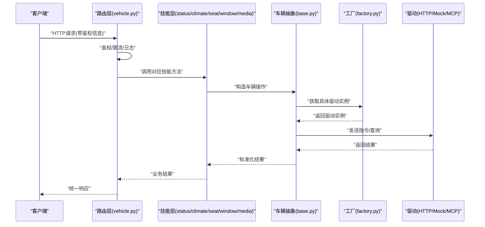
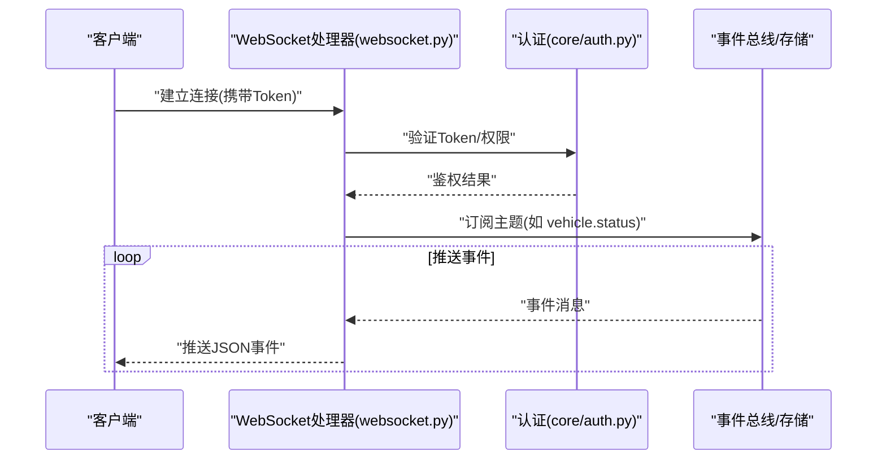
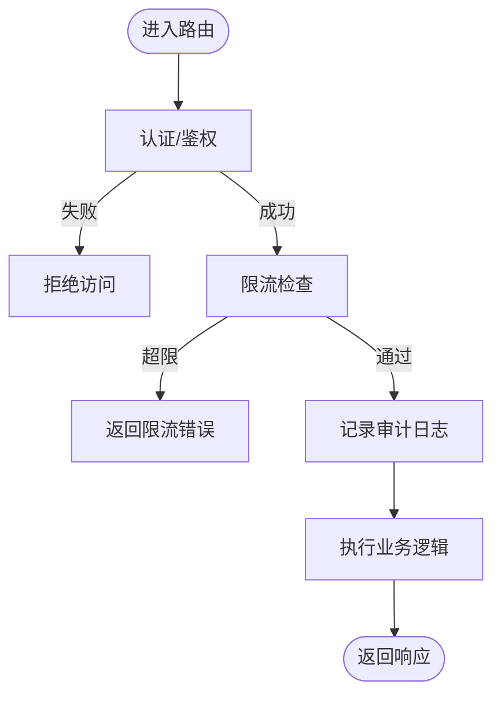
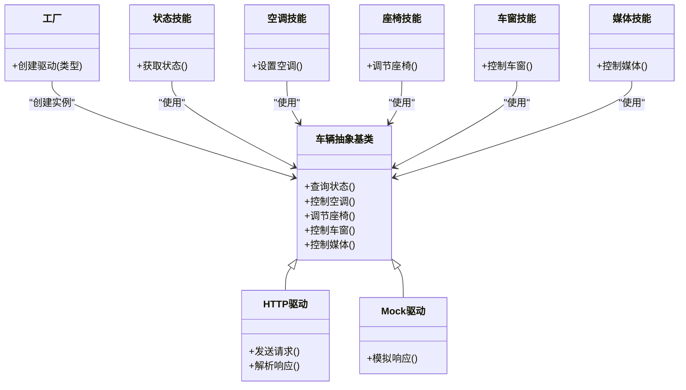

# 车辆控制接口

<cite>
**本文引用的文件**   
- [backend_design/nexus/api/routes/vehicle.py](file://backend_design/nexus/api/routes/vehicle.py)
- [backend_design/nexus/api/websocket.py](file://backend_design/nexus/api/websocket.py)
- [backend_design/nexus/skills/vehicle/status.py](file://backend_design/nexus/skills/vehicle/status.py)
- [backend_design/nexus/skills/vehicle/climate.py](file://backend_design/nexus/skills/vehicle/climate.py)
- [backend_design/nexus/skills/vehicle/seat.py](file://backend_design/nexus/skills/vehicle/seat.py)
- [backend_design/nexus/skills/vehicle/window.py](file://backend_design/nexus/skills/vehicle/window.py)
- [backend_design/nexus/skills/vehicle/media.py](file://backend_design/nexus/skills/vehicle/media.py)
- [backend_design/nexus/vehicle/base.py](file://backend_design/nexus/vehicle/base.py)
- [backend_design/nexus/vehicle/factory.py](file://backend_design/nexus/vehicle/factory.py)
- [backend_design/nexus/vehicle/http.py](file://backend_design/nexus/vehicle/http.py)
- [backend_design/nexus/vehicle/mock.py](file://backend_design/nexus/vehicle/mock.py)
- [backend_design/nexus/core/auth.py](file://backend_design/nexus/core/auth.py)
- [backend_design/nexus/core/logger.py](file://backend_design/nexus/core/logger.py)
- [backend_design/nexus/middleware/rate_limiter.py](file://backend_design/nexus/middleware/rate_limiter.py)
- [backend_design/nexus/models/schemas.py](file://backend_design/nexus/models/schemas.py)
- [backend_design/nexus/main.py](file://backend_design/nexus/main.py)
</cite>

## 目录
1. [简介](#简介)
2. [项目结构](#项目结构)
3. [核心组件](#核心组件)
4. [架构总览](#架构总览)
5. [详细组件分析](#详细组件分析)
6. [依赖分析](#依赖分析)
7. [性能考虑](#性能考虑)
8. [故障排查指南](#故障排查指南)
9. [结论](#结论)
10. [附录](#附录) 

## 简介
本文件面向“车辆控制API接口”的开发者与集成方，系统化梳理并文档化以下能力：
- 车辆状态查询：位置、能耗、设备状态、故障码等
- 远程控制指令：空调、座椅、车窗、媒体播放等
- 实时数据同步：WebSocket连接与事件订阅
- 安全与权限：认证、鉴权、限流与审计日志
- 请求/响应格式：统一的数据结构与示例路径

## 项目结构
后端采用分层设计：HTTP路由层暴露REST API；技能层实现具体车辆能力；车辆抽象层对接不同后端（HTTP/Mock/MCP）；中间件提供限流、缓存、会话等通用能力；核心模块提供认证、日志、异常等基础服务。

图表来源
- [backend_design/nexus/api/routes/vehicle.py](file://backend_design/nexus/api/routes/vehicle.py)
- [backend_design/nexus/api/websocket.py](file://backend_design/nexus/api/websocket.py)
- [backend_design/nexus/skills/vehicle/status.py](file://backend_design/nexus/skills/vehicle/status.py)
- [backend_design/nexus/skills/vehicle/climate.py](file://backend_design/nexus/skills/vehicle/climate.py)
- [backend_design/nexus/skills/vehicle/seat.py](file://backend_design/nexus/skills/vehicle/seat.py)
- [backend_design/nexus/skills/vehicle/window.py](file://backend_design/nexus/skills/vehicle/window.py)
- [backend_design/nexus/skills/vehicle/media.py](file://backend_design/nexus/skills/vehicle/media.py)
- [backend_design/nexus/vehicle/base.py](file://backend_design/nexus/vehicle/base.py)
- [backend_design/nexus/vehicle/factory.py](file://backend_design/nexus/vehicle/factory.py)
- [backend_design/nexus/vehicle/http.py](file://backend_design/nexus/vehicle/http.py)
- [backend_design/nexus/vehicle/mock.py](file://backend_design/nexus/vehicle/mock.py)
- [backend_design/nexus/core/auth.py](file://backend_design/nexus/core/auth.py)
- [backend_design/nexus/core/logger.py](file://backend_design/nexus/core/logger.py)
- [backend_design/nexus/middleware/rate_limiter.py](file://backend_design/nexus/middleware/rate_limiter.py)

章节来源
- [backend_design/nexus/main.py](file://backend_design/nexus/main.py)

## 核心组件
- 路由层：定义所有车辆相关HTTP端点，负责参数校验、鉴权、调用技能层、返回统一响应。
- 技能层：按功能域拆分（状态、空调、座椅、车窗、媒体），每个技能封装一次或多次车辆操作。
- 车辆抽象层：定义统一的车辆接口，屏蔽底层差异；工厂根据配置选择HTTP/Mock/MCP驱动。
- WebSocket：维护长连接，推送车辆状态变更与事件。
- 安全与可观测性：认证鉴权、限流、结构化日志、指标埋点。

章节来源
- [backend_design/nexus/api/routes/vehicle.py](file://backend_design/nexus/api/routes/vehicle.py)
- [backend_design/nexus/skills/vehicle/status.py](file://backend_design/nexus/skills/vehicle/status.py)
- [backend_design/nexus/skills/vehicle/climate.py](file://backend_design/nexus/skills/vehicle/climate.py)
- [backend_design/nexus/skills/vehicle/seat.py](file://backend_design/nexus/skills/vehicle/seat.py)
- [backend_design/nexus/skills/vehicle/window.py](file://backend_design/nexus/skills/vehicle/window.py)
- [backend_design/nexus/skills/vehicle/media.py](file://backend_design/nexus/skills/vehicle/media.py)
- [backend_design/nexus/vehicle/base.py](file://backend_design/nexus/vehicle/base.py)
- [backend_design/nexus/vehicle/factory.py](file://backend_design/nexus/vehicle/factory.py)
- [backend_design/nexus/vehicle/http.py](file://backend_design/nexus/vehicle/http.py)
- [backend_design/nexus/vehicle/mock.py](file://backend_design/nexus/vehicle/mock.py)
- [backend_design/nexus/api/websocket.py](file://backend_design/nexus/api/websocket.py)
- [backend_design/nexus/core/auth.py](file://backend_design/nexus/core/auth.py)
- [backend_design/nexus/core/logger.py](file://backend_design/nexus/core/logger.py)
- [backend_design/nexus/middleware/rate_limiter.py](file://backend_design/nexus/middleware/rate_limiter.py)

## 架构总览
整体流程：客户端通过HTTP/WebSocket访问路由层，路由层进行鉴权与限流后，调用对应技能；技能通过车辆抽象层与工厂选择具体驱动（HTTP/Mock/MCP）执行；结果经统一响应模型返回；WebSocket用于实时事件推送。

图表来源
- [backend_design/nexus/api/routes/vehicle.py](file://backend_design/nexus/api/routes/vehicle.py)
- [backend_design/nexus/skills/vehicle/status.py](file://backend_design/nexus/skills/vehicle/status.py)
- [backend_design/nexus/skills/vehicle/climate.py](file://backend_design/nexus/skills/vehicle/climate.py)
- [backend_design/nexus/skills/vehicle/seat.py](file://backend_design/nexus/skills/vehicle/seat.py)
- [backend_design/nexus/skills/vehicle/window.py](file://backend_design/nexus/skills/vehicle/window.py)
- [backend_design/nexus/skills/vehicle/media.py](file://backend_design/nexus/skills/vehicle/media.py)
- [backend_design/nexus/vehicle/base.py](file://backend_design/nexus/vehicle/base.py)
- [backend_design/nexus/vehicle/factory.py](file://backend_design/nexus/vehicle/factory.py)
- [backend_design/nexus/vehicle/http.py](file://backend_design/nexus/vehicle/http.py)
- [backend_design/nexus/vehicle/mock.py](file://backend_design/nexus/vehicle/mock.py)

## 详细组件分析

### 车辆状态查询
- 端点说明：查询车辆当前状态，包括位置、能耗、设备状态、故障码等。
- 请求参数：
  - 路径参数：车辆ID
  - 查询参数：字段过滤（可选）
- 响应结构：
  - 位置信息：经纬度、精度、更新时间
  - 能耗状态：剩余电量/油量、续航、充电状态
  - 设备状态：门窗、车灯、锁止、胎压等
  - 故障代码：故障码列表及描述
- 错误码：未授权、车辆不存在、超时、下游服务不可用

章节来源
- [backend_design/nexus/api/routes/vehicle.py](file://backend_design/nexus/api/routes/vehicle.py)
- [backend_design/nexus/skills/vehicle/status.py](file://backend_design/nexus/skills/vehicle/status.py)
- [backend_design/nexus/models/schemas.py](file://backend_design/nexus/models/schemas.py)

### 空调控制
- 端点说明：设置空调开关、温度、风量、模式、出风位置等。
- 请求参数：
  - 路径参数：车辆ID
  - 请求体：目标温度、风量档位、模式（自动/制冷/制热）、出风口选择、定时任务（可选）
- 响应结构：
  - 执行状态：成功/失败/进行中
  - 反馈数据：当前空调状态快照
- 错误码：参数非法、设备离线、权限不足

章节来源
- [backend_design/nexus/api/routes/vehicle.py](file://backend_design/nexus/api/routes/vehicle.py)
- [backend_design/nexus/skills/vehicle/climate.py](file://backend_design/nexus/skills/vehicle/climate.py)

### 座椅调节
- 端点说明：调节座椅位置、靠背角度、加热/通风等级、记忆位。
- 请求参数：
  - 路径参数：车辆ID
  - 请求体：座位标识（主驾/副驾/后排）、位置坐标、角度、加热/通风等级、记忆位索引
- 响应结构：
  - 执行状态与反馈：当前座椅状态
- 错误码：越界参数、设备不支持、执行中冲突

章节来源
- [backend_design/nexus/api/routes/vehicle.py](file://backend_design/nexus/api/routes/vehicle.py)
- [backend_design/nexus/skills/vehicle/seat.py](file://backend_design/nexus/skills/vehicle/seat.py)

### 车窗操作
- 端点说明：控制车窗开合、天窗、防夹保护状态。
- 请求参数：
  - 路径参数：车辆ID
  - 请求体：目标车窗（左前/右前/左后/右后/天窗）、开合百分比、速度档位
- 响应结构：
  - 执行状态与反馈：当前车窗状态
- 错误码：安全条件不满足、设备离线

章节来源
- [backend_design/nexus/api/routes/vehicle.py](file://backend_design/nexus/api/routes/vehicle.py)
- [backend_design/nexus/skills/vehicle/window.py](file://backend_design/nexus/skills/vehicle/window.py)

### 媒体播放
- 端点说明：控制媒体播放（上一首/下一首/暂停/播放/音量/切歌源）。
- 请求参数：
  - 路径参数：车辆ID
  - 请求体：动作、音量、音源类型（蓝牙/在线/本地）、曲目ID（可选）
- 响应结构：
  - 执行状态与反馈：当前播放状态
- 错误码：无可用音源、权限不足

章节来源
- [backend_design/nexus/api/routes/vehicle.py](file://backend_design/nexus/api/routes/vehicle.py)
- [backend_design/nexus/skills/vehicle/media.py](file://backend_design/nexus/skills/vehicle/media.py)

### 实时数据同步（WebSocket）
- 连接建立：客户端发起WebSocket连接，携带鉴权信息。
- 事件订阅：客户端订阅主题（如车辆状态、故障告警、控制结果）。
- 消息格式：统一的事件结构，包含事件类型、时间戳、载荷。
- 断线重连：客户端需实现指数退避重连策略。

图表来源
- [backend_design/nexus/api/websocket.py](file://backend_design/nexus/api/websocket.py)
- [backend_design/nexus/core/auth.py](file://backend_design/nexus/core/auth.py)

章节来源
- [backend_design/nexus/api/websocket.py](file://backend_design/nexus/api/websocket.py)

### 安全验证、权限控制与操作日志
- 认证与鉴权：基于令牌的身份认证与资源级权限校验。
- 限流：对高频接口进行速率限制，防止滥用。
- 审计日志：记录关键操作的请求上下文、执行结果与耗时。

图表来源
- [backend_design/nexus/core/auth.py](file://backend_design/nexus/core/auth.py)
- [backend_design/nexus/middleware/rate_limiter.py](file://backend_design/nexus/middleware/rate_limiter.py)
- [backend_design/nexus/core/logger.py](file://backend_design/nexus/core/logger.py)

章节来源
- [backend_design/nexus/core/auth.py](file://backend_design/nexus/core/auth.py)
- [backend_design/nexus/middleware/rate_limiter.py](file://backend_design/nexus/middleware/rate_limiter.py)
- [backend_design/nexus/core/logger.py](file://backend_design/nexus/core/logger.py)

## 依赖分析
- 路由层依赖技能层与核心模块（认证、日志、限流）。
- 技能层依赖车辆抽象层，通过工厂选择具体驱动。
- 驱动层支持HTTP/Mock/MCP，便于开发与测试。

图表来源
- [backend_design/nexus/vehicle/base.py](file://backend_design/nexus/vehicle/base.py)
- [backend_design/nexus/vehicle/factory.py](file://backend_design/nexus/vehicle/factory.py)
- [backend_design/nexus/vehicle/http.py](file://backend_design/nexus/vehicle/http.py)
- [backend_design/nexus/vehicle/mock.py](file://backend_design/nexus/vehicle/mock.py)
- [backend_design/nexus/skills/vehicle/status.py](file://backend_design/nexus/skills/vehicle/status.py)
- [backend_design/nexus/skills/vehicle/climate.py](file://backend_design/nexus/skills/vehicle/climate.py)
- [backend_design/nexus/skills/vehicle/seat.py](file://backend_design/nexus/skills/vehicle/seat.py)
- [backend_design/nexus/skills/vehicle/window.py](file://backend_design/nexus/skills/vehicle/window.py)
- [backend_design/nexus/skills/vehicle/media.py](file://backend_design/nexus/skills/vehicle/media.py)

章节来源
- [backend_design/nexus/vehicle/base.py](file://backend_design/nexus/vehicle/base.py)
- [backend_design/nexus/vehicle/factory.py](file://backend_design/nexus/vehicle/factory.py)
- [backend_design/nexus/vehicle/http.py](file://backend_design/nexus/vehicle/http.py)
- [backend_design/nexus/vehicle/mock.py](file://backend_design/nexus/vehicle/mock.py)

## 性能考虑
- 批量查询：合并多个状态字段为单次查询，减少网络往返。
- 缓存热点：对低频变化的状态（如设备状态）引入短期缓存。
- 异步执行：对耗时控制指令采用异步任务与回调通知。
- 连接复用：HTTP驱动使用连接池，降低握手开销。
- 限流与熔断：对下游服务进行限流与熔断保护，避免雪崩。

[本节为通用指导，无需源码引用]

## 故障排查指南
- 常见错误：
  - 鉴权失败：检查Token有效期与权限范围
  - 限流触发：降低请求频率或申请更高配额
  - 下游不可用：查看熔断器状态与重试策略
  - 参数非法：对照请求结构校验规则
- 日志定位：
  - 检索审计日志中的请求ID与耗时
  - 关注技能层与驱动层的错误堆栈
- 快速恢复：
  - 切换至Mock驱动进行回归验证
  - 重启WebSocket连接并重试订阅

章节来源
- [backend_design/nexus/core/logger.py](file://backend_design/nexus/core/logger.py)
- [backend_design/nexus/vehicle/mock.py](file://backend_design/nexus/vehicle/mock.py)

## 结论
本接口体系以清晰的分层与可扩展的驱动机制，实现了车辆状态查询、远程控制与实时推送的统一入口。通过完善的鉴权、限流与日志审计，保障系统的安全性与可观测性。建议在生产环境启用HTTP驱动并配合监控与告警，以提升稳定性与可维护性。

[本节为总结，无需源码引用]

## 附录

### 统一响应结构
- 字段说明：
  - 状态码：业务状态码
  - 消息：人类可读的描述
  - 数据：具体业务数据
  - 追踪ID：用于跨链路追踪
- 示例路径：
  - 成功响应示例：[backend_design/nexus/models/schemas.py](file://backend_design/nexus/models/schemas.py)
  - 错误响应示例：[backend_design/nexus/models/schemas.py](file://backend_design/nexus/models/schemas.py)

章节来源
- [backend_design/nexus/models/schemas.py](file://backend_design/nexus/models/schemas.py)

### 请求/响应示例清单
- 车辆状态查询：
  - 请求示例路径：[backend_design/nexus/api/routes/vehicle.py](file://backend_design/nexus/api/routes/vehicle.py)
  - 响应示例路径：[backend_design/nexus/models/schemas.py](file://backend_design/nexus/models/schemas.py)
- 空调控制：
  - 请求示例路径：[backend_design/nexus/api/routes/vehicle.py](file://backend_design/nexus/api/routes/vehicle.py)
  - 响应示例路径：[backend_design/nexus/models/schemas.py](file://backend_design/nexus/models/schemas.py)
- 座椅调节：
  - 请求示例路径：[backend_design/nexus/api/routes/vehicle.py](file://backend_design/nexus/api/routes/vehicle.py)
  - 响应示例路径：[backend_design/nexus/models/schemas.py](file://backend_design/nexus/models/schemas.py)
- 车窗操作：
  - 请求示例路径：[backend_design/nexus/api/routes/vehicle.py](file://backend_design/nexus/api/routes/vehicle.py)
  - 响应示例路径：[backend_design/nexus/models/schemas.py](file://backend_design/nexus/models/schemas.py)
- 媒体播放：
  - 请求示例路径：[backend_design/nexus/api/routes/vehicle.py](file://backend_design/nexus/api/routes/vehicle.py)
  - 响应示例路径：[backend_design/nexus/models/schemas.py](file://backend_design/nexus/models/schemas.py)

章节来源
- [backend_design/nexus/api/routes/vehicle.py](file://backend_design/nexus/api/routes/vehicle.py)
- [backend_design/nexus/models/schemas.py](file://backend_design/nexus/models/schemas.py)