# 车辆控制接口

<cite>
**本文引用的文件**   
- [backend_design/nexus/api/routes/vehicle.py](file://backend_design/nexus/api/routes/vehicle.py)
- [backend_design/nexus/skills/vehicle/climate.py](file://backend_design/nexus/skills/vehicle/climate.py)
- [backend_design/nexus/skills/vehicle/navigation.py](file://backend_design/nexus/skills/vehicle/navigation.py)
- [backend_design/nexus/skills/vehicle/media.py](file://backend_design/nexus/skills/vehicle/media.py)
- [backend_design/nexus/skills/vehicle/seat.py](file://backend_design/nexus/skills/vehicle/seat.py)
- [backend_design/nexus/skills/vehicle/window.py](file://backend_design/nexus/skills/vehicle/window.py)
- [backend_design/nexus/skills/vehicle/status.py](file://backend_design/nexus/skills/vehicle/status.py)
- [backend_design/nexus/vehicle/base.py](file://backend_design/nexus/vehicle/base.py)
- [backend_design/nexus/vehicle/factory.py](file://backend_design/nexus/vehicle/factory.py)
- [backend_design/nexus/vehicle/http.py](file://backend_design/nexus/vehicle/http.py)
- [backend_design/nexus/vehicle/mcp.py](file://backend_design/nexus/vehicle/mcp.py)
- [backend_design/nexus/vehicle/mock.py](file://backend_design/nexus/vehicle/mock.py)
- [backend_design/nexus/core/auth.py](file://backend_design/nexus/core/auth.py)
- [backend_design/nexus/models/state.py](file://backend_design/nexus/models/state.py)
- [backend_design/nexus/api/websocket.py](file://backend_design/nexus/api/websocket.py)
- [backend_design/nexus/intent/router.py](file://backend_design/nexus/intent/router.py)
- [backend_design/nexus/agent/experts/vehicle_expert.py](file://backend_design/nexus/agent/experts/vehicle_expert.py)
</cite>

## 目录
1. [简介](#简介)
2. [项目结构](#项目结构)
3. [核心组件](#核心组件)
4. [架构总览](#架构总览)
5. [详细组件分析](#详细组件分析)
6. [依赖分析](#依赖分析)
7. [性能考虑](#性能考虑)
8. [故障排查指南](#故障排查指南)
9. [结论](#结论)
10. [附录](#附录)

## 简介
本文件为 NexusCockpit 系统的“车辆控制模块”提供完整的 API 文档，覆盖空调控制、导航管理、媒体播放、座椅调节、车窗控制等子系统。文档同时说明：
- 车辆状态同步机制（HTTP 与 WebSocket）
- 控制命令执行流程（从路由到技能层再到车辆驱动）
- 安全验证策略（鉴权、限流、幂等与回滚建议）
- 各子系统的专用接口定义、参数校验规则、执行结果反馈
- 典型使用示例（单功能控制与组合操作）
- 车辆通信协议与安全注意事项

## 项目结构
车辆控制相关代码主要分布在以下位置：
- API 路由层：接收外部请求，进行鉴权与参数校验，调用技能层
- 技能层（Skills）：按领域划分（空调、导航、媒体、座椅、车窗、状态），封装业务逻辑
- 车辆驱动层（Vehicle Drivers）：抽象统一接口，支持 HTTP/MCP/Mock 等多种后端实现
- 状态与事件：模型定义与 WebSocket 推送
- 意图识别与专家编排：将自然语言或结构化指令解析为具体控制动作

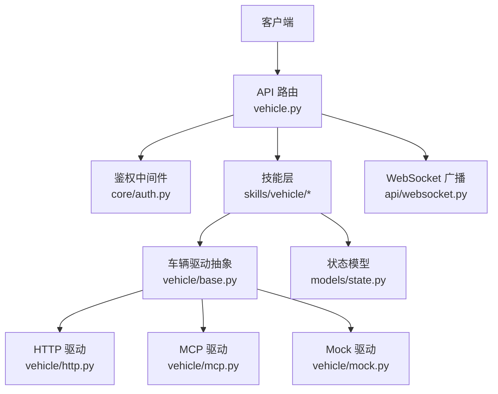

图表来源
- [backend_design/nexus/api/routes/vehicle.py](file://backend_design/nexus/api/routes/vehicle.py)
- [backend_design/nexus/core/auth.py](file://backend_design/nexus/core/auth.py)
- [backend_design/nexus/skills/vehicle/climate.py](file://backend_design/nexus/skills/vehicle/climate.py)
- [backend_design/nexus/skills/vehicle/navigation.py](file://backend_design/nexus/skills/vehicle/navigation.py)
- [backend_design/nexus/skills/vehicle/media.py](file://backend_design/nexus/skills/vehicle/media.py)
- [backend_design/nexus/skills/vehicle/seat.py](file://backend_design/nexus/skills/vehicle/seat.py)
- [backend_design/nexus/skills/vehicle/window.py](file://backend_design/nexus/skills/vehicle/window.py)
- [backend_design/nexus/skills/vehicle/status.py](file://backend_design/nexus/skills/vehicle/status.py)
- [backend_design/nexus/vehicle/base.py](file://backend_design/nexus/vehicle/base.py)
- [backend_design/nexus/vehicle/http.py](file://backend_design/nexus/vehicle/http.py)
- [backend_design/nexus/vehicle/mcp.py](file://backend_design/nexus/vehicle/mcp.py)
- [backend_design/nexus/vehicle/mock.py](file://backend_design/nexus/vehicle/mock.py)
- [backend_design/nexus/models/state.py](file://backend_design/nexus/models/state.py)
- [backend_design/nexus/api/websocket.py](file://backend_design/nexus/api/websocket.py)

章节来源
- [backend_design/nexus/api/routes/vehicle.py](file://backend_design/nexus/api/routes/vehicle.py)
- [backend_design/nexus/vehicle/base.py](file://backend_design/nexus/vehicle/base.py)
- [backend_design/nexus/vehicle/factory.py](file://backend_design/nexus/vehicle/factory.py)

## 核心组件
- API 路由层
  - 负责暴露 RESTful 接口，承载鉴权、参数校验、错误码映射与响应包装
  - 关键入口：车辆控制路由集合
- 技能层（Skills）
  - 按领域拆分：空调、导航、媒体、座椅、车窗、状态
  - 每个技能提供一组方法，完成参数校验、业务编排、调用车辆驱动
- 车辆驱动层（Drivers）
  - 统一抽象接口，屏蔽底层差异（HTTP/MCP/Mock）
  - 工厂模式根据配置选择具体实现
- 状态与事件
  - 状态模型集中定义，WebSocket 用于实时推送状态变更
- 意图与专家
  - 意图路由将用户指令解析为技能调用；车辆专家协调多技能组合操作

章节来源
- [backend_design/nexus/api/routes/vehicle.py](file://backend_design/nexus/api/routes/vehicle.py)
- [backend_design/nexus/skills/vehicle/climate.py](file://backend_design/nexus/skills/vehicle/climate.py)
- [backend_design/nexus/skills/vehicle/navigation.py](file://backend_design/nexus/skills/vehicle/navigation.py)
- [backend_design/nexus/skills/vehicle/media.py](file://backend_design/nexus/skills/vehicle/media.py)
- [backend_design/nexus/skills/vehicle/seat.py](file://backend_design/nexus/skills/vehicle/seat.py)
- [backend_design/nexus/skills/vehicle/window.py](file://backend_design/nexus/skills/vehicle/window.py)
- [backend_design/nexus/skills/vehicle/status.py](file://backend_design/nexus/skills/vehicle/status.py)
- [backend_design/nexus/vehicle/base.py](file://backend_design/nexus/vehicle/base.py)
- [backend_design/nexus/vehicle/factory.py](file://backend_design/nexus/vehicle/factory.py)
- [backend_design/nexus/models/state.py](file://backend_design/nexus/models/state.py)
- [backend_design/nexus/api/websocket.py](file://backend_design/nexus/api/websocket.py)
- [backend_design/nexus/intent/router.py](file://backend_design/nexus/intent/router.py)
- [backend_design/nexus/agent/experts/vehicle_expert.py](file://backend_design/nexus/agent/experts/vehicle_expert.py)

## 架构总览
下图展示了从客户端到车辆后端的完整链路，包括鉴权、技能编排、驱动选择与状态同步。

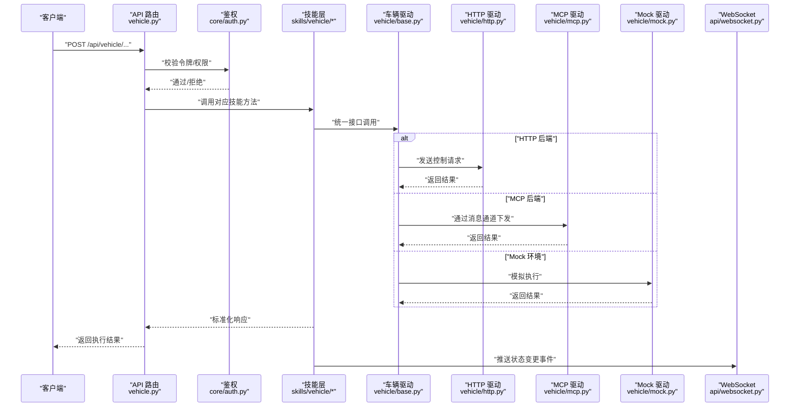

图表来源
- [backend_design/nexus/api/routes/vehicle.py](file://backend_design/nexus/api/routes/vehicle.py)
- [backend_design/nexus/core/auth.py](file://backend_design/nexus/core/auth.py)
- [backend_design/nexus/skills/vehicle/climate.py](file://backend_design/nexus/skills/vehicle/climate.py)
- [backend_design/nexus/skills/vehicle/navigation.py](file://backend_design/nexus/skills/vehicle/navigation.py)
- [backend_design/nexus/skills/vehicle/media.py](file://backend_design/nexus/skills/vehicle/media.py)
- [backend_design/nexus/skills/vehicle/seat.py](file://backend_design/nexus/skills/vehicle/seat.py)
- [backend_design/nexus/skills/vehicle/window.py](file://backend_design/nexus/skills/vehicle/window.py)
- [backend_design/nexus/skills/vehicle/status.py](file://backend_design/nexus/skills/vehicle/status.py)
- [backend_design/nexus/vehicle/base.py](file://backend_design/nexus/vehicle/base.py)
- [backend_design/nexus/vehicle/http.py](file://backend_design/nexus/vehicle/http.py)
- [backend_design/nexus/vehicle/mcp.py](file://backend_design/nexus/vehicle/mcp.py)
- [backend_design/nexus/vehicle/mock.py](file://backend_design/nexus/vehicle/mock.py)
- [backend_design/nexus/api/websocket.py](file://backend_design/nexus/api/websocket.py)

## 详细组件分析

### 通用接口与鉴权
- 鉴权策略
  - 所有车辆控制接口均需携带有效令牌，由鉴权中间件校验
  - 失败时返回标准鉴权错误码
- 请求/响应规范
  - 请求体采用 JSON，字段需满足类型与范围约束
  - 响应包含状态码、消息、数据体与追踪 ID
- 错误处理
  - 参数校验失败：返回参数错误
  - 业务异常：返回业务错误码与可恢复提示
  - 系统异常：返回系统错误并记录日志

章节来源
- [backend_design/nexus/core/auth.py](file://backend_design/nexus/core/auth.py)
- [backend_design/nexus/api/routes/vehicle.py](file://backend_design/nexus/api/routes/vehicle.py)

### 空调控制（Climate）
- 能力清单
  - 开关空调、设置温度、风量、风向、自动模式、内/外循环
- 参数校验
  - 温度范围、风量档位、风向枚举值需在允许范围内
- 执行流程
  - 路由校验 → 技能层参数校验 → 驱动下发 → 返回结果 → 推送状态
- 结果反馈
  - 成功：返回当前空调状态快照
  - 失败：返回错误原因与建议操作

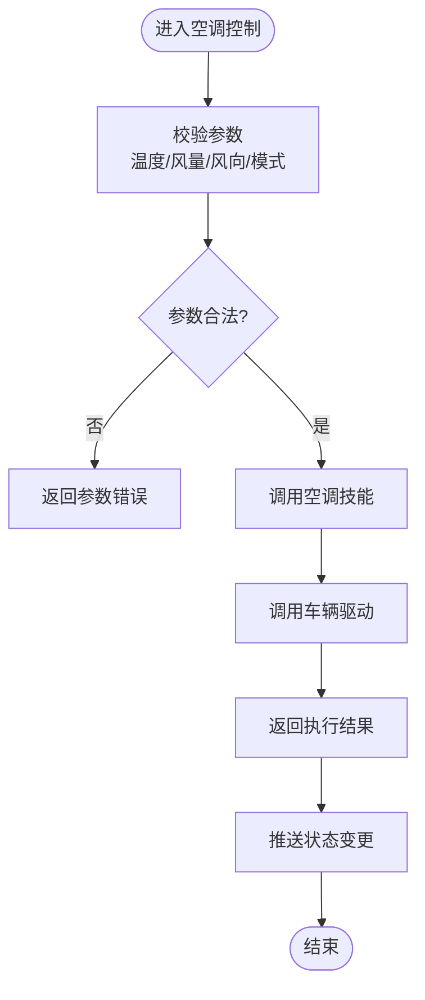

图表来源
- [backend_design/nexus/skills/vehicle/climate.py](file://backend_design/nexus/skills/vehicle/climate.py)
- [backend_design/nexus/vehicle/base.py](file://backend_design/nexus/vehicle/base.py)
- [backend_design/nexus/api/websocket.py](file://backend_design/nexus/api/websocket.py)

章节来源
- [backend_design/nexus/api/routes/vehicle.py](file://backend_design/nexus/api/routes/vehicle.py)
- [backend_design/nexus/skills/vehicle/climate.py](file://backend_design/nexus/skills/vehicle/climate.py)

### 导航管理（Navigation）
- 能力清单
  - 设置目的地、取消导航、查询导航状态、路径偏好设置
- 参数校验
  - 目的地格式、坐标范围、路径偏好枚举值
- 执行流程
  - 路由校验 → 导航技能编排 → 驱动下发 → 返回导航任务 ID → 推送进度
- 结果反馈
  - 成功：返回任务 ID 与预计到达时间
  - 失败：返回错误原因与重试建议

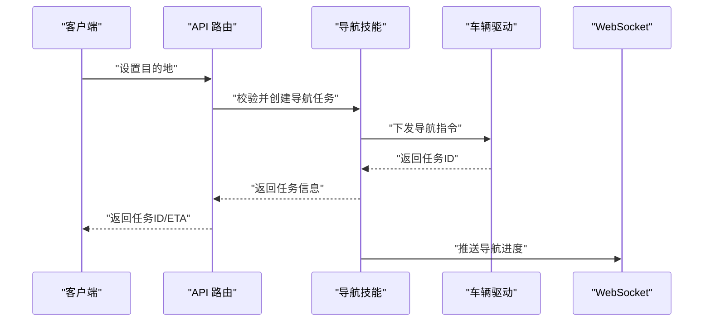

图表来源
- [backend_design/nexus/skills/vehicle/navigation.py](file://backend_design/nexus/skills/vehicle/navigation.py)
- [backend_design/nexus/vehicle/base.py](file://backend_design/nexus/vehicle/base.py)
- [backend_design/nexus/api/websocket.py](file://backend_design/nexus/api/websocket.py)

章节来源
- [backend_design/nexus/api/routes/vehicle.py](file://backend_design/nexus/api/routes/vehicle.py)
- [backend_design/nexus/skills/vehicle/navigation.py](file://backend_design/nexus/skills/vehicle/navigation.py)

### 媒体播放（Media）
- 能力清单
  - 播放/暂停、上一首/下一首、音量控制、列表切换、搜索播放
- 参数校验
  - 音量范围、曲目标识合法性、播放源有效性
- 执行流程
  - 路由校验 → 媒体技能编排 → 驱动下发 → 返回媒体状态 → 推送更新
- 结果反馈
  - 成功：返回当前播放信息与队列状态
  - 失败：返回错误原因与修复建议

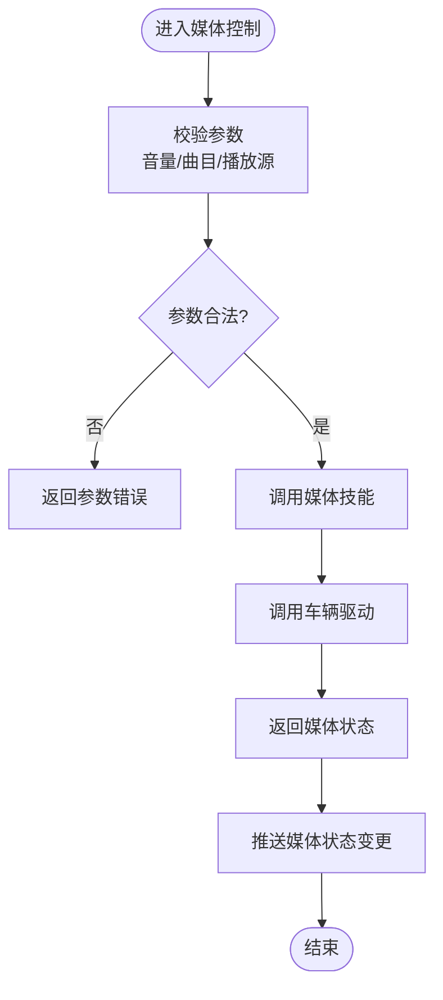

图表来源
- [backend_design/nexus/skills/vehicle/media.py](file://backend_design/nexus/skills/vehicle/media.py)
- [backend_design/nexus/vehicle/base.py](file://backend_design/nexus/vehicle/base.py)
- [backend_design/nexus/api/websocket.py](file://backend_design/nexus/api/websocket.py)

章节来源
- [backend_design/nexus/api/routes/vehicle.py](file://backend_design/nexus/api/routes/vehicle.py)
- [backend_design/nexus/skills/vehicle/media.py](file://backend_design/nexus/skills/vehicle/media.py)

### 座椅调节（Seat）
- 能力清单
  - 前后移动、靠背角度、腰部支撑、加热/通风、记忆位置
- 参数校验
  - 位置/角度范围、加热/通风档位、记忆槽位有效性
- 执行流程
  - 路由校验 → 座椅技能编排 → 驱动下发 → 返回座位状态 → 推送更新
- 结果反馈
  - 成功：返回目标位置与当前状态
  - 失败：返回错误原因与安全提示

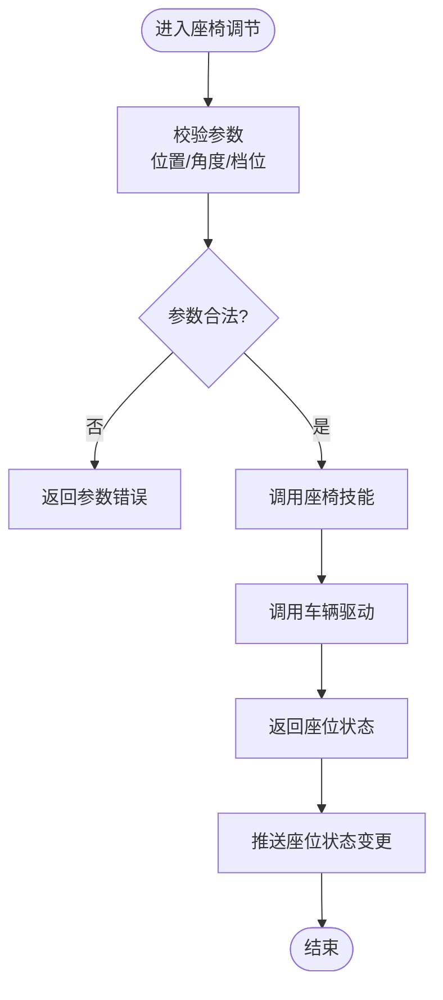

图表来源
- [backend_design/nexus/skills/vehicle/seat.py](file://backend_design/nexus/skills/vehicle/seat.py)
- [backend_design/nexus/vehicle/base.py](file://backend_design/nexus/vehicle/base.py)
- [backend_design/nexus/api/websocket.py](file://backend_design/nexus/api/websocket.py)

章节来源
- [backend_design/nexus/api/routes/vehicle.py](file://backend_design/nexus/api/routes/vehicle.py)
- [backend_design/nexus/skills/vehicle/seat.py](file://backend_design/nexus/skills/vehicle/seat.py)

### 车窗控制（Window）
- 能力清单
  - 开/关指定车窗、一键升降、防夹保护状态、遮阳帘控制
- 参数校验
  - 车窗编号、开合比例、速度档位、安全条件（车速/车门状态）
- 执行流程
  - 路由校验 → 车窗技能编排 → 驱动下发 → 返回车窗状态 → 推送更新
- 结果反馈
  - 成功：返回目标位置与当前状态
  - 失败：返回错误原因与安全警告

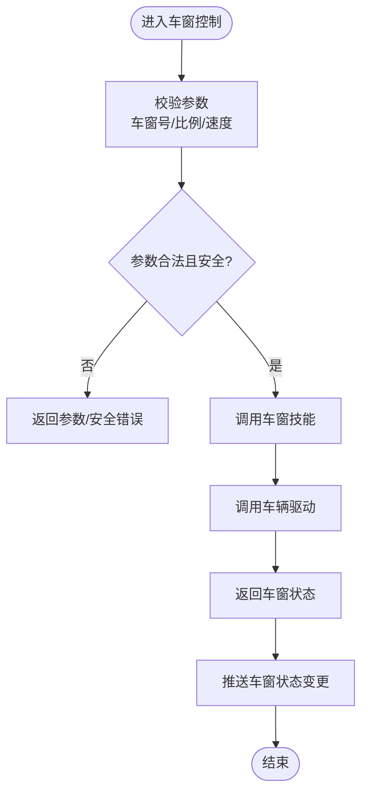

图表来源
- [backend_design/nexus/skills/vehicle/window.py](file://backend_design/nexus/skills/vehicle/window.py)
- [backend_design/nexus/vehicle/base.py](file://backend_design/nexus/vehicle/base.py)
- [backend_design/nexus/api/websocket.py](file://backend_design/nexus/api/websocket.py)

章节来源
- [backend_design/nexus/api/routes/vehicle.py](file://backend_design/nexus/api/routes/vehicle.py)
- [backend_design/nexus/skills/vehicle/window.py](file://backend_design/nexus/skills/vehicle/window.py)

### 车辆状态（Status）
- 能力清单
  - 读取整车状态、子系统状态、诊断信息、告警与事件
- 同步机制
  - 主动拉取：REST 接口获取最新状态
  - 被动推送：WebSocket 推送状态变更事件
- 结果反馈
  - 成功：返回状态快照与更新时间戳
  - 失败：返回错误原因与重试建议

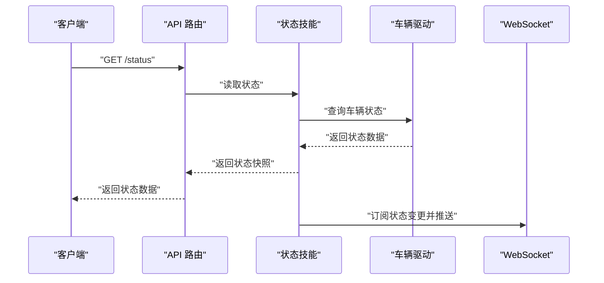

图表来源
- [backend_design/nexus/skills/vehicle/status.py](file://backend_design/nexus/skills/vehicle/status.py)
- [backend_design/nexus/vehicle/base.py](file://backend_design/nexus/vehicle/base.py)
- [backend_design/nexus/api/websocket.py](file://backend_design/nexus/api/websocket.py)

章节来源
- [backend_design/nexus/api/routes/vehicle.py](file://backend_design/nexus/api/routes/vehicle.py)
- [backend_design/nexus/skills/vehicle/status.py](file://backend_design/nexus/skills/vehicle/status.py)
- [backend_design/nexus/models/state.py](file://backend_design/nexus/models/state.py)

### 车辆驱动抽象与工厂
- 抽象接口
  - 统一方法：控制、查询、订阅、批量操作
- 实现方式
  - HTTP：基于 REST 的远程调用
  - MCP：基于消息通道的异步交互
  - Mock：开发测试用模拟实现
- 工厂选择
  - 根据配置动态加载具体驱动

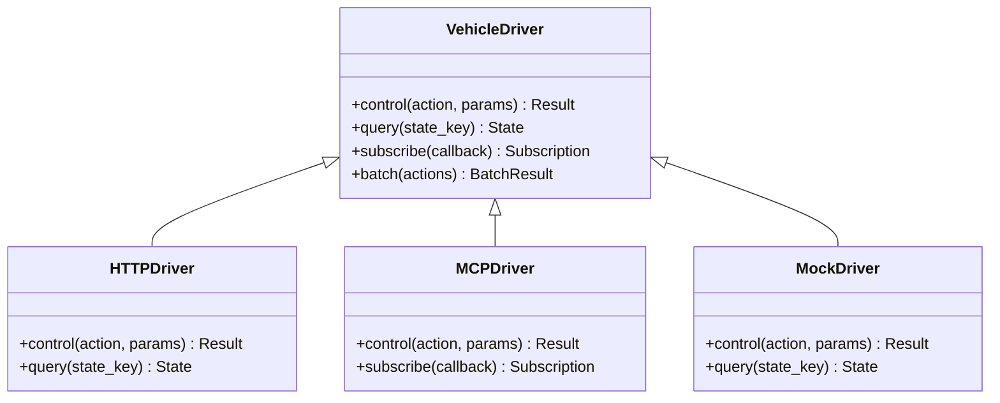

图表来源
- [backend_design/nexus/vehicle/base.py](file://backend_design/nexus/vehicle/base.py)
- [backend_design/nexus/vehicle/http.py](file://backend_design/nexus/vehicle/http.py)
- [backend_design/nexus/vehicle/mcp.py](file://backend_design/nexus/vehicle/mcp.py)
- [backend_design/nexus/vehicle/mock.py](file://backend_design/nexus/vehicle/mock.py)
- [backend_design/nexus/vehicle/factory.py](file://backend_design/nexus/vehicle/factory.py)

章节来源
- [backend_design/nexus/vehicle/base.py](file://backend_design/nexus/vehicle/base.py)
- [backend_design/nexus/vehicle/factory.py](file://backend_design/nexus/vehicle/factory.py)

### 意图识别与专家编排
- 意图路由
  - 将用户指令解析为具体技能调用
- 车辆专家
  - 协调多个技能完成复杂场景（如“回家模式”：关闭车窗、调低空调、锁定车门）

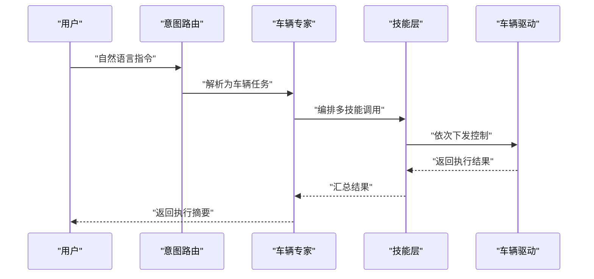

图表来源
- [backend_design/nexus/intent/router.py](file://backend_design/nexus/intent/router.py)
- [backend_design/nexus/agent/experts/vehicle_expert.py](file://backend_design/nexus/agent/experts/vehicle_expert.py)
- [backend_design/nexus/skills/vehicle/climate.py](file://backend_design/nexus/skills/vehicle/climate.py)
- [backend_design/nexus/skills/vehicle/window.py](file://backend_design/nexus/skills/vehicle/window.py)
- [backend_design/nexus/vehicle/base.py](file://backend_design/nexus/vehicle/base.py)

章节来源
- [backend_design/nexus/intent/router.py](file://backend_design/nexus/intent/router.py)
- [backend_design/nexus/agent/experts/vehicle_expert.py](file://backend_design/nexus/agent/experts/vehicle_expert.py)

## 依赖分析
- 组件耦合
  - 路由层对技能层弱耦合，通过统一接口调用
  - 技能层对驱动层解耦，便于替换后端实现
- 外部依赖
  - HTTP 驱动依赖网络稳定性
  - MCP 驱动依赖消息总线可用性
  - WebSocket 依赖长连接稳定性
- 潜在风险
  - 驱动超时与重试策略
  - 并发控制与资源竞争
  - 状态一致性保障

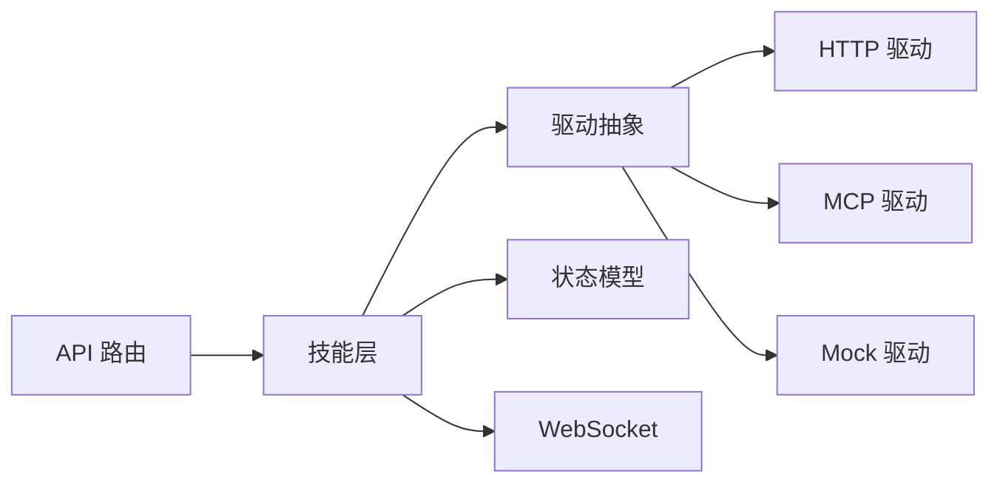

图表来源
- [backend_design/nexus/api/routes/vehicle.py](file://backend_design/nexus/api/routes/vehicle.py)
- [backend_design/nexus/skills/vehicle/climate.py](file://backend_design/nexus/skills/vehicle/climate.py)
- [backend_design/nexus/vehicle/base.py](file://backend_design/nexus/vehicle/base.py)
- [backend_design/nexus/vehicle/http.py](file://backend_design/nexus/vehicle/http.py)
- [backend_design/nexus/vehicle/mcp.py](file://backend_design/nexus/vehicle/mcp.py)
- [backend_design/nexus/vehicle/mock.py](file://backend_design/nexus/vehicle/mock.py)
- [backend_design/nexus/models/state.py](file://backend_design/nexus/models/state.py)
- [backend_design/nexus/api/websocket.py](file://backend_design/nexus/api/websocket.py)

章节来源
- [backend_design/nexus/vehicle/factory.py](file://backend_design/nexus/vehicle/factory.py)
- [backend_design/nexus/api/websocket.py](file://backend_design/nexus/api/websocket.py)

## 性能考虑
- 批量操作
  - 合并多次控制为一次批量请求，减少网络往返
- 缓存与去抖
  - 高频状态查询可使用短期缓存
  - 快速连续控制请求应去抖
- 超时与重试
  - 合理设置超时阈值与重试次数
  - 失败降级策略（如切换到 Mock 或只读模式）
- 并发控制
  - 限制同一车辆的并发控制数，避免资源争用

[本节为通用指导，不直接分析具体文件]

## 故障排查指南
- 常见问题
  - 鉴权失败：检查令牌有效期与权限范围
  - 参数错误：核对字段类型与取值范围
  - 驱动不可用：检查 HTTP/MCP 连通性与认证
  - 状态不同步：确认 WebSocket 连接与订阅主题
- 定位步骤
  - 查看请求日志与追踪 ID
  - 检查技能层输入输出日志
  - 观察 WebSocket 事件流
  - 在 Mock 环境下复现问题

章节来源
- [backend_design/nexus/core/auth.py](file://backend_design/nexus/core/auth.py)
- [backend_design/nexus/api/websocket.py](file://backend_design/nexus/api/websocket.py)

## 结论
本 API 文档系统化梳理了 NexusCockpit 车辆控制模块的接口与流程，明确了各子系统的职责边界、参数校验规则、执行反馈与安全策略。通过统一的驱动抽象与工厂模式，系统具备良好的扩展性与可维护性。结合 WebSocket 的状态同步与意图/专家编排，可实现从简单控制到复杂场景的一体化体验。

[本节为总结性内容，不直接分析具体文件]

## 附录

### 接口清单与示例
- 空调控制
  - 设置温度/风量/风向/模式
  - 示例：单次设置空调温度与风量
- 导航管理
  - 设置目的地/取消导航/查询状态
  - 示例：设置目的地并返回 ETA
- 媒体播放
  - 播放/暂停/切歌/音量
  - 示例：切换播放源并调整音量
- 座椅调节
  - 前后移动/靠背角度/加热/通风
  - 示例：设置主驾位置并开启加热
- 车窗控制
  - 开/关指定车窗/一键升降
  - 示例：关闭后排车窗并设置防夹
- 组合操作
  - “回家模式”：关闭车窗、调低空调、锁定车门
  - “出行模式”：打开导航、调高空调、播放音乐

[本节为概念性示例，不直接分析具体文件]

### 安全与协议
- 安全策略
  - 鉴权：令牌校验与权限控制
  - 限流：防止滥用与资源耗尽
  - 幂等：重复请求的安全处理
  - 回滚：关键操作的补偿机制
- 通信协议
  - HTTP：RESTful 控制与查询
  - WebSocket：实时状态推送
  - MCP：异步消息通道（可选）

[本节为概念性说明，不直接分析具体文件]