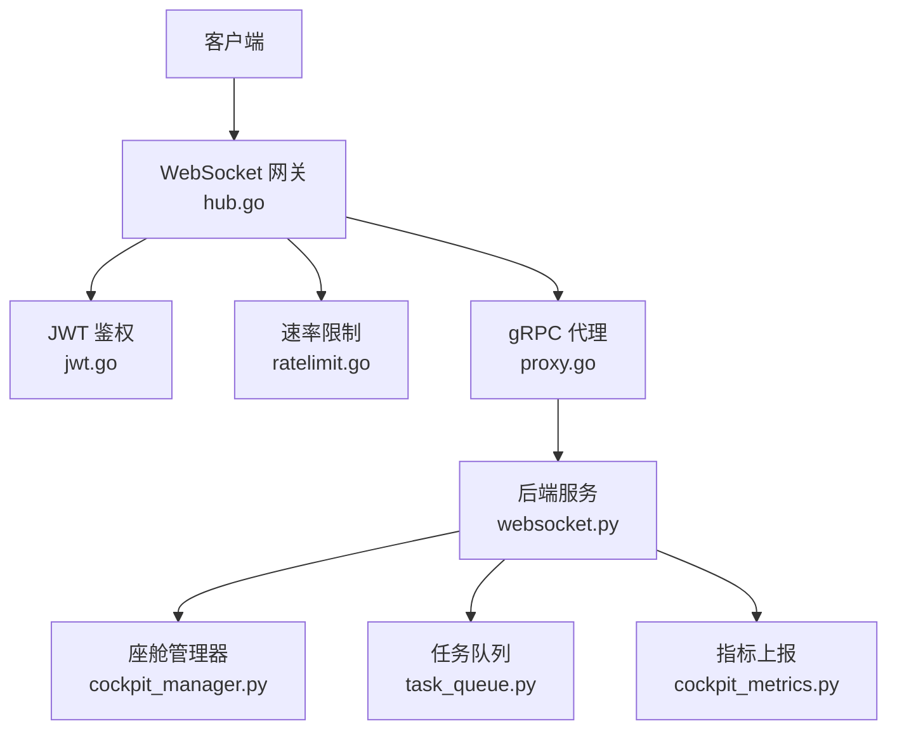
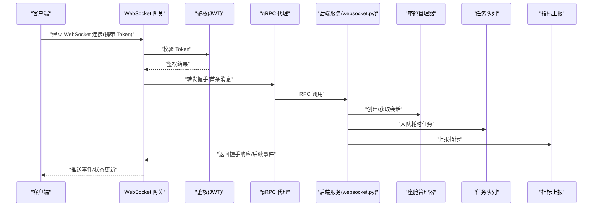
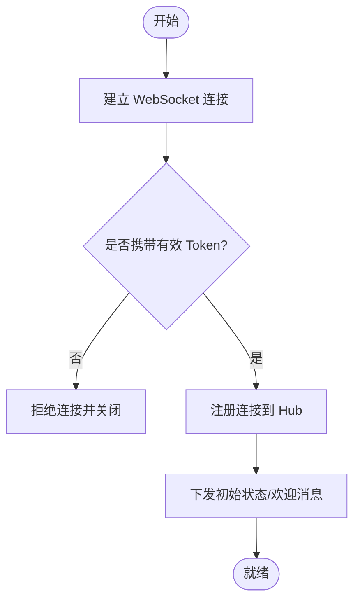
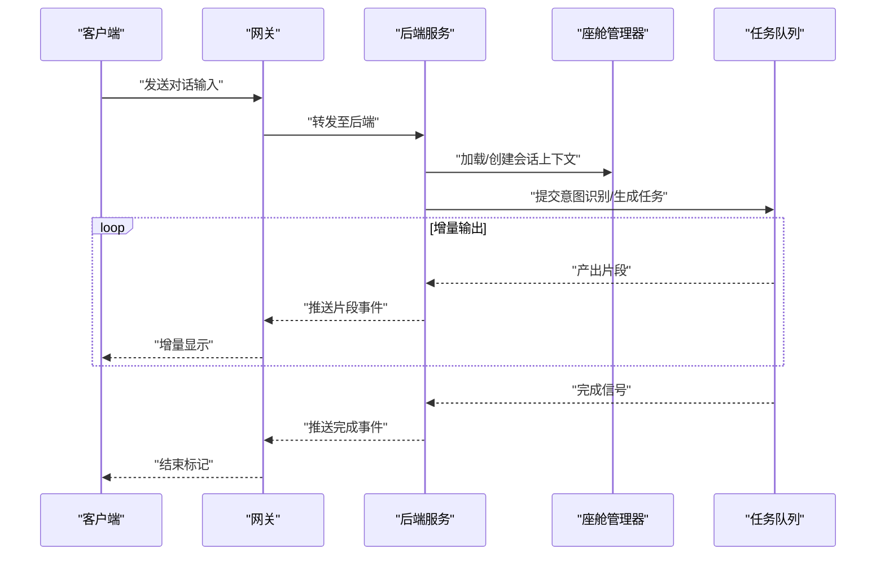
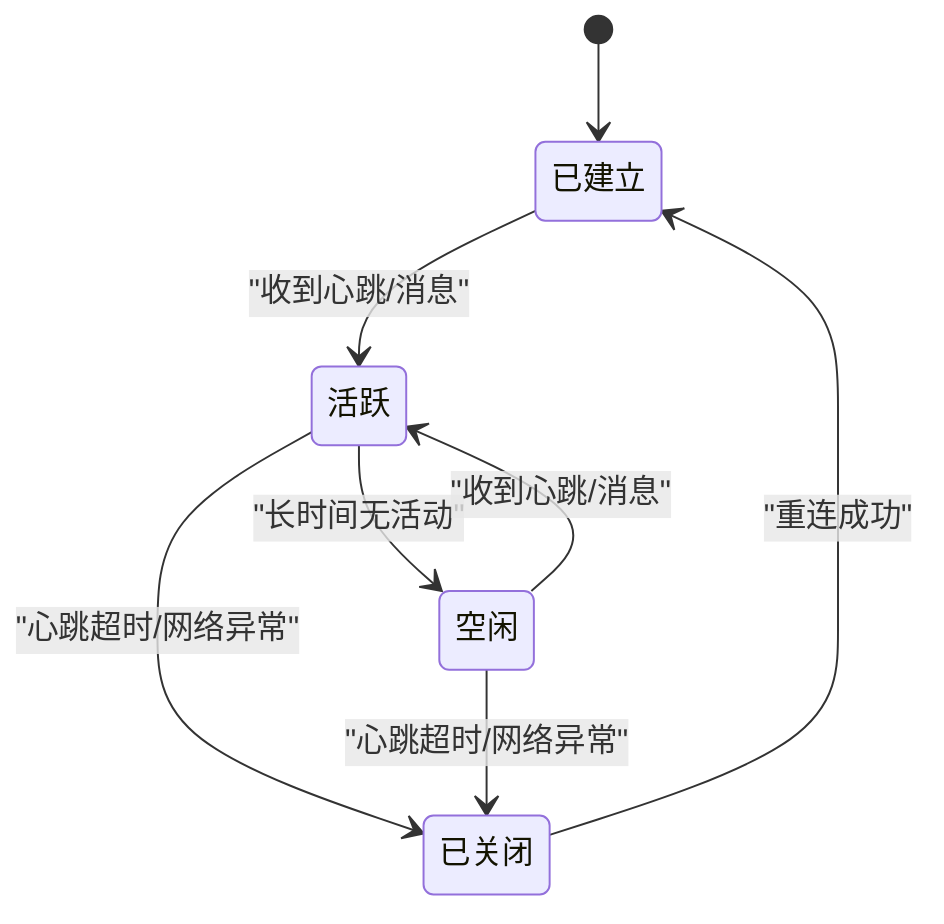
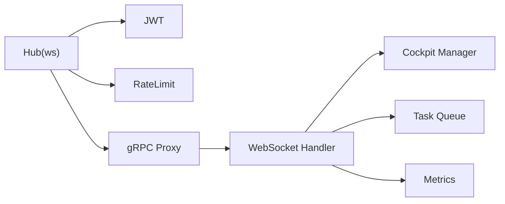

# WebSocket实时接口

<cite>
**本文引用的文件**   
- [backend_design/nexus/api/websocket.py](file://backend_design/nexus/api/websocket.py)
- [backend_design/nexus/core/cockpit_manager.py](file://backend_design/nexus/core/cockpit_manager.py)
- [backend_design/nexus/models/schemas.py](file://backend_design/nexus/models/schemas.py)
- [backend_design/nexus/middleware/task_queue.py](file://backend_design/nexus/middleware/task_queue.py)
- [backend_design/nexus/observability/cockpit_metrics.py](file://backend_design/nexus/observability/cockpit_metrics.py)
- [backend_design/nexus_gate/internal/ws/hub.go](file://backend_design/nexus_gate/internal/ws/hub.go)
- [backend_design/nexus_gate/internal/auth/jwt.go](file://backend_design/nexus_gate/internal/auth/jwt.go)
- [backend_design/nexus_gate/internal/proxy/proxy.go](file://backend_design/nexus_gate/internal/proxy/proxy.go)
- [backend_design/nexus_gate/internal/ratelimit/ratelimit.go](file://backend_design/nexus_gate/internal/ratelimit/ratelimit.go)
- [backend_design/nexus_gate/proto/nexus.proto](file://backend_design/nexus_gate/proto/nexus.proto)
- [frontend_design/src/lib/vehicle-events.ts](file://frontend_design/src/lib/vehicle-events.ts)
</cite>

## 目录
1. [简介](#简介)
2. [项目结构](#项目结构)
3. [核心组件](#核心组件)
4. [架构总览](#架构总览)
5. [详细组件分析](#详细组件分析)
6. [依赖分析](#依赖分析)
7. [性能考虑](#性能考虑)
8. [故障排查指南](#故障排查指南)
9. [结论](#结论)
10. [附录](#附录)

## 简介
本文件为 NexusCockpit 系统的 WebSocket 实时通信接口文档，覆盖连接建立、认证握手、消息格式与事件类型定义，并给出典型场景（实时对话流、车辆状态同步、系统监控数据推送）的消息结构。同时提供连接管理、错误重连、心跳检测的实现指南，以及客户端集成示例、性能优化建议与调试工具使用方法。最后记录并发连接限制、消息队列处理与内存管理策略。

## 项目结构
NexusCockpit 的 WebSocket 能力由网关层（Go）与应用服务层（Python）共同实现：
- 网关层负责接入、鉴权、限流、转发与广播；
- 应用服务层负责业务逻辑、会话编排、任务队列与指标上报。

图表来源
- [backend_design/nexus_gate/internal/ws/hub.go](file://backend_design/nexus_gate/internal/ws/hub.go)
- [backend_design/nexus_gate/internal/auth/jwt.go](file://backend_design/nexus_gate/internal/auth/jwt.go)
- [backend_design/nexus_gate/internal/ratelimit/ratelimit.go](file://backend_design/nexus_gate/internal/ratelimit/ratelimit.go)
- [backend_design/nexus_gate/internal/proxy/proxy.go](file://backend_design/nexus_gate/internal/proxy/proxy.go)
- [backend_design/nexus/api/websocket.py](file://backend_design/nexus/api/websocket.py)
- [backend_design/nexus/core/cockpit_manager.py](file://backend_design/nexus/core/cockpit_manager.py)
- [backend_design/nexus/middleware/task_queue.py](file://backend_design/nexus/middleware/task_queue.py)
- [backend_design/nexus/observability/cockpit_metrics.py](file://backend_design/nexus/observability/cockpit_metrics.py)

章节来源
- [backend_design/nexus/api/websocket.py](file://backend_design/nexus/api/websocket.py)
- [backend_design/nexus_gate/internal/ws/hub.go](file://backend_design/nexus_gate/internal/ws/hub.go)

## 核心组件
- WebSocket 网关（Hub）：维护连接集合、订阅/发布通道、广播与路由。
- 鉴权模块（JWT）：校验令牌、解析用户上下文。
- 速率限制：控制单连接或全局消息吞吐。
- gRPC 代理：将 WebSocket 帧转换为内部 RPC 调用，桥接至 Python 服务。
- 后端 WebSocket 处理器：解析协议、执行业务、调度任务、推送结果。
- 座舱管理器：统一会话与状态管理。
- 任务队列：异步处理耗时操作，避免阻塞主循环。
- 指标上报：采集连接数、消息吞吐、延迟等关键指标。

章节来源
- [backend_design/nexus_gate/internal/ws/hub.go](file://backend_design/nexus_gate/internal/ws/hub.go)
- [backend_design/nexus_gate/internal/auth/jwt.go](file://backend_design/nexus_gate/internal/auth/jwt.go)
- [backend_design/nexus_gate/internal/ratelimit/ratelimit.go](file://backend_design/nexus_gate/internal/ratelimit/ratelimit.go)
- [backend_design/nexus_gate/internal/proxy/proxy.go](file://backend_design/nexus_gate/internal/proxy/proxy.go)
- [backend_design/nexus/api/websocket.py](file://backend_design/nexus/api/websocket.py)
- [backend_design/nexus/core/cockpit_manager.py](file://backend_design/nexus/core/cockpit_manager.py)
- [backend_design/nexus/middleware/task_queue.py](file://backend_design/nexus/middleware/task_queue.py)
- [backend_design/nexus/observability/cockpit_metrics.py](file://backend_design/nexus/observability/cockpit_metrics.py)

## 架构总览
整体采用“前端 -> 网关 -> 后端”的分层架构。网关承担高并发接入与鉴权，后端专注业务处理与状态同步。

图表来源
- [backend_design/nexus_gate/internal/ws/hub.go](file://backend_design/nexus_gate/internal/ws/hub.go)
- [backend_design/nexus_gate/internal/auth/jwt.go](file://backend_design/nexus_gate/internal/auth/jwt.go)
- [backend_design/nexus_gate/internal/proxy/proxy.go](file://backend_design/nexus_gate/internal/proxy/proxy.go)
- [backend_design/nexus/api/websocket.py](file://backend_design/nexus/api/websocket.py)
- [backend_design/nexus/core/cockpit_manager.py](file://backend_design/nexus/core/cockpit_manager.py)
- [backend_design/nexus/middleware/task_queue.py](file://backend_design/nexus/middleware/task_queue.py)
- [backend_design/nexus/observability/cockpit_metrics.py](file://backend_design/nexus/observability/cockpit_metrics.py)

## 详细组件分析

### 连接建立与认证握手流程
- 客户端通过标准 WebSocket 协议发起连接，并在查询参数或首条消息中携带 JWT Token。
- 网关在握手阶段进行鉴权，失败则关闭连接。
- 鉴权通过后，网关将连接注册到 Hub，并建立订阅关系。
- 首次握手成功后，服务端可下发初始状态或欢迎消息。

图表来源
- [backend_design/nexus_gate/internal/ws/hub.go](file://backend_design/nexus_gate/internal/ws/hub.go)
- [backend_design/nexus_gate/internal/auth/jwt.go](file://backend_design/nexus_gate/internal/auth/jwt.go)

章节来源
- [backend_design/nexus_gate/internal/ws/hub.go](file://backend_design/nexus_gate/internal/ws/hub.go)
- [backend_design/nexus_gate/internal/auth/jwt.go](file://backend_design/nexus_gate/internal/auth/jwt.go)

### 消息格式规范与事件类型
- 所有消息采用统一的 JSON 信封结构，包含消息类型、请求标识、时间戳、载荷等字段。
- 事件类型涵盖：
  - 会话相关：对话开始、对话片段、对话结束、澄清问题等
  - 车辆状态：位置、能耗、车门/车窗、空调、媒体播放等
  - 系统监控：健康检查、告警、指标快照等
- 具体字段定义与枚举值以模型与协议为准。

章节来源
- [backend_design/nexus/models/schemas.py](file://backend_design/nexus/models/schemas.py)
- [backend_design/nexus_gate/proto/nexus.proto](file://backend_design/nexus_gate/proto/nexus.proto)

### 实时对话流
- 客户端发送对话输入后，后端进入意图识别与执行链路，逐步推送中间状态与最终结果。
- 支持增量输出（分片）、中断与重试。
- 对话上下文与会话 ID 贯穿整个流程。

图表来源
- [backend_design/nexus/api/websocket.py](file://backend_design/nexus/api/websocket.py)
- [backend_design/nexus/core/cockpit_manager.py](file://backend_design/nexus/core/cockpit_manager.py)
- [backend_design/nexus/middleware/task_queue.py](file://backend_design/nexus/middleware/task_queue.py)

章节来源
- [backend_design/nexus/api/websocket.py](file://backend_design/nexus/api/websocket.py)
- [backend_design/nexus/core/cockpit_manager.py](file://backend_design/nexus/core/cockpit_manager.py)
- [backend_design/nexus/middleware/task_queue.py](file://backend_design/nexus/middleware/task_queue.py)

### 车辆状态同步
- 服务端周期性或事件驱动地推送车辆状态变更。
- 客户端可按需订阅特定主题或过滤条件，减少带宽占用。
- 支持合并与去抖，避免高频抖动导致 UI 频繁刷新。

章节来源
- [backend_design/nexus/api/websocket.py](file://backend_design/nexus/api/websocket.py)
- [frontend_design/src/lib/vehicle-events.ts](file://frontend_design/src/lib/vehicle-events.ts)

### 系统监控数据推送
- 服务端定时推送系统健康、资源使用与业务指标。
- 客户端可渲染仪表盘或触发告警。
- 指标包含连接数、消息吞吐、延迟分布等。

章节来源
- [backend_design/nexus/observability/cockpit_metrics.py](file://backend_design/nexus/observability/cockpit_metrics.py)
- [backend_design/nexus/api/websocket.py](file://backend_design/nexus/api/websocket.py)

### 连接管理与心跳检测
- 心跳：客户端与服务端定期互发心跳帧，超时未收到则判定断开。
- 断线重连：客户端指数退避重试，带随机抖动，避免雪崩。
- 连接生命周期：建立、活跃、空闲、关闭四态管理。

章节来源
- [backend_design/nexus_gate/internal/ws/hub.go](file://backend_design/nexus_gate/internal/ws/hub.go)

### 错误处理与重连策略
- 常见错误：鉴权失败、速率限制、会话不存在、上游超时。
- 错误码与消息体包含可读信息，便于客户端提示与重试。
- 客户端应区分可重试与不可重试错误，实施差异化策略。

章节来源
- [backend_design/nexus_gate/internal/auth/jwt.go](file://backend_design/nexus_gate/internal/auth/jwt.go)
- [backend_design/nexus_gate/internal/ratelimit/ratelimit.go](file://backend_design/nexus_gate/internal/ratelimit/ratelimit.go)

### 客户端集成示例（概念性说明）
- 初始化连接：传入 Token，设置心跳间隔与最大重连次数。
- 订阅事件：按主题订阅车辆状态、对话增量、监控指标。
- 发送消息：封装统一信封，附带会话 ID 与请求标识。
- 错误处理：捕获网络与协议错误，执行指数退避重连。
- 资源清理：页面卸载时主动关闭连接，释放资源。

章节来源
- [frontend_design/src/lib/vehicle-events.ts](file://frontend_design/src/lib/vehicle-events.ts)

## 依赖分析
- 网关依赖鉴权与限流，确保接入安全与稳定。
- 代理层将 WebSocket 帧映射为内部 RPC，屏蔽语言差异。
- 后端依赖座舱管理器与任务队列，解耦 IO 与计算。
- 指标模块贯穿全链路，提供可观测性。

图表来源
- [backend_design/nexus_gate/internal/ws/hub.go](file://backend_design/nexus_gate/internal/ws/hub.go)
- [backend_design/nexus_gate/internal/auth/jwt.go](file://backend_design/nexus_gate/internal/auth/jwt.go)
- [backend_design/nexus_gate/internal/ratelimit/ratelimit.go](file://backend_design/nexus_gate/internal/ratelimit/ratelimit.go)
- [backend_design/nexus_gate/internal/proxy/proxy.go](file://backend_design/nexus_gate/internal/proxy/proxy.go)
- [backend_design/nexus/api/websocket.py](file://backend_design/nexus/api/websocket.py)
- [backend_design/nexus/core/cockpit_manager.py](file://backend_design/nexus/core/cockpit_manager.py)
- [backend_design/nexus/middleware/task_queue.py](file://backend_design/nexus/middleware/task_queue.py)
- [backend_design/nexus/observability/cockpit_metrics.py](file://backend_design/nexus/observability/cockpit_metrics.py)

章节来源
- [backend_design/nexus_gate/internal/ws/hub.go](file://backend_design/nexus_gate/internal/ws/hub.go)
- [backend_design/nexus/api/websocket.py](file://backend_design/nexus/api/websocket.py)

## 性能考虑
- 批量与合并：对高频状态变更进行合并与去抖，降低消息量。
- 背压与限流：网关侧限流，后端侧基于队列容量与消费者速度调节。
- 连接复用与长连接：避免频繁握手，利用心跳维持活跃。
- 序列化优化：选择高效编码，压缩大对象负载。
- 指标驱动：持续观察 P95/P99 延迟、吞吐与内存占用，定位瓶颈。

[本节为通用指导，不直接分析具体文件]

## 故障排查指南
- 连接失败：检查 Token 有效性、网关可达性与证书配置。
- 鉴权失败：核对签名算法、过期时间与权限范围。
- 速率限制：查看限流阈值与客户端发送频率，必要时申请配额。
- 会话异常：确认会话 ID 一致性与上下文完整性。
- 指标异常：结合 Prometheus/Grafana 面板定位热点路径。

章节来源
- [backend_design/nexus_gate/internal/auth/jwt.go](file://backend_design/nexus_gate/internal/auth/jwt.go)
- [backend_design/nexus_gate/internal/ratelimit/ratelimit.go](file://backend_design/nexus_gate/internal/ratelimit/ratelimit.go)
- [backend_design/nexus/observability/cockpit_metrics.py](file://backend_design/nexus/observability/cockpit_metrics.py)

## 结论
NexusCockpit 的 WebSocket 实时通信方案通过网关与后端分层协作，实现了高并发接入、可靠鉴权、灵活的事件分发与完善的可观测性。遵循本文的连接管理、消息规范与性能建议，可快速构建稳定高效的实时功能。

[本节为总结，不直接分析具体文件]

## 附录

### 并发连接限制
- 网关层限制单实例最大连接数与每 IP 的连接上限。
- 后端层限制每租户/用户的并发会话数。
- 超限策略：拒绝新连接或排队等待。

章节来源
- [backend_design/nexus_gate/internal/ws/hub.go](file://backend_design/nexus_gate/internal/ws/hub.go)
- [backend_design/nexus/api/websocket.py](file://backend_design/nexus/api/websocket.py)

### 消息队列处理
- 入队：将耗时任务拆分为可并行单元，分配优先级。
- 出队：消费者拉取任务，处理完成后回写结果或事件。
- 持久化与重试：失败任务持久化并自动重试，保障可靠性。

章节来源
- [backend_design/nexus/middleware/task_queue.py](file://backend_design/nexus/middleware/task_queue.py)

### 内存管理策略
- 对象池：复用消息缓冲与连接句柄，减少 GC 压力。
- 边界控制：限制单连接消息队列长度与单次读取大小。
- 泄漏防护：严格关闭连接、取消协程、释放锁与缓存条目。

章节来源
- [backend_design/nexus_gate/internal/ws/hub.go](file://backend_design/nexus_gate/internal/ws/hub.go)
- [backend_design/nexus/api/websocket.py](file://backend_design/nexus/api/websocket.py)

### 调试工具使用方法
- 本地联调：使用 WebSocket 客户端工具直连网关，注入 Token 与测试消息。
- 日志追踪：开启网关与后端调试日志，关联请求 ID 与会话 ID。
- 指标面板：通过 Grafana 查看连接数、吞吐、延迟与错误率。

章节来源
- [backend_design/nexus/observability/cockpit_metrics.py](file://backend_design/nexus/observability/cockpit_metrics.py)