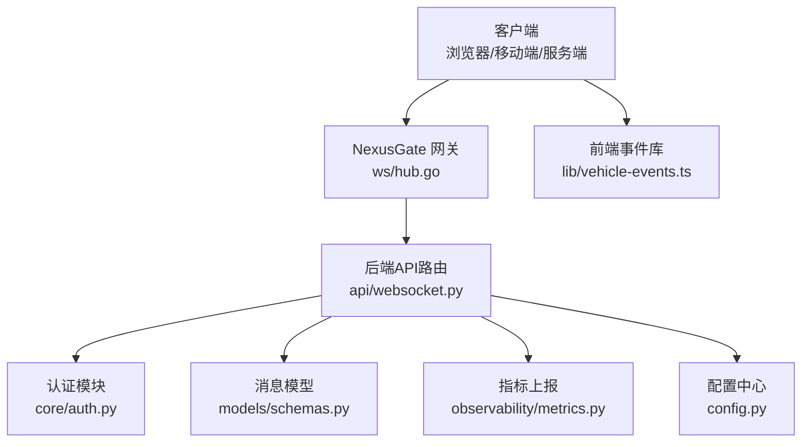
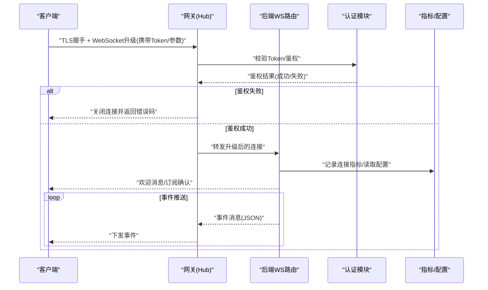
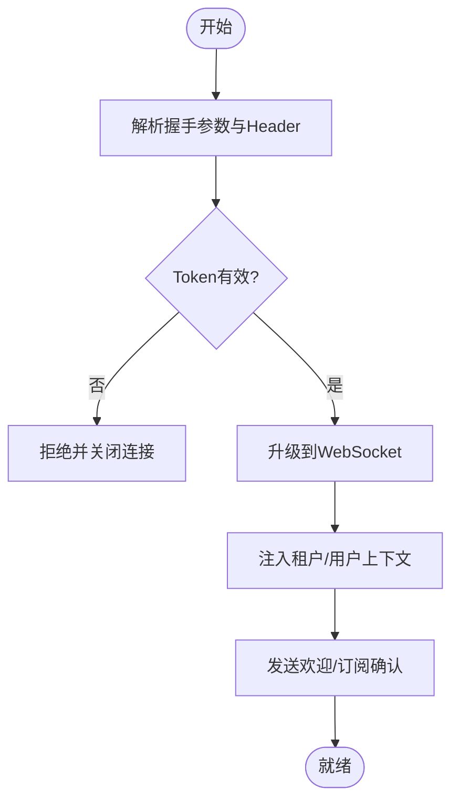
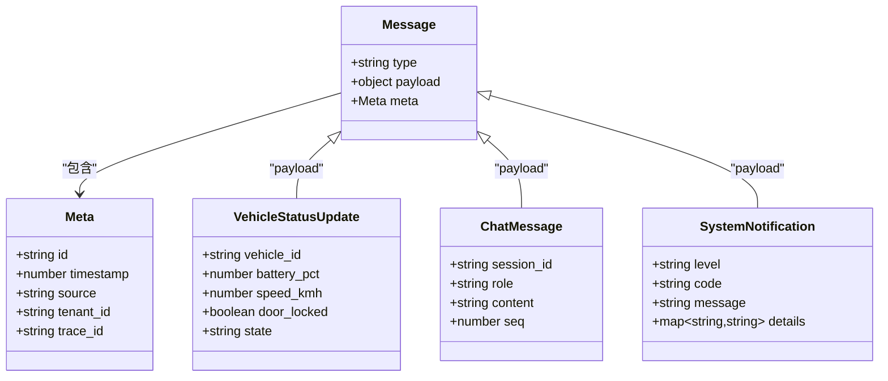
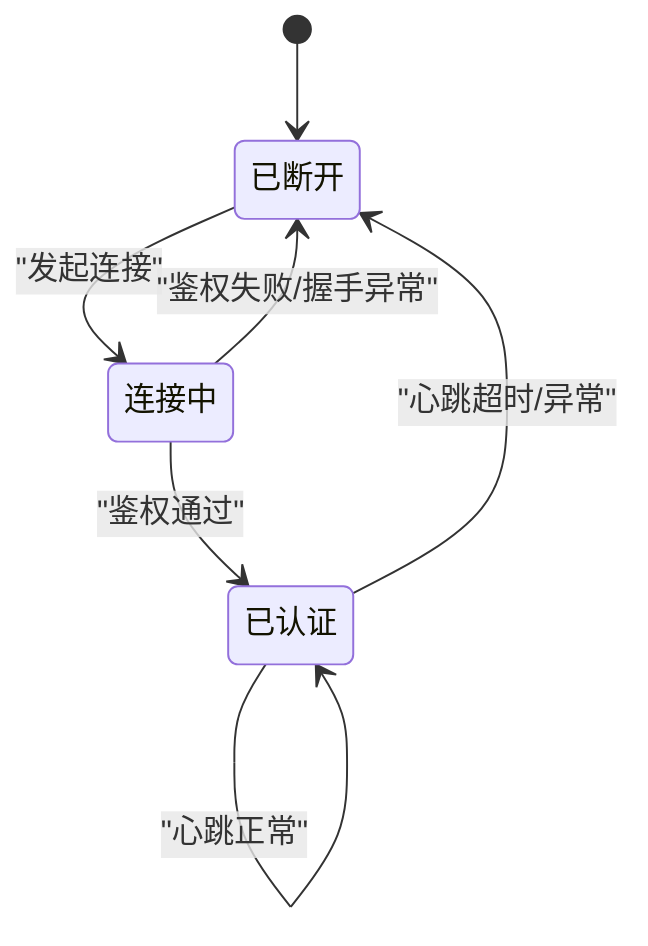
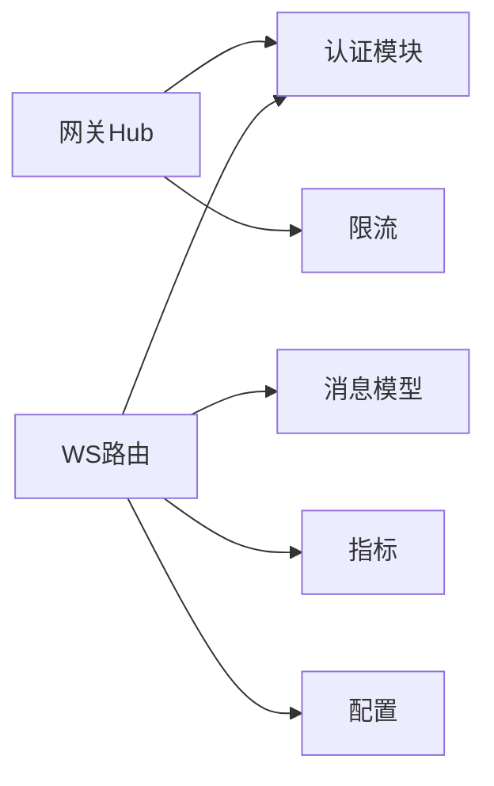

# WebSocket实时通信接口

<cite>
**本文引用的文件**   
- [backend_design/nexus/api/websocket.py](file://backend_design/nexus/api/websocket.py)
- [backend_design/nexus_gate/internal/ws/hub.go](file://backend_design/nexus_gate/internal/ws/hub.go)
- [backend_design/nexus/core/auth.py](file://backend_design/nexus/core/auth.py)
- [backend_design/nexus/models/schemas.py](file://backend_design/nexus/models/schemas.py)
- [backend_design/nexus/intent/constants.py](file://backend_design/nexus/intent/constants.py)
- [backend_design/nexus/observability/metrics.py](file://backend_design/nexus/observability/metrics.py)
- [backend_design/nexus/config.py](file://backend_design/nexus/config.py)
- [frontend_design/src/lib/vehicle-events.ts](file://frontend_design/src/lib/vehicle-events.ts)
</cite>

## 目录
1. [简介](#简介)
2. [项目结构](#项目结构)
3. [核心组件](#核心组件)
4. [架构总览](#架构总览)
5. [详细组件分析](#详细组件分析)
6. [依赖分析](#依赖分析)
7. [性能考虑](#性能考虑)
8. [故障排查指南](#故障排查指南)
9. [结论](#结论)
10. [附录](#附录)

## 简介
本文件面向开发者与集成方，系统化文档化 NexusCockpit 的 WebSocket 实时通信能力。内容覆盖连接建立（握手、认证、参数）、消息格式规范（JSON 结构、事件类型、序列化规则）、事件清单（车辆状态更新、对话消息推送、系统通知等）、连接状态管理（心跳、重连、异常处理）、客户端示例（JavaScript、Python）、安全策略（加密、鉴权、访问控制），以及性能优化与排障建议。

## 项目结构
WebSocket 相关实现横跨网关层（Go）与应用服务层（Python）：
- 网关层：负责长连接接入、Hub 广播、鉴权校验、限流与转发。
- 应用层：提供 WebSocket 路由、业务事件分发、指标上报与配置读取。
- 前端：订阅车辆事件与聊天流式输出等实时数据。

图表来源
- [backend_design/nexus_gate/internal/ws/hub.go](file://backend_design/nexus_gate/internal/ws/hub.go)
- [backend_design/nexus/api/websocket.py](file://backend_design/nexus/api/websocket.py)
- [backend_design/nexus/core/auth.py](file://backend_design/nexus/core/auth.py)
- [backend_design/nexus/models/schemas.py](file://backend_design/nexus/models/schemas.py)
- [backend_design/nexus/observability/metrics.py](file://backend_design/nexus/observability/metrics.py)
- [backend_design/nexus/config.py](file://backend_design/nexus/config.py)
- [frontend_design/src/lib/vehicle-events.ts](file://frontend_design/src/lib/vehicle-events.ts)

章节来源
- [backend_design/nexus/api/websocket.py](file://backend_design/nexus/api/websocket.py)
- [backend_design/nexus_gate/internal/ws/hub.go](file://backend_design/nexus_gate/internal/ws/hub.go)
- [backend_design/nexus/core/auth.py](file://backend_design/nexus/core/auth.py)
- [backend_design/nexus/models/schemas.py](file://backend_design/nexus/models/schemas.py)
- [backend_design/nexus/observability/metrics.py](file://backend_design/nexus/observability/metrics.py)
- [backend_design/nexus/config.py](file://backend_design/nexus/config.py)
- [frontend_design/src/lib/vehicle-events.ts](file://frontend_design/src/lib/vehicle-events.ts)

## 核心组件
- 网关 Hub（Go）
  - 职责：维护连接集合、广播消息、鉴权拦截、限流与错误回写。
  - 关键点：连接生命周期、房间/频道概念、扇出策略。
- 后端 WebSocket 路由（Python）
  - 职责：解析握手参数、调用认证、注册事件处理器、封装响应、上报指标。
  - 关键点：异步消息收发、事件总线对接、序列化与反序列化。
- 认证模块（Python）
  - 职责：校验 Token/JWT、租户上下文注入、权限判定。
- 消息模型（Python）
  - 职责：定义 JSON 载荷结构、字段校验、枚举值约束。
- 指标与配置（Python）
  - 职责：记录连接数、消息吞吐、延迟；读取超时、重试、心跳间隔等配置项。
- 前端事件库（TypeScript）
  - 职责：统一事件名常量、自动重连、断线恢复、UI 驱动。

章节来源
- [backend_design/nexus_gate/internal/ws/hub.go](file://backend_design/nexus_gate/internal/ws/hub.go)
- [backend_design/nexus/api/websocket.py](file://backend_design/nexus/api/websocket.py)
- [backend_design/nexus/core/auth.py](file://backend_design/nexus/core/auth.py)
- [backend_design/nexus/models/schemas.py](file://backend_design/nexus/models/schemas.py)
- [backend_design/nexus/observability/metrics.py](file://backend_design/nexus/observability/metrics.py)
- [backend_design/nexus/config.py](file://backend_design/nexus/config.py)
- [frontend_design/src/lib/vehicle-events.ts](file://frontend_design/src/lib/vehicle-events.ts)

## 架构总览
整体采用“网关接入 + 应用服务”的双层架构。客户端通过 TLS 建立 WebSocket 连接至网关，网关完成鉴权后转发到后端 WebSocket 路由。后端根据事件源（如车辆遥测、对话引擎、系统通知）将消息推送到对应客户端或房间。

图表来源
- [backend_design/nexus_gate/internal/ws/hub.go](file://backend_design/nexus_gate/internal/ws/hub.go)
- [backend_design/nexus/api/websocket.py](file://backend_design/nexus/api/websocket.py)
- [backend_design/nexus/core/auth.py](file://backend_design/nexus/core/auth.py)
- [backend_design/nexus/observability/metrics.py](file://backend_design/nexus/observability/metrics.py)
- [backend_design/nexus/config.py](file://backend_design/nexus/config.py)

## 详细组件分析

### 连接建立与握手流程
- 协议与端口
  - 使用标准 WebSocket 协议，生产环境强制 TLS。
- 握手参数
  - 查询参数：token（鉴权令牌）、client_id（可选，用于去重/追踪）、room/channel（可选，订阅频道）。
  - Header：Authorization（Bearer Token，若未走查询参数）、X-Tenant-ID（多租户场景）。
- 鉴权流程
  - 网关侧优先校验 Token 有效性，失败直接关闭连接。
  - 成功后进入后端路由，进行二次校验与上下文注入。
- 连接参数配置
  - 心跳间隔、最大空闲时间、单连接速率限制、最大消息体大小等由配置中心提供。

图表来源
- [backend_design/nexus_gate/internal/ws/hub.go](file://backend_design/nexus_gate/internal/ws/hub.go)
- [backend_design/nexus/api/websocket.py](file://backend_design/nexus/api/websocket.py)
- [backend_design/nexus/core/auth.py](file://backend_design/nexus/core/auth.py)

章节来源
- [backend_design/nexus_gate/internal/ws/hub.go](file://backend_design/nexus_gate/internal/ws/hub.go)
- [backend_design/nexus/api/websocket.py](file://backend_design/nexus/api/websocket.py)
- [backend_design/nexus/core/auth.py](file://backend_design/nexus/core/auth.py)
- [backend_design/nexus/config.py](file://backend_design/nexus/config.py)

### 消息格式规范
- 通用结构
  - type：事件类型字符串（如 vehicle_status_update、chat_message、system_notification）。
  - payload：事件负载对象，按事件类型定义字段。
  - meta：元信息，包含 id、timestamp、source、tenant_id、trace_id 等。
- 序列化规则
  - 文本编码为 UTF-8 JSON。
  - 数值使用双精度浮点或整数，避免字符串化数字。
  - 时间戳使用 ISO8601 或 Unix 毫秒时间戳（以配置为准）。
  - 空字段可省略或显式为 null，需遵循 schema 约束。
- 校验与容错
  - 服务端对 type 与 payload 进行严格校验，非法消息丢弃并计数。
  - 超大消息拒绝并记录告警。

图表来源
- [backend_design/nexus/models/schemas.py](file://backend_design/nexus/models/schemas.py)
- [backend_design/nexus/intent/constants.py](file://backend_design/nexus/intent/constants.py)

章节来源
- [backend_design/nexus/models/schemas.py](file://backend_design/nexus/models/schemas.py)
- [backend_design/nexus/intent/constants.py](file://backend_design/nexus/intent/constants.py)

### 事件类型清单
- 车辆状态更新
  - 触发条件：车辆遥测周期上报、关键阈值变化、诊断事件。
  - 负载字段：车辆标识、电量、速度、门锁状态、运行状态等。
- 对话消息推送
  - 触发条件：LLM 流式输出、ASR/TTS 中间态、会话状态变更。
  - 负载字段：会话ID、角色、内容片段、序列号。
- 系统通知
  - 触发条件：运维告警、任务完成、配置变更、健康检查异常。
  - 负载字段：级别、错误码、消息文本、详情键值对。
- 其他扩展事件
  - 预留扩展机制，type 命名采用小写下划线风格，新增事件需在常量与 schema 中登记。

章节来源
- [backend_design/nexus/intent/constants.py](file://backend_design/nexus/intent/constants.py)
- [backend_design/nexus/models/schemas.py](file://backend_design/nexus/models/schemas.py)

### 连接状态管理
- 心跳机制
  - 客户端与服务端双向心跳，间隔与超时由配置决定。
  - 心跳帧不占用业务带宽，失败则触发清理。
- 重连策略
  - 指数退避 + 抖动，最大重试次数与上限间隔受配置控制。
  - 支持按房间/频道的增量同步，避免全量拉取。
- 异常处理
  - 网络中断、鉴权过期、消息超限、非法类型等均有明确错误码与日志。
  - 服务端主动关闭前发送终止帧，客户端优雅退出并重试。

图表来源
- [backend_design/nexus/api/websocket.py](file://backend_design/nexus/api/websocket.py)
- [backend_design/nexus/config.py](file://backend_design/nexus/config.py)

章节来源
- [backend_design/nexus/api/websocket.py](file://backend_design/nexus/api/websocket.py)
- [backend_design/nexus/config.py](file://backend_design/nexus/config.py)

### 客户端连接示例（参考路径）
- JavaScript（浏览器）
  - 要点：创建 WebSocket 实例、附加 Token 与查询参数、监听 open/message/close/error、实现心跳与指数退避重连。
  - 参考路径：[前端事件库](file://frontend_design/src/lib/vehicle-events.ts)
- Python（服务端/脚本）
  - 要点：使用异步 WebSocket 客户端库、设置超时与重试、解析 JSON 事件、按 type 分派处理。
  - 参考路径：[后端消息模型](file://backend_design/nexus/models/schemas.py)、[事件常量](file://backend_design/nexus/intent/constants.py)

章节来源
- [frontend_design/src/lib/vehicle-events.ts](file://frontend_design/src/lib/vehicle-events.ts)
- [backend_design/nexus/models/schemas.py](file://backend_design/nexus/models/schemas.py)
- [backend_design/nexus/intent/constants.py](file://backend_design/nexus/intent/constants.py)

### 安全考虑
- 传输加密
  - 生产环境强制 wss://，证书与密钥管理遵循平台规范。
- 身份验证
  - 基于 JWT/Bearer Token 的无状态鉴权，支持短期令牌刷新。
- 访问控制
  - 基于租户 ID 与角色的房间级隔离，禁止跨租户广播。
- 输入校验与防护
  - 严格的 JSON Schema 校验、消息大小限制、频率限制与黑名单。

章节来源
- [backend_design/nexus/core/auth.py](file://backend_design/nexus/core/auth.py)
- [backend_design/nexus_gate/internal/ws/hub.go](file://backend_design/nexus_gate/internal/ws/hub.go)
- [backend_design/nexus/config.py](file://backend_design/nexus/config.py)

## 依赖分析
- 组件耦合
  - 网关 Hub 依赖认证与限流；后端路由依赖认证、模型与指标。
- 外部依赖
  - 指标采集（Prometheus/Grafana）、配置中心、日志与链路追踪。
- 潜在环依赖
  - 通过事件总线解耦，避免路由与业务模块直接循环引用。

图表来源
- [backend_design/nexus_gate/internal/ws/hub.go](file://backend_design/nexus_gate/internal/ws/hub.go)
- [backend_design/nexus/api/websocket.py](file://backend_design/nexus/api/websocket.py)
- [backend_design/nexus/core/auth.py](file://backend_design/nexus/core/auth.py)
- [backend_design/nexus/models/schemas.py](file://backend_design/nexus/models/schemas.py)
- [backend_design/nexus/observability/metrics.py](file://backend_design/nexus/observability/metrics.py)
- [backend_design/nexus/config.py](file://backend_design/nexus/config.py)

章节来源
- [backend_design/nexus_gate/internal/ws/hub.go](file://backend_design/nexus_gate/internal/ws/hub.go)
- [backend_design/nexus/api/websocket.py](file://backend_design/nexus/api/websocket.py)
- [backend_design/nexus/core/auth.py](file://backend_design/nexus/core/auth.py)
- [backend_design/nexus/models/schemas.py](file://backend_design/nexus/models/schemas.py)
- [backend_design/nexus/observability/metrics.py](file://backend_design/nexus/observability/metrics.py)
- [backend_design/nexus/config.py](file://backend_design/nexus/config.py)

## 性能考虑
- 连接复用与批量发送
  - 合并高频小消息，降低帧开销。
- 背压与限流
  - 客户端侧实现消费速率控制，服务端按连接/租户维度限流。
- 内存与GC
  - 避免大对象常驻，及时释放缓冲区；合理设置心跳与超时。
- 观测性
  - 暴露连接数、消息吞吐、P95/P99 延迟、错误率等指标。

章节来源
- [backend_design/nexus/observability/metrics.py](file://backend_design/nexus/observability/metrics.py)
- [backend_design/nexus/config.py](file://backend_design/nexus/config.py)

## 故障排查指南
- 常见问题
  - 握手失败：检查 Token 有效期、签名算法、跨域与证书。
  - 频繁断线：核对心跳间隔与超时配置，观察网络抖动。
  - 消息乱序：确保客户端按序列号重组，必要时启用增量同步。
  - 鉴权越权：校验租户 ID 与角色权限，审计访问日志。
- 定位步骤
  - 查看网关与后端日志中的错误码与 trace_id。
  - 抓取抓包数据，确认握手与心跳帧。
  - 对比配置项与实际运行值，定位不一致处。
- 恢复策略
  - 快速降级：关闭非关键事件推送，保留核心通道。
  - 熔断与隔离：对异常租户或房间进行隔离，防止扩散。

章节来源
- [backend_design/nexus/api/websocket.py](file://backend_design/nexus/api/websocket.py)
- [backend_design/nexus_gate/internal/ws/hub.go](file://backend_design/nexus_gate/internal/ws/hub.go)
- [backend_design/nexus/core/auth.py](file://backend_design/nexus/core/auth.py)

## 结论
本接口通过网关与应用分层设计，实现了高可用、可扩展的 WebSocket 实时通信能力。统一的 JSON 消息模型与清晰的事件分类，配合完善的心跳、重连与安全策略，可满足车控、对话与系统通知等多场景需求。建议在生产环境强化观测性与限流策略，持续优化端到端延迟与稳定性。

## 附录
- 术语
  - 房间/频道：逻辑分组，便于定向推送。
  - 心跳：保活帧，维持连接活跃。
  - 指数退避：重连间隔随失败次数增长并加入随机抖动。
- 参考实现路径
  - 前端事件库：[vehicle-events.ts](file://frontend_design/src/lib/vehicle-events.ts)
  - 网关 Hub：[hub.go](file://backend_design/nexus_gate/internal/ws/hub.go)
  - 后端路由：[websocket.py](file://backend_design/nexus/api/websocket.py)
  - 认证模块：[auth.py](file://backend_design/nexus/core/auth.py)
  - 消息模型：[schemas.py](file://backend_design/nexus/models/schemas.py)
  - 事件常量：[constants.py](file://backend_design/nexus/intent/constants.py)
  - 指标与配置：[metrics.py](file://backend_design/nexus/observability/metrics.py)、[config.py](file://backend_design/nexus/config.py)