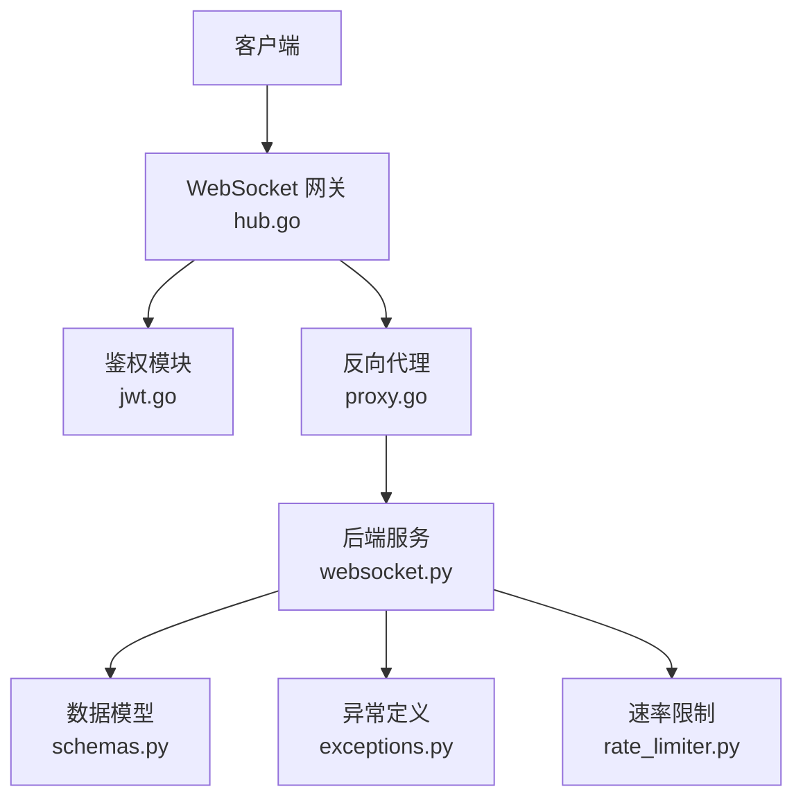
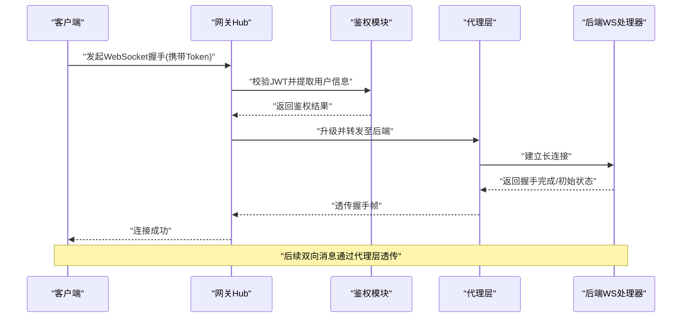
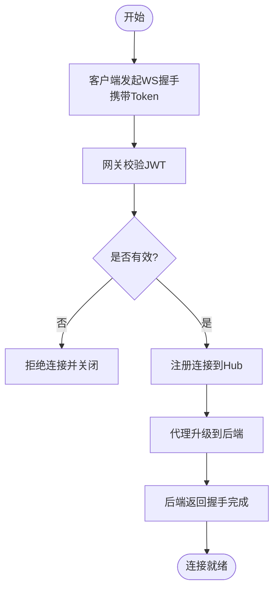
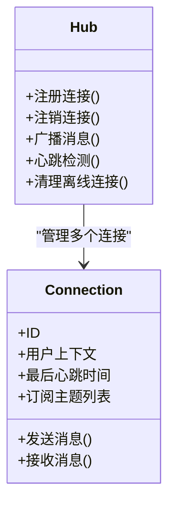
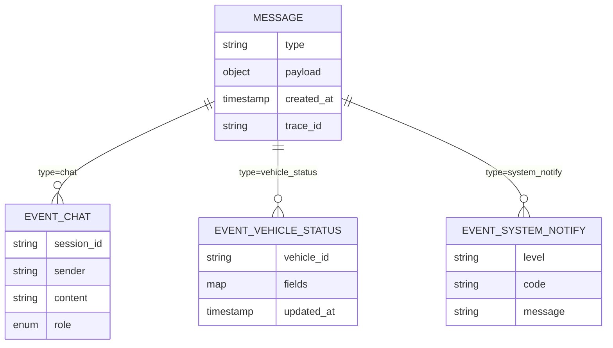
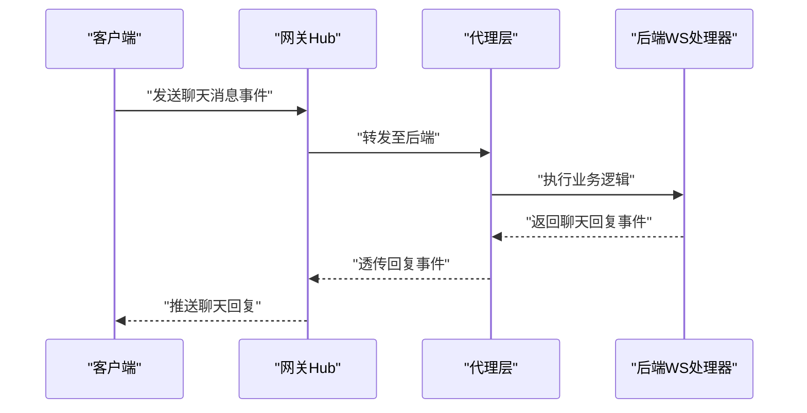
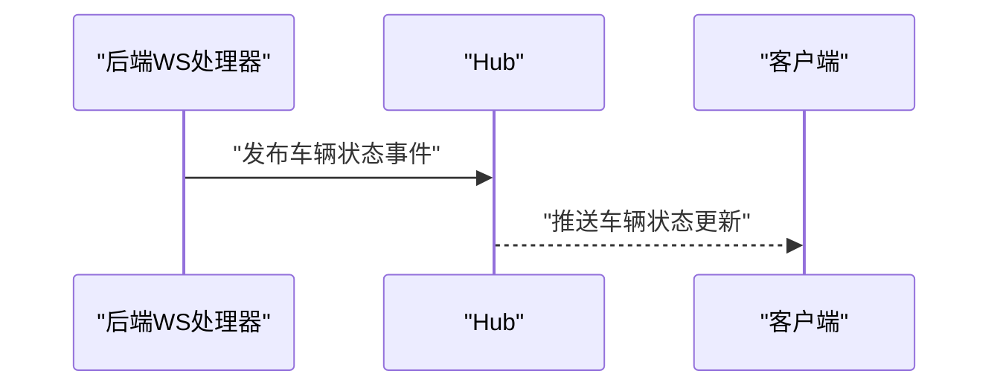
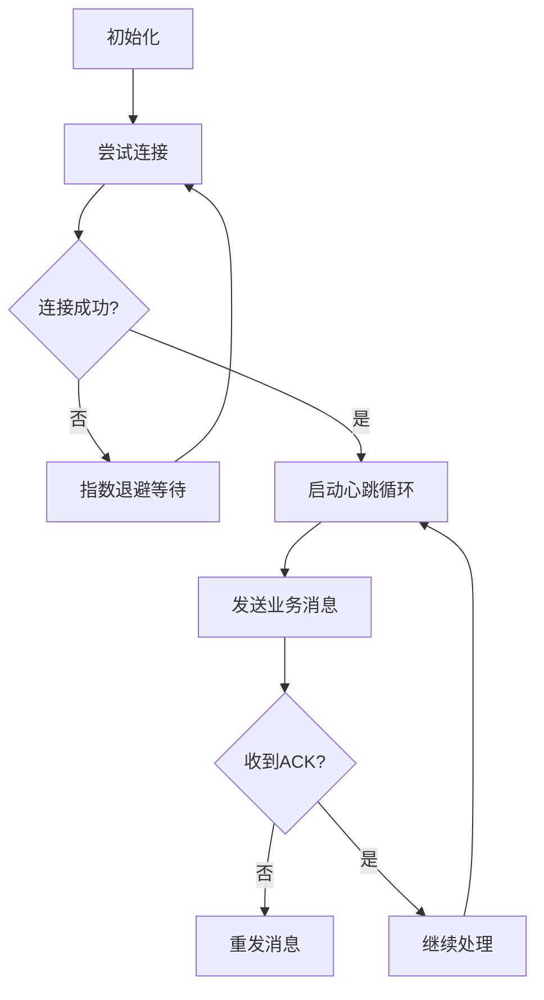
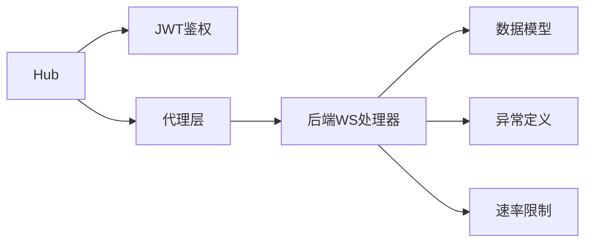

# WebSocket实时通信接口

<cite>
**本文引用的文件**   
- [backend_design/nexus/api/websocket.py](file://backend_design/nexus/api/websocket.py)
- [backend_design/nexus_gate/internal/ws/hub.go](file://backend_design/nexus_gate/internal/ws/hub.go)
- [backend_design/nexus_gate/internal/auth/jwt.go](file://backend_design/nexus_gate/internal/auth/jwt.go)
- [backend_design/nexus_gate/internal/proxy/proxy.go](file://backend_design/nexus_gate/internal/proxy/proxy.go)
- [backend_design/nexus/core/exceptions.py](file://backend_design/nexus/core/exceptions.py)
- [backend_design/nexus/middleware/rate_limiter.py](file://backend_design/nexus/middleware/rate_limiter.py)
- [backend_design/nexus/models/schemas.py](file://backend_design/nexus/models/schemas.py)
- [frontend_design/src/lib/vehicle-events.ts](file://frontend_design/src/lib/vehicle-events.ts)
</cite>

## 目录
1. [简介](#简介)
2. [项目结构](#项目结构)
3. [核心组件](#核心组件)
4. [架构总览](#架构总览)
5. [详细组件分析](#详细组件分析)
6. [依赖关系分析](#依赖关系分析)
7. [性能考虑](#性能考虑)
8. [故障排查指南](#故障排查指南)
9. [结论](#结论)
10. [附录](#附录)

## 简介
本文件面向接入方，系统化说明NexusCockpit的WebSocket实时通信接口，包括：
- 连接建立与认证流程（含JWT鉴权）
- 连接管理与生命周期事件（心跳、断线重连、流量控制）
- 消息协议与事件格式（基础事件、聊天消息、车辆状态更新、系统通知等）
- 客户端接入示例与错误处理策略
- 性能优化建议与调试方法

## 项目结构
本项目采用“网关 + 后端服务”的双层架构：
- 网关（Go）：负责WebSocket握手、鉴权、路由转发、连接管理、限流与代理。
- 后端（Python）：提供业务逻辑、消息分发、存储与指标上报。

图表来源
- [backend_design/nexus_gate/internal/ws/hub.go](file://backend_design/nexus_gate/internal/ws/hub.go)
- [backend_design/nexus_gate/internal/auth/jwt.go](file://backend_design/nexus_gate/internal/auth/jwt.go)
- [backend_design/nexus_gate/internal/proxy/proxy.go](file://backend_design/nexus_gate/internal/proxy/proxy.go)
- [backend_design/nexus/api/websocket.py](file://backend_design/nexus/api/websocket.py)
- [backend_design/nexus/models/schemas.py](file://backend_design/nexus/models/schemas.py)
- [backend_design/nexus/core/exceptions.py](file://backend_design/nexus/core/exceptions.py)
- [backend_design/nexus/middleware/rate_limiter.py](file://backend_design/nexus/middleware/rate_limiter.py)

章节来源
- [backend_design/nexus_gate/internal/ws/hub.go](file://backend_design/nexus_gate/internal/ws/hub.go)
- [backend_design/nexus_gate/internal/auth/jwt.go](file://backend_design/nexus_gate/internal/auth/jwt.go)
- [backend_design/nexus_gate/internal/proxy/proxy.go](file://backend_design/nexus_gate/internal/proxy/proxy.go)
- [backend_design/nexus/api/websocket.py](file://backend_design/nexus/api/websocket.py)

## 核心组件
- 网关Hub：维护连接集合、广播、订阅/取消订阅、心跳检测、断线清理。
- 鉴权模块：校验JWT令牌，提取用户上下文并注入到会话。
- 代理层：将WebSocket帧在网关与后端之间透明转发，支持多实例扩展。
- 后端WS处理器：解析消息、执行业务逻辑、构造响应或推送事件。
- 数据模型：统一消息体结构与字段约束。
- 异常与限流：标准化错误码与速率限制策略。

章节来源
- [backend_design/nexus_gate/internal/ws/hub.go](file://backend_design/nexus_gate/internal/ws/hub.go)
- [backend_design/nexus_gate/internal/auth/jwt.go](file://backend_design/nexus_gate/internal/auth/jwt.go)
- [backend_design/nexus_gate/internal/proxy/proxy.go](file://backend_design/nexus_gate/internal/proxy/proxy.go)
- [backend_design/nexus/api/websocket.py](file://backend_design/nexus/api/websocket.py)
- [backend_design/nexus/models/schemas.py](file://backend_design/nexus/models/schemas.py)
- [backend_design/nexus/core/exceptions.py](file://backend_design/nexus/core/exceptions.py)
- [backend_design/nexus/middleware/rate_limiter.py](file://backend_design/nexus/middleware/rate_limiter.py)

## 架构总览
下图展示从客户端连接到收到业务事件的端到端流程。

图表来源
- [backend_design/nexus_gate/internal/ws/hub.go](file://backend_design/nexus_gate/internal/ws/hub.go)
- [backend_design/nexus_gate/internal/auth/jwt.go](file://backend_design/nexus_gate/internal/auth/jwt.go)
- [backend_design/nexus_gate/internal/proxy/proxy.go](file://backend_design/nexus_gate/internal/proxy/proxy.go)
- [backend_design/nexus/api/websocket.py](file://backend_design/nexus/api/websocket.py)

## 详细组件分析

### 连接建立与认证流程
- 客户端在握手阶段携带JWT令牌（如查询参数或自定义Header）。
- 网关调用鉴权模块验证签名、过期时间与权限范围。
- 鉴权通过后，网关将连接注册到Hub，并建立与后端的代理通道。
- 后端在握手完成后返回初始状态或欢迎消息。

图表来源
- [backend_design/nexus_gate/internal/auth/jwt.go](file://backend_design/nexus_gate/internal/auth/jwt.go)
- [backend_design/nexus_gate/internal/ws/hub.go](file://backend_design/nexus_gate/internal/ws/hub.go)
- [backend_design/nexus_gate/internal/proxy/proxy.go](file://backend_design/nexus_gate/internal/proxy/proxy.go)
- [backend_design/nexus/api/websocket.py](file://backend_design/nexus/api/websocket.py)

章节来源
- [backend_design/nexus_gate/internal/auth/jwt.go](file://backend_design/nexus_gate/internal/auth/jwt.go)
- [backend_design/nexus_gate/internal/ws/hub.go](file://backend_design/nexus_gate/internal/ws/hub.go)
- [backend_design/nexus_gate/internal/proxy/proxy.go](file://backend_design/nexus_gate/internal/proxy/proxy.go)
- [backend_design/nexus/api/websocket.py](file://backend_design/nexus/api/websocket.py)

### 连接管理与心跳机制
- Hub维护活跃连接集合，周期性发送心跳帧；客户端需回显心跳以维持存活。
- 超时未响应的心跳将被判定为离线，触发清理与资源释放。
- 断开时Hub广播断开事件，通知相关订阅者。

图表来源
- [backend_design/nexus_gate/internal/ws/hub.go](file://backend_design/nexus_gate/internal/ws/hub.go)

章节来源
- [backend_design/nexus_gate/internal/ws/hub.go](file://backend_design/nexus_gate/internal/ws/hub.go)

### 消息协议与事件格式
- 所有消息遵循统一的数据模型结构，包含类型、载荷、时间戳与可选追踪ID。
- 基础事件：连接建立、断开、心跳、错误。
- 业务事件：聊天消息、车辆状态更新、系统通知等。
- 客户端可通过订阅机制选择接收特定主题的事件。

图表来源
- [backend_design/nexus/models/schemas.py](file://backend_design/nexus/models/schemas.py)
- [frontend_design/src/lib/vehicle-events.ts](file://frontend_design/src/lib/vehicle-events.ts)

章节来源
- [backend_design/nexus/models/schemas.py](file://backend_design/nexus/models/schemas.py)
- [frontend_design/src/lib/vehicle-events.ts](file://frontend_design/src/lib/vehicle-events.ts)

### 聊天消息流程
- 客户端发送聊天消息事件，网关透传到后端。
- 后端进行意图识别、记忆检索与技能编排，生成回复。
- 后端将回复作为事件推送到Hub，由Hub广播给目标连接。

图表来源
- [backend_design/nexus_gate/internal/ws/hub.go](file://backend_design/nexus_gate/internal/ws/hub.go)
- [backend_design/nexus_gate/internal/proxy/proxy.go](file://backend_design/nexus_gate/internal/proxy/proxy.go)
- [backend_design/nexus/api/websocket.py](file://backend_design/nexus/api/websocket.py)

章节来源
- [backend_design/nexus_gate/internal/ws/hub.go](file://backend_design/nexus_gate/internal/ws/hub.go)
- [backend_design/nexus_gate/internal/proxy/proxy.go](file://backend_design/nexus_gate/internal/proxy/proxy.go)
- [backend_design/nexus/api/websocket.py](file://backend_design/nexus/api/websocket.py)

### 车辆状态更新流程
- 后端根据车辆遥测或技能状态变更，生成车辆状态事件。
- 事件经Hub广播到订阅该主题的客户端。
- 前端可据此实时更新仪表盘与3D视图。

图表来源
- [backend_design/nexus/api/websocket.py](file://backend_design/nexus/api/websocket.py)
- [backend_design/nexus_gate/internal/ws/hub.go](file://backend_design/nexus_gate/internal/ws/hub.go)
- [frontend_design/src/lib/vehicle-events.ts](file://frontend_design/src/lib/vehicle-events.ts)

章节来源
- [backend_design/nexus/api/websocket.py](file://backend_design/nexus/api/websocket.py)
- [backend_design/nexus_gate/internal/ws/hub.go](file://backend_design/nexus_gate/internal/ws/hub.go)
- [frontend_design/src/lib/vehicle-events.ts](file://frontend_design/src/lib/vehicle-events.ts)

### 系统通知与错误事件
- 后端在异常或告警场景下推送系统通知事件。
- 客户端应显示提示并记录日志，必要时触发重试或降级策略。

章节来源
- [backend_design/nexus/core/exceptions.py](file://backend_design/nexus/core/exceptions.py)
- [backend_design/nexus/models/schemas.py](file://backend_design/nexus/models/schemas.py)

### 客户端接入示例与错误处理策略
- 连接示例：在浏览器或Node环境中创建WebSocket连接，并在URL中附带JWT令牌。
- 认证失败：服务端返回错误事件并关闭连接；客户端应提示重新登录。
- 网络抖动：客户端实现指数退避重连，避免雪崩效应。
- 心跳丢失：客户端检测到心跳超时后主动重连。
- 消息确认：对关键业务消息使用ACK机制，确保可靠投递。
- 流量控制：客户端实现令牌桶或滑动窗口，防止突发流量导致服务端限流。

章节来源
- [backend_design/nexus_gate/internal/auth/jwt.go](file://backend_design/nexus_gate/internal/auth/jwt.go)
- [backend_design/nexus/middleware/rate_limiter.py](file://backend_design/nexus/middleware/rate_limiter.py)
- [backend_design/nexus/core/exceptions.py](file://backend_design/nexus/core/exceptions.py)

### 断线重连机制、消息确认与流量控制
- 断线重连：客户端维护连接状态机，按指数退避策略重连，最大重试次数与退避上限可配置。
- 消息确认：客户端对重要消息附加唯一ID，服务端返回ACK；未收到ACK则重发。
- 流量控制：客户端基于令牌桶算法限制发送速率，服务端启用速率限制中间件保护稳定性。

[此图为概念性流程图，不直接映射具体源码文件]

## 依赖关系分析
- 网关Hub依赖鉴权模块进行访问控制，并通过代理层与后端交互。
- 后端WS处理器依赖数据模型进行消息校验与序列化。
- 异常与限流贯穿前后端，保障系统健壮性与可用性。

图表来源
- [backend_design/nexus_gate/internal/ws/hub.go](file://backend_design/nexus_gate/internal/ws/hub.go)
- [backend_design/nexus_gate/internal/auth/jwt.go](file://backend_design/nexus_gate/internal/auth/jwt.go)
- [backend_design/nexus_gate/internal/proxy/proxy.go](file://backend_design/nexus_gate/internal/proxy/proxy.go)
- [backend_design/nexus/api/websocket.py](file://backend_design/nexus/api/websocket.py)
- [backend_design/nexus/models/schemas.py](file://backend_design/nexus/models/schemas.py)
- [backend_design/nexus/core/exceptions.py](file://backend_design/nexus/core/exceptions.py)
- [backend_design/nexus/middleware/rate_limiter.py](file://backend_design/nexus/middleware/rate_limiter.py)

章节来源
- [backend_design/nexus_gate/internal/ws/hub.go](file://backend_design/nexus_gate/internal/ws/hub.go)
- [backend_design/nexus_gate/internal/auth/jwt.go](file://backend_design/nexus_gate/internal/auth/jwt.go)
- [backend_design/nexus_gate/internal/proxy/proxy.go](file://backend_design/nexus_gate/internal/proxy/proxy.go)
- [backend_design/nexus/api/websocket.py](file://backend_design/nexus/api/websocket.py)
- [backend_design/nexus/models/schemas.py](file://backend_design/nexus/models/schemas.py)
- [backend_design/nexus/core/exceptions.py](file://backend_design/nexus/core/exceptions.py)
- [backend_design/nexus/middleware/rate_limiter.py](file://backend_design/nexus/middleware/rate_limiter.py)

## 性能考虑
- 连接复用：尽量保持长连接，减少频繁握手开销。
- 批量推送：合并小消息，降低网络往返。
- 心跳间隔：合理设置心跳周期，平衡存活检测与带宽消耗。
- 限流策略：客户端与服务端协同限流，避免拥塞。
- 背压处理：当消费者处理慢时，服务端应丢弃低优先级消息或延迟推送。
- 监控指标：关注连接数、消息吞吐、延迟分布与错误率。

[本节为通用指导，无需源码引用]

## 故障排查指南
- 连接失败：检查JWT有效性、网络可达性与证书配置。
- 心跳超时：确认客户端心跳回显逻辑与服务端阈值一致。
- 消息丢失：核对ACK机制与重发策略，检查Hub广播路径。
- 限流触发：观察客户端发送速率与服务端限流配置。
- 日志定位：结合trace_id追踪请求链路，定位异常节点。

章节来源
- [backend_design/nexus/core/exceptions.py](file://backend_design/nexus/core/exceptions.py)
- [backend_design/nexus/middleware/rate_limiter.py](file://backend_design/nexus/middleware/rate_limiter.py)
- [backend_design/nexus/models/schemas.py](file://backend_design/nexus/models/schemas.py)

## 结论
本接口通过网关与后端协作，提供稳定高效的WebSocket实时通信能力。统一的协议与完善的连接管理、心跳与限流机制，保障了高并发下的可靠性与可扩展性。接入方应遵循认证、心跳、ACK与流量控制的最佳实践，以获得最佳体验。

[本节为总结性内容，无需源码引用]

## 附录
- 术语表
  - Hub：连接管理中心，负责注册、广播与清理。
  - 代理层：在网关与后端之间透明转发WebSocket帧。
  - 心跳：用于检测连接存活的周期性消息。
  - ACK：消息确认，保证可靠投递。
  - 限流：限制单位时间内消息数量，保护系统稳定。

[本节为概念性内容，无需源码引用]