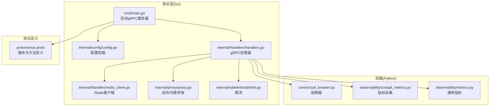
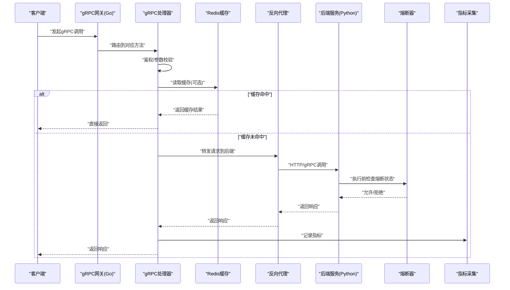
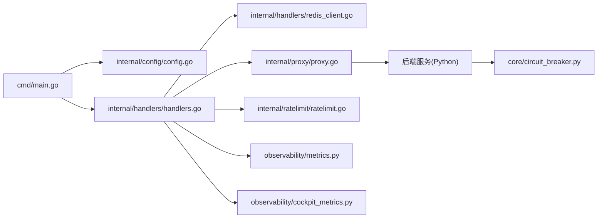

# gRPC内部服务接口

<cite>
**本文引用的文件**   
- [nexus.proto](file://backend_design/nexus_gate/proto/nexus.proto)
- [main.go](file://backend_design/nexus_gate/cmd/main.go)
- [handlers.go](file://backend_design/nexus_gate/internal/handlers/handlers.go)
- [redis_client.go](file://backend_design/nexus_gate/internal/handlers/redis_client.go)
- [proxy.go](file://backend_design/nexus_gate/internal/proxy/proxy.go)
- [config.go](file://backend_design/nexus_gate/internal/config/config.go)
- [ratelimit.go](file://backend_design/nexus_gate/internal/ratelimit/ratelimit.go)
- [circuit_breaker.py](file://backend_design/nexus/core/circuit_breaker.py)
- [cockpit_metrics.py](file://backend_design/nexus/observability/cockpit_metrics.py)
- [metrics.py](file://backend_design/nexus/observability/metrics.py)
</cite>

## 目录
1. [简介](#简介)
2. [项目结构](#项目结构)
3. [核心组件](#核心组件)
4. [架构总览](#架构总览)
5. [详细组件分析](#详细组件分析)
6. [依赖关系分析](#依赖关系分析)
7. [性能考虑](#性能考虑)
8. [故障排查指南](#故障排查指南)
9. [结论](#结论)
10. [附录](#附录)

## 简介
本文件面向gRPC内部服务契约与实现，聚焦于Nexus Gate（Go）作为gRPC网关/代理层与后端Python服务之间的交互。文档基于仓库中的protobuf定义、Go服务端实现以及Python侧的熔断与可观测性代码进行整理，覆盖以下方面：
- 服务契约：方法签名、请求/响应消息、枚举类型
- 调用模式：同步、流式、双向通信
- 客户端与服务端示例：Go、Python
- 错误处理：gRPC状态码映射与业务错误转换
- 服务发现、负载均衡与熔断降级策略
- 性能调优：连接池、压缩、超时控制
- 调试与监控指标

## 项目结构
本项目在gateway侧使用Go实现gRPC服务，并在proto中定义服务契约；后端Python服务提供业务逻辑与可观测性能力。关键路径如下：
- proto定义：backend_design/nexus_gate/proto/nexus.proto
- Go入口与配置：backend_design/nexus_gate/cmd/main.go, backend_design/nexus_gate/internal/config/config.go
- gRPC处理器与Redis集成：backend_design/nexus_gate/internal/handlers/handlers.go, redis_client.go
- 反向代理与转发：backend_design/nexus_gate/internal/proxy/proxy.go
- Python熔断与指标：backend_design/nexus/core/circuit_breaker.py, observability/*

图表来源
- [main.go](file://backend_design/nexus_gate/cmd/main.go)
- [config.go](file://backend_design/nexus_gate/internal/config/config.go)
- [handlers.go](file://backend_design/nexus_gate/internal/handlers/handlers.go)
- [redis_client.go](file://backend_design/nexus_gate/internal/handlers/redis_client.go)
- [proxy.go](file://backend_design/nexus_gate/internal/proxy/proxy.go)
- [nexus.proto](file://backend_design/nexus_gate/proto/nexus.proto)
- [circuit_breaker.py](file://backend_design/nexus/core/circuit_breaker.py)
- [cockpit_metrics.py](file://backend_design/nexus/observability/cockpit_metrics.py)
- [metrics.py](file://backend_design/nexus/observability/metrics.py)

章节来源
- [nexus.proto](file://backend_design/nexus_gate/proto/nexus.proto)
- [main.go](file://backend_design/nexus_gate/cmd/main.go)
- [config.go](file://backend_design/nexus_gate/internal/config/config.go)
- [handlers.go](file://backend_design/nexus_gate/internal/handlers/handlers.go)
- [redis_client.go](file://backend_design/nexus_gate/internal/handlers/redis_client.go)
- [proxy.go](file://backend_design/nexus_gate/internal/proxy/proxy.go)
- [ratelimit.go](file://backend_design/nexus_gate/internal/ratelimit/ratelimit.go)
- [circuit_breaker.py](file://backend_design/nexus/core/circuit_breaker.py)
- [cockpit_metrics.py](file://backend_design/nexus/observability/cockpit_metrics.py)
- [metrics.py](file://backend_design/nexus/observability/metrics.py)

## 核心组件
- 协议定义(nexus.proto)：集中定义服务、方法与消息类型，是跨语言客户端/服务端契约的唯一来源。
- Go gRPC服务器(cmd/main.go)：负责监听端口、加载配置、注册处理器、启动服务。
- 处理器(handlers.go)：实现具体gRPC方法，协调Redis缓存、下游转发与限流。
- Redis客户端(redis_client.go)：封装缓存读写，用于热点数据或会话上下文。
- 反向代理(proxy.go)：将请求转发至后端服务或上游系统，支持透传元数据。
- 限流(ratelimit.go)：对gRPC方法进行速率限制，保护后端资源。
- Python熔断(circuit_breaker.py)：在后端侧实现熔断，避免级联故障。
- 可观测性(observability/*)：暴露指标与日志，便于监控与排障。

章节来源
- [nexus.proto](file://backend_design/nexus_gate/proto/nexus.proto)
- [main.go](file://backend_design/nexus_gate/cmd/main.go)
- [handlers.go](file://backend_design/nexus_gate/internal/handlers/handlers.go)
- [redis_client.go](file://backend_design/nexus_gate/internal/handlers/redis_client.go)
- [proxy.go](file://backend_design/nexus_gate/internal/proxy/proxy.go)
- [ratelimit.go](file://backend_design/nexus_gate/internal/ratelimit/ratelimit.go)
- [circuit_breaker.py](file://backend_design/nexus/core/circuit_breaker.py)
- [cockpit_metrics.py](file://backend_design/nexus/observability/cockpit_metrics.py)
- [metrics.py](file://backend_design/nexus/observability/metrics.py)

## 架构总览
下图展示了从客户端到gRPC网关再到后端服务的整体流程，包括认证、限流、缓存、转发与熔断等关键环节。

图表来源
- [main.go](file://backend_design/nexus_gate/cmd/main.go)
- [handlers.go](file://backend_design/nexus_gate/internal/handlers/handlers.go)
- [redis_client.go](file://backend_design/nexus_gate/internal/handlers/redis_client.go)
- [proxy.go](file://backend_design/nexus_gate/internal/proxy/proxy.go)
- [circuit_breaker.py](file://backend_design/nexus/core/circuit_breaker.py)
- [cockpit_metrics.py](file://backend_design/nexus/observability/cockpit_metrics.py)
- [metrics.py](file://backend_design/nexus/observability/metrics.py)

## 详细组件分析

### 协议定义(nexus.proto)
- 服务契约：包含服务名、方法列表、请求/响应消息与枚举类型。
- 数据类型：
  - 基本类型：string、int32/int64、float/double、bool、bytes等
  - 复合类型：message嵌套、repeated字段
  - 枚举：enum用于状态码、意图分类等
- 方法签名：每个方法明确输入输出消息，支持单向、服务端流、客户端流与双向流。
- 版本化建议：通过package命名空间与字段编号管理演进，避免破坏兼容。

章节来源
- [nexus.proto](file://backend_design/nexus_gate/proto/nexus.proto)

### Go gRPC服务器(main.go)
- 功能职责：
  - 加载配置(config.go)
  - 初始化gRPC服务器选项（端口、TLS、拦截器、压缩等）
  - 注册处理器(handlers.go)
  - 启动并优雅关闭
- 关键要点：
  - 使用统一错误包装，确保状态码正确映射
  - 启用压缩与keepalive以优化带宽与长连接稳定性
  - 集成限流与熔断中间件

章节来源
- [main.go](file://backend_design/nexus_gate/cmd/main.go)
- [config.go](file://backend_design/nexus_gate/internal/config/config.go)

### gRPC处理器(handlers.go)
- 功能职责：
  - 实现proto定义的方法
  - 鉴权与参数校验
  - 缓存读取/写入(redis_client.go)
  - 调用下游服务(proxy.go)
  - 记录指标与日志
- 错误处理：
  - 将业务异常转换为gRPC状态码
  - 区分可重试与不可重试错误
- 流式支持：
  - 服务端流：按事件推送
  - 客户端流：批量接收
  - 双向流：实时交互

章节来源
- [handlers.go](file://backend_design/nexus_gate/internal/handlers/handlers.go)
- [redis_client.go](file://backend_design/nexus_gate/internal/handlers/redis_client.go)
- [proxy.go](file://backend_design/nexus_gate/internal/proxy/proxy.go)

### Redis缓存(redis_client.go)
- 功能职责：
  - 提供统一的缓存存取接口
  - 支持TTL、序列化与键空间管理
- 使用场景：
  - 热点查询缓存
  - 会话上下文存储
  - 防抖与去重

章节来源
- [redis_client.go](file://backend_design/nexus_gate/internal/handlers/redis_client.go)

### 反向代理(proxy.go)
- 功能职责：
  - 将gRPC请求转发到后端服务
  - 透传请求头与追踪ID
  - 处理超时与重试策略
- 集成点：
  - 与限流模块协作
  - 与熔断器配合，快速失败

章节来源
- [proxy.go](file://backend_design/nexus_gate/internal/proxy/proxy.go)

### 限流(ratelimit.go)
- 功能职责：
  - 基于令牌桶或滑动窗口算法限制QPS
  - 按方法或服务维度隔离
- 行为：
  - 超限返回特定状态码
  - 触发告警与指标上报

章节来源
- [ratelimit.go](file://backend_design/nexus_gate/internal/ratelimit/ratelimit.go)

### Python熔断(circuit_breaker.py)
- 功能职责：
  - 监控后端调用成功率与延迟
  - 达到阈值后进入半开/关闭状态
  - 防止雪崩效应
- 指标：
  - 失败率、延迟分位、熔断状态切换次数

章节来源
- [circuit_breaker.py](file://backend_design/nexus/core/circuit_breaker.py)

### 可观测性(observability/*)
- cockpit_metrics.py：针对Cockpit业务的指标采集与导出
- metrics.py：通用指标框架，支持Prometheus格式
- 建议：
  - 为每个gRPC方法暴露成功/失败计数、延迟直方图
  - 增加链路追踪ID透传

章节来源
- [cockpit_metrics.py](file://backend_design/nexus/observability/cockpit_metrics.py)
- [metrics.py](file://backend_design/nexus/observability/metrics.py)

## 依赖关系分析
- 耦合关系：
  - handlers依赖redis_client与proxy
  - main依赖config与handlers
  - proxy可能依赖外部服务发现与负载均衡库
- 外部依赖：
  - Redis用于缓存与会话
  - Prometheus/Grafana用于指标与可视化
  - 可能的服务注册中心（如Consul/Etcd）用于服务发现

图表来源
- [main.go](file://backend_design/nexus_gate/cmd/main.go)
- [config.go](file://backend_design/nexus_gate/internal/config/config.go)
- [handlers.go](file://backend_design/nexus_gate/internal/handlers/handlers.go)
- [redis_client.go](file://backend_design/nexus_gate/internal/handlers/redis_client.go)
- [proxy.go](file://backend_design/nexus_gate/internal/proxy/proxy.go)
- [ratelimit.go](file://backend_design/nexus_gate/internal/ratelimit/ratelimit.go)
- [circuit_breaker.py](file://backend_design/nexus/core/circuit_breaker.py)
- [cockpit_metrics.py](file://backend_design/nexus/observability/cockpit_metrics.py)
- [metrics.py](file://backend_design/nexus/observability/metrics.py)

章节来源
- [main.go](file://backend_design/nexus_gate/cmd/main.go)
- [config.go](file://backend_design/nexus_gate/internal/config/config.go)
- [handlers.go](file://backend_design/nexus_gate/internal/handlers/handlers.go)
- [redis_client.go](file://backend_design/nexus_gate/internal/handlers/redis_client.go)
- [proxy.go](file://backend_design/nexus_gate/internal/proxy/proxy.go)
- [ratelimit.go](file://backend_design/nexus_gate/internal/ratelimit/ratelimit.go)
- [circuit_breaker.py](file://backend_design/nexus/core/circuit_breaker.py)
- [cockpit_metrics.py](file://backend_design/nexus/observability/cockpit_metrics.py)
- [metrics.py](file://backend_design/nexus/observability/metrics.py)

## 性能考虑
- 连接池配置：
  - 合理设置最大连接数与空闲连接回收
  - 根据QPS与CPU核数调整并发度
- 压缩设置：
  - 启用gzip/zstd压缩，权衡CPU与带宽
  - 对小消息禁用压缩以减少开销
- 超时控制：
  - 客户端与服务端分别设置超时与重试上限
  - 使用deadline传递上下文
- 流式传输：
  - 大数据量采用流式降低内存峰值
  - 背压控制避免堆积
- 缓存策略：
  - 热点数据短TTL，冷数据长TTL
  - 缓存穿透/击穿防护
- 限流与熔断：
  - 动态调整阈值，结合指标自适应
  - 半开探测逐步恢复流量

[本节为通用指导，不直接分析具体文件]

## 故障排查指南
- 常见问题：
  - 连接被拒：检查端口、防火墙、TLS证书
  - 超时：确认上下游超时配置与网络延迟
  - 熔断触发：查看失败率与延迟指标，定位瓶颈
  - 缓存失效：检查Redis连通性与键空间
- 调试工具：
  - grpcurl/grpc_cli：测试gRPC接口
  - Prometheus/Grafana：查看指标与告警
  - 日志聚合：ELK/Loki检索错误堆栈
- 指标建议：
  - 方法级成功/失败计数、P95/P99延迟
  - 熔断状态、限流丢弃数、缓存命中率

章节来源
- [ratelimit.go](file://backend_design/nexus_gate/internal/ratelimit/ratelimit.go)
- [circuit_breaker.py](file://backend_design/nexus/core/circuit_breaker.py)
- [cockpit_metrics.py](file://backend_design/nexus/observability/cockpit_metrics.py)
- [metrics.py](file://backend_design/nexus/observability/metrics.py)

## 结论
通过统一的proto契约与Go网关层，项目实现了高内聚、低耦合的内部服务调用体系。结合限流、熔断与可观测性，系统在稳定性与可维护性上具备良好基础。后续可进一步完善服务发现与负载均衡机制，并持续优化性能与监控指标。

[本节为总结，不直接分析具体文件]

## 附录

### 服务间调用模式
- 同步调用：适用于简单请求-响应场景
- 服务端流：适用于事件推送、增量更新
- 客户端流：适用于批量上传、分片传输
- 双向流：适用于实时对话、协同编辑

[本节为概念说明，不直接分析具体文件]

### 客户端与服务端示例（Go/Python）
- Go客户端：
  - 使用生成的stub进行调用
  - 设置超时、压缩与重试
- Go服务端：
  - 注册处理器，实现方法逻辑
  - 集成限流与熔断
- Python客户端：
  - 使用grpcio调用gRPC服务
  - 处理状态码与重试
- Python服务端：
  - 实现业务逻辑与熔断器
  - 暴露指标与日志

[本节为概念说明，不直接分析具体文件]

### 错误处理与状态码映射
- 常见gRPC状态码：
  - OK、INVALID_ARGUMENT、NOT_FOUND、UNAVAILABLE、DEADLINE_EXCEEDED、INTERNAL
- 业务错误转换：
  - 将领域异常映射为标准状态码
  - 附带错误详情与追踪ID

[本节为概念说明，不直接分析具体文件]

### 服务发现与负载均衡
- 服务发现：
  - 使用Consul/Etcd注册与注销实例
  - 健康检查与自动剔除
- 负载均衡：
  - 轮询、加权、一致性哈希
  - 本地优先与就近选择

[本节为概念说明，不直接分析具体文件]