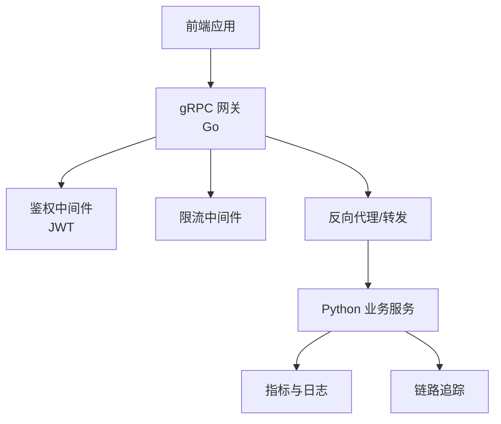
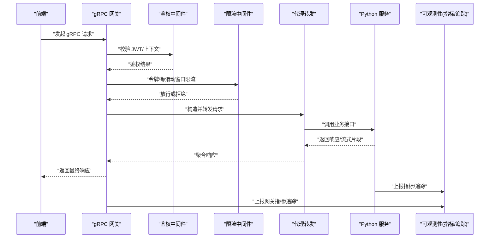
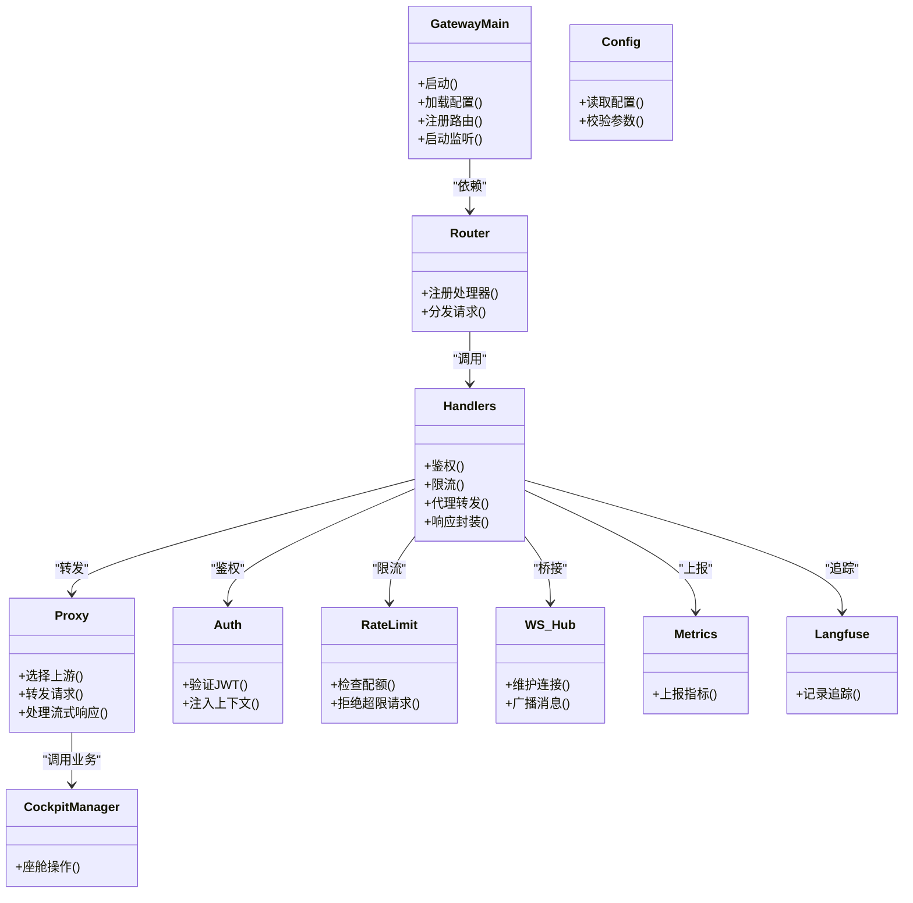
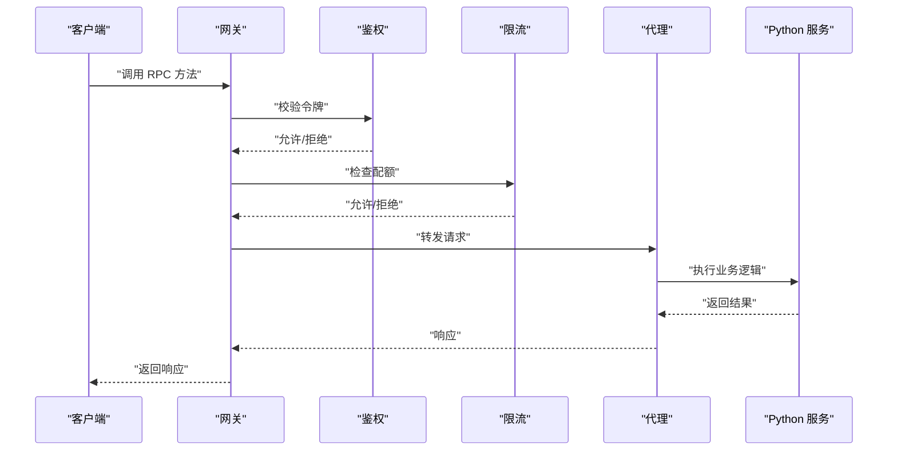
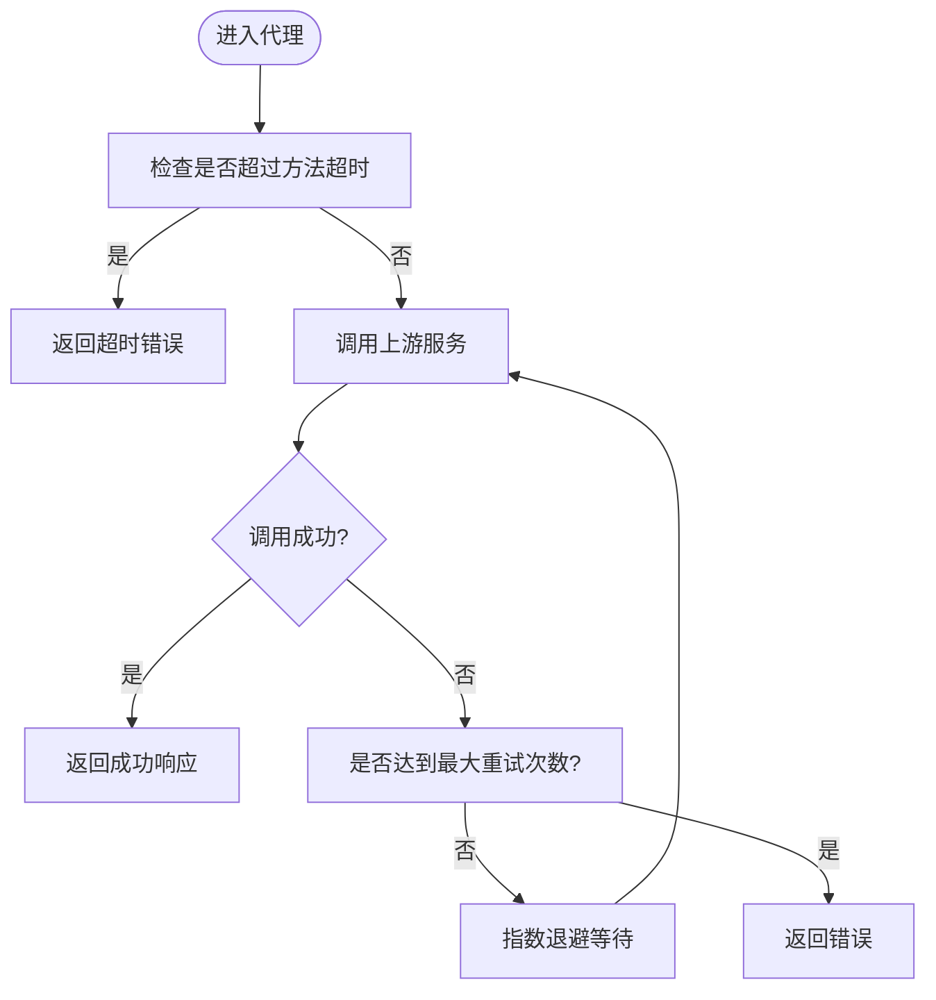
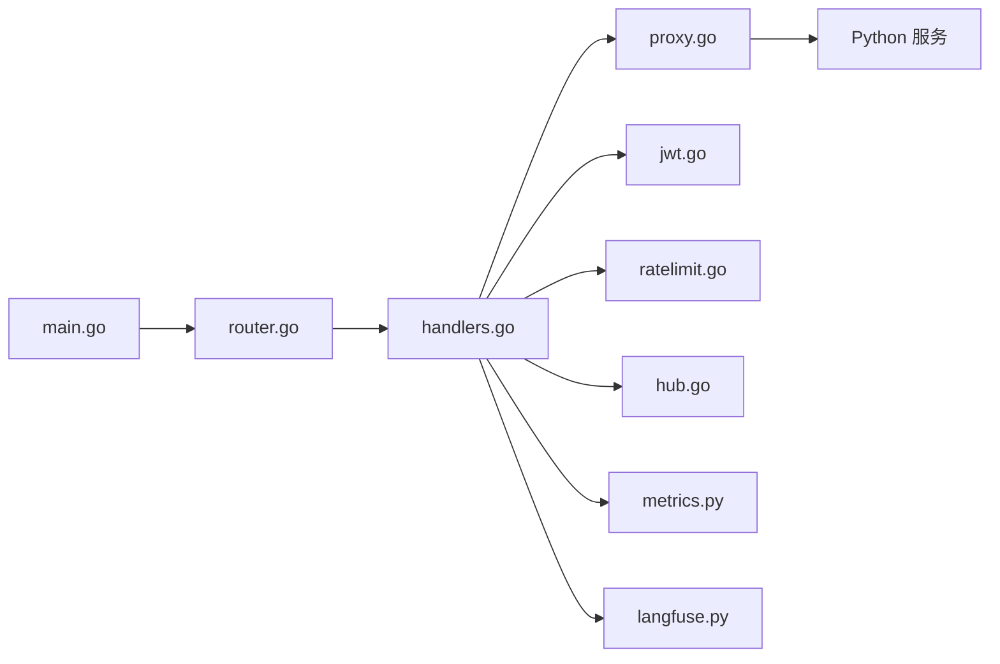

# gRPC微服务接口

<cite>
**本文引用的文件**   
- [nexus.proto](file://backend_design/nexus_gate/proto/nexus.proto)
- [main.go](file://backend_design/nexus_gate/cmd/main.go)
- [router.go](file://backend_design/nexus_gate/internal/router/router.go)
- [handlers.go](file://backend_design/nexus_gate/internal/handlers/handlers.go)
- [proxy.go](file://backend_design/nexus_gate/internal/proxy/proxy.go)
- [config.go](file://backend_design/nexus_gate/internal/config/config.go)
- [jwt.go](file://backend_design/nexus_gate/internal/auth/jwt.go)
- [ratelimit.go](file://backend_design/nexus_gate/internal/ratelimit/ratelimit.go)
- [redis_client.go](file://backend_design/nexus_gate/internal/handlers/redis_client.go)
- [hub.go](file://backend_design/nexus_gate/internal/ws/hub.go)
- [cockpit_manager.py](file://backend_design/nexus/core/cockpit_manager.py)
- [auth.py](file://backend_design/nexus/core/auth.py)
- [circuit_breaker.py](file://backend_design/nexus/core/circuit_breaker.py)
- [metrics.py](file://backend_design/nexus/observability/metrics.py)
- [langfuse.py](file://backend_design/nexus/observability/langfuse.py)
- [docker-compose.yml](file://docker-compose.yml)
</cite>

## 目录
1. [简介](#简介)
2. [项目结构](#项目结构)
3. [核心组件](#核心组件)
4. [架构总览](#架构总览)
5. [详细组件分析](#详细组件分析)
6. [依赖关系分析](#依赖关系分析)
7. [性能与可观测性](#性能与可观测性)
8. [故障排查指南](#故障排查指南)
9. [结论](#结论)
10. [附录](#附录)

## 简介
本文件面向前后端与平台工程团队，系统化梳理基于 nexus.proto 的 gRPC 微服务接口定义、消息类型与方法签名，说明前后端通过 gRPC 网关（Go）与后端 Python 服务之间的通信协议与数据交换格式。文档同时覆盖服务发现、负载均衡与故障转移策略，给出客户端与服务端实现要点，阐述流式通信、双向流与超时处理机制，并提供性能监控、链路追踪与错误诊断方法，以及协议版本管理与向后兼容性策略。

## 项目结构
本项目采用“前端 + Go 网关 + Python 业务服务”的分层架构：
- 前端通过 HTTP/WebSocket 与网关交互；
- Go 网关负责鉴权、限流、代理转发、WebSocket 桥接与部分 gRPC 能力；
- Python 业务服务提供核心能力（如座舱管理、认证、可观测性等）。

图表来源
- [main.go:1-200](file://backend_design/nexus_gate/cmd/main.go#L1-L200)
- [router.go:1-200](file://backend_design/nexus_gate/internal/router/router.go#L1-L200)
- [handlers.go:1-200](file://backend_design/nexus_gate/internal/handlers/handlers.go#L1-L200)
- [proxy.go:1-200](file://backend_design/nexus_gate/internal/proxy/proxy.go#L1-L200)
- [config.go:1-200](file://backend_design/nexus_gate/internal/config/config.go#L1-L200)
- [metrics.py:1-200](file://backend_design/nexus/observability/metrics.py#L1-L200)
- [langfuse.py:1-200](file://backend_design/nexus/observability/langfuse.py#L1-L200)

章节来源
- [main.go:1-200](file://backend_design/nexus_gate/cmd/main.go#L1-L200)
- [router.go:1-200](file://backend_design/nexus_gate/internal/router/router.go#L1-L200)
- [handlers.go:1-200](file://backend_design/nexus_gate/internal/handlers/handlers.go#L1-L200)
- [proxy.go:1-200](file://backend_design/nexus_gate/internal/proxy/proxy.go#L1-L200)
- [config.go:1-200](file://backend_design/nexus_gate/internal/config/config.go#L1-L200)

## 核心组件
- 协议定义：nexus.proto 定义了服务、方法与消息类型，是前后端与网关之间契约的唯一来源。
- 网关入口：cmd/main.go 启动网关，加载配置、注册路由、初始化中间件与代理。
- 路由与处理器：internal/router 与 internal/handlers 负责请求分发、鉴权、限流与响应封装。
- 代理转发：internal/proxy 将请求转发至 Python 服务或上游系统。
- 配置中心：internal/config 集中管理端口、目标服务地址、TLS、超时等参数。
- 鉴权与限流：internal/auth 与 internal/ratelimit 提供安全与流量控制。
- WebSocket 桥接：internal/ws 支持实时消息通道。
- 业务服务：Python 侧 cockpit_manager、auth、circuit_breaker、metrics、langfuse 等模块提供核心能力与可观测性。

章节来源
- [nexus.proto:1-200](file://backend_design/nexus_gate/proto/nexus.proto#L1-L200)
- [main.go:1-200](file://backend_design/nexus_gate/cmd/main.go#L1-L200)
- [router.go:1-200](file://backend_design/nexus_gate/internal/router/router.go#L1-L200)
- [handlers.go:1-200](file://backend_design/nexus_gate/internal/handlers/handlers.go#L1-L200)
- [proxy.go:1-200](file://backend_design/nexus_gate/internal/proxy/proxy.go#L1-L200)
- [config.go:1-200](file://backend_design/nexus_gate/internal/config/config.go#L1-L200)
- [jwt.go:1-200](file://backend_design/nexus_gate/internal/auth/jwt.go#L1-L200)
- [ratelimit.go:1-200](file://backend_design/nexus_gate/internal/ratelimit/ratelimit.go#L1-L200)
- [hub.go:1-200](file://backend_design/nexus_gate/internal/ws/hub.go#L1-L200)
- [cockpit_manager.py:1-200](file://backend_design/nexus/core/cockpit_manager.py#L1-L200)
- [auth.py:1-200](file://backend_design/nexus/core/auth.py#L1-L200)
- [circuit_breaker.py:1-200](file://backend_design/nexus/core/circuit_breaker.py#L1-L200)
- [metrics.py:1-200](file://backend_design/nexus/observability/metrics.py#L1-L200)
- [langfuse.py:1-200](file://backend_design/nexus/observability/langfuse.py#L1-L200)

## 架构总览
下图展示了从前端到网关再到 Python 服务的整体调用路径，包括鉴权、限流、代理与可观测性接入点。

图表来源
- [main.go:1-200](file://backend_design/nexus_gate/cmd/main.go#L1-L200)
- [router.go:1-200](file://backend_design/nexus_gate/internal/router/router.go#L1-L200)
- [handlers.go:1-200](file://backend_design/nexus_gate/internal/handlers/handlers.go#L1-L200)
- [proxy.go:1-200](file://backend_design/nexus_gate/internal/proxy/proxy.go#L1-L200)
- [config.go:1-200](file://backend_design/nexus_gate/internal/config/config.go#L1-L200)
- [metrics.py:1-200](file://backend_design/nexus/observability/metrics.py#L1-L200)
- [langfuse.py:1-200](file://backend_design/nexus/observability/langfuse.py#L1-L200)

## 详细组件分析

### 协议定义与服务契约（nexus.proto）
- 服务定义：在 nexus.proto 中声明所有对外暴露的 RPC 服务名称、方法与消息类型。
- 消息类型：统一使用 proto 消息体承载请求与响应字段，确保前后端一致的数据模型。
- 方法签名：每个 RPC 方法明确输入输出消息类型，必要时标注流式方向（单向/双向）。
- 版本管理：建议通过包名或消息前缀进行版本化（例如 v1/v2），并在网关路由层做兼容映射。

章节来源
- [nexus.proto:1-200](file://backend_design/nexus_gate/proto/nexus.proto#L1-L200)

### 网关入口与生命周期（cmd/main.go）
- 启动流程：解析配置、初始化日志与可观测性、创建监听器、注册路由与中间件、启动服务。
- 关键配置：端口、目标服务地址、TLS、超时、重试、熔断、限流阈值等。
- 优雅关闭：捕获信号量，完成正在处理的请求后退出。

章节来源
- [main.go:1-200](file://backend_design/nexus_gate/cmd/main.go#L1-L200)
- [config.go:1-200](file://backend_design/nexus_gate/internal/config/config.go#L1-L200)

### 路由与处理器（internal/router, internal/handlers）
- 路由注册：按服务与方法维度注册处理器，支持静态与动态路由。
- 处理器职责：参数校验、上下文注入、鉴权、限流、代理转发、响应封装与错误码标准化。
- 中间件链：鉴权 -> 限流 -> 审计 -> 代理 -> 响应。

章节来源
- [router.go:1-200](file://backend_design/nexus_gate/internal/router/router.go#L1-L200)
- [handlers.go:1-200](file://backend_design/nexus_gate/internal/handlers/handlers.go#L1-L200)

### 代理转发与上游集成（internal/proxy）
- 转发策略：根据路由表选择上游服务实例，支持健康检查与失败剔除。
- 超时与重试：为每个方法设置合理超时与重试次数，避免雪崩。
- 流式支持：对服务端流/双向流进行透传，保持时序与背压语义。

章节来源
- [proxy.go:1-200](file://backend_design/nexus_gate/internal/proxy/proxy.go#L1-L200)

### 鉴权与限流（internal/auth, internal/ratelimit）
- 鉴权：基于 JWT 的无状态鉴权，支持租户上下文注入。
- 限流：令牌桶/滑动窗口算法，支持按用户/租户/接口维度限制。

章节来源
- [jwt.go:1-200](file://backend_design/nexus_gate/internal/auth/jwt.go#L1-L200)
- [ratelimit.go:1-200](file://backend_design/nexus_gate/internal/ratelimit/ratelimit.go#L1-L200)

### WebSocket 桥接（internal/ws）
- 功能：将前端 WebSocket 消息桥接到后端服务，用于实时推送与双向通信。
- 会话管理：维护连接、订阅/发布主题、心跳检测与断线重连。

章节来源
- [hub.go:1-200](file://backend_design/nexus_gate/internal/ws/hub.go#L1-L200)

### 业务服务（Python 侧）
- 座舱管理：cockpit_manager 提供座舱相关能力，作为 gRPC 调用的主要业务入口之一。
- 认证：auth 提供认证与授权逻辑，与网关鉴权协同工作。
- 熔断：circuit_breaker 保护下游不稳定依赖，快速失败与恢复。
- 可观测性：metrics 与 langfuse 提供指标采集与链路追踪。

章节来源
- [cockpit_manager.py:1-200](file://backend_design/nexus/core/cockpit_manager.py#L1-L200)
- [auth.py:1-200](file://backend_design/nexus/core/auth.py#L1-L200)
- [circuit_breaker.py:1-200](file://backend_design/nexus/core/circuit_breaker.py#L1-L200)
- [metrics.py:1-200](file://backend_design/nexus/observability/metrics.py#L1-L200)
- [langfuse.py:1-200](file://backend_design/nexus/observability/langfuse.py#L1-L200)

### 类图（代码级关系）

图表来源
- [main.go:1-200](file://backend_design/nexus_gate/cmd/main.go#L1-L200)
- [router.go:1-200](file://backend_design/nexus_gate/internal/router/router.go#L1-L200)
- [handlers.go:1-200](file://backend_design/nexus_gate/internal/handlers/handlers.go#L1-L200)
- [proxy.go:1-200](file://backend_design/nexus_gate/internal/proxy/proxy.go#L1-L200)
- [config.go:1-200](file://backend_design/nexus_gate/internal/config/config.go#L1-L200)
- [jwt.go:1-200](file://backend_design/nexus_gate/internal/auth/jwt.go#L1-L200)
- [ratelimit.go:1-200](file://backend_design/nexus_gate/internal/ratelimit/ratelimit.go#L1-L200)
- [hub.go:1-200](file://backend_design/nexus_gate/internal/ws/hub.go#L1-L200)
- [cockpit_manager.py:1-200](file://backend_design/nexus/core/cockpit_manager.py#L1-L200)
- [metrics.py:1-200](file://backend_design/nexus/observability/metrics.py#L1-L200)
- [langfuse.py:1-200](file://backend_design/nexus/observability/langfuse.py#L1-L200)

### API 调用序列（示例）
以下序列展示一次典型 gRPC 请求在网关中的流转过程，包含鉴权、限流、代理与可观测性上报。

图表来源
- [main.go:1-200](file://backend_design/nexus_gate/cmd/main.go#L1-L200)
- [router.go:1-200](file://backend_design/nexus_gate/internal/router/router.go#L1-L200)
- [handlers.go:1-200](file://backend_design/nexus_gate/internal/handlers/handlers.go#L1-L200)
- [proxy.go:1-200](file://backend_design/nexus_gate/internal/proxy/proxy.go#L1-L200)

### 复杂逻辑流程图（超时与重试）

图表来源
- [proxy.go:1-200](file://backend_design/nexus_gate/internal/proxy/proxy.go#L1-L200)
- [config.go:1-200](file://backend_design/nexus_gate/internal/config/config.go#L1-L200)

## 依赖关系分析
- 组件耦合：网关各中间件以组合方式装配，低耦合高内聚；代理与业务服务通过明确的接口契约解耦。
- 外部依赖：配置中心、Redis（可选）、指标与追踪后端。
- 潜在循环：应避免处理器直接依赖自身，通过路由与中间件分层规避。

图表来源
- [main.go:1-200](file://backend_design/nexus_gate/cmd/main.go#L1-L200)
- [router.go:1-200](file://backend_design/nexus_gate/internal/router/router.go#L1-L200)
- [handlers.go:1-200](file://backend_design/nexus_gate/internal/handlers/handlers.go#L1-L200)
- [proxy.go:1-200](file://backend_design/nexus_gate/internal/proxy/proxy.go#L1-L200)
- [jwt.go:1-200](file://backend_design/nexus_gate/internal/auth/jwt.go#L1-L200)
- [ratelimit.go:1-200](file://backend_design/nexus_gate/internal/ratelimit/ratelimit.go#L1-L200)
- [hub.go:1-200](file://backend_design/nexus_gate/internal/ws/hub.go#L1-L200)
- [metrics.py:1-200](file://backend_design/nexus/observability/metrics.py#L1-L200)
- [langfuse.py:1-200](file://backend_design/nexus/observability/langfuse.py#L1-L200)

章节来源
- [main.go:1-200](file://backend_design/nexus_gate/cmd/main.go#L1-L200)
- [router.go:1-200](file://backend_design/nexus_gate/internal/router/router.go#L1-L200)
- [handlers.go:1-200](file://backend_design/nexus_gate/internal/handlers/handlers.go#L1-L200)
- [proxy.go:1-200](file://backend_design/nexus_gate/internal/proxy/proxy.go#L1-L200)
- [jwt.go:1-200](file://backend_design/nexus_gate/internal/auth/jwt.go#L1-L200)
- [ratelimit.go:1-200](file://backend_design/nexus_gate/internal/ratelimit/ratelimit.go#L1-L200)
- [hub.go:1-200](file://backend_design/nexus_gate/internal/ws/hub.go#L1-L200)
- [metrics.py:1-200](file://backend_design/nexus/observability/metrics.py#L1-L200)
- [langfuse.py:1-200](file://backend_design/nexus/observability/langfuse.py#L1-L200)

## 性能与可观测性
- 指标采集：在网关与 Python 服务侧分别上报 QPS、延迟、错误率、资源使用等指标。
- 链路追踪：为每次请求生成 traceId，贯穿网关与业务服务，便于定位瓶颈。
- 熔断与降级：对不稳定依赖启用熔断，快速失败与自动恢复，保障整体可用性。
- 限流与背压：按接口与租户维度限流，防止过载；对长耗时接口启用背压控制。
- 监控面板：结合 Prometheus/Grafana 可视化关键指标，设置告警规则。

章节来源
- [metrics.py:1-200](file://backend_design/nexus/observability/metrics.py#L1-L200)
- [langfuse.py:1-200](file://backend_design/nexus/observability/langfuse.py#L1-L200)
- [circuit_breaker.py:1-200](file://backend_design/nexus/core/circuit_breaker.py#L1-L200)
- [ratelimit.go:1-200](file://backend_design/nexus_gate/internal/ratelimit/ratelimit.go#L1-L200)

## 故障排查指南
- 常见问题
  - 鉴权失败：检查 JWT 签名、过期时间、租户上下文是否正确。
  - 限流触发：查看限流统计与阈值，确认是否需要扩容或调整配额。
  - 代理超时：检查上游服务延迟与超时配置，优化慢查询与资源占用。
  - 熔断开启：观察熔断器状态与恢复情况，定位不稳定依赖。
- 诊断步骤
  - 通过 traceId 在日志系统中检索完整链路。
  - 核对网关与业务服务的指标差异，定位异常阶段。
  - 复现问题并抓取请求快照与上下文信息。
- 工具与技巧
  - 使用 Prometheus/Grafana 查看趋势与热点。
  - 利用分布式追踪平台关联跨服务调用。
  - 对高频错误接口增加详细日志与采样。

章节来源
- [jwt.go:1-200](file://backend_design/nexus_gate/internal/auth/jwt.go#L1-L200)
- [ratelimit.go:1-200](file://backend_design/nexus_gate/internal/ratelimit/ratelimit.go#L1-L200)
- [proxy.go:1-200](file://backend_design/nexus_gate/internal/proxy/proxy.go#L1-L200)
- [circuit_breaker.py:1-200](file://backend_design/nexus/core/circuit_breaker.py#L1-L200)
- [metrics.py:1-200](file://backend_design/nexus/observability/metrics.py#L1-L200)
- [langfuse.py:1-200](file://backend_design/nexus/observability/langfuse.py#L1-L200)

## 结论
通过统一的 proto 契约与网关中间件体系，本项目实现了前后端与业务服务之间的高可用、可观测、可扩展的 gRPC 通信。建议在后续迭代中持续完善版本管理、兼容性测试与自动化回归，进一步提升稳定性与交付效率。

## 附录

### 服务发现、负载均衡与故障转移
- 服务发现：可通过环境变量或配置中心指定上游服务地址列表；在生产环境建议使用容器编排平台的服务发现能力。
- 负载均衡：网关层实现轮询/最少连接等策略，结合健康检查剔除不健康实例。
- 故障转移：对单个实例失败进行快速切换，配合熔断与重试提升容错能力。

章节来源
- [config.go:1-200](file://backend_design/nexus_gate/internal/config/config.go#L1-L200)
- [proxy.go:1-200](file://backend_design/nexus_gate/internal/proxy/proxy.go#L1-L200)
- [docker-compose.yml:1-200](file://docker-compose.yml#L1-L200)

### 流式通信、双向流与超时处理
- 流式通信：对服务端流与客户端流进行透传，保证时序与背压语义。
- 双向流：在网关层维护双向通道，注意心跳与断线重连。
- 超时处理：为每个方法设置合理的超时与重试上限，避免长时间阻塞。

章节来源
- [proxy.go:1-200](file://backend_design/nexus_gate/internal/proxy/proxy.go#L1-L200)
- [config.go:1-200](file://backend_design/nexus_gate/internal/config/config.go#L1-L200)
- [hub.go:1-200](file://backend_design/nexus_gate/internal/ws/hub.go#L1-L200)

### 客户端与服务端实现示例（要点）
- 客户端
  - 使用生成的语言 SDK 建立连接，设置超时与重试策略。
  - 对于流式接口，正确处理事件回调与错误分支。
- 服务端
  - 在 Python 服务中实现对应方法，遵循 proto 定义的语义。
  - 接入指标与追踪，记录关键路径耗时与错误。

章节来源
- [nexus.proto:1-200](file://backend_design/nexus_gate/proto/nexus.proto#L1-L200)
- [cockpit_manager.py:1-200](file://backend_design/nexus/core/cockpit_manager.py#L1-L200)
- [metrics.py:1-200](file://backend_design/nexus/observability/metrics.py#L1-L200)
- [langfuse.py:1-200](file://backend_design/nexus/observability/langfuse.py#L1-L200)

### 协议版本管理与向后兼容性策略
- 版本化：通过包名或消息前缀区分版本（v1/v2），避免破坏现有消费者。
- 兼容性：新增字段默认值需兼容旧版；删除字段需保留占位符并标记废弃。
- 迁移：提供双写与灰度策略，逐步淘汰旧版本接口。

章节来源
- [nexus.proto:1-200](file://backend_design/nexus_gate/proto/nexus.proto#L1-L200)