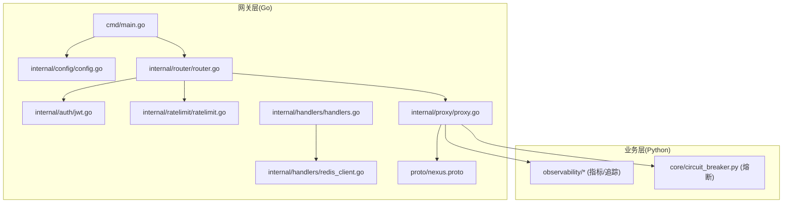
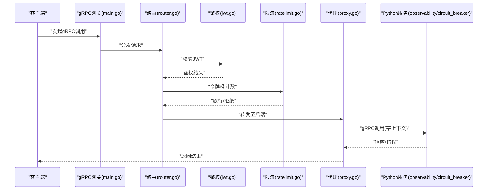
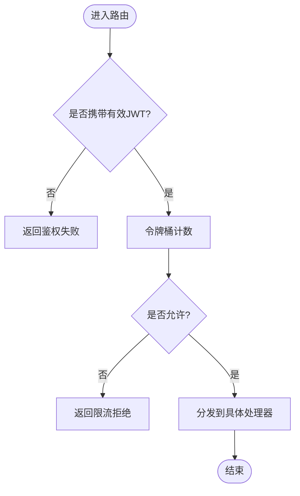
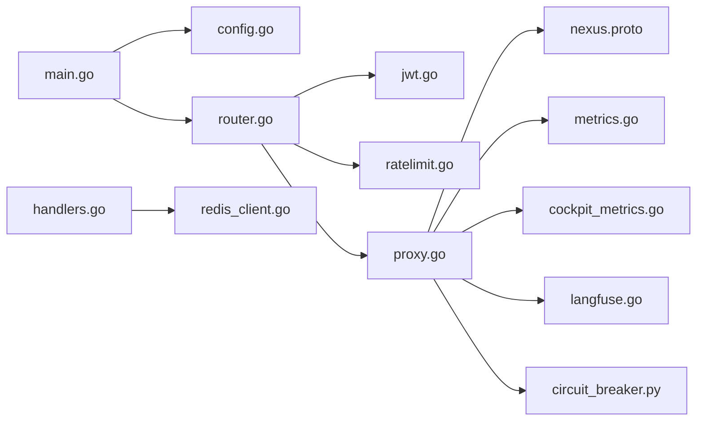

# gRPC网关接口

<cite>
**本文引用的文件**   
- [nexus.proto](file://backend_design/nexus_gate/proto/nexus.proto)
- [main.go](file://backend_design/nexus_gate/cmd/main.go)
- [config.go](file://backend_design/nexus_gate/internal/config/config.go)
- [handlers.go](file://backend_design/nexus_gate/internal/handlers/handlers.go)
- [proxy.go](file://backend_design/nexus_gate/internal/proxy/proxy.go)
- [router.go](file://backend_design/nexus_gate/internal/router/router.go)
- [jwt.go](file://backend_design/nexus_gate/internal/auth/jwt.go)
- [ratelimit.go](file://backend_design/nexus_gate/internal/ratelimit/ratelimit.go)
- [cockpit_metrics.go](file://backend_design/nexus/observability/cockpit_metrics.go)
- [metrics.go](file://backend_design/nexus/observability/metrics.go)
- [langfuse.go](file://backend_design/nexus/observability/langfuse.go)
- [circuit_breaker.py](file://backend_design/nexus/core/circuit_breaker.py)
- [redis_client.go](file://backend_design/nexus_gate/internal/handlers/redis_client.go)
</cite>

## 目录
1. [简介](#简介)
2. [项目结构](#项目结构)
3. [核心组件](#核心组件)
4. [架构总览](#架构总览)
5. [详细组件分析](#详细组件分析)
6. [依赖关系分析](#依赖关系分析)
7. [性能与优化](#性能与优化)
8. [故障诊断与排错](#故障诊断与排错)
9. [结论](#结论)
10. [附录：客户端实现示例](#附录客户端实现示例)

## 简介
本文件为 NexusCockpit 系统的 gRPC 网关接口文档，聚焦于后端网关（Go）与 Python 服务之间的协议、治理与可观测性。内容涵盖：
- gRPC 服务定义与消息类型（基于 proto 文件）
- 网关路由、鉴权、限流、代理转发流程
- 微服务治理特性：服务发现、负载均衡、熔断降级、重试与超时控制
- 二进制数据传输优化与流式处理建议
- 监控指标收集、链路追踪集成与故障诊断方法
- Go、Python 等多语言客户端使用指南（概念性说明）

## 项目结构
NexusCockpit 的 gRPC 网关位于 backend_design/nexus_gate 目录，采用分层组织：
- cmd：应用入口
- internal/config：配置加载
- internal/auth：JWT 鉴权中间件
- internal/ratelimit：令牌桶限流
- internal/handlers：HTTP/WebSocket 与 Redis 客户端封装
- internal/proxy：gRPC 代理转发逻辑
- internal/router：路由注册与分发
- proto：gRPC 协议定义

图表来源
- [main.go:1-200](file://backend_design/nexus_gate/cmd/main.go#L1-L200)
- [config.go:1-200](file://backend_design/nexus_gate/internal/config/config.go#L1-L200)
- [router.go:1-200](file://backend_design/nexus_gate/internal/router/router.go#L1-L200)
- [jwt.go:1-200](file://backend_design/nexus_gate/internal/auth/jwt.go#L1-L200)
- [ratelimit.go:1-200](file://backend_design/nexus_gate/internal/ratelimit/ratelimit.go#L1-L200)
- [handlers.go:1-200](file://backend_design/nexus_gate/internal/handlers/handlers.go#L1-L200)
- [redis_client.go:1-200](file://backend_design/nexus_gate/internal/handlers/redis_client.go#L1-L200)
- [proxy.go:1-200](file://backend_design/nexus_gate/internal/proxy/proxy.go#L1-L200)
- [nexus.proto:1-200](file://backend_design/nexus_gate/proto/nexus.proto#L1-L200)

章节来源
- [main.go:1-200](file://backend_design/nexus_gate/cmd/main.go#L1-L200)
- [config.go:1-200](file://backend_design/nexus_gate/internal/config/config.go#L1-L200)
- [router.go:1-200](file://backend_design/nexus_gate/internal/router/router.go#L1-L200)
- [nexus.proto:1-200](file://backend_design/nexus_gate/proto/nexus.proto#L1-L200)

## 核心组件
- 协议定义（proto）：集中描述服务、方法与消息类型，作为跨语言契约。
- 网关入口（main）：启动 HTTP/gRPC 监听、加载配置、注册路由与中间件。
- 路由与中间件（router/auth/ratelimit）：统一接入点，负责鉴权、限流、请求分发。
- 代理转发（proxy）：将 gRPC 调用转发至后端 Python 服务，支持上下文透传与错误映射。
- 可观测性（Python observability）：暴露指标与链路追踪数据，供 Prometheus/Grafana 采集。
- 熔断器（Python circuit_breaker）：对下游服务的失败率与延迟进行保护。

章节来源
- [nexus.proto:1-200](file://backend_design/nexus_gate/proto/nexus.proto#L1-L200)
- [main.go:1-200](file://backend_design/nexus_gate/cmd/main.go#L1-L200)
- [router.go:1-200](file://backend_design/nexus_gate/internal/router/router.go#L1-L200)
- [jwt.go:1-200](file://backend_design/nexus_gate/internal/auth/jwt.go#L1-L200)
- [ratelimit.go:1-200](file://backend_design/nexus_gate/internal/ratelimit/ratelimit.go#L1-L200)
- [proxy.go:1-200](file://backend_design/nexus_gate/internal/proxy/proxy.go#L1-L200)
- [cockpit_metrics.go:1-200](file://backend_design/nexus/observability/cockpit_metrics.go#L1-L200)
- [metrics.go:1-200](file://backend_design/nexus/observability/metrics.go#L1-L200)
- [langfuse.go:1-200](file://backend_design/nexus/observability/langfuse.go#L1-L200)
- [circuit_breaker.py:1-200](file://backend_design/nexus/observability/circuit_breaker.py#L1-L200)

## 架构总览
下图展示从客户端到网关再到 Python 服务的端到端调用路径，包含鉴权、限流、代理转发与可观测性埋点。

图表来源
- [main.go:1-200](file://backend_design/nexus_gate/cmd/main.go#L1-L200)
- [router.go:1-200](file://backend_design/nexus_gate/internal/router/router.go#L1-L200)
- [jwt.go:1-200](file://backend_design/nexus_gate/internal/auth/jwt.go#L1-L200)
- [ratelimit.go:1-200](file://backend_design/nexus_gate/internal/ratelimit/ratelimit.go#L1-L200)
- [proxy.go:1-200](file://backend_design/nexus_gate/internal/proxy/proxy.go#L1-L200)
- [cockpit_metrics.go:1-200](file://backend_design/nexus/observability/cockpit_metrics.go#L1-L200)
- [metrics.go:1-200](file://backend_design/nexus/observability/metrics.go#L1-L200)
- [langfuse.go:1-200](file://backend_design/nexus/observability/langfuse.go#L1-L200)
- [circuit_breaker.py:1-200](file://backend_design/nexus/observability/circuit_breaker.py#L1-L200)

## 详细组件分析

### 协议与服务定义（proto）
- 作用：定义服务名、方法签名、请求/响应消息类型，作为跨语言契约。
- 关注点：
  - 服务与方法命名规范（动词+名词风格）
  - 字段编号稳定与向后兼容策略
  - 流式方法（服务端/客户端双向）的使用场景
  - 元数据（Metadata）在鉴权与追踪中的传递约定

章节来源
- [nexus.proto:1-200](file://backend_design/nexus_gate/proto/nexus.proto#L1-L200)

### 网关入口与配置（main + config）
- main.go：初始化监听端口、加载配置、注册路由与中间件、优雅关闭。
- config.go：集中管理环境变量与配置文件键值，提供默认值与校验。

章节来源
- [main.go:1-200](file://backend_design/nexus_gate/cmd/main.go#L1-L200)
- [config.go:1-200](file://backend_design/nexus_gate/internal/config/config.go#L1-L200)

### 路由与中间件（router + auth + ratelimit）
- router.go：按服务/方法维度注册处理器，统一拦截与分发。
- jwt.go：解析并验证 JWT，提取用户上下文注入到请求元数据。
- ratelimit.go：基于令牌桶算法限制 QPS/并发，防止雪崩。

图表来源
- [router.go:1-200](file://backend_design/nexus_gate/internal/router/router.go#L1-L200)
- [jwt.go:1-200](file://backend_design/nexus_gate/internal/auth/jwt.go#L1-L200)
- [ratelimit.go:1-200](file://backend_design/nexus_gate/internal/ratelimit/ratelimit.go#L1-L200)

章节来源
- [router.go:1-200](file://backend_design/nexus_gate/internal/router/router.go#L1-L200)
- [jwt.go:1-200](file://backend_design/nexus_gate/internal/auth/jwt.go#L1-L200)
- [ratelimit.go:1-200](file://backend_design/nexus_gate/internal/ratelimit/ratelimit.go#L1-L200)

### 代理转发（proxy）
- 职责：将上游 gRPC 请求转发至 Python 服务，透传上下文（如 trace_id、tenant_id），并将下游错误映射为统一的 gRPC 状态码。
- 关键点：
  - 连接池与复用
  - 超时与取消传播
  - 重试策略（幂等方法）
  - 流式转发的背压与缓冲控制

章节来源
- [proxy.go:1-200](file://backend_design/nexus_gate/internal/proxy/proxy.go#L1-L200)

### 可观测性与追踪（Python observability）
- cockpit_metrics.go / metrics.go：暴露系统与应用级指标（QPS、延迟、错误率、资源使用）。
- langfuse.go：集成 Langfuse 进行 LLM 调用链路与提示词版本追踪。

章节来源
- [cockpit_metrics.go:1-200](file://backend_design/nexus/observability/cockpit_metrics.go#L1-L200)
- [metrics.go:1-200](file://backend_design/nexus/observability/metrics.go#L1-L200)
- [langfuse.go:1-200](file://backend_design/nexus/observability/langfuse.go#L1-L200)

### 熔断器（Python circuit_breaker）
- 功能：根据失败率与慢调用比例切换半开/打开状态，快速失败避免级联故障。
- 参数：阈值、窗口大小、冷却时间、采样统计。

章节来源
- [circuit_breaker.py:1-200](file://backend_design/nexus/observability/circuit_breaker.py#L1-L200)

### Redis 客户端（handlers/redis_client）
- 用途：会话缓存、分布式锁、热点数据读取。
- 注意：连接复用、超时与重试、序列化格式一致性。

章节来源
- [redis_client.go:1-200](file://backend_design/nexus_gate/internal/handlers/redis_client.go#L1-L200)

## 依赖关系分析
- 组件耦合：
  - main 依赖 config、router；router 依赖 auth、ratelimit、proxy。
  - proxy 依赖 proto 生成的客户端与 Python 服务地址。
  - handlers 依赖 redis_client 用于辅助能力。
- 外部依赖：
  - Prometheus/Grafana 指标采集
  - Langfuse 链路追踪
  - Redis 缓存/锁

图表来源
- [main.go:1-200](file://backend_design/nexus_gate/cmd/main.go#L1-L200)
- [config.go:1-200](file://backend_design/nexus_gate/internal/config/config.go#L1-L200)
- [router.go:1-200](file://backend_design/nexus_gate/internal/router/router.go#L1-L200)
- [jwt.go:1-200](file://backend_design/nexus_gate/internal/auth/jwt.go#L1-L200)
- [ratelimit.go:1-200](file://backend_design/nexus_gate/internal/ratelimit/ratelimit.go#L1-L200)
- [proxy.go:1-200](file://backend_design/nexus_gate/internal/proxy/proxy.go#L1-L200)
- [nexus.proto:1-200](file://backend_design/nexus_gate/proto/nexus.proto#L1-L200)
- [handlers.go:1-200](file://backend_design/nexus_gate/internal/handlers/handlers.go#L1-L200)
- [redis_client.go:1-200](file://backend_design/nexus_gate/internal/handlers/redis_client.go#L1-L200)
- [metrics.go:1-200](file://backend_design/nexus/observability/metrics.go#L1-L200)
- [cockpit_metrics.go:1-200](file://backend_design/nexus/observability/cockpit_metrics.go#L1-L200)
- [langfuse.go:1-200](file://backend_design/nexus/observability/langfuse.go#L1-L200)
- [circuit_breaker.py:1-200](file://backend_design/nexus/observability/circuit_breaker.py#L1-L200)

章节来源
- [main.go:1-200](file://backend_design/nexus_gate/cmd/main.go#L1-L200)
- [router.go:1-200](file://backend_design/nexus_gate/internal/router/router.go#L1-L200)
- [proxy.go:1-200](file://backend_design/nexus_gate/internal/proxy/proxy.go#L1-L200)
- [nexus.proto:1-200](file://backend_design/nexus_gate/proto/nexus.proto#L1-L200)

## 性能与优化
- 二进制传输优化
  - 优先使用 protobuf 原生二进制编码，避免 JSON 二次编解码。
  - 合理设置最大消息体大小，避免大对象阻塞。
  - 对图片/音频等大附件采用分块上传或对象存储直传，仅传递引用 ID。
- 流式处理
  - 使用服务端/客户端流式方法处理长时任务与实时数据推送。
  - 控制缓冲区大小，结合背压机制避免内存膨胀。
- 超时与重试
  - 为每个 RPC 设置合理的超时与取消传播。
  - 仅对幂等方法启用重试，并引入指数退避与抖动。
- 连接与并发
  - 复用 gRPC 连接，合理设置最大空闲连接数。
  - 通过连接池与并发度上限避免下游过载。
- 缓存与会话
  - 利用 Redis 缓存热点数据，减少重复计算与 I/O。
  - 会话信息去中心化，保证水平扩展能力。

[本节为通用指导，不直接分析具体文件]

## 故障诊断与排错
- 常见问题定位
  - 鉴权失败：检查 JWT 签名、过期时间与租户上下文是否正确透传。
  - 限流触发：观察令牌桶计数与拒绝日志，调整阈值或扩容。
  - 下游超时：查看代理层超时配置与后端服务耗时分布。
  - 熔断打开：确认失败率与慢调用比例，评估是否需要扩容或优化。
- 指标与追踪
  - 通过 Prometheus/Grafana 查看 QPS、P99 延迟、错误率、连接池利用率。
  - 借助 Langfuse 追踪 LLM 调用链，定位提示词与模型版本问题。
- 日志与调试
  - 统一结构化日志，包含 trace_id、span_id、tenant_id。
  - 开启调试开关输出关键路径的入参出参与耗时。

章节来源
- [jwt.go:1-200](file://backend_design/nexus_gate/internal/auth/jwt.go#L1-L200)
- [ratelimit.go:1-200](file://backend_design/nexus_gate/internal/ratelimit/ratelimit.go#L1-L200)
- [proxy.go:1-200](file://backend_design/nexus_gate/internal/proxy/proxy.go#L1-L200)
- [metrics.go:1-200](file://backend_design/nexus/observability/metrics.go#L1-L200)
- [cockpit_metrics.go:1-200](file://backend_design/nexus/observability/cockpit_metrics.go#L1-L200)
- [langfuse.go:1-200](file://backend_design/nexus/observability/langfuse.go#L1-L200)
- [circuit_breaker.py:1-200](file://backend_design/nexus/observability/circuit_breaker.py#L1-L200)

## 结论
NexusCockpit 的 gRPC 网关以清晰的协议定义为核心，配合鉴权、限流、代理转发与可观测性体系，形成高可用、可观测、可扩展的微服务访问面。建议在后续迭代中完善服务发现与负载均衡方案，并持续优化流式处理与重试策略，以提升整体吞吐与稳定性。

[本节为总结性内容，不直接分析具体文件]

## 附录：客户端实现示例
以下为多语言客户端使用指南的概念性说明，实际代码请参照各自语言的 gRPC 官方示例与 SDK 文档。

- Go 客户端
  - 生成代码：依据 nexus.proto 生成 Go 客户端代码。
  - 连接与选项：设置超时、压缩、重试、TLS 与元数据（trace_id、tenant_id）。
  - 调用模式：支持 unary、服务端流、客户端流与双向流。
  - 错误处理：统一映射 gRPC 状态码，区分网络错误、鉴权失败、限流与业务错误。
- Python 客户端
  - 生成代码：依据 nexus.proto 生成 Python 客户端代码。
  - 连接与选项：设置超时、重试、压缩与元数据。
  - 流式调用：使用异步/同步流式 API 处理大数据集与实时推送。
  - 错误处理：捕获 grpc.RpcError，记录上下文与指标。
- 其他语言
  - Java/C++/Node.js 等语言遵循相同原则：生成代码、配置连接与重试、透传元数据、统一错误处理与指标上报。

[本节为概念性说明，不直接分析具体文件]