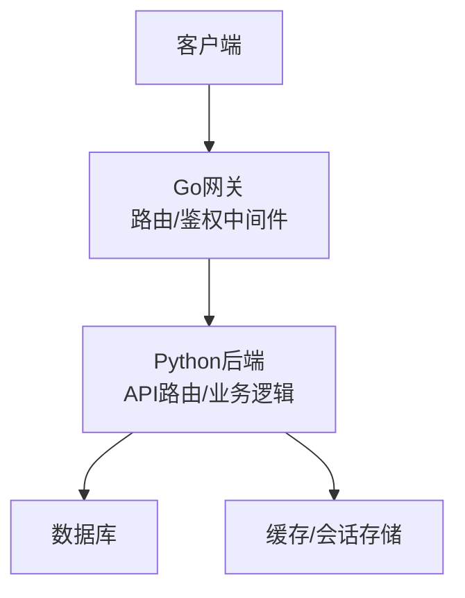
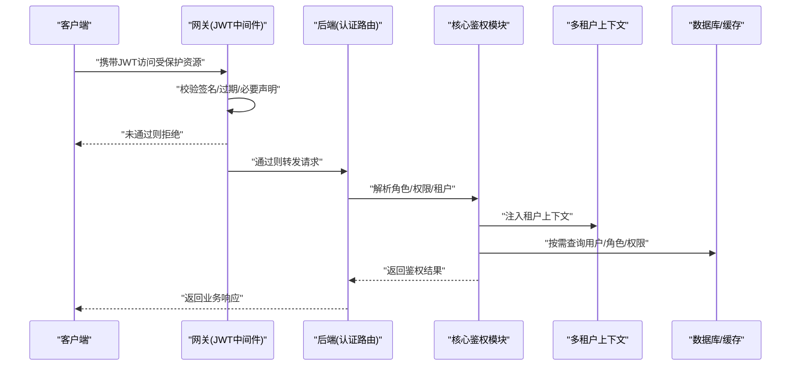
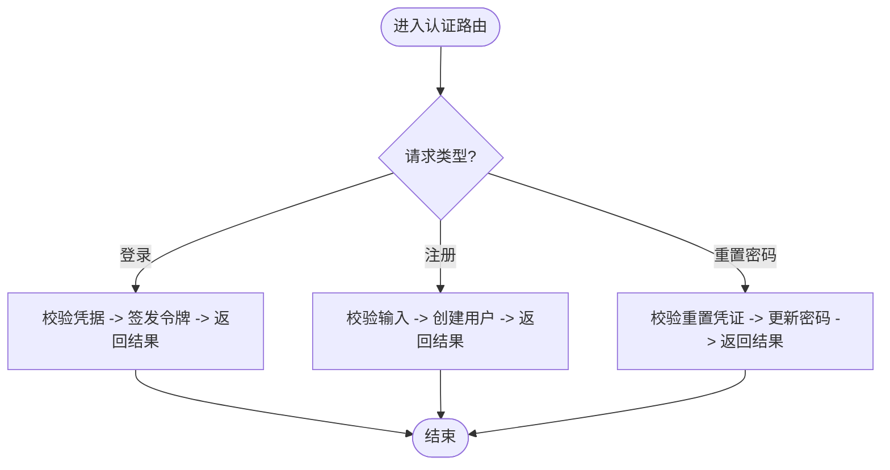
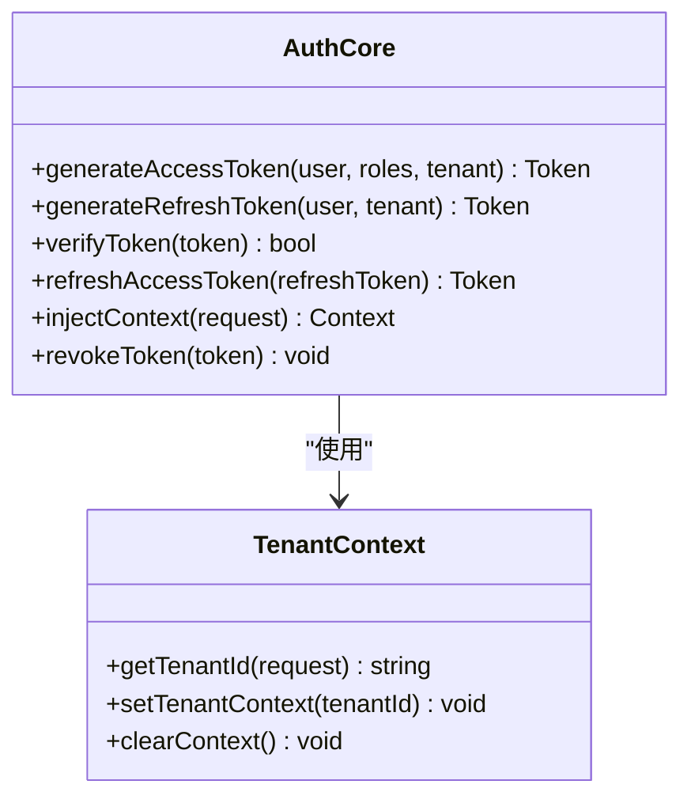
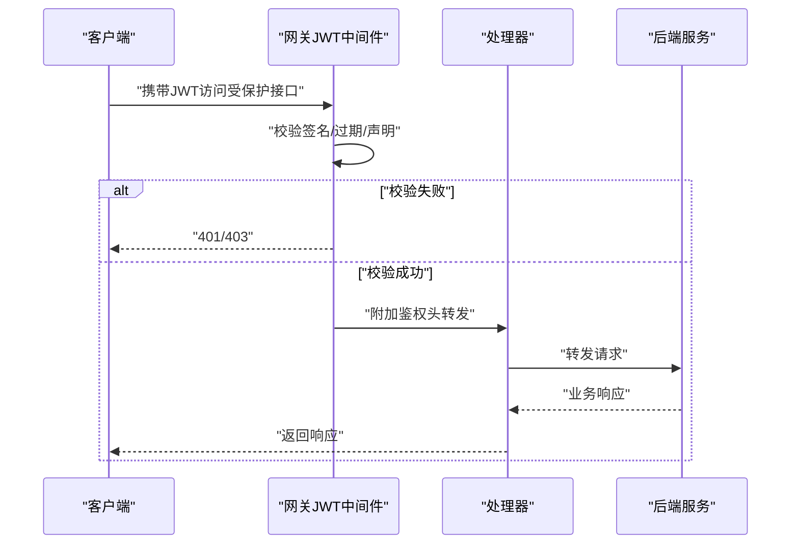
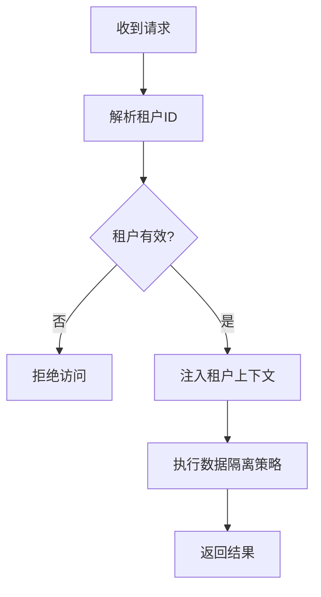
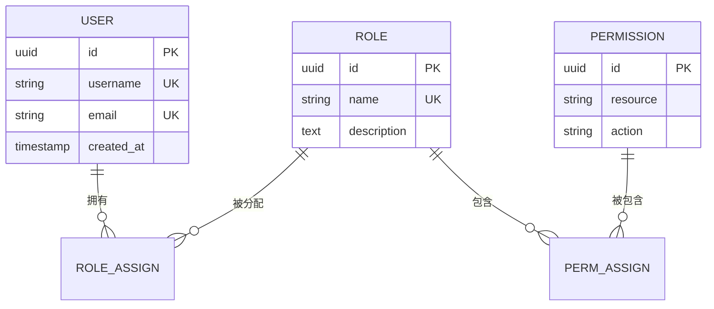
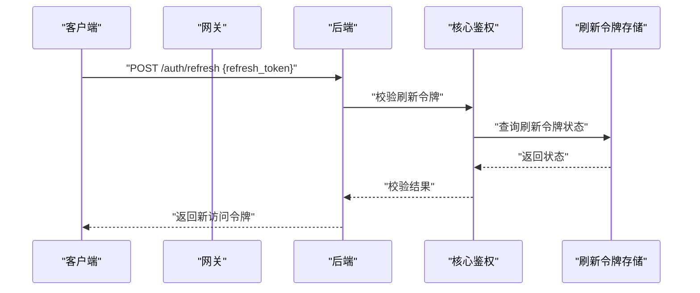
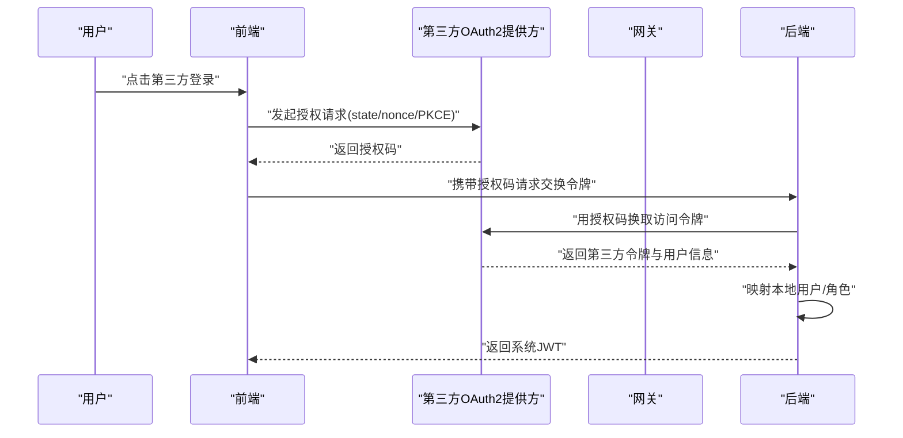
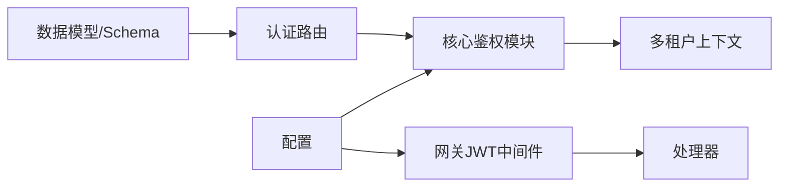

# 认证授权接口

<cite>
**本文引用的文件**   
- [backend_design/nexus/api/routes/auth.py](file://backend_design/nexus/api/routes/auth.py)
- [backend_design/nexus/core/auth.py](file://backend_design/nexus/core/auth.py)
- [backend_design/nexus/core/tenant_context.py](file://backend_design/nexus/core/tenant_context.py)
- [backend_design/nexus_gate/internal/auth/jwt.go](file://backend_design/nexus_gate/internal/auth/jwt.go)
- [backend_design/nexus_gate/internal/handlers/handlers.go](file://backend_design/nexus_gate/internal/handlers/handlers.go)
- [backend_design/nexus_gate/internal/router/router.go](file://backend_design/nexus_gate/internal/router/router.go)
- [backend_design/nexus/models/schemas.py](file://backend_design/nexus/models/schemas.py)
- [backend_design/nexus/config.py](file://backend_design/nexus/config.py)
</cite>

## 目录
1. [简介](#简介)
2. [项目结构](#项目结构)
3. [核心组件](#核心组件)
4. [架构总览](#架构总览)
5. [详细组件分析](#详细组件分析)
6. [依赖分析](#依赖分析)
7. [性能考虑](#性能考虑)
8. [故障排查指南](#故障排查指南)
9. [结论](#结论)
10. [附录](#附录)

## 简介
本文件面向后端与网关侧的认证与授权能力，覆盖用户登录、注册、密码重置等认证流程；记录JWT令牌的生成、验证与刷新机制；描述权限控制模型与角色管理接口；说明多租户环境下的身份隔离与安全策略；提供完整的认证流程图与令牌生命周期管理；包含安全最佳实践与常见攻击防护方法；并给出第三方认证集成方式与OAuth2支持建议。

## 项目结构
本项目在Python后端与Go网关两侧分别实现认证相关能力：
- Python后端（Nexus）
  - API路由层：暴露认证相关HTTP接口
  - 核心鉴权模块：负责JWT签发、校验、会话上下文注入
  - 多租户上下文：基于请求上下文进行租户隔离
  - 数据模型与Schema：定义用户、角色、权限等数据结构
  - 配置中心：集中管理密钥、过期时间、策略开关等
- Go网关（Nexus Gate）
  - JWT中间件：统一校验JWT签名、解析声明、透传上下文
  - 路由与处理器：将鉴权结果转发至后端服务
  - 限流与缓存：配合Redis做速率限制与会话状态存储

[本节为概念性概述，不直接分析具体文件，故无“章节来源”]

## 核心组件
- 认证路由与控制器
  - 负责处理登录、注册、密码重置等请求，调用核心鉴权模块完成令牌签发与校验
- 核心鉴权模块
  - 提供JWT生成、验证、刷新、黑名单/撤销、上下文注入等能力
- 多租户上下文
  - 从请求头或JWT声明中解析租户标识，并在后续请求链路中保持隔离
- 网关JWT中间件
  - 在网关层对JWT进行签名校验与基础声明解析，减少后端压力
- 数据模型与Schema
  - 定义用户、角色、权限、租户等实体及输入输出契约
- 配置项
  - 管理JWT密钥、算法、过期时间、刷新策略、租户隔离开关等

**章节来源**
- [backend_design/nexus/api/routes/auth.py](file://backend_design/nexus/api/routes/auth.py)
- [backend_design/nexus/core/auth.py](file://backend_design/nexus/core/auth.py)
- [backend_design/nexus/core/tenant_context.py](file://backend_design/nexus/core/tenant_context.py)
- [backend_design/nexus_gate/internal/auth/jwt.go](file://backend_design/nexus_gate/internal/auth/jwt.go)
- [backend_design/nexus_gate/internal/handlers/handlers.go](file://backend_design/nexus_gate/internal/handlers/handlers.go)
- [backend_design/nexus_gate/internal/router/router.go](file://backend_design/nexus_gate/internal/router/router.go)
- [backend_design/nexus/models/schemas.py](file://backend_design/nexus/models/schemas.py)
- [backend_design/nexus/config.py](file://backend_design/nexus/config.py)

## 架构总览
下图展示认证授权的整体交互：客户端通过网关访问后端，网关执行JWT校验与基础鉴权，后端根据JWT中的角色与权限信息执行细粒度控制，同时结合多租户上下文确保数据隔离。

**图表来源**
- [backend_design/nexus_gate/internal/auth/jwt.go](file://backend_design/nexus_gate/internal/auth/jwt.go)
- [backend_design/nexus/api/routes/auth.py](file://backend_design/nexus/api/routes/auth.py)
- [backend_design/nexus/core/auth.py](file://backend_design/nexus/core/auth.py)
- [backend_design/nexus/core/tenant_context.py](file://backend_design/nexus/core/tenant_context.py)

**章节来源**
- [backend_design/nexus_gate/internal/auth/jwt.go](file://backend_design/nexus_gate/internal/auth/jwt.go)
- [backend_design/nexus/api/routes/auth.py](file://backend_design/nexus/api/routes/auth.py)
- [backend_design/nexus/core/auth.py](file://backend_design/nexus/core/auth.py)
- [backend_design/nexus/core/tenant_context.py](file://backend_design/nexus/core/tenant_context.py)

## 详细组件分析

### 认证路由与控制器（登录、注册、密码重置）
- 登录
  - 输入：用户名/邮箱、密码、可选设备指纹或IP
  - 处理：校验凭据、生成短期访问令牌与长期刷新令牌、写入会话/黑名单白名单、返回令牌与过期时间
  - 输出：访问令牌、刷新令牌、过期时间、用户基本信息
- 注册
  - 输入：用户名/邮箱、密码、可选邀请码或租户ID
  - 处理：唯一性校验、密码强度校验、创建用户与默认角色、初始化租户上下文
  - 输出：注册结果、初始令牌（可选）、提示消息
- 密码重置
  - 输入：邮箱或手机号、验证码/重置令牌
  - 处理：发送重置链接/验证码、校验有效性、更新密码、清理旧刷新令牌
  - 输出：重置成功提示

**图表来源**
- [backend_design/nexus/api/routes/auth.py](file://backend_design/nexus/api/routes/auth.py)
- [backend_design/nexus/core/auth.py](file://backend_design/nexus/core/auth.py)

**章节来源**
- [backend_design/nexus/api/routes/auth.py](file://backend_design/nexus/api/routes/auth.py)
- [backend_design/nexus/core/auth.py](file://backend_design/nexus/core/auth.py)

### 核心鉴权模块（JWT签发、验证、刷新、上下文注入）
- 令牌签发
  - 使用强随机密钥与合适算法签发访问令牌与刷新令牌
  - 在令牌中包含用户标识、角色、权限、租户ID、签发时间、过期时间等声明
- 令牌验证
  - 校验签名、过期时间、必要声明；必要时检查黑名单/撤销列表
- 令牌刷新
  - 使用刷新令牌换取新的访问令牌；支持一次性使用与轮换策略
- 上下文注入
  - 将当前用户、角色、权限、租户等信息注入到请求上下文，供后续业务使用

**图表来源**
- [backend_design/nexus/core/auth.py](file://backend_design/nexus/core/auth.py)
- [backend_design/nexus/core/tenant_context.py](file://backend_design/nexus/core/tenant_context.py)

**章节来源**
- [backend_design/nexus/core/auth.py](file://backend_design/nexus/core/auth.py)
- [backend_design/nexus/core/tenant_context.py](file://backend_design/nexus/core/tenant_context.py)

### 网关JWT中间件（统一校验与透传）
- 职责
  - 在网关层对JWT进行签名校验与基础声明解析
  - 将用户标识、角色、权限、租户等声明以标准头形式透传给后端
  - 对未携带或无效令牌进行快速拒绝，降低后端负载
- 行为
  - 白名单路径放行（如登录、注册、健康检查）
  - 黑名单/撤销令牌拦截
  - 限流与防重放（结合Redis）

**图表来源**
- [backend_design/nexus_gate/internal/auth/jwt.go](file://backend_design/nexus_gate/internal/auth/jwt.go)
- [backend_design/nexus_gate/internal/handlers/handlers.go](file://backend_design/nexus_gate/internal/handlers/handlers.go)
- [backend_design/nexus_gate/internal/router/router.go](file://backend_design/nexus_gate/internal/router/router.go)

**章节来源**
- [backend_design/nexus_gate/internal/auth/jwt.go](file://backend_design/nexus_gate/internal/auth/jwt.go)
- [backend_design/nexus_gate/internal/handlers/handlers.go](file://backend_design/nexus_gate/internal/handlers/handlers.go)
- [backend_design/nexus_gate/internal/router/router.go](file://backend_design/nexus_gate/internal/router/router.go)

### 多租户身份隔离与安全策略
- 租户识别
  - 从JWT声明或请求头解析租户ID
  - 若缺失则拒绝访问或回退到默认租户（需明确策略）
- 数据隔离
  - 所有数据查询强制带上租户过滤条件
  - 跨租户访问需显式授权
- 安全策略
  - 禁止跨租户读取/写入
  - 审计日志记录租户操作轨迹
  - 敏感操作二次确认与审批

**图表来源**
- [backend_design/nexus/core/tenant_context.py](file://backend_design/nexus/core/tenant_context.py)

**章节来源**
- [backend_design/nexus/core/tenant_context.py](file://backend_design/nexus/core/tenant_context.py)

### 权限控制模型与角色管理接口
- 模型
  - 用户-角色-权限三元关系
  - 角色可继承或组合，权限可细粒度到资源与方法
- 接口
  - 角色CRUD：创建、更新、删除、查询
  - 权限分配：为用户或角色分配/移除权限
  - 权限校验：在路由或业务层进行RBAC校验
- 实现要点
  - 使用最小权限原则
  - 缓存角色与权限映射，提升校验性能
  - 变更时触发缓存失效与审计记录

**图表来源**
- [backend_design/nexus/models/schemas.py](file://backend_design/nexus/models/schemas.py)

**章节来源**
- [backend_design/nexus/models/schemas.py](file://backend_design/nexus/models/schemas.py)

### 令牌生命周期管理与刷新机制
- 生命周期
  - 访问令牌：短有效期，用于频繁访问
  - 刷新令牌：长有效期，用于换取新访问令牌
- 刷新流程
  - 客户端携带刷新令牌请求刷新端点
  - 服务端校验刷新令牌有效性、是否已撤销
  - 签发新访问令牌，可选择轮换刷新令牌
- 撤销与黑名单
  - 支持主动撤销令牌
  - 维护短期黑名单，防止立即重用

**图表来源**
- [backend_design/nexus/core/auth.py](file://backend_design/nexus/core/auth.py)
- [backend_design/nexus_gate/internal/auth/jwt.go](file://backend_design/nexus_gate/internal/auth/jwt.go)

**章节来源**
- [backend_design/nexus/core/auth.py](file://backend_design/nexus/core/auth.py)
- [backend_design/nexus_gate/internal/auth/jwt.go](file://backend_design/nexus_gate/internal/auth/jwt.go)

### 第三方认证集成与OAuth2支持
- 集成方式
  - 支持OIDC/OAuth2授权码模式
  - 通过网关或后端代理完成授权码交换与令牌获取
  - 将第三方用户映射为本系统用户与角色
- 安全要点
  - 严格校验state与nonce
  - 使用HTTPS与PKCE（移动端）
  - 定期轮换客户端密钥
  - 限制回调域与作用域

[本节为概念性指导，不直接分析具体文件，故无“图表来源”与“章节来源”]

## 依赖分析
- 组件耦合
  - 认证路由依赖核心鉴权模块与多租户上下文
  - 网关JWT中间件独立于后端，仅依赖配置与缓存
  - 数据模型与Schema为前后端契约基础
- 外部依赖
  - Redis用于会话、刷新令牌、黑名单与限流
  - 数据库用于持久化用户、角色、权限与租户信息
- 潜在循环依赖
  - 避免在鉴权模块中直接引入业务路由，采用分层解耦

**图表来源**
- [backend_design/nexus/api/routes/auth.py](file://backend_design/nexus/api/routes/auth.py)
- [backend_design/nexus/core/auth.py](file://backend_design/nexus/core/auth.py)
- [backend_design/nexus/core/tenant_context.py](file://backend_design/nexus/core/tenant_context.py)
- [backend_design/nexus_gate/internal/auth/jwt.go](file://backend_design/nexus_gate/internal/auth/jwt.go)
- [backend_design/nexus_gate/internal/handlers/handlers.go](file://backend_design/nexus_gate/internal/handlers/handlers.go)
- [backend_design/nexus/models/schemas.py](file://backend_design/nexus/models/schemas.py)
- [backend_design/nexus/config.py](file://backend_design/nexus/config.py)

**章节来源**
- [backend_design/nexus/api/routes/auth.py](file://backend_design/nexus/api/routes/auth.py)
- [backend_design/nexus/core/auth.py](file://backend_design/nexus/core/auth.py)
- [backend_design/nexus/core/tenant_context.py](file://backend_design/nexus/core/tenant_context.py)
- [backend_design/nexus_gate/internal/auth/jwt.go](file://backend_design/nexus_gate/internal/auth/jwt.go)
- [backend_design/nexus_gate/internal/handlers/handlers.go](file://backend_design/nexus_gate/internal/handlers/handlers.go)
- [backend_design/nexus/models/schemas.py](file://backend_design/nexus/models/schemas.py)
- [backend_design/nexus/config.py](file://backend_design/nexus/config.py)

## 性能考虑
- 令牌校验优化
  - 在网关层完成签名与基础声明校验，减少后端CPU开销
  - 使用内存缓存角色与权限映射，降低数据库压力
- 刷新令牌存储
  - 使用Redis有序集合或哈希表存储刷新令牌状态，支持快速查找与过期清理
- 限流与防抖
  - 针对登录与刷新接口实施速率限制，防止暴力破解与令牌风暴
- 连接池与并发
  - 合理设置数据库与缓存连接池大小，避免认证高峰期阻塞

[本节为通用性能建议，不直接分析具体文件，故无“章节来源”]

## 故障排查指南
- 常见问题
  - 401未授权：检查JWT签名、过期时间与必要声明
  - 403禁止访问：检查角色与权限映射是否正确
  - 刷新失败：检查刷新令牌是否存在、是否已撤销或过期
  - 租户错误：检查JWT中租户ID是否与请求头一致
- 定位步骤
  - 查看网关日志中的JWT校验结果
  - 检查后端鉴权模块的错误码与堆栈
  - 核对Redis中刷新令牌与黑名单状态
  - 验证数据库用户、角色、权限与租户关联
- 恢复措施
  - 清理异常会话与黑名单条目
  - 重新同步角色与权限缓存
  - 调整限流阈值与超时参数

**章节来源**
- [backend_design/nexus_gate/internal/auth/jwt.go](file://backend_design/nexus_gate/internal/auth/jwt.go)
- [backend_design/nexus/core/auth.py](file://backend_design/nexus/core/auth.py)

## 结论
本认证授权方案通过网关与后端的分层设计，实现了高效的JWT校验与细粒度权限控制，并结合多租户上下文保障数据隔离。通过完善的令牌生命周期管理与安全策略，能够有效抵御常见攻击并满足企业级安全要求。建议在部署中持续监控与审计，并根据业务演进优化角色与权限模型。

[本节为总结性内容，不直接分析具体文件，故无“章节来源”]

## 附录
- 安全最佳实践
  - 使用强随机密钥与合适的算法（如RS256/ES256）
  - 启用HTTPS与严格的CORS策略
  - 实施最小权限原则与定期权限审计
  - 开启双因素认证与设备信任管理
  - 对敏感操作进行二次确认与审批
- 常见攻击防护
  - 暴力破解：账户锁定与验证码
  - 令牌劫持：绑定设备指纹与IP白名单
  - CSRF/XSS：同源策略与输入校验
  - 重放攻击：nonce与时间戳校验
- 第三方认证集成清单
  - OAuth2/OIDC授权码模式
  - PKCE支持（移动端）
  - 回调域与作用域白名单
  - 客户端密钥轮换与吊销

[本节为通用指导，不直接分析具体文件，故无“章节来源”]