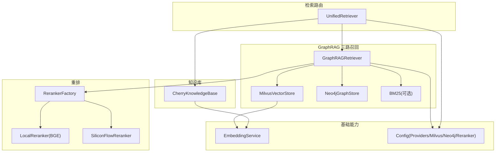
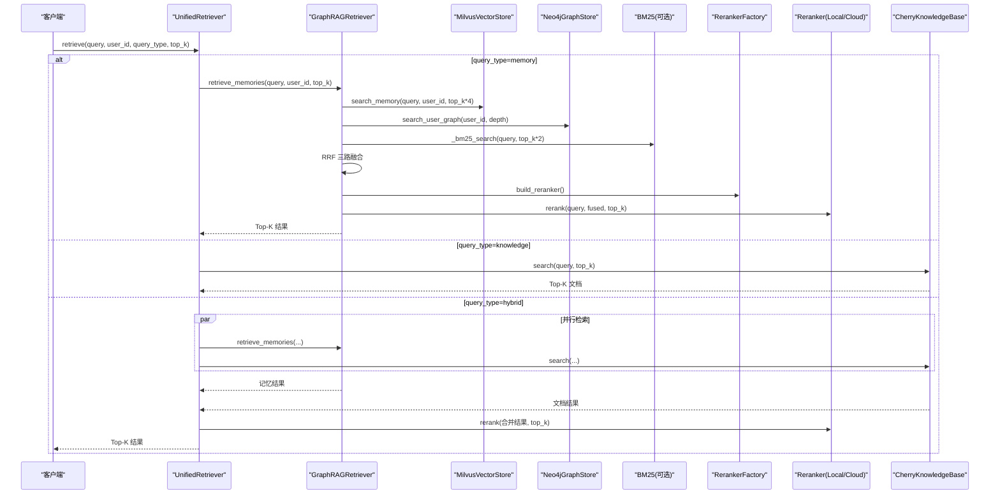
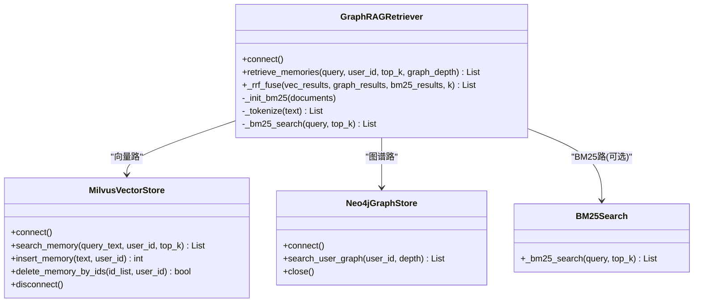
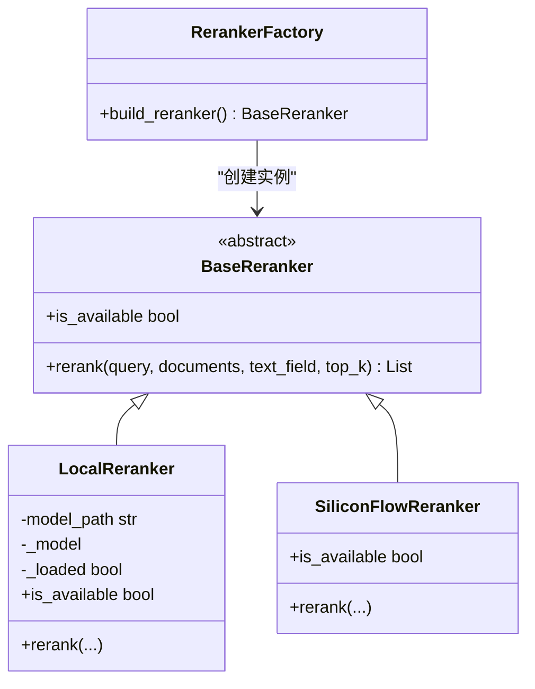
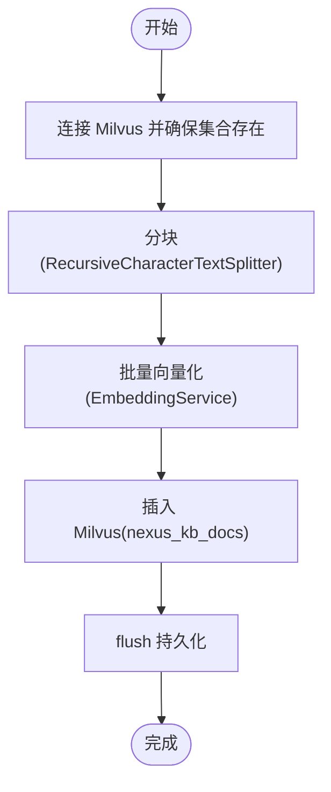
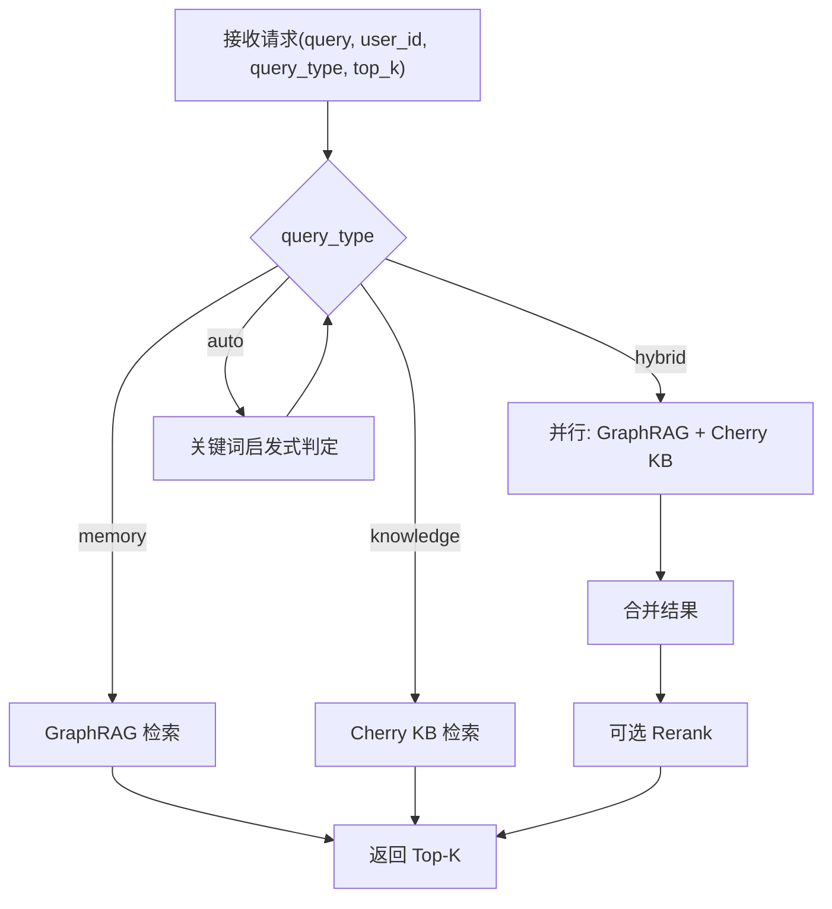
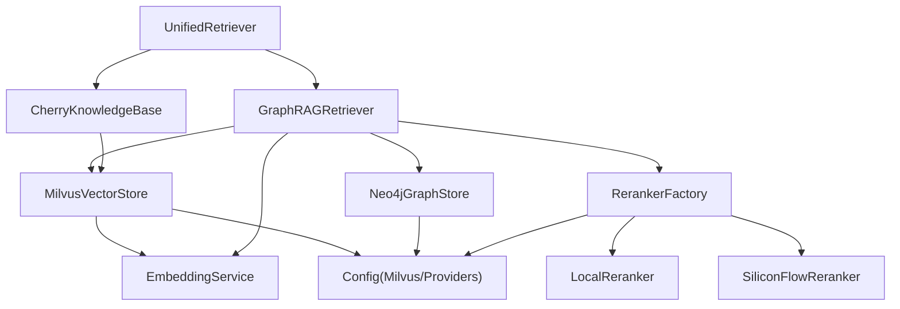

# GraphRAG检索系统

<cite>
**本文引用的文件**   
- [unified_retriever.py](file://backend_design/nexus/rag/unified_retriever.py)
- [retriever.py](file://backend_design/nexus/rag/retriever.py)
- [cherry_kb.py](file://backend_design/nexus/rag/cherry_kb.py)
- [reranker.py](file://backend_design/nexus/rag/reranker.py)
- [vector_store.py](file://backend_design/nexus/rag/vector_store.py)
- [graph_store.py](file://backend_design/nexus/rag/graph_store.py)
- [embedding.py](file://backend_design/nexus/rag/embedding.py)
- [reranker_factory.py](file://backend_design/nexus/rag/reranker_factory.py)
- [vector_factory.py](file://backend_design/nexus/rag/vector_factory.py)
- [config.py](file://backend_design/nexus/config.py)
- [reranker_base.py](file://backend_design/nexus/rag/reranker_base.py)
- [vector_base.py](file://backend_design/nexus/rag/vector_base.py)
- [graph_base.py](file://backend_design/nexus/rag/graph_base.py)
- [siliconflow_reranker.py](file://backend_design/nexus/rag/siliconflow_reranker.py)
- [zilliz_vector_store.py](file://backend_design/nexus/rag/zilliz_vector_store.py)
</cite>

## 目录
1. [简介](#简介)
2. [项目结构](#项目结构)
3. [核心组件](#核心组件)
4. [架构总览](#架构总览)
5. [详细组件分析](#详细组件分析)
6. [依赖关系分析](#依赖关系分析)
7. [性能与优化](#性能与优化)
8. [故障排查指南](#故障排查指南)
9. [结论](#结论)
10. [附录](#附录)

## 简介
本技术文档围绕 NexusCockpit 的 GraphRAG 检索系统，系统性阐述“三路融合检索”架构：向量检索（Milvus 语义搜索）、图谱检索（Neo4j 用户画像+关系遍历）、全文检索（BM25 关键词匹配）的协同工作机制；深入解释 RRF（Reciprocal Rank Fusion）融合算法的实现与参数调优；说明 Rerank 重排阶段（bge-reranker-v2-m3）的作用与配置；并给出 CherryKB 知识库构建与管理、向量索引优化、图谱查询优化策略，以及检索效果评估方法与性能调优指南。

## 项目结构
GraphRAG 相关代码集中于 backend_design/nexus/rag 目录，采用“接口抽象 + 工厂选择 + 多后端实现”的分层设计：
- 统一检索路由层：根据 query_type 分发到 GraphRAG 或 Cherry KB，支持混合检索与可选 Rerank。
- 三路召回与融合：向量路（Milvus）、图谱路（Neo4j）、BM25 路（rank_bm25），通过 RRF 融合排序。
- Rerank 重排：本地 BGE CrossEncoder 或云端 SiliconFlow API，按相关性二次排序。
- 知识库管理：Cherry KB 基于 Milvus 存储长文档分块，提供分类过滤与统计。
- 基础设施：Embedding 服务（Ark API）、向量库抽象与工厂、图谱抽象与工厂、配置中心。

图表来源
- [unified_retriever.py:33-155](file://backend_design/nexus/rag/unified_retriever.py#L33-L155)
- [retriever.py:38-178](file://backend_design/nexus/rag/retriever.py#L38-L178)
- [cherry_kb.py:49-287](file://backend_design/nexus/rag/cherry_kb.py#L49-L287)
- [reranker.py:34-151](file://backend_design/nexus/rag/reranker.py#L34-L151)
- [vector_store.py:38-271](file://backend_design/nexus/rag/vector_store.py#L38-L271)
- [graph_store.py:24-190](file://backend_design/nexus/rag/graph_store.py#L24-L190)
- [embedding.py:32-137](file://backend_design/nexus/rag/embedding.py#L32-L137)
- [reranker_factory.py:47-65](file://backend_design/nexus/rag/reranker_factory.py#L47-L65)
- [config.py:458-489](file://backend_design/nexus/config.py#L458-L489)

章节来源
- [unified_retriever.py:33-155](file://backend_design/nexus/rag/unified_retriever.py#L33-L155)
- [retriever.py:38-178](file://backend_design/nexus/rag/retriever.py#L38-L178)
- [cherry_kb.py:49-287](file://backend_design/nexus/rag/cherry_kb.py#L49-L287)
- [reranker.py:34-151](file://backend_design/nexus/rag/reranker.py#L34-L151)
- [vector_store.py:38-271](file://backend_design/nexus/rag/vector_store.py#L38-L271)
- [graph_store.py:24-190](file://backend_design/nexus/rag/graph_store.py#L24-L190)
- [embedding.py:32-137](file://backend_design/nexus/rag/embedding.py#L32-L137)
- [reranker_factory.py:47-65](file://backend_design/nexus/rag/reranker_factory.py#L47-L65)
- [config.py:458-489](file://backend_design/nexus/config.py#L458-L489)

## 核心组件
- 统一检索路由层 UnifiedRetriever：根据 query_type 自动或显式选择 memory/knowledge/hybrid 模式，并行调用 GraphRAG 与 Cherry KB，并在需要时触发 Rerank。
- GraphRAG 三路召回器 GraphRAGRetriever：封装向量路（Milvus）、图谱路（Neo4j）、BM25 路的召回与 RRF 融合，并提供可选 Rerank。
- 向量存储 MilvusVectorStore：维护 Food_List 与 User_Memory 集合，提供语义检索与写入删除等能力。
- 知识图谱 Neo4jGraphStore：维护用户画像与实体关系，支持 N 阶路径遍历与双向绑定 Milvus ID。
- 文档知识库 CherryKnowledgeBase：对长文档进行智能分块、向量化、入库与检索，支持类别过滤。
- Rerank 重排：本地 LocalReranker（BGE CrossEncoder）与云端 SiliconFlowReranker，统一 BaseReranker 接口。
- Embedding 服务：异步调用 Ark API 获取文本向量，内置熔断与重试。
- 工厂与配置：向量库与重排器通过工厂按 Providers 配置动态选择；所有连接参数由配置中心集中管理。

章节来源
- [unified_retriever.py:33-155](file://backend_design/nexus/rag/unified_retriever.py#L33-L155)
- [retriever.py:38-178](file://backend_design/nexus/rag/retriever.py#L38-L178)
- [vector_store.py:38-271](file://backend_design/nexus/rag/vector_store.py#L38-L271)
- [graph_store.py:24-190](file://backend_design/nexus/rag/graph_store.py#L24-L190)
- [cherry_kb.py:49-287](file://backend_design/nexus/rag/cherry_kb.py#L49-L287)
- [reranker.py:34-151](file://backend_design/nexus/rag/reranker.py#L34-L151)
- [siliconflow_reranker.py:31-112](file://backend_design/nexus/rag/siliconflow_reranker.py#L31-L112)
- [embedding.py:32-137](file://backend_design/nexus/rag/embedding.py#L32-L137)
- [reranker_factory.py:47-65](file://backend_design/nexus/rag/reranker_factory.py#L47-L65)
- [vector_factory.py:25-45](file://backend_design/nexus/rag/vector_factory.py#L25-L45)
- [config.py:458-489](file://backend_design/nexus/config.py#L458-L489)

## 架构总览
下图展示从请求进入统一检索路由，到三路召回、RRF 融合、Rerank 重排的完整流程，以及与外部系统的交互点。

图表来源
- [unified_retriever.py:63-155](file://backend_design/nexus/rag/unified_retriever.py#L63-L155)
- [retriever.py:141-178](file://backend_design/nexus/rag/retriever.py#L141-L178)
- [vector_store.py:134-168](file://backend_design/nexus/rag/vector_store.py#L134-L168)
- [graph_store.py:98-133](file://backend_design/nexus/rag/graph_store.py#L98-L133)
- [cherry_kb.py:209-266](file://backend_design/nexus/rag/cherry_kb.py#L209-L266)
- [reranker_factory.py:47-65](file://backend_design/nexus/rag/reranker_factory.py#L47-L65)
- [reranker.py:79-139](file://backend_design/nexus/rag/reranker.py#L79-L139)

## 详细组件分析

### 三路召回与 RRF 融合
- 向量路：Milvus 对用户记忆集合执行 ANN 近似搜索，返回带距离/相似度分数与元数据的结果。
- 图谱路：Neo4j 对用户节点进行 1~N 阶关系遍历，生成可读的路径描述文本作为候选。
- BM25 路：在启用且已初始化索引的情况下，对候选文档进行关键词匹配打分。
- RRF 融合：将三路结果的排名映射为分数，按公式 RRF(d)=Σ 1/(k+rank_i(d)) 累加，去重后排序输出。

图表来源
- [retriever.py:141-245](file://backend_design/nexus/rag/retriever.py#L141-L245)
- [vector_store.py:134-168](file://backend_design/nexus/rag/vector_store.py#L134-L168)
- [graph_store.py:98-133](file://backend_design/nexus/rag/graph_store.py#L98-L133)

章节来源
- [retriever.py:141-245](file://backend_design/nexus/rag/retriever.py#L141-L245)

#### RRF 融合算法与参数调优
- 算法要点：
  - 三路分别产生有序候选列表，按各自 rank 计算贡献分数。
  - 平滑常数 k 控制排名衰减速度，k 越大越平缓，k 越小越强调头部排名。
  - 文本归一化与去重：以 text 字段作为唯一键，合并不同路中相同片段。
- 关键参数建议：
  - k：常用范围 40~120。k 较小更看重各路头部命中，适合强信号场景；k 较大更均衡，适合弱信号或多噪声源。
  - 召回规模：向量路与 BM25 路可放大 top_k（如 top_k*2~top_k*4），为融合与重排提供更丰富候选。
  - 权重扩展：当前实现三路等权，若需差异化，可在 RRF 前对各路结果乘以经验权重，或在融合后引入线性加权。
- 复杂度：
  - 时间复杂度 O(N log N)，N 为去重后的候选总数（主要来自排序）。
  - 空间复杂度 O(N)，用于保存 scores 与 texts 映射。

章节来源
- [retriever.py:192-245](file://backend_design/nexus/rag/retriever.py#L192-L245)

### Rerank 重排阶段（bge-reranker-v2-m3）
- 作用：在 RRF 融合之后，对 Top-N 候选进行细粒度相关性重排，显著提升最终 Top-K 质量。
- 后端选择：
  - local：加载本地模型 ./models/reranker/bge-reranker-v2-m3，使用 CrossEncoder 推理。
  - cloud：调用硅基流动 /rerank 接口，复用 ARK_API_KEY/ARK_BASE_URL。
  - none：跳过重排，直接取前 K 条。
- 行为特性：
  - 延迟加载：首次调用时才加载模型，避免启动开销。
  - 降级保护：模型不可用时回退为原序前 K 条。
  - 输出规范：每项新增 rerank_score 字段，便于下游排序与溯源。

图表来源
- [reranker_base.py:17-50](file://backend_design/nexus/rag/reranker_base.py#L17-L50)
- [reranker.py:34-151](file://backend_design/nexus/rag/reranker.py#L34-L151)
- [siliconflow_reranker.py:31-112](file://backend_design/nexus/rag/siliconflow_reranker.py#L31-L112)
- [reranker_factory.py:47-65](file://backend_design/nexus/rag/reranker_factory.py#L47-L65)

章节来源
- [reranker.py:34-151](file://backend_design/nexus/rag/reranker.py#L34-L151)
- [siliconflow_reranker.py:31-112](file://backend_design/nexus/rag/siliconflow_reranker.py#L31-L112)
- [reranker_factory.py:47-65](file://backend_design/nexus/rag/reranker_factory.py#L47-L65)

### CherryKB 知识库构建与管理
- 文档入库：
  - 智能分块：优先使用 langchain_text_splitters 的 RecursiveCharacterTextSplitter，按段落/句子/字符多级分隔符递归切分，保持语义完整性。
  - 批量向量化：调用 EmbeddingService 批量生成向量，减少网络往返。
  - Milvus 插入：写入 nexus_kb_docs 集合，包含 id/text/source/category/vector 字段，并创建 IVF_FLAT 索引。
- 检索流程：
  - 查询向量化 → 向量检索（COSINE，nprobe 可调）→ 格式化输出（text/source/category/score）。
  - 支持 category 过滤，便于限定手册/故障码/FAQ/保养规范等子域。
- 统计信息：
  - 提供集合实体数量等统计，便于监控容量与健康度。

图表来源
- [cherry_kb.py:99-182](file://backend_design/nexus/rag/cherry_kb.py#L99-L182)
- [cherry_kb.py:184-207](file://backend_design/nexus/rag/cherry_kb.py#L184-L207)
- [cherry_kb.py:209-266](file://backend_design/nexus/rag/cherry_kb.py#L209-L266)

章节来源
- [cherry_kb.py:49-287](file://backend_design/nexus/rag/cherry_kb.py#L49-L287)

### 统一检索路由与混合模式
- 路由策略：
  - memory：仅查 GraphRAG 用户记忆。
  - knowledge：仅查 Cherry KB 文档。
  - hybrid：并行查两者，合并后再 Rerank。
  - auto：基于关键词启发式判断（含“故障/手册/怎么用”→ knowledge；含“我喜欢/习惯/记得”→ memory；默认 hybrid）。
- 并发与容错：
  - 使用 asyncio.gather 并行执行，异常不影响其他分支。
  - 合并后统一 source 标记，便于溯源。

图表来源
- [unified_retriever.py:63-155](file://backend_design/nexus/rag/unified_retriever.py#L63-L155)

章节来源
- [unified_retriever.py:33-155](file://backend_design/nexus/rag/unified_retriever.py#L33-L155)

## 依赖关系分析
- 组件耦合：
  - UnifiedRetriever 依赖 GraphRAGRetriever 与 CherryKnowledgeBase，并通过 RerankerFactory 按需注入 Reranker。
  - GraphRAGRetriever 依赖 MilvusVectorStore、Neo4jGraphStore、EmbeddingService 与 Reranker。
  - CherryKnowledgeBase 依赖 EmbeddingService 与 Milvus。
- 工厂与配置：
  - vector_factory 与 reranker_factory 依据 Providers 配置选择具体后端（local/cloud/none）。
  - config.py 集中管理 Milvus/Neo4j/LLM/Providers 等参数，确保一致性与可切换性。
- 潜在循环依赖：
  - 当前模块间为单向依赖，未见循环导入风险。

图表来源
- [unified_retriever.py:33-155](file://backend_design/nexus/rag/unified_retriever.py#L33-L155)
- [retriever.py:38-178](file://backend_design/nexus/rag/retriever.py#L38-L178)
- [cherry_kb.py:49-287](file://backend_design/nexus/rag/cherry_kb.py#L49-L287)
- [vector_factory.py:25-45](file://backend_design/nexus/rag/vector_factory.py#L25-L45)
- [reranker_factory.py:47-65](file://backend_design/nexus/rag/reranker_factory.py#L47-L65)
- [config.py:458-489](file://backend_design/nexus/config.py#L458-L489)

章节来源
- [unified_retriever.py:33-155](file://backend_design/nexus/rag/unified_retriever.py#L33-L155)
- [retriever.py:38-178](file://backend_design/nexus/rag/retriever.py#L38-L178)
- [cherry_kb.py:49-287](file://backend_design/nexus/rag/cherry_kb.py#L49-L287)
- [vector_factory.py:25-45](file://backend_design/nexus/rag/vector_factory.py#L25-L45)
- [reranker_factory.py:47-65](file://backend_design/nexus/rag/reranker_factory.py#L47-L65)
- [config.py:458-489](file://backend_design/nexus/config.py#L458-L489)

## 性能与优化

### 向量索引优化（Milvus）
- 索引类型与度量：
  - 用户记忆集合：HNSW 索引，IP 度量，M=16、efConstruction=200，搜索 ef=64。
  - 知识库集合：IVF_FLAT 索引，COSINE 度量，nlist=128。
- 调参建议：
  - HNSW：增大 M/efConstruction 提升建图精度与召回率，但增加内存与构建时间；增大 ef 提升查询精度，代价是延迟上升。
  - IVF_FLAT：增大 nlist 提升大规模数据下的检索效率，配合 nprobe 平衡精度与速度。
- 维度一致性：
  - embedding_dim 必须与模型输出一致，否则无法创建索引或检索失败。

章节来源
- [vector_store.py:72-132](file://backend_design/nexus/rag/vector_store.py#L72-L132)
- [cherry_kb.py:99-133](file://backend_design/nexus/rag/cherry_kb.py#L99-L133)
- [config.py:167-198](file://backend_design/nexus/config.py#L167-L198)

### 图谱查询优化（Neo4j）
- 约束与索引：
  - 为 User.id 建立唯一约束，Entity.name 建立索引，加速匹配与去重。
- 查询深度：
  - 合理设置 graph_depth，避免过深遍历导致结果爆炸与延迟升高。
- 双向绑定：
  - 关系边携带 mid 字段，与 Milvus 主键关联，便于跨库联动删除与溯源。

章节来源
- [graph_store.py:45-53](file://backend_design/nexus/rag/graph_store.py#L45-L53)
- [graph_store.py:98-133](file://backend_design/nexus/rag/graph_store.py#L98-L133)
- [graph_store.py:55-82](file://backend_design/nexus/rag/graph_store.py#L55-L82)

### Rerank 性能与成本
- 本地模式：
  - 首次加载模型约 2 秒，后续 CPU 推理约 200ms/20 条，适合离线批处理或低延迟要求不高的在线链路。
- 云端模式：
  - 复用 ARK_API_KEY/ARK_BASE_URL，无需本地模型，节省资源但受网络与配额限制。
- 降级策略：
  - 模型不可用或网络异常时，直接返回原序前 K 条，保障可用性。

章节来源
- [reranker.py:52-77](file://backend_design/nexus/rag/reranker.py#L52-L77)
- [reranker.py:79-139](file://backend_design/nexus/rag/reranker.py#L79-L139)
- [siliconflow_reranker.py:75-107](file://backend_design/nexus/rag/siliconflow_reranker.py#L75-L107)

### 端到端延迟与吞吐
- 并行化：
  - Hybrid 模式下 GraphRAG 与 Cherry KB 并行检索，显著降低整体延迟。
- 召回规模：
  - 适当放大向量路与 BM25 路的 top_k，为 RRF 与 Rerank 提供更多候选，提高最终命中率。
- 缓存与限流：
  - Embedding 服务具备熔断与重试机制，结合 Redis 语义缓存可降低重复 LLM 调用。

章节来源
- [unified_retriever.py:126-155](file://backend_design/nexus/rag/unified_retriever.py#L126-L155)
- [embedding.py:52-105](file://backend_design/nexus/rag/embedding.py#L52-L105)

## 故障排查指南
- 连接问题：
  - Milvus/Neo4j 连接失败会抛出对应错误并记录日志，检查 .env 中的 URI/Token/密码是否正确。
- 索引缺失：
  - 集合不存在或未创建索引会导致检索失败，确认 connect() 是否成功执行并查看日志。
- Rerank 不可用：
  - 本地模型路径不存在或依赖未安装会触发降级；云端模式需校验 ARK_API_KEY 与网络连通性。
- BM25 未启用：
  - 未安装 rank-bm25 或初始化失败会自动禁用 BM25 路，不影响其他两路。
- 维度不一致：
  - embedding_dim 与模型输出不一致会导致索引创建失败，需对齐配置。

章节来源
- [vector_store.py:52-70](file://backend_design/nexus/rag/vector_store.py#L52-L70)
- [graph_store.py:31-43](file://backend_design/nexus/rag/graph_store.py#L31-L43)
- [reranker.py:52-77](file://backend_design/nexus/rag/reranker.py#L52-L77)
- [retriever.py:85-101](file://backend_design/nexus/rag/retriever.py#L85-L101)
- [config.py:167-198](file://backend_design/nexus/config.py#L167-L198)

## 结论
本系统通过“向量+图谱+BM25”三路召回与 RRF 融合，辅以 bge-reranker-v2-m3 的重排，形成高召回、高精度的检索链路。CherryKB 与 GraphRAG 分层互补，既覆盖结构化用户画像与关系，又支撑非结构化文档检索。借助工厂与配置中心，系统具备良好的可替换性与可扩展性，能够灵活适配本地与云端部署。

## 附录

### 配置项速览（与检索相关）
- Providers：
  - VECTOR_STORE_PROVIDER：local/cloud
  - GRAPH_STORE_PROVIDER：local/cloud
  - RERANKER_PROVIDER：local/cloud/none
- Milvus：
  - MILVUS_URI/MILVUS_TOKEN、集合名、索引类型与参数、度量类型、搜索参数
- Neo4j：
  - NEO4J_URI/NEO4J_USER/NEO4J_PASSWORD
- LLM/Embedding：
  - ARK_API_KEY/ARK_BASE_URL、EMBEDDING_MODEL、EMBEDDING_DIM
- Reranker：
  - RERANK_MODEL（云端模型 ID）

章节来源
- [config.py:458-503](file://backend_design/nexus/config.py#L458-L503)
- [config.py:167-198](file://backend_design/nexus/config.py#L167-L198)
- [config.py:201-211](file://backend_design/nexus/config.py#L201-L211)
- [config.py:97-128](file://backend_design/nexus/config.py#L97-L128)