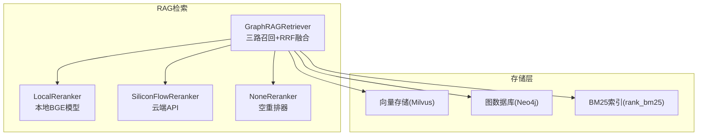
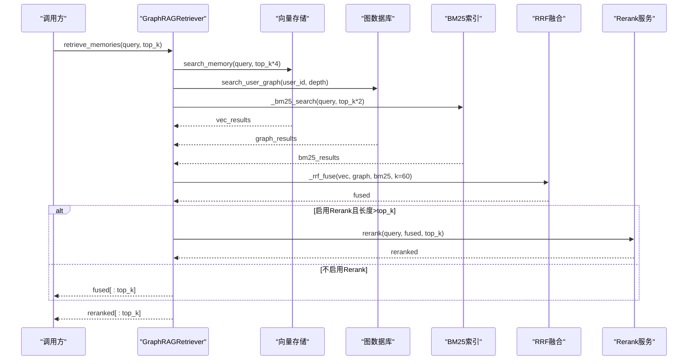
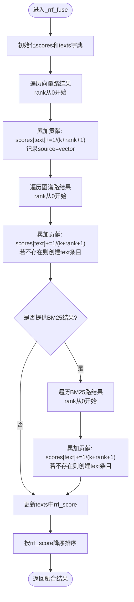
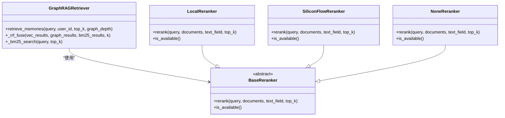

# RRF融合算法

<cite>
**本文引用的文件**   
- [retriever.py](file://backend_design/nexus/rag/retriever.py)
- [reranker_base.py](file://backend_design/nexus/rag/reranker_base.py)
- [reranker_factory.py](file://backend_design/nexus/rag/reranker_factory.py)
- [reranker.py](file://backend_design/nexus/rag/reranker.py)
- [siliconflow_reranker.py](file://backend_design/nexus/rag/siliconflow_reranker.py)
- [Project_Review_and_Fix_Report.md](file://Project_Review_and_Fix_Report.md)
</cite>

## 目录
1. [简介](#简介)
2. [项目结构](#项目结构)
3. [核心组件](#核心组件)
4. [架构总览](#架构总览)
5. [详细组件分析](#详细组件分析)
6. [依赖关系分析](#依赖关系分析)
7. [性能考量](#性能考量)
8. [故障排查指南](#故障排查指南)
9. [结论](#结论)
10. [附录](#附录)

## 简介
本技术文档聚焦于项目中实现的RRF（Reciprocal Rank Fusion，倒数秩融合）算法。该算法用于将来自不同检索源的结果进行无监督融合排序，公式为：
score(d) = Σ(1/(k + rank_i(d)))
其中：
- d 表示候选文档
- k 为平滑常数，控制排名衰减速度
- rank_i(d) 表示文档 d 在第 i 个检索源中的排名（从1开始）

本项目采用三路召回（向量、图谱、BM25），并通过RRF进行融合，随后可选地调用重排器（Rerank）对Top-N结果做二次精排。

## 项目结构
与RRF相关的代码主要位于后端RAG模块中，关键文件如下：
- retriever.py：实现GraphRAGRetriever，包含三路召回与RRF融合逻辑
- reranker_base.py：定义重排抽象接口
- reranker_factory.py：根据配置选择本地或云端重排器
- reranker.py：本地BGE CrossEncoder重排实现
- siliconflow_reranker.py：硅基流动云端重排实现

图表来源
- [retriever.py:38-78](file://backend_design/nexus/rag/retriever.py#L38-L78)
- [reranker_factory.py:47-65](file://backend_design/nexus/rag/reranker_factory.py#L47-L65)
- [reranker.py:34-78](file://backend_design/nexus/rag/reranker.py#L34-L78)
- [siliconflow_reranker.py:31-47](file://backend_design/nexus/rag/siliconflow_reranker.py#L31-L47)

章节来源
- [retriever.py:1-252](file://backend_design/nexus/rag/retriever.py#L1-L252)
- [reranker_factory.py:1-65](file://backend_design/nexus/rag/reranker_factory.py#L1-L65)

## 核心组件
- GraphRAGRetriever：负责三路召回与RRF融合，并在必要时调用Rerank进行二次排序
- BaseReranker：统一的重排接口，要求输出每项新增rerank_score字段
- LocalReranker：基于本地BGE CrossEncoder的跨编码器重排
- SiliconFlowReranker：基于硅基流动API的云端重排
- NoneReranker：跳过重排，直接返回前top_k条

章节来源
- [retriever.py:38-78](file://backend_design/nexus/rag/retriever.py#L38-L78)
- [reranker_base.py:17-50](file://backend_design/nexus/rag/reranker_base.py#L17-L50)
- [reranker.py:34-78](file://backend_design/nexus/rag/reranker.py#L34-L78)
- [siliconflow_reranker.py:31-47](file://backend_design/nexus/rag/siliconflow_reranker.py#L31-L47)
- [reranker_factory.py:27-45](file://backend_design/nexus/rag/reranker_factory.py#L27-L45)

## 架构总览
下图展示了检索流程：三路召回 → RRF融合 → 可选Rerank重排 → Top-K输出。

图表来源
- [retriever.py:141-178](file://backend_design/nexus/rag/retriever.py#L141-L178)
- [reranker_factory.py:47-65](file://backend_design/nexus/rag/reranker_factory.py#L47-L65)

## 详细组件分析

### RRF融合算法实现与数学原理
- 公式：score(d) = Σ(1/(k + rank_i(d)))
- 参数k的作用：
  - k越大，排名衰减越慢，低排名项贡献更显著；k越小，高排名项权重更大
  - 默认k=60，适合在召回规模较大时保持稳定性
- 不同rank阈值的处理：
  - 仅对出现在各路Top列表中的文档计算贡献
  - 未出现的文档在该路的贡献为0
- 多源结果的处理：
  - 向量路、图谱路、BM25路分别按各自顺序计算贡献并累加
  - 文本作为唯一键去重，最终按rrf_score降序排列
- 分数归一化与权重分配：
  - 当前实现为等权融合（三路权重均为1）
  - 可通过加权RRF扩展：score(d) = Σ w_i * (1/(k + rank_i(d)))

图表来源
- [retriever.py:192-245](file://backend_design/nexus/rag/retriever.py#L192-L245)

章节来源
- [retriever.py:192-245](file://backend_design/nexus/rag/retriever.py#L192-L245)

### 参数k调优策略
- 经验范围：k∈[20, 120]
- 小k（如20-40）：强调头部排名，适合召回质量较高、噪声较少的场景
- 大k（如60-120）：更均衡地利用尾部信息，适合召回分散、互补性强的多源场景
- 调参方法：
  - 固定数据集，网格搜索k值，评估NDCG@K或MRR@K
  - 结合业务指标（点击率、转化率）进行A/B测试
  - 针对特定查询分布进行分层调参

章节来源
- [retriever.py:197-201](file://backend_design/nexus/rag/retriever.py#L197-L201)

### 不同rank阈值的处理逻辑
- 各路由独立维护Top列表，超出阈值的文档不参与该路打分
- 通过文本字段作为唯一标识进行跨路去重
- 若某文档在多路出现，其贡献为各路贡献之和

章节来源
- [retriever.py:216-238](file://backend_design/nexus/rag/retriever.py#L216-L238)

### 多源结果的分数归一化与权重分配
- 当前实现：等权融合（w_vector=w_graph=w_bm25=1）
- 可扩展方案：加权RRF
  - 依据业务重要性调整权重，例如向量路权重更高
  - 动态权重：根据查询类型或用户偏好调整
- 注意：权重需与k协同调优，避免某一源主导融合结果

章节来源
- [Project_Review_and_Fix_Report.md:162-175](file://Project_Review_and_Fix_Report.md#L162-L175)

### RRF融合效果评估方法与实验设计指南
- 评估指标：
  - NDCG@K：衡量排序质量，考虑位置衰减
  - MRR@K：关注首个相关文档的位置
  - Recall@K：衡量相关文档被召回的比例
- 实验设计：
  - 构建带标注的查询-相关文档对数据集
  - 对比基线：单路召回、两路融合、三路融合
  - 消融实验：改变k值、引入权重、关闭BM25或图谱路
  - 线上A/B测试：观察用户行为指标变化
- 数据划分：训练集（调参）、验证集（模型选择）、测试集（最终评估）

章节来源
- [Project_Review_and_Fix_Report.md:162-175](file://Project_Review_and_Fix_Report.md#L162-L175)

### 具体代码实现示例与路径
- RRF融合主函数：_rrf_fuse
  - 路径：[retriever.py:192-245](file://backend_design/nexus/rag/retriever.py#L192-L245)
- 三路召回入口：retrieve_memories
  - 路径：[retriever.py:141-178](file://backend_design/nexus/rag/retriever.py#L141-L178)
- BM25检索辅助函数：_bm25_search
  - 路径：[retriever.py:119-139](file://backend_design/nexus/rag/retriever.py#L119-L139)

章节来源
- [retriever.py:119-178](file://backend_design/nexus/rag/retriever.py#L119-L178)
- [retriever.py:192-245](file://backend_design/nexus/rag/retriever.py#L192-L245)

### 性能优化技巧
- 减少召回规模：适当降低各路的top_k倍数，平衡召回质量与延迟
- 增量更新：BM25索引按需重建，避免全量重建开销
- 并行化：三路召回可并发执行，缩短整体延迟
- 缓存：对高频查询的RRF结果进行缓存
- 降级策略：当Rerank不可用时，直接返回RRF融合结果

章节来源
- [retriever.py:85-101](file://backend_design/nexus/rag/retriever.py#L85-L101)
- [reranker.py:100-102](file://backend_design/nexus/rag/reranker.py#L100-L102)
- [siliconflow_reranker.py:105-107](file://backend_design/nexus/rag/siliconflow_reranker.py#L105-L107)

## 依赖关系分析
RRF融合与重排服务的依赖关系如下：

图表来源
- [retriever.py:38-78](file://backend_design/nexus/rag/retriever.py#L38-L78)
- [reranker_base.py:17-50](file://backend_design/nexus/rag/reranker_base.py#L17-L50)
- [reranker.py:34-78](file://backend_design/nexus/rag/reranker.py#L34-L78)
- [siliconflow_reranker.py:31-47](file://backend_design/nexus/rag/siliconflow_reranker.py#L31-L47)
- [reranker_factory.py:27-45](file://backend_design/nexus/rag/reranker_factory.py#L27-L45)

章节来源
- [retriever.py:38-78](file://backend_design/nexus/rag/retriever.py#L38-L78)
- [reranker_base.py:17-50](file://backend_design/nexus/rag/reranker_base.py#L17-L50)
- [reranker_factory.py:47-65](file://backend_design/nexus/rag/reranker_factory.py#L47-L65)

## 性能考量
- RRF时间复杂度：O(N)，N为所有路召回结果的并集大小
- 空间复杂度：O(U)，U为唯一文档数量
- 瓶颈点：
  - 三路召回的I/O延迟
  - Rerank模型的推理延迟（本地约200ms/20条）
- 优化建议：
  - 限制召回规模，如向量路top_k*4、BM25路top_k*2
  - 使用异步并发提升吞吐
  - 对Rerank进行批处理或流式处理

章节来源
- [reranker.py:34-78](file://backend_design/nexus/rag/reranker.py#L34-L78)
- [retriever.py:161-178](file://backend_design/nexus/rag/retriever.py#L161-L178)

## 故障排查指南
- Rerank不可用时的降级：
  - 本地模型缺失或导入失败时，直接返回原始顺序的前top_k条
  - 云端API异常时，同样回退到原顺序
- 日志定位：
  - 检查Rerank加载错误日志
  - 查看BM25初始化失败的警告
- 常见问题：
  - 模型路径不正确导致加载失败
  - 网络超时或认证失败导致云端Rerank异常
  - BM25依赖未安装导致功能禁用

章节来源
- [reranker.py:59-77](file://backend_design/nexus/rag/reranker.py#L59-L77)
- [reranker.py:137-139](file://backend_design/nexus/rag/reranker.py#L137-L139)
- [siliconflow_reranker.py:105-107](file://backend_design/nexus/rag/siliconflow_reranker.py#L105-L107)
- [retriever.py:96-101](file://backend_design/nexus/rag/retriever.py#L96-L101)

## 结论
RRF融合算法在本项目中实现了三路召回的无监督融合，具有实现简单、鲁棒性强、易于扩展的优点。通过合理设置参数k和引入加权机制，可进一步提升融合效果。结合Rerank重排，可在保证效率的同时提升排序精度。建议在后续版本中开展系统化的评估实验，持续优化参数与策略。

## 附录
- 加权RRF扩展思路：
  - score(d) = Σ w_i * (1/(k + rank_i(d)))
  - 权重w_i可根据业务需求动态调整
- 在线监控指标：
  - 融合耗时、Rerank耗时、Top-K命中率
  - 各路由贡献分布统计