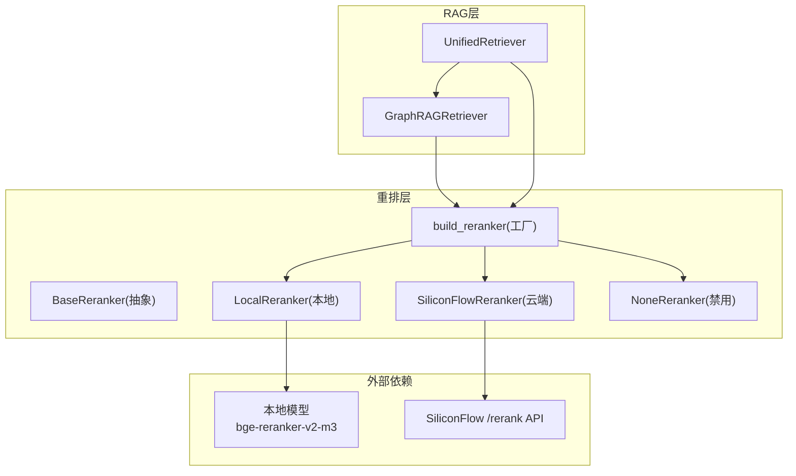
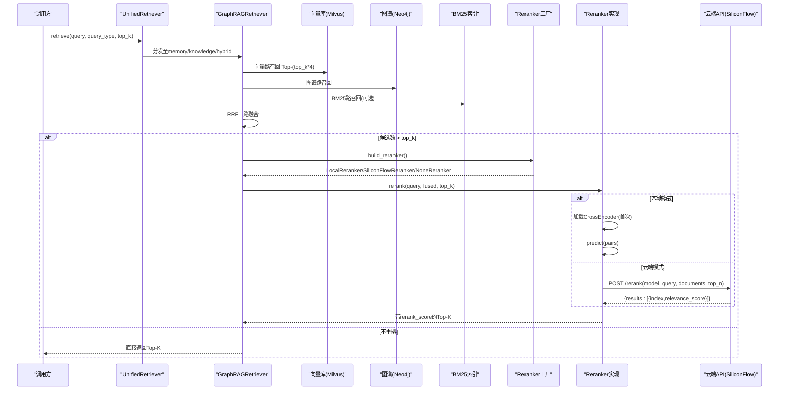
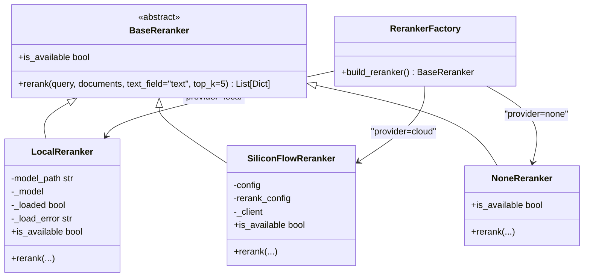
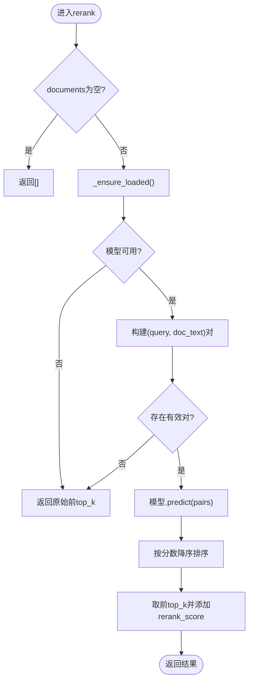
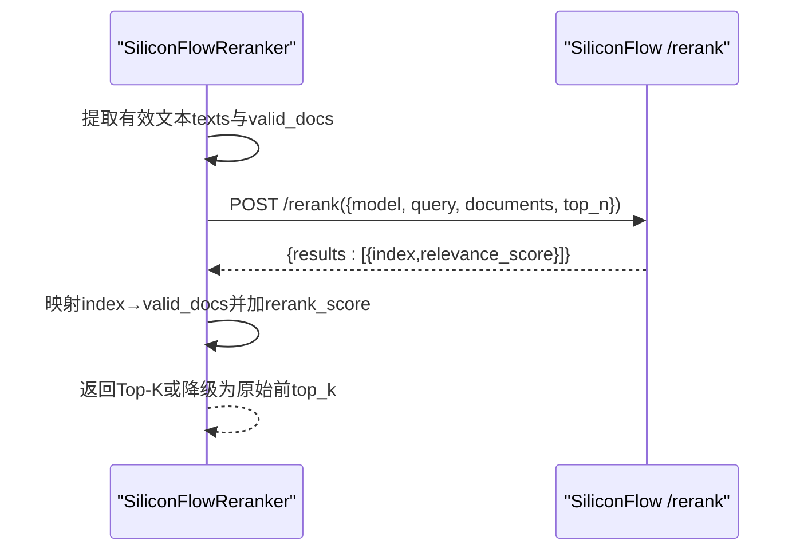
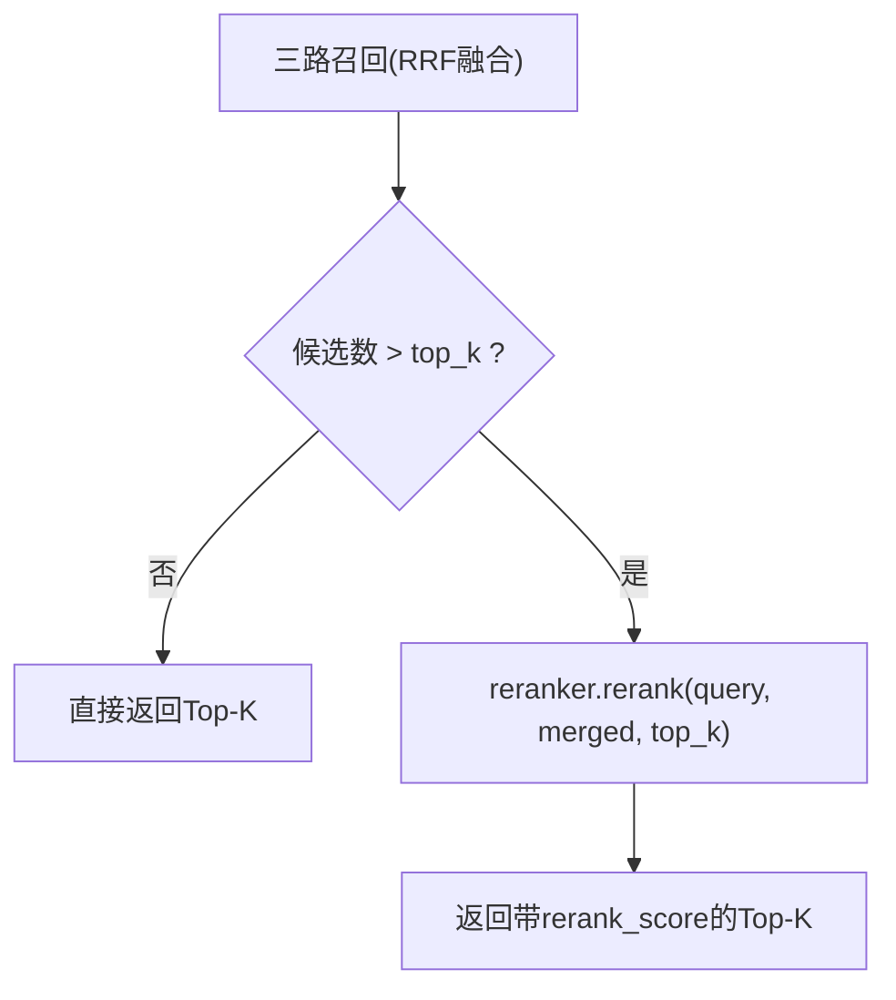
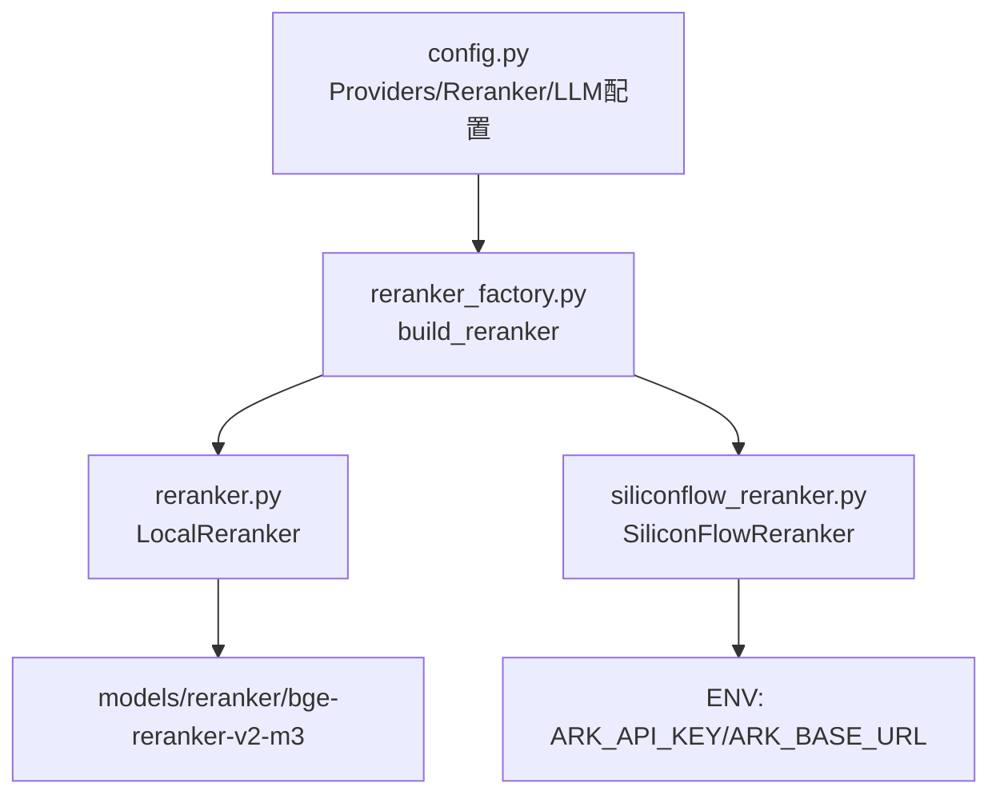

# Rerank重排系统

<cite>
**本文引用的文件**
- [reranker.py](file://backend_design/nexus/rag/reranker.py)
- [reranker_base.py](file://backend_design/nexus/rag/reranker_base.py)
- [reranker_factory.py](file://backend_design/nexus/rag/reranker_factory.py)
- [siliconflow_reranker.py](file://backend_design/nexus/rag/siliconflow_reranker.py)
- [unified_retriever.py](file://backend_design/nexus/rag/unified_retriever.py)
- [retriever.py](file://backend_design/nexus/rag/retriever.py)
- [config.py](file://backend_design/nexus/config.py)
- [README.md](file://models/reranker/bge-reranker-v2-m3/README.md)
- [config.json](file://models/reranker/bge-reranker-v2-m3/config.json)
</cite>

## 目录
1. [简介](#简介)
2. [项目结构](#项目结构)
3. [核心组件](#核心组件)
4. [架构总览](#架构总览)
5. [详细组件分析](#详细组件分析)
6. [依赖关系分析](#依赖关系分析)
7. [性能与优化](#性能与优化)
8. [评估与A/B测试](#评估与a-b测试)
9. [故障排查](#故障排查)
10. [结论](#结论)
11. [附录：微调与自定义开发规范](#附录微调与自定义开发规范)

## 简介
本技术文档聚焦于Rerank重排子系统，围绕BAAI/bge-reranker-v2-m3模型在本地与云端两种部署方式下的工作原理、输入输出格式、构建query-document对的方法、SiliconFlow云服务的集成方式、效果评估指标与A/B测试方法，以及微调指南和自定义重排器开发规范进行系统化说明。该子系统作为检索后处理的关键环节，将Top-N候选结果按相关性二次排序，显著提升最终召回质量。

## 项目结构
Rerank相关代码位于后端RAG模块中，采用“抽象基类 + 工厂选择 + 多实现”的解耦设计：
- 抽象接口：定义统一的rerank()与is_available()契约
- 本地实现：基于sentence-transformers CrossEncoder加载bge-reranker-v2-m3
- 云端实现：通过httpx调用硅基流动Rerank API（复用LLM配置）
- 工厂：根据环境变量RERANKER_PROVIDER动态选择local/cloud/none
- 集成点：GraphRAGRetriever与UnifiedRetriever在混合检索后调用rerank

图表来源
- [unified_retriever.py:47-56](file://backend_design/nexus/rag/unified_retriever.py#L47-L56)
- [retriever.py:57-74](file://backend_design/nexus/rag/retriever.py#L57-L74)
- [reranker_factory.py:47-65](file://backend_design/nexus/rag/reranker_factory.py#L47-L65)
- [reranker.py:34-50](file://backend_design/nexus/rag/reranker.py#L34-L50)
- [siliconflow_reranker.py:31-47](file://backend_design/nexus/rag/siliconflow_reranker.py#L31-L47)

章节来源
- [unified_retriever.py:1-155](file://backend_design/nexus/rag/unified_retriever.py#L1-L155)
- [retriever.py:1-252](file://backend_design/nexus/rag/retriever.py#L1-L252)
- [reranker_factory.py:1-65](file://backend_design/nexus/rag/reranker_factory.py#L1-L65)

## 核心组件
- BaseReranker：统一抽象接口，规定rerank(query, documents, text_field, top_k)与is_available()
- LocalReranker：本地CrossEncoder实现，延迟加载bge-reranker-v2-m3，批量推理并返回带rerank_score的结果
- SiliconFlowReranker：云端实现，复用ARK_API_KEY/ARK_BASE_URL，POST到/rerank，映射index→原doc并加rerank_score
- NoneReranker：空实现，直接返回前top_k条，用于跳过重排以节省成本
- build_reranker：根据providers.reranker取值(local/cloud/none)创建对应实例
- GraphRAGRetriever与UnifiedRetriever：在RRF融合或混合检索后，当候选数大于top_k时触发rerank

章节来源
- [reranker_base.py:17-49](file://backend_design/nexus/rag/reranker_base.py#L17-L49)
- [reranker.py:34-150](file://backend_design/nexus/rag/reranker.py#L34-L150)
- [siliconflow_reranker.py:31-111](file://backend_design/nexus/rag/siliconflow_reranker.py#L31-L111)
- [reranker_factory.py:27-65](file://backend_design/nexus/rag/reranker_factory.py#L27-L65)
- [retriever.py:170-178](file://backend_design/nexus/rag/retriever.py#L170-L178)
- [unified_retriever.py:150-154](file://backend_design/nexus/rag/unified_retriever.py#L150-L154)

## 架构总览
下图展示从查询进入统一检索到重排输出的完整流程，包括三路召回、RRF融合、Rerank重排与降级策略。

图表来源
- [unified_retriever.py:63-91](file://backend_design/nexus/rag/unified_retriever.py#L63-L91)
- [retriever.py:141-178](file://backend_design/nexus/rag/retriever.py#L141-L178)
- [reranker_factory.py:47-65](file://backend_design/nexus/rag/reranker_factory.py#L47-L65)
- [reranker.py:79-139](file://backend_design/nexus/rag/reranker.py#L79-L139)
- [siliconflow_reranker.py:49-107](file://backend_design/nexus/rag/siliconflow_reranker.py#L49-L107)

## 详细组件分析

### 抽象接口与工厂
- BaseReranker定义rerank与is_available两个抽象方法，保证不同实现的统一契约
- build_reranker读取providers.reranker值：
  - none：返回NoneReranker，直接切片返回前top_k
  - cloud：返回SiliconFlowReranker，复用LLM配置的ark_api_key与ark_base_url
  - local（默认）：返回LocalReranker，加载本地模型

图表来源
- [reranker_base.py:17-49](file://backend_design/nexus/rag/reranker_base.py#L17-L49)
- [reranker.py:34-150](file://backend_design/nexus/rag/reranker.py#L34-L150)
- [siliconflow_reranker.py:31-111](file://backend_design/nexus/rag/siliconflow_reranker.py#L31-L111)
- [reranker_factory.py:27-65](file://backend_design/nexus/rag/reranker_factory.py#L27-L65)

章节来源
- [reranker_base.py:1-50](file://backend_design/nexus/rag/reranker_base.py#L1-L50)
- [reranker_factory.py:1-65](file://backend_design/nexus/rag/reranker_factory.py#L1-L65)

### 本地重排器（LocalReranker）
- 模型路径：默认指向./models/reranker/bge-reranker-v2-m3
- 延迟加载：首次调用时通过CrossEncoder加载模型；若路径不存在或缺少依赖则记录错误并不可用
- 输入构造：遍历documents，优先取text字段，其次content，最后str(doc)，过滤空文本
- 批量推理：pairs为[(query, doc_text), ...]，predict返回分数列表
- 排序与截断：按分数降序，取前top_k，并为每条结果新增rerank_score字段（保留6位小数）
- 异常降级：任何异常均回退为原始顺序的前top_k条

图表来源
- [reranker.py:79-139](file://backend_design/nexus/rag/reranker.py#L79-L139)

章节来源
- [reranker.py:1-151](file://backend_design/nexus/rag/reranker.py#L1-L151)

### 云端重排器（SiliconFlowReranker）
- 配置来源：复用LLMConfig中的ark_api_key与ark_base_url，以及RerankerConfig.model
- HTTP客户端：使用httpx.AsyncClient同步调用（rerank在检索链路中为阻塞步骤）
- 请求体：包含model、query、documents、top_n、return_documents=false
- 响应解析：results为[{index, relevance_score}, ...]，映射回valid_docs并添加rerank_score
- 异常降级：网络或解析异常时回退为原始顺序的前top_k条

图表来源
- [siliconflow_reranker.py:49-107](file://backend_design/nexus/rag/siliconflow_reranker.py#L49-L107)

章节来源
- [siliconflow_reranker.py:1-112](file://backend_design/nexus/rag/siliconflow_reranker.py#L1-L112)

### 集成点：检索与重排
- GraphRAGRetriever.retrieve_memories：三路召回+RRF融合后，若候选数>top_k则调用reranker.rerank
- UnifiedRetriever._retrieve_hybrid：并行检索记忆与知识库，合并后同样在超过top_k时触发rerank

图表来源
- [retriever.py:170-178](file://backend_design/nexus/rag/retriever.py#L170-L178)
- [unified_retriever.py:150-154](file://backend_design/nexus/rag/unified_retriever.py#L150-L154)

章节来源
- [retriever.py:141-178](file://backend_design/nexus/rag/retriever.py#L141-L178)
- [unified_retriever.py:126-154](file://backend_design/nexus/rag/unified_retriever.py#L126-L154)

## 依赖关系分析
- 配置依赖：
  - ProvidersConfig.providers.reranker控制后端选择
  - LLMConfig.ark_api_key与ark_base_url为云端模式提供认证与地址
  - RerankerConfig.model指定云端模型ID
- 运行时依赖：
  - 本地模式需要sentence-transformers与本地模型文件
  - 云端模式需要httpx与有效的网络连通性

图表来源
- [config.py:458-503](file://backend_design/nexus/config.py#L458-L503)
- [reranker_factory.py:47-65](file://backend_design/nexus/rag/reranker_factory.py#L47-L65)
- [reranker.py:27-31](file://backend_design/nexus/rag/reranker.py#L27-L31)
- [siliconflow_reranker.py:37-47](file://backend_design/nexus/rag/siliconflow_reranker.py#L37-L47)

章节来源
- [config.py:458-503](file://backend_design/nexus/config.py#L458-L503)
- [reranker_factory.py:1-65](file://backend_design/nexus/rag/reranker_factory.py#L1-L65)

## 性能与优化
- 本地推理性能：
  - 首次加载约2秒，后续CPU推理约200ms/20条（参考源码注释）
  - 建议开启GPU加速（如环境支持），以降低延迟
- 批量推理：
  - 通过pairs批量预测减少开销，避免逐条调用
- 降级策略：
  - 模型不可用或异常时自动回退为原始顺序前top_k，保障可用性
- 云端模式：
  - 复用LLM的HTTP客户端与超时设置，注意网络抖动与限流
  - 可通过top_n限制请求长度，降低带宽与耗时

章节来源
- [reranker.py:8-15](file://backend_design/nexus/rag/reranker.py#L8-L15)
- [reranker.py:79-139](file://backend_design/nexus/rag/reranker.py#L79-L139)
- [siliconflow_reranker.py:49-107](file://backend_design/nexus/rag/siliconflow_reranker.py#L49-L107)

## 评估与A/B测试
- 评估指标建议：
  - 精度类：NDCG@K、Recall@K、Precision@K、MRR@K
  - 效率类：P95/P99延迟、吞吐(QPS)、失败率
  - 业务类：下游任务成功率、用户满意度
- 评估数据准备：
  - 标注集：(query, pos_docs, neg_docs)三元组或带相关性标签的数据
  - 离线评测：对固定测试集计算上述指标，对比baseline（无重排）
- A/B测试方法：
  - 流量切分：将线上流量按比例分配至“无重排/本地重排/云端重排”三组
  - 指标采集：埋点记录rerank_score分布、Top-1命中率、端到端延迟
  - 统计显著性：使用置信区间与假设检验判断差异是否显著
  - 回滚策略：关键指标下降时快速切换回baseline

章节来源
- [retriever.py:170-178](file://backend_design/nexus/rag/retriever.py#L170-L178)
- [unified_retriever.py:150-154](file://backend_design/nexus/rag/unified_retriever.py#L150-L154)

## 故障排查
- 本地模式常见问题：
  - 模型路径不存在：检查./models/reranker/bge-reranker-v2-m3是否完整
  - 依赖缺失：安装sentence-transformers
  - 异常日志：查看“Failed to load reranker model”与“Rerank failed”日志
- 云端模式常见问题：
  - 认证失败：确认ARK_API_KEY与ARK_BASE_URL正确
  - 网络异常：检查httpx超时与网络连通性
  - 响应解析：确保results中包含index与relevance_score字段
- 降级行为：
  - 任一异常都会回退为原始顺序前top_k，需结合日志定位根因

章节来源
- [reranker.py:59-77](file://backend_design/nexus/rag/reranker.py#L59-L77)
- [reranker.py:137-139](file://backend_design/nexus/rag/reranker.py#L137-L139)
- [siliconflow_reranker.py:105-107](file://backend_design/nexus/rag/siliconflow_reranker.py#L105-L107)

## 结论
Rerank重排系统通过抽象接口与工厂模式实现了本地与云端双后端无缝切换，并在检索链路中提供稳定的降级策略。bge-reranker-v2-m3在多语言场景下具备良好相关性建模能力，配合RRF融合可进一步提升整体检索质量。生产环境中建议结合A/B测试与监控指标持续优化，并根据业务需求选择合适的重排后端。

## 附录：微调与自定义开发规范

### bge-reranker-v2-m3微调指南
- 数据格式：每行一个JSON对象，包含query、pos（正样本）、neg（负样本）、prompt等字段
- 训练脚本：官方仓库提供指令式与分层式微调脚本，支持LoRA与DeepSpeed
- 数据集来源：官方README提及多语言数据集组合，可用于初始化或增量训练
- 注意事项：
  - 合理设置学习率、batch size与梯度累积步数
  - 使用fp16/bf16加速训练
  - 保存checkpoint并定期评估

章节来源
- [README.md:249-337](file://models/reranker/bge-reranker-v2-m3/README.md#L249-L337)

### 自定义重排器开发规范
- 继承BaseReranker并实现rerank与is_available
- 输入约定：
  - query: 字符串
  - documents: dict列表，至少包含text或content字段
  - text_field: 指定文本字段名，默认"text"
  - top_k: 返回前K条
- 输出约定：
  - 返回Top-K列表，每项新增rerank_score字段（浮点数，建议保留6位小数）
- 可用性检测：
  - is_available应不触发昂贵操作，仅检查资源或配置状态
- 异常处理：
  - 任何异常均应回退为原始顺序前top_k，保证服务稳定
- 工厂扩展：
  - 在build_reranker中添加新的provider分支，返回新实现实例

章节来源
- [reranker_base.py:17-49](file://backend_design/nexus/rag/reranker_base.py#L17-L49)
- [reranker_factory.py:47-65](file://backend_design/nexus/rag/reranker_factory.py#L47-L65)