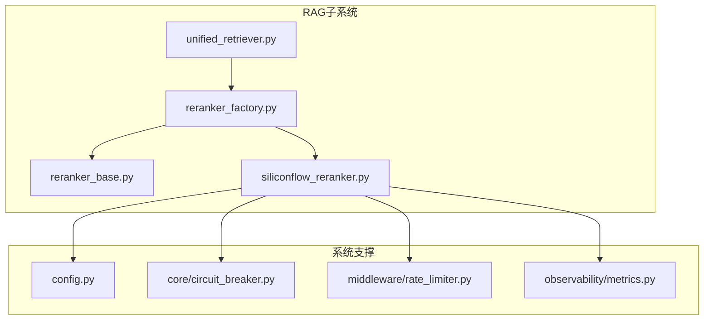
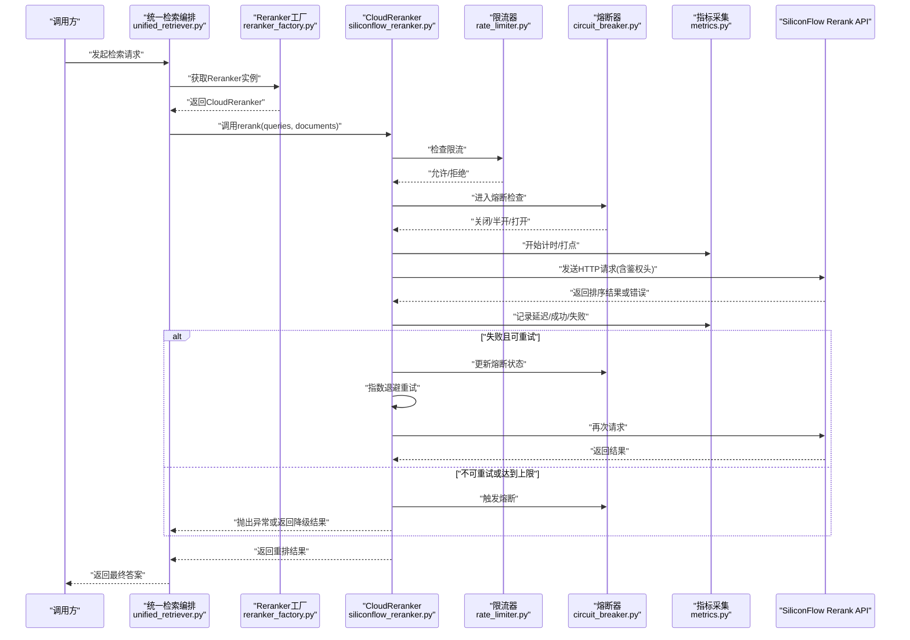
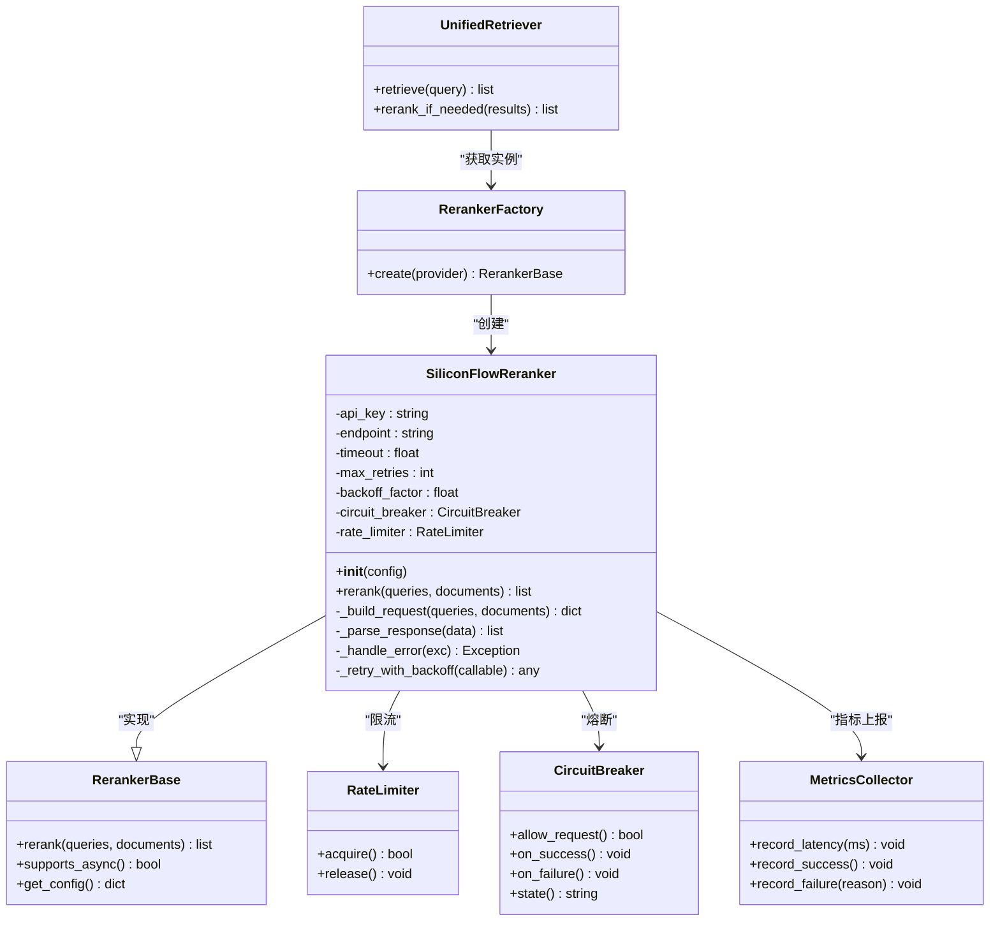
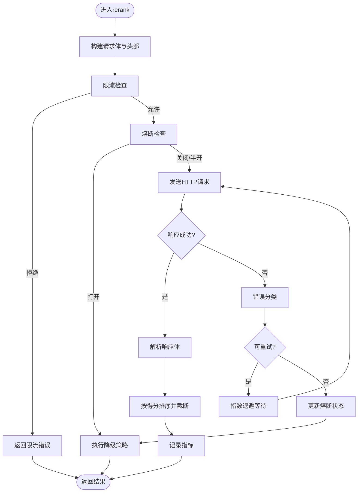
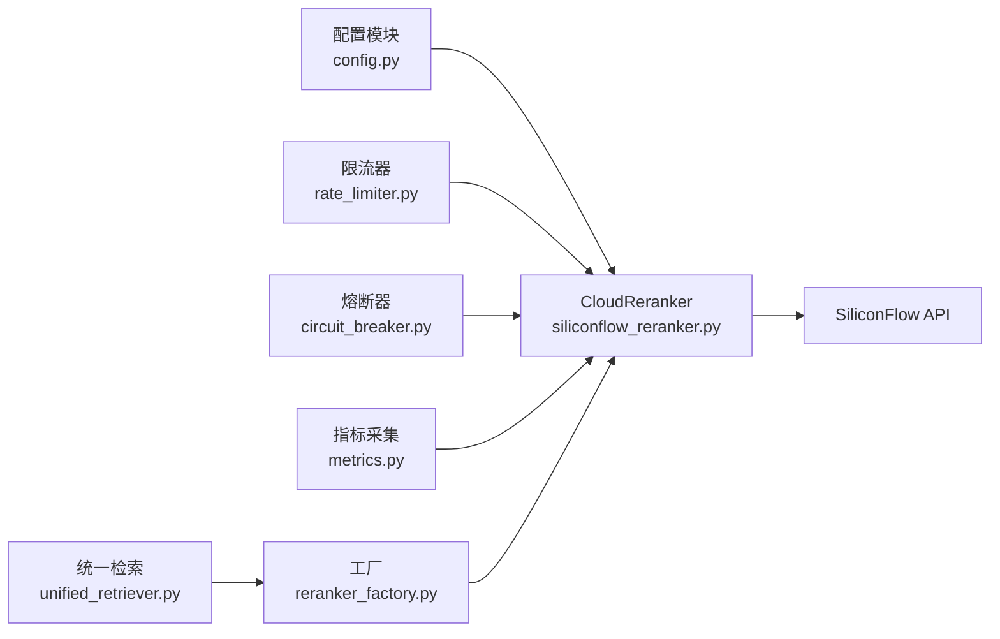

# 云服务Rerank

<cite>
**本文引用的文件**   
- [backend_design/nexus/rag/siliconflow_reranker.py](file://backend_design/nexus/rag/siliconflow_reranker.py)
- [backend_design/nexus/rag/reranker_base.py](file://backend_design/nexus/rag/reranker_base.py)
- [backend_design/nexus/rag/reranker_factory.py](file://backend_design/nexus/rag/reranker_factory.py)
- [backend_design/nexus/config.py](file://backend_design/nexus/config.py)
- [backend_design/nexus/core/circuit_breaker.py](file://backend_design/nexus/core/circuit_breaker.py)
- [backend_design/nexus/middleware/rate_limiter.py](file://backend_design/nexus/middleware/rate_limiter.py)
- [backend_design/nexus/observability/metrics.py](file://backend_design/nexus/observability/metrics.py)
- [backend_design/nexus/rag/unified_retriever.py](file://backend_design/nexus/rag/unified_retriever.py)
</cite>

## 目录
1. [简介](#简介)
2. [项目结构](#项目结构)
3. [核心组件](#核心组件)
4. [架构总览](#架构总览)
5. [详细组件分析](#详细组件分析)
6. [依赖关系分析](#依赖关系分析)
7. [性能考量](#性能考量)
8. [故障排查指南](#故障排查指南)
9. [结论](#结论)
10. [附录](#附录)

## 简介
本技术文档聚焦于SiliconFlow Rerank云服务的集成与使用，围绕CloudReranker（即SiliconFlow Reranker）的实现原理、认证配置、请求与响应处理、异步调用、重试与降级策略、限流与熔断、以及本地模型切换机制进行全面说明。同时提供监控指标建议、部署配置要点和性能对比分析，帮助读者在生产环境中稳定高效地使用该能力。

## 项目结构
本项目在RAG子系统中实现了多种Reranker后端抽象与工厂模式，其中SiliconFlow云端Reranker作为可插拔实现之一，通过统一接口被上层检索流程调用。关键文件包括：
- 云端Reranker实现：siliconflow_reranker.py
- Reranker基类与统一接口：reranker_base.py
- Reranker工厂：reranker_factory.py
- 全局配置加载：config.py
- 熔断器：core/circuit_breaker.py
- 限流中间件：middleware/rate_limiter.py
- 指标采集：observability/metrics.py
- 统一检索编排：unified_retriever.py

图表来源
- [backend_design/nexus/rag/siliconflow_reranker.py](file://backend_design/nexus/rag/siliconflow_reranker.py)
- [backend_design/nexus/rag/reranker_base.py](file://backend_design/nexus/rag/reranker_base.py)
- [backend_design/nexus/rag/reranker_factory.py](file://backend_design/nexus/rag/reranker_factory.py)
- [backend_design/nexus/config.py](file://backend_design/nexus/config.py)
- [backend_design/nexus/core/circuit_breaker.py](file://backend_design/nexus/core/circuit_breaker.py)
- [backend_design/nexus/middleware/rate_limiter.py](file://backend_design/nexus/middleware/rate_limiter.py)
- [backend_design/nexus/observability/metrics.py](file://backend_design/nexus/observability/metrics.py)
- [backend_design/nexus/rag/unified_retriever.py](file://backend_design/nexus/rag/unified_retriever.py)

章节来源
- [backend_design/nexus/rag/siliconflow_reranker.py](file://backend_design/nexus/rag/siliconflow_reranker.py)
- [backend_design/nexus/rag/reranker_base.py](file://backend_design/nexus/rag/reranker_base.py)
- [backend_design/nexus/rag/reranker_factory.py](file://backend_design/nexus/rag/reranker_factory.py)
- [backend_design/nexus/config.py](file://backend_design/nexus/config.py)
- [backend_design/nexus/core/circuit_breaker.py](file://backend_design/nexus/core/circuit_breaker.py)
- [backend_design/nexus/middleware/rate_limiter.py](file://backend_design/nexus/middleware/rate_limiter.py)
- [backend_design/nexus/observability/metrics.py](file://backend_design/nexus/observability/metrics.py)
- [backend_design/nexus/rag/unified_retriever.py](file://backend_design/nexus/rag/unified_retriever.py)

## 核心组件
- CloudReranker（SiliconFlow Reranker）
  - 职责：封装对SiliconFlow Rerank API的调用，负责鉴权、参数组装、网络请求、结果解析、错误处理、重试与熔断、指标上报等。
  - 关键点：支持异步调用；具备可配置的重试次数、超时时间、熔断阈值；遵循统一的Reranker接口以便与本地模型无缝切换。
- Reranker基类
  - 职责：定义Reranker的统一接口规范，约束输入输出格式，便于工厂创建不同实现。
- Reranker工厂
  - 职责：根据配置动态选择并实例化具体Reranker实现（如SiliconFlow或本地模型）。
- 配置模块
  - 职责：集中管理API密钥、端点地址、并发与限流参数、熔断开关等。
- 熔断器与限流
  - 职责：保护下游服务，避免雪崩；限制QPS，保障稳定性。
- 指标采集
  - 职责：记录延迟、成功率、失败原因、重试次数、熔断状态等关键指标。
- 统一检索编排
  - 职责：串联召回与重排阶段，按需启用Reranker，并在异常时执行降级策略。

章节来源
- [backend_design/nexus/rag/siliconflow_reranker.py](file://backend_design/nexus/rag/siliconflow_reranker.py)
- [backend_design/nexus/rag/reranker_base.py](file://backend_design/nexus/rag/reranker_base.py)
- [backend_design/nexus/rag/reranker_factory.py](file://backend_design/nexus/rag/reranker_factory.py)
- [backend_design/nexus/config.py](file://backend_design/nexus/config.py)
- [backend_design/nexus/core/circuit_breaker.py](file://backend_design/nexus/core/circuit_breaker.py)
- [backend_design/nexus/middleware/rate_limiter.py](file://backend_design/nexus/middleware/rate_limiter.py)
- [backend_design/nexus/observability/metrics.py](file://backend_design/nexus/observability/metrics.py)
- [backend_design/nexus/rag/unified_retriever.py](file://backend_design/nexus/rag/unified_retriever.py)

## 架构总览
下图展示了从统一检索入口到SiliconFlow Rerank云端的完整调用链路，包含限流、熔断、重试与指标上报等横切关注点。

图表来源
- [backend_design/nexus/rag/unified_retriever.py](file://backend_design/nexus/rag/unified_retriever.py)
- [backend_design/nexus/rag/reranker_factory.py](file://backend_design/nexus/rag/reranker_factory.py)
- [backend_design/nexus/rag/siliconflow_reranker.py](file://backend_design/nexus/rag/siliconflow_reranker.py)
- [backend_design/nexus/middleware/rate_limiter.py](file://backend_design/nexus/middleware/rate_limiter.py)
- [backend_design/nexus/core/circuit_breaker.py](file://backend_design/nexus/core/circuit_breaker.py)
- [backend_design/nexus/observability/metrics.py](file://backend_design/nexus/observability/metrics.py)

## 详细组件分析

### CloudReranker（SiliconFlow Reranker）实现原理
- 认证配置
  - 通过配置模块加载API密钥与端点信息，以标准鉴权头形式附加到每个请求。
  - 支持环境变量注入，便于多环境部署与密钥管理。
- 请求格式
  - 将查询与候选文档序列化为服务端要求的JSON结构，包含查询文本、文档列表、可选参数（如top_k、分数归一化等）。
  - 设置合理的Content-Type与Accept字段，确保兼容性与扩展性。
- 响应处理
  - 解析返回的排序结果，按得分降序排列，截断至top_k。
  - 对异常响应码与业务错误进行识别，转换为内部异常类型，便于上层统一处理。
- 异步请求处理
  - 采用异步HTTP客户端发起请求，避免阻塞事件循环，提升吞吐。
  - 支持批量请求合并与连接复用，降低网络开销。
- 重试机制
  - 针对瞬时错误（如网络抖动、5xx）实施指数退避重试，最大重试次数与初始延迟可配置。
  - 幂等性判断：仅对安全方法（GET/POST无副作用）进行重试。
- 错误降级策略
  - 当熔断器处于“打开”状态或超过重试上限时，直接返回原始召回结果或空排序，保证主流程不中断。
  - 可配置是否开启“静默降级”，即在失败时记录日志但不抛错。

图表来源
- [backend_design/nexus/rag/reranker_base.py](file://backend_design/nexus/rag/reranker_base.py)
- [backend_design/nexus/rag/siliconflow_reranker.py](file://backend_design/nexus/rag/siliconflow_reranker.py)
- [backend_design/nexus/rag/reranker_factory.py](file://backend_design/nexus/rag/reranker_factory.py)
- [backend_design/nexus/observability/metrics.py](file://backend_design/nexus/observability/metrics.py)
- [backend_design/nexus/middleware/rate_limiter.py](file://backend_design/nexus/middleware/rate_limiter.py)
- [backend_design/nexus/core/circuit_breaker.py](file://backend_design/nexus/core/circuit_breaker.py)

章节来源
- [backend_design/nexus/rag/siliconflow_reranker.py](file://backend_design/nexus/rag/siliconflow_reranker.py)
- [backend_design/nexus/rag/reranker_base.py](file://backend_design/nexus/rag/reranker_base.py)
- [backend_design/nexus/rag/reranker_factory.py](file://backend_design/nexus/rag/reranker_factory.py)
- [backend_design/nexus/observability/metrics.py](file://backend_design/nexus/observability/metrics.py)
- [backend_design/nexus/middleware/rate_limiter.py](file://backend_design/nexus/middleware/rate_limiter.py)
- [backend_design/nexus/core/circuit_breaker.py](file://backend_design/nexus/core/circuit_breaker.py)

### 认证配置与端点设置
- API密钥
  - 通过配置模块读取，建议在环境变量中注入，避免硬编码。
  - 在请求头中携带标准鉴权字段，确保服务端校验通过。
- 端点配置
  - 指定SiliconFlow Rerank的HTTPS端点，支持生产与测试环境分离。
  - 可配置TLS证书路径与验证开关，适配企业内网代理场景。
- 超时与连接池
  - 设置连接建立、读写超时，防止长尾请求拖垮线程/协程。
  - 合理配置连接池大小，平衡并发与资源占用。

章节来源
- [backend_design/nexus/config.py](file://backend_design/nexus/config.py)
- [backend_design/nexus/rag/siliconflow_reranker.py](file://backend_design/nexus/rag/siliconflow_reranker.py)

### 请求与响应处理流程
- 请求构建
  - 将查询与候选文档序列化为结构化数据，包含必要字段与可选参数。
  - 添加鉴权头、追踪ID、租户上下文等元数据。
- 响应解析
  - 校验状态码与返回体结构，提取排序后的文档列表及得分。
  - 对缺失字段或异常值进行容错处理，必要时回退到默认策略。
- 错误分类
  - 区分网络错误、服务端错误、业务错误，分别采取重试、熔断或快速失败策略。

图表来源
- [backend_design/nexus/rag/siliconflow_reranker.py](file://backend_design/nexus/rag/siliconflow_reranker.py)
- [backend_design/nexus/middleware/rate_limiter.py](file://backend_design/nexus/middleware/rate_limiter.py)
- [backend_design/nexus/core/circuit_breaker.py](file://backend_design/nexus/core/circuit_breaker.py)
- [backend_design/nexus/observability/metrics.py](file://backend_design/nexus/observability/metrics.py)

章节来源
- [backend_design/nexus/rag/siliconflow_reranker.py](file://backend_design/nexus/rag/siliconflow_reranker.py)

### 异步请求处理与并发控制
- 异步客户端
  - 使用异步HTTP客户端，避免阻塞事件循环，提高整体吞吐。
  - 支持并发请求合并，减少重复计算与网络往返。
- 并发限制
  - 结合限流器与连接池大小，控制并发度，防止下游过载。
  - 为不同租户或路由设置独立限流策略，隔离热点流量。

章节来源
- [backend_design/nexus/rag/siliconflow_reranker.py](file://backend_design/nexus/rag/siliconflow_reranker.py)
- [backend_design/nexus/middleware/rate_limiter.py](file://backend_design/nexus/middleware/rate_limiter.py)

### 重试机制与指数退避
- 重试条件
  - 仅对瞬时错误进行重试，如网络超时、5xx错误。
  - 对幂等请求优先重试，非幂等请求谨慎处理。
- 退避策略
  - 采用指数退避加随机抖动，避免惊群效应。
  - 最大重试次数与初始延迟可配置，适应不同SLA要求。

章节来源
- [backend_design/nexus/rag/siliconflow_reranker.py](file://backend_design/nexus/rag/siliconflow_reranker.py)

### 错误降级与熔断策略
- 熔断器
  - 基于失败率与连续失败次数判定状态，自动切换关闭/半开/打开。
  - 在半开状态下试探性放行少量请求，评估恢复情况。
- 降级策略
  - 当熔断打开或重试耗尽时，返回原始召回结果或空排序，保证主流程可用。
  - 可配置是否记录告警与上报指标，便于运维观测。

章节来源
- [backend_design/nexus/core/circuit_breaker.py](file://backend_design/nexus/core/circuit_breaker.py)
- [backend_design/nexus/rag/siliconflow_reranker.py](file://backend_design/nexus/rag/siliconflow_reranker.py)

### 与本地模型的切换机制与Fallback
- 工厂模式
  - 通过Reranker工厂根据配置选择SiliconFlow或本地模型实现。
  - 支持运行时切换，无需修改上层调用逻辑。
- Fallback策略
  - 云端不可用时自动切换到本地模型，保持功能可用。
  - 可配置优先级与权重，实现灰度发布与A/B测试。

章节来源
- [backend_design/nexus/rag/reranker_factory.py](file://backend_design/nexus/rag/reranker_factory.py)
- [backend_design/nexus/rag/reranker_base.py](file://backend_design/nexus/rag/reranker_base.py)

### 监控指标与可观测性
- 指标项
  - 延迟分布（P50/P90/P99）、成功率、失败原因分布、重试次数、熔断状态。
  - 限流拒绝次数、并发度、连接池利用率。
- 上报方式
  - 通过指标采集模块统一上报，对接Prometheus/Grafana等监控系统。
  - 支持标签维度（租户、端点、错误码），便于多维分析。

章节来源
- [backend_design/nexus/observability/metrics.py](file://backend_design/nexus/observability/metrics.py)
- [backend_design/nexus/rag/siliconflow_reranker.py](file://backend_design/nexus/rag/siliconflow_reranker.py)

## 依赖关系分析
- 组件耦合
  - CloudReranker依赖配置、限流、熔断、指标模块，形成松耦合的可插拔架构。
  - 工厂模式屏蔽实现差异，上层仅需依赖统一接口。
- 外部依赖
  - SiliconFlow Rerank API为外部服务，需考虑网络不稳定与配额限制。
  - 监控系统（Prometheus/Grafana）用于可视化与告警。

图表来源
- [backend_design/nexus/config.py](file://backend_design/nexus/config.py)
- [backend_design/nexus/rag/siliconflow_reranker.py](file://backend_design/nexus/rag/siliconflow_reranker.py)
- [backend_design/nexus/middleware/rate_limiter.py](file://backend_design/nexus/middleware/rate_limiter.py)
- [backend_design/nexus/core/circuit_breaker.py](file://backend_design/nexus/core/circuit_breaker.py)
- [backend_design/nexus/observability/metrics.py](file://backend_design/nexus/observability/metrics.py)
- [backend_design/nexus/rag/reranker_factory.py](file://backend_design/nexus/rag/reranker_factory.py)
- [backend_design/nexus/rag/unified_retriever.py](file://backend_design/nexus/rag/unified_retriever.py)

章节来源
- [backend_design/nexus/rag/siliconflow_reranker.py](file://backend_design/nexus/rag/siliconflow_reranker.py)
- [backend_design/nexus/rag/reranker_factory.py](file://backend_design/nexus/rag/reranker_factory.py)
- [backend_design/nexus/config.py](file://backend_design/nexus/config.py)
- [backend_design/nexus/middleware/rate_limiter.py](file://backend_design/nexus/middleware/rate_limiter.py)
- [backend_design/nexus/core/circuit_breaker.py](file://backend_design/nexus/core/circuit_breaker.py)
- [backend_design/nexus/observability/metrics.py](file://backend_design/nexus/observability/metrics.py)
- [backend_design/nexus/rag/unified_retriever.py](file://backend_design/nexus/rag/unified_retriever.py)

## 性能考量
- 延迟
  - 云端Rerank引入额外RTT，需优化超时与重试策略，避免放大延迟。
  - 建议开启连接复用与请求合并，减少握手开销。
- 吞吐量
  - 合理设置并发度与连接池大小，平衡CPU与网络资源。
  - 结合限流器平滑突发流量，避免下游拥塞。
- 成本
  - 云端调用按量计费，需评估top_k与请求频率对成本的影响。
  - 通过缓存热门查询结果与降级策略降低无效调用。
- 对比本地模型
  - 本地模型零网络延迟但受限于硬件资源，适合低延迟高吞吐场景。
  - 云端模型通常精度更高，适合质量优先场景，需权衡成本与可用性。

[本节为通用指导，不涉及具体文件分析]

## 故障排查指南
- 常见问题
  - 鉴权失败：检查API密钥是否正确注入，端点是否可达。
  - 超时错误：调整超时参数与重试次数，观察网络状况。
  - 限流拒绝：降低并发或申请更高配额，检查限流配置。
  - 熔断打开：查看失败率与错误类型，确认下游健康状态。
- 定位步骤
  - 查看指标面板，关注延迟、成功率、失败原因分布。
  - 检查日志中的重试与熔断事件，定位根因。
  - 使用追踪ID关联上下游调用链，缩小问题范围。

章节来源
- [backend_design/nexus/observability/metrics.py](file://backend_design/nexus/observability/metrics.py)
- [backend_design/nexus/core/circuit_breaker.py](file://backend_design/nexus/core/circuit_breaker.py)
- [backend_design/nexus/middleware/rate_limiter.py](file://backend_design/nexus/middleware/rate_limiter.py)
- [backend_design/nexus/rag/siliconflow_reranker.py](file://backend_design/nexus/rag/siliconflow_reranker.py)

## 结论
SiliconFlow Rerank云服务通过统一的Reranker接口与工厂模式无缝集成，具备完善的异步调用、重试与熔断机制，能够在保证可用性的前提下提供高质量的重排结果。配合限流与指标采集，可在生产环境中实现稳定、可观测、可演进的Rerank能力。建议根据业务需求选择合适的切换与降级策略，持续优化性能与成本。

[本节为总结性内容，不涉及具体文件分析]

## 附录
- 配置清单
  - API密钥、端点地址、超时、最大重试次数、退避因子、熔断阈值、限流QPS、连接池大小等。
- 集成示例
  - 在统一检索编排中启用Reranker，传入查询与候选文档，获取排序结果。
  - 在工厂中配置provider为SiliconFlow，完成云端Reranker实例化。
- 监控看板
  - 推荐指标：延迟分位、成功率、失败原因、重试次数、熔断状态、限流拒绝数。
  - 告警规则：成功率低于阈值、P99延迟过高、熔断频繁打开。

[本节为补充信息，不涉及具体文件分析]