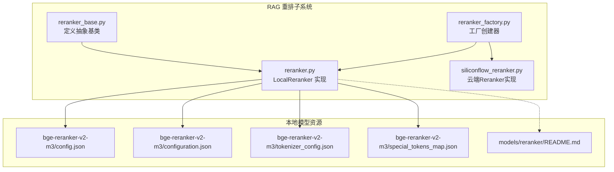
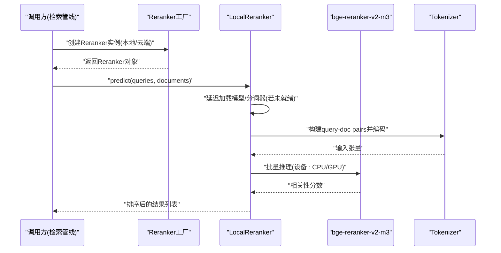
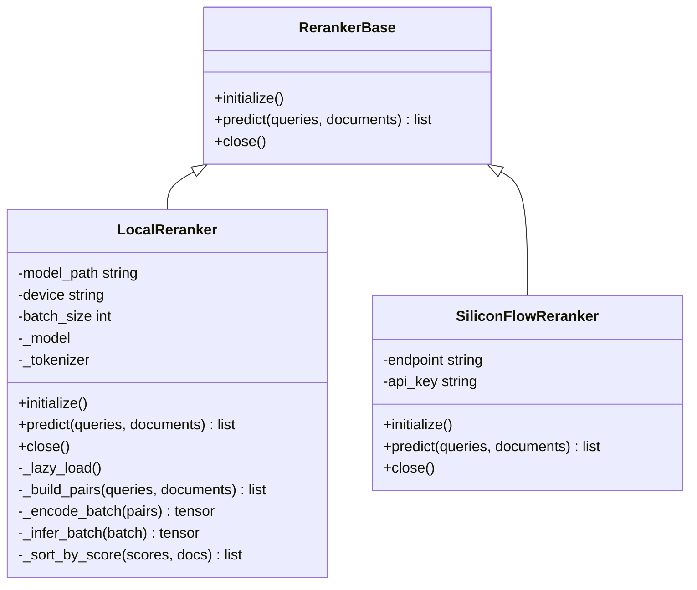
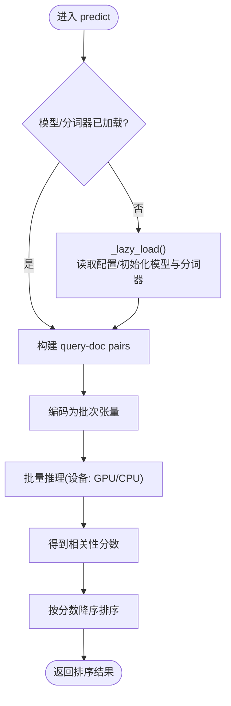
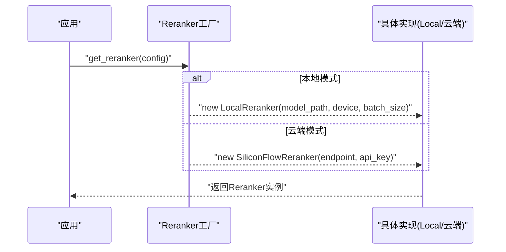
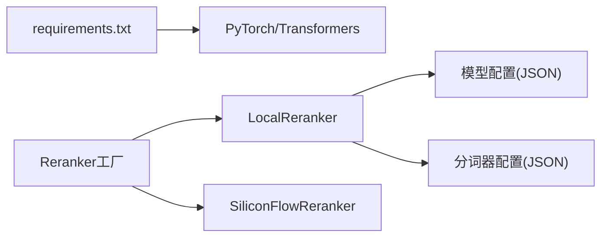
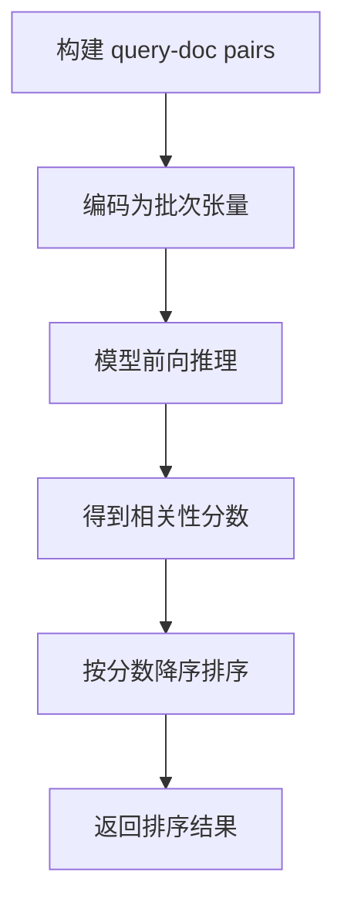

# 本地Rerank模型

<cite>
**本文引用的文件**   
- [reranker.py](file://backend_design/nexus/rag/reranker.py)
- [reranker_base.py](file://backend_design/nexus/rag/reranker_base.py)
- [reranker_factory.py](file://backend_design/nexus/rag/reranker_factory.py)
- [siliconflow_reranker.py](file://backend_design/nexus/rag/siliconflow_reranker.py)
- [config.json](file://models/reranker/bge-reranker-v2-m3/config.json)
- [configuration.json](file://models/reranker/bge-reranker-v2-m3/configuration.json)
- [tokenizer_config.json](file://models/reranker/bge-reranker-v2-m3/tokenizer_config.json)
- [special_tokens_map.json](file://models/reranker/bge-reranker-v2-m3/special_tokens_map.json)
- [README.md](file://models/reranker/README.md)
- [requirements.txt](file://backend_design/requirements.txt)
</cite>

## 目录
1. [简介](#简介)
2. [项目结构](#项目结构)
3. [核心组件](#核心组件)
4. [架构总览](#架构总览)
5. [详细组件分析](#详细组件分析)
6. [依赖关系分析](#依赖关系分析)
7. [性能考虑](#性能考虑)
8. [故障排查指南](#故障排查指南)
9. [结论](#结论)
10. [附录](#附录)

## 简介
本技术文档聚焦于本地重排（Rerank）能力，围绕 bge-reranker-v2-m3 模型的加载机制、延迟加载策略、GPU/CPU 推理优化展开，系统阐述 LocalReranker 类的实现原理与预测接口、错误处理机制，并提供部署指南、算法流程说明、性能调优建议以及完整的代码示例路径与故障排查方法。目标是帮助读者快速理解并稳定落地本地 Rerank 服务。

## 项目结构
与本主题相关的核心代码位于后端 RAG 模块的 reranker 子系统中，模型权重与配置存放于 models/reranker 目录。

图表来源
- [reranker_base.py](file://backend_design/nexus/rag/reranker_base.py)
- [reranker.py](file://backend_design/nexus/rag/reranker.py)
- [reranker_factory.py](file://backend_design/nexus/rag/reranker_factory.py)
- [siliconflow_reranker.py](file://backend_design/nexus/rag/siliconflow_reranker.py)
- [config.json](file://models/reranker/bge-reranker-v2-m3/config.json)
- [configuration.json](file://models/reranker/bge-reranker-v2-m3/configuration.json)
- [tokenizer_config.json](file://models/reranker/bge-reranker-v2-m3/tokenizer_config.json)
- [special_tokens_map.json](file://models/reranker/bge-reranker-v2-m3/special_tokens_map.json)
- [README.md](file://models/reranker/README.md)

章节来源
- [reranker_base.py](file://backend_design/nexus/rag/reranker_base.py)
- [reranker.py](file://backend_design/nexus/rag/reranker.py)
- [reranker_factory.py](file://backend_design/nexus/rag/reranker_factory.py)
- [siliconflow_reranker.py](file://backend_design/nexus/rag/siliconflow_reranker.py)
- [config.json](file://models/reranker/bge-reranker-v2-m3/config.json)
- [configuration.json](file://models/reranker/bge-reranker-v2-m3/configuration.json)
- [tokenizer_config.json](file://models/reranker/bge-reranker-v2-m3/tokenizer_config.json)
- [special_tokens_map.json](file://models/reranker/bge-reranker-v2-m3/special_tokens_map.json)
- [README.md](file://models/reranker/README.md)

## 核心组件
- 抽象基类：定义统一的 Rerank 接口契约，包括初始化、预测、关闭等生命周期方法，屏蔽不同实现的差异。
- 本地实现：基于 bge-reranker-v2-m3 的本地重排器，负责模型与分词器的延迟加载、设备选择（CPU/GPU）、批量推理与结果排序。
- 工厂类：根据配置或运行时参数创建具体 Reranker 实例（本地或云端），便于扩展新的实现。
- 云端实现：提供远程 Rerank 服务的适配层，用于降级或混合场景。

章节来源
- [reranker_base.py](file://backend_design/nexus/rag/reranker_base.py)
- [reranker.py](file://backend_design/nexus/rag/reranker.py)
- [reranker_factory.py](file://backend_design/nexus/rag/reranker_factory.py)
- [siliconflow_reranker.py](file://backend_design/nexus/rag/siliconflow_reranker.py)

## 架构总览
下图展示了 Rerank 子系统在整体系统中的位置与交互关系：上层检索管线调用工厂获取 Reranker 实例，随后构造 query-document 对进行批量推理，得到相关性分数并进行排序。

图表来源
- [reranker_factory.py](file://backend_design/nexus/rag/reranker_factory.py)
- [reranker.py](file://backend_design/nexus/rag/reranker.py)
- [config.json](file://models/reranker/bge-reranker-v2-m3/config.json)
- [tokenizer_config.json](file://models/reranker/bge-reranker-v2-m3/tokenizer_config.json)

## 详细组件分析

### LocalReranker 类分析
LocalReranker 是本地的重排实现，核心职责包括：
- 模型与分词器延迟加载：首次预测时按需加载，避免启动开销。
- 设备选择：优先使用 GPU，回退到 CPU；支持显存不足时的自动降级。
- 批量推理：将多个 query-document 对打包为批次，提升吞吐。
- 结果排序：依据模型输出的相关性分数进行降序排列。
- 错误处理：捕获 IO、内存、设备不可用等异常，给出明确提示与恢复策略。

图表来源
- [reranker_base.py](file://backend_design/nexus/rag/reranker_base.py)
- [reranker.py](file://backend_design/nexus/rag/reranker.py)
- [siliconflow_reranker.py](file://backend_design/nexus/rag/siliconflow_reranker.py)

#### 延迟加载与初始化流程
- 首次调用 predict 时触发 _lazy_load：检查模型与分词器是否已加载，若未加载则从模型路径读取配置并初始化。
- 设备选择逻辑：尝试将模型置于 GPU；若显存不足或设备不可用，自动回退至 CPU。
- 批大小与缓存：可配置 batch_size；对相同 query 的中间表示可进行短期缓存以减少重复计算。

图表来源
- [reranker.py](file://backend_design/nexus/rag/reranker.py)
- [config.json](file://models/reranker/bge-reranker-v2-m3/config.json)
- [tokenizer_config.json](file://models/reranker/bge-reranker-v2-m3/tokenizer_config.json)

章节来源
- [reranker.py](file://backend_design/nexus/rag/reranker.py)
- [config.json](file://models/reranker/bge-reranker-v2-m3/config.json)
- [tokenizer_config.json](file://models/reranker/bge-reranker-v2-m3/tokenizer_config.json)

### 工厂类与多实现切换
- 工厂根据传入的配置或环境变量决定创建 LocalReranker 还是 SiliconFlowReranker。
- 支持热插拔：新增实现只需继承基类并在工厂注册即可。

图表来源
- [reranker_factory.py](file://backend_design/nexus/rag/reranker_factory.py)
- [reranker.py](file://backend_design/nexus/rag/reranker.py)
- [siliconflow_reranker.py](file://backend_design/nexus/rag/siliconflow_reranker.py)

章节来源
- [reranker_factory.py](file://backend_design/nexus/rag/reranker_factory.py)
- [reranker.py](file://backend_design/nexus/rag/reranker.py)
- [siliconflow_reranker.py](file://backend_design/nexus/rag/siliconflow_reranker.py)

### 模型资源与配置
- config.json：包含模型元数据与关键配置项（如任务类型、最大长度等）。
- configuration.json：框架级配置，描述模型结构与加载参数。
- tokenizer_config.json：分词器配置，控制 tokenization 行为。
- special_tokens_map.json：特殊 token 映射，确保编码一致性。
- README.md：模型使用说明与注意事项。

章节来源
- [config.json](file://models/reranker/bge-reranker-v2-m3/config.json)
- [configuration.json](file://models/reranker/bge-reranker-v2-m3/configuration.json)
- [tokenizer_config.json](file://models/reranker/bge-reranker-v2-m3/tokenizer_config.json)
- [special_tokens_map.json](file://models/reranker/bge-reranker-v2-m3/special_tokens_map.json)
- [README.md](file://models/reranker/README.md)

## 依赖关系分析
- 外部依赖：Python 包管理通过 requirements.txt 声明；本地 Rerank 通常依赖 PyTorch/HF Transformers 等库。
- 内部依赖：LocalReranker 依赖模型与分词器配置文件；工厂类依赖各实现的具体初始化参数。

图表来源
- [requirements.txt](file://backend_design/requirements.txt)
- [reranker.py](file://backend_design/nexus/rag/reranker.py)
- [reranker_factory.py](file://backend_design/nexus/rag/reranker_factory.py)
- [config.json](file://models/reranker/bge-reranker-v2-m3/config.json)
- [tokenizer_config.json](file://models/reranker/bge-reranker-v2-m3/tokenizer_config.json)

章节来源
- [requirements.txt](file://backend_design/requirements.txt)
- [reranker.py](file://backend_design/nexus/rag/reranker.py)
- [reranker_factory.py](file://backend_design/nexus/rag/reranker_factory.py)
- [config.json](file://models/reranker/bge-reranker-v2-m3/config.json)
- [tokenizer_config.json](file://models/reranker/bge-reranker-v2-m3/tokenizer_config.json)

## 性能考虑
- 批处理大小调优：增大 batch_size 可提升吞吐，但需平衡显存占用；建议在目标设备上做压测找到最佳值。
- 设备选择与显存管理：优先 GPU；显存不足时自动回退 CPU；必要时启用梯度关闭与半精度推理以降低内存。
- 延迟加载：仅在首次预测时加载模型，减少冷启动时间。
- 缓存策略：对重复 query 的编码结果进行短期缓存，避免重复计算。
- I/O 优化：模型与分词器文件尽量放置在高速存储上，减少磁盘 I/O 瓶颈。

[本节为通用性能指导，不直接分析具体文件]

## 故障排查指南
- 模型路径错误：确认模型目录存在且包含必要的 JSON 配置文件；检查路径拼写与权限。
- 设备不可用：当 GPU 不可用或显存不足时，应自动回退 CPU；若仍失败，检查驱动与环境变量。
- 分词器不匹配：确保 tokenizer_config.json 与模型版本一致，避免特殊 token 缺失导致编码异常。
- 批处理溢出：降低 batch_size 或增加显存；监控 OOM 日志定位问题。
- 网络与云端降级：若使用云端实现，检查 endpoint 与鉴权；本地失败时可切换到云端作为降级方案。

章节来源
- [reranker.py](file://backend_design/nexus/rag/reranker.py)
- [siliconflow_reranker.py](file://backend_design/nexus/rag/siliconflow_reranker.py)
- [README.md](file://models/reranker/README.md)

## 结论
LocalReranker 以延迟加载、设备自适应与批处理为核心，结合清晰的工厂模式与统一接口，提供了稳定高效的本地重排能力。配合合理的部署与性能调优，可在资源受限环境下获得良好的召回质量与响应速度。

[本节为总结性内容，不直接分析具体文件]

## 附录

### 部署指南
- 环境准备
  - 安装 Python 依赖：参考 requirements.txt 中的包清单。
  - 准备 GPU 驱动与 CUDA 环境（可选）：如需 GPU 加速，请确保驱动与 CUDA 版本兼容。
- 模型下载与放置
  - 将 bge-reranker-v2-m3 模型文件放置于 models/reranker/bge-reranker-v2-m3 目录下，确保包含 config.json、configuration.json、tokenizer_config.json、special_tokens_map.json 等必要文件。
- 路径配置
  - 在创建 LocalReranker 时指定 model_path 指向上述目录；或通过工厂配置传入。
- 运行验证
  - 使用最小化调用流程：创建实例 -> 构造 queries 与 documents -> 调用 predict -> 观察返回的排序结果。

章节来源
- [requirements.txt](file://backend_design/requirements.txt)
- [config.json](file://models/reranker/bge-reranker-v2-m3/config.json)
- [configuration.json](file://models/reranker/bge-reranker-v2-m3/configuration.json)
- [tokenizer_config.json](file://models/reranker/bge-reranker-v2-m3/tokenizer_config.json)
- [special_tokens_map.json](file://models/reranker/bge-reranker-v2-m3/special_tokens_map.json)
- [README.md](file://models/reranker/README.md)

### 代码示例路径
- 本地 Rerank 初始化与预测
  - 参考：[reranker.py](file://backend_design/nexus/rag/reranker.py)
- 工厂创建与多实现切换
  - 参考：[reranker_factory.py](file://backend_design/nexus/rag/reranker_factory.py)
- 云端 Rerank 适配（降级/混合）
  - 参考：[siliconflow_reranker.py](file://backend_design/nexus/rag/siliconflow_reranker.py)
- 模型配置与分词器配置
  - 参考：[config.json](file://models/reranker/bge-reranker-v2-m3/config.json)、[tokenizer_config.json](file://models/reranker/bge-reranker-v2-m3/tokenizer_config.json)

### 重排算法工作流
- Query-Document 对构建：将查询与候选文档组合成 pair，以便模型评估相关性。
- 批量推理：将多个 pair 编码为批次，送入模型进行前向推理，得到相关性分数。
- 分数排序：按分数降序排列，输出最终排序结果。

图表来源
- [reranker.py](file://backend_design/nexus/rag/reranker.py)
- [config.json](file://models/reranker/bge-reranker-v2-m3/config.json)