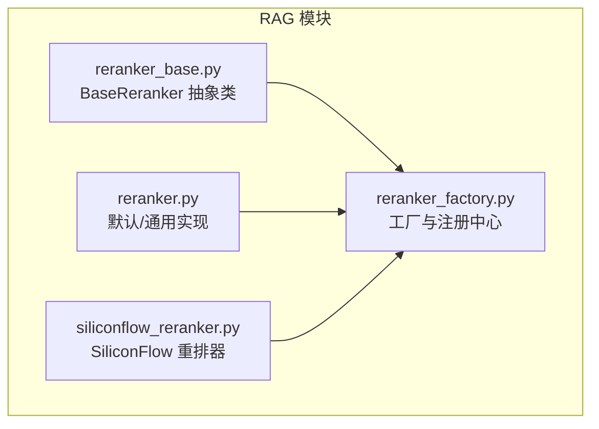
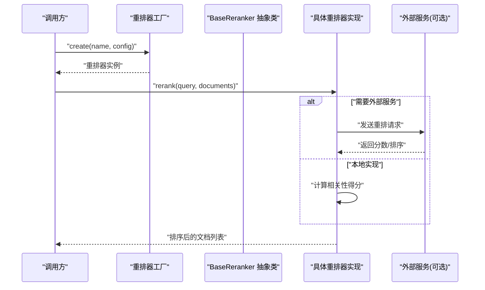
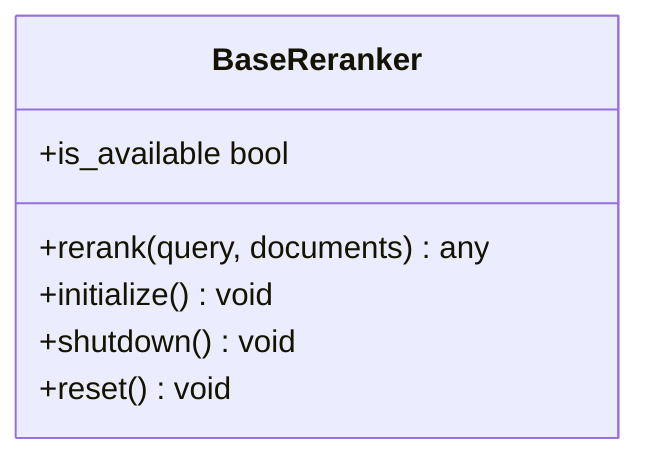
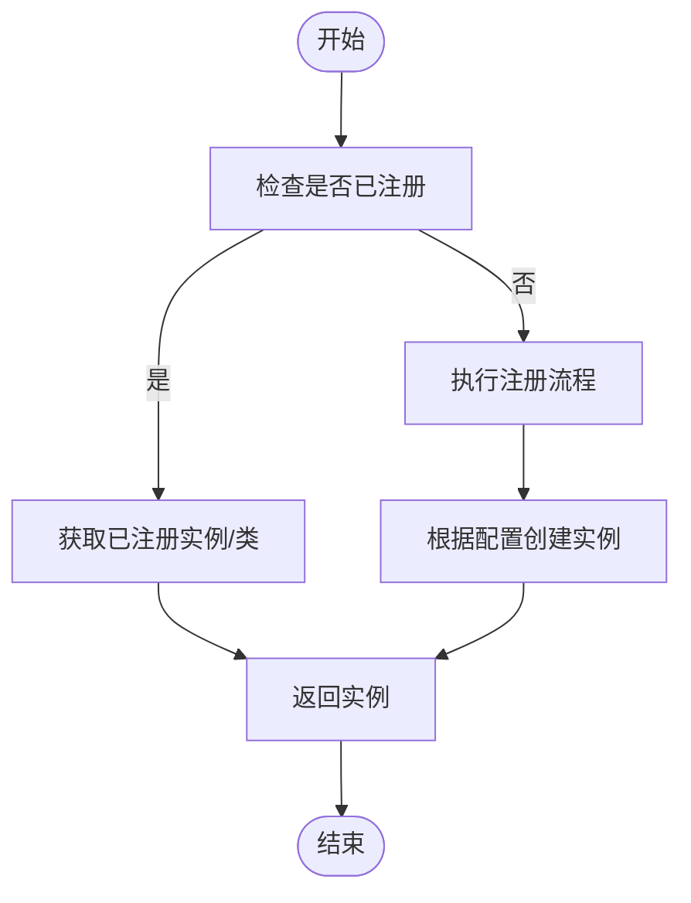
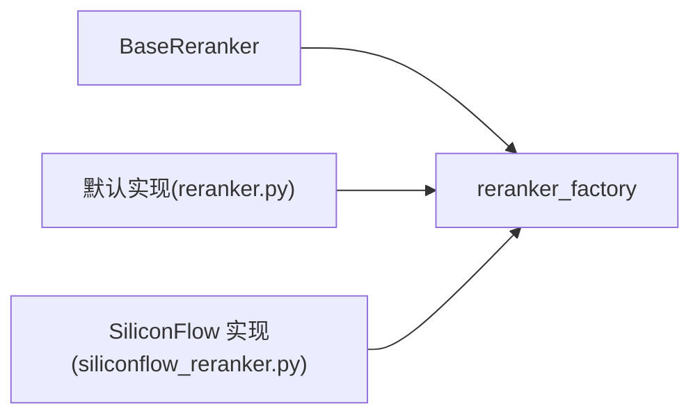

# 重排器基类设计

<cite>
**本文引用的文件**   
- [reranker_base.py](file://backend_design/nexus/rag/reranker_base.py)
- [reranker.py](file://backend_design/nexus/rag/reranker.py)
- [reranker_factory.py](file://backend_design/nexus/rag/reranker_factory.py)
- [siliconflow_reranker.py](file://backend_design/nexus/rag/siliconflow_reranker.py)
</cite>

## 目录
1. [简介](#简介)
2. [项目结构](#项目结构)
3. [核心组件](#核心组件)
4. [架构总览](#架构总览)
5. [详细组件分析](#详细组件分析)
6. [依赖关系分析](#依赖关系分析)
7. [性能考虑](#性能考虑)
8. [故障排查指南](#故障排查指南)
9. [结论](#结论)
10. [附录](#附录)

## 简介
本技术文档围绕“重排器基类设计”展开，聚焦于 BaseReranker 抽象类的设计理念与接口规范，包括统一的 rerank 方法定义、is_available 属性接口；并给出扩展自定义重排器的开发规范（继承要求、方法实现与最佳实践）、注册与工厂模式使用指南、生命周期管理与资源清理机制。同时提供从简单到高级的自定义重排器示例路径与测试框架编写指南，帮助读者快速构建可维护、可扩展的重排能力。

## 项目结构
与重排器相关的代码位于后端 RAG 模块中，关键文件如下：
- 抽象基类与统一接口：reranker_base.py
- 具体实现与集成：reranker.py、siliconflow_reranker.py
- 工厂与注册：reranker_factory.py

图表来源
- [reranker_base.py](file://backend_design/nexus/rag/reranker_base.py)
- [reranker.py](file://backend_design/nexus/rag/reranker.py)
- [siliconflow_reranker.py](file://backend_design/nexus/rag/siliconflow_reranker.py)
- [reranker_factory.py](file://backend_design/nexus/rag/reranker_factory.py)

章节来源
- [reranker_base.py](file://backend_design/nexus/rag/reranker_base.py)
- [reranker.py](file://backend_design/nexus/rag/reranker.py)
- [siliconflow_reranker.py](file://backend_design/nexus/rag/siliconflow_reranker.py)
- [reranker_factory.py](file://backend_design/nexus/rag/reranker_factory.py)

## 核心组件
- BaseReranker 抽象类
  - 职责：定义重排器的统一契约，包含 rerank 方法与 is_available 属性接口，并提供通用的生命周期钩子与错误处理约定。
  - 关键接口：
    - rerank(query, documents): 对候选文档进行相关性重排，返回排序后的结果或评分。
    - is_available: 布尔属性，用于运行时判断当前重排器是否可用（如依赖服务未就绪时返回 False）。
  - 生命周期钩子（建议）：
    - initialize(): 初始化资源（模型加载、连接池等）。
    - shutdown(): 释放资源（关闭连接、卸载模型等）。
    - reset(): 重置状态（可选，用于多租户或会话级隔离）。
- 工厂与注册中心
  - 职责：集中管理重排器类型与实例化逻辑，支持按名称动态创建、按需加载与可用性检查。
  - 关键能力：
    - register(name, cls_or_instance): 注册重排器类型或实例。
    - create(name, **kwargs): 根据名称创建并重排器实例。
    - get(name): 获取已注册的实例或类。
    - list_names(): 列出所有已注册的重排器名称。
- 具体实现
  - 默认/通用实现（reranker.py）：提供不依赖外部服务的本地重排策略或占位实现。
  - SiliconFlow 重排器（siliconflow_reranker.py）：对接 SiliconFlow 在线重排服务，封装鉴权、重试与超时控制。

章节来源
- [reranker_base.py](file://backend_design/nexus/rag/reranker_base.py)
- [reranker_factory.py](file://backend_design/nexus/rag/reranker_factory.py)
- [reranker.py](file://backend_design/nexus/rag/reranker.py)
- [siliconflow_reranker.py](file://backend_design/nexus/rag/siliconflow_reranker.py)

## 架构总览
下图展示了重排器在 RAG 检索流程中的位置与交互关系：上游检索器产出候选文档，重排器基于查询与文档语义进行二次排序，最终输出更相关的前 K 个结果。

图表来源
- [reranker_factory.py](file://backend_design/nexus/rag/reranker_factory.py)
- [reranker_base.py](file://backend_design/nexus/rag/reranker_base.py)
- [siliconflow_reranker.py](file://backend_design/nexus/rag/siliconflow_reranker.py)

## 详细组件分析

### BaseReranker 抽象类
- 设计理念
  - 通过最小接口约束（rerank、is_available）确保不同重排器具备一致的使用方式。
  - 提供生命周期钩子，便于子类实现资源初始化与清理，避免内存泄漏与连接泄露。
  - 内置通用错误处理与降级策略（例如当 is_available 为 False 时直接回退到上游结果）。
- 接口规范
  - rerank(query, documents): 输入查询与候选文档集合，输出排序后的结果或评分序列。
  - is_available: 布尔属性，指示当前实例是否处于可用状态。
  - initialize()/shutdown()/reset(): 建议实现的钩子，用于资源管理与状态重置。
- 复杂度与性能
  - 基类本身不包含复杂算法，主要承担契约与通用逻辑；实际复杂度由具体实现决定。
- 错误处理
  - 建议在 rerank 中捕获异常并转换为标准错误类型，保证上层稳定。
  - 结合 is_available 做快速失败与降级。

图表来源
- [reranker_base.py](file://backend_design/nexus/rag/reranker_base.py)

章节来源
- [reranker_base.py](file://backend_design/nexus/rag/reranker_base.py)

### 工厂与注册中心（reranker_factory.py）
- 职责
  - 统一管理重排器类型与实例，支持按名称动态创建与获取。
  - 提供注册表，允许在应用启动时完成插件式注册。
- 关键方法
  - register(name, cls_or_instance): 注册类或实例。
  - create(name, **kwargs): 构造并重排器实例。
  - get(name): 获取已注册项。
  - list_names(): 枚举已注册名称。
- 使用建议
  - 在应用初始化阶段完成所有重排器的注册。
  - 对外暴露 create/get 方法，隐藏内部实现细节。

图表来源
- [reranker_factory.py](file://backend_design/nexus/rag/reranker_factory.py)

章节来源
- [reranker_factory.py](file://backend_design/nexus/rag/reranker_factory.py)

### 默认/通用实现（reranker.py）
- 特点
  - 提供不依赖外部服务的本地重排策略或占位实现。
  - 适合离线环境或作为降级方案。
- 适用场景
  - 无网络或外部服务不可用时自动切换。
  - 单元测试与集成测试的快速验证。

章节来源
- [reranker.py](file://backend_design/nexus/rag/reranker.py)

### SiliconFlow 重排器（siliconflow_reranker.py）
- 特点
  - 封装在线重排服务调用，包含鉴权、重试、超时与错误码处理。
  - 通过 is_available 检测服务连通性与鉴权状态。
- 适用场景
  - 高准确率要求的在线重排任务。
  - 需要弹性伸缩与云端算力的生产环境。

章节来源
- [siliconflow_reranker.py](file://backend_design/nexus/rag/siliconflow_reranker.py)

## 依赖关系分析
- 耦合与内聚
  - BaseReranker 仅定义接口与通用逻辑，保持低耦合。
  - 工厂模块与具体实现解耦，通过名称注册与创建，提升内聚性。
- 外部依赖
  - SiliconFlow 重排器依赖外部 HTTP 服务与鉴权信息。
  - 默认实现可能依赖本地库或纯 Python 逻辑。
- 潜在循环依赖
  - 工厂不应反向依赖具体实现的具体业务逻辑，仅持有类型引用，避免循环。

图表来源
- [reranker_base.py](file://backend_design/nexus/rag/reranker_base.py)
- [reranker_factory.py](file://backend_design/nexus/rag/reranker_factory.py)
- [reranker.py](file://backend_design/nexus/rag/reranker.py)
- [siliconflow_reranker.py](file://backend_design/nexus/rag/siliconflow_reranker.py)

章节来源
- [reranker_base.py](file://backend_design/nexus/rag/reranker_base.py)
- [reranker_factory.py](file://backend_design/nexus/rag/reranker_factory.py)
- [reranker.py](file://backend_design/nexus/rag/reranker.py)
- [siliconflow_reranker.py](file://backend_design/nexus/rag/siliconflow_reranker.py)

## 性能考虑
- 批处理与并行
  - 对于大批量文档，优先采用批量重排以减少网络往返与模型推理开销。
  - 若实现支持并发，注意线程安全与资源竞争。
- 缓存与去重
  - 对相同 query+documents 组合的结果进行缓存，降低重复计算。
  - 在 rerank 前对候选集进行去重与过滤，减少无效计算。
- 超时与熔断
  - 对在线重排设置合理的超时与重试上限，避免雪崩。
  - 结合 is_available 快速失败，切换到本地实现或降级策略。
- 资源管理
  - 在 initialize/shutdown 中显式管理模型与连接，避免内存增长。
  - 使用对象池复用昂贵资源（如客户端连接、编码器实例）。

## 故障排查指南
- 常见问题
  - is_available 始终为 False：检查外部服务连通性、鉴权配置与端口可达性。
  - rerank 超时：调整超时参数，检查网络质量与服务端负载。
  - 内存泄漏：确认是否在 shutdown 中释放了模型与连接。
- 定位步骤
  - 打印 is_available 状态与最近一次错误日志。
  - 使用工厂的 list_names 与 get 方法验证注册与实例化是否正确。
  - 在单元测试中模拟外部服务失败，验证降级与重试逻辑。
- 恢复策略
  - 自动重试与指数退避。
  - 切换至默认/本地实现以保证系统可用性。

章节来源
- [reranker_factory.py](file://backend_design/nexus/rag/reranker_factory.py)
- [siliconflow_reranker.py](file://backend_design/nexus/rag/siliconflow_reranker.py)

## 结论
BaseReranker 抽象类通过最小而清晰的接口规范，为多样化重排器提供了统一契约与生命周期管理能力。配合工厂与注册中心，可实现插件式扩展与动态装配。遵循本文的开发规范与最佳实践，能够快速构建高性能、可维护且易测试的重排能力，满足从离线到在线、从简单到复杂的多种业务场景。

## 附录

### 自定义重排器开发规范
- 继承要求
  - 继承 BaseReranker，实现 rerank 与 is_available。
  - 根据需要实现 initialize/shutdown/reset 以管理资源。
- 方法实现要点
  - rerank 应保证幂等与稳定性，对异常进行捕获与转换。
  - is_available 需覆盖常见不可用场景（网络、鉴权、资源不足）。
- 最佳实践
  - 将配置项集中管理，避免硬编码。
  - 记录关键指标（耗时、成功率、错误码），便于观测与告警。
  - 在单元测试中覆盖正常、异常与边界用例。

章节来源
- [reranker_base.py](file://backend_design/nexus/rag/reranker_base.py)

### 注册与工厂使用指南
- 注册
  - 在应用启动时调用 register 完成重排器类型注册。
- 创建
  - 使用 create(name, **config) 动态创建实例。
- 获取与枚举
  - 使用 get(name) 获取已有实例。
  - 使用 list_names() 枚举已注册名称，便于配置与监控。

章节来源
- [reranker_factory.py](file://backend_design/nexus/rag/reranker_factory.py)

### 生命周期管理与资源清理
- 初始化
  - 在 initialize 中加载模型、建立连接池、预热缓存。
- 运行期
  - 在 rerank 中复用资源，避免频繁创建销毁。
- 清理
  - 在 shutdown 中释放模型、关闭连接、清空缓存。
- 重置
  - 在 reset 中清除会话级状态，确保多租户隔离。

章节来源
- [reranker_base.py](file://backend_design/nexus/rag/reranker_base.py)

### 完整示例路径（从简单到高级）
- 简单实现
  - 参考默认/通用实现的路径，了解基本结构与 rerank 的最小实现。
  - 路径：[reranker.py](file://backend_design/nexus/rag/reranker.py)
- 高级特性
  - 参考 SiliconFlow 重排器，学习在线服务调用、鉴权、重试与超时控制。
  - 路径：[siliconflow_reranker.py](file://backend_design/nexus/rag/siliconflow_reranker.py)
- 工厂集成
  - 在应用启动时完成注册与创建，并在运行时动态选择重排器。
  - 路径：[reranker_factory.py](file://backend_design/nexus/rag/reranker_factory.py)

### 测试框架与单元测试编写指南
- 测试目标
  - 验证 rerank 的正确性、is_available 的状态切换、生命周期钩子的行为。
- 测试策略
  - 使用 Mock 模拟外部服务，覆盖成功、失败、超时与鉴权错误。
  - 断言返回结果的顺序与评分是否符合预期。
  - 验证 initialize/shutdown/reset 的执行顺序与资源释放。
- 推荐工具
  - pytest + unittest.mock，便于编写异步与同步混合的测试。
  - 使用 fixtures 管理测试数据与重排器实例。

章节来源
- [reranker_base.py](file://backend_design/nexus/rag/reranker_base.py)
- [reranker_factory.py](file://backend_design/nexus/rag/reranker_factory.py)
- [siliconflow_reranker.py](file://backend_design/nexus/rag/siliconflow_reranker.py)