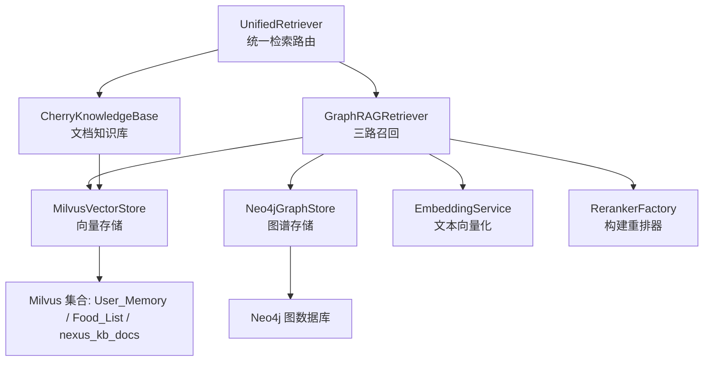
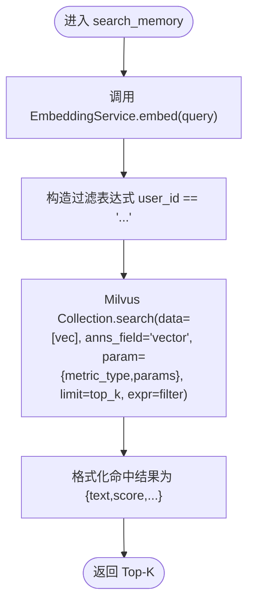
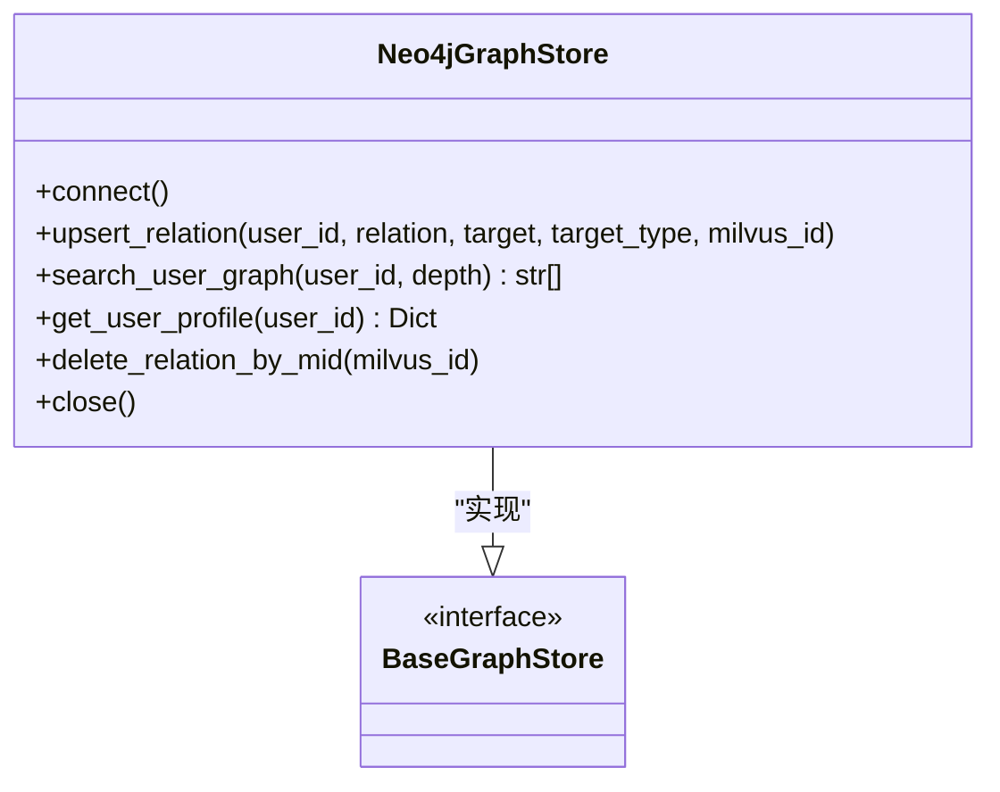
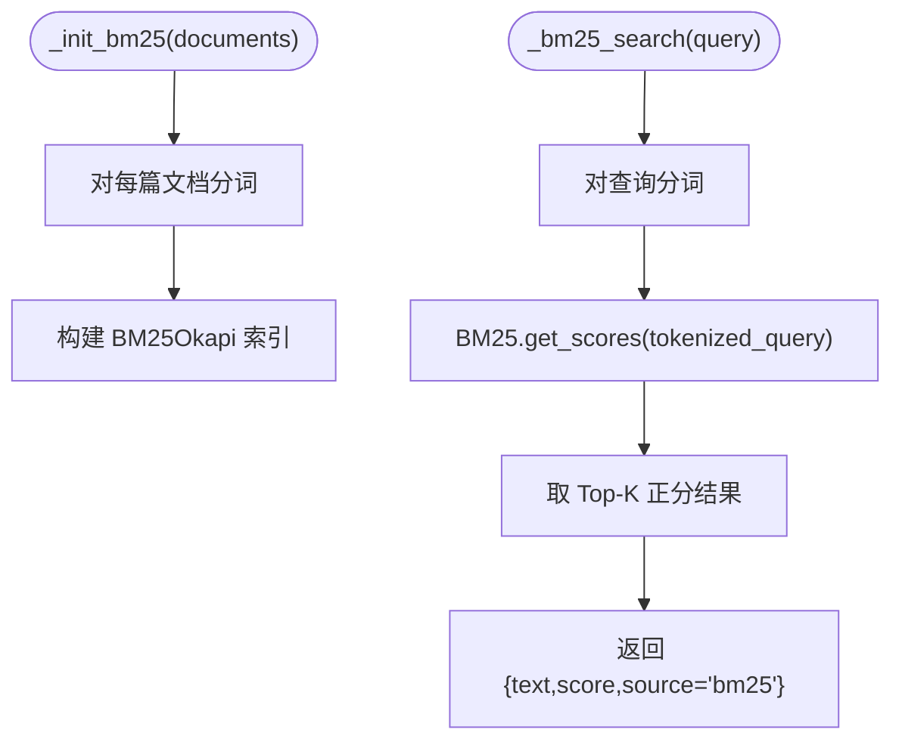
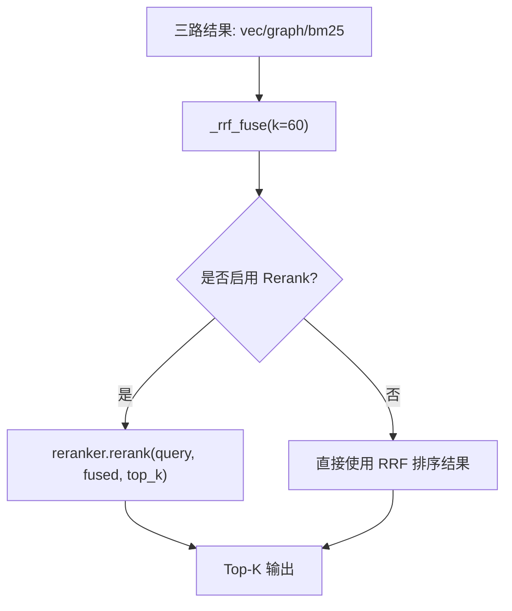
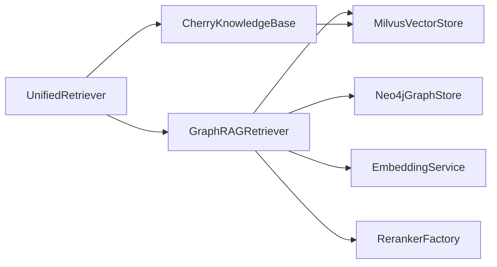

# 三路召回机制

<cite>
**本文引用的文件**   
- [retriever.py](file://backend_design/nexus/rag/retriever.py)
- [unified_retriever.py](file://backend_design/nexus/rag/unified_retriever.py)
- [vector_store.py](file://backend_design/nexus/rag/vector_store.py)
- [graph_store.py](file://backend_design/nexus/rag/graph_store.py)
- [cherry_kb.py](file://backend_design/nexus/rag/cherry_kb.py)
- [embedding.py](file://backend_design/nexus/rag/embedding.py)
- [reranker_base.py](file://backend_design/nexus/rag/reranker_base.py)
- [reranker_factory.py](file://backend_design/nexus/rag/reranker_factory.py)
- [manager.py](file://backend_design/nexus/memory/manager.py)
</cite>

## 目录
1. [简介](#简介)
2. [项目结构](#项目结构)
3. [核心组件](#核心组件)
4. [架构总览](#架构总览)
5. [详细组件分析](#详细组件分析)
6. [依赖关系分析](#依赖关系分析)
7. [性能与优化](#性能与优化)
8. [故障排查指南](#故障排查指南)
9. [结论](#结论)
10. [附录：自定义召回器实现示例](#附录自定义召回器实现示例)

## 简介
本技术文档围绕“三路召回机制”展开，系统阐述向量检索（Milvus 语义搜索）、图谱检索（Neo4j 用户画像+关系遍历）与全文检索（BM25 关键词匹配）的实现原理、数据流、融合策略与后处理重排。同时给出适用场景、优缺点对比与选择策略，并提供基于仓库现有代码的“自定义召回器”扩展方法指引。

## 项目结构
与三路召回相关的核心模块位于 RAG 层与记忆管理层：
- 统一检索路由：根据查询类型分发到 GraphRAG 或知识库检索
- GraphRAG 三路召回：向量路 + 图谱路 + BM25 路，RRF 融合，可选 Rerank
- 向量存储：Milvus 集合管理、索引创建与 ANN 检索
- 图谱存储：Neo4j 连接、约束与 Cypher 查询
- 文档知识库：Cherry KB 文档分块、向量化与检索
- Embedding 服务：统一文本向量化（Ark API），带熔断与重试
- Rerank 工厂：本地 BGE 或云端硅基流动 reranker 的选择



图表来源
- [unified_retriever.py:33-154](file://backend_design/nexus/rag/unified_retriever.py#L33-L154)
- [retriever.py:38-252](file://backend_design/nexus/rag/retriever.py#L38-L252)
- [vector_store.py:38-271](file://backend_design/nexus/rag/vector_store.py#L38-L271)
- [graph_store.py:24-190](file://backend_design/nexus/rag/graph_store.py#L24-L190)
- [cherry_kb.py:49-287](file://backend_design/nexus/rag/cherry_kb.py#L49-L287)
- [embedding.py:32-137](file://backend_design/nexus/rag/embedding.py#L32-L137)
- [reranker_factory.py:47-65](file://backend_design/nexus/rag/reranker_factory.py#L47-L65)

章节来源
- [unified_retriever.py:33-154](file://backend_design/nexus/rag/unified_retriever.py#L33-L154)
- [retriever.py:38-252](file://backend_design/nexus/rag/retriever.py#L38-L252)

## 核心组件
- GraphRAGRetriever：封装三路召回（向量/图谱/BM25）、RRF 融合与可选 Rerank；提供 retrieve_memories 与 retrieve_food 等入口。
- MilvusVectorStore：维护 Milvus 集合（User_Memory、Food_List），负责连接、建库、建索引与 ANN 检索。
- Neo4jGraphStore：维护用户画像与实体关系，支持一阶/多阶关系路径检索与用户画像导出。
- CherryKnowledgeBase：文档入库（分块→向量化→插入），按类别过滤检索。
- EmbeddingService：调用 Ark API 进行单条/批量向量化，内置熔断与重试。
- Reranker 工厂：根据配置选择本地 BGE 或云端硅基流动 reranker，或禁用。

章节来源
- [retriever.py:38-252](file://backend_design/nexus/rag/retriever.py#L38-L252)
- [vector_store.py:38-271](file://backend_design/nexus/rag/vector_store.py#L38-L271)
- [graph_store.py:24-190](file://backend_design/nexus/rag/graph_store.py#L24-L190)
- [cherry_kb.py:49-287](file://backend_design/nexus/rag/cherry_kb.py#L49-L287)
- [embedding.py:32-137](file://backend_design/nexus/rag/embedding.py#L32-L137)
- [reranker_factory.py:47-65](file://backend_design/nexus/rag/reranker_factory.py#L47-L65)

## 架构总览
整体检索流程由 UnifiedRetriever 作为入口，根据 query_type 分发至 GraphRAG 或 Cherry KB。GraphRAG 内部执行三路召回并融合排序，最终可经 Rerank 重排输出 Top-K。

```mermaid
sequenceDiagram
participant Client as "调用方"
participant UR as "UnifiedRetriever"
participant GR as "GraphRAGRetriever"
participant VS as "MilvusVectorStore"
participant GS as "Neo4jGraphStore"
participant RF as "RerankerFactory"
participant RR as "Reranker(本地/云端)"
Client->>UR : retrieve(query, user_id, query_type, top_k)
alt query_type=memory
UR->>GR : retrieve_memories(query, user_id, top_k)
GR->>VS : search_memory(query, user_id, top_k*4)
GR->>GS : search_user_graph(user_id, depth)
GR->>GR : _bm25_search(query, top_k*2)
GR->>GR : _rrf_fuse(vec, graph, bm25)
alt enable_rerank
GR->>RF : build_reranker()
RF-->>GR : reranker实例
GR->>RR : rerank(query, fused, top_k)
RR-->>GR : 重排结果
end
GR-->>UR : Top-K 结果
else query_type=knowledge
UR->>CK : search(query, top_k)
CK-->>UR : 文档结果
else hybrid/auto
UR并行调用 memory/knowledge
UR合并结果并按需rerank
UR-->>Client : Top-K 结果
end
```

图表来源
- [unified_retriever.py:63-154](file://backend_design/nexus/rag/unified_retriever.py#L63-L154)
- [retriever.py:141-178](file://backend_design/nexus/rag/retriever.py#L141-L178)
- [vector_store.py:134-168](file://backend_design/nexus/rag/vector_store.py#L134-L168)
- [graph_store.py:98-133](file://backend_design/nexus/rag/graph_store.py#L98-L133)
- [reranker_factory.py:47-65](file://backend_design/nexus/rag/reranker_factory.py#L47-L65)

## 详细组件分析

### 向量检索（Milvus 语义搜索）
- 文本向量化：通过 EmbeddingService 调用 Ark API 将查询文本转为高维向量，支持单条与批量异步调用，具备熔断与重试。
- 相似度计算：使用配置的 metric_type（如 IP/COSINE）与 search_params（如 ef/nprobe）进行 ANN 近似最近邻检索。
- 索引策略：
  - User_Memory：为 vector 字段创建向量索引，并为 user_id 字段创建 Trie 索引以加速按用户过滤。
  - Food_List：为 vector 字段创建向量索引。
  - Cherry KB（nexus_kb_docs）：IVF_FLAT 索引，nlist 可调。
- 性能优化：
  - 合理设置 nprobe/ef 平衡召回率与延迟。
  - 对高频查询采用渐进式 top_k 控制（见 MemoryManager）。
  - 批量向量化减少网络往返。



图表来源
- [vector_store.py:134-168](file://backend_design/nexus/rag/vector_store.py#L134-L168)
- [embedding.py:52-72](file://backend_design/nexus/rag/embedding.py#L52-L72)

章节来源
- [vector_store.py:52-132](file://backend_design/nexus/rag/vector_store.py#L52-L132)
- [vector_store.py:134-168](file://backend_design/nexus/rag/vector_store.py#L134-L168)
- [embedding.py:32-137](file://backend_design/nexus/rag/embedding.py#L32-L137)

### 图谱检索（Neo4j 用户画像+关系遍历）
- 用户画像建模：User 节点与各类 Entity 节点通过有向边关联，边属性包含 mid（Milvus ID）与 timestamp，便于双向绑定。
- 关系遍历：
  - 一阶：MATCH (u:User)-[r]->(t) 获取直接偏好/关系。
  - 多阶：MATCH path=(u:User)-[r*1..depth]->(t) 获取路径序列。
- Cypher 使用要点：
  - MERGE 幂等写入关系，避免重复。
  - 利用唯一约束与索引提升查询效率。
  - 返回结构化结果用于上层融合。



图表来源
- [graph_store.py:24-190](file://backend_design/nexus/rag/graph_store.py#L24-L190)

章节来源
- [graph_store.py:45-133](file://backend_design/nexus/rag/graph_store.py#L45-L133)
- [graph_store.py:153-172](file://backend_design/nexus/rag/graph_store.py#L153-L172)

### 全文检索（BM25 关键词匹配）
- 初始化：在首次检索前按需构建 BM25 索引（rank_bm25.BM25Okapi），并对文档列表进行分词。
- 分词策略：优先 jieba 中文分词，英文按空格切分；未安装 jieba 时降级为按字切分。
- 检索流程：对查询分词后计算 BM25 得分，取 Top-K 正分结果。
- 参数调优建议：
  - k1/b 默认值通常可用；若领域术语较长，可适当增大 b 降低长文档惩罚。
  - 分词粒度影响召回：jieba 更利于中文语义片段召回。
  - 文档集规模较大时，注意内存占用与构建耗时。



图表来源
- [retriever.py:85-139](file://backend_design/nexus/rag/retriever.py#L85-L139)

章节来源
- [retriever.py:85-139](file://backend_design/nexus/rag/retriever.py#L85-L139)

### 融合与重排（RRF + Rerank）
- RRF 融合：对三路结果按排名倒数求和，k 为平滑常数，公式为 Σ 1/(k + rank_i(d))。
- Rerank 重排：可选，Top-N 候选经 reranker 二次打分，输出 rerank_score 字段。
- 工厂模式：根据配置选择本地 BGE CrossEncoder 或云端硅基流动 reranker，或禁用。



图表来源
- [retriever.py:192-245](file://backend_design/nexus/rag/retriever.py#L192-L245)
- [reranker_factory.py:47-65](file://backend_design/nexus/rag/reranker_factory.py#L47-L65)

章节来源
- [retriever.py:192-245](file://backend_design/nexus/rag/retriever.py#L192-L245)
- [reranker_base.py:17-50](file://backend_design/nexus/rag/reranker_base.py#L17-L50)
- [reranker_factory.py:47-65](file://backend_design/nexus/rag/reranker_factory.py#L47-L65)

### 统一检索路由（UnifiedRetriever）
- 自动路由：根据关键词规则判断 query_type（memory/knowledge/hybrid/auto）。
- 混合检索：并行调用 GraphRAG 与 Cherry KB，合并结果后可再次 rerank。
- 格式统一：不同来源结果均携带 source/score 字段，便于下游消费。

章节来源
- [unified_retriever.py:33-154](file://backend_design/nexus/rag/unified_retriever.py#L33-L154)

### 文档知识库（Cherry KB）
- 文档入库：分块（RecursiveCharacterTextSplitter 或滑动窗口）→ 批量向量化 → 插入 Milvus。
- 检索：按 category 过滤，COSINE 相似度检索，返回 text/source/category/score。
- 与 GraphRAG 互补：面向手册/故障码/FAQ 等长文档知识。

章节来源
- [cherry_kb.py:99-182](file://backend_design/nexus/rag/cherry_kb.py#L99-L182)
- [cherry_kb.py:209-266](file://backend_design/nexus/rag/cherry_kb.py#L209-L266)

### 记忆管理层集成（MemoryManager）
- 渐进式披露：简单指令降低 top_k，复杂查询提高 top_k，兼顾延迟与质量。
- 习惯注入：从 MySQL 加载高频习惯，补充上下文。
- 复用 GraphRAG 三路召回管道，统一输出格式。

章节来源
- [manager.py:68-164](file://backend_design/nexus/memory/manager.py#L68-L164)

## 依赖关系分析
- GraphRAGRetriever 依赖：
  - MilvusVectorStore（向量检索）
  - Neo4jGraphStore（图谱检索）
  - EmbeddingService（向量化）
  - RerankerFactory（重排后端选择）
- UnifiedRetriever 依赖：
  - GraphRAGRetriever
  - CherryKnowledgeBase
  - RerankerFactory
- Cherry KB 依赖：
  - Milvus（通过外部 client 或内部连接）
  - EmbeddingService



图表来源
- [unified_retriever.py:33-154](file://backend_design/nexus/rag/unified_retriever.py#L33-L154)
- [retriever.py:38-252](file://backend_design/nexus/rag/retriever.py#L38-L252)
- [cherry_kb.py:49-287](file://backend_design/nexus/rag/cherry_kb.py#L49-L287)

章节来源
- [unified_retriever.py:33-154](file://backend_design/nexus/rag/unified_retriever.py#L33-L154)
- [retriever.py:38-252](file://backend_design/nexus/rag/retriever.py#L38-L252)
- [cherry_kb.py:49-287](file://backend_design/nexus/rag/cherry_kb.py#L49-L287)

## 性能与优化
- 向量检索
  - 调整 nprobe/ef 以平衡召回率与延迟。
  - 使用 user_id 过滤索引（Trie）缩小搜索空间。
  - 批量向量化减少网络开销。
- 图谱检索
  - 限制 depth 避免路径爆炸。
  - 确保唯一约束与索引存在，提升 MATCH 性能。
- BM25
  - 仅在需要时构建索引，避免冷启动开销。
  - 分词策略与领域词典结合提升召回。
- 融合与重排
  - RRF 的 k 值越大越平滑，越小越强调头部排名。
  - Rerank 仅对 Top-N 候选运行，控制成本。
- 渐进式披露
  - 简单指令快速返回少量结果，复杂查询深度召回。

[本节为通用指导，不直接分析具体文件]

## 故障排查指南
- 连接失败
  - Milvus：检查 alias/uri/token 配置，确认集合已创建并 load。
  - Neo4j：检查 uri/user/password，验证连通性与约束创建。
- 向量化失败
  - Ark API 超时或配额不足：查看熔断器状态与重试次数。
  - 空输入返回零向量，需在上层做非空校验。
- BM25 不可用
  - 未安装 rank-bm25 或 jieba 会触发降级日志，确认依赖安装。
- Rerank 不可用
  - 配置 provider=none 会跳过重排；cloud/local 需正确配置密钥或模型路径。

章节来源
- [vector_store.py:52-70](file://backend_design/nexus/rag/vector_store.py#L52-L70)
- [graph_store.py:31-43](file://backend_design/nexus/rag/graph_store.py#L31-L43)
- [embedding.py:52-72](file://backend_design/nexus/rag/embedding.py#L52-L72)
- [retriever.py:85-101](file://backend_design/nexus/rag/retriever.py#L85-L101)
- [reranker_factory.py:47-65](file://backend_design/nexus/rag/reranker_factory.py#L47-L65)

## 结论
三路召回机制通过语义、关系与关键词三种视角互补，显著提升了召回覆盖率与相关性。RRF 融合保证多路结果的公平性，Rerank 进一步精排候选。配合渐进式披露与索引优化，可在低延迟下获得高质量结果。

[本节为总结，不直接分析具体文件]

## 附录：自定义召回器实现示例
以下示例展示如何基于现有接口扩展一个“自定义召回器”，并将其接入 GraphRAGRetriever 的三路融合流程。

步骤概览
- 定义自定义召回器类，实现统一的召回接口（例如返回标准化结果列表）。
- 在 GraphRAGRetriever 中新增一条召回分支，并在 RRF 融合阶段纳入该分支。
- 如需重排，保持与 reranker 接口一致，使 rerank_score 字段参与排序。

参考路径
- 自定义召回器接口设计参考：
  - [reranker_base.py:17-50](file://backend_design/nexus/rag/reranker_base.py#L17-L50)
- 三路召回主流程与 RRF 融合参考：
  - [retriever.py:141-178](file://backend_design/nexus/rag/retriever.py#L141-L178)
  - [retriever.py:192-245](file://backend_design/nexus/rag/retriever.py#L192-L245)
- 统一路由与并行编排参考：
  - [unified_retriever.py:126-154](file://backend_design/nexus/rag/unified_retriever.py#L126-L154)

说明
- 上述步骤为概念性指引，不直接粘贴代码内容。请依据仓库现有接口与风格实现，并确保结果项携带 source/score 字段以便 RRF 融合与后续重排。

章节来源
- [reranker_base.py:17-50](file://backend_design/nexus/rag/reranker_base.py#L17-L50)
- [retriever.py:141-178](file://backend_design/nexus/rag/retriever.py#L141-L178)
- [retriever.py:192-245](file://backend_design/nexus/rag/retriever.py#L192-L245)
- [unified_retriever.py:126-154](file://backend_design/nexus/rag/unified_retriever.py#L126-L154)