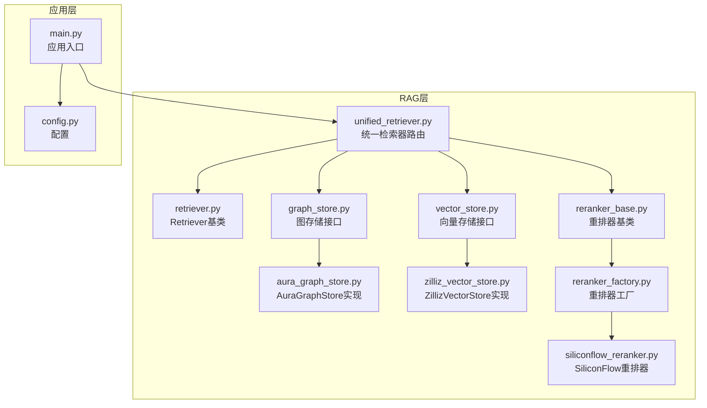
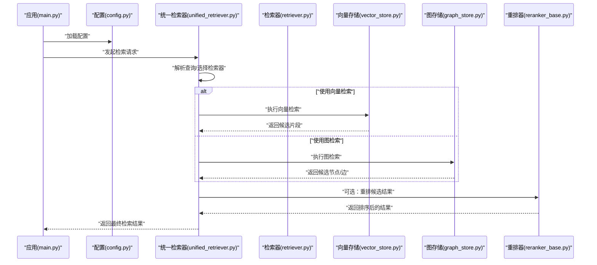
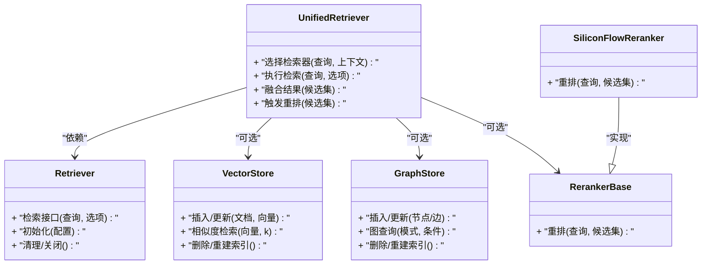
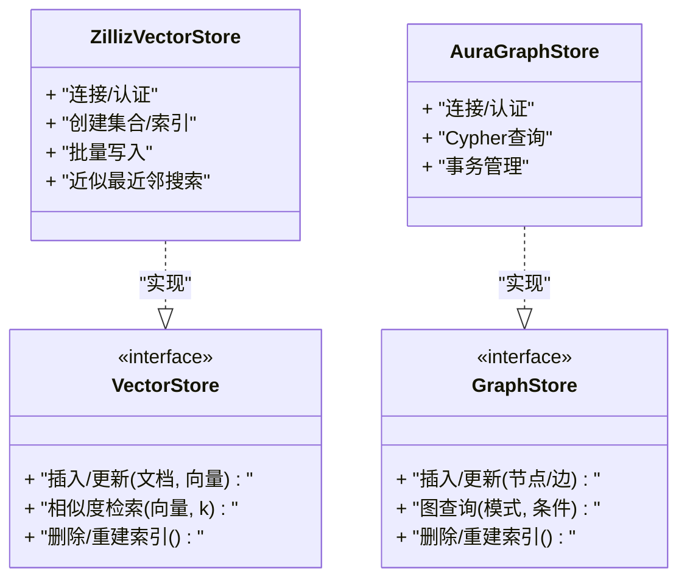
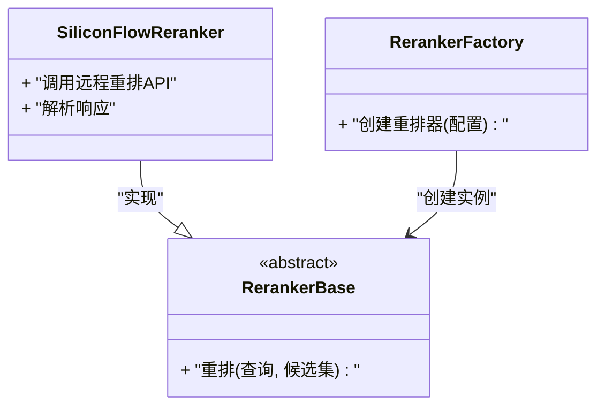
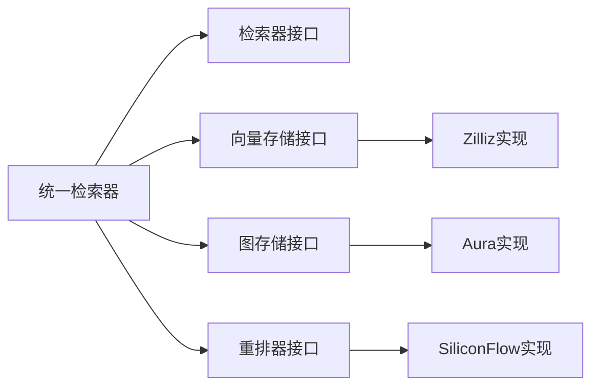

# 全文检索（BM25关键词匹配）

<cite>
**本文引用的文件**   
- [retriever.py](file://backend_design/nexus/rag/retriever.py)
- [unified_retriever.py](file://backend_design/nexus/rag/unified_retriever.py)
- [vector_store.py](file://backend_design/nexus/rag/vector_store.py)
- [graph_store.py](file://backend_design/nexus/rag/graph_store.py)
- [aura_graph_store.py](file://backend_design/nexus/rag/aura_graph_store.py)
- [zilliz_vector_store.py](file://backend_design/nexus/rag/zilliz_vector_store.py)
- [reranker_base.py](file://backend_design/nexus/rag/reranker_base.py)
- [reranker_factory.py](file://backend_design/nexus/rag/reranker_factory.py)
- [siliconflow_reranker.py](file://backend_design/nexus/rag/siliconflow_reranker.py)
- [config.py](file://backend_design/nexus/config.py)
- [main.py](file://backend_design/nexus/main.py)
</cite>

## 目录
1. [简介](#简介)
2. [项目结构](#项目结构)
3. [核心组件](#核心组件)
4. [架构总览](#架构总览)
5. [详细组件分析](#详细组件分析)
6. [依赖关系分析](#依赖关系分析)
7. [性能考量](#性能考量)
8. [故障排查指南](#故障排查指南)
9. [结论](#结论)
10. [附录](#附录)

## 简介
本技术文档围绕仓库中的检索与重排子系统，聚焦于“基于关键词匹配的全文检索”能力，重点解释：
- BM25算法的实现原理与关键步骤：词频统计、逆文档频率计算、评分公式。
- 关键词提取、分词处理与停用词过滤机制。
- Retriever基类设计与统一检索器的路由逻辑。
- 如何配置BM25参数、优化检索效果与扩展新检索器。
- 索引构建、缓存策略与查询优化的最佳实践。
- 不同检索方式（关键词匹配 vs 向量检索）的适用场景与性能特征对比。

说明：当前仓库未包含BM25的具体实现代码；本文对BM25的原理与实践建议为通用知识性内容，并结合现有RAG组件进行集成指导。

[无章节来源]

## 项目结构
检索相关代码位于 backend_design/nexus/rag 目录下，主要模块包括：
- 检索器抽象与统一路由：retriever.py、unified_retriever.py
- 向量存储与图存储接口及实现：vector_store.py、graph_store.py、aura_graph_store.py、zilliz_vector_store.py
- 重排器抽象与工厂：reranker_base.py、reranker_factory.py、siliconflow_reranker.py
- 应用入口与配置：main.py、config.py

图表来源
- [retriever.py](file://backend_design/nexus/rag/retriever.py)
- [unified_retriever.py](file://backend_design/nexus/rag/unified_retriever.py)
- [vector_store.py](file://backend_design/nexus/rag/vector_store.py)
- [graph_store.py](file://backend_design/nexus/rag/graph_store.py)
- [aura_graph_store.py](file://backend_design/nexus/rag/aura_graph_store.py)
- [zilliz_vector_store.py](file://backend_design/nexus/rag/zilliz_vector_store.py)
- [reranker_base.py](file://backend_design/nexus/rag/reranker_base.py)
- [reranker_factory.py](file://backend_design/nexus/rag/reranker_factory.py)
- [siliconflow_reranker.py](file://backend_design/nexus/rag/siliconflow_reranker.py)
- [config.py](file://backend_design/nexus/config.py)
- [main.py](file://backend_design/nexus/main.py)

章节来源
- [retriever.py](file://backend_design/nexus/rag/retriever.py)
- [unified_retriever.py](file://backend_design/nexus/rag/unified_retriever.py)
- [vector_store.py](file://backend_design/nexus/rag/vector_store.py)
- [graph_store.py](file://backend_design/nexus/rag/graph_store.py)
- [aura_graph_store.py](file://backend_design/nexus/rag/aura_graph_store.py)
- [zilliz_vector_store.py](file://backend_design/nexus/rag/zilliz_vector_store.py)
- [reranker_base.py](file://backend_design/nexus/rag/reranker_base.py)
- [reranker_factory.py](file://backend_design/nexus/rag/reranker_factory.py)
- [siliconflow_reranker.py](file://backend_design/nexus/rag/siliconflow_reranker.py)
- [config.py](file://backend_design/nexus/config.py)
- [main.py](file://backend_design/nexus/main.py)

## 核心组件
- Retriever基类：定义统一的检索接口契约，供具体检索器实现（如关键词匹配、向量检索等）。
- 统一检索器（UnifiedRetriever）：根据配置或请求上下文选择并调用具体检索器，提供路由与编排能力。
- 向量存储接口与实现：封装向量数据库操作，支持多后端（如Zilliz）。
- 图存储接口与实现：封装图数据库操作，支持多后端（如Aura Graph）。
- 重排器体系：提供重排器基类、工厂与具体实现（如SiliconFlow），用于在初筛后对结果进行精排。

章节来源
- [retriever.py](file://backend_design/nexus/rag/retriever.py)
- [unified_retriever.py](file://backend_design/nexus/rag/unified_retriever.py)
- [vector_store.py](file://backend_design/nexus/rag/vector_store.py)
- [graph_store.py](file://backend_design/nexus/rag/graph_store.py)
- [aura_graph_store.py](file://backend_design/nexus/rag/aura_graph_store.py)
- [zilliz_vector_store.py](file://backend_design/nexus/rag/zilliz_vector_store.py)
- [reranker_base.py](file://backend_design/nexus/rag/reranker_base.py)
- [reranker_factory.py](file://backend_design/nexus/rag/reranker_factory.py)
- [siliconflow_reranker.py](file://backend_design/nexus/rag/siliconflow_reranker.py)

## 架构总览
下图展示从应用入口到检索与重排的端到端流程，以及各组件之间的依赖关系。

图表来源
- [main.py](file://backend_design/nexus/main.py)
- [config.py](file://backend_design/nexus/config.py)
- [unified_retriever.py](file://backend_design/nexus/rag/unified_retriever.py)
- [retriever.py](file://backend_design/nexus/rag/retriever.py)
- [vector_store.py](file://backend_design/nexus/rag/vector_store.py)
- [graph_store.py](file://backend_design/nexus/rag/graph_store.py)
- [reranker_base.py](file://backend_design/nexus/rag/reranker_base.py)

## 详细组件分析

### BM25算法原理与实践要点
- 词频统计（TF）：统计查询词在文档中的出现次数，通常需进行归一化以缓解长文档优势。
- 逆文档频率（IDF）：衡量词的稀有程度，常见形式为对数平滑，避免除零与极端值。
- 评分公式：综合TF与IDF，结合文档长度归一化与BM25超参（k1、b）控制饱和与长度惩罚。
- 工程实现要点：
  - 倒排索引：维护词到文档列表的映射，加速查询。
  - 预计算IDF：在索引阶段计算并持久化，查询时直接读取。
  - 文本预处理：分词、小写化、去标点、去除停用词、同义词扩展等。
  - 批量查询与并行：对多查询词并行计算得分，合并排序。
  - 内存与磁盘权衡：倒排表可压缩存储，必要时落盘。

注意：当前仓库未包含BM25的具体实现代码。上述内容为通用算法与工程实践建议，可用于后续扩展新的关键词检索器。

[无章节来源]

### 关键词提取、分词处理与停用词过滤
- 关键词提取：
  - 规则式：基于词典、正则、命名实体识别。
  - 统计式：TF-IDF、TextRank等。
  - 模型式：LLM抽取或微调分类器。
- 分词处理：
  - 英文：空格+标点切分，或小写化+词干化/词形还原。
  - 中文：使用分词库（如jieba）进行细粒度切分，必要时加入领域词典。
- 停用词过滤：
  - 内置停用词表 + 自定义停用词。
  - 按语言与领域动态调整，避免过度过滤导致召回下降。
- 查询改写与扩展：
  - 同义词/近义词扩展、拼写纠错、查询重写。
  - 权重分配：对重要词赋予更高权重以提升相关性。

[无章节来源]

### Retriever基类设计与统一检索器路由
- Retriever基类职责：
  - 定义统一的检索接口（如检索方法签名、参数与返回值约定）。
  - 提供公共能力（如日志、指标上报、错误处理模板）。
- 统一检索器（UnifiedRetriever）职责：
  - 解析查询与上下文，决定使用何种检索器（关键词、向量、图）。
  - 组合多个检索器结果（可选融合策略）。
  - 调用重排器进行二次排序。
- 路由策略：
  - 基于配置开关（如启用/禁用某检索器）。
  - 基于查询类型（短查询偏好关键词，长查询偏好语义）。
  - 基于业务域或租户策略。

图表来源
- [retriever.py](file://backend_design/nexus/rag/retriever.py)
- [unified_retriever.py](file://backend_design/nexus/rag/unified_retriever.py)
- [vector_store.py](file://backend_design/nexus/rag/vector_store.py)
- [graph_store.py](file://backend_design/nexus/rag/graph_store.py)
- [reranker_base.py](file://backend_design/nexus/rag/reranker_base.py)
- [siliconflow_reranker.py](file://backend_design/nexus/rag/siliconflow_reranker.py)

章节来源
- [retriever.py](file://backend_design/nexus/rag/retriever.py)
- [unified_retriever.py](file://backend_design/nexus/rag/unified_retriever.py)
- [reranker_base.py](file://backend_design/nexus/rag/reranker_base.py)
- [siliconflow_reranker.py](file://backend_design/nexus/rag/siliconflow_reranker.py)

### 向量存储与图存储接口及实现
- 向量存储接口（vector_store.py）：
  - 定义插入、更新、删除、相似度检索、索引管理等标准方法。
  - 屏蔽底层差异，便于替换后端。
- 图存储接口（graph_store.py）：
  - 定义节点/边的增删改查与图查询方法。
- 具体实现：
  - ZillizVectorStore（zilliz_vector_store.py）：对接Zilliz向量数据库。
  - AuraGraphStore（aura_graph_store.py）：对接Aura图数据库。

图表来源
- [vector_store.py](file://backend_design/nexus/rag/vector_store.py)
- [zilliz_vector_store.py](file://backend_design/nexus/rag/zilliz_vector_store.py)
- [graph_store.py](file://backend_design/nexus/rag/graph_store.py)
- [aura_graph_store.py](file://backend_design/nexus/rag/aura_graph_store.py)

章节来源
- [vector_store.py](file://backend_design/nexus/rag/vector_store.py)
- [zilliz_vector_store.py](file://backend_design/nexus/rag/zilliz_vector_store.py)
- [graph_store.py](file://backend_design/nexus/rag/graph_store.py)
- [aura_graph_store.py](file://backend_design/nexus/rag/aura_graph_store.py)

### 重排器体系
- 重排器基类（reranker_base.py）：定义重排接口与通用逻辑。
- 重排器工厂（reranker_factory.py）：根据配置创建具体重排器实例。
- SiliconFlow重排器（siliconflow_reranker.py）：基于外部服务进行精排。

图表来源
- [reranker_base.py](file://backend_design/nexus/rag/reranker_base.py)
- [reranker_factory.py](file://backend_design/nexus/rag/reranker_factory.py)
- [siliconflow_reranker.py](file://backend_design/nexus/rag/siliconflow_reranker.py)

章节来源
- [reranker_base.py](file://backend_design/nexus/rag/reranker_base.py)
- [reranker_factory.py](file://backend_design/nexus/rag/reranker_factory.py)
- [siliconflow_reranker.py](file://backend_design/nexus/rag/siliconflow_reranker.py)

### 配置与应用入口
- 配置（config.py）：集中管理检索、重排、存储等参数。
- 应用入口（main.py）：启动服务、加载配置、注册路由、初始化检索与重排组件。

章节来源
- [config.py](file://backend_design/nexus/config.py)
- [main.py](file://backend_design/nexus/main.py)

## 依赖关系分析
- 低耦合高内聚：
  - Retriever基类与具体实现解耦，通过统一接口替换。
  - 统一检索器负责路由与编排，不关心具体实现细节。
  - 存储层通过接口隔离，便于切换后端。
- 潜在循环依赖：
  - 确保统一检索器仅依赖接口，避免反向引用具体实现。
- 外部依赖：
  - 向量数据库（如Zilliz）、图数据库（如Aura）、重排服务（如SiliconFlow）。

图表来源
- [unified_retriever.py](file://backend_design/nexus/rag/unified_retriever.py)
- [retriever.py](file://backend_design/nexus/rag/retriever.py)
- [vector_store.py](file://backend_design/nexus/rag/vector_store.py)
- [graph_store.py](file://backend_design/nexus/rag/graph_store.py)
- [zilliz_vector_store.py](file://backend_design/nexus/rag/zilliz_vector_store.py)
- [aura_graph_store.py](file://backend_design/nexus/rag/aura_graph_store.py)
- [reranker_base.py](file://backend_design/nexus/rag/reranker_base.py)
- [siliconflow_reranker.py](file://backend_design/nexus/rag/siliconflow_reranker.py)

章节来源
- [unified_retriever.py](file://backend_design/nexus/rag/unified_retriever.py)
- [retriever.py](file://backend_design/nexus/rag/retriever.py)
- [vector_store.py](file://backend_design/nexus/rag/vector_store.py)
- [graph_store.py](file://backend_design/nexus/rag/graph_store.py)
- [zilliz_vector_store.py](file://backend_design/nexus/rag/zilliz_vector_store.py)
- [aura_graph_store.py](file://backend_design/nexus/rag/aura_graph_store.py)
- [reranker_base.py](file://backend_design/nexus/rag/reranker_base.py)
- [siliconflow_reranker.py](file://backend_design/nexus/rag/siliconflow_reranker.py)

## 性能考量
- 索引构建
  - 增量更新：优先采用增量写入，减少全量重建成本。
  - 批处理：批量写入向量/图数据，降低网络与序列化开销。
  - 预计算：IDF、统计信息在索引阶段完成，查询时直接读取。
- 查询优化
  - 缓存：对高频查询结果进行短期缓存（如Redis），设置合理TTL。
  - 并行：多查询词并行计算得分，合并排序。
  - 截断：限制候选集大小，减少下游重排压力。
- 资源与容量
  - 内存：倒排表与中间结果控制在可用内存范围内。
  - 磁盘：大索引考虑分片与冷热分层。
- 监控与观测
  - 记录P95/P99延迟、QPS、命中率、错误率。
  - 追踪热点查询与慢查询，定位瓶颈。

[无章节来源]

## 故障排查指南
- 常见问题
  - 检索结果为空：检查分词与停用词配置、索引是否成功构建、查询词是否存在。
  - 性能退化：检查缓存命中率、索引碎片、网络延迟、下游服务超时。
  - 重排失败：检查重排器配置与鉴权、输入格式是否符合要求。
- 诊断手段
  - 开启详细日志，记录查询预处理、路由决策、候选集大小与耗时。
  - 使用压测脚本验证不同规模下的稳定性与吞吐。
  - 对关键路径添加埋点，区分I/O与CPU密集型环节。

[无章节来源]

## 结论
- 当前仓库提供了完善的检索与重排基础设施，具备良好的可扩展性与可替换性。
- BM25作为经典关键词匹配算法，适合术语明确、短查询、强字面匹配的场景；可与向量检索互补，形成混合检索方案。
- 建议在统一检索器中引入BM25检索器实现，并通过配置灵活启用/禁用与调优。

[无章节来源]

## 附录

### 配置BM25参数的示例路径
- 在配置文件中新增BM25相关参数（如k1、b、停用词表路径、索引路径等），并在统一检索器中读取与注入。
- 参考路径：
  - [config.py](file://backend_design/nexus/config.py)
  - [unified_retriever.py](file://backend_design/nexus/rag/unified_retriever.py)

章节来源
- [config.py](file://backend_design/nexus/config.py)
- [unified_retriever.py](file://backend_design/nexus/rag/unified_retriever.py)

### 扩展新检索器的步骤
- 新建检索器实现，继承Retriever基类，实现检索接口。
- 在统一检索器中添加路由逻辑，支持按配置或查询类型选择新检索器。
- 如需重排，接入重排器工厂与具体实现。
- 参考路径：
  - [retriever.py](file://backend_design/nexus/rag/retriever.py)
  - [unified_retriever.py](file://backend_design/nexus/rag/unified_retriever.py)
  - [reranker_factory.py](file://backend_design/nexus/rag/reranker_factory.py)
  - [siliconflow_reranker.py](file://backend_design/nexus/rag/siliconflow_reranker.py)

章节来源
- [retriever.py](file://backend_design/nexus/rag/retriever.py)
- [unified_retriever.py](file://backend_design/nexus/rag/unified_retriever.py)
- [reranker_factory.py](file://backend_design/nexus/rag/reranker_factory.py)
- [siliconflow_reranker.py](file://backend_design/nexus/rag/siliconflow_reranker.py)

### 索引构建与缓存策略最佳实践
- 索引构建
  - 先建倒排索引与IDF，再建立文档元数据映射。
  - 定期重建与增量更新结合，保证一致性与可用性。
- 缓存策略
  - 查询级缓存：对相同查询返回结果进行短期缓存。
  - 结果级缓存：对热门片段进行持久化缓存，缩短响应时间。
  - 失效策略：基于时间或变更事件触发失效。
- 参考路径：
  - [vector_store.py](file://backend_design/nexus/rag/vector_store.py)
  - [graph_store.py](file://backend_design/nexus/rag/graph_store.py)

章节来源
- [vector_store.py](file://backend_design/nexus/rag/vector_store.py)
- [graph_store.py](file://backend_design/nexus/rag/graph_store.py)

### 检索方式对比与适用场景
- 关键词匹配（BM25）
  - 优点：精确匹配、可解释性强、延迟低。
  - 缺点：对同义/泛化表达不敏感。
  - 适用：术语明确、短查询、强字面匹配。
- 向量检索（语义相似）
  - 优点：捕捉语义、容忍表述差异。
  - 缺点：需要向量模型与索引、延迟较高。
  - 适用：长查询、自然语言、概念匹配。
- 图检索（结构化关系）
  - 优点：利用实体关系与约束，精准定位。
  - 缺点：建模成本高、查询复杂。
  - 适用：实体关联、路径推理、知识图谱。

[无章节来源]