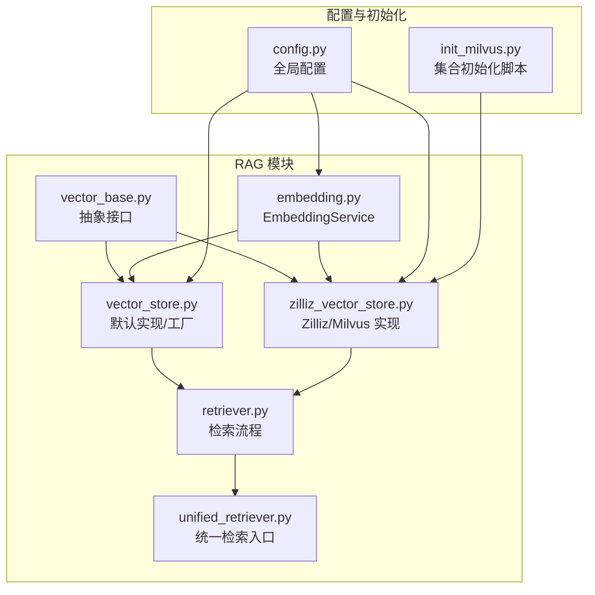
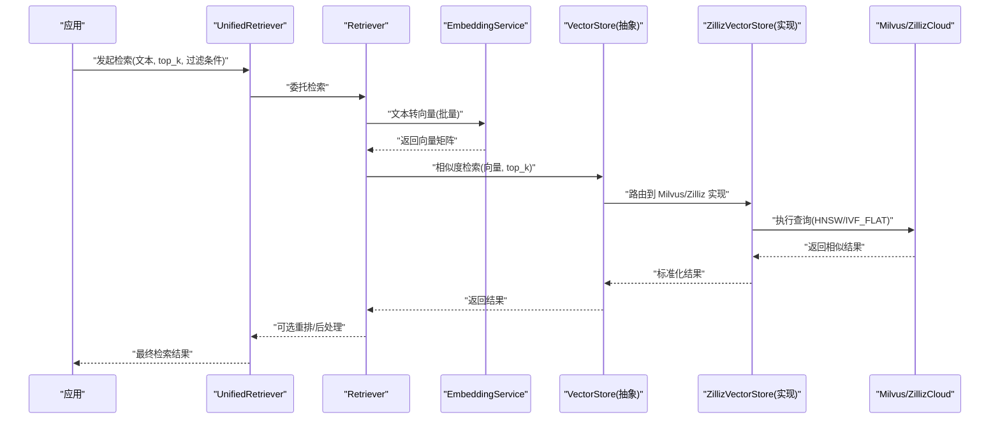
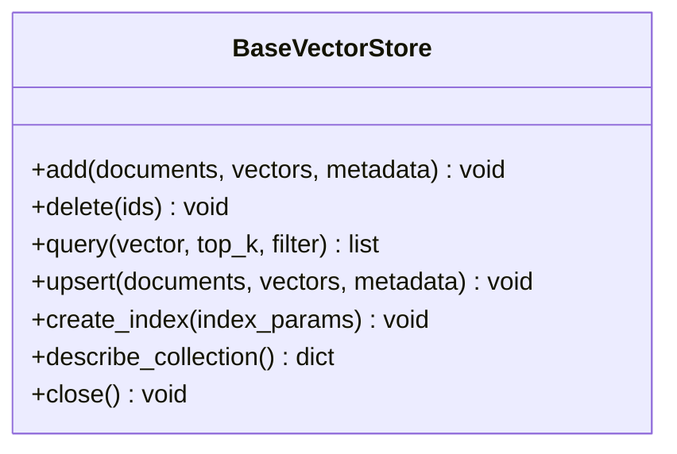
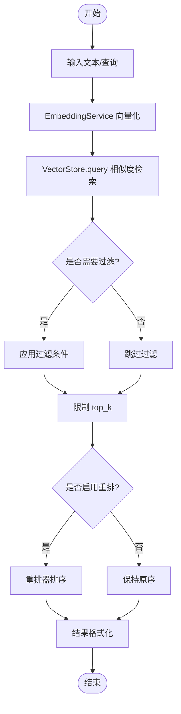
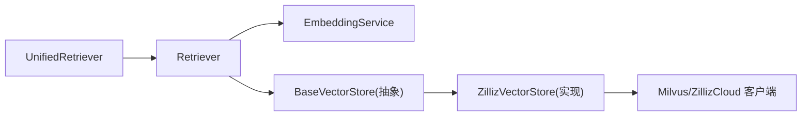

# 向量检索（Milvus语义搜索）

<cite>
**本文引用的文件**   
- [backend_design/nexus/rag/vector_base.py](file://backend_design/nexus/rag/vector_base.py)
- [backend_design/nexus/rag/vector_store.py](file://backend_design/nexus/rag/vector_store.py)
- [backend_design/nexus/rag/zilliz_vector_store.py](file://backend_design/nexus/rag/zilliz_vector_store.py)
- [backend_design/nexus/rag/embedding.py](file://backend_design/nexus/rag/embedding.py)
- [backend_design/nexus/rag/retriever.py](file://backend_design/nexus/rag/retriever.py)
- [backend_design/nexus/rag/unified_retriever.py](file://backend_design/nexus/rag/unified_retriever.py)
- [backend_design/nexus/config.py](file://backend_design/nexus/config.py)
- [backend_design/scripts/init_milvus.py](file://backend_design/scripts/init_milvus.py)
</cite>

## 目录
1. [简介](#简介)
2. [项目结构](#项目结构)
3. [核心组件](#核心组件)
4. [架构总览](#架构总览)
5. [详细组件分析](#详细组件分析)
6. [依赖关系分析](#依赖关系分析)
7. [性能与优化](#性能与优化)
8. [故障排查指南](#故障排查指南)
9. [结论](#结论)
10. [附录：自定义后端与配置示例路径](#附录自定义后端与配置示例路径)

## 简介
本技术文档围绕基于 Milvus 的语义检索系统，系统性阐述文本向量化、相似度计算、索引策略选择与性能优化方法；深入解析 BaseVectorStore 抽象接口的设计理念与具体实现，包括 ZillizCloud 云服务集成方式；解释 EmbeddingService 的工作原理与模型配置；并提供自定义向量存储后端与检索性能优化的实践路径。文档同时覆盖内存管理、连接池配置与错误处理的最佳实践，帮助读者在生产环境中稳定高效地运行向量检索服务。

## 项目结构
与向量检索相关的代码集中在 backend_design/nexus/rag 目录下，采用“分层+可插拔”的设计：
- 抽象层：定义统一的向量存储接口与嵌入服务接口
- 实现层：提供 Milvus/ZillizCloud 的具体实现
- 检索编排层：封装检索流程、重排与统一入口
- 配置与初始化：集中式配置与 Milvus 集合初始化脚本

图表来源
- [backend_design/nexus/rag/vector_base.py](file://backend_design/nexus/rag/vector_base.py)
- [backend_design/nexus/rag/embedding.py](file://backend_design/nexus/rag/embedding.py)
- [backend_design/nexus/rag/vector_store.py](file://backend_design/nexus/rag/vector_store.py)
- [backend_design/nexus/rag/zilliz_vector_store.py](file://backend_design/nexus/rag/zilliz_vector_store.py)
- [backend_design/nexus/rag/retriever.py](file://backend_design/nexus/rag/retriever.py)
- [backend_design/nexus/rag/unified_retriever.py](file://backend_design/nexus/rag/unified_retriever.py)
- [backend_design/nexus/config.py](file://backend_design/nexus/config.py)
- [backend_design/scripts/init_milvus.py](file://backend_design/scripts/init_milvus.py)

章节来源
- [backend_design/nexus/rag/vector_base.py](file://backend_design/nexus/rag/vector_base.py)
- [backend_design/nexus/rag/vector_store.py](file://backend_design/nexus/rag/vector_store.py)
- [backend_design/nexus/rag/zilliz_vector_store.py](file://backend_design/nexus/rag/zilliz_vector_store.py)
- [backend_design/nexus/rag/embedding.py](file://backend_design/nexus/rag/embedding.py)
- [backend_design/nexus/rag/retriever.py](file://backend_design/nexus/rag/retriever.py)
- [backend_design/nexus/rag/unified_retriever.py](file://backend_design/nexus/rag/unified_retriever.py)
- [backend_design/nexus/config.py](file://backend_design/nexus/config.py)
- [backend_design/scripts/init_milvus.py](file://backend_design/scripts/init_milvus.py)

## 核心组件
- BaseVectorStore 抽象接口：定义统一的增删改查与相似度检索能力，屏蔽底层 Milvus/ZillizCloud 差异，便于替换与扩展。
- VectorStore 默认实现/工厂：提供常用参数组合与创建逻辑，简化使用。
- ZillizVectorStore 实现：对接 Milvus/ZillizCloud 客户端，负责集合管理、数据写入、索引构建与查询。
- EmbeddingService：封装文本到向量的转换过程，支持多模型与批量处理，提供维度校验与缓存策略。
- Retriever/UnifiedRetriever：编排检索流程，串联 EmbeddingService 与 VectorStore，并可接入重排器提升相关性。

章节来源
- [backend_design/nexus/rag/vector_base.py](file://backend_design/nexus/rag/vector_base.py)
- [backend_design/nexus/rag/vector_store.py](file://backend_design/nexus/rag/vector_store.py)
- [backend_design/nexus/rag/zilliz_vector_store.py](file://backend_design/nexus/rag/zilliz_vector_store.py)
- [backend_design/nexus/rag/embedding.py](file://backend_design/nexus/rag/embedding.py)
- [backend_design/nexus/rag/retriever.py](file://backend_design/nexus/rag/retriever.py)
- [backend_design/nexus/rag/unified_retriever.py](file://backend_design/nexus/rag/unified_retriever.py)

## 架构总览
整体架构遵循“接口抽象 + 多实现 + 编排层”的分层模式：
- 上层应用通过 UnifiedRetriever 发起检索请求
- UnifiedRetriever 调用 Retriever 编排流程
- Retriever 使用 EmbeddingService 将文本转为向量，再调用 VectorStore 进行相似度检索
- VectorStore 根据配置选择 Milvus/ZillizCloud 实现，执行索引查询
- 配置由 config.py 统一管理，集合初始化由 init_milvus.py 完成

图表来源
- [backend_design/nexus/rag/unified_retriever.py](file://backend_design/nexus/rag/unified_retriever.py)
- [backend_design/nexus/rag/retriever.py](file://backend_design/nexus/rag/retriever.py)
- [backend_design/nexus/rag/embedding.py](file://backend_design/nexus/rag/embedding.py)
- [backend_design/nexus/rag/vector_base.py](file://backend_design/nexus/rag/vector_base.py)
- [backend_design/nexus/rag/zilliz_vector_store.py](file://backend_design/nexus/rag/zilliz_vector_store.py)

## 详细组件分析

### BaseVectorStore 抽象接口设计
- 设计理念
  - 统一契约：定义 add、delete、query、upsert、create_index、describe_collection 等核心方法，屏蔽不同后端差异
  - 可扩展性：新增后端只需实现该接口，无需改动上层编排逻辑
  - 类型安全：明确输入输出数据结构，便于静态检查与测试
- 关键职责
  - 集合生命周期管理（创建、描述、删除）
  - 数据写入与更新（批量插入、按主键更新）
  - 相似度检索（支持过滤条件、top_k、输出字段控制）
  - 索引策略配置（HNSW、IVF_FLAT 等）

图表来源
- [backend_design/nexus/rag/vector_base.py](file://backend_design/nexus/rag/vector_base.py)

章节来源
- [backend_design/nexus/rag/vector_base.py](file://backend_design/nexus/rag/vector_base.py)

### VectorStore 默认实现与工厂
- 职责
  - 提供常用参数组合与便捷构造方法
  - 根据配置选择具体后端（本地 Milvus 或 ZillizCloud）
- 典型用法
  - 通过工厂方法传入配置对象，自动实例化对应后端
  - 暴露统一的 create_index 与 query 接口

章节来源
- [backend_design/nexus/rag/vector_store.py](file://backend_design/nexus/rag/vector_store.py)

### ZillizVectorStore 实现（Milvus/ZillizCloud）
- 职责
  - 与 Milvus/ZillizCloud 客户端交互，管理集合与索引
  - 执行批量写入、更新与相似度检索
  - 处理连接池、重试与超时等运行时细节
- 索引策略
  - HNSW：适合高召回与低延迟场景，参数包括 efConstruction、M、ef 等
  - IVF_FLAT：适合大规模数据与可控召回的场景，参数包括 nlist、nprobe 等
- 连接与资源
  - 连接池复用，避免频繁建立连接
  - 合理设置批大小与并发度，平衡吞吐与延迟
  - 异常捕获与降级策略（如重试、回退到较小 batch）

章节来源
- [backend_design/nexus/rag/zilliz_vector_store.py](file://backend_design/nexus/rag/zilliz_vector_store.py)

### EmbeddingService 工作原理与模型配置
- 工作原理
  - 接收原始文本，调用嵌入模型生成向量
  - 支持批量处理，减少模型调用开销
  - 维度校验与缺失值处理，确保下游一致性
- 模型配置
  - 模型名称、设备（CPU/GPU）、批大小、最大长度等
  - 可选缓存机制，对重复文本命中缓存以提升性能
- 错误处理
  - 网络异常重试、模型加载失败降级、维度不匹配告警

章节来源
- [backend_design/nexus/rag/embedding.py](file://backend_design/nexus/rag/embedding.py)

### Retriever 与 UnifiedRetriever 编排流程
- Retriever
  - 将文本经 EmbeddingService 转换为向量
  - 调用 VectorStore.query 执行相似度检索
  - 支持过滤条件与字段裁剪
- UnifiedRetriever
  - 统一入口，封装检索、可选重排与结果格式化
  - 对外暴露简洁 API，隐藏内部复杂度

图表来源
- [backend_design/nexus/rag/retriever.py](file://backend_design/nexus/rag/retriever.py)
- [backend_design/nexus/rag/unified_retriever.py](file://backend_design/nexus/rag/unified_retriever.py)

章节来源
- [backend_design/nexus/rag/retriever.py](file://backend_design/nexus/rag/retriever.py)
- [backend_design/nexus/rag/unified_retriever.py](file://backend_design/nexus/rag/unified_retriever.py)

### 集合初始化与配置
- init_milvus.py
  - 负责在 Milvus/ZillizCloud 上创建集合、定义字段与索引
  - 确保 schema 与代码中使用的字段一致
- config.py
  - 集中管理 Milvus/ZillizCloud 连接参数、索引策略、批大小、超时等
  - 为各组件提供统一配置访问点

章节来源
- [backend_design/scripts/init_milvus.py](file://backend_design/scripts/init_milvus.py)
- [backend_design/nexus/config.py](file://backend_design/nexus/config.py)

## 依赖关系分析
- 组件耦合
  - UnifiedRetriever 依赖 Retriever
  - Retriever 依赖 EmbeddingService 与 VectorStore
  - VectorStore 抽象依赖具体实现（ZillizVectorStore）
- 外部依赖
  - Milvus/ZillizCloud 客户端库
  - 嵌入模型推理库（可选 GPU/CPU 加速）
- 潜在循环依赖
  - 通过接口解耦避免循环引用，确保单向依赖

图表来源
- [backend_design/nexus/rag/unified_retriever.py](file://backend_design/nexus/rag/unified_retriever.py)
- [backend_design/nexus/rag/retriever.py](file://backend_design/nexus/rag/retriever.py)
- [backend_design/nexus/rag/embedding.py](file://backend_design/nexus/rag/embedding.py)
- [backend_design/nexus/rag/vector_base.py](file://backend_design/nexus/rag/vector_base.py)
- [backend_design/nexus/rag/zilliz_vector_store.py](file://backend_design/nexus/rag/zilliz_vector_store.py)

章节来源
- [backend_design/nexus/rag/unified_retriever.py](file://backend_design/nexus/rag/unified_retriever.py)
- [backend_design/nexus/rag/retriever.py](file://backend_design/nexus/rag/retriever.py)
- [backend_design/nexus/rag/embedding.py](file://backend_design/nexus/rag/embedding.py)
- [backend_design/nexus/rag/vector_base.py](file://backend_design/nexus/rag/vector_base.py)
- [backend_design/nexus/rag/zilliz_vector_store.py](file://backend_design/nexus/rag/zilliz_vector_store.py)

## 性能与优化
- 文本向量化
  - 批量处理：增大 batch_size 提升吞吐，注意内存峰值
  - 模型缓存：对高频文本做缓存，减少重复推理
  - 设备选择：GPU 加速显著降低延迟，需评估显存占用
- 相似度计算
  - 余弦相似度：关注向量归一化，避免尺度影响
  - 欧氏距离：对绝对距离敏感，适合特定分布的数据
  - 选择依据：业务指标（召回率、延迟、吞吐）决定度量函数
- 索引策略
  - HNSW：高召回、低延迟，适合在线实时检索；调参重点为 M、efConstruction、ef
  - IVF_FLAT：大规模数据下可控召回；调参重点为 nlist、nprobe
  - 动态切换：根据数据规模与查询负载选择合适索引
- 连接池与批大小
  - 复用连接，避免频繁握手
  - 调整写入与查询批大小，平衡吞吐与延迟
- 内存管理
  - 控制向量矩阵大小，及时释放中间变量
  - 使用流式处理与分页读取，避免一次性加载全部数据
- 错误处理与降级
  - 重试与退避策略
  - 降级到较小 batch 或备选索引
  - 监控与告警：记录耗时、错误率与资源使用

[本节为通用指导，不直接分析具体文件]

## 故障排查指南
- 常见问题
  - 连接失败：检查 Milvus/ZillizCloud 地址、端口、认证信息
  - 索引未生效：确认集合已正确创建并构建索引
  - 维度不匹配：核对 EmbeddingService 输出维度与集合 schema
  - 性能抖动：观察 CPU/GPU 利用率、内存峰值与网络延迟
- 定位步骤
  - 查看日志中的异常堆栈与耗时统计
  - 验证配置项是否正确加载
  - 使用最小数据集复现问题，逐步缩小范围
- 恢复策略
  - 重启服务或重建索引
  - 切换到备用后端或降级模式
  - 扩容资源或调整批大小与并发度

章节来源
- [backend_design/nexus/config.py](file://backend_design/nexus/config.py)
- [backend_design/scripts/init_milvus.py](file://backend_design/scripts/init_milvus.py)

## 结论
本系统通过清晰的抽象接口与可插拔实现，实现了基于 Milvus/ZillizCloud 的语义检索能力。EmbeddingService 与 VectorStore 的解耦设计使得模型与后端均可灵活替换；Retriever 与 UnifiedRetriever 提供了稳定的编排入口。结合合理的索引策略、连接池与内存管理，可在生产环境获得高可用与高性能的检索体验。

[本节为总结，不直接分析具体文件]

## 附录：自定义后端与优化示例路径
- 自定义向量存储后端
  - 参考抽象接口定义，新建类实现 BaseVectorStore，并在工厂中注册
  - 示例路径：
    - [backend_design/nexus/rag/vector_base.py](file://backend_design/nexus/rag/vector_base.py)
    - [backend_design/nexus/rag/vector_store.py](file://backend_design/nexus/rag/vector_store.py)
- 优化检索性能
  - 调整索引参数与批大小，观察延迟与吞吐变化
  - 示例路径：
    - [backend_design/nexus/rag/zilliz_vector_store.py](file://backend_design/nexus/rag/zilliz_vector_store.py)
    - [backend_design/nexus/rag/retriever.py](file://backend_design/nexus/rag/retriever.py)
- 模型配置与缓存
  - 修改 EmbeddingService 的模型参数与缓存策略
  - 示例路径：
    - [backend_design/nexus/rag/embedding.py](file://backend_design/nexus/rag/embedding.py)
- 集合初始化与配置
  - 确保 schema 与索引一致，配置集中管理
  - 示例路径：
    - [backend_design/scripts/init_milvus.py](file://backend_design/scripts/init_milvus.py)
    - [backend_design/nexus/config.py](file://backend_design/nexus/config.py)