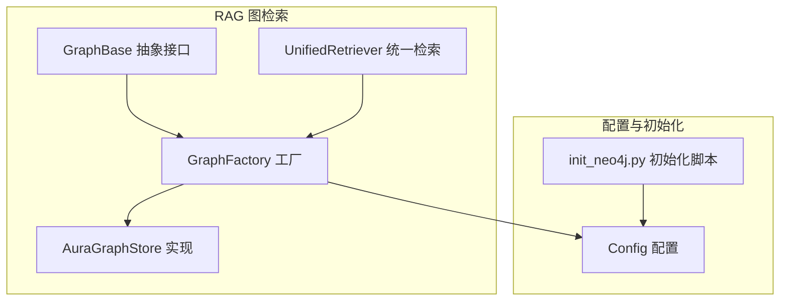
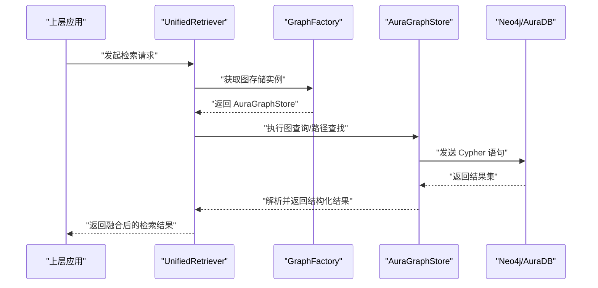
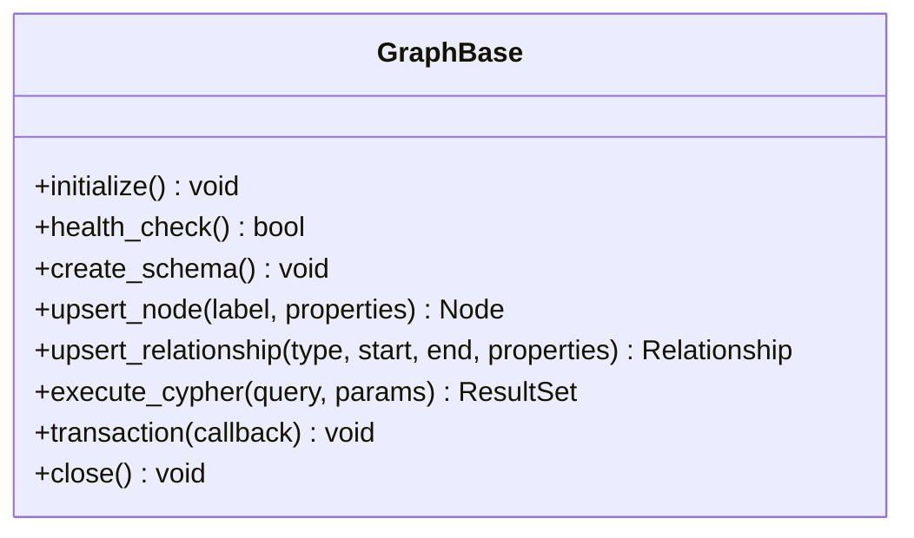
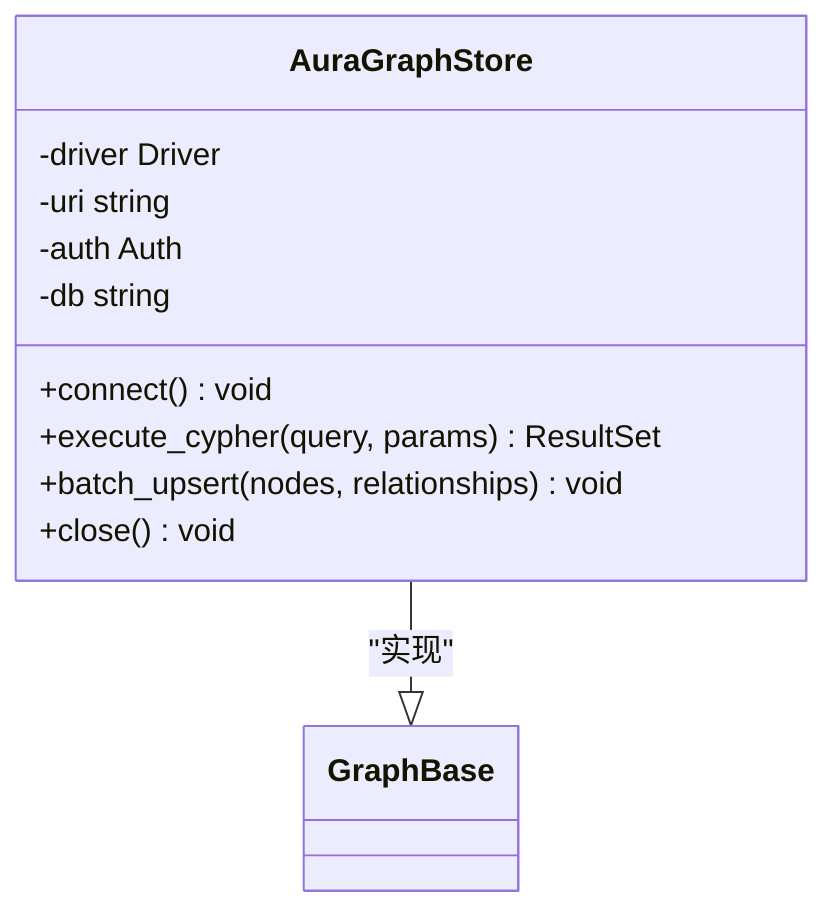
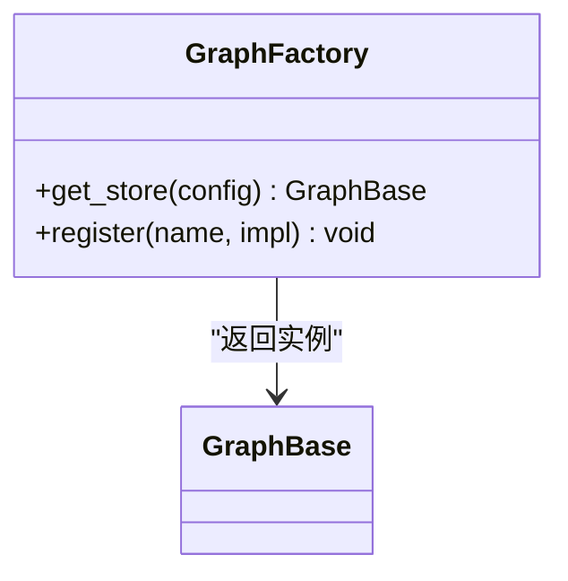
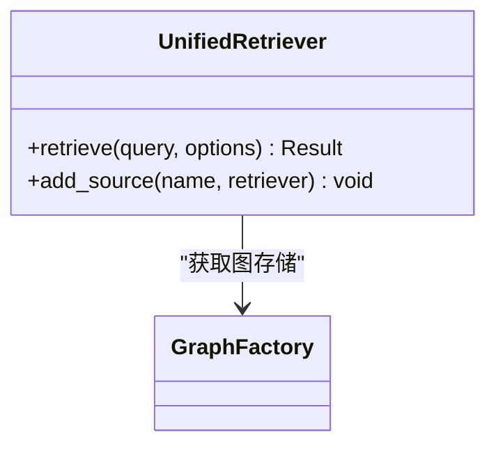
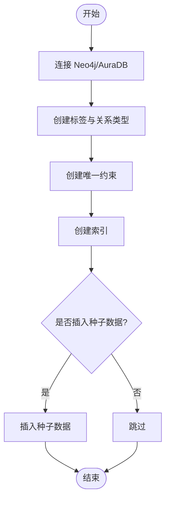
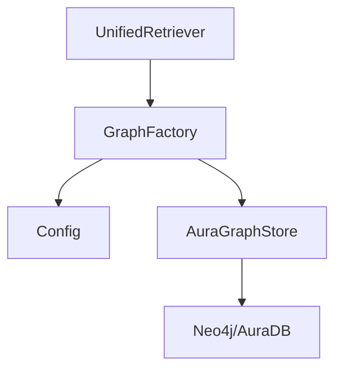

# 图谱检索（Neo4j用户画像）

<cite>
**本文引用的文件**   
- [graph_base.py](file://backend_design/nexus/rag/graph_base.py)
- [aura_graph_store.py](file://backend_design/nexus/rag/aura_graph_store.py)
- [graph_factory.py](file://backend_design/nexus/rag/graph_factory.py)
- [init_neo4j.py](file://scripts/init_neo4j.py)
- [config.py](file://backend_design/nexus/config.py)
- [unified_retriever.py](file://backend_design/nexus/rag/unified_retriever.py)
</cite>

## 目录
1. [简介](#简介)
2. [项目结构](#项目结构)
3. [核心组件](#核心组件)
4. [架构总览](#架构总览)
5. [详细组件分析](#详细组件分析)
6. [依赖关系分析](#依赖关系分析)
7. [性能与优化](#性能与优化)
8. [故障排查指南](#故障排查指南)
9. [结论](#结论)
10. [附录](#附录)

## 简介
本技术文档聚焦于基于 Neo4j 的用户画像图谱检索实现，覆盖图数据库 Schema 设计、节点与关系建模、Cypher 查询实践；阐述 GraphBase 抽象接口设计与 AuraDB 云服务集成方式；说明用户画像图谱的构建流程（实体抽取、关系建立、属性映射）；并提供复杂图查询与路径查找的实现思路与示例代码路径。同时给出图索引优化、查询性能调优与大规模数据处理的最佳实践建议。

## 项目结构
本项目在 RAG 子系统中提供统一的图存储抽象与具体实现，并通过工厂模式进行实例化与选择。关键位置如下：
- 抽象接口与工厂：后端 RAG 模块中的图存储抽象与工厂
- 具体实现：AuraDB 云服务的图存储实现
- 初始化脚本：用于创建图数据库 Schema、索引与初始数据
- 配置中心：集中管理连接参数与环境变量
- 统一检索入口：将图检索与其他检索源聚合

图表来源
- [graph_base.py](file://backend_design/nexus/rag/graph_base.py)
- [graph_factory.py](file://backend_design/nexus/rag/graph_factory.py)
- [aura_graph_store.py](file://backend_design/nexus/rag/aura_graph_store.py)
- [unified_retriever.py](file://backend_design/nexus/rag/unified_retriever.py)
- [config.py](file://backend_design/nexus/config.py)
- [init_neo4j.py](file://scripts/init_neo4j.py)

章节来源
- [graph_base.py](file://backend_design/nexus/rag/graph_base.py)
- [graph_factory.py](file://backend_design/nexus/rag/graph_factory.py)
- [aura_graph_store.py](file://backend_design/nexus/rag/aura_graph_store.py)
- [unified_retriever.py](file://backend_design/nexus/rag/unified_retriever.py)
- [config.py](file://backend_design/nexus/config.py)
- [init_neo4j.py](file://scripts/init_neo4j.py)

## 核心组件
- GraphBase 抽象接口：定义图存储的统一能力边界，包括连接管理、Schema 初始化、CRUD 操作、查询执行、事务与批量写入等。
- AuraGraphStore 实现：面向 AuraDB 云服务的图存储实现，负责驱动 Neo4j 驱动、处理认证与连接池、封装 Cypher 调用与结果解析。
- GraphFactory 工厂：根据配置动态创建并返回具体的图存储实例，支持多后端扩展。
- UnifiedRetriever 统一检索：将图检索作为可选检索源之一，与其他检索器组合，形成混合检索管线。
- init_neo4j.py 初始化脚本：负责在 Neo4j/AuraDB 上创建标签、关系类型、唯一约束与索引，以及必要的种子数据。
- Config 配置：集中读取环境变量或配置文件，为图存储提供连接参数、超时、重试策略等。

章节来源
- [graph_base.py](file://backend_design/nexus/rag/graph_base.py)
- [aura_graph_store.py](file://backend_design/nexus/rag/aura_graph_store.py)
- [graph_factory.py](file://backend_design/nexus/rag/graph_factory.py)
- [unified_retriever.py](file://backend_design/nexus/rag/unified_retriever.py)
- [init_neo4j.py](file://scripts/init_neo4j.py)
- [config.py](file://backend_design/nexus/config.py)

## 架构总览
下图展示了从应用层到图数据库的整体交互流程，包含统一检索入口、图存储工厂、具体实现与 Neo4j/AuraDB 的连接。

图表来源
- [unified_retriever.py](file://backend_design/nexus/rag/unified_retriever.py)
- [graph_factory.py](file://backend_design/nexus/rag/graph_factory.py)
- [aura_graph_store.py](file://backend_design/nexus/rag/aura_graph_store.py)

## 详细组件分析

### GraphBase 抽象接口
- 职责边界
  - 连接生命周期：初始化、健康检查、关闭
  - Schema 管理：创建标签、关系类型、唯一约束与索引
  - 数据操作：节点/关系的增删改查、批量写入、事务控制
  - 查询执行：原生 Cypher 执行、参数化查询、分页与限制
  - 错误处理：网络异常、认证失败、权限不足、超时重试
- 设计要点
  - 通过抽象方法强制子类实现具体驱动细节
  - 提供通用工具方法（如参数校验、结果规范化）
  - 暴露一致的上下文管理器与异步/同步接口（视实现而定）

图表来源
- [graph_base.py](file://backend_design/nexus/rag/graph_base.py)

章节来源
- [graph_base.py](file://backend_design/nexus/rag/graph_base.py)

### AuraGraphStore 实现（AuraDB 集成）
- 职责边界
  - 使用 Neo4j Python 驱动连接 AuraDB
  - 处理认证（用户名/密码或令牌）、TLS、连接池与重试
  - 封装 Cypher 执行、事务边界、结果映射为领域对象
  - 提供批量写入与流式读取以应对大规模数据
- 集成要点
  - 从配置中读取 URI、数据库名、凭据与超时
  - 针对 AuraDB 的网络与限流特性设置合理的重试与退避策略
  - 对高频查询进行缓存与去重（可在上层实现）

图表来源
- [aura_graph_store.py](file://backend_design/nexus/rag/aura_graph_store.py)
- [graph_base.py](file://backend_design/nexus/rag/graph_base.py)

章节来源
- [aura_graph_store.py](file://backend_design/nexus/rag/aura_graph_store.py)
- [graph_base.py](file://backend_design/nexus/rag/graph_base.py)

### GraphFactory 工厂
- 职责边界
  - 依据配置决定返回的具体图存储实现
  - 支持多后端切换（例如本地 Neo4j 与 AuraDB）
  - 提供单例或按需创建策略
- 设计要点
  - 配置驱动：通过键值映射选择实现类
  - 可扩展：新增后端只需注册新实现并在配置中启用

图表来源
- [graph_factory.py](file://backend_design/nexus/rag/graph_factory.py)

章节来源
- [graph_factory.py](file://backend_design/nexus/rag/graph_factory.py)

### UnifiedRetriever 统一检索
- 职责边界
  - 将图检索与其他检索源（向量、关键词等）组合
  - 提供排序、去重与结果融合策略
  - 暴露统一的检索接口供上层调用
- 设计要点
  - 可插拔：各检索器遵循统一协议
  - 容错：单个检索器失败不影响整体可用性

图表来源
- [unified_retriever.py](file://backend_design/nexus/rag/unified_retriever.py)
- [graph_factory.py](file://backend_design/nexus/rag/graph_factory.py)

章节来源
- [unified_retriever.py](file://backend_design/nexus/rag/unified_retriever.py)
- [graph_factory.py](file://backend_design/nexus/rag/graph_factory.py)

### 初始化脚本 init_neo4j.py
- 职责边界
  - 创建标签与关系类型
  - 创建唯一约束与索引以提升查询性能
  - 插入种子数据（可选）
- 设计要点
  - 幂等：重复执行不会破坏现有数据
  - 可回滚：失败时保留一致性状态

图表来源
- [init_neo4j.py](file://scripts/init_neo4j.py)

章节来源
- [init_neo4j.py](file://scripts/init_neo4j.py)

### 配置中心 config.py
- 职责边界
  - 集中读取环境变量或配置文件
  - 提供默认值与校验
  - 向各组件暴露标准化配置对象
- 设计要点
  - 安全：敏感信息（如凭据）不硬编码
  - 可观测：记录关键配置项（脱敏）

章节来源
- [config.py](file://backend_design/nexus/config.py)

## 依赖关系分析
- 组件耦合
  - UnifiedRetriever 依赖 GraphFactory 获取图存储实例
  - GraphFactory 依赖 Config 进行实例化决策
  - AuraGraphStore 依赖 Neo4j 驱动与网络环境
- 外部依赖
  - Neo4j Python 驱动
  - 网络与 TLS 库
  - 日志与指标采集（可选）

图表来源
- [unified_retriever.py](file://backend_design/nexus/rag/unified_retriever.py)
- [graph_factory.py](file://backend_design/nexus/rag/graph_factory.py)
- [aura_graph_store.py](file://backend_design/nexus/rag/aura_graph_store.py)
- [config.py](file://backend_design/nexus/config.py)

章节来源
- [unified_retriever.py](file://backend_design/nexus/rag/unified_retriever.py)
- [graph_factory.py](file://backend_design/nexus/rag/graph_factory.py)
- [aura_graph_store.py](file://backend_design/nexus/rag/aura_graph_store.py)
- [config.py](file://backend_design/nexus/config.py)

## 性能与优化
- 图索引与约束
  - 为高频过滤字段创建唯一约束与索引，避免全表扫描
  - 对关系类型与方向进行明确标注，减少匹配分支
- 查询优化
  - 使用参数化查询，避免注入与编译开销
  - 限制返回规模（LIMIT/OPTIONAL MATCH），先粗筛再精排
  - 合并多次查询为单次 Cypher，减少往返延迟
- 批处理与事务
  - 批量写入时使用事务边界，提升吞吐与一致性
  - 分片写入与并发控制，避免锁竞争
- 连接与重试
  - 合理设置连接池大小、超时与重试退避策略
  - 针对 AuraDB 的限流与抖动进行自适应调整
- 缓存与去重
  - 对热点查询结果进行短期缓存
  - 在应用层对结果进行去重与排序

[本节为通用指导，无需特定文件引用]

## 故障排查指南
- 连接问题
  - 检查 URI、数据库名、用户名/密码是否正确
  - 确认网络可达性与 TLS 证书配置
- 权限与认证
  - 验证账号具备读写权限与目标数据库访问权
- 查询性能
  - 查看执行计划，定位缺失索引或高代价操作
  - 拆分复杂查询，降低单次复杂度
- 事务与批处理
  - 监控事务大小与耗时，避免长事务阻塞
  - 失败重试需幂等，防止重复写入
- 日志与指标
  - 开启详细日志，记录关键步骤与异常堆栈
  - 收集 QPS、延迟、错误率等指标，辅助定位瓶颈

章节来源
- [aura_graph_store.py](file://backend_design/nexus/rag/aura_graph_store.py)
- [graph_base.py](file://backend_design/nexus/rag/graph_base.py)

## 结论
通过 GraphBase 抽象接口与 AuraGraphStore 实现，系统实现了与 Neo4j/AuraDB 的稳定集成；借助 GraphFactory 与 UnifiedRetriever，图检索被无缝融入统一检索管线。配合完善的 Schema 设计、索引优化与批处理策略，可满足用户画像图谱的大规模构建与高效检索需求。

[本节为总结性内容，无需特定文件引用]

## 附录

### 用户画像图谱 Schema 设计建议
- 节点标签
  - User：用户主体
  - Attribute：用户属性（如年龄、性别、偏好）
  - Behavior：行为事件（如浏览、购买、播放）
  - Item：物品/内容（如商品、文章、视频）
  - Context：上下文（如时间、地点、设备）
- 关系类型
  - HAS_ATTRIBUTE：User -> Attribute
  - PERFORMED：User -> Behavior
  - INTERACTED_WITH：User -> Item
  - OCCURRED_IN：Behavior -> Context
- 属性映射
  - 为关键字段建立唯一约束与索引（如 user_id、item_id）
  - 对时间戳、数值型字段建立范围查询索引

[本节为概念性设计，无需特定文件引用]

### Cypher 查询与路径查找示例（代码路径）
- 基础查询
  - 按条件筛选用户及其属性
  - 示例代码路径：[graph_base.py](file://backend_design/nexus/rag/graph_base.py)、[aura_graph_store.py](file://backend_design/nexus/rag/aura_graph_store.py)
- 路径查找
  - 多跳关系路径搜索（如用户-行为-物品）
  - 示例代码路径：[aura_graph_store.py](file://backend_design/nexus/rag/aura_graph_store.py)
- 复杂聚合
  - 统计用户行为频次、关联物品热度
  - 示例代码路径：[unified_retriever.py](file://backend_design/nexus/rag/unified_retriever.py)

[本节提供代码路径指引，不包含具体代码内容]