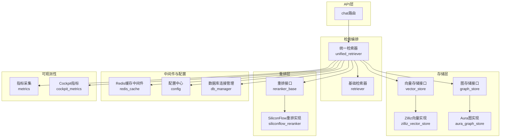
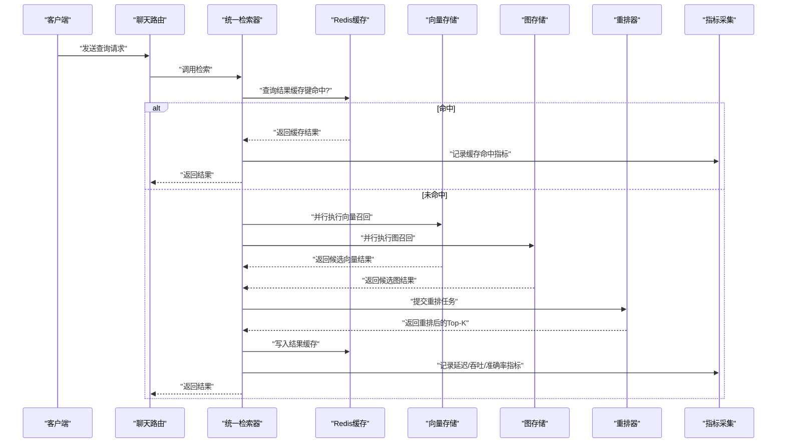
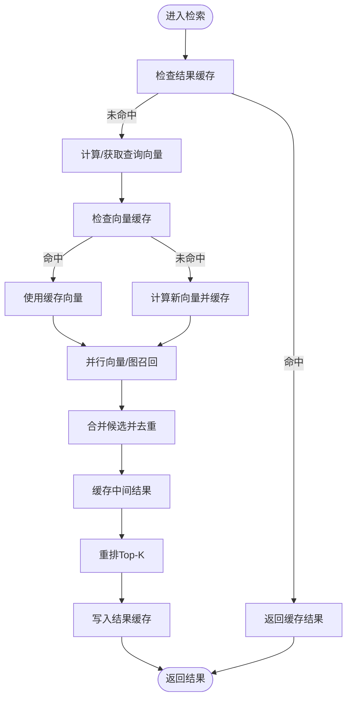
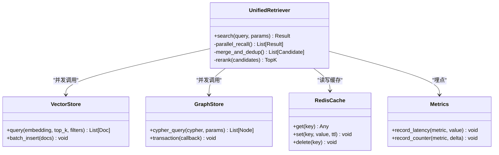
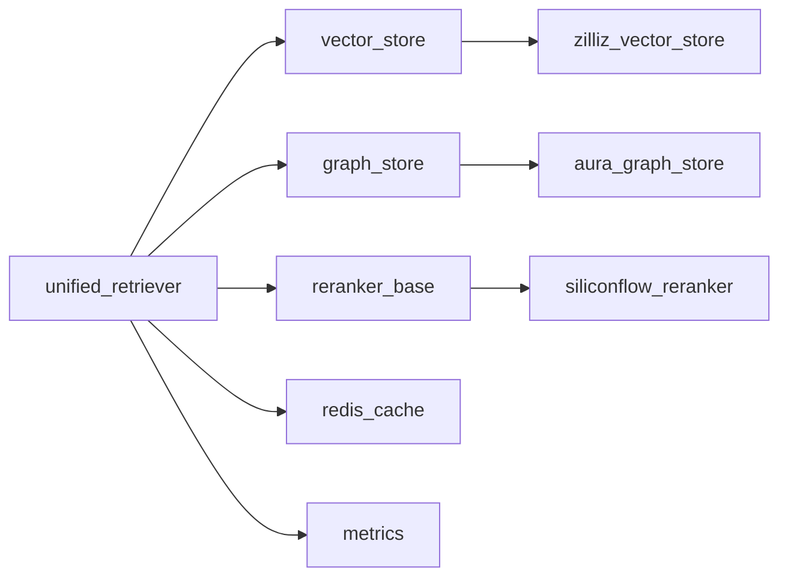

# 检索性能优化

<cite>
**本文引用的文件**   
- [backend_design/nexus/rag/unified_retriever.py](file://backend_design/nexus/rag/unified_retriever.py)
- [backend_design/nexus/rag/retriever.py](file://backend_design/nexus/rag/retriever.py)
- [backend_design/nexus/rag/vector_store.py](file://backend_design/nexus/rag/vector_store.py)
- [backend_design/nexus/rag/zilliz_vector_store.py](file://backend_design/nexus/rag/zilliz_vector_store.py)
- [backend_design/nexus/rag/graph_store.py](file://backend_design/nexus/rag/graph_store.py)
- [backend_design/nexus/rag/aura_graph_store.py](file://backend_design/nexus/rag/aura_graph_store.py)
- [backend_design/nexus/rag/reranker_base.py](file://backend_design/nexus/rag/reranker_base.py)
- [backend_design/nexus/rag/siliconflow_reranker.py](file://backend_design/nexus/rag/siliconflow_reranker.py)
- [backend_design/nexus/middleware/redis_cache.py](file://backend_design/nexus/middleware/redis_cache.py)
- [backend_design/nexus/core/db_manager.py](file://backend_design/nexus/core/db_manager.py)
- [backend_design/nexus/observability/metrics.py](file://backend_design/nexus/observability/metrics.py)
- [backend_design/nexus/observability/cockpit_metrics.py](file://backend_design/nexus/observability/cockpit_metrics.py)
- [backend_design/nexus/api/routes/chat.py](file://backend_design/nexus/api/routes/chat.py)
- [backend_design/nexus/config.py](file://backend_design/nexus/config.py)
- [backend_design/scripts/init_milvus.py](file://backend_design/scripts/init_milvus.py)
- [backend_design/scripts/init_neo4j.py](file://backend_design/scripts/init_neo4j.py)
</cite>

## 目录
1. [简介](#简介)
2. [项目结构](#项目结构)
3. [核心组件](#核心组件)
4. [架构总览](#架构总览)
5. [详细组件分析](#详细组件分析)
6. [依赖关系分析](#依赖关系分析)
7. [性能考量](#性能考量)
8. [故障排查指南](#故障排查指南)
9. [结论](#结论)
10. [附录](#附录)

## 简介
本技术文档聚焦于GraphRAG检索的性能优化，围绕缓存策略、并发检索、数据库层优化、监控指标与压测方法展开。目标是在保证准确率的前提下，显著降低端到端响应时间并提升吞吐量，同时提供可观测性与稳定性保障。

## 项目结构
与检索性能相关的代码主要位于后端nexus模块的rag子系统中，包括统一检索器、向量存储、图存储、重排器以及中间件缓存和可观测性模块。整体采用分层与工厂模式组织：接口抽象（如vector_store、graph_store、reranker）+具体实现（如zilliz_vector_store、aura_graph_store、siliconflow_reranker），并通过unified_retriever聚合多路召回与重排流程。

图表来源
- [backend_design/nexus/api/routes/chat.py](file://backend_design/nexus/api/routes/chat.py)
- [backend_design/nexus/rag/unified_retriever.py](file://backend_design/nexus/rag/unified_retriever.py)
- [backend_design/nexus/rag/retriever.py](file://backend_design/nexus/rag/retriever.py)
- [backend_design/nexus/rag/vector_store.py](file://backend_design/nexus/rag/vector_store.py)
- [backend_design/nexus/rag/zilliz_vector_store.py](file://backend_design/nexus/rag/zilliz_vector_store.py)
- [backend_design/nexus/rag/graph_store.py](file://backend_design/nexus/rag/graph_store.py)
- [backend_design/nexus/rag/aura_graph_store.py](file://backend_design/nexus/rag/aura_graph_store.py)
- [backend_design/nexus/rag/reranker_base.py](file://backend_design/nexus/rag/reranker_base.py)
- [backend_design/nexus/rag/siliconflow_reranker.py](file://backend_design/nexus/rag/siliconflow_reranker.py)
- [backend_design/nexus/middleware/redis_cache.py](file://backend_design/nexus/middleware/redis_cache.py)
- [backend_design/nexus/core/db_manager.py](file://backend_design/nexus/core/db_manager.py)
- [backend_design/nexus/observability/metrics.py](file://backend_design/nexus/observability/metrics.py)
- [backend_design/nexus/observability/cockpit_metrics.py](file://backend_design/nexus/observability/cockpit_metrics.py)
- [backend_design/nexus/config.py](file://backend_design/nexus/config.py)

章节来源
- [backend_design/nexus/rag/unified_retriever.py](file://backend_design/nexus/rag/unified_retriever.py)
- [backend_design/nexus/rag/vector_store.py](file://backend_design/nexus/rag/vector_store.py)
- [backend_design/nexus/rag/graph_store.py](file://backend_design/nexus/rag/graph_store.py)
- [backend_design/nexus/rag/reranker_base.py](file://backend_design/nexus/rag/reranker_base.py)
- [backend_design/nexus/middleware/redis_cache.py](file://backend_design/nexus/middleware/redis_cache.py)
- [backend_design/nexus/observability/metrics.py](file://backend_design/nexus/observability/metrics.py)
- [backend_design/nexus/observability/cockpit_metrics.py](file://backend_design/nexus/observability/cockpit_metrics.py)
- [backend_design/nexus/config.py](file://backend_design/nexus/config.py)

## 核心组件
- 统一检索器：负责将查询向量化后并行发起多路召回（向量、图、关键词等），合并结果并进行重排，最终返回Top-K答案片段或实体。
- 向量存储：封装Milvus/Zilliz等向量数据库操作，支持批量插入、相似度搜索、过滤条件与分页。
- 图存储：封装Neo4j/Aura等图数据库操作，支持Cypher查询、事务与连接池管理。
- 重排器：对召回候选进行二次排序，支持本地模型或远程服务。
- Redis缓存：提供查询结果、嵌入向量与中间结果的缓存能力。
- 指标与日志：记录延迟、吞吐、命中率、错误率等关键指标。

章节来源
- [backend_design/nexus/rag/unified_retriever.py](file://backend_design/nexus/rag/unified_retriever.py)
- [backend_design/nexus/rag/vector_store.py](file://backend_design/nexus/rag/vector_store.py)
- [backend_design/nexus/rag/graph_store.py](file://backend_design/nexus/rag/graph_store.py)
- [backend_design/nexus/rag/reranker_base.py](file://backend_design/nexus/rag/reranker_base.py)
- [backend_design/nexus/middleware/redis_cache.py](file://backend_design/nexus/middleware/redis_cache.py)
- [backend_design/nexus/observability/metrics.py](file://backend_design/nexus/observability/metrics.py)

## 架构总览
下图展示了从API到检索再到存储与重排的完整链路，并标注了缓存与指标埋点位置。

图表来源
- [backend_design/nexus/api/routes/chat.py](file://backend_design/nexus/api/routes/chat.py)
- [backend_design/nexus/rag/unified_retriever.py](file://backend_design/nexus/rag/unified_retriever.py)
- [backend_design/nexus/middleware/redis_cache.py](file://backend_design/nexus/middleware/redis_cache.py)
- [backend_design/nexus/rag/vector_store.py](file://backend_design/nexus/rag/vector_store.py)
- [backend_design/nexus/rag/graph_store.py](file://backend_design/nexus/rag/graph_store.py)
- [backend_design/nexus/rag/reranker_base.py](file://backend_design/nexus/rag/reranker_base.py)
- [backend_design/nexus/observability/metrics.py](file://backend_design/nexus/observability/metrics.py)

## 详细组件分析

### 缓存策略设计
- 查询结果缓存
  - 键生成：基于规范化后的查询文本、用户上下文、召回参数与重排配置哈希。
  - TTL策略：短TTL用于热点问答，长TTL用于静态知识；支持按租户隔离。
  - 失效策略：写扩散（数据更新时主动删除相关键）+读扩散（过期重试）。
- 向量缓存
  - 对高频查询的embedding进行缓存，避免重复计算；键为查询指纹+模型版本。
  - 冷启动预热：在低峰期预取热门查询的向量并写入缓存。
- 中间结果缓存
  - 召回阶段的候选集与图遍历中间节点可缓存，供重排阶段复用。
  - 分片与去重：按租户与查询类型分片，跨路召回后进行ID去重。

图表来源
- [backend_design/nexus/middleware/redis_cache.py](file://backend_design/nexus/middleware/redis_cache.py)
- [backend_design/nexus/rag/unified_retriever.py](file://backend_design/nexus/rag/unified_retriever.py)

章节来源
- [backend_design/nexus/middleware/redis_cache.py](file://backend_design/nexus/middleware/redis_cache.py)
- [backend_design/nexus/rag/unified_retriever.py](file://backend_design/nexus/rag/unified_retriever.py)

### 并发检索优化
- 异步任务调度
  - 使用事件循环并发执行向量召回、图召回与重排准备，避免串行阻塞。
  - 超时控制：为每路召回设置独立超时，失败降级为仅用其他路结果。
- 连接池管理
  - 向量库与图库均维护连接池，限制最大连接数与空闲回收周期。
  - 读写分离：只读查询走只读副本，写入走主库。
- 资源限制
  - 信号量控制并发度，防止下游过载；队列限流保护重排服务。
  - 熔断与退避：对频繁失败的下游服务快速失败并指数退避重试。

图表来源
- [backend_design/nexus/rag/unified_retriever.py](file://backend_design/nexus/rag/unified_retriever.py)
- [backend_design/nexus/rag/vector_store.py](file://backend_design/nexus/rag/vector_store.py)
- [backend_design/nexus/rag/graph_store.py](file://backend_design/nexus/rag/graph_store.py)
- [backend_design/nexus/middleware/redis_cache.py](file://backend_design/nexus/middleware/redis_cache.py)
- [backend_design/nexus/observability/metrics.py](file://backend_design/nexus/observability/metrics.py)

章节来源
- [backend_design/nexus/rag/unified_retriever.py](file://backend_design/nexus/rag/unified_retriever.py)
- [backend_design/nexus/rag/vector_store.py](file://backend_design/nexus/rag/vector_store.py)
- [backend_design/nexus/rag/graph_store.py](file://backend_design/nexus/rag/graph_store.py)
- [backend_design/nexus/middleware/redis_cache.py](file://backend_design/nexus/middleware/redis_cache.py)
- [backend_design/nexus/observability/metrics.py](file://backend_design/nexus/observability/metrics.py)

### 数据库层面优化

#### Milvus索引类型选择
- 常用索引
  - IVF_FLAT：适合中等规模数据，构建快，查询稳定。
  - HNSW：高召回精度与低延迟，适合大规模与高QPS场景。
  - DISKANN：内存受限但数据量大时的折中方案。
- 维度与度量
  - 根据embedding维度选择合适度量（cosine/l2），并在建索引前归一化。
- 分区与过滤
  - 按租户或时间分区，结合标量字段过滤减少扫描范围。
- 批处理与重建
  - 增量写入采用批量插入；定期重建索引以平衡构建时间与查询性能。

章节来源
- [backend_design/nexus/rag/zilliz_vector_store.py](file://backend_design/nexus/rag/zilliz_vector_store.py)
- [backend_design/scripts/init_milvus.py](file://backend_design/scripts/init_milvus.py)

#### Neo4j查询优化
- Cypher优化
  - 使用索引与约束加速匹配；避免全图扫描。
  - 限制返回大小与深度，使用skip/limit分页。
  - 利用WITH聚合减少重复计算。
- 连接与事务
  - 使用会话池与只读事务提高并发读取性能。
  - 大事务拆分，避免长时间持有锁。
- 缓存与物化
  - 对热点路径结果进行缓存；必要时物化视图。

章节来源
- [backend_design/nexus/rag/aura_graph_store.py](file://backend_design/nexus/rag/aura_graph_store.py)
- [backend_design/scripts/init_neo4j.py](file://backend_design/scripts/init_neo4j.py)

#### MySQL索引设计
- 复合索引
  - 针对高频过滤条件建立复合索引，遵循最左前缀原则。
- 覆盖索引
  - 尽量让查询命中覆盖索引，减少回表。
- 统计信息与直方图
  - 定期ANALYZE TABLE，必要时使用直方图改善选择率估计。
- 读写分离与分库分表
  - 读多写少场景下启用只读副本；热点表按业务维度分片。

章节来源
- [backend_design/nexus/core/db_manager.py](file://backend_design/nexus/core/db_manager.py)

### 重排与融合
- 多路召回融合
  - 基于ID去重与分数归一化，采用加权融合或学习排序。
- 重排策略
  - 本地模型重排优先，远端服务作为兜底；支持A/B切换。
- 结果裁剪
  - 控制Top-K与片段长度，减少后续LLM输入成本。

章节来源
- [backend_design/nexus/rag/reranker_base.py](file://backend_design/nexus/rag/reranker_base.py)
- [backend_design/nexus/rag/siliconflow_reranker.py](file://backend_design/nexus/rag/siliconflow_reranker.py)
- [backend_design/nexus/rag/unified_retriever.py](file://backend_design/nexus/rag/unified_retriever.py)

## 依赖关系分析
- 耦合与内聚
  - unified_retriever作为编排层，对内聚召回、融合与重排逻辑，对外暴露简洁接口。
  - vector_store与graph_store通过接口解耦不同实现，便于替换与扩展。
- 外部依赖
  - Redis用于缓存与限流；Milvus/Neo4j作为底层存储；可选远端重排服务。
- 潜在循环依赖
  - 通过接口与工厂模式避免直接循环引用；各模块仅依赖抽象。

图表来源
- [backend_design/nexus/rag/unified_retriever.py](file://backend_design/nexus/rag/unified_retriever.py)
- [backend_design/nexus/rag/vector_store.py](file://backend_design/nexus/rag/vector_store.py)
- [backend_design/nexus/rag/zilliz_vector_store.py](file://backend_design/nexus/rag/zilliz_vector_store.py)
- [backend_design/nexus/rag/graph_store.py](file://backend_design/nexus/rag/graph_store.py)
- [backend_design/nexus/rag/aura_graph_store.py](file://backend_design/nexus/rag/aura_graph_store.py)
- [backend_design/nexus/rag/reranker_base.py](file://backend_design/nexus/rag/reranker_base.py)
- [backend_design/nexus/rag/siliconflow_reranker.py](file://backend_design/nexus/rag/siliconflow_reranker.py)
- [backend_design/nexus/middleware/redis_cache.py](file://backend_design/nexus/middleware/redis_cache.py)
- [backend_design/nexus/observability/metrics.py](file://backend_design/nexus/observability/metrics.py)

章节来源
- [backend_design/nexus/rag/unified_retriever.py](file://backend_design/nexus/rag/unified_retriever.py)
- [backend_design/nexus/rag/vector_store.py](file://backend_design/nexus/rag/vector_store.py)
- [backend_design/nexus/rag/graph_store.py](file://backend_design/nexus/rag/graph_store.py)
- [backend_design/nexus/rag/reranker_base.py](file://backend_design/nexus/rag/reranker_base.py)
- [backend_design/nexus/middleware/redis_cache.py](file://backend_design/nexus/middleware/redis_cache.py)
- [backend_design/nexus/observability/metrics.py](file://backend_design/nexus/observability/metrics.py)

## 性能考量
- 端到端延迟分解
  - 网络往返、向量化、向量检索、图遍历、重排、序列化与缓存命中。
- 吞吐与容量规划
  - 根据QPS与P99延迟目标，估算向量与图库所需实例规格与连接池上限。
- 缓存命中率
  - 目标命中率>70%（热点场景），否则调整TTL与键粒度。
- 重排成本
  - 本地模型优先，远端服务限流与降级；控制候选数量以降低重排开销。
- 资源隔离
  - 按租户或业务域隔离连接池与线程池，避免相互影响。

## 故障排查指南
- 常见问题
  - 缓存穿透：空结果也缓存短TTL；布隆过滤器拦截恶意查询。
  - 缓存雪崩：随机化TTL与错峰刷新。
  - 连接泄漏：监控连接池使用率与活跃会话，及时释放。
  - 重排超时：增加超时阈值与降级策略，记录失败原因。
- 定位技巧
  - 查看指标面板中的延迟分布、错误率与缓存命中率。
  - 追踪关键请求ID，串联API、检索、存储与重排日志。
  - 对慢查询进行采样分析，识别热点键与瓶颈节点。

章节来源
- [backend_design/nexus/observability/metrics.py](file://backend_design/nexus/observability/metrics.py)
- [backend_design/nexus/observability/cockpit_metrics.py](file://backend_design/nexus/observability/cockpit_metrics.py)
- [backend_design/nexus/middleware/redis_cache.py](file://backend_design/nexus/middleware/redis_cache.py)

## 结论
通过多级缓存、并发召回与重排、数据库索引与连接池优化，以及完善的指标与压测体系，可在保证准确率的同时显著提升GraphRAG检索性能。建议持续监控关键指标并根据业务变化动态调优。

## 附录

### 监控指标定义与采集
- 响应时间
  - P50/P90/P99延迟、首字节延迟、端到端耗时。
- 吞吐量
  - QPS、每秒召回条目数、重排条目数。
- 准确率
  - 召回命中率、Top-K准确率、重排前后NDCG（离线评估）。
- 缓存
  - 命中率、平均TTL、键空间大小、淘汰率。
- 资源
  - CPU/内存占用、连接池使用率、下游服务错误率。

章节来源
- [backend_design/nexus/observability/metrics.py](file://backend_design/nexus/observability/metrics.py)
- [backend_design/nexus/observability/cockpit_metrics.py](file://backend_design/nexus/observability/cockpit_metrics.py)

### 压力测试方法与瓶颈定位
- 压测工具
  - 使用HTTP压测工具模拟真实负载，逐步提升并发至系统饱和。
- 场景设计
  - 热点查询、长尾查询、混合负载（向量/图/重排比例可调）。
- 指标采集
  - 压测期间采集延迟分布、错误率、缓存命中率与资源使用。
- 瓶颈定位
  - 通过火焰图与慢查询日志定位CPU/IO热点；对比不同索引与连接池参数的效果。

章节来源
- [backend_design/nexus/api/routes/chat.py](file://backend_design/nexus/api/routes/chat.py)
- [backend_design/nexus/config.py](file://backend_design/nexus/config.py)