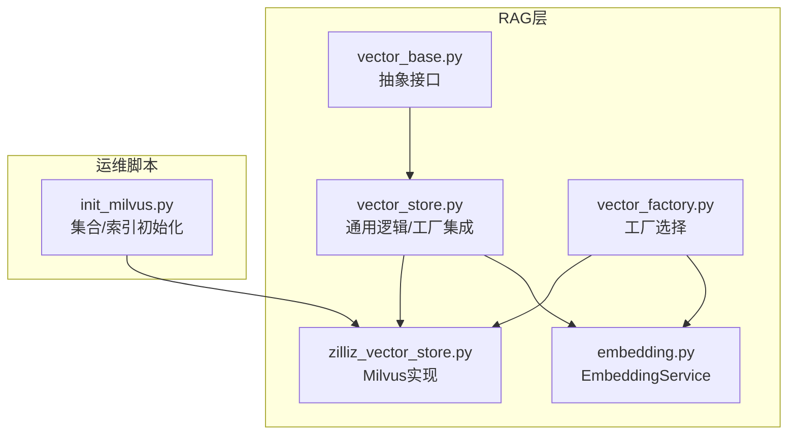
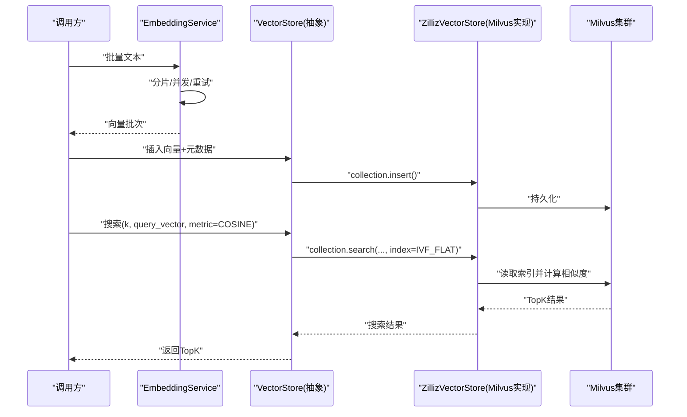
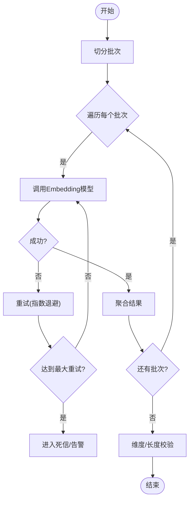
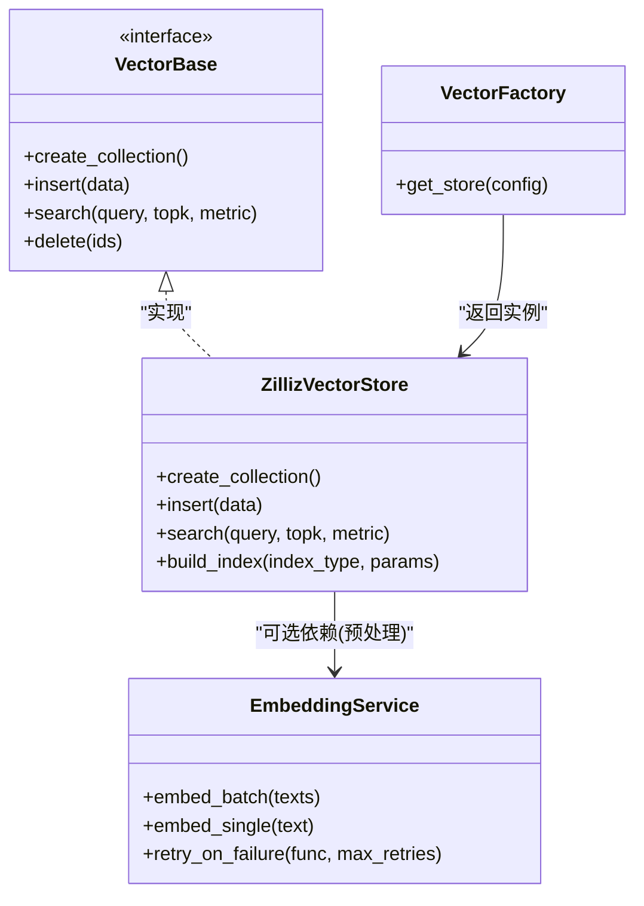
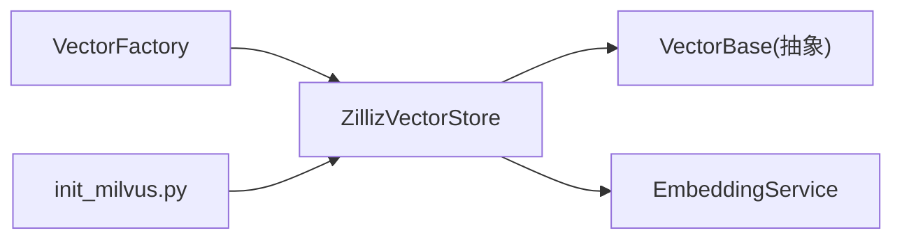

# 向量索引构建

<cite>
**本文引用的文件**   
- [backend_design/nexus/rag/vector_store.py](file://backend_design/nexus/rag/vector_store.py)
- [backend_design/nexus/rag/zilliz_vector_store.py](file://backend_design/nexus/rag/zilliz_vector_store.py)
- [backend_design/nexus/rag/embedding.py](file://backend_design/nexus/rag/embedding.py)
- [backend_design/nexus/rag/vector_base.py](file://backend_design/nexus/rag/vector_base.py)
- [backend_design/nexus/rag/vector_factory.py](file://backend_design/nexus/rag/vector_factory.py)
- [backend_design/scripts/init_milvus.py](file://backend_design/scripts/init_milvus.py)
</cite>

## 目录
1. [简介](#简介)
2. [项目结构](#项目结构)
3. [核心组件](#核心组件)
4. [架构总览](#架构总览)
5. [详细组件分析](#详细组件分析)
6. [依赖关系分析](#依赖关系分析)
7. [性能考虑](#性能考虑)
8. [故障排查指南](#故障排查指南)
9. [结论](#结论)
10. [附录](#附录)

## 简介
本技术文档聚焦于向量索引构建系统，围绕Milvus集合的Schema设计、IVF_FLAT索引创建流程（含nlist参数调优与COSINE相似度度量）、EmbeddingService批量向量化处理（异步与重试机制），以及索引性能监控与优化策略展开。文档旨在帮助读者理解从数据入库到检索的全链路实现细节，并提供可操作的调优建议。

## 项目结构
与向量索引构建相关的代码主要位于后端RAG模块与初始化脚本中：
- RAG层提供统一的向量存储抽象与具体实现（Milvus/Zilliz）
- Embedding服务负责文本到向量的转换
- 初始化脚本用于在Milvus中创建集合与索引

图表来源
- [backend_design/nexus/rag/vector_base.py](file://backend_design/nexus/rag/vector_base.py)
- [backend_design/nexus/rag/vector_store.py](file://backend_design/nexus/rag/vector_store.py)
- [backend_design/nexus/rag/zilliz_vector_store.py](file://backend_design/nexus/rag/zilliz_vector_store.py)
- [backend_design/nexus/rag/embedding.py](file://backend_design/nexus/rag/embedding.py)
- [backend_design/nexus/rag/vector_factory.py](file://backend_design/nexus/rag/vector_factory.py)
- [backend_design/scripts/init_milvus.py](file://backend_design/scripts/init_milvus.py)

章节来源
- [backend_design/nexus/rag/vector_store.py](file://backend_design/nexus/rag/vector_store.py)
- [backend_design/nexus/rag/zilliz_vector_store.py](file://backend_design/nexus/rag/zilliz_vector_store.py)
- [backend_design/nexus/rag/embedding.py](file://backend_design/nexus/rag/embedding.py)
- [backend_design/nexus/rag/vector_base.py](file://backend_design/nexus/rag/vector_base.py)
- [backend_design/nexus/rag/vector_factory.py](file://backend_design/nexus/rag/vector_factory.py)
- [backend_design/scripts/init_milvus.py](file://backend_design/scripts/init_milvus.py)

## 核心组件
- 向量存储抽象与实现
  - vector_base.py：定义统一的向量存储接口（如集合管理、插入、查询、删除等）
  - zilliz_vector_store.py：基于Milvus的具体实现，封装集合创建、索引构建、搜索等能力
  - vector_store.py：聚合通用逻辑并与工厂结合，便于在不同后端间切换
- Embedding服务
  - embedding.py：提供文本到向量转换能力，支持批量处理、并发控制与错误重试
- 工厂模式
  - vector_factory.py：根据配置或运行时条件返回具体的向量存储实现
- 初始化脚本
  - init_milvus.py：在Milvus中创建集合、字段、索引，确保运行期可用

章节来源
- [backend_design/nexus/rag/vector_base.py](file://backend_design/nexus/rag/vector_base.py)
- [backend_design/nexus/rag/zilliz_vector_store.py](file://backend_design/nexus/rag/zilliz_vector_store.py)
- [backend_design/nexus/rag/vector_store.py](file://backend_design/nexus/rag/vector_store.py)
- [backend_design/nexus/rag/embedding.py](file://backend_design/nexus/rag/embedding.py)
- [backend_design/nexus/rag/vector_factory.py](file://backend_design/nexus/rag/vector_factory.py)
- [backend_design/scripts/init_milvus.py](file://backend_design/scripts/init_milvus.py)

## 架构总览
下图展示了从文本输入到向量检索的关键路径：EmbeddingService将文本转换为向量，VectorStore负责写入Milvus并维护索引；查询时通过相同流程生成查询向量并在Milvus上执行近似最近邻搜索。

图表来源
- [backend_design/nexus/rag/embedding.py](file://backend_design/nexus/rag/embedding.py)
- [backend_design/nexus/rag/vector_store.py](file://backend_design/nexus/rag/vector_store.py)
- [backend_design/nexus/rag/zilliz_vector_store.py](file://backend_design/nexus/rag/zilliz_vector_store.py)

## 详细组件分析

### Milvus集合Schema设计
- 字段类型与约束
  - 主键字段：通常使用自增整型或字符串ID，作为唯一标识
  - 向量字段：固定维度浮点向量，需声明数据类型为浮点向量，并设置维度大小
  - 标量字段：用于过滤与展示（如文本摘要、时间戳、业务ID等），选择合适的标量类型以支持过滤与排序
- 设计要点
  - 向量维度应与Embedding模型输出一致
  - 标量字段尽量精简，避免过多高基数字段影响索引与查询性能
  - 合理命名与注释，便于后续维护与排障

章节来源
- [backend_design/nexus/rag/zilliz_vector_store.py](file://backend_design/nexus/rag/zilliz_vector_store.py)
- [backend_design/scripts/init_milvus.py](file://backend_design/scripts/init_milvus.py)

### IVF_FLAT索引创建与参数调优
- 索引类型与度量
  - 索引类型：IVF_FLAT
  - 相似度度量：COSINE（余弦相似度）
- nlist参数调优
  - nlist表示倒排列表数量，越大召回越准但构建与查询开销越高
  - 经验范围：数据规模较小时取较小值，大规模数据逐步增大并结合QPS与延迟目标进行压测
- 构建时机
  - 建议在批量导入完成后一次性构建索引，减少频繁重建带来的抖动
- 其他相关参数
  - nprobe：搜索时的探针数，越大精度越高但延迟增加
  - 与内存预算、CPU核数的协同调优

章节来源
- [backend_design/nexus/rag/zilliz_vector_store.py](file://backend_design/nexus/rag/zilliz_vector_store.py)
- [backend_design/scripts/init_milvus.py](file://backend_design/scripts/init_milvus.py)

### EmbeddingService批量向量化处理流程
- 批量与并发
  - 将大批量文本切分为多个批次，按并发度并行提交给底层Embedding模型
  - 控制并发以避免下游限流或OOM
- 错误重试机制
  - 对网络异常、超时、模型不可用等错误进行指数退避重试
  - 记录失败样本以便离线重跑与人工复核
- 结果聚合与校验
  - 合并各批次结果，校验向量维度与长度一致性
  - 对异常样本打标签并进入死信队列或告警通道

图表来源
- [backend_design/nexus/rag/embedding.py](file://backend_design/nexus/rag/embedding.py)

章节来源
- [backend_design/nexus/rag/embedding.py](file://backend_design/nexus/rag/embedding.py)

### 类与关系图（代码级）

图表来源
- [backend_design/nexus/rag/vector_base.py](file://backend_design/nexus/rag/vector_base.py)
- [backend_design/nexus/rag/zilliz_vector_store.py](file://backend_design/nexus/rag/zilliz_vector_store.py)
- [backend_design/nexus/rag/embedding.py](file://backend_design/nexus/rag/embedding.py)
- [backend_design/nexus/rag/vector_factory.py](file://backend_design/nexus/rag/vector_factory.py)

章节来源
- [backend_design/nexus/rag/vector_base.py](file://backend_design/nexus/rag/vector_base.py)
- [backend_design/nexus/rag/zilliz_vector_store.py](file://backend_design/nexus/rag/zilliz_vector_store.py)
- [backend_design/nexus/rag/embedding.py](file://backend_design/nexus/rag/embedding.py)
- [backend_design/nexus/rag/vector_factory.py](file://backend_design/nexus/rag/vector_factory.py)

## 依赖关系分析
- 耦合与内聚
  - VectorBase与ZillizVectorStore形成清晰的抽象-实现解耦，便于替换后端
  - EmbeddingService相对独立，可通过工厂注入到上层流程
- 外部依赖
  - Milvus客户端库（由ZillizVectorStore内部使用）
  - Embedding模型服务（本地或远程）
- 潜在循环依赖
  - 当前结构未见明显循环依赖；保持EmbeddingService与VectorStore单向依赖更安全

图表来源
- [backend_design/nexus/rag/vector_factory.py](file://backend_design/nexus/rag/vector_factory.py)
- [backend_design/nexus/rag/zilliz_vector_store.py](file://backend_design/nexus/rag/zilliz_vector_store.py)
- [backend_design/nexus/rag/vector_base.py](file://backend_design/nexus/rag/vector_base.py)
- [backend_design/nexus/rag/embedding.py](file://backend_design/nexus/rag/embedding.py)
- [backend_design/scripts/init_milvus.py](file://backend_design/scripts/init_milvus.py)

章节来源
- [backend_design/nexus/rag/vector_factory.py](file://backend_design/nexus/rag/vector_factory.py)
- [backend_design/nexus/rag/zilliz_vector_store.py](file://backend_design/nexus/rag/zilliz_vector_store.py)
- [backend_design/nexus/rag/vector_base.py](file://backend_design/nexus/rag/vector_base.py)
- [backend_design/nexus/rag/embedding.py](file://backend_design/nexus/rag/embedding.py)
- [backend_design/scripts/init_milvus.py](file://backend_design/scripts/init_milvus.py)

## 性能考虑
- 内存使用分析
  - 观察Milvus节点内存占用与GC行为，避免单次插入过大导致峰值过高
  - EmbeddingService侧控制批大小与并发度，防止本地进程OOM
- 查询延迟优化
  - 调整nprobe与topk平衡精度与延迟
  - 合理设置nlist，使索引大小与数据规模匹配
  - 对热点查询做缓存（如Redis），降低重复计算
- 构建与更新策略
  - 增量更新时采用“先写后建”的策略，定时统一重建索引
  - 冷数据归档与热数据分层，提升整体吞吐
- 监控指标
  - 构建耗时、索引大小、查询P95/P99延迟、错误率、重试次数
  - 资源利用率（CPU、内存、磁盘IO）

[本节为通用指导，不直接分析具体文件]

## 故障排查指南
- 常见问题定位
  - 向量维度不一致：检查Embedding模型输出与集合Schema维度是否一致
  - 索引未生效：确认索引已构建且处于可用状态
  - 搜索结果为空：检查过滤条件与nprobe/topk设置
- 日志与追踪
  - 在EmbeddingService与VectorStore关键路径埋点，记录批次大小、耗时、错误码
  - 对重试失败的样本保留原始输入与上下文，便于复现
- 恢复策略
  - 死信队列中的样本离线重跑
  - 索引损坏时重建集合与索引，并回滚至最近稳定版本

章节来源
- [backend_design/nexus/rag/embedding.py](file://backend_design/nexus/rag/embedding.py)
- [backend_design/nexus/rag/zilliz_vector_store.py](file://backend_design/nexus/rag/zilliz_vector_store.py)

## 结论
通过清晰的抽象与实现分离、稳健的批量嵌入与重试机制、合理的IVF_FLAT索引设计与参数调优，本系统能够在保证检索精度的同时获得稳定的延迟表现。配合完善的监控与故障恢复策略，可在生产环境中持续演进与优化。

[本节为总结性内容，不直接分析具体文件]

## 附录
- 术语
  - IVF_FLAT：倒排文件索引，适用于大规模向量近似最近邻搜索
  - COSINE：余弦相似度度量，衡量向量方向相似性
  - nlist：倒排列表数量，影响索引构建与查询性能
  - nprobe：搜索探针数，影响召回精度与延迟

[本节为概念说明，不直接分析具体文件]